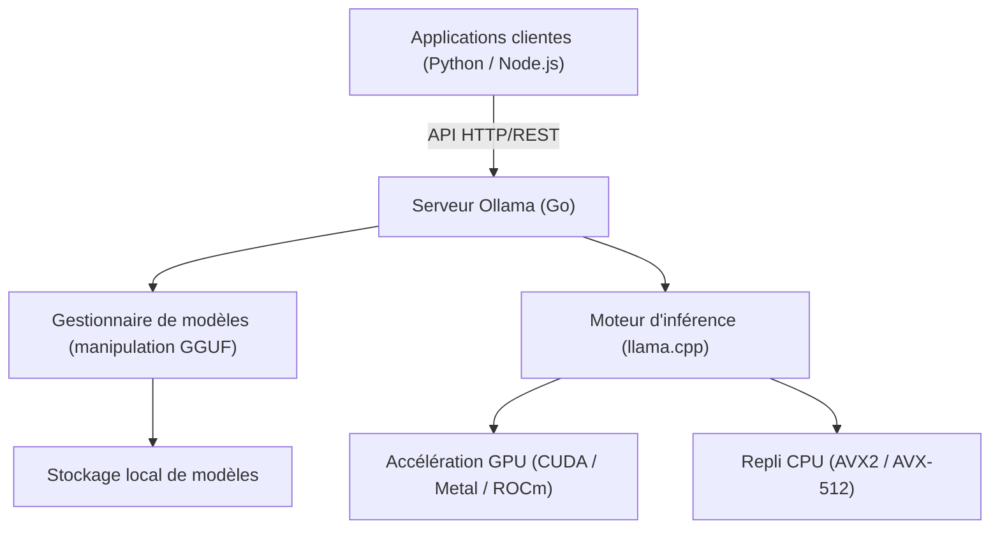
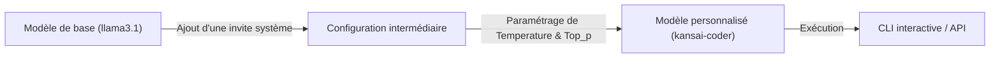

# Introduction : Pourquoi avons-nous besoin d'un LLM local ?

Avec l'essor des grands modèles de langage (LLM), nos modes de vie et nos méthodes de développement ont subi des changements radicaux. Les puissants services d'IA basés sur le cloud, tels que ChatGPT, Claude et Gemini, continuent d'évoluer chaque jour, offrant des capacités de raisonnement extrêmement avancées. Cependant, les LLM basés sur le cloud ne sont pas toujours optimaux pour tous les cas d'utilisation. Les LLM cloud présentent les défis suivants :

1. **Problèmes de confidentialité et de sécurité** : L'envoi de données contenant des informations confidentielles ou personnelles vers des serveurs externes est souvent inacceptable du point de vue de la conformité de l'entreprise et de la sécurité.
2. **Incertitude des coûts** : Comme les frais d'utilisation de l'API dépendent du nombre de jetons, les systèmes effectuant des traitements de données à grande échelle ou des requêtes fréquentes courent le risque de voir leurs coûts de fonctionnement exploser.
3. **Latence et dépendance au réseau** : Pour une utilisation dans des environnements hors ligne ou pour une exécution sur des appareils de pointe (edge devices) nécessitant une latence extrêmement faible, la communication réseau devient un goulot d'étranglement.
4. **Enfermement propriétaire (Vendor lock-in)** : La dépendance au modèle d'un fournisseur spécifique peut vous exposer à des risques tels que l'arrêt futur du service, des modifications des conditions d'utilisation, ou des changements de comportement inattendus dus aux mises à jour du modèle.

Pour résoudre ces défis, le "LLM local" attire de plus en plus l'attention. En exécutant des modèles sur votre propre matériel, vous pouvez utiliser librement l'IA sans envoyer aucune donnée à l'extérieur ni vous soucier des frais mensuels.

Dans cet article, nous expliquerons en détail "**Ollama**", un outil qui permet d'introduire, de gérer et d'intégrer des API de LLM locaux avec une facilité surprenante. Nous couvrirons tout, de ses bases et de son architecture interne, à l'intégration avancée d'API en utilisant Python et Node.js, jusqu'aux formules mathématiques d'optimisation des performances.

---

# Qu'est-ce qu'Ollama ? Son architecture interne

Ollama est une plateforme qui permet d'exécuter et de gérer facilement de grands modèles de langage open-source (Llama 3, Phi-3, Mistral, Gemma, etc.) dans un environnement local. Auparavant, la configuration d'un environnement LLM local nécessitait des procédures très fastidieuses, telles que la configuration de l'environnement Python, l'installation du kit d'outils CUDA, la résolution des dépendances PyTorch, le téléchargement d'énormes fichiers de modèles depuis Hugging Face et la conversion de formats (par exemple de Safetensors à GGUF).

Ollama masque ces complexités et permet de manipuler les LLM avec une facilité d'utilisation similaire à Docker. Avec une seule commande, vous pouvez télécharger un modèle (`pull`), l'exécuter (`run`) et le lancer en tant que serveur HTTP.

## Technologie de base : un wrapper pour llama.cpp

L'arrière-plan du moteur d'inférence d'Ollama est propulsé par "**llama.cpp**", une bibliothèque d'inférence de LLM rapide implémentée en C/C++. llama.cpp a la capacité d'exécuter des modèles en tirant parti au maximum des performances matérielles, que ce soit sur Apple Silicon (Metal), NVIDIA GPU (CUDA), AMD GPU (ROCm) ou même dans des environnements limités au CPU.

Ollama intègre llama.cpp et adopte une architecture où un processus serveur écrit en langage Go fournit une API REST et appelle le moteur d'inférence de llama.cpp en arrière-plan.

Le diagramme Mermaid ci-dessous montre l'architecture globale d'Ollama.



Grâce à cette architecture, les développeurs peuvent utiliser des capacités d'inférence avancées via des requêtes HTTP standard sans se soucier des compilations C++ ou de la configuration complexe des pilotes GPU.

---

# Installation et configuration initiale d'Ollama

L'installation d'Ollama est extrêmement simple. Des binaires optimisés pour chaque système d'exploitation sont fournis.

## macOS / Windows

Il vous suffit de télécharger l'installateur depuis le site officiel (https://ollama.com/) et de l'exécuter. La version macOS reconnaît automatiquement l'API Metal d'Apple Silicon, et la version Windows reconnaît les GPU NVIDIA (CUDA), activant l'accélération matérielle lorsque c'est possible.

## Linux

Dans les environnements Linux (comme Ubuntu), il suffit d'exécuter la commande d'une ligne suivante pour installer les composants nécessaires et démarrer le serveur Ollama en tant que service systemd.

```bash
curl -fsSL https://ollama.com/install.sh | sh
```

Une fois l'installation terminée, vérifions la version dans le terminal.

```bash
ollama --version
```
Si les informations de version s'affichent, l'installation a réussi.

## Exécution avec Docker

Si vous ne souhaitez pas altérer votre environnement existant ou si vous voulez l'intégrer à une infrastructure basée sur des conteneurs, vous pouvez également utiliser l'image Docker officielle. Si vous utilisez un GPU, l'installation du NVIDIA Container Toolkit est requise.

```bash
# En cas d'exécution sur le CPU uniquement
docker run -d -v ollama:/root/.ollama -p 11434:11434 --name ollama ollama/ollama

# En cas d'utilisation d'un GPU NVIDIA
docker run -d --gpus=all -v ollama:/root/.ollama -p 11434:11434 --name ollama ollama/ollama
```

Par défaut, le serveur Ollama écoute sur `http://localhost:11434`.

---

# Gestion des modèles et commandes CLI de base

Le plus grand attrait d'Ollama est que la gestion des modèles est très intuitive. Vous pouvez essayer divers modèles de la même manière que vous manipulez des images Docker.

## 1. Exécuter un modèle (`run`)

C'est la commande que vous utiliserez le plus fréquemment. Si le modèle spécifié n'existe pas, il sera automatiquement téléchargé (`pull`), puis une invite de commande interactive s'ouvrira.

```bash
ollama run llama3.1
```

L'exécution de la commande ci-dessus démarre Llama 3.1 (version avec 8B de paramètres), le modèle le plus récent de Meta. Lorsque vous saisissez un message dans l'invite, la réponse du modèle s'affiche en streaming. Pour quitter, saisissez `/bye` ou appuyez sur `Ctrl+D`.

## 2. Télécharger un modèle (`pull`)

Si vous souhaitez télécharger des modèles en arrière-plan, utilisez la commande `pull`.

```bash
ollama pull phi3:instruct
ollama pull mistral:v0.3
```

Dans la bibliothèque de modèles d'Ollama, vous pouvez spécifier les versions et les niveaux de quantification sous la forme `nom_du_modèle:tag`. Si la balise est omise, `latest` (la plus récente) est appliquée, mais vous pouvez également spécifier explicitement un modèle quantifié particulier (par exemple : `llama3:8b-instruct-q4_0`).

### Qu'est-ce que la quantification (Quantization) ?

Abordons brièvement la quantification. Les LLM normaux conservent un paramètre de poids sous forme de nombre à virgule flottante de 16 bits (FP16), par exemple. Pour un modèle de 8 milliards (8B) de paramètres, les poids seuls consommeront environ 16 Go de VRAM. La quantification est une technologie qui compresse cela dans un format entier de 4 bits (Q4) ou de 8 bits (Q8).

La quantification peut réduire considérablement la quantité de mémoire et de bande passante mémoire requises tout en minimisant la dégradation de la précision du modèle. Les modèles distribués par Ollama sont par défaut au format GGUF avec une quantification optimale appliquée (souvent 4 bits).

## 3. Lister les modèles (`list`)

Affiche une liste des modèles téléchargés localement et leurs tailles.

```bash
ollama list
```
Exemple de sortie :
```text
NAME            ID              SIZE      MODIFIED
llama3.1:latest 43f7a214e532    4.7 GB    2 hours ago
phi3:instruct   a2c89ceaed85    2.3 GB    3 days ago
```

## 4. Supprimer un modèle (`rm`)

Supprime les modèles devenus inutiles pour libérer de l'espace disque.

```bash
ollama rm phi3:instruct
```

---

# Personnalisation de modèle avec un Modelfile

Dans Ollama, vous pouvez utiliser un mécanisme appelé "**Modelfile**" pour injecter des invites système ou ajuster les hyperparamètres sur des modèles existants, vous permettant ainsi de créer vos propres modèles personnalisés. C'est exactement le même concept que le Dockerfile pour Docker.

Le diagramme ci-dessous illustre comment un modèle personnalisé dérive d'un modèle de base.



À titre d'exemple, créons un modèle d'assistant de programmation qui répond en dialecte du Kansai (Kansai-ben).

Créez un fichier texte nommé `Modelfile` dans votre répertoire de travail et écrivez ce qui suit :

```text
# Spécifier le modèle de base
FROM llama3.1

# Configurer les hyperparamètres comme la créativité (temperature)
PARAMETER temperature 0.7
PARAMETER top_p 0.9
PARAMETER repeat_penalty 1.1
PARAMETER num_ctx 4096

# Définir l'invite système
SYSTEM """
Vous êtes un ingénieur logiciel senior de classe mondiale.
Veuillez toujours répondre aux questions techniques des utilisateurs de manière amicale en utilisant le « dialecte du Kansai ».
Lorsque vous fournissez des exemples de code, proposez un code moderne qui suit les meilleures pratiques.
"""
```

Construisez (créez) un nouveau modèle à partir de ce Modelfile.

```bash
ollama create kansai-coder -f Modelfile
```

Une fois la compilation terminée, exécutez-le pour le tester.

```bash
ollama run kansai-coder
>>> Comment je peux trier une liste en Python ?
```
Il fera alors preuve d'un comportement personnalisé, répondant par exemple : "Et bien, tu peux utiliser la fonction `sorted()` ou la méthode `sort()` de Python !". De cette façon, il devient possible de créer et de gérer localement un nombre illimité d'agents spécialisés pour des cas d'utilisation spécifiques.

---

# Explication détaillée de l'API REST d'Ollama

Bien que l'interaction via le CLI soit pratique, c'est avec sa puissante API REST qu'Ollama révèle tout son potentiel dans le développement d'applications réelles. Vous pouvez obtenir des résultats d'inférence en envoyant des requêtes HTTP au processus serveur (par défaut `http://localhost:11434`).

Les 3 principaux points de terminaison (endpoints) sont :
1. `/api/generate` : Génération de texte à partir d'une simple invite
2. `/api/chat` : Génération de chat (dialogue) dans un format similaire à l'API OpenAI
3. `/api/embeddings` : Génération de plongements vectoriels (Embeddings)

## Génération de texte avec /api/generate

C'est le point de terminaison de génération le plus basique. Envoyons une requête en utilisant cURL.

```bash
curl -X POST http://localhost:11434/api/generate -d '{
  "model": "llama3.1",
  "prompt": "Explain the concept of quantum entanglement in simple terms.",
  "stream": false
}'
```

En spécifiant `"stream": false`, un objet JSON est renvoyé en une seule fois après la fin de la génération complète. Par défaut (qui est `true`), les jetons générés sont envoyés de manière séquentielle au format JSON Lines, ce qui est idéal pour implémenter une interface utilisateur en streaming.

Exemple de réponse (partiellement omise) :
```json
{
  "model": "llama3.1",
  "created_at": "2026-09-11T10:00:00.000Z",
  "response": "Quantum entanglement is like having a pair of magical dice...",
  "done": true,
  "context": [128006, 882, 128007, 271, 10445],
  "total_duration": 4567890000,
  "load_duration": 1234000,
  "prompt_eval_count": 14,
  "eval_count": 256,
  "eval_duration": 4321000000
}
```
Le tableau `context` contient l'état de la conversation passée encodé, ce qui permet de maintenir le contexte en l'incluant dans la requête suivante. Cependant, pour gérer plus facilement l'historique des conversations, nous utiliserons l'endpoint suivant `/api/chat`.

## Génération de dialogue avec /api/chat

Puisque les LLM récents sont affinés (fine-tunés) dans un format de chat, il est recommandé d'utiliser `/api/chat` pour le développement d'applications.

```bash
curl -X POST http://localhost:11434/api/chat -d '{
  "model": "llama3.1",
  "messages": [
    { "role": "system", "content": "You are a helpful AI assistant." },
    { "role": "user", "content": "What is the capital of France?" },
    { "role": "assistant", "content": "The capital of France is Paris." },
    { "role": "user", "content": "What is its famous tower?" }
  ],
  "stream": false
}'
```
Ainsi, en transmettant un tableau d'objets messages avec des rôles (`role`: system, user, assistant), vous pouvez facilement gérer des contextes de dialogue complexes.

---

# Intégration avec des applications Python

Python est le langage le plus standard dans le développement de l'IA. Bien qu'il existe plusieurs façons d'utiliser Ollama depuis Python, l'utilisation du package officiel `ollama-python` est la méthode la plus simple et la plus fiable.

## Installation

```bash
pip install ollama
```

## Utilisation de l'API synchrone

Voici le code de base pour générer un chat.

```python
import ollama

# Liste pour conserver l'historique du chat
messages = [
    {'role': 'system', 'content': 'Vous êtes un excellent assistant.'}
]

def chat_with_ollama(user_input):
    messages.append({'role': 'user', 'content': user_input})
    
    # Appel de l'API Ollama
    response = ollama.chat(
        model='llama3.1',
        messages=messages
    )
    
    assistant_reply = response['message']['content']
    messages.append({'role': 'assistant', 'content': assistant_reply})
    
    return assistant_reply

print(chat_with_ollama("Quelles sont les trois principales approches de l'apprentissage automatique ?"))
```

## Utilisation du streaming asynchrone (Async Streaming)

Lors du développement d'applications Web (FastAPI, Starlette) ou de bots pour Discord / Slack, il est important d'utiliser l'API asynchrone et le streaming pour éviter les blocages.

```python
import asyncio
from ollama import AsyncClient

async def generate_stream():
    client = AsyncClient()
    
    # Spécifier stream=True renvoie un générateur asynchrone
    async for chunk in await client.chat(
        model='llama3.1',
        messages=[{'role': 'user', 'content': 'Explique en détail les décorateurs en Python.'}],
        stream=True
    ):
        # Affichage séquentiel sur la sortie standard par morceau (chunk)
        print(chunk['message']['content'], end='', flush=True)
        
    print() # Saut de ligne final

# Exécuter la fonction asynchrone
asyncio.run(generate_stream())
```
En écrivant de cette façon, vous pouvez facilement implémenter une expérience utilisateur (UX) où les caractères s'affichent un par un, tout comme dans l'interface de ChatGPT.

## Intégration avec LangChain et LlamaIndex

Ollama est également pris en charge de manière native par LangChain et LlamaIndex, qui sont souvent utilisés lors de la construction de systèmes RAG (Retrieval-Augmented Generation).

Exemple avec LangChain :
```python
from langchain_community.llms import Ollama

llm = Ollama(model="llama3.1")
response = llm.invoke("Explain dark matter.")
print(response)
```
Il est possible d'exécuter localement les puissantes fonctionnalités de chaînes et d'agents de LangChain sans configurer aucune clé d'API externe.

---

# Intégration avec des applications Node.js

Pour les ingénieurs front-end ou les développeurs full-stack, pouvoir appeler un LLM local à partir d'un environnement TypeScript/Node.js est un énorme avantage. Nous utiliserons le package NPM officiel `ollama`.

## Installation

```bash
npm install ollama
```

## Exemple d'implémentation d'un chatbot utilisant TypeScript

```typescript
import ollama, { Message } from 'ollama';

async function runChatbot() {
  const messages: Message[] = [
    { role: 'system', content: 'You are a concise expert.' },
    { role: 'user', content: 'Explain RESTful APIs.' }
  ];

  try {
    const response = await ollama.chat({
      model: 'llama3.1',
      messages: messages,
      stream: false,
    });
    
    console.log("Assistant:", response.message.content);
  } catch (error) {
    console.error("Error communicating with Ollama:", error);
  }
}

runChatbot();
```

## Création d'un serveur Express prenant en charge le streaming

Voici un exemple d'implémentation d'une API backend qui renvoie une réponse en streaming à un frontend Web. Des morceaux (chunks) sont envoyés à l'aide de SSE (Server-Sent Events) ou du streaming HTTP normal.

```javascript
import express from 'express';
import { Ollama } from 'ollama';

const app = express();
app.use(express.json());
const ollama = new Ollama({ host: 'http://127.0.0.1:11434' });

app.post('/api/stream-chat', async (req, res) => {
  const { prompt } = req.body;

  // Configuration des en-têtes de réponse HTTP (transfert par blocs)
  res.setHeader('Content-Type', 'text/plain; charset=utf-8');
  res.setHeader('Transfer-Encoding', 'chunked');

  try {
    const stream = await ollama.generate({
      model: 'llama3.1',
      prompt: prompt,
      stream: true,
    });

    for await (const chunk of stream) {
      res.write(chunk.response);
    }
    res.end();
  } catch (err) {
    res.status(500).write("Error generating response.");
    res.end();
  }
});

app.listen(3000, () => {
  console.log('Server is running on port 3000');
});
```

---

# Métriques de performance et analyse mathématique

Pour offrir un LLM local à un niveau viable pour une utilisation en production, l'analyse de la latence et du débit est indispensable. Les réponses de l'API d'Ollama incluent des métriques détaillées concernant les performances.

## Modèle de calcul de la vitesse de génération de jetons

Le temps de réponse du LLM, directement lié à l'expérience utilisateur, peut être principalement décomposé en "**Time To First Token (TTFT)**" et "**Time Per Output Token (TPOT)**".

Le temps de génération total $T_{total}$, avec $N$ comme nombre de jetons générés, est formulé comme suit :

$$
T_{total} = t_{ttft} + \sum_{i=1}^{N-1} t_{tpot}^{(i)}
$$

Ici, si nous approximons le temps moyen mis pour générer chaque jeton à $\bar{t}_{tpot}$, l'équation est simplifiée :

$$
T_{total} \approx t_{ttft} + (N - 1) \times \bar{t}_{tpot}
$$

La correspondance avec les champs de réponse de l'API d'Ollama est la suivante :
- `prompt_eval_duration` : Cela correspond approximativement à $t_{ttft}$ (temps d'évaluation de l'invite). Il est renvoyé en nanosecondes.
- `eval_duration` : Temps total pris pour le processus de génération.
- `eval_count` : Nombre de jetons générés $N$.

Par conséquent, la vitesse de génération de jetons par seconde (Tokens Per Second : TPS) peut être calculée avec la formule suivante :

$$
TPS = \frac{eval\_count}{(eval\_duration / 10^9)} \quad [\text{tokens/sec}]
$$

Par exemple, dans le cas de `eval_count: 256` et `eval_duration: 4321000000` (environ 4,32 secondes),
$$
TPS = \frac{256}{4.321} \approx 59.24 \text{ tokens/sec}
$$
cela donne environ 59,24. Si elle dépasse 50 jetons par seconde dans un environnement local, elle surpasse de loin la vitesse de lecture humaine, ce qui signifie qu'elle offre une expérience de réponse extrêmement confortable.

## Formule d'estimation de la capacité VRAM requise

Lors de l'exécution d'un modèle en local, la capacité du modèle à tenir dans la VRAM du GPU est la clé de la performance. S'il ne tient pas dans la VRAM et qu'il se replie sur la mémoire principale (RAM) du système, la vitesse de génération chutera de manière significative.

Une formule simplifiée pour estimer la capacité de mémoire requise $M$ (en gigaoctets) est la suivante :

$$
M \approx \frac{P \times Q}{8 \times 1024} + C
$$

- $P$ : Nombre de paramètres du modèle (Exemple : 8B = $8000 \times 10^6$)
- $Q$ : Nombre de bits de la quantification (Exemple : 4-bit, 8-bit, 16-bit)
- $C$ : Mémoire supplémentaire pour la fenêtre de contexte (cache KV, etc. Dépend du modèle et des paramètres, mais on estime généralement autour de 1 à 2 Go)

**Exemple de calcul** : Lors de l'exécution de Llama 3 (8B paramètres) avec une quantification de 4-bit
$$
M_{model} = \frac{8,000 \times 4}{8 \times 1024} = \frac{32,000}{8192} \approx 3.9 \text{ GB}
$$
En y ajoutant la mémoire pour le contexte, nous pouvons constater qu'avec environ 5 Go à 6 Go de VRAM, le modèle peut être entièrement déployé (Full Offload) sur le GPU. Même avec un GPU de milieu de gamme récent équipé de 8 Go de VRAM (comme la RTX 4060), il est possible de faire fonctionner un LLM suffisamment puissant.

---

# Cas d'utilisation avancés et conclusion

En exposant Ollama en tant qu'API au sein d'un réseau local, diverses applications au-delà d'un simple chatbot deviennent possibles.

### 1. Construction d'un RAG (Retrieval-Augmented Generation) local
En combinant des bases de données vectorielles locales telles que ChromaDB ou Qdrant avec le point de terminaison `/api/embeddings` d'Ollama (en utilisant des modèles de plongement comme `nomic-embed-text`), vous pouvez construire un système RAG sécurisé et entièrement hors ligne qui lit des documents internes confidentiels pour répondre aux questions.

### 2. Assistant IA pour les IDE et éditeurs
En spécifiant Ollama comme backend pour des extensions VS Code (comme Continue.dev) ou des plugins Neovim, vous pouvez bénéficier d'une complétion et d'une explication de code similaires à GitHub Copilot gratuitement, en utilisant des modèles locaux (par exemple `codellama` ou `deepseek-coder`).

### 3. Intégration dans des scripts d'automatisation
En intégrant des requêtes API Ollama dans vos scripts Python ou Shell, vous pouvez insuffler la puissance de l'IA partout dans votre flux de travail quotidien : résumés automatiques de journaux, génération automatique de messages de commit Git, tâches de classification de textes standardisés, etc.

## Conclusion

Avec l'apparition d'Ollama, la barrière à l'entrée pour l'adoption de LLM locaux a considérablement diminué. Il n'est pas exagéré de dire que la combinaison de son système de commandes simple, similaire à la manipulation de conteneurs Docker, et de son API REST facilement utilisable par des applications externes, constitue l'actuel standard de facto dans le développement d'IA locale.

Pour les développeurs confrontés aux coûts et aux contraintes de sécurité des LLM cloud, nous vous invitons à vous référer aux procédures présentées dans cet article pour configurer votre environnement LLM local avec Ollama et l'intégrer à vos propres applications. Vous pourrez ainsi ressentir le potentiel de l'IA de manière plus libre et plus accessible.

