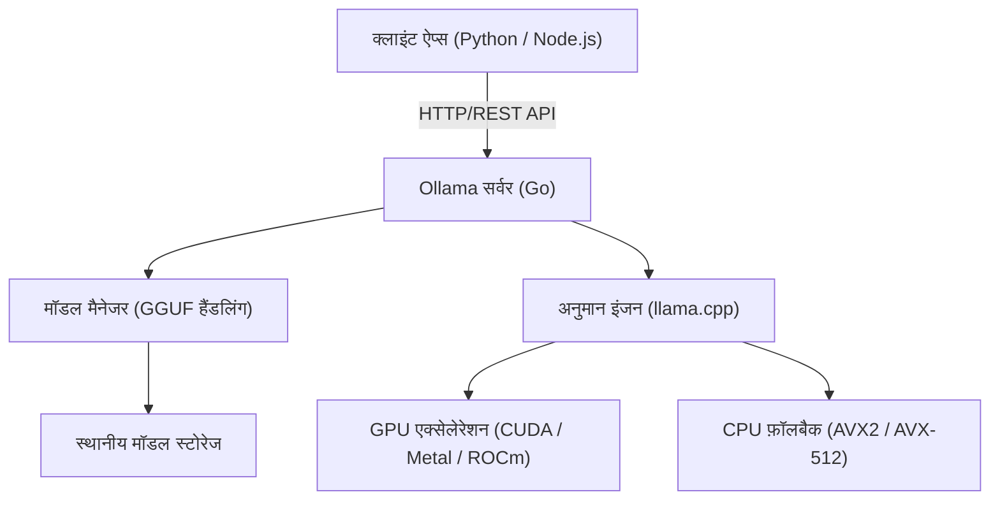
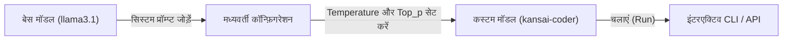

# परिचय: हमें स्थानीय LLM की आवश्यकता क्यों है?

बड़े भाषा मॉडल (LLM) के उदय ने हमारे जीवन और विकास के तरीकों में नाटकीय बदलाव लाए हैं। ChatGPT, Claude और Gemini जैसी शक्तिशाली क्लाउड-आधारित AI सेवाएँ हर दिन विकसित हो रही हैं और अत्यधिक उन्नत तर्क क्षमताएँ प्रदान कर रही हैं। हालाँकि, क्लाउड-आधारित LLM हर उपयोग के मामले में सर्वोत्तम नहीं हैं। क्लाउड LLM में निम्नलिखित चुनौतियाँ मौजूद हैं:

1. **गोपनीयता और सुरक्षा संबंधी समस्याएँ**: गोपनीय या व्यक्तिगत जानकारी वाले डेटा को बाहरी सर्वर पर भेजना अक्सर कॉर्पोरेट अनुपालन (compliance) और सुरक्षा के दृष्टिकोण से अस्वीकार्य होता है।
2. **लागत की अनिश्चितता**: API उपयोग शुल्क टोकन की संख्या पर निर्भर करता है, इसलिए बड़े पैमाने पर डेटा प्रोसेसिंग या लगातार अनुरोध करने वाले सिस्टम में, रनिंग कॉस्ट के आसमान छूने का जोखिम होता है।
3. **लेटेंसी और नेटवर्क पर निर्भरता**: ऑफलाइन वातावरण में उपयोग या एज डिवाइस (edge devices) पर निष्पादन के लिए जहां बहुत कम लेटेंसी की आवश्यकता होती है, नेटवर्क संचार एक बाधा बन जाता है।
4. **वेंडर लॉक-इन (Vendor Lock-in)**: किसी विशिष्ट प्रदाता के मॉडल पर निर्भर रहने से, आपको भविष्य में सेवा की समाप्ति, नियमों में बदलाव, या मॉडल अपडेट के कारण अनपेक्षित व्यवहार परिवर्तनों से प्रभावित होने का जोखिम रहता है।

इन चुनौतियों को हल करने के साधन के रूप में "स्थानीय LLM (Local LLM)" ध्यान आकर्षित कर रहा है। अपने स्वयं के हार्डवेयर पर मॉडल चलाकर, आप बिना किसी बाहरी सर्वर पर डेटा भेजे और बिना किसी मासिक लागत की चिंता किए, स्वतंत्र रूप से AI का उपयोग कर सकते हैं।

इस लेख में, हम "**Ollama**" के बारे में विस्तार से बताएंगे, जो एक ऐसा उपकरण है जो आपको आश्चर्यजनक रूप से आसानी से स्थानीय LLM को स्थापित करने, प्रबंधित करने और API के साथ एकीकृत करने की अनुमति देता है। हम इसके मूल सिद्धांतों, आंतरिक वास्तुकला (internal architecture), Python और Node.js का उपयोग करके उन्नत API एकीकरण, और प्रदर्शन ट्यूनिंग (performance tuning) के लिए गणना सूत्रों (formulas) तक सब कुछ कवर करेंगे।

---

# Ollama क्या है? इसकी आंतरिक वास्तुकला

Ollama एक ऐसा प्लेटफॉर्म है जो स्थानीय वातावरण में ओपन-सोर्स बड़े भाषा मॉडल (जैसे Llama 3, Phi-3, Mistral, Gemma आदि) को आसानी से चलाने और प्रबंधित करने के लिए उपयोग किया जाता है। पहले, एक स्थानीय LLM वातावरण स्थापित करने के लिए बहुत जटिल प्रक्रियाओं की आवश्यकता होती थी, जैसे Python वातावरण सेट करना, CUDA टूलकिट स्थापित करना, PyTorch की निर्भरता (dependencies) को हल करना, Hugging Face से विशाल मॉडल फाइलें डाउनलोड करना और प्रारूप रूपांतरण (जैसे Safetensors से GGUF) करना।

Ollama इन जटिलताओं को छुपाता है और आपको Docker जैसे उपयोग में आसानी के साथ LLM को संभालने की अनुमति देता है। आप केवल एक कमांड से मॉडल डाउनलोड (`pull`), निष्पादित (`run`), और एक HTTP सर्वर के रूप में शुरू कर सकते हैं।

## कोर तकनीक: llama.cpp का रैपर

Ollama के अनुमान इंजन (inference engine) के बैकएंड के रूप में काम करने वाली कोर तकनीक "**llama.cpp**" है, जो C/C++ में लागू एक उच्च गति वाली LLM अनुमान लाइब्रेरी है। llama.cpp में Apple Silicon (Metal), NVIDIA GPU (CUDA), AMD GPU (ROCm), या यहां तक कि केवल CPU वातावरण में हार्डवेयर के प्रदर्शन को अधिकतम करते हुए मॉडल को निष्पादित करने की क्षमता है।

Ollama में llama.cpp शामिल है और यह एक ऐसी वास्तुकला को अपनाता है जहां Go भाषा में लिखा गया एक सर्वर प्रक्रिया REST API प्रदान करता है और बैकग्राउंड में llama.cpp अनुमान इंजन को कॉल करता है।

नीचे दिया गया Mermaid आरेख Ollama की समग्र वास्तुकला को दर्शाता है।



इस वास्तुकला के साथ, डेवलपर्स C++ बिल्ड या GPU ड्राइवर सेटिंग्स के बारे में चिंता किए बिना, मानक HTTP अनुरोधों के माध्यम से उन्नत अनुमान क्षमताओं का उपयोग कर सकते हैं।

---

# Ollama की स्थापना और प्रारंभिक सेटअप

Ollama की स्थापना बहुत सरल है। प्रत्येक OS के लिए अनुकूलित बायनेरिज़ प्रदान किए जाते हैं।

## macOS / Windows

बस आधिकारिक वेबसाइट (https://ollama.com/) से इंस्टॉलर डाउनलोड करें और इसे चलाएं। macOS संस्करण स्वचालित रूप से Apple Silicon के Metal API को पहचानता है, और Windows संस्करण NVIDIA GPU (CUDA) को पहचानता है, और उपलब्ध होने पर हार्डवेयर त्वरण (hardware acceleration) को सक्षम बनाता है।

## Linux

Linux वातावरण (जैसे Ubuntu) में, आप निम्न वन-लाइनर कमांड चलाकर आवश्यक घटकों को स्थापित कर सकते हैं और Ollama सर्वर को systemd सेवा के रूप में प्रारंभ कर सकते हैं।

```bash
curl -fsSL https://ollama.com/install.sh | sh
```

स्थापना पूर्ण होने के बाद, टर्मिनल में संस्करण (version) की जाँच करें।

```bash
ollama --version
```
यदि संस्करण जानकारी प्रदर्शित होती है, तो यह सफलतापूर्वक स्थापित हो गया है।

## Docker का उपयोग करके निष्पादन

यदि आप अपने मौजूदा वातावरण को प्रदूषित नहीं करना चाहते हैं या इसे कंटेनर-आधारित बुनियादी ढांचे (infrastructure) में एकीकृत करना चाहते हैं, तो आप आधिकारिक Docker छवि का भी उपयोग कर सकते हैं। GPU का उपयोग करने के लिए NVIDIA Container Toolkit स्थापित होना आवश्यक है।

```bash
# केवल CPU के साथ निष्पादित करने के लिए
docker run -d -v ollama:/root/.ollama -p 11434:11434 --name ollama ollama/ollama

# NVIDIA GPU का उपयोग करने के लिए
docker run -d --gpus=all -v ollama:/root/.ollama -p 11434:11434 --name ollama ollama/ollama
```

डिफ़ॉल्ट रूप से, Ollama सर्वर `http://localhost:11434` पर सुनता है।

---

# मॉडल प्रबंधन और बुनियादी CLI कमांड

Ollama का सबसे बड़ा आकर्षण यह है कि इसका मॉडल प्रबंधन बहुत सहज (intuitive) है। आप Docker इमेजेज को संभालने की तरह ही विभिन्न मॉडलों का परीक्षण कर सकते हैं।

## 1. मॉडल चलाना (`run`)

यह सबसे अधिक उपयोग किया जाने वाला कमांड है। यदि निर्दिष्ट मॉडल मौजूद नहीं है, तो यह स्वचालित रूप से डाउनलोड (`pull`) हो जाएगा, और फिर एक इंटरैक्टिव प्रॉम्प्ट शुरू हो जाएगा।

```bash
ollama run llama3.1
```

उपरोक्त कमांड चलाने पर Meta का नवीनतम मॉडल Llama 3.1 (8B पैरामीटर संस्करण) शुरू हो जाएगा। प्रॉम्प्ट पर कोई संदेश टाइप करें, और मॉडल की प्रतिक्रिया स्ट्रीमिंग द्वारा प्रदर्शित होगी। बाहर निकलने के लिए `/bye` या `Ctrl+D` टाइप करें।

## 2. मॉडल डाउनलोड करना (`pull`)

यदि आप मॉडल को बैकग्राउंड में डाउनलोड करना चाहते हैं, तो `pull` कमांड का उपयोग करें।

```bash
ollama pull phi3:instruct
ollama pull mistral:v0.3
```

Ollama की मॉडल लाइब्रेरी में, आप `मॉडल_का_नाम:टैग` प्रारूप में संस्करण या परिमाणीकरण (quantization) स्तर निर्दिष्ट कर सकते हैं। यदि टैग छोड़ दिया जाता है, तो `latest` लागू किया जाता है, लेकिन आप स्पष्ट रूप से एक विशिष्ट परिमाणीकरण मॉडल (उदा: `llama3:8b-instruct-q4_0`) भी निर्दिष्ट कर सकते हैं।

### परिमाणीकरण (Quantization) क्या है?

आइए परिमाणीकरण के बारे में थोड़ा बात करते हैं। एक सामान्य LLM में एक वजन (weight) पैरामीटर 16-बिट फ्लोटिंग पॉइंट (FP16) आदि के रूप में रखा जाता है। 8 बिलियन (8B) पैरामीटर मॉडल के लिए, अकेले वजन लगभग 16GB VRAM की खपत करेगा। परिमाणीकरण वह तकनीक है जो इसे 4-बिट (Q4) या 8-बिट (Q8) पूर्णांक प्रकार (integer type) में संपीड़ित करती है।

परिमाणीकरण मॉडल सटीकता के क्षरण (degradation) को कम करते हुए आवश्यक मेमोरी की मात्रा और मेमोरी बैंडविड्थ को नाटकीय रूप से कम कर सकता है। Ollama द्वारा वितरित मॉडल डिफ़ॉल्ट रूप से GGUF प्रारूप में हैं जो इष्टतम रूप से परिमाणित (अक्सर 4-बिट) होते हैं।

## 3. मॉडलों की सूची बनाना (`list`)

स्थानीय रूप से डाउनलोड किए गए मॉडलों की सूची और उनके आकार को प्रदर्शित करता है।

```bash
ollama list
```
आउटपुट उदाहरण:
```text
NAME            ID              SIZE      MODIFIED
llama3.1:latest 43f7a214e532    4.7 GB    2 hours ago
phi3:instruct   a2c89ceaed85    2.3 GB    3 days ago
```

## 4. मॉडल हटाना (`rm`)

डिस्क स्थान खाली करने के लिए उन मॉडलों को हटा दें जिनकी अब आवश्यकता ক্ষমতায় नहीं है।

```bash
ollama rm phi3:instruct
```

---

# Modelfile का उपयोग करके मॉडल को कस्टमाइज़ करना

Ollama में, आप मौजूदा मॉडलों में सिस्टम प्रॉम्प्ट को इंजेक्ट करने, हाइपरपैरामीटर समायोजित करने और "**Modelfile**" नामक तंत्र का उपयोग करके अपना स्वयं का कस्टम मॉडल बनाने के लिए कार्य कर सकते हैं। यह Docker की Dockerfile की अवधारणा के बिल्कुल समान है।

नीचे दिया गया आरेख दिखाता है कि बेस मॉडल से कस्टम मॉडल कैसे प्राप्त (derive) किया जाता है।



उदाहरण के रूप में, आइए एक प्रोग्रामिंग असिस्टेंट मॉडल बनाएं जो कंसाई बोली (Kansai dialect) में उत्तर देता है।

अपनी कार्यशील निर्देशिका (working directory) में `Modelfile` नाम की एक टेक्स्ट फ़ाइल बनाएँ और इसे निम्नानुसार लिखें।

```text
# बेस मॉडल निर्दिष्ट करें
FROM llama3.1

# रचनात्मकता (temperature) जैसे हाइपरपैरामीटर सेट करें
PARAMETER temperature 0.7
PARAMETER top_p 0.9
PARAMETER repeat_penalty 1.1
PARAMETER num_ctx 4096

# सिस्टम प्रॉम्प्ट सेट करें
SYSTEM """
आप एक विश्व-स्तरीय सीनियर सॉफ्टवेयर इंजीनियर हैं।
उपयोगकर्ता के तकनीकी सवालों के जवाब हमेशा 'कंसाई बोली' में दोस्ताना तरीके से दें।
यदि आप कोई कोड उदाहरण दिखाते हैं, तो सर्वोत्तम प्रथाओं का पालन करते हुए आधुनिक कोड प्रदान करें।
"""
```

इस Modelfile से एक नया मॉडल बनाएँ (बिल्ड करें)।

```bash
ollama create kansai-coder -f Modelfile
```

बिल्ड पूरा होने के बाद, इसे चलाकर परीक्षण करें।

```bash
ollama run kansai-coder
>>> Python में किसी सूची (list) को क्रमबद्ध (sort) कैसे करें?
```
यह कस्टमाइज़्ड व्यवहार दिखाएगा जैसे, "यह आसान है, तुम Python के `sorted()` फ़ंक्शन या `sort()` विधि का उपयोग कर सकते हो!" इस तरह, आपके उपयोग के मामले के अनुरूप अनगिनत एजेंट स्थानीय रूप से बनाए और प्रबंधित किए जा सकते हैं।

---

# Ollama REST API की विस्तृत व्याख्या

हालाँकि CLI के साथ बातचीत करना सुविधाजनक है, लेकिन वास्तविक एप्लिकेशन विकास में Ollama का असली मूल्य इसका शक्तिशाली REST API है। आप सर्वर प्रक्रिया (डिफ़ॉल्ट रूप से `http://localhost:11434`) पर HTTP अनुरोध भेजकर अनुमान परिणाम (inference results) प्राप्त कर सकते हैं।

तीन मुख्य एंडपॉइंट निम्नलिखित हैं:
1. `/api/generate`: एकल प्रॉम्प्ट से टेक्स्ट जनरेशन
2. `/api/chat`: OpenAI API के समान चैट (संवाद) जनरेशन
3. `/api/embeddings`: वेक्टर एम्बेडिंग्स जनरेट करना

## /api/generate का उपयोग करके टेक्स्ट जनरेट करना

यह सबसे बुनियादी जनरेशन एंडपॉइंट है। आइए cURL का उपयोग करके एक अनुरोध भेजें।

```bash
curl -X POST http://localhost:11434/api/generate -d '{
  "model": "llama3.1",
  "prompt": "Explain the concept of quantum entanglement in simple terms.",
  "stream": false
}'
```

`"stream": false` निर्दिष्ट करने से, सभी जनरेशन पूर्ण होने के बाद JSON एक साथ वापस आ जाता है। डिफ़ॉल्ट रूप से (`true`), उत्पन्न टोकन JSON Lines प्रारूप में क्रमिक रूप से भेजे जाते हैं, जो स्ट्रीमिंग UI को लागू करने के लिए उपयुक्त है।

प्रतिक्रिया का उदाहरण (आंशिक रूप से छोड़ा गया):
```json
{
  "model": "llama3.1",
  "created_at": "2026-09-12T10:00:00.000Z",
  "response": "Quantum entanglement is like having a pair of magical dice...",
  "done": true,
  "context": [128006, 882, 128007, 271, 10445],
  "total_duration": 4567890000,
  "load_duration": 1234000,
  "prompt_eval_count": 14,
  "eval_count": 256,
  "eval_duration": 4321000000
}
```
`context` एरे पिछले वार्तालाप की स्थिति को एन्कोड करता है, और इसे अगले अनुरोध में शामिल करके, आप संदर्भ बनाए रख सकते हैं। हालाँकि, वार्तालाप इतिहास को अधिक आसानी से प्रबंधित करने के लिए, निम्न `/api/chat` का उपयोग किया जाता है।

## /api/chat का उपयोग करके वार्तालाप (chat) जनरेट करना

चूंकि हाल ही के LLM को चैट प्रारूप में फाइन-ट्यून किया गया है, इसलिए एप्लिकेशन विकास के लिए `/api/chat` की अनुशंसा की जाती है।

```bash
curl -X POST http://localhost:11434/api/chat -d '{
  "model": "llama3.1",
  "messages": [
    { "role": "system", "content": "You are a helpful AI assistant." },
    { "role": "user", "content": "What is the capital of France?" },
    { "role": "assistant", "content": "The capital of France is Paris." },
    { "role": "user", "content": "What is its famous tower?" }
  ],
  "stream": false
}'
```
इस प्रकार, `role` (system, user, assistant) वाले संदेश ऑब्जेक्ट्स की एक सरणी (array) पास करके, आप जटिल वार्तालाप संदर्भों को आसानी से संभाल सकते हैं।

---

# Python एप्लिकेशन के साथ एकीकरण

Python AI विकास में सबसे मानक भाषा है। Python से Ollama का उपयोग करने के कई तरीके हैं, लेकिन आधिकारिक `ollama-python` पैकेज का उपयोग करना सबसे आसान और विश्वसनीय तरीका है।

## स्थापना

```bash
pip install ollama
```

## सिंक्रोनस (Synchronous) API का उपयोग

यह चैट उत्पन्न करने के लिए मूल कोड है।

```python
import ollama

# चैट इतिहास को रखने के लिए एक सूची (list)
messages = [
    {'role': 'system', 'content': 'आप एक बेहतरीन सहायक हैं।'}
]

def chat_with_ollama(user_input):
    messages.append({'role': 'user', 'content': user_input})
    
    # Ollama API को कॉल करें
    response = ollama.chat(
        model='llama3.1',
        messages=messages
    )
    
    assistant_reply = response['message']['content']
    messages.append({'role': 'assistant', 'content': assistant_reply})
    
    return assistant_reply

print(chat_with_ollama("मशीन लर्निंग के तीन प्रमुख दृष्टिकोण (approaches) क्या हैं?"))
```

## एसिंक्रोनस स्ट्रीमिंग (Async Streaming) का उपयोग

वेब एप्लिकेशन (FastAPI या Starlette) या Discord / Slack बॉट विकसित करते समय, ब्लॉकिंग से बचने के लिए एसिंक्रोनस API और स्ट्रीमिंग का उपयोग करना महत्वपूर्ण है।

```python
import asyncio
from ollama import AsyncClient

async def generate_stream():
    client = AsyncClient()
    
    # यदि आप stream=True निर्दिष्ट करते हैं, तो एक अतुल्यकालिक जनरेटर (async generator) वापस आ जाता है
    async for chunk in await client.chat(
        model='llama3.1',
        messages=[{'role': 'user', 'content': 'कृपया Python डेकोरेटर को विस्तार से समझाएं।'}],
        stream=True
    ):
        # प्रत्येक भाग (chunk) को क्रमिक रूप से मानक आउटपुट (standard output) में प्रदर्शित करें
        print(chunk['message']['content'], end='', flush=True)
        
    print() # अंत में एक नई लाइन

# एसिंक्रोनस फ़ंक्शन चलाएं
asyncio.run(generate_stream())
```
इस तरह से कोड लिखकर, आप आसानी से ऐसा UX लागू कर सकते हैं जहां वर्ण धीरे-धीरे प्रदर्शित होते हैं, ठीक ChatGPT UI की तरह।

## LangChain और LlamaIndex के साथ एकीकरण

RAG (Retrieval-Augmented Generation) सिस्टम बनाते समय अक्सर उपयोग किए जाने वाले LangChain और LlamaIndex में भी, Ollama मूल रूप से समर्थित है।

LangChain का उदाहरण:
```python
from langchain_community.llms import Ollama

llm = Ollama(model="llama3.1")
response = llm.invoke("Explain dark matter.")
print(response)
```
आप बिना कोई बाहरी API कुंजी सेट किए LangChain की शक्तिशाली चेन और एजेंट सुविधाओं को स्थानीय रूप से चला सकते हैं।

---

# Node.js एप्लिकेशन के साथ एकीकरण

फ्रंट-एंड इंजीनियरों और फुल-स्टैक डेवलपर्स के लिए, TypeScript/Node.js वातावरण से स्थानीय LLM को कॉल करने में सक्षम होना एक बड़ा फायदा है। हम आधिकारिक `ollama` NPM पैकेज का उपयोग करेंगे।

## स्थापना

```bash
npm install ollama
```

## TypeScript का उपयोग करके चैटबॉट कार्यान्वयन का उदाहरण

```typescript
import ollama, { Message } from 'ollama';

async function runChatbot() {
  const messages: Message[] = [
    { role: 'system', content: 'You are a concise expert.' },
    { role: 'user', content: 'Explain RESTful APIs.' }
  ];

  try {
    const response = await ollama.chat({
      model: 'llama3.1',
      messages: messages,
      stream: false,
    });
    
    console.log("Assistant:", response.message.content);
  } catch (error) {
    console.error("Error communicating with Ollama:", error);
  }
}

runChatbot();
```

## स्ट्रीमिंग-समर्थित Express सर्वर बनाना

वेब फ्रंट-एंड को स्ट्रीमिंग प्रतिक्रियाएं देने वाले बैक-एंड API कार्यान्वयन का एक उदाहरण। भाग (chunks) भेजने के लिए SSE (Server-Sent Events) या नियमित HTTP स्ट्रीमिंग का उपयोग किया जाता है।

```javascript
import express from 'express';
import { Ollama } from 'ollama';

const app = express();
app.use(express.json());
const ollama = new Ollama({ host: 'http://127.0.0.1:11434' });

app.post('/api/stream-chat', async (req, res) => {
  const { prompt } = req.body;

  // HTTP रिस्पांस हेडर सेट करना (चंक ट्रांसफर)
  res.setHeader('Content-Type', 'text/plain; charset=utf-8');
  res.setHeader('Transfer-Encoding', 'chunked');

  try {
    const stream = await ollama.generate({
      model: 'llama3.1',
      prompt: prompt,
      stream: true,
    });

    for await (const chunk of stream) {
      res.write(chunk.response);
    }
    res.end();
  } catch (err) {
    res.status(500).write("Error generating response.");
    res.end();
  }
});

app.listen(3000, () => {
  console.log('Server is running on port 3000');
});
```

---

# प्रदर्शन मेट्रिक्स और गणितीय विश्लेषण

व्यावहारिक स्तर पर स्थानीय LLM प्रदान करने के लिए लेटेंसी और थ्रूपुट का विश्लेषण आवश्यक है। Ollama की API प्रतिक्रियाओं में प्रदर्शन से संबंधित विस्तृत मेट्रिक्स शामिल होते हैं।

## टोकन जनरेशन गति गणना मॉडल

उपयोगकर्ता अनुभव से सीधे जुड़े LLM के प्रतिक्रिया समय को "**Time To First Token (TTFT)**" और "**Time Per Output Token (TPOT)**" में विभाजित किया जा सकता है।

कुल जनरेशन समय $T_{total}$ को उत्पन्न टोकन की संख्या $N$ होने पर निम्न प्रकार से तैयार किया जा सकता है:

$$
T_{total} = t_{ttft} + \sum_{i=1}^{N-1} t_{tpot}^{(i)}
$$

यहाँ, यदि हम प्रत्येक टोकन को उत्पन्न करने में लगने वाले औसत समय को $\bar{t}_{tpot}$ के रूप में अनुमानित करते हैं, तो समीकरण सरल हो जाता है:

$$
T_{total} \approx t_{ttft} + (N - 1) \times \bar{t}_{tpot}
$$

Ollama के API प्रतिक्रिया फ़ील्ड्स के साथ पत्राचार (correspondence) इस प्रकार है:
- `prompt_eval_duration`: यह मोटे तौर पर $t_{ttft}$ (प्रॉम्प्ट मूल्यांकन समय) के बराबर है। यह नैनोसेकंड में लौटाया जाता है।
- `eval_duration`: संपूर्ण जनरेशन प्रक्रिया में लगने वाला समय।
- `eval_count`: उत्पन्न टोकन की संख्या $N$।

इसलिए, 1 सेकंड प्रति टोकन जनरेशन गति (Tokens Per Second: TPS) की गणना निम्न सूत्र से की जा सकती है:

$$
TPS = \frac{eval\_count}{(eval\_duration / 10^9)} \quad [\text{tokens/sec}]
$$

उदाहरण के लिए, यदि `eval_count: 256` है और `eval_duration: 4321000000` (लगभग 4.32 सेकंड) है,
$$
TPS = \frac{256}{4.321} \approx 59.24 \text{ tokens/sec}
$$
होगा। यदि यह स्थानीय वातावरण में 50 टोकन/सेकंड से अधिक है, तो यह उस गति से कहीं अधिक है जिस पर मनुष्य पढ़ सकता है, इसलिए यह कहा जा सकता है कि यह एक बहुत ही आरामदायक प्रतिक्रिया अनुभव प्रदान करता है।

## आवश्यक VRAM क्षमता का अनुमान लगाने का सूत्र

स्थानीय रूप से मॉडल चलाते समय, यह महत्वपूर्ण है कि मॉडल GPU के VRAM में फिट बैठता है या नहीं। यदि यह VRAM में फिट नहीं होता है और सिस्टम की मुख्य मेमोरी (RAM) पर फ़ॉलबैक करता है, तो जनरेशन गति काफी कम हो जाएगी।

आवश्यक मेमोरी क्षमता $M$ (गीगाबाइट में) का अनुमान लगाने के लिए एक सरल सूत्र इस प्रकार है:

$$
M \approx \frac{P \times Q}{8 \times 1024} + C
$$

- $P$: मॉडल के मापदंडों (parameters) की संख्या (उदाहरण: 8B = $8000 \times 10^6$)
- $Q$: परिमाणीकरण (quantization) के बिट्स की संख्या (उदाहरण: 4-bit, 8-bit, 16-bit)
- $C$: कॉन्टेक्स्ट विंडो के लिए अतिरिक्त मेमोरी (KV कैश आदि। यह मॉडल और सेटिंग्स पर निर्भर करता है, लेकिन आमतौर पर लगभग 1 से 2GB की उम्मीद की जाती है)

**गणना का उदाहरण**: यदि Llama 3 (8B पैरामीटर) को 4-bit परिमाणीकरण के साथ चलाया जाता है:
$$
M_{model} = \frac{8,000 \times 4}{8 \times 1024} = \frac{32,000}{8192} \approx 3.9 \text{ GB}
$$
यदि आप इसमें कॉन्टेक्स्ट मेमोरी जोड़ते हैं, तो आप देख सकते हैं कि यदि आपके पास लगभग 5GB से 6GB VRAM है, तो आप GPU पर मॉडल को पूरी तरह से तैनात (Full Offload) कर सकते हैं। यहां तक कि हाल ही के मिड-रेंज GPU (जैसे RTX 4060) जिनमें 8GB VRAM है, वे एक शक्तिशाली LLM चलाने में सक्षम हैं।

---

# उन्नत उपयोग के मामले और निष्कर्ष

Ollama को स्थानीय नेटवर्क के भीतर API के रूप में उजागर (expose) करके, केवल चैटबॉट्स के अलावा कई तरह के अनुप्रयोग संभव हो जाते हैं।

### 1. स्थानीय RAG (Retrieval-Augmented Generation) बनाना
Ollama के `/api/embeddings` एंडपॉइंट (जैसे `nomic-embed-text` एम्बेडिंग मॉडल) को ChromaDB या Qdrant जैसे स्थानीय वेक्टर डेटाबेस के साथ जोड़कर, आप एक सुरक्षित RAG सिस्टम पूरी तरह से ऑफलाइन बना सकते हैं जो आंतरिक गोपनीय दस्तावेजों को पढ़ सकता है और सवालों के जवाब दे सकता है।

### 2. IDE और एडिटर्स के लिए AI असिस्टेंट
VS Code एक्सटेंशन (जैसे Continue.dev) या Neovim प्लग-इन के बैकएंड के रूप में Ollama को निर्दिष्ट करके, आप स्थानीय मॉडल (जैसे `codellama` या `deepseek-coder`) का उपयोग करके GitHub Copilot की तरह ही मुफ़्त में कोड पूरा करने (code completion) और कोड स्पष्टीकरण (code explanation) कर सकते हैं।

### 3. ऑटोमेशन स्क्रिप्ट्स में एकीकरण
Python या शेल स्क्रिप्ट्स में Ollama के API अनुरोधों को शामिल करके, आप अपने दैनिक कार्यप्रवाह के हर हिस्से में AI की शक्ति ला सकते हैं, जैसे कि स्वचालित लॉग सारांश (log summarization), Git कमिट संदेशों की स्वचालित जनरेशन, और बॉयलरप्लेट टेक्स्ट का वर्गीकरण (classification)।

## निष्कर्ष

Ollama के आगमन से, स्थानीय LLM स्थापित करने की बाधा बहुत कम हो गई है। Docker कंटेनरों को प्रबंधित करने जैसी सरल कमांड प्रणाली और एक REST API जो बाहरी अनुप्रयोगों से आसानी से उपयोग की जा सकती है, इसका संयोजन स्थानीय AI विकास में वर्तमान वास्तविक मानक (de facto standard) माना जा सकता है।

क्लाउड LLM की लागत और सुरक्षा बाधाओं से जूझ रहे डेवलपर्स के लिए, मैं आपको इस लेख में दिए गए चरणों का उपयोग करके Ollama के साथ एक स्थानीय LLM वातावरण बनाने और इसे अपने एप्लिकेशन में एकीकृत करने के लिए प्रोत्साहित करता हूँ। आप निश्चित रूप से AI की संभावनाओं को अधिक स्वतंत्र रूप से और अपने करीब महसूस कर पाएंगे।
