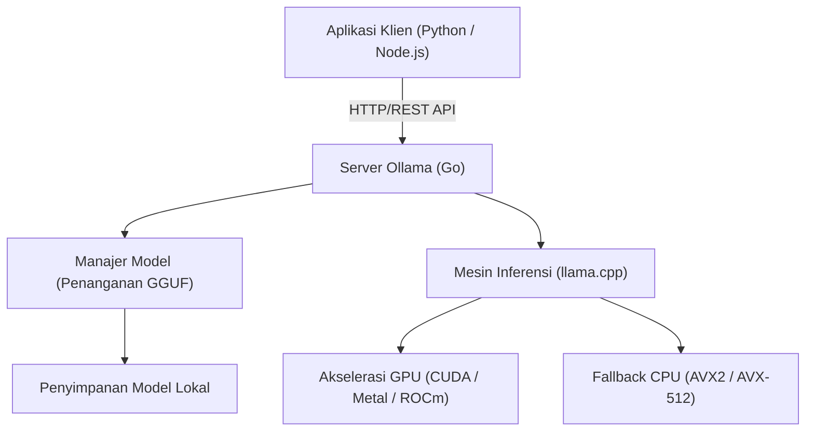
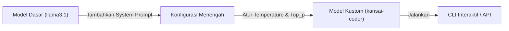

# Pendahuluan: Mengapa Kita Membutuhkan LLM Lokal?

Dengan kebangkitan Large Language Models (LLM), kehidupan dan metode pengembangan kita telah mengalami perubahan drastis. Layanan AI berbasis cloud yang kuat seperti ChatGPT, Claude, dan Gemini terus berkembang setiap harinya, menawarkan kemampuan penalaran yang sangat canggih. Namun, LLM berbasis cloud tidak selalu menjadi pilihan terbaik untuk semua kasus penggunaan. LLM cloud memiliki beberapa tantangan sebagai berikut:

1. **Masalah Privasi dan Keamanan**: Mengirimkan data yang berisi informasi rahasia atau informasi pribadi ke server eksternal sering kali tidak dapat diterima dari perspektif kepatuhan perusahaan (compliance) dan keamanan.
2. **Ketidakpastian Biaya**: Karena biaya penggunaan API bergantung pada jumlah token, ada risiko bahwa biaya operasional (running cost) akan melonjak tanpa batas pada sistem yang memproses data dalam skala besar atau melakukan permintaan (request) secara berulang.
3. **Ketergantungan pada Latensi dan Jaringan**: Untuk penggunaan di lingkungan offline atau eksekusi pada perangkat edge yang memerlukan latensi sangat rendah, komunikasi jaringan menjadi faktor penghambat (bottleneck).
4. **Vendor Lock-in**: Dengan bergantung pada model penyedia tertentu, Anda mungkin terdampak oleh penghentian layanan di masa mendatang, perubahan persyaratan, atau perubahan perilaku tak terduga akibat pembaruan model.

"LLM Lokal" menarik perhatian sebagai cara untuk menyelesaikan tantangan-tantangan ini. Dengan menjalankan model pada perangkat keras (hardware) Anda sendiri, Anda dapat memanfaatkan AI dengan bebas tanpa mengirimkan data apa pun ke pihak luar, dan tanpa perlu mengkhawatirkan biaya bulanan.

Pada artikel ini, kita akan membahas secara menyeluruh tentang "**Ollama**", sebuah alat yang membuat pengenalan, pengelolaan, dan integrasi API untuk LLM lokal menjadi sangat mudah, mulai dari dasar-dasarnya hingga arsitektur internal, integrasi API tingkat lanjut menggunakan Python dan Node.js, hingga rumus perhitungan untuk penyetelan kinerja (performance tuning).

---

# Apa itu Ollama? Arsitektur Internalnya

Ollama adalah sebuah platform yang memudahkan eksekusi dan pengelolaan large language models (LLM) open source (seperti Llama 3, Phi-3, Mistral, Gemma, dll.) di lingkungan lokal. Sebelumnya, untuk membangun lingkungan LLM lokal, diperlukan langkah-langkah yang sangat rumit seperti menyiapkan lingkungan Python, menginstal toolkit CUDA, menyelesaikan dependensi PyTorch, mengunduh file model besar dari Hugging Face, dan mengonversi format (misalnya dari Safetensors ke GGUF).

Ollama menyembunyikan kompleksitas ini dan memungkinkan Anda untuk menangani LLM dengan kemudahan seperti Docker. Hanya dengan satu perintah, Anda dapat mengunduh model (`pull`), menjalankannya (`run`), dan menyiapkannya sebagai server HTTP.

## Teknologi Inti: Wrapper untuk llama.cpp

Yang berfungsi sebagai backend mesin inferensi Ollama adalah "**llama.cpp**", sebuah pustaka inferensi LLM cepat yang diimplementasikan dalam C/C++. llama.cpp memiliki kemampuan untuk memaksimalkan kinerja perangkat keras dalam menjalankan model, bahkan pada lingkungan Apple Silicon (Metal), NVIDIA GPU (CUDA), AMD GPU (ROCm), maupun lingkungan yang hanya menggunakan CPU.

Ollama menyertakan llama.cpp, dan mengadopsi arsitektur di mana proses server yang ditulis dalam bahasa Go menyediakan REST API, dan memanggil mesin inferensi llama.cpp di latar belakang (background).

Diagram Mermaid di bawah ini menunjukkan arsitektur keseluruhan Ollama.



Dengan arsitektur ini, pengembang dapat memanfaatkan kemampuan inferensi yang canggih melalui permintaan HTTP standar, tanpa perlu memikirkan build C++ atau pengaturan detail pada driver GPU.

---

# Instalasi dan Pengaturan Awal Ollama

Instalasi Ollama sangatlah sederhana. Biner yang dioptimalkan disediakan untuk setiap OS.

## macOS / Windows

Anda cukup mengunduh dan menjalankan installer dari situs resminya (https://ollama.com/). Versi macOS akan secara otomatis mengenali API Metal pada Apple Silicon, dan versi Windows akan mengenali NVIDIA GPU (CUDA), serta mengaktifkan akselerasi perangkat keras jika tersedia.

## Linux

Pada lingkungan Linux (seperti Ubuntu), Anda hanya perlu menjalankan perintah one-liner berikut untuk menginstal komponen yang diperlukan dan memulai server Ollama sebagai layanan systemd.

```bash
curl -fsSL https://ollama.com/install.sh | sh
```

Setelah instalasi selesai, mari kita periksa versinya di terminal.

```bash
ollama --version
```
Jika informasi versi ditampilkan, berarti instalasi telah berhasil.

## Menjalankan dengan Docker

Jika Anda tidak ingin mengotori lingkungan Anda saat ini atau ingin mengintegrasikannya ke dalam infrastruktur berbasis container, Anda dapat menggunakan image Docker resminya. Jika Anda menggunakan GPU, instalasi NVIDIA Container Toolkit diperlukan.

```bash
# Untuk menjalankan hanya dengan CPU
docker run -d -v ollama:/root/.ollama -p 11434:11434 --name ollama ollama/ollama

# Untuk menggunakan NVIDIA GPU
docker run -d --gpus=all -v ollama:/root/.ollama -p 11434:11434 --name ollama ollama/ollama
```

Secara default, server Ollama akan mendengarkan di `http://localhost:11434`.

---

# Manajemen Model dan Perintah Dasar CLI

Daya tarik terbesar Ollama adalah manajemen modelnya yang sangat intuitif. Anda dapat mencoba berbagai model dengan nuansa layaknya menangani image Docker.

## 1. Menjalankan Model (`run`)

Ini adalah perintah yang paling sering digunakan. Jika model yang ditentukan tidak ada, secara otomatis ia akan diunduh (`pull`), setelah itu prompt interaktif akan muncul.

```bash
ollama run llama3.1
```

Saat perintah di atas dijalankan, model terbaru dari Meta yaitu Llama 3.1 (versi parameter 8B) akan diluncurkan. Ketika Anda memasukkan pesan di prompt, balasan dari model akan ditampilkan secara streaming. Untuk keluar, ketik `/bye` atau tekan `Ctrl+D`.

## 2. Mengunduh Model (`pull`)

Gunakan perintah `pull` jika Anda ingin mengunduh model di latar belakang.

```bash
ollama pull phi3:instruct
ollama pull mistral:v0.3
```

Pada perpustakaan model Ollama, Anda dapat menentukan versi atau tingkat kuantisasi dalam format `nama_model:tag`. Jika tag diabaikan, `latest` akan diterapkan, tetapi Anda juga dapat menentukan model kuantisasi tertentu secara eksplisit (contoh: `llama3:8b-instruct-q4_0`).

### Apa itu Kuantisasi (Quantization)?

Mari kita bahas sedikit tentang kuantisasi. LLM biasa menyimpan satu parameter bobot sebagai floating-point 16-bit (FP16). Untuk model dengan 8 miliar (8B) parameter, bobotnya saja akan menghabiskan sekitar 16GB VRAM. Teknologi untuk mengompresi ini ke dalam bilangan bulat (integer) 4-bit (Q4) atau 8-bit (Q8) disebut kuantisasi.

Dengan kuantisasi, Anda dapat mengurangi jumlah memori dan bandwidth memori yang dibutuhkan secara drastis sambil meminimalisir penurunan akurasi model. Model yang didistribusikan melalui Ollama secara default berformat GGUF yang mana telah diterapkan kuantisasi optimal (biasanya 4-bit).

## 3. Menampilkan Daftar Model (`list`)

Menampilkan daftar model yang telah diunduh secara lokal dan ukurannya.

```bash
ollama list
```
Contoh keluaran:
```text
NAME            ID              SIZE      MODIFIED
llama3.1:latest 43f7a214e532    4.7 GB    2 hours ago
phi3:instruct   a2c89ceaed85    2.3 GB    3 days ago
```

## 4. Menghapus Model (`rm`)

Hapus model yang sudah tidak diperlukan untuk mengosongkan ruang disk.

```bash
ollama rm phi3:instruct
```

---

# Kustomisasi Model dengan Modelfile

Di Ollama, Anda dapat menggunakan mekanisme yang disebut "**Modelfile**" untuk membuat model kustom (custom model) Anda sendiri dengan menyuntikkan system prompt atau menyesuaikan hyperparameter ke model yang sudah ada. Ini sama persis dengan konsep Dockerfile di Docker.

Diagram di bawah menunjukkan bagaimana model kustom diturunkan dari model dasar.



Sebagai contoh, mari kita buat model asisten pemrograman yang merespons dalam dialek Kansai (Kansai-ben).

Buat file teks bernama `Modelfile` di direktori kerja Anda dan tulis sebagai berikut:

```text
# Menentukan model dasar
FROM llama3.1

# Mengatur hyperparameter seperti kreativitas (temperature)
PARAMETER temperature 0.7
PARAMETER top_p 0.9
PARAMETER repeat_penalty 1.1
PARAMETER num_ctx 4096

# Mengatur system prompt
SYSTEM """
Anda adalah Insinyur Perangkat Lunak Senior kelas dunia.
Anda harus selalu menjawab pertanyaan teknis dari pengguna dengan nada ramah dan menggunakan "dialek Kansai".
Jika Anda memberikan contoh kode, berikan kode modern yang mengikuti praktik terbaik (best practices).
"""
```

Bangun (build) model baru dari Modelfile ini.

```bash
ollama create kansai-coder -f Modelfile
```

Setelah build selesai, jalankan untuk mengujinya.

```bash
ollama run kansai-coder
>>> Pythonでリストをソートするにはどうすればええの？
```
Kemudian, model akan menunjukkan perilaku yang disesuaikan seperti menjawab "それはな、Pythonの `sorted()` 関数か `sort()` メソッドを使えばええんやで！". Ini memungkinkan Anda untuk membuat dan mengelola agen kustom dalam jumlah tak terbatas secara lokal untuk berbagai kasus penggunaan (use cases).

---

# Penjelasan Lengkap tentang Ollama REST API

Berinteraksi melalui CLI memang praktis, tetapi dalam pengembangan aplikasi nyata, nilai sesungguhnya dari Ollama terletak pada REST API yang kuat. Anda bisa mendapatkan hasil inferensi dengan mengirim permintaan HTTP ke proses server (default-nya adalah `http://localhost:11434`).

Berikut adalah 3 endpoint utama:
1. `/api/generate`: Pembangkitan teks dari satu prompt
2. `/api/chat`: Pembangkitan obrolan (dialog) dalam format yang mirip dengan OpenAI API
3. `/api/embeddings`: Pembangkitan representasi vektor (Embeddings)

## Pembangkitan Teks Menggunakan /api/generate

Ini adalah endpoint pembangkitan yang paling mendasar. Mari kita coba mengirim permintaan menggunakan cURL.

```bash
curl -X POST http://localhost:11434/api/generate -d '{
  "model": "llama3.1",
  "prompt": "Explain the concept of quantum entanglement in simple terms.",
  "stream": false
}'
```

Dengan menentukan `"stream": false`, seluruh hasil json akan dikembalikan sekaligus setelah semua pembangkitan selesai. Secara default (`true`), token yang dihasilkan akan dikirim secara berurutan dalam format JSON Lines, sehingga cocok untuk implementasi UI streaming.

Contoh respons (sebagian dihilangkan):
```json
{
  "model": "llama3.1",
  "created_at": "2026-09-12T10:00:00.000Z",
  "response": "Quantum entanglement is like having a pair of magical dice...",
  "done": true,
  "context": [128006, 882, 128007, 271, 10445],
  "total_duration": 4567890000,
  "load_duration": 1234000,
  "prompt_eval_count": 14,
  "eval_count": 256,
  "eval_duration": 4321000000
}
```
Array `context` berisi penyandian riwayat status percakapan, dan dengan menyertakan ini di permintaan berikutnya, Anda dapat mempertahankan konteksnya. Namun, untuk mengelola riwayat percakapan dengan lebih mudah, kita menggunakan `/api/chat` di bawah ini.

## Pembangkitan Obrolan Menggunakan /api/chat

Karena LLM modern sudah di-fine-tune untuk format chat (obrolan), disarankan untuk menggunakan `/api/chat` dalam pengembangan aplikasi.

```bash
curl -X POST http://localhost:11434/api/chat -d '{
  "model": "llama3.1",
  "messages": [
    { "role": "system", "content": "You are a helpful AI assistant." },
    { "role": "user", "content": "What is the capital of France?" },
    { "role": "assistant", "content": "The capital of France is Paris." },
    { "role": "user", "content": "What is its famous tower?" }
  ],
  "stream": false
}'
```
Seperti ini, dengan mengirimkan array objek pesan yang berisi atribut `role` (system, user, assistant), Anda dapat menangani konteks obrolan yang kompleks dengan mudah.

---

# Integrasi dengan Aplikasi Python

Python adalah bahasa yang paling standar dalam pengembangan AI. Ada beberapa cara untuk menggunakan Ollama dari Python, tetapi yang paling mudah dan dapat diandalkan adalah dengan menggunakan paket resmi `ollama-python`.

## Instalasi

```bash
pip install ollama
```

## Penggunaan API Sinkron (Synchronous)

Ini adalah kode dasar untuk melakukan pembangkitan percakapan.

```python
import ollama

# Daftar untuk menyimpan riwayat chat
messages = [
    {'role': 'system', 'content': 'Anda adalah asisten yang cerdas.'}
]

def chat_with_ollama(user_input):
    messages.append({'role': 'user', 'content': user_input})
    
    # Memanggil Ollama API
    response = ollama.chat(
        model='llama3.1',
        messages=messages
    )
    
    assistant_reply = response['message']['content']
    messages.append({'role': 'assistant', 'content': assistant_reply})
    
    return assistant_reply

print(chat_with_ollama("Tolong jelaskan 3 pendekatan utama dalam machine learning."))
```

## Penggunaan Asinkron Berkelanjutan (Async Streaming)

Saat mengembangkan aplikasi Web (seperti FastAPI atau Starlette) atau bot Discord/Slack, penting untuk menggunakan API asinkron dan streaming guna menghindari hambatan blokir (blocking).

```python
import asyncio
from ollama import AsyncClient

async def generate_stream():
    client = AsyncClient()
    
    # Generator asinkron akan dikembalikan ketika stream=True ditentukan
    async for chunk in await client.chat(
        model='llama3.1',
        messages=[{'role': 'user', 'content': 'Tolong jelaskan secara detail tentang decorator Python.'}],
        stream=True
    ):
        # Cetak setiap bagian (chunk) secara bertahap ke standard output
        print(chunk['message']['content'], end='', flush=True)
        
    print() # Baris baru pada akhir

# Menjalankan fungsi asinkron
asyncio.run(generate_stream())
```
Dengan menulis seperti ini, Anda dapat dengan mudah mengimplementasikan UX di mana karakter muncul satu per satu seperti pada UI ChatGPT.

## Integrasi dengan LangChain atau LlamaIndex

Dalam LangChain dan LlamaIndex, yang sering digunakan untuk membangun sistem RAG (Retrieval-Augmented Generation), Ollama didukung secara bawaan (native).

Contoh menggunakan LangChain:
```python
from langchain_community.llms import Ollama

llm = Ollama(model="llama3.1")
response = llm.invoke("Explain dark matter.")
print(response)
```
Anda dapat menjalankan fungsionalitas rantai (chains) atau agen yang tangguh dari LangChain di lingkungan lokal, tanpa perlu mengonfigurasi kunci API eksternal apa pun.

---

# Integrasi dengan Aplikasi Node.js

Bagi insinyur front-end (Front-end Engineer) maupun pengembang full-stack (Full-stack Developer), kemampuan untuk memanggil LLM lokal dari lingkungan TypeScript/Node.js merupakan keunggulan yang signifikan. Kita menggunakan paket NPM resmi dari `ollama`.

## Instalasi

```bash
npm install ollama
```

## Contoh Implementasi Chatbot Menggunakan TypeScript

```typescript
import ollama, { Message } from 'ollama';

async function runChatbot() {
  const messages: Message[] = [
    { role: 'system', content: 'You are a concise expert.' },
    { role: 'user', content: 'Explain RESTful APIs.' }
  ];

  try {
    const response = await ollama.chat({
      model: 'llama3.1',
      messages: messages,
      stream: false,
    });
    
    console.log("Assistant:", response.message.content);
  } catch (error) {
    console.error("Error communicating with Ollama:", error);
  }
}

runChatbot();
```

## Membuat Server Express dengan Dukungan Streaming

Berikut adalah contoh penerapan API backend yang mengembalikan balasan secara streaming ke front-end web. Potongan-potongan (chunks) akan dikirimkan dengan menggunakan SSE (Server-Sent Events) atau streaming HTTP biasa.

```javascript
import express from 'express';
import { Ollama } from 'ollama';

const app = express();
app.use(express.json());
const ollama = new Ollama({ host: 'http://127.0.0.1:11434' });

app.post('/api/stream-chat', async (req, res) => {
  const { prompt } = req.body;

  // Konfigurasi HTTP Response Header (transfer chunked)
  res.setHeader('Content-Type', 'text/plain; charset=utf-8');
  res.setHeader('Transfer-Encoding', 'chunked');

  try {
    const stream = await ollama.generate({
      model: 'llama3.1',
      prompt: prompt,
      stream: true,
    });

    for await (const chunk of stream) {
      res.write(chunk.response);
    }
    res.end();
  } catch (err) {
    res.status(500).write("Error generating response.");
    res.end();
  }
});

app.listen(3000, () => {
  console.log('Server is running on port 3000');
});
```

---

# Analisis Metrik Kinerja dan Matematis

Untuk memastikan LLM lokal dapat disediakan pada tingkat yang sesuai bagi penggunaan praktis (production-ready), sangat penting untuk menganalisis latensi serta hasil keluaran (throughput). Tanggapan API Ollama menyediakan metrik-metrik secara rinci terkait performa ini.

## Model Penghitungan Kecepatan Pembangkitan Token

Waktu respons LLM yang berhubungan langsung dengan pengalaman pengguna (user experience), secara umum dapat dipecah menjadi "**Time To First Token (TTFT)**" dan "**Time Per Output Token (TPOT)**".

Total waktu pembangkitan $T_{total}$, dengan asumsi jumlah token yang dihasilkan adalah $N$, dapat diformulasikan sebagai berikut:

$$
T_{total} = t_{ttft} + \sum_{i=1}^{N-1} t_{tpot}^{(i)}
$$

Jika asumsi rata-rata waktu yang diperlukan untuk menghasilkan setiap token adalah $\bar{t}_{tpot}$, maka persamaan dapat disederhanakan:

$$
T_{total} \approx t_{ttft} + (N - 1) \times \bar{t}_{tpot}
$$

Ini adalah korelasi terhadap respons form API Ollama:
- `prompt_eval_duration`: Ini kurang lebih sama dengan $t_{ttft}$ (Waktu Evaluasi Prompt). Dikembalikan dalam nanodetik (nanoseconds).
- `eval_duration`: Total waktu proses pembangkitan.
- `eval_count`: Jumlah token yang dihasilkan, yaitu $N$.

Karena itu, laju pembangkitan token per detik (Tokens Per Second: TPS) dapat dihitung dengan rumus berikut.

$$
TPS = \frac{eval\_count}{(eval\_duration / 10^9)} \quad [\text{tokens/sec}]
$$

Sebagai contoh, jika `eval_count: 256`, dan `eval_duration: 4321000000` (sekitar 4.32 detik),
$$
TPS = \frac{256}{4.321} \approx 59.24 \text{ tokens/sec}
$$

Apabila TPS lokal melebihi 50 token/detik, karena jauh melampaui kecepatan membaca manusia, dapat dikatakan bahwa ini telah memberikan pengalaman respon yang amat nyaman.

## Rumus Estimasi untuk Kapasitas VRAM yang Diperlukan

Dalam menjalankan model lokal, kemampuan model untuk masuk ke dalam VRAM GPU memegang peranan krusial terhadap performa kinerja. Seandainya model tidak dapat memuat seluruh VRAM, sehingga akan berpindah sementara (fallback) menuju memori sistem utama (RAM), tingkat pembentukan token (generation speed) akan menyusut secara dramatis.

Estimasi sederhana untuk perkiraan memori $M$ (gigabytes) yang disyaratkan dapat diperoleh dengan perumusan berikut.

$$
M \approx \frac{P \times Q}{8 \times 1024} + C
$$

- $P$: Total jumlah parameter pada model (contoh: 8B = $8000 \times 10^6$)
- $Q$: Total jumlah bit pada kuantisasi (contoh: 4-bit, 8-bit, 16-bit)
- $C$: Kebutuhan memori imbuhan di dalam context window (semacam KV cache. Secara umum perlu 1 sampai 2 GB dan ini menyesuaikan dari preferensi setup)

**Contoh kalkulasi**: Bagi menjalankan Llama 3 (8B parameter) dari kuantisasi 4-bit
$$
M_{model} = \frac{8,000 \times 4}{8 \times 1024} = \frac{32,000}{8192} \approx 3.9 \text{ GB}
$$
Ditambah memori tambahan untuk sebuah context cache, terlihat bahwa bila didapati ketersediaan kurang lebih 5GB sampai 6GB, dengan penuh model akan dimasukkan pada GPU (Full Offload). Penggunaan pada sistem GPU standar masa kini berkapasitas VRAM 8GB (mirip dengan RTX 4060) telah terbukti amat cukup, dengan sangat memadai menggerakkan LLM yang tangguh.

---

# Kasus Penggunaan Lanjutan (Advanced Use Cases) dan Kesimpulan

Dengan mengekspos Ollama sebagai API di jaringan lokal, dimungkinkan beragam utilitas aplikasi di atas semata-mata sebuah chatbot (robot obrolan).

### 1. Membangun RAG (Retrieval-Augmented Generation) Lokal
Melalui penyatuan database vektor tingkat lokal seperti ChromaDB maupun Qdrant terhadap endpoint `/api/embeddings` dari sebuah instalasi Ollama (lewat pemanfaatan tipe-tipe model embed contohnya `nomic-embed-text`), Anda pun bisa menerapkan rancangan sistem pangkalan data RAG andal yang sanggup menguji dokumen rahasia di dalam korporasi tanpa keterkaitan internet apa pun dari pihak luar (sepenuhnya offline) untuk mengembalikan pertanyaan-pertanyaan yang diberikan.

### 2. Asisten Kecerdasan Buatan Untuk IDE Atau Editor
Dengan membuat instansi (menugaskan) Ollama di posisi program peladen penyokong untuk ekstensi-ekstensi VS Code (contoh Continue.dev) maupun Add-on pada Neovim, memungkinkan layanan penjabaran sekaligus perampungan kode layaknya menggunakan instrumen dari GitHub Copilot dengan gratis lewat sokongan dari penempatan pemodelan setara lokal (sebagai teladan `codellama` maupun `deepseek-coder`).

### 3. Pengintegrasian Ke Dalam Skrip-Skrip Pengotomatisan
Dengan mencangkokkan fungsi request API Ollama terhadap pemrograman shell (shell scripts) ataupun aplikasi Python, akan melontarkan energi baru berkemampuan kecerdasan buatan menyebar ke seluruh rutinitas (workflow) di keseharian; selayaknya penerapan otomatis penyusunan ikhtisar/resume laporan-laporan pencatatan rutinitas operasional logs (logs review), pembentukan berita kiriman Git otomatis (Git commit messages), serta operasi-operasi penyaringan data repetitif (classification).

## Kesimpulan

Melalui kehadiran dari instalasi Ollama, rintangan introduksi perangkat LLM bertaraf pribadi telah ditekan habis. Struktur komando dasar semudah memainkan wujud program pada kontainer sekelas Docker digabung API basis peladen mandiri seperti integrasi API eksternal REST yang mudah untuk dijembatani oleh modul luar apa pun, memang bukan perumpamaan main-main bahwa kini hal ini sedang diangkat layaknya wujud arsitektur standar saat ini (de facto standard) dalam perancangan pemrograman berbasis AI pada lingkup privat (lokal).

Apabila sebagian pihak saat sekarang dirundung perkara privasi atau hambatan operasional dari penerapan fasilitas peladen awan (cloud), mohon perkenan mempraktikkan proses perangkaian wujud infrastruktur pangkalan LLM secara personal (lokal) dengan fasilitas instrumen seperti penjabaran tahap demi tahap melalui Ollama dalam lembar rujukan bacaan tulisan ini. Tentu, nantinya Anda bisa langsung mencicipi lebih berlimpah kemungkinan yang diproyeksikan oleh Kecerdasan Buatan dalam posisi kian intim dengan kebebasan yang lebih mutlak.
