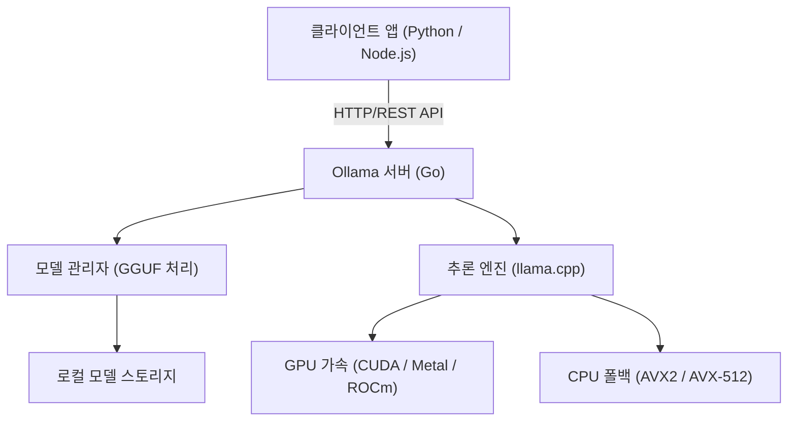
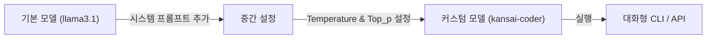

# 시작하며: 왜 로컬 LLM이 필요한가?

대규모 언어 모델(LLM)의 등장으로 우리의 생활과 개발 방식은 극적인 변화를 맞이했습니다. ChatGPT, Claude, Gemini와 같은 클라우드 기반의 강력한 AI 서비스는 나날이 진화를 거듭하며 매우 고도화된 추론 능력을 제공하고 있습니다. 하지만 모든 유스케이스에서 클라우드형 LLM이 최적의 선택인 것은 아닙니다. 클라우드 LLM에는 다음과 같은 과제들이 존재합니다.

1. **개인정보 보호 및 보안 문제**: 기밀 정보나 개인 정보를 포함한 데이터를 외부 서버로 전송하는 것은 기업 컴플라이언스나 보안 관점에서 허용되지 않는 경우가 많습니다.
2. **비용의 불확실성**: API 이용 요금은 토큰 수에 의존하기 때문에, 대규모 데이터 처리나 빈번한 요청이 발생하는 시스템에서는 운영 비용이 한없이 높아질 위험이 있습니다.
3. **지연 시간(Latency) 및 네트워크 의존성**: 오프라인 환경에서의 사용이나, 극히 낮은 지연 시간이 요구되는 엣지 디바이스에서의 실행에는 네트워크 통신이 병목 현상을 일으킵니다.
4. **벤더 락인(Vendor Lock-in)**: 특정 제공업체의 모델에 의존함으로써, 향후 서비스 종료나 약관 변경, 모델 업데이트로 인한 의도치 않은 동작 변화에 영향을 받을 가능성이 있습니다.

이러한 과제들을 해결할 수단으로 주목받고 있는 것이 바로 '로컬 LLM'입니다. 자신의 하드웨어 위에서 모델을 구동함으로써, 데이터를 일절 외부로 전송하지 않고 월 사용료 걱정 없이 자유롭게 AI를 활용할 수 있습니다.

본 기사에서는 로컬 LLM을 놀라울 정도로 쉽게 도입, 관리, API 연동할 수 있는 도구인 '**Ollama**'에 대해, 그 기초부터 내부 아키텍처, Python 및 Node.js를 사용한 고급 API 연동, 나아가 성능 튜닝을 위한 계산 공식에 이르기까지 철저하게 해설합니다.

---

# Ollama란 무엇인가? 그 내부 아키텍처

Ollama는 로컬 환경에서 오픈소스 대규모 언어 모델(Llama 3, Phi-3, Mistral, Gemma 등)을 쉽게 실행하고 관리하기 위한 플랫폼입니다. 그동안 로컬 LLM 환경을 구축하기 위해서는 Python 환경 설정, CUDA 툴킷 설치, PyTorch 의존성 해결, Hugging Face로부터의 거대한 모델 파일 다운로드 및 포맷 변환(Safetensors에서 GGUF로 등)과 같은 매우 번거로운 절차가 필요했습니다.

Ollama는 이러한 복잡성을 숨기고, Docker와 같은 사용 편의성으로 LLM을 다룰 수 있게 해줍니다. 명령어 하나로 모델을 다운로드(`pull`)하고, 실행(`run`)하며, HTTP 서버로 구동할 수 있습니다.

## 핵심 기술: llama.cpp의 래퍼(Wrapper)

Ollama의 추론 엔진 백엔드로 기능하는 것은 C/C++로 구현된 고속 LLM 추론 라이브러리인 '**llama.cpp**'입니다. llama.cpp는 Apple Silicon(Metal), NVIDIA GPU(CUDA), AMD GPU(ROCm), 심지어 CPU 전용 환경에서도 하드웨어의 성능을 최대한 끌어내어 모델을 실행하는 능력을 갖추고 있습니다.

Ollama는 llama.cpp를 내포하고 있으며, Go 언어로 작성된 서버 프로세스가 REST API를 제공하고 백그라운드에서 llama.cpp의 추론 엔진을 호출하는 아키텍처를 채택하고 있습니다.

아래의 Mermaid 다이어그램은 Ollama의 전체적인 아키텍처를 보여줍니다.



이 아키텍처를 통해 개발자는 C++ 빌드나 GPU 드라이버의 세세한 설정을 신경 쓰지 않고도, 표준 HTTP 요청을 통해 고도화된 추론 능력을 이용할 수 있습니다.

---

# Ollama 설치 및 초기 설정

Ollama의 설치는 매우 간단합니다. 각 OS에 최적화된 바이너리가 제공되고 있습니다.

## macOS / Windows

공식 사이트(https://ollama.com/)에서 인스톨러를 다운로드하여 실행하기만 하면 됩니다. macOS 버전은 Apple Silicon의 Metal API를, Windows 버전은 NVIDIA GPU(CUDA)를 자동으로 인식하여 사용 가능한 경우 하드웨어 가속을 활성화합니다.

## Linux

Linux 환경(Ubuntu 등)에서는 다음의 원라이너 명령어를 실행하기만 하면 필요한 컴포넌트가 설치되고, systemd 서비스로서 Ollama 서버가 시작됩니다.

```bash
curl -fsSL https://ollama.com/install.sh | sh
```

설치가 완료되면 터미널에서 버전을 확인해 봅시다.

```bash
ollama --version
```
버전 정보가 표시되면 정상적으로 설치된 것입니다.

## Docker를 사용한 실행

기존 환경을 어지럽히고 싶지 않거나, 컨테이너 기반 인프라에 통합하고 싶은 경우에는 공식 Docker 이미지를 사용하는 것도 가능합니다. GPU를 이용할 경우에는 NVIDIA Container Toolkit의 설치가 필요합니다.

```bash
# CPU만으로 실행할 경우
docker run -d -v ollama:/root/.ollama -p 11434:11434 --name ollama ollama/ollama

# NVIDIA GPU를 이용할 경우
docker run -d --gpus=all -v ollama:/root/.ollama -p 11434:11434 --name ollama ollama/ollama
```

기본적으로 Ollama 서버는 `http://localhost:11434`에서 리슨(listen)합니다.

---

# 모델 관리 및 기본적인 CLI 명령어

Ollama의 가장 큰 매력은 모델 관리가 매우 직관적이라는 점입니다. Docker 이미지를 다루는 감각으로 다양한 모델을 테스트해 볼 수 있습니다.

## 1. 모델 실행 (`run`)

가장 빈번하게 사용하는 명령어입니다. 지정한 모델이 존재하지 않을 경우 자동으로 다운로드(`pull`)되며, 그 후 대화형 프롬프트가 시작됩니다.

```bash
ollama run llama3.1
```

위 명령어를 실행하면 Meta의 최신 모델인 Llama 3.1(8B 파라미터 버전)이 구동됩니다. 프롬프트에 메시지를 입력하면 모델의 답변이 스트리밍으로 표시됩니다. 종료하려면 `/bye` 또는 `Ctrl+D`를 입력합니다.

## 2. 모델 다운로드 (`pull`)

백그라운드에서 모델을 미리 다운로드해 두고 싶을 때는 `pull` 명령어를 사용합니다.

```bash
ollama pull phi3:instruct
ollama pull mistral:v0.3
```

Ollama의 모델 라이브러리에서는 `모델명:태그` 형식으로 버전이나 양자화 수준을 지정할 수 있습니다. 태그를 생략한 경우에는 `latest`가 적용되지만, 특정 양자화 모델(예: `llama3:8b-instruct-q4_0`)을 명시적으로 지정할 수도 있습니다.

### 양자화(Quantization)란?

여기서 잠시 양자화에 대해 짚고 넘어가겠습니다. 일반적인 LLM은 1개의 가중치 파라미터를 16비트 부동소수점(FP16) 등으로 유지합니다. 80억(8B) 파라미터 모델의 경우 가중치만으로 약 16GB의 VRAM을 소비하게 됩니다. 이를 4비트(Q4)나 8비트(Q8) 정수형으로 압축하는 기술이 양자화입니다.

양자화를 통해 모델의 정확도 저하를 최소화하면서 필요한 메모리 용량과 메모리 대역폭을 극적으로 줄일 수 있습니다. Ollama에서 배포되는 모델은 기본적으로 최적의 양자화(대부분 4비트)가 적용된 GGUF 포맷으로 되어 있습니다.

## 3. 모델 목록 표시 (`list`)

로컬에 다운로드되어 있는 모델 목록과 그 크기를 표시합니다.

```bash
ollama list
```
출력 예:
```text
NAME            ID              SIZE      MODIFIED
llama3.1:latest 43f7a214e532    4.7 GB    2 hours ago
phi3:instruct   a2c89ceaed85    2.3 GB    3 days ago
```

## 4. 모델 삭제 (`rm`)

불필요해진 모델을 삭제하여 디스크 공간을 확보합니다.

```bash
ollama rm phi3:instruct
```

---

# Modelfile을 통한 모델 커스터마이즈

Ollama에서는 '**Modelfile**'이라는 메커니즘을 사용하여 기존 모델에 시스템 프롬프트를 주입하거나 하이퍼파라미터를 조정하여 자신만의 맞춤형 모델을 만들 수 있습니다. 이것은 Docker의 Dockerfile 개념과 완전히 동일합니다.

다음 다이어그램은 기본 모델에서 커스텀 모델이 어떻게 파생되는지를 보여줍니다.



예를 들어, 사투리로 답변하는 프로그래밍 어시스턴트 모델을 만들어 봅시다.

작업 디렉토리에 `Modelfile`이라는 이름의 텍스트 파일을 만들고 다음과 같이 작성합니다.

```text
# 베이스가 되는 모델을 지정
FROM llama3.1

# 창의성(temperature) 등 하이퍼파라미터 설정
PARAMETER temperature 0.7
PARAMETER top_p 0.9
PARAMETER repeat_penalty 1.1
PARAMETER num_ctx 4096

# 시스템 프롬프트 설정
SYSTEM """
당신은 세계 최고 수준의 시니어 소프트웨어 엔지니어입니다.
사용자의 기술적인 질문에 대해 반드시 친근한 '사투리'로 답변해 주세요.
코드 예시를 보여줄 때는 베스트 프랙티스를 따르는 모던한 코드를 제공해 주세요.
"""
```

이 Modelfile에서 새로운 모델을 빌드(생성)합니다.

```bash
ollama create kansai-coder -f Modelfile
```

빌드가 완료되면 실행하여 테스트해 봅니다.

```bash
ollama run kansai-coder
>>> Python에서 리스트를 정렬하려면 우째야 되노?
```
그러면 "그거는 마, Python의 `sorted()` 함수나 `sort()` 메서드를 쓰면 되는 기다!"라는 식으로 커스터마이즈된 동작을 보여줍니다. 이를 통해 유스케이스에 특화된 에이전트를 로컬에서 무수히 생성하고 관리하는 것이 가능해집니다.

---

# Ollama REST API 철저 해설

CLI에서의 대화도 편리하지만, 실제 애플리케이션 개발에서 Ollama의 진가가 발휘되는 곳은 강력한 REST API입니다. 서버 프로세스(기본값은 `http://localhost:11434`)에 HTTP 요청을 보냄으로써 추론 결과를 얻을 수 있습니다.

주요 엔드포인트는 다음 3가지입니다.
1. `/api/generate`: 단일 프롬프트에서 텍스트 생성
2. `/api/chat`: OpenAI API와 유사한 형태의 채팅(대화) 생성
3. `/api/embeddings`: 벡터 임베딩(Embeddings) 생성

## /api/generate를 이용한 텍스트 생성

가장 기본적인 생성 엔드포인트입니다. cURL을 사용하여 요청을 보내 봅시다.

```bash
curl -X POST http://localhost:11434/api/generate -d '{
  "model": "llama3.1",
  "prompt": "Explain the concept of quantum entanglement in simple terms.",
  "stream": false
}'
```

`"stream": false`를 지정하면 모든 생성이 완료된 후에 한 번에 JSON이 반환됩니다. 기본값(`true`)인 경우에는 생성된 토큰이 JSON Lines 형식으로 순차적으로 전송되므로, 스트리밍 UI 구현에 적합합니다.

응답 예시 (일부 생략):
```json
{
  "model": "llama3.1",
  "created_at": "2026-09-11T10:00:00.000Z",
  "response": "Quantum entanglement is like having a pair of magical dice...",
  "done": true,
  "context": [128006, 882, 128007, 271, 10445],
  "total_duration": 4567890000,
  "load_duration": 1234000,
  "prompt_eval_count": 14,
  "eval_count": 256,
  "eval_duration": 4321000000
}
```
`context` 배열에는 과거의 대화 상태가 인코딩되어 있으며, 이를 다음 요청에 포함시킴으로써 문맥을 유지할 수 있습니다. 그러나 대화 내역을 더 쉽게 관리하기 위해서는 다음의 `/api/chat`을 사용합니다.

## /api/chat을 이용한 대화 생성

최근의 LLM은 채팅 형식으로 파인튜닝(미세조정)되어 있기 때문에 애플리케이션 개발에서는 `/api/chat`이 권장됩니다.

```bash
curl -X POST http://localhost:11434/api/chat -d '{
  "model": "llama3.1",
  "messages": [
    { "role": "system", "content": "You are a helpful AI assistant." },
    { "role": "user", "content": "What is the capital of France?" },
    { "role": "assistant", "content": "The capital of France is Paris." },
    { "role": "user", "content": "What is its famous tower?" }
  ],
  "stream": false
}'
```
이와 같이 `role`(system, user, assistant)을 가지는 메시지 객체 배열을 전달함으로써 복잡한 대화 컨텍스트를 쉽게 처리할 수 있습니다.

---

# Python 애플리케이션과의 통합

Python은 AI 개발에 있어 가장 표준적인 언어입니다. Ollama를 Python에서 이용하는 방법은 여러 가지가 있지만, 공식적으로 제공되는 `ollama-python` 패키지를 사용하는 것이 가장 쉽고 확실합니다.

## 설치

```bash
pip install ollama
```

## 동기(Synchronous) API 사용

채팅 생성을 수행하는 기본적인 코드입니다.

```python
import ollama

# 채팅 내역을 보관하는 리스트
messages = [
    {'role': 'system', 'content': '당신은 우수한 어시스턴트입니다.'}
]

def chat_with_ollama(user_input):
    messages.append({'role': 'user', 'content': user_input})
    
    # Ollama API 호출
    response = ollama.chat(
        model='llama3.1',
        messages=messages
    )
    
    assistant_reply = response['message']['content']
    messages.append({'role': 'assistant', 'content': assistant_reply})
    
    return assistant_reply

print(chat_with_ollama("머신러닝의 주요 3가지 접근 방식을 알려주세요."))
```

## 비동기 스트리밍(Async Streaming) 사용

웹 애플리케이션(FastAPI나 Starlette) 또는 Discord/Slack 봇을 개발할 때는 블로킹을 방지하기 위해 비동기 API와 스트리밍을 사용하는 것이 중요합니다.

```python
import asyncio
from ollama import AsyncClient

async def generate_stream():
    client = AsyncClient()
    
    # stream=True 를 지정하면 비동기 제너레이터가 반환됨
    async for chunk in await client.chat(
        model='llama3.1',
        messages=[{'role': 'user', 'content': 'Python의 데코레이터에 대해 자세히 설명해 줘.'}],
        stream=True
    ):
        # 청크 단위로 표준 출력에 순차적으로 표시
        print(chunk['message']['content'], end='', flush=True)
        
    print() # 마지막에 줄바꿈

# 비동기 함수 실행
asyncio.run(generate_stream())
```
이렇게 작성함으로써 ChatGPT의 UI처럼 글자가 차례대로 나타나는 UX를 쉽게 구현할 수 있습니다.

## LangChain 및 LlamaIndex와의 연동

RAG(Retrieval-Augmented Generation) 시스템을 구축할 때 자주 활용되는 LangChain이나 LlamaIndex에서도 Ollama는 기본적으로 지원됩니다.

LangChain 예시:
```python
from langchain_community.llms import Ollama

llm = Ollama(model="llama3.1")
response = llm.invoke("Explain dark matter.")
print(response)
```
외부 API 키를 전혀 설정할 필요 없이 LangChain의 강력한 체인이나 에이전트 기능을 로컬에서 구동하는 것이 가능합니다.

---

# Node.js 애플리케이션과의 통합

프론트엔드 엔지니어나 풀스택 개발자에게 있어 TypeScript/Node.js 환경에서 로컬 LLM을 호출할 수 있다는 것은 큰 장점입니다. 공식 `ollama` NPM 패키지를 사용합니다.

## 설치

```bash
npm install ollama
```

## TypeScript를 활용한 챗봇 구현 예시

```typescript
import ollama, { Message } from 'ollama';

async function runChatbot() {
  const messages: Message[] = [
    { role: 'system', content: 'You are a concise expert.' },
    { role: 'user', content: 'Explain RESTful APIs.' }
  ];

  try {
    const response = await ollama.chat({
      model: 'llama3.1',
      messages: messages,
      stream: false,
    });
    
    console.log("Assistant:", response.message.content);
  } catch (error) {
    console.error("Error communicating with Ollama:", error);
  }
}

runChatbot();
```

## 스트리밍을 지원하는 Express 서버 구축

웹 프론트엔드에 스트리밍으로 응답을 반환하는 백엔드 API의 구현 예시입니다. SSE(Server-Sent Events)나 일반적인 HTTP 스트리밍을 사용하여 청크를 전송합니다.

```javascript
import express from 'express';
import { Ollama } from 'ollama';

const app = express();
app.use(express.json());
const ollama = new Ollama({ host: 'http://127.0.0.1:11434' });

app.post('/api/stream-chat', async (req, res) => {
  const { prompt } = req.body;

  // HTTP 응답 헤더 설정(청크 전송)
  res.setHeader('Content-Type', 'text/plain; charset=utf-8');
  res.setHeader('Transfer-Encoding', 'chunked');

  try {
    const stream = await ollama.generate({
      model: 'llama3.1',
      prompt: prompt,
      stream: true,
    });

    for await (const chunk of stream) {
      res.write(chunk.response);
    }
    res.end();
  } catch (err) {
    res.status(500).write("Error generating response.");
    res.end();
  }
});

app.listen(3000, () => {
  console.log('Server is running on port 3000');
});
```

---

# 성능 메트릭 및 수학적 분석

로컬 LLM을 실제 서비스에 견딜 수 있는 수준으로 제공하기 위해서는 지연 시간(Latency)과 처리량(Throughput)의 분석이 필수적입니다. Ollama의 API 응답에는 성능과 관련된 상세한 메트릭이 포함되어 있습니다.

## 토큰 생성 속도 계산 모델

사용자 경험과 직결되는 LLM의 응답 시간은 크게 '**Time To First Token (TTFT)**'과 '**Time Per Output Token (TPOT)**'으로 분해할 수 있습니다.

전체 생성 시간 $T_{total}$은 생성되는 토큰 수를 $N$이라고 할 때, 다음과 같이 공식화됩니다.

$$
T_{total} = t_{ttft} + \sum_{i=1}^{N-1} t_{tpot}^{(i)}
$$

여기서 각 토큰 생성에 걸리는 평균 시간을 $\bar{t}_{tpot}$로 근사하면, 식은 단순화됩니다.

$$
T_{total} \approx t_{ttft} + (N - 1) \times \bar{t}_{tpot}
$$

Ollama의 API 응답 필드와의 대응은 다음과 같습니다.
- `prompt_eval_duration`: 이것이 대략 $t_{ttft}$(프롬프트 평가 시간)에 해당합니다. 나노초(ns) 단위로 반환됩니다.
- `eval_duration`: 생성 프로세스 전체에 걸린 시간입니다.
- `eval_count`: 생성된 토큰 수 $N$입니다.

따라서 1초당 토큰 생성 속도(Tokens Per Second: TPS)는 다음 공식으로 계산할 수 있습니다.

$$
TPS = \frac{eval\_count}{(eval\_duration / 10^9)} \quad [\text{tokens/sec}]
$$

예를 들어, `eval_count: 256`, `eval_duration: 4321000000` (약 4.32초) 인 경우,
$$
TPS = \frac{256}{4.321} \approx 59.24 \text{ tokens/sec}
$$
가 됩니다. 로컬 환경에서 50토큰/초를 넘는다면 사람이 읽는 속도를 훨씬 뛰어넘으므로, 매우 쾌적한 응답 경험을 제공하고 있다고 할 수 있습니다.

## 필요 VRAM 용량 추정 공식

로컬에서 모델을 구동할 때, 모델이 GPU의 VRAM 안에 들어가는지 여부가 성능의 열쇠를 쥐고 있습니다. VRAM에 다 들어가지 못해 시스템의 메인 메모리(RAM)로 폴백(fallback)될 경우 생성 속도는 현저히 저하됩니다.

필요한 메모리 용량 $M$(기가바이트)을 추정하기 위한 간단한 공식은 다음과 같습니다.

$$
M \approx \frac{P \times Q}{8 \times 1024} + C
$$

- $P$: 모델의 파라미터 수 (예: 8B = $8000 \times 10^6$)
- $Q$: 양자화 비트 수 (예: 4-bit, 8-bit, 16-bit)
- $C$: 컨텍스트 윈도우를 위한 추가 메모리 (KV 캐시 등. 모델 및 설정에 따라 다르지만, 일반적으로 1~2GB 정도를 예상함)

**계산 예시**: Llama 3 (8B 파라미터)를 4-bit 양자화로 구동할 경우
$$
M_{model} = \frac{8,000 \times 4}{8 \times 1024} = \frac{32,000}{8192} \approx 3.9 \text{ GB}
$$
여기에 컨텍스트용 메모리를 더하면 약 5GB~6GB의 VRAM이 있으면 GPU상에 완전히 모델을 로드(Full Offload)할 수 있다는 것을 알 수 있습니다. 최근의 8GB VRAM을 탑재한 미들 클래스 GPU(RTX 4060 등)에서도 충분히 강력한 LLM을 동작시키는 것이 가능합니다.

---

# 발전된 유스케이스와 마무리

Ollama를 API로서 로컬 네트워크 내에 공개함으로써 단순한 챗봇 이상의 다양한 응용이 가능해집니다.

### 1. 로컬 RAG (Retrieval-Augmented Generation) 구축
ChromaDB나 Qdrant와 같은 로컬 벡터 데이터베이스와 Ollama의 `/api/embeddings` 엔드포인트(`nomic-embed-text` 등의 임베딩 모델 이용)를 결합함으로써, 사내 기밀 문서를 읽게 하여 질의응답을 수행하는 안전한 RAG 시스템을 완전히 오프라인으로 구축할 수 있습니다.

### 2. IDE 및 에디터의 AI 어시스턴트
VS Code의 확장 기능(Continue.dev 등)이나 Neovim 플러그인의 백엔드로 Ollama를 지정함으로써, GitHub Copilot과 같은 코드 자동 완성이나 코드 해설을 로컬 모델(예: `codellama`나 `deepseek-coder`)을 사용하여 무료로 수행할 수 있습니다.

### 3. 자동화 스크립트와의 결합
Python이나 셸 스크립트에 Ollama의 API 요청을 통합하여, 로그의 자동 요약, Git 커밋 메시지 자동 생성, 정형문 분류 작업 등 일상적인 업무 흐름 곳곳에 AI의 힘을 주입할 수 있습니다.

## 결론

Ollama의 등장으로 로컬 LLM의 도입 장벽은 극적으로 낮아졌습니다. Docker 컨테이너를 조작하는 듯한 단순한 명령어 체계와 외부 애플리케이션에서 쉽게 이용할 수 있는 REST API의 조합은 로컬 AI 개발에 있어 현재의 데팩토 스탠더드(사실상의 표준)라고 해도 과언이 아닙니다.

클라우드 LLM의 비용이나 보안 제약으로 고민하고 있는 개발자라면, 꼭 본 기사에서 소개한 절차를 참고하여 Ollama를 이용한 로컬 LLM 환경을 구축하고 자신의 애플리케이션에 통합해 보시기 바랍니다. AI가 가진 가능성을 더욱 자유롭고 가깝게 느낄 수 있을 것입니다.

