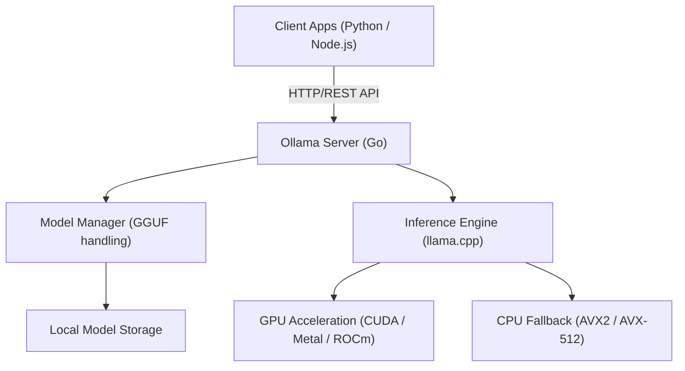
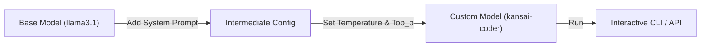

# はじめに：なぜローカルLLMが必要なのか？

大規模言語モデル（LLM）の台頭により、私たちの生活や開発手法は劇的な変化を遂げました。ChatGPTやClaude、Geminiといったクラウドベースの強力なAIサービスは、日々進化を続けており、非常に高度な推論能力を提供しています。しかし、すべてのユースケースにおいてクラウド型のLLMが最適であるとは限りません。クラウドLLMには以下のような課題が存在します。

1. **プライバシーとセキュリティの問題**: 機密情報や個人情報を含むデータを外部のサーバーに送信することは、企業コンプライアンスやセキュリティの観点から許容されないケースが多々あります。
2. **コストの不確実性**: APIの利用料金はトークン数に依存するため、大規模なデータ処理や頻繁なリクエストを行うシステムでは、ランニングコストが青天井になるリスクがあります。
3. **レイテンシとネットワーク依存**: オフライン環境での利用や、極めて低いレイテンシが求められるエッジデバイスでの実行には、ネットワーク通信がボトルネックとなります。
4. **ベンダーロックイン**: 特定のプロバイダのモデルに依存することで、将来的なサービス終了や規約変更、モデルのアップデートによる意図しない挙動の変更に影響を受ける可能性があります。

これらの課題を解決する手段として注目を集めているのが「ローカルLLM」です。自身のハードウェア上でモデルを動かすことで、データを一切外部に送信せず、月額費用も気にすることなく、自由にAIを活用することができます。

本記事では、ローカルLLMを驚くほど簡単に導入・管理・API連携できるツール「**Ollama**」について、その基礎から内部アーキテクチャ、PythonやNode.jsを用いた高度なAPI連携、さらにはパフォーマンスチューニングの計算式に至るまで、徹底的に解説します。

---

# Ollamaとは何か？その内部アーキテクチャ

Ollamaは、ローカル環境でオープンソースの大規模言語モデル（Llama 3, Phi-3, Mistral, Gemmaなど）を簡単に実行・管理するためのプラットフォームです。これまでローカルLLM環境を構築するためには、Python環境のセットアップ、CUDAツールキットのインストール、PyTorchの依存関係の解決、Hugging Faceからの巨大なモデルファイルのダウンロードとフォーマット変換（SafetensorsからGGUFへなど）といった、非常に煩雑な手順が必要でした。

Ollamaは、これらの複雑さを隠蔽し、Dockerのような使い勝手でLLMを扱えるようにします。コマンド一つでモデルをダウンロード（`pull`）し、実行（`run`）し、HTTPサーバーとして立ち上げることができます。

## コア・テクノロジー：llama.cppのラッパー

Ollamaの推論エンジンのバックエンドとして機能しているのは、C/C++で実装された高速なLLM推論ライブラリである「**llama.cpp**」です。llama.cppは、Apple Silicon（Metal）やNVIDIA GPU（CUDA）、AMD GPU（ROCm）、さらにはCPUのみの環境であっても、ハードウェアの性能を最大限に引き出してモデルを実行する能力を持っています。

Ollamaはllama.cppを内包しており、Go言語で書かれたサーバープロセスがREST APIを提供し、バックグラウンドでllama.cppの推論エンジンを呼び出すというアーキテクチャを採用しています。

以下のMermaid図は、Ollamaの全体的なアーキテクチャを示しています。



このアーキテクチャにより、開発者はC++のビルドやGPUドライバの細かい設定を意識することなく、標準的なHTTPリクエストを通じて高度な推論能力を利用することができます。

---

# Ollamaのインストールと初期セットアップ

Ollamaのインストールは非常にシンプルです。各OS向けに最適化されたバイナリが提供されています。

## macOS / Windows

公式サイト（https://ollama.com/）からインストーラーをダウンロードし、実行するだけです。macOS版はApple SiliconのMetal APIを、Windows版はNVIDIA GPU（CUDA）を自動的に認識し、利用可能な場合はハードウェアアクセラレーションを有効にします。

## Linux

Linux環境（Ubuntuなど）では、以下のワンライナーコマンドを実行するだけで、必要なコンポーネントがインストールされ、systemdサービスとしてOllamaサーバーが起動します。

```bash
curl -fsSL https://ollama.com/install.sh | sh
```

インストールが完了したら、ターミナルでバージョンを確認してみましょう。

```bash
ollama --version
```
バージョン情報が表示されれば、正常にインストールされています。

## Dockerを使用した実行

既存の環境を汚したくない場合や、コンテナベースのインフラストラクチャに統合したい場合は、公式のDockerイメージを使用することも可能です。GPUを利用する場合は、NVIDIA Container Toolkitのインストールが必要です。

```bash
# CPUのみで実行する場合
docker run -d -v ollama:/root/.ollama -p 11434:11434 --name ollama ollama/ollama

# NVIDIA GPUを利用する場合
docker run -d --gpus=all -v ollama:/root/.ollama -p 11434:11434 --name ollama ollama/ollama
```

デフォルトでOllamaサーバーは `http://localhost:11434` でリッスンします。

---

# モデルの管理と基本的なCLIコマンド

Ollamaの最大の魅力は、モデルの管理が非常に直感的であることです。Dockerイメージを扱う感覚で、様々なモデルを試すことができます。

## 1. モデルの実行 (`run`)

最も頻繁に使用するコマンドです。指定したモデルが存在しない場合は自動的にダウンロード（`pull`）され、その後対話型のプロンプトが立ち上がります。

```bash
ollama run llama3.1
```

上記コマンドを実行すると、Metaの最新モデルであるLlama 3.1（8Bパラメータ版）が起動します。プロンプトにメッセージを入力すると、モデルからの返答がストリーミングで表示されます。終了するには `/bye` または `Ctrl+D` を入力します。

## 2. モデルのダウンロード (`pull`)

バックグラウンドでモデルをダウンロードしておきたい場合は `pull` コマンドを使用します。

```bash
ollama pull phi3:instruct
ollama pull mistral:v0.3
```

Ollamaのモデルライブラリでは、`モデル名:タグ` という形式でバージョンや量子化レベルを指定できます。タグを省略した場合は `latest` が適用されますが、特定の量子化モデル（例：`llama3:8b-instruct-q4_0`）を明示的に指定することも可能です。

### 量子化（Quantization）とは？

ここで少し、量子化について触れておきましょう。通常のLLMは、1つの重みパラメータを16ビット浮動小数点（FP16）などで保持します。80億（8B）パラメータのモデルの場合、重みだけで約16GBのVRAMを消費することになります。これを4ビット（Q4）や8ビット（Q8）の整数型に圧縮する技術が量子化です。

量子化により、モデルの精度劣化を最小限に抑えつつ、必要なメモリ量とメモリ帯域幅を劇的に削減できます。Ollamaで配布されているモデルは、デフォルトで最適な量子化（多くの場合4ビット）が施されたGGUFフォーマットとなっています。

## 3. モデルの一覧表示 (`list`)

ローカルにダウンロードされているモデルの一覧と、そのサイズを表示します。

```bash
ollama list
```
出力例：
```text
NAME            ID              SIZE      MODIFIED
llama3.1:latest 43f7a214e532    4.7 GB    2 hours ago
phi3:instruct   a2c89ceaed85    2.3 GB    3 days ago
```

## 4. モデルの削除 (`rm`)

不要になったモデルを削除してディスクスペースを解放します。

```bash
ollama rm phi3:instruct
```

---

# Modelfileによるモデルのカスタマイズ

Ollamaでは「**Modelfile**」という仕組みを使って、既存のモデルに対してシステムプロンプトの注入やハイパーパラメータの調整を行い、独自のカスタムモデルを作成することができます。これはDockerのDockerfileの概念と全く同じです。

以下の図は、ベースモデルからカスタムモデルがどのように派生するかを示しています。



例として、関西弁で回答するプログラミングアシスタントモデルを作成してみましょう。

作業ディレクトリに `Modelfile` という名前のテキストファイルを作成し、以下のように記述します。

```text
# ベースとなるモデルを指定
FROM llama3.1

# 創造性（temperature）などのハイパーパラメータを設定
PARAMETER temperature 0.7
PARAMETER top_p 0.9
PARAMETER repeat_penalty 1.1
PARAMETER num_ctx 4096

# システムプロンプトを設定
SYSTEM """
あなたは世界トップクラスのシニアソフトウェアエンジニアです。
ユーザーからの技術的な質問に対して、必ず「関西弁」で親しみやすく回答してください。
コードの例を示す場合は、ベストプラクティスに従ったモダンなコードを提供してください。
"""
```

このModelfileから新しいモデルをビルド（作成）します。

```bash
ollama create kansai-coder -f Modelfile
```

ビルドが完了したら、実行してテストしてみます。

```bash
ollama run kansai-coder
>>> Pythonでリストをソートするにはどうすればええの？
```
すると、「それはな、Pythonの `sorted()` 関数か `sort()` メソッドを使えばええんやで！」といった具合にカスタマイズされた振る舞いを示します。これにより、ユースケースに特化したエージェントをローカルで無数に作成・管理することが可能になります。

---

# Ollama REST APIの徹底解説

CLIでの対話も便利ですが、実際のアプリケーション開発においてOllamaの真価を発揮するのは、強力なREST APIです。サーバープロセス（デフォルトでは `http://localhost:11434`）に対してHTTPリクエストを送ることで、推論結果を取得できます。

主要なエンドポイントは以下の3つです。
1. `/api/generate`: 単一のプロンプトからのテキスト生成
2. `/api/chat`: OpenAI APIに近い形式のチャット（対話）生成
3. `/api/embeddings`: ベクトル埋め込み（Embeddings）の生成

## /api/generate を使ったテキスト生成

最も基本的な生成エンドポイントです。cURLを使用してリクエストを送ってみましょう。

```bash
curl -X POST http://localhost:11434/api/generate -d '{
  "model": "llama3.1",
  "prompt": "Explain the concept of quantum entanglement in simple terms.",
  "stream": false
}'
```

`"stream": false` を指定することで、すべての生成が完了した後に一度にJSONが返されます。デフォルト（`true`）の場合は、生成されたトークンがJSON Linesの形式で順次送られてくるため、ストリーミングUIの実装に適しています。

レスポンスの例（一部省略）：
```json
{
  "model": "llama3.1",
  "created_at": "2026-09-11T10:00:00.000Z",
  "response": "Quantum entanglement is like having a pair of magical dice...",
  "done": true,
  "context": [128006, 882, 128007, 271, 10445],
  "total_duration": 4567890000,
  "load_duration": 1234000,
  "prompt_eval_count": 14,
  "eval_count": 256,
  "eval_duration": 4321000000
}
```
`context` 配列には過去の会話状態がエンコードされており、これを次のリクエストに含めることで文脈を維持できます。しかし、より簡単に会話履歴を管理するためには、次の `/api/chat` を使用します。

## /api/chat を使った対話生成

最近のLLMはチャット形式でファインチューニングされているため、アプリケーション開発では `/api/chat` が推奨されます。

```bash
curl -X POST http://localhost:11434/api/chat -d '{
  "model": "llama3.1",
  "messages": [
    { "role": "system", "content": "You are a helpful AI assistant." },
    { "role": "user", "content": "What is the capital of France?" },
    { "role": "assistant", "content": "The capital of France is Paris." },
    { "role": "user", "content": "What is its famous tower?" }
  ],
  "stream": false
}'
```
このように、`role`（system, user, assistant）を持つメッセージオブジェクトの配列を渡すことで、複雑な対話コンテキストを容易に処理できます。

---

# Pythonアプリケーションとの統合

PythonはAI開発において最も標準的な言語です。OllamaをPythonから利用する方法はいくつかありますが、公式が提供している `ollama-python` パッケージを使用するのが最も簡単で確実です。

## インストール

```bash
pip install ollama
```

## 同期（Synchronous）APIの利用

チャットの生成を行う基本的なコードです。

```python
import ollama

# チャット履歴を保持するリスト
messages = [
    {'role': 'system', 'content': 'あなたは優秀なアシスタントです。'}
]

def chat_with_ollama(user_input):
    messages.append({'role': 'user', 'content': user_input})
    
    # Ollama APIを呼び出し
    response = ollama.chat(
        model='llama3.1',
        messages=messages
    )
    
    assistant_reply = response['message']['content']
    messages.append({'role': 'assistant', 'content': assistant_reply})
    
    return assistant_reply

print(chat_with_ollama("機械学習の主要な3つのアプローチを教えてください。"))
```

## 非同期ストリーミング（Async Streaming）の利用

Webアプリケーション（FastAPIやStarlette）や、Discord / Slackのボットを開発する場合、ブロックを避けるために非同期APIとストリーミングを使用することが重要です。

```python
import asyncio
from ollama import AsyncClient

async def generate_stream():
    client = AsyncClient()
    
    # stream=True を指定すると非同期ジェネレータが返される
    async for chunk in await client.chat(
        model='llama3.1',
        messages=[{'role': 'user', 'content': 'Pythonのデコレータについて詳しく解説して。'}],
        stream=True
    ):
        # チャンクごとに標準出力に逐次表示
        print(chunk['message']['content'], end='', flush=True)
        
    print() # 最後に改行

# 非同期関数を実行
asyncio.run(generate_stream())
```
このように記述することで、ChatGPTのUIのように文字がパラパラと表示されるUXを簡単に実装できます。

## LangChainやLlamaIndexとの連携

RAG（Retrieval-Augmented Generation）システムを構築する際によく利用されるLangChainやLlamaIndexにおいても、Ollamaはネイティブにサポートされています。

LangChainでの例：
```python
from langchain_community.llms import Ollama

llm = Ollama(model="llama3.1")
response = llm.invoke("Explain dark matter.")
print(response)
```
外部APIキーを一切設定することなく、LangChainの強力なチェインやエージェント機能をローカルで動かすことが可能です。

---

# Node.jsアプリケーションとの統合

フロントエンドエンジニアやフルスタック開発者にとって、TypeScript/Node.js環境からローカルLLMを呼び出せることは大きなメリットです。公式の `ollama` NPMパッケージを使用します。

## インストール

```bash
npm install ollama
```

## TypeScriptを用いたチャットボットの実装例

```typescript
import ollama, { Message } from 'ollama';

async function runChatbot() {
  const messages: Message[] = [
    { role: 'system', content: 'You are a concise expert.' },
    { role: 'user', content: 'Explain RESTful APIs.' }
  ];

  try {
    const response = await ollama.chat({
      model: 'llama3.1',
      messages: messages,
      stream: false,
    });
    
    console.log("Assistant:", response.message.content);
  } catch (error) {
    console.error("Error communicating with Ollama:", error);
  }
}

runChatbot();
```

## ストリーミング対応のExpressサーバーの構築

Webフロントエンドにストリーミングで応答を返すバックエンドAPIの実装例です。SSE（Server-Sent Events）や、通常のHTTPストリーミングを用いてチャンクを送信します。

```javascript
import express from 'express';
import { Ollama } from 'ollama';

const app = express();
app.use(express.json());
const ollama = new Ollama({ host: 'http://127.0.0.1:11434' });

app.post('/api/stream-chat', async (req, res) => {
  const { prompt } = req.body;

  // HTTPレスポンスヘッダーの設定（チャンク転送）
  res.setHeader('Content-Type', 'text/plain; charset=utf-8');
  res.setHeader('Transfer-Encoding', 'chunked');

  try {
    const stream = await ollama.generate({
      model: 'llama3.1',
      prompt: prompt,
      stream: true,
    });

    for await (const chunk of stream) {
      res.write(chunk.response);
    }
    res.end();
  } catch (err) {
    res.status(500).write("Error generating response.");
    res.end();
  }
});

app.listen(3000, () => {
  console.log('Server is running on port 3000');
});
```

---

# パフォーマンスメトリクスと数理的分析

ローカルLLMを実運用に耐えうるレベルで提供するためには、レイテンシとスループットの分析が不可欠です。OllamaのAPIレスポンスには、パフォーマンスに関する詳細なメトリクスが含まれています。

## トークン生成速度の計算モデル

ユーザー体験に直結するLLMのレスポンスタイムは、大きく「**Time To First Token (TTFT)**」と「**Time Per Output Token (TPOT)**」に分解できます。

全体の生成時間 $T_{total}$ は、生成されるトークン数を $N$ とすると、次のように定式化されます。

$$
T_{total} = t_{ttft} + \sum_{i=1}^{N-1} t_{tpot}^{(i)}
$$

ここで、各トークンの生成にかかる平均時間を $\bar{t}_{tpot}$ と近似すると、式は単純化されます。

$$
T_{total} \approx t_{ttft} + (N - 1) \times \bar{t}_{tpot}
$$

OllamaのAPIレスポンスフィールドとの対応は以下の通りです。
- `prompt_eval_duration`: これが概ね $t_{ttft}$（プロンプトの評価時間）に相当します。ナノ秒単位で返されます。
- `eval_duration`: 生成プロセス全体にかかった時間。
- `eval_count`: 生成されたトークン数 $N$。

したがって、1秒あたりのトークン生成速度（Tokens Per Second: TPS）は以下の数式で計算できます。

$$
TPS = \frac{eval\_count}{(eval\_duration / 10^9)} \quad [\text{tokens/sec}]
$$

例えば、`eval_count: 256`、`eval_duration: 4321000000` (約4.32秒) の場合、
$$
TPS = \frac{256}{4.321} \approx 59.24 \text{ tokens/sec}
$$
となります。ローカル環境で50トークン/秒を超えていれば、人間が読む速度をはるかに上回るため、非常に快適なレスポンス体験を提供できていると言えます。

## 必要VRAM容量の推定式

ローカルでモデルを動かす際、モデルがGPUのVRAMに収まるかどうかがパフォーマンスの鍵を握ります。VRAMに収まりきらずシステムのメインメモリ（RAM）にフォールバックした場合、生成速度は著しく低下します。

必要なメモリ容量 $M$（ギガバイト）を推定するための簡易的な数式は以下のようになります。

$$
M \approx \frac{P \times Q}{8 \times 1024} + C
$$

- $P$: モデルのパラメータ数（例：8B = $8000 \times 10^6$）
- $Q$: 量子化のビット数（例：4-bit, 8-bit, 16-bit）
- $C$: コンテキストウィンドウ用の追加メモリ（KVキャッシュなど。モデルと設定に依存するが、一般的に1〜2GB程度を見込む）

**計算例**: Llama 3 (8Bパラメータ) を 4-bit 量子化で動かす場合
$$
M_{model} = \frac{8,000 \times 4}{8 \times 1024} = \frac{32,000}{8192} \approx 3.9 \text{ GB}
$$
これにコンテキスト用メモリを足すと、約5GB〜6GBのVRAMがあれば、GPU上で完全にモデルを展開（Full Offload）できることがわかります。近年の8GB VRAMを搭載したミドルクラスのGPU（RTX 4060など）でも、十分に強力なLLMを動作させることが可能です。

---

# 発展的なユースケースとまとめ

OllamaをAPIとしてローカルネットワーク内に公開することで、単なるチャットボット以上の様々な応用が可能になります。

### 1. ローカルRAG（Retrieval-Augmented Generation）の構築
ChromaDBやQdrantなどのローカルベクトルデータベースと、Ollamaの `/api/embeddings` エンドポイント（`nomic-embed-text` などの埋め込みモデルを利用）を組み合わせることで、社内の機密ドキュメントを読み込ませて質問応答を行うセキュアなRAGシステムを完全にオフラインで構築できます。

### 2. IDEやエディタのAIアシスタント
VS Codeの拡張機能（Continue.devなど）やNeovimプラグインのバックエンドとしてOllamaを指定することで、GitHub Copilotのようなコード補完やコード解説を、ローカルモデル（例：`codellama` や `deepseek-coder`）を用いて無料で行うことができます。

### 3. 自動化スクリプトへの組み込み
PythonやシェルスクリプトにOllamaのAPIリクエストを組み込むことで、ログの自動要約、Gitのコミットメッセージの自動生成、定型文の分類タスクなど、日々の業務フローの至る所にAIの力を注入できます。

## 結論

Ollamaの登場により、ローカルLLMの導入ハードルは劇的に下がりました。Dockerコンテナを操作するようなシンプルなコマンド体系と、外部アプリケーションから容易に利用できるREST APIの組み合わせは、ローカルAI開発における現在のデファクトスタンダードと言っても過言ではありません。

クラウドLLMのコストやセキュリティの制約に悩まされている開発者の方は、ぜひ本記事で紹介した手順を参考に、Ollamaを用いたローカルLLM環境を構築し、自身のアプリケーションに統合してみてください。AIの持つ可能性を、より自由に、より身近に感じることができるはずです。

