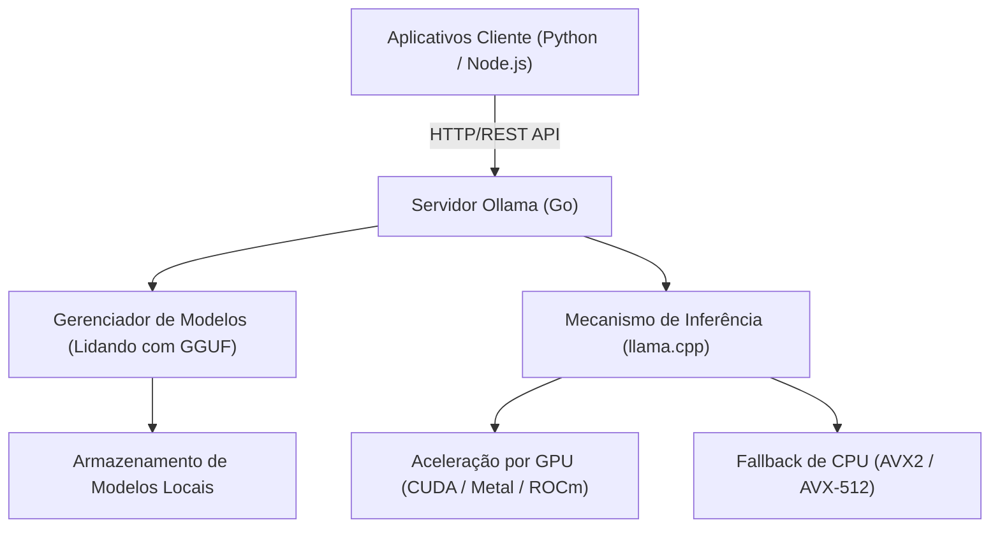
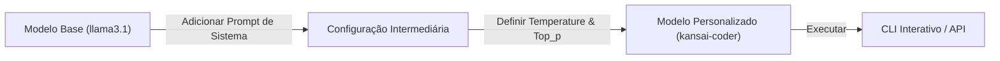

# Introdução: Por que precisamos de um LLM local?

Com a ascensão dos Grandes Modelos de Linguagem (LLMs), nossas vidas e métodos de desenvolvimento passaram por mudanças drásticas. Poderosos serviços de IA baseados em nuvem, como ChatGPT, Claude e Gemini, continuam evoluindo diariamente, oferecendo capacidades de raciocínio altamente avançadas. No entanto, um LLM baseado em nuvem não é necessariamente a melhor opção para todos os casos de uso. Os LLMs em nuvem apresentam os seguintes desafios:

1. **Problemas de Privacidade e Segurança**: Enviar dados contendo informações confidenciais ou pessoais para servidores externos costuma ser inaceitável do ponto de vista de segurança e conformidade corporativa.
2. **Incerteza de Custos**: Como as taxas de uso de API dependem do número de tokens, sistemas que processam grandes volumes de dados ou fazem solicitações frequentes correm o risco de ter custos operacionais ilimitados.
3. **Latência e Dependência de Rede**: O uso em ambientes offline ou a execução em dispositivos de borda (*edge devices*), que exigem latência extremamente baixa, encontram na comunicação de rede um gargalo.
4. **Dependência de Fornecedor (Vendor Lock-in)**: A dependência de um modelo de um provedor específico pode torná-lo suscetível a encerramentos futuros do serviço, mudanças nos termos de uso e alterações não intencionais de comportamento devido a atualizações do modelo.

Os "LLMs locais" estão ganhando atenção como um meio para resolver esses desafios. Ao executar o modelo em seu próprio hardware, você pode utilizar a IA livremente sem enviar nenhum dado para o exterior e sem se preocupar com custos mensais.

Neste artigo, explicaremos detalhadamente sobre o "**Ollama**", uma ferramenta que permite introduzir, gerenciar e integrar LLMs locais de forma incrivelmente fácil por meio de APIs. Abordaremos desde os fundamentos até sua arquitetura interna, integração avançada de API usando Python e Node.js e fórmulas para ajuste de desempenho.

---

# O que é o Ollama? Sua Arquitetura Interna

O Ollama é uma plataforma para executar e gerenciar facilmente grandes modelos de linguagem de código aberto (Llama 3, Phi-3, Mistral, Gemma, etc.) em um ambiente local. Anteriormente, a construção de um ambiente LLM local exigia procedimentos extremamente complexos, como configurar o ambiente Python, instalar o kit de ferramentas CUDA, resolver dependências do PyTorch, baixar arquivos de modelos gigantescos do Hugging Face e convertê-los de formato (de Safetensors para GGUF, por exemplo).

O Ollama oculta essas complexidades, permitindo que você lide com LLMs com a mesma facilidade de uso do Docker. Com um único comando, você pode baixar o modelo (`pull`), executá-lo (`run`) e iniciá-lo como um servidor HTTP.

## Tecnologia Principal: Wrapper do llama.cpp

O backend do mecanismo de inferência do Ollama é o "**llama.cpp**", uma biblioteca de inferência de LLM de alta velocidade implementada em C/C++. O llama.cpp tem a capacidade de executar o modelo maximizando o desempenho do hardware, seja no Apple Silicon (Metal), GPU NVIDIA (CUDA), GPU AMD (ROCm) ou até mesmo em ambientes que usam apenas a CPU.

O Ollama inclui o llama.cpp internamente e adota uma arquitetura onde o processo do servidor, escrito em linguagem Go, fornece uma API REST, chamando o mecanismo de inferência do llama.cpp em segundo plano.

O diagrama Mermaid abaixo ilustra a arquitetura geral do Ollama.



Com essa arquitetura, os desenvolvedores podem utilizar recursos avançados de inferência por meio de solicitações HTTP padrão, sem se preocuparem com compilações em C++ ou configurações detalhadas de drivers de GPU.

---

# Instalação e Configuração Inicial do Ollama

A instalação do Ollama é muito simples. São fornecidos binários otimizados para cada sistema operacional.

## macOS / Windows

Basta baixar o instalador do site oficial (https://ollama.com/) e executá-lo. A versão para macOS reconhece automaticamente a API Metal do Apple Silicon, enquanto a versão para Windows reconhece GPUs NVIDIA (CUDA), ativando a aceleração de hardware se estiverem disponíveis.

## Linux

Em ambientes Linux (como Ubuntu), ao executar o seguinte comando de uma linha, os componentes necessários são instalados e o servidor Ollama é iniciado como um serviço systemd.

```bash
curl -fsSL https://ollama.com/install.sh | sh
```

Após a conclusão da instalação, vamos verificar a versão no terminal.

```bash
ollama --version
```
Se as informações da versão forem exibidas, a instalação foi realizada com sucesso.

## Execução usando Docker

Se você não deseja sujar o ambiente existente ou se quer integrá-lo a uma infraestrutura baseada em contêineres, é possível usar a imagem oficial do Docker. Para utilizar a GPU, é necessária a instalação do NVIDIA Container Toolkit.

```bash
# Para executar usando apenas CPU
docker run -d -v ollama:/root/.ollama -p 11434:11434 --name ollama ollama/ollama

# Para utilizar a GPU NVIDIA
docker run -d --gpus=all -v ollama:/root/.ollama -p 11434:11434 --name ollama ollama/ollama
```

Por padrão, o servidor Ollama escuta em `http://localhost:11434`.

---

# Gerenciamento de Modelos e Comandos Básicos da CLI

O maior atrativo do Ollama é que o gerenciamento de modelos é muito intuitivo. Você pode experimentar vários modelos com a mesma facilidade de lidar com imagens Docker.

## 1. Execução do Modelo (`run`)

Este é o comando usado com mais frequência. Se o modelo especificado não existir, ele será baixado automaticamente (`pull`) e, em seguida, um prompt interativo será iniciado.

```bash
ollama run llama3.1
```

Ao executar o comando acima, o Llama 3.1 (versão de parâmetros de 8B), o modelo mais recente da Meta, será iniciado. Ao digitar uma mensagem no prompt, a resposta do modelo será exibida via streaming. Para sair, digite `/bye` ou `Ctrl+D`.

## 2. Download do Modelo (`pull`)

Use o comando `pull` se quiser baixar o modelo em segundo plano.

```bash
ollama pull phi3:instruct
ollama pull mistral:v0.3
```

Na biblioteca de modelos do Ollama, você pode especificar a versão ou o nível de quantização no formato `nome-do-modelo:tag`. Se a tag for omitida, `latest` será aplicado, mas também é possível especificar explicitamente um modelo quantizado específico (por exemplo: `llama3:8b-instruct-q4_0`).

### O que é Quantização?

Vamos abordar brevemente a quantização aqui. Em LLMs comuns, um único parâmetro de peso é mantido em formato de ponto flutuante de 16 bits (FP16), por exemplo. Para um modelo com 8 bilhões (8B) de parâmetros, apenas os pesos consumiriam cerca de 16 GB de VRAM. A quantização é a técnica que comprime isso em tipos inteiros de 4 bits (Q4) ou 8 bits (Q8).

Com a quantização, o consumo de memória necessário e a largura de banda da memória podem ser reduzidos drasticamente, enquanto a degradação da precisão do modelo é minimizada. Os modelos distribuídos pelo Ollama estão, por padrão, no formato GGUF e aplicam a quantização ideal (na maioria das vezes 4 bits).

## 3. Listagem de Modelos (`list`)

Exibe uma lista dos modelos baixados localmente e seus respectivos tamanhos.

```bash
ollama list
```
Exemplo de saída:
```text
NAME            ID              SIZE      MODIFIED
llama3.1:latest 43f7a214e532    4.7 GB    2 hours ago
phi3:instruct   a2c89ceaed85    2.3 GB    3 days ago
```

## 4. Remoção de Modelo (`rm`)

Libere espaço em disco excluindo modelos que não são mais necessários.

```bash
ollama rm phi3:instruct
```

---

# Personalização de Modelo usando o Modelfile

No Ollama, você pode usar um mecanismo chamado "**Modelfile**" para criar seu próprio modelo personalizado ajustando hiperparâmetros ou injetando um prompt de sistema no modelo existente. É exatamente o mesmo conceito do Dockerfile do Docker.

O diagrama abaixo mostra como um modelo personalizado deriva do modelo base.



Como exemplo, vamos criar um modelo assistente de programação que responde em dialeto Kansai (japonês).

Crie um arquivo de texto com o nome `Modelfile` no seu diretório de trabalho e escreva o seguinte:

```text
# Especifica o modelo base
FROM llama3.1

# Define hiperparâmetros como criatividade (temperature)
PARAMETER temperature 0.7
PARAMETER top_p 0.9
PARAMETER repeat_penalty 1.1
PARAMETER num_ctx 4096

# Configura o prompt de sistema
SYSTEM """
Você é um engenheiro de software sênior de classe mundial.
Você deve responder às perguntas técnicas dos usuários de maneira amigável, utilizando um tom coloquial ou um dialeto regional.
Ao mostrar exemplos de código, forneça um código moderno que siga as melhores práticas.
"""
```

Crie (compile) um novo modelo a partir deste Modelfile.

```bash
ollama create kansai-coder -f Modelfile
```

Após a conclusão da compilação, vamos executá-lo e testá-lo.

```bash
ollama run kansai-coder
>>> Como faço para classificar uma lista em Python?
```
A resposta será algo como: "Olha, você pode usar a função `sorted()` ou o método `sort()` do Python!", mostrando um comportamento personalizado. Isso permite criar e gerenciar uma infinidade de agentes locais especializados para cada caso de uso.

---

# Explicação Completa da REST API do Ollama

A interação por meio do CLI é conveniente, mas na prática, o verdadeiro valor do Ollama no desenvolvimento de aplicativos está em sua poderosa API REST. Você pode obter resultados de inferência enviando solicitações HTTP para o processo do servidor (por padrão, `http://localhost:11434`).

Os três principais endpoints são os seguintes:
1. `/api/generate`: Geração de texto a partir de um prompt único
2. `/api/chat`: Geração de chat (diálogo) semelhante à API da OpenAI
3. `/api/embeddings`: Geração de embeddings de vetor

## Geração de texto com /api/generate

Este é o endpoint de geração mais básico. Vamos tentar enviar uma solicitação usando cURL.

```bash
curl -X POST http://localhost:11434/api/generate -d '{
  "model": "llama3.1",
  "prompt": "Explain the concept of quantum entanglement in simple terms.",
  "stream": false
}'
```

Ao definir `"stream": false`, todo o JSON é retornado de uma vez após a conclusão da geração. O padrão (`true`) envia os tokens gerados sequencialmente em formato JSON Lines, o que é adequado para a implementação de UIs de streaming.

Exemplo de resposta (parcialmente omitida):
```json
{
  "model": "llama3.1",
  "created_at": "2026-09-11T10:00:00.000Z",
  "response": "Quantum entanglement is like having a pair of magical dice...",
  "done": true,
  "context": [128006, 882, 128007, 271, 10445],
  "total_duration": 4567890000,
  "load_duration": 1234000,
  "prompt_eval_count": 14,
  "eval_count": 256,
  "eval_duration": 4321000000
}
```
A matriz `context` codifica os estados de conversação passados, e você pode manter o contexto incluindo-a na sua próxima solicitação. Contudo, para um gerenciamento mais fácil do histórico de conversas, utilizamos o `/api/chat` a seguir.

## Geração de chat com /api/chat

Como os LLMs recentes são ajustados (*fine-tuned*) para formato de chat, o uso de `/api/chat` é recomendado no desenvolvimento de aplicativos.

```bash
curl -X POST http://localhost:11434/api/chat -d '{
  "model": "llama3.1",
  "messages": [
    { "role": "system", "content": "You are a helpful AI assistant." },
    { "role": "user", "content": "What is the capital of France?" },
    { "role": "assistant", "content": "The capital of France is Paris." },
    { "role": "user", "content": "What is its famous tower?" }
  ],
  "stream": false
}'
```
Dessa forma, você pode lidar facilmente com contextos de conversação complexos passando uma matriz de objetos de mensagens com atribuições de `role` (system, user, assistant).

---

# Integração com Aplicações Python

Python é a linguagem padrão no desenvolvimento de IA. Existem várias maneiras de usar o Ollama com Python, mas o pacote oficial `ollama-python` é a forma mais fácil e confiável.

## Instalação

```bash
pip install ollama
```

## Uso da API Síncrona

Este é o código básico para geração de chat.

```python
import ollama

# Lista para manter o histórico de chat
messages = [
    {'role': 'system', 'content': 'Você é um excelente assistente.'}
]

def chat_with_ollama(user_input):
    messages.append({'role': 'user', 'content': user_input})
    
    # Chama a API do Ollama
    response = ollama.chat(
        model='llama3.1',
        messages=messages
    )
    
    assistant_reply = response['message']['content']
    messages.append({'role': 'assistant', 'content': assistant_reply})
    
    return assistant_reply

print(chat_with_ollama("Quais são as três principais abordagens de aprendizado de máquina?"))
```

## Uso de Streaming Assíncrono

Ao desenvolver aplicativos web (como FastAPI e Starlette) ou bots para Discord e Slack, é essencial utilizar a API assíncrona e streaming para evitar bloqueios.

```python
import asyncio
from ollama import AsyncClient

async def generate_stream():
    client = AsyncClient()
    
    # Ao definir stream=True, um gerador assíncrono é retornado
    async for chunk in await client.chat(
        model='llama3.1',
        messages=[{'role': 'user', 'content': 'Explique em detalhes os decoradores do Python.'}],
        stream=True
    ):
        # Exibição sequencial na saída padrão para cada chunk
        print(chunk['message']['content'], end='', flush=True)
        
    print() # Quebra de linha no final

# Executar a função assíncrona
asyncio.run(generate_stream())
```
Dessa forma, você pode implementar facilmente uma experiência de usuário (UX) onde os caracteres vão aparecendo um a um, de maneira similar à interface do ChatGPT.

## Integração com LangChain e LlamaIndex

O Ollama é suportado nativamente no LangChain e no LlamaIndex, que são frequentemente usados na criação de sistemas de RAG (*Retrieval-Augmented Generation*).

Exemplo no LangChain:
```python
from langchain_community.llms import Ollama

llm = Ollama(model="llama3.1")
response = llm.invoke("Explain dark matter.")
print(response)
```
Você pode executar localmente as poderosas funcionalidades de cadeias (*chains*) e agentes do LangChain sem precisar configurar nenhuma chave de API externa.

---

# Integração com Aplicações Node.js

Para engenheiros front-end e desenvolvedores full-stack, a capacidade de chamar um LLM local a partir do ambiente TypeScript/Node.js é uma enorme vantagem. Utilizaremos o pacote NPM oficial `ollama`.

## Instalação

```bash
npm install ollama
```

## Exemplo de Implementação de Chatbot usando TypeScript

```typescript
import ollama, { Message } from 'ollama';

async function runChatbot() {
  const messages: Message[] = [
    { role: 'system', content: 'You are a concise expert.' },
    { role: 'user', content: 'Explain RESTful APIs.' }
  ];

  try {
    const response = await ollama.chat({
      model: 'llama3.1',
      messages: messages,
      stream: false,
    });
    
    console.log("Assistant:", response.message.content);
  } catch (error) {
    console.error("Error communicating with Ollama:", error);
  }
}

runChatbot();
```

## Construção de Servidor Express com Suporte a Streaming

Abaixo está um exemplo de implementação de uma API backend que retorna uma resposta via streaming para o frontend web. Ele envia blocos (chunks) usando SSE (Server-Sent Events) ou streaming HTTP comum.

```javascript
import express from 'express';
import { Ollama } from 'ollama';

const app = express();
app.use(express.json());
const ollama = new Ollama({ host: 'http://127.0.0.1:11434' });

app.post('/api/stream-chat', async (req, res) => {
  const { prompt } = req.body;

  // Configuração do cabeçalho de resposta HTTP (transferência em blocos)
  res.setHeader('Content-Type', 'text/plain; charset=utf-8');
  res.setHeader('Transfer-Encoding', 'chunked');

  try {
    const stream = await ollama.generate({
      model: 'llama3.1',
      prompt: prompt,
      stream: true,
    });

    for await (const chunk of stream) {
      res.write(chunk.response);
    }
    res.end();
  } catch (err) {
    res.status(500).write("Error generating response.");
    res.end();
  }
});

app.listen(3000, () => {
  console.log('Server is running on port 3000');
});
```

---

# Métricas de Desempenho e Análise Matemática

Para prover um LLM local em um nível viável para produção, é indispensável analisar latência e taxa de transferência (*throughput*). As respostas da API do Ollama contêm métricas detalhadas sobre o desempenho.

## Modelo de Cálculo para a Velocidade de Geração de Tokens

O tempo de resposta do LLM, que está diretamente ligado à experiência do usuário, pode ser amplamente dividido em "**Tempo para o Primeiro Token (TTFT - Time To First Token)**" e "**Tempo por Token de Saída (TPOT - Time Per Output Token)**".

O tempo total de geração $T_{total}$ pode ser formulado conforme abaixo, supondo que $N$ seja o número de tokens gerados:

$$
T_{total} = t_{ttft} + \sum_{i=1}^{N-1} t_{tpot}^{(i)}
$$

Aqui, se aproximarmos o tempo médio para gerar cada token para $\bar{t}_{tpot}$, a equação é simplificada:

$$
T_{total} \approx t_{ttft} + (N - 1) \times \bar{t}_{tpot}
$$

A correspondência com os campos de resposta da API do Ollama é a seguinte:
- `prompt_eval_duration`: Corresponde aproximadamente ao $t_{ttft}$ (tempo de avaliação do prompt). Retornado em nanossegundos.
- `eval_duration`: O tempo total gasto no processo de geração.
- `eval_count`: O número $N$ de tokens gerados.

Portanto, a taxa de geração de tokens por segundo (Tokens Per Second: TPS) pode ser calculada usando a seguinte fórmula:

$$
TPS = \frac{eval\_count}{(eval\_duration / 10^9)} \quad [\text{tokens/sec}]
$$

Por exemplo, se tivermos `eval_count: 256` e `eval_duration: 4321000000` (cerca de 4,32 segundos):
$$
TPS = \frac{256}{4.321} \approx 59.24 \text{ tokens/sec}
$$
Como resultado, temos cerca de 59,24 tokens/segundo. Em um ambiente local, se ultrapassar 50 tokens por segundo, você estará oferecendo uma experiência de resposta muito confortável, excedendo de longe a velocidade de leitura humana.

## Equação de Estimativa para Capacidade de VRAM Necessária

Ao executar um modelo localmente, a capacidade do modelo caber na VRAM da GPU é a chave para o desempenho. Se não couber e recair (fallback) para a memória principal (RAM) do sistema, a velocidade de geração cairá significativamente.

Uma fórmula simplificada para estimar a capacidade de memória necessária $M$ (em gigabytes) é a seguinte:

$$
M \approx \frac{P \times Q}{8 \times 1024} + C
$$

- $P$: O número de parâmetros do modelo (Exemplo: 8B = $8000 \times 10^6$)
- $Q$: Número de bits da quantização (Ex: 4-bit, 8-bit, 16-bit)
- $C$: Memória adicional para a janela de contexto (Cache KV, etc. Depende do modelo e das configurações, mas geralmente aloca-se entre 1 e 2 GB)

**Exemplo de cálculo**: Para rodar o Llama 3 (com 8B de parâmetros) usando quantização de 4 bits:
$$
M_{model} = \frac{8,000 \times 4}{8 \times 1024} = \frac{32,000}{8192} \approx 3.9 \text{ GB}
$$
Ao adicionar a memória para contexto a isso, notamos que se você tiver de 5 GB a 6 GB de VRAM, é possível carregar completamente o modelo (Full Offload) na GPU. Assim, mesmo com placas de vídeo de classe intermediária (como a RTX 4060) que vêm com 8 GB de VRAM, é totalmente possível rodar LLMs poderosos de maneira eficiente.

---

# Casos de Uso Avançados e Conclusão

Ao expor o Ollama como uma API em uma rede local, uma série de aplicações além dos simples chatbots tornam-se possíveis.

### 1. Construção de um RAG Local (Retrieval-Augmented Generation)
Ao combinar bancos de dados vetoriais locais como ChromaDB ou Qdrant com o endpoint `/api/embeddings` do Ollama (usando um modelo de embeddings como `nomic-embed-text`), você pode criar um sistema RAG completamente offline e seguro para responder a perguntas, inserindo os documentos confidenciais da sua empresa.

### 2. Assistente de IA para IDEs e Editores
Ao definir o Ollama como backend para extensões de VS Code (como o Continue.dev) ou plug-ins do Neovim, você pode usar um modelo local (como `codellama` ou `deepseek-coder`) de forma gratuita, oferecendo preenchimento ou explicação de código nos moldes do GitHub Copilot.

### 3. Integração em Scripts de Automação
Ao integrar as solicitações de API do Ollama em scripts Python e Shell, você pode infundir o poder da IA em todas as partes do seu fluxo de trabalho diário, como o resumo automatizado de logs, a geração de mensagens de commit no Git e tarefas de classificação de textos padronizados.

## Conclusão

Com a chegada do Ollama, a barreira de entrada para introduzir LLMs locais caiu drasticamente. A combinação de uma estrutura de comandos simples, como operar contêineres Docker, com uma API REST facilmente acessível a partir de aplicativos externos, é o atual padrão de mercado no desenvolvimento de IA local, sem exagero.

Desenvolvedores que sofrem com as restrições de custos e segurança dos LLMs em nuvem devem aproveitar as etapas introduzidas neste artigo para tentar construir um ambiente LLM local usando o Ollama e integrá-lo em seus aplicativos. Vocês poderão sentir o potencial da IA de maneira muito mais livre e próxima.

