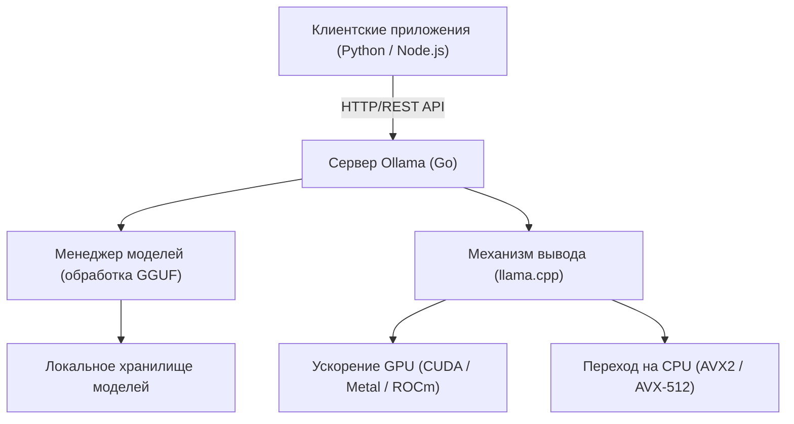
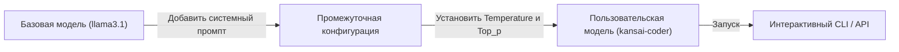

# Введение: Зачем нужна локальная LLM?

С появлением больших языковых моделей (LLM) наша жизнь и методы разработки претерпели радикальные изменения. Мощные облачные ИИ-сервисы, такие как ChatGPT, Claude и Gemini, продолжают развиваться с каждым днем, предоставляя чрезвычайно продвинутые возможности логического вывода. Однако облачные LLM не всегда являются оптимальным выбором для всех сценариев использования. У облачных LLM есть следующие проблемы:

1. **Проблемы конфиденциальности и безопасности**: Отправка данных, содержащих конфиденциальную или личную информацию, на внешние серверы часто недопустима с точки зрения корпоративного комплаенса и безопасности.
2. **Неопределенность затрат**: Поскольку плата за использование API зависит от количества токенов, для систем, обрабатывающих большие объемы данных или выполняющих частые запросы, существует риск неограниченного роста эксплуатационных расходов.
3. **Задержка и зависимость от сети**: Сетевая связь становится узким местом при использовании в автономных средах или на граничных устройствах (edge devices), где требуется крайне низкая задержка.
4. **Привязка к поставщику (Vendor lock-in)**: Зависимость от моделей конкретного провайдера может привести к тому, что вы пострадаете от прекращения предоставления услуг в будущем, изменений в условиях обслуживания или непредвиденных изменений в поведении из-за обновления моделей.

В качестве средства решения этих проблем большое внимание привлекают «Локальные LLM». Запуская модель на собственном оборудовании, вы можете свободно использовать ИИ, не отправляя никаких данных наружу и не беспокоясь о ежемесячных расходах.

В этой статье мы подробно рассмотрим **Ollama**, инструмент, который позволяет удивительно легко развертывать, управлять и интегрировать по API локальные LLM. Мы разберем всё: от основ и внутренней архитектуры до продвинутой интеграции API с использованием Python и Node.js, и даже математических формул для оптимизации производительности.

---

# Что такое Ollama? Ее внутренняя архитектура

Ollama — это платформа для простого запуска и управления большими языковыми моделями с открытым исходным кодом (Llama 3, Phi-3, Mistral, Gemma и т. д.) в локальной среде. До сих пор для настройки локальной среды LLM требовались очень сложные процедуры: настройка среды Python, установка набора инструментов CUDA, разрешение зависимостей PyTorch, загрузка огромных файлов моделей с Hugging Face и преобразование форматов (например, из Safetensors в GGUF).

Ollama скрывает эти сложности, позволяя обращаться с LLM так же легко, как с Docker. С помощью одной команды вы можете скачать модель (`pull`), запустить ее (`run`) и поднять в качестве HTTP-сервера.

## Основная технология: Обертка для llama.cpp

В качестве бэкенда механизма вывода Ollama выступает **llama.cpp**, быстрая библиотека вывода LLM, написанная на C/C++. llama.cpp обладает способностью выполнять модели, максимально используя аппаратные возможности, будь то Apple Silicon (Metal), NVIDIA GPU (CUDA), AMD GPU (ROCm) или даже среды только с CPU.

Ollama включает в себя llama.cpp и использует архитектуру, в которой серверный процесс, написанный на языке Go, предоставляет REST API, вызывая механизм вывода llama.cpp в фоновом режиме.

Следующая диаграмма Mermaid показывает общую архитектуру Ollama.



Благодаря этой архитектуре разработчики могут использовать продвинутые возможности вывода через стандартные HTTP-запросы, не беспокоясь о сборке C++ кода или детальных настройках драйверов GPU.

---

# Установка Ollama и начальная настройка

Установка Ollama предельно проста. Предоставляются оптимизированные бинарные файлы для каждой ОС.

## macOS / Windows

Просто скачайте установщик с официального сайта (https://ollama.com/) и запустите его. Версия для macOS автоматически распознает Metal API от Apple Silicon, а версия для Windows — NVIDIA GPU (CUDA), и, если доступно, включает аппаратное ускорение.

## Linux

В средах Linux (например, Ubuntu) достаточно выполнить следующую однострочную команду, чтобы установить необходимые компоненты и запустить сервер Ollama в качестве службы systemd.

```bash
curl -fsSL https://ollama.com/install.sh | sh
```

После завершения установки давайте проверим версию в терминале.

```bash
ollama --version
```
Если отображается информация о версии, значит, установка прошла успешно.

## Запуск с использованием Docker

Если вы не хотите загрязнять существующую среду или хотите интегрировать инструмент в контейнерную инфраструктуру, вы также можете использовать официальный образ Docker. Для использования GPU необходимо установить NVIDIA Container Toolkit.

```bash
# Для запуска только на CPU
docker run -d -v ollama:/root/.ollama -p 11434:11434 --name ollama ollama/ollama

# При использовании NVIDIA GPU
docker run -d --gpus=all -v ollama:/root/.ollama -p 11434:11434 --name ollama ollama/ollama
```

По умолчанию сервер Ollama прослушивает `http://localhost:11434`.

---

# Управление моделями и основные команды CLI

Самая большая привлекательность Ollama заключается в том, что управление моделями очень интуитивно понятно. Вы можете тестировать различные модели с тем же ощущением, что и при работе с образами Docker.

## 1. Запуск модели (`run`)

Это наиболее часто используемая команда. Если указанной модели не существует, она автоматически скачивается (`pull`), после чего запускается интерактивный промпт.

```bash
ollama run llama3.1
```

При выполнении приведенной выше команды будет запущена новейшая модель от Meta — Llama 3.1 (версия с 8B параметров). При вводе сообщения в промпт ответ от модели будет отображаться в виде потока (streaming). Для выхода введите `/bye` или нажмите `Ctrl+D`.

## 2. Скачивание модели (`pull`)

Если вы хотите скачать модель в фоновом режиме заранее, используйте команду `pull`.

```bash
ollama pull phi3:instruct
ollama pull mistral:v0.3
```

В библиотеке моделей Ollama вы можете указать версию или уровень квантования в формате `имя_модели:тег`. Если тег опущен, применяется `latest`, но вы также можете явно указать определенную квантованную модель (например, `llama3:8b-instruct-q4_0`).

### Что такое квантование (Quantization)?

Здесь стоит немного остановиться на понятии квантования. Обычная LLM хранит параметры весов в 16-битном формате с плавающей запятой (FP16). Для модели с 8 миллиардами (8B) параметров только одни веса потребляют около 16 ГБ VRAM. Квантование — это технология сжатия их до 4-битных (Q4) или 8-битных (Q8) целых чисел.

Благодаря квантованию можно кардинально сократить требуемый объем памяти и пропускную способность памяти, при этом минимизируя ухудшение точности модели. Модели, распространяемые в Ollama, по умолчанию представлены в формате GGUF с примененным оптимальным квантованием (чаще всего 4-битным).

## 3. Вывод списка моделей (`list`)

Отображает список локально скачанных моделей и их размер.

```bash
ollama list
```
Пример вывода:
```text
NAME            ID              SIZE      MODIFIED
llama3.1:latest 43f7a214e532    4.7 GB    2 hours ago
phi3:instruct   a2c89ceaed85    2.3 GB    3 days ago
```

## 4. Удаление модели (`rm`)

Удаляет больше не нужные модели для освобождения места на диске.

```bash
ollama rm phi3:instruct
```

---

# Настройка модели с помощью Modelfile

В Ollama вы можете использовать механизм под названием **Modelfile** для создания собственных пользовательских моделей путем внедрения системных промптов и настройки гиперпараметров в существующие модели. Эта концепция полностью аналогична Dockerfile в Docker.

Следующая диаграмма показывает, как пользовательская модель создается на основе базовой модели.



В качестве примера давайте создадим модель помощника по программированию, который будет отвечать на кансайском диалекте (Кансай-бен).

Создайте текстовый файл с именем `Modelfile` в вашем рабочем каталоге и напишите следующее:

```text
# Указываем базовую модель
FROM llama3.1

# Устанавливаем гиперпараметры, такие как креативность (temperature)
PARAMETER temperature 0.7
PARAMETER top_p 0.9
PARAMETER repeat_penalty 1.1
PARAMETER num_ctx 4096

# Устанавливаем системный промпт
SYSTEM """
Вы — старший инженер-программист мирового класса.
Пожалуйста, всегда отвечайте на технические вопросы пользователей в дружелюбной манере, используя "кансайский диалект".
При предоставлении примеров кода предоставляйте современный код, следующий лучшим практикам.
"""
```

Создаем (собираем) новую модель из этого Modelfile.

```bash
ollama create kansai-coder -f Modelfile
```

После завершения сборки запустите ее, чтобы протестировать.

```bash
ollama run kansai-coder
>>> Pythonでリストをソートするにはどうすればええの？
```
Тогда вы получите кастомизированный ответ вроде: "それはな、Pythonの `sorted()` 関数か `sort()` メソッドを使えばええんやで！" (Это, понимаешь, можно сделать, использовав функцию `sorted()` или метод `sort()` в Python!). Таким образом, можно создавать и управлять бесчисленным множеством агентов локально, специализированных для конкретных случаев использования.

---

# Подробное руководство по Ollama REST API

Хотя взаимодействие через CLI удобно, истинная мощь Ollama в реальной разработке приложений раскрывается через ее мощный REST API. Отправляя HTTP-запросы серверному процессу (по умолчанию `http://localhost:11434`), вы можете получать результаты вывода.

Три основных эндпоинта:
1. `/api/generate`: Генерация текста из одиночного промпта
2. `/api/chat`: Генерация чата (диалога) в формате, близком к OpenAI API
3. `/api/embeddings`: Генерация векторных представлений (Embeddings)

## Генерация текста с использованием /api/generate

Это самый базовый эндпоинт для генерации. Давайте отправим запрос с помощью cURL.

```bash
curl -X POST http://localhost:11434/api/generate -d '{
  "model": "llama3.1",
  "prompt": "Explain the concept of quantum entanglement in simple terms.",
  "stream": false
}'
```

Указав `"stream": false`, вы получите JSON сразу после завершения всей генерации. По умолчанию (`true`), сгенерированные токены отправляются последовательно в формате JSON Lines, что подходит для реализации пользовательского интерфейса со стримингом.

Пример ответа (частично опущен):
```json
{
  "model": "llama3.1",
  "created_at": "2026-09-11T10:00:00.000Z",
  "response": "Quantum entanglement is like having a pair of magical dice...",
  "done": true,
  "context": [128006, 882, 128007, 271, 10445],
  "total_duration": 4567890000,
  "load_duration": 1234000,
  "prompt_eval_count": 14,
  "eval_count": 256,
  "eval_duration": 4321000000
}
```
В массиве `context` закодировано состояние предыдущего разговора, и, включив его в следующий запрос, можно сохранить контекст. Однако для более простого управления историей разговоров используется следующий эндпоинт `/api/chat`.

## Генерация диалога с использованием /api/chat

Поскольку современные LLM дообучены (fine-tuned) для формата чата, при разработке приложений рекомендуется использовать `/api/chat`.

```bash
curl -X POST http://localhost:11434/api/chat -d '{
  "model": "llama3.1",
  "messages": [
    { "role": "system", "content": "You are a helpful AI assistant." },
    { "role": "user", "content": "What is the capital of France?" },
    { "role": "assistant", "content": "The capital of France is Paris." },
    { "role": "user", "content": "What is its famous tower?" }
  ],
  "stream": false
}'
```
Таким образом, передавая массив объектов сообщений с ролями (`role` — system, user, assistant), вы можете легко обрабатывать сложный контекст диалога.

---

# Интеграция с приложениями Python

Python является самым стандартным языком в разработке ИИ. Существует несколько способов использования Ollama из Python, но использование официального пакета `ollama-python` является самым простым и надежным.

## Установка

```bash
pip install ollama
```

## Использование синхронного API (Synchronous)

Базовый код для генерации чата.

```python
import ollama

# Список для хранения истории чата
messages = [
    {'role': 'system', 'content': 'Вы — отличный помощник.'}
]

def chat_with_ollama(user_input):
    messages.append({'role': 'user', 'content': user_input})
    
    # Вызов Ollama API
    response = ollama.chat(
        model='llama3.1',
        messages=messages
    )
    
    assistant_reply = response['message']['content']
    messages.append({'role': 'assistant', 'content': assistant_reply})
    
    return assistant_reply

print(chat_with_ollama("Пожалуйста, объясните три основных подхода в машинном обучении."))
```

## Использование асинхронного стриминга (Async Streaming)

При разработке веб-приложений (FastAPI или Starlette) или ботов для Discord / Slack важно использовать асинхронный API и стриминг, чтобы избежать блокировки (blocking).

```python
import asyncio
from ollama import AsyncClient

async def generate_stream():
    client = AsyncClient()
    
    # При указании stream=True возвращается асинхронный генератор
    async for chunk in await client.chat(
        model='llama3.1',
        messages=[{'role': 'user', 'content': 'Объясните подробно декораторы в Python.'}],
        stream=True
    ):
        # Последовательный вывод каждого фрагмента в стандартный вывод
        print(chunk['message']['content'], end='', flush=True)
        
    print() # Перевод строки в конце

# Выполнение асинхронной функции
asyncio.run(generate_stream())
```
Написав это таким образом, вы можете легко реализовать UX, в котором символы появляются один за другим, подобно интерфейсу ChatGPT.

## Интеграция с LangChain и LlamaIndex

Ollama имеет встроенную поддержку в LangChain и LlamaIndex, которые часто используются при создании систем RAG (Retrieval-Augmented Generation).

Пример с LangChain:
```python
from langchain_community.llms import Ollama

llm = Ollama(model="llama3.1")
response = llm.invoke("Explain dark matter.")
print(response)
```
Вы можете запускать мощные функции цепочек и агентов LangChain локально, не устанавливая никаких внешних API-ключей.

---

# Интеграция с приложениями Node.js

Для фронтенд-инженеров и fullstack-разработчиков возможность вызова локальных LLM из среды TypeScript/Node.js является огромным преимуществом. Мы будем использовать официальный NPM-пакет `ollama`.

## Установка

```bash
npm install ollama
```

## Пример реализации чат-бота с использованием TypeScript

```typescript
import ollama, { Message } from 'ollama';

async function runChatbot() {
  const messages: Message[] = [
    { role: 'system', content: 'You are a concise expert.' },
    { role: 'user', content: 'Explain RESTful APIs.' }
  ];

  try {
    const response = await ollama.chat({
      model: 'llama3.1',
      messages: messages,
      stream: false,
    });
    
    console.log("Assistant:", response.message.content);
  } catch (error) {
    console.error("Error communicating with Ollama:", error);
  }
}

runChatbot();
```

## Создание сервера Express с поддержкой стриминга

Это пример реализации бэкенд API, который возвращает ответы веб-фронтенду потоком (streaming). Фрагменты отправляются с использованием SSE (Server-Sent Events) или обычного HTTP-стриминга.

```javascript
import express from 'express';
import { Ollama } from 'ollama';

const app = express();
app.use(express.json());
const ollama = new Ollama({ host: 'http://127.0.0.1:11434' });

app.post('/api/stream-chat', async (req, res) => {
  const { prompt } = req.body;

  // Настройка HTTP-заголовков ответа (передача по частям - chunked)
  res.setHeader('Content-Type', 'text/plain; charset=utf-8');
  res.setHeader('Transfer-Encoding', 'chunked');

  try {
    const stream = await ollama.generate({
      model: 'llama3.1',
      prompt: prompt,
      stream: true,
    });

    for await (const chunk of stream) {
      res.write(chunk.response);
    }
    res.end();
  } catch (err) {
    res.status(500).write("Error generating response.");
    res.end();
  }
});

app.listen(3000, () => {
  console.log('Server is running on port 3000');
});
```

---

# Метрики производительности и математический анализ

Чтобы предоставить локальные LLM на уровне, пригодном для реального использования, необходим анализ задержки (latency) и пропускной способности (throughput). Ответы API Ollama содержат подробные метрики, касающиеся производительности.

## Математическая модель скорости генерации токенов

Время отклика LLM, напрямую связанное с пользовательским опытом, можно разделить на две основные составляющие: «**Время до первого токена (Time To First Token, TTFT)**» и «**Время на выходной токен (Time Per Output Token, TPOT)**».

Общее время генерации $T_{total}$, если предположить, что количество сгенерированных токенов равно $N$, может быть сформулировано следующим образом:

$$
T_{total} = t_{ttft} + \sum_{i=1}^{N-1} t_{tpot}^{(i)}
$$

Здесь, если аппроксимировать среднее время, затрачиваемое на генерацию каждого токена, как $\bar{t}_{tpot}$, формула упрощается:

$$
T_{total} \approx t_{ttft} + (N - 1) \times \bar{t}_{tpot}
$$

Соответствие с полями ответа API Ollama выглядит следующим образом:
- `prompt_eval_duration`: Это примерно соответствует $t_{ttft}$ (время оценки промпта). Возвращается в наносекундах.
- `eval_duration`: Время, затраченное на весь процесс генерации.
- `eval_count`: Количество сгенерированных токенов $N$.

Следовательно, скорость генерации токенов в секунду (Tokens Per Second: TPS) можно рассчитать по следующей формуле:

$$
TPS = \frac{eval\_count}{(eval\_duration / 10^9)} \quad [\text{tokens/sec}]
$$

Например, в случае `eval_count: 256`, `eval_duration: 4321000000` (около 4.32 секунды):
$$
TPS = \frac{256}{4.321} \approx 59.24 \text{ tokens/sec}
$$
Если скорость в локальной среде превышает 50 токенов в секунду, это намного быстрее скорости чтения человека, поэтому можно сказать, что обеспечивается очень комфортный опыт отклика.

## Формула оценки требуемого объема VRAM

При запуске модели локально ключевым фактором производительности является то, помещается ли модель в VRAM видеокарты. Если она не помещается в VRAM и система переходит на основную память (RAM), скорость генерации значительно падает.

Упрощенная формула для оценки требуемого объема памяти $M$ (в гигабайтах) выглядит следующим образом:

$$
M \approx \frac{P \times Q}{8 \times 1024} + C
$$

- $P$: Количество параметров модели (например: 8B = $8000 \times 10^6$)
- $Q$: Битность квантования (например: 4-bit, 8-bit, 16-bit)
- $C$: Дополнительная память для контекстного окна (KV-кэш и т. д. Зависит от модели и настроек, но обычно составляет около 1–2 ГБ)

**Пример расчета**: Запуск Llama 3 (8B параметров) с 4-битным квантованием
$$
M_{model} = \frac{8,000 \times 4}{8 \times 1024} = \frac{32,000}{8192} \approx 3.9 \text{ GB}
$$
Добавив к этому память для контекста, мы видим, что при наличии примерно 5-6 ГБ VRAM можно полностью развернуть модель на GPU (Full Offload). Даже с графическими процессорами среднего класса с 8 ГБ VRAM (например, RTX 4060) последних лет вполне возможно запускать достаточно мощные LLM.

---

# Продвинутые сценарии использования и заключение

Открыв Ollama в качестве API в локальной сети, становятся возможными различные применения помимо обычных чат-ботов.

### 1. Создание локального RAG (Retrieval-Augmented Generation)
Комбинируя локальную векторную базу данных, такую как ChromaDB или Qdrant, с эндпоинтом `/api/embeddings` от Ollama (с использованием моделей встраивания, таких как `nomic-embed-text`), можно создать полностью автономную, безопасную систему RAG для ответов на вопросы с загрузкой конфиденциальных внутренних документов.

### 2. ИИ-помощник для IDE и редакторов
Указав Ollama в качестве бэкенда для расширений VS Code (например, Continue.dev) или плагинов Neovim, вы можете бесплатно получать автодополнение и объяснение кода в стиле GitHub Copilot, используя локальные модели (например, `codellama` или `deepseek-coder`).

### 3. Интеграция в скрипты автоматизации
Встраивая API-запросы к Ollama в Python или shell-скрипты, вы можете привнести мощь ИИ в различные аспекты ежедневного рабочего процесса, такие как автоматическое резюмирование логов, автоматическая генерация сообщений коммитов Git, а также задачи классификации стандартных текстов.

## Заключение

С появлением Ollama порог для внедрения локальных LLM резко снизился. Сочетание простой системы команд, напоминающей работу с контейнерами Docker, и REST API, который легко использовать из внешних приложений, можно смело назвать текущим стандартом де-факто для локальной разработки ИИ.

Разработчикам, которые сталкиваются с ограничениями по стоимости или безопасности облачных LLM, настоятельно рекомендуется использовать шаги, описанные в этой статье, для создания локальной среды LLM с помощью Ollama и интеграции ее в свои приложения. Вы должны почувствовать потенциал ИИ гораздо свободнее и ближе.

