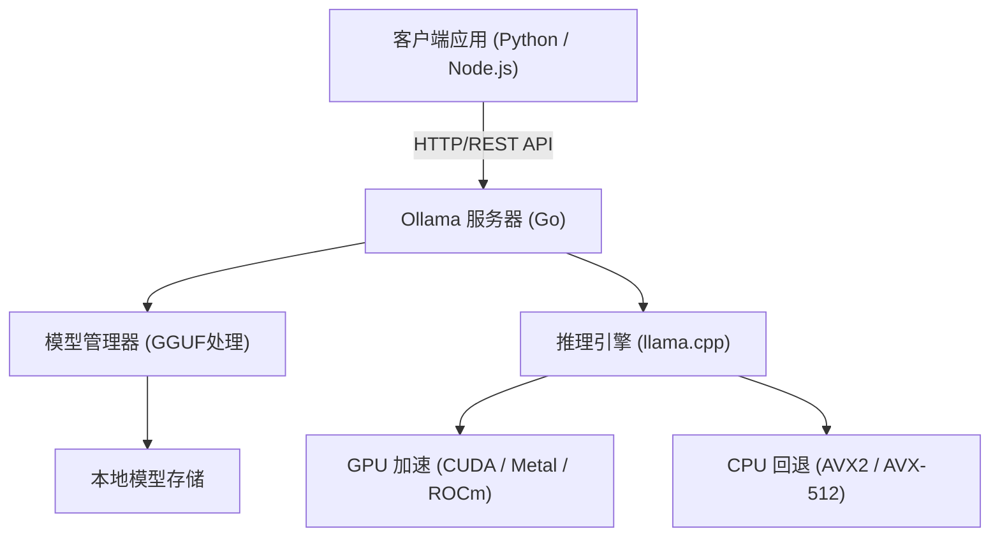
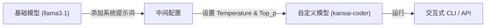

# 前言：为什么需要本地LLM？

随着大型语言模型（LLM）的崛起，我们的生活和开发方式发生了巨大的变化。ChatGPT、Claude和Gemini等基于云的强大AI服务在不断发展，提供了非常高级的推理能力。然而，云端LLM并非在所有用例中都是最佳选择。云端LLM存在以下问题：

1. **隐私和安全问题**：从企业合规性和安全性的角度来看，将包含机密或个人信息的数据发送到外部服务器通常是不可接受的。
2. **成本的不确定性**：API使用费取决于Token数量，在处理大规模数据或频繁请求的系统中，运行成本存在无底洞的风险。
3. **延迟和网络依赖**：在离线环境中使用，或者在要求极低延迟的边缘设备上运行时，网络通信会成为瓶颈。
4. **供应商锁定**：依赖特定提供商的模型，可能会受到未来服务终止、条款变更或模型更新导致意外行为变化的影响。

作为解决这些问题的一种手段，“本地LLM”正备受瞩目。通过在自己的硬件上运行模型，您可以完全不向外部发送数据，也不必担心每月的费用，自由地利用AI。

本文将深入探讨“**Ollama**”——一个能够极其简单地引入、管理和API集成落地本地LLM的工具。我们将从基础知识、内部架构、使用Python和Node.js进行高级API集成，一直讲解到性能调优的计算公式。

---

# 什么是Ollama？其内部架构

Ollama是一个可以让你在本地环境中轻松运行和管理开源大型语言模型（如Llama 3, Phi-3, Mistral, Gemma等）的平台。以前，为了搭建本地LLM环境，需要极其繁琐的步骤，比如配置Python环境、安装CUDA工具包、解决PyTorch的依赖关系，以及从Hugging Face下载巨大的模型文件并进行格式转换（例如从Safetensors转换为GGUF）等。

Ollama隐藏了这些复杂性，让你可以像使用Docker一样方便地处理LLM。只需一条命令，即可下载（`pull`）、运行（`run`）模型，并将其作为HTTP服务器启动。

## 核心技术：llama.cpp的包装器

作为Ollama推理引擎后端运行的，是使用C/C++实现的高速LLM推理库“**llama.cpp**”。即使是在Apple Silicon（Metal）、NVIDIA GPU（CUDA）、AMD GPU（ROCm），甚至仅有CPU的环境中，llama.cpp也具备最大限度发挥硬件性能来运行模型的能力。

Ollama内置了llama.cpp，采用了由Go语言编写的服务器进程提供REST API，并在后台调用llama.cpp推理引擎的架构。

以下Mermaid图展示了Ollama的整体架构。



得益于这种架构，开发者无需关注C++的编译或GPU驱动程序的细微配置，通过标准的HTTP请求即可利用高级的推理能力。

---

# Ollama的安装与初始设置

Ollama的安装非常简单。它为各种操作系统提供了经过优化的二进制文件。

## macOS / Windows

只需从官网（https://ollama.com/）下载安装程序并运行即可。macOS版本会自动识别Apple Silicon的Metal API，Windows版本会自动识别NVIDIA GPU（CUDA），并在可用时启用硬件加速。

## Linux

在Linux环境（如Ubuntu）中，只需运行以下单行命令，即可安装所需的组件，并将Ollama服务器作为systemd服务启动。

```bash
curl -fsSL https://ollama.com/install.sh | sh
```

安装完成后，在终端检查版本。

```bash
ollama --version
```
如果显示版本信息，则表示安装成功。

## 使用Docker运行

如果不想污染现有环境，或者想将其集成到基于容器的基础设施中，也可以使用官方的Docker镜像。如果要使用GPU，则需要安装NVIDIA Container Toolkit。

```bash
# 仅使用CPU运行
docker run -d -v ollama:/root/.ollama -p 11434:11434 --name ollama ollama/ollama

# 使用NVIDIA GPU运行
docker run -d --gpus=all -v ollama:/root/.ollama -p 11434:11434 --name ollama ollama/ollama
```

默认情况下，Ollama服务器将在 `http://localhost:11434` 监听。

---

# 模型管理与基本CLI命令

Ollama最大的魅力在于模型管理非常直观。你可以像操作Docker镜像一样，尝试各种模型。

## 1. 运行模型 (`run`)

这是最常用的命令。如果指定的模型不存在，它会自动下载（`pull`），然后启动交互式提示符。

```bash
ollama run llama3.1
```

执行上述命令后，Meta的最新模型Llama 3.1（8B参数版）将启动。在提示符中输入消息，模型的回复将以流式显示。要退出，请输入 `/bye` 或按 `Ctrl+D`。

## 2. 下载模型 (`pull`)

如果你想在后台预先下载模型，请使用 `pull` 命令。

```bash
ollama pull phi3:instruct
ollama pull mistral:v0.3
```

在Ollama的模型库中，你可以使用 `模型名:标签` 的格式来指定版本或量化级别。如果省略标签，则默认应用 `latest`，但你也可以明确指定特定的量化模型（例如：`llama3:8b-instruct-q4_0`）。

### 什么是量化（Quantization）？

这里稍微提及一下量化。普通的LLM使用16位浮点数（FP16）等格式保存一个权重参数。对于具有80亿（8B）参数的模型，仅权重就会消耗约16GB的VRAM。量化就是一种将其压缩为4位（Q4）或8位（Q8）整数类型的技术。

通过量化，可以在将模型精度下降控制在最低限度的同时，大幅减少所需的内存量和内存带宽。在Ollama中分发的模型，默认采用了经过最优化量化（通常为4位）的GGUF格式。

## 3. 列出模型 (`list`)

显示本地已下载的模型列表及其大小。

```bash
ollama list
```
输出示例：
```text
NAME            ID              SIZE      MODIFIED
llama3.1:latest 43f7a214e532    4.7 GB    2 hours ago
phi3:instruct   a2c89ceaed85    2.3 GB    3 days ago
```

## 4. 删除模型 (`rm`)

删除不再需要的模型以释放磁盘空间。

```bash
ollama rm phi3:instruct
```

---

# 使用Modelfile自定义模型

在Ollama中，可以通过使用名为“**Modelfile**”的机制，为现有模型注入系统提示词或调整超参数，从而创建自己的自定义模型。这与Docker中Dockerfile的概念完全相同。

下图展示了自定义模型是如何从基础模型派生而来的。



作为示例，让我们创建一个使用关西腔回答问题的编程助手模型。

在工作目录中创建一个名为 `Modelfile` 的文本文件，并写入以下内容。

```text
# 指定基础模型
FROM llama3.1

# 设置创造性（temperature）等超参数
PARAMETER temperature 0.7
PARAMETER top_p 0.9
PARAMETER repeat_penalty 1.1
PARAMETER num_ctx 4096

# 设置系统提示词
SYSTEM """
你是世界顶级的资深软件工程师。
面对用户的技术问题，请务必使用“关西腔”亲切地回答。
在提供代码示例时，请提供遵循最佳实践的现代代码。
"""
```

使用此Modelfile构建（创建）新模型。

```bash
ollama create kansai-coder -f Modelfile
```

构建完成后，运行并进行测试。

```bash
ollama run kansai-coder
>>> 用Python怎么对列表进行排序？
```
然后它会表现出自定义的行为，例如回答：“那个嘛，在Python里用 `sorted()` 函数或者 `sort()` 方法就行啦！”。通过这种方式，可以在本地创建和管理无数个针对特定用例的代理（Agent）。

---

# Ollama REST API 彻底解析

虽然CLI交互很方便，但在实际的应用程序开发中，Ollama真正的价值在于其强大的REST API。通过向服务器进程（默认是 `http://localhost:11434`）发送HTTP请求，可以获取推理结果。

主要有以下3个端点：
1. `/api/generate`：从单一提示词生成文本
2. `/api/chat`：以类似于OpenAI API的格式进行聊天（对话）生成
3. `/api/embeddings`：生成向量嵌入（Embeddings）

## 使用 /api/generate 生成文本

这是最基础的生成端点。让我们使用cURL发送一个请求。

```bash
curl -X POST http://localhost:11434/api/generate -d '{
  "model": "llama3.1",
  "prompt": "Explain the concept of quantum entanglement in simple terms.",
  "stream": false
}'
```

通过指定 `"stream": false`，可以在所有生成完成后一次性返回JSON数据。默认情况（`true`）下，生成的Token会以JSON Lines格式依次发送过来，非常适合用于实现流式UI。

响应示例（部分省略）：
```json
{
  "model": "llama3.1",
  "created_at": "2026-09-11T10:00:00.000Z",
  "response": "Quantum entanglement is like having a pair of magical dice...",
  "done": true,
  "context": [128006, 882, 128007, 271, 10445],
  "total_duration": 4567890000,
  "load_duration": 1234000,
  "prompt_eval_count": 14,
  "eval_count": 256,
  "eval_duration": 4321000000
}
```
`context` 数组中编码了过去的对话状态，通过将其包含在下一个请求中可以维持上下文。不过，为了更方便地管理对话历史记录，推荐使用下面的 `/api/chat`。

## 使用 /api/chat 进行对话生成

近期的LLM大多是以聊天格式进行微调的，因此在应用程序开发中推荐使用 `/api/chat`。

```bash
curl -X POST http://localhost:11434/api/chat -d '{
  "model": "llama3.1",
  "messages": [
    { "role": "system", "content": "You are a helpful AI assistant." },
    { "role": "user", "content": "What is the capital of France?" },
    { "role": "assistant", "content": "The capital of France is Paris." },
    { "role": "user", "content": "What is its famous tower?" }
  ],
  "stream": false
}'
```
像这样，通过传递一个带有 `role`（system, user, assistant）的消息对象数组，可以轻松处理复杂的对话上下文。

---

# 与 Python 应用程序集成

Python 是 AI 开发中最标准的语言。虽然有几种方法可以从 Python 使用 Ollama，但使用官方提供的 `ollama-python` 包是最简单和最可靠的。

## 安装

```bash
pip install ollama
```

## 使用同步（Synchronous）API

这是生成聊天的基本代码。

```python
import ollama

# 保存聊天历史记录的列表
messages = [
    {'role': 'system', 'content': '你是一个优秀的助手。'}
]

def chat_with_ollama(user_input):
    messages.append({'role': 'user', 'content': user_input})
    
    # 调用 Ollama API
    response = ollama.chat(
        model='llama3.1',
        messages=messages
    )
    
    assistant_reply = response['message']['content']
    messages.append({'role': 'assistant', 'content': assistant_reply})
    
    return assistant_reply

print(chat_with_ollama("请告诉我机器学习的3种主要方法。"))
```

## 使用异步流式传输（Async Streaming）

在开发 Web 应用程序（如 FastAPI 或 Starlette）或 Discord/Slack 机器人时，使用异步 API 和流式传输以避免阻塞是非常重要的。

```python
import asyncio
from ollama import AsyncClient

async def generate_stream():
    client = AsyncClient()
    
    # 指定 stream=True 会返回一个异步生成器
    async for chunk in await client.chat(
        model='llama3.1',
        messages=[{'role': 'user', 'content': '请详细讲解一下Python的装饰器。'}],
        stream=True
    ):
        # 将每个分块逐次输出到标准输出
        print(chunk['message']['content'], end='', flush=True)
        
    print() # 最后换行

# 运行异步函数
asyncio.run(generate_stream())
```
通过这种方式编写代码，可以轻松实现像 ChatGPT UI 那样文字逐个弹出的用户体验。

## 与 LangChain 和 LlamaIndex 的集成

在构建 RAG（Retrieval-Augmented Generation）系统时常用的 LangChain 或 LlamaIndex 也原生支持 Ollama。

LangChain 示例：
```python
from langchain_community.llms import Ollama

llm = Ollama(model="llama3.1")
response = llm.invoke("Explain dark matter.")
print(response)
```
完全不需要设置任何外部 API 密钥，就可以在本地运行 LangChain 强大的链（Chains）和代理（Agents）功能。

---

# 与 Node.js 应用程序集成

对于前端工程师或全栈开发者来说，能够从 TypeScript/Node.js 环境调用本地 LLM 是一个巨大的优势。我们将使用官方的 `ollama` NPM 包。

## 安装

```bash
npm install ollama
```

## 使用 TypeScript 实现聊天机器人的示例

```typescript
import ollama, { Message } from 'ollama';

async function runChatbot() {
  const messages: Message[] = [
    { role: 'system', content: 'You are a concise expert.' },
    { role: 'user', content: 'Explain RESTful APIs.' }
  ];

  try {
    const response = await ollama.chat({
      model: 'llama3.1',
      messages: messages,
      stream: false,
    });
    
    console.log("Assistant:", response.message.content);
  } catch (error) {
    console.error("Error communicating with Ollama:", error);
  }
}

runChatbot();
```

## 构建支持流式传输的 Express 服务器

这是一个后端 API 的实现示例，它通过流式传输向 Web 前端返回响应。它使用 SSE（Server-Sent Events）或常规 HTTP 流式传输来发送分块数据。

```javascript
import express from 'express';
import { Ollama } from 'ollama';

const app = express();
app.use(express.json());
const ollama = new Ollama({ host: 'http://127.0.0.1:11434' });

app.post('/api/stream-chat', async (req, res) => {
  const { prompt } = req.body;

  // 设置 HTTP 响应头（分块传输）
  res.setHeader('Content-Type', 'text/plain; charset=utf-8');
  res.setHeader('Transfer-Encoding', 'chunked');

  try {
    const stream = await ollama.generate({
      model: 'llama3.1',
      prompt: prompt,
      stream: true,
    });

    for await (const chunk of stream) {
      res.write(chunk.response);
    }
    res.end();
  } catch (err) {
    res.status(500).write("Error generating response.");
    res.end();
  }
});

app.listen(3000, () => {
  console.log('Server is running on port 3000');
});
```

---

# 性能指标与数学分析

为了在能够承受实际生产环境的级别上提供本地 LLM，延迟和吞吐量的分析不可或缺。Ollama 的 API 响应中包含了有关性能的详细指标。

## Token 生成速度的计算模型

直接关系到用户体验的 LLM 响应时间，大致可以分解为“**首个 Token 耗时 (Time To First Token, TTFT)**”和“**每个输出 Token 耗时 (Time Per Output Token, TPOT)**”。

如果将生成的 Token 数设为 $N$，则总生成时间 $T_{total}$ 可以公式化如下：

$$
T_{total} = t_{ttft} + \sum_{i=1}^{N-1} t_{tpot}^{(i)}
$$

在这里，如果将每个 Token 生成所需的平均时间近似为 $\bar{t}_{tpot}$，则公式可以简化：

$$
T_{total} \approx t_{ttft} + (N - 1) \times \bar{t}_{tpot}
$$

与 Ollama 的 API 响应字段的对应关系如下：
- `prompt_eval_duration`：这大致相当于 $t_{ttft}$（提示词评估时间）。以纳秒为单位返回。
- `eval_duration`：整个生成过程花费的时间。
- `eval_count`：生成的 Token 数 $N$。

因此，每秒的 Token 生成速度（Tokens Per Second: TPS）可以通过以下公式计算。

$$
TPS = \frac{eval\_count}{(eval\_duration / 10^9)} \quad [\text{tokens/sec}]
$$

例如，当 `eval_count: 256` 且 `eval_duration: 4321000000`（约 4.32 秒）时，
$$
TPS = \frac{256}{4.321} \approx 59.24 \text{ tokens/sec}
$$

如果在本地环境中能够超过 50 个 Token/秒，这远远超出了人类的阅读速度，可以说提供了非常舒适的响应体验。

## 所需 VRAM 容量的估算公式

在本地运行模型时，模型是否能容纳在 GPU 的 VRAM 中是性能的关键。如果 VRAM 不足而回退（Fallback）到系统的内存（RAM）中，生成速度会显著下降。

用于估算所需内存容量 $M$（吉字节，GB）的简单公式如下：

$$
M \approx \frac{P \times Q}{8 \times 1024} + C
$$

- $P$：模型参数数量（例如：8B = $8000 \times 10^6$）
- $Q$：量化位数（例如：4-bit, 8-bit, 16-bit）
- $C$：上下文窗口的额外内存（如 KV 缓存等。取决于模型和设置，但一般预估约 1~2GB）

**计算示例**：在 4-bit 量化下运行 Llama 3 (8B 参数) 时
$$
M_{model} = \frac{8,000 \times 4}{8 \times 1024} = \frac{32,000}{8192} \approx 3.9 \text{ GB}
$$
加上上下文所需内存，可以看出只要有约 5GB~6GB 的 VRAM，就可以完全在 GPU 上加载模型（Full Offload）。即使是近几年搭载了 8GB VRAM 的中端 GPU（如 RTX 4060 等），也足以运行非常强大的 LLM。

---

# 进阶用例与总结

通过在本地网络中将 Ollama 作为 API 开放，可以实现超越单纯聊天机器人的多种应用。

### 1. 构建本地 RAG（Retrieval-Augmented Generation）

通过结合 ChromaDB 或 Qdrant 等本地向量数据库，以及 Ollama 的 `/api/embeddings` 端点（利用 `nomic-embed-text` 等嵌入模型），您可以读取公司内部机密文档进行问答，从而完全在离线状态下构建安全的 RAG 系统。

### 2. IDE 或编辑器的 AI 助手

通过将 Ollama 指定为 VS Code 扩展（如 Continue.dev）或 Neovim 插件的后端，您可以使用本地模型（例如：`codellama` 或 `deepseek-coder`）免费实现类似 GitHub Copilot 的代码补全和代码解析功能。

### 3. 集成到自动化脚本中

通过将 Ollama 的 API 请求集成到 Python 或 Shell 脚本中，您可以将 AI 的力量注入到日常业务流程的方方面面，例如日志的自动摘要、Git 提交信息的自动生成、样板文件的分类任务等。

## 结论

Ollama 的出现，极大地降低了引入本地 LLM 的门槛。类似操作 Docker 容器的简单命令体系，加上能从外部应用程序轻松调用的 REST API，这种组合可以说是当今本地 AI 开发事实上的标准。

如果您是一位正苦恼于云端 LLM 的成本或安全限制的开发者，请务必参考本文介绍的步骤，使用 Ollama 搭建本地 LLM 环境，并将其集成到您的应用程序中。您一定会感受到 AI 带来的无限可能，而且这种体验会变得更加自由和触手可及。

