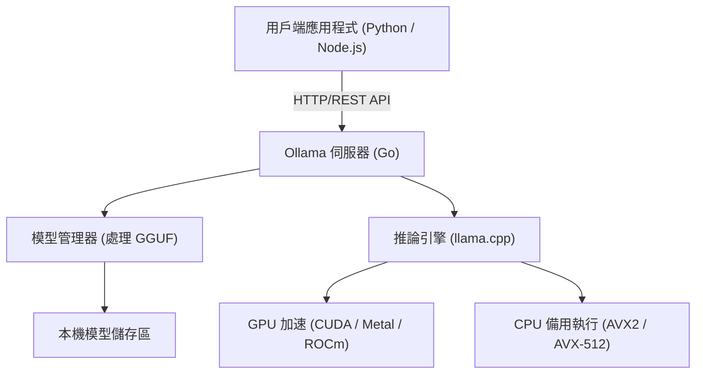
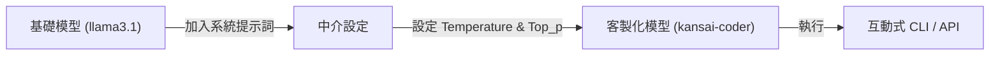

# 前言：為什麼需要本機 LLM？

隨著大型語言模型（LLM）的崛起，我們的生活與開發手法經歷了戲劇性的變化。像 ChatGPT、Claude 和 Gemini 這類基於雲端的強大 AI 服務，每天都在不斷進化，並提供非常高度的推論能力。然而，在所有的使用情境中，雲端型 LLM 並不一定是最合適的選擇。雲端 LLM 存在以下幾個挑戰：

1. **隱私與安全問題**：將包含機密資訊或個人資料的數據傳送到外部伺服器，從企業合規性和安全性的角度來看，很多時候是不被允許的。
2. **成本的不確定性**：由於 API 的使用費用取決於 token 數量，在進行大規模資料處理或頻繁發送請求的系統中，運作成本有無限飆升的風險。
3. **延遲與網路依賴**：在離線環境下使用，或是在需要極低延遲的邊緣設備上執行時，網路通訊將會成為瓶頸。
4. **供應商鎖定**：過度依賴特定供應商的模型，未來可能會受到服務終止、條款變更或模型更新導致的非預期行為改變等影響。

為了解決這些挑戰，「本機 LLM（Local LLM）」作為一種解決方案正備受矚目。透過在自己的硬體上執行模型，資料完全不會傳送到外部，也不用擔心每月的費用，能夠自由自在地活用 AI。

本文將針對能夠令人驚訝地輕鬆導入、管理並進行 API 串接本機 LLM 的工具「**Ollama**」，從其基礎、內部架構、使用 Python 或 Node.js 進行進階 API 串接，甚至是效能調校的計算公式，進行徹底的解說。

---

# 什麼是 Ollama？其內部架構

Ollama 是一個可以讓你在本機環境中，輕鬆執行與管理開源大型語言模型（如 Llama 3、Phi-3、Mistral、Gemma 等）的平台。過去要建置本機 LLM 環境，需要經過非常繁雜的步驟，例如設定 Python 環境、安裝 CUDA Toolkit、解決 PyTorch 的相依性、從 Hugging Face 下載龐大的模型檔案，以及進行格式轉換（例如將 Safetensors 轉換為 GGUF）等。

Ollama 隱藏了這些複雜性，讓你能以類似 Docker 的使用體驗來操作 LLM。只要透過一個指令就能下載（`pull`）模型、執行（`run`），並將其啟動為 HTTP 伺服器。

## 核心技術：llama.cpp 的包裝器

作為 Ollama 推論引擎後端運作的，是以 C/C++ 實作的高速 LLM 推論函式庫「**llama.cpp**」。llama.cpp 具備在 Apple Silicon (Metal)、NVIDIA GPU (CUDA)、AMD GPU (ROCm)，甚至是純 CPU 環境中，也能發揮硬體最大效能來執行模型的能力。

Ollama 內含了 llama.cpp，並採用了一種架構：由 Go 語言編寫的伺服器行程提供 REST API，並在背景呼叫 llama.cpp 的推論引擎。

以下的 Mermaid 圖表展示了 Ollama 的整體架構。



透過這樣的架構，開發者不需要去意識 C++ 的編譯或 GPU 驅動程式的細部設定，就能透過標準的 HTTP 請求來使用高度的推論能力。

---

# Ollama 的安裝與初始設定

Ollama 的安裝非常簡單。它為各個作業系統提供了最佳化的二進位檔案。

## macOS / Windows

只需從官方網站（https://ollama.com/）下載安裝程式並執行即可。macOS 版本會自動辨識 Apple Silicon 的 Metal API，Windows 版本則會自動辨識 NVIDIA GPU (CUDA)，並在可用的情況下自動啟用硬體加速。

## Linux

在 Linux 環境（如 Ubuntu）中，只需執行以下的一行指令，就會安裝所需的元件，並將 Ollama 伺服器作為 systemd 服務啟動。

```bash
curl -fsSL https://ollama.com/install.sh | sh
```

安裝完成後，在終端機中確認版本吧。

```bash
ollama --version
```
如果顯示出版本資訊，就代表安裝成功了。

## 使用 Docker 執行

如果你不想弄髒現有的環境，或者想將其整合到基於容器的基礎架構中，也可以使用官方的 Docker 映像檔。如果需要使用 GPU，則必須安裝 NVIDIA Container Toolkit。

```bash
# 僅使用 CPU 執行的情況
docker run -d -v ollama:/root/.ollama -p 11434:11434 --name ollama ollama/ollama

# 使用 NVIDIA GPU 的情況
docker run -d --gpus=all -v ollama:/root/.ollama -p 11434:11434 --name ollama ollama/ollama
```

預設情況下，Ollama 伺服器會在 `http://localhost:11434` 上進行監聽。

---

# 模型的管理與基本 CLI 指令

Ollama 最大的魅力在於其模型管理非常直觀。你可以用操作 Docker 映像檔的感覺，來嘗試各種不同的模型。

## 1. 執行模型 (`run`)

這是最頻繁使用的指令。如果指定的模型不存在，它會自動進行下載（`pull`），然後啟動互動式的提示字元。

```bash
ollama run llama3.1
```

執行上述指令後，Meta 的最新模型 Llama 3.1（8B 參數版）就會啟動。在提示字元中輸入訊息後，模型的回覆會以串流（streaming）的方式顯示。若要結束，請輸入 `/bye` 或按下 `Ctrl+D`。

## 2. 下載模型 (`pull`)

如果想在背景先下載模型，可以使用 `pull` 指令。

```bash
ollama pull phi3:instruct
ollama pull mistral:v0.3
```

在 Ollama 的模型庫中，你可以使用 `模型名稱:標籤` 的格式來指定版本或量化（quantization）等級。如果省略標籤，則會套用 `latest`，但你也可以明確指定特定的量化模型（例如：`llama3:8b-instruct-q4_0`）。

### 什麼是量化（Quantization）？

這裡稍微提一下量化。一般的 LLM 會使用 16 位元浮點數（FP16）等來儲存一個權重參數。以 80 億（8B）參數的模型為例，光是權重就會消耗大約 16GB 的 VRAM。將其壓縮成 4 位元（Q4）或 8 位元（Q8）整數型別的技術就稱為量化。

透過量化，可以在將模型精度衰退降至最低的同時，大幅減少所需的記憶體容量和記憶體頻寬。Ollama 所發佈的模型，預設都已經轉換為套用了最佳量化（通常是 4 位元）的 GGUF 格式。

## 3. 列出模型清單 (`list`)

顯示本機已下載的模型清單及其大小。

```bash
ollama list
```
輸出範例：
```text
NAME            ID              SIZE      MODIFIED
llama3.1:latest 43f7a214e532    4.7 GB    2 hours ago
phi3:instruct   a2c89ceaed85    2.3 GB    3 days ago
```

## 4. 刪除模型 (`rm`)

刪除不再需要的模型以釋放磁碟空間。

```bash
ollama rm phi3:instruct
```

---

# 透過 Modelfile 客製化模型

在 Ollama 中，你可以使用稱為「**Modelfile**」的機制，對現有的模型注入系統提示詞（System Prompt）或調整超參數，進而建立自己專屬的客製化模型。這個概念與 Docker 的 Dockerfile 完全相同。

下圖展示了客製化模型是如何從基礎模型衍生出來的。



作為範例，我們來建立一個會用關西腔（親切語氣）回答問題的程式設計助理模型。

在工作目錄中建立一個名為 `Modelfile` 的文字檔，並寫入以下內容：

```text
# 指定基礎模型
FROM llama3.1

# 設定創造力（temperature）等超參數
PARAMETER temperature 0.7
PARAMETER top_p 0.9
PARAMETER repeat_penalty 1.1
PARAMETER num_ctx 4096

# 設定系統提示詞
SYSTEM """
你是世界頂尖的資深軟體工程師。
對於使用者提出的技術問題，請務必用親切的「關西腔」來回答。
在提供程式碼範例時，請提供遵循最佳實踐的現代化程式碼。
"""
```

根據這個 Modelfile 來建置（建立）新的模型。

```bash
ollama create kansai-coder -f Modelfile
```

建置完成後，執行並測試看看。

```bash
ollama run kansai-coder
>>> 在 Python 裡面要怎麼對串列排序啊？
```
接著，它就會表現出客製化後的行為，像是回答：「那就是呢，使用 Python 的 `sorted()` 函數或是 `sort()` 方法就可以啦！」透過這種方式，你可以在本機建立並管理無數個針對特定使用情境特化的代理（Agent）。

---

# Ollama REST API 徹底解說

雖然使用 CLI 進行互動很方便，但在實際的應用程式開發中，Ollama 真正發揮價值的是其強大的 REST API。只要對伺服器行程（預設為 `http://localhost:11434`）發送 HTTP 請求，就能取得推論結果。

主要的端點有以下三個：
1. `/api/generate`：從單一提示詞生成文字
2. `/api/chat`：以接近 OpenAI API 格式的對話（chat）生成
3. `/api/embeddings`：生成向量嵌入（Embeddings）

## 使用 /api/generate 進行文字生成

這是最基本的生成端點。讓我們使用 cURL 發送請求看看。

```bash
curl -X POST http://localhost:11434/api/generate -d '{
  "model": "llama3.1",
  "prompt": "Explain the concept of quantum entanglement in simple terms.",
  "stream": false
}'
```

透過指定 `"stream": false`，所有的生成完成後會一次性回傳一個 JSON。預設情況下（`true`），生成的 token 會以 JSON Lines 的格式依序傳送過來，非常適合實作串流 UI。

回應範例（部分省略）：
```json
{
  "model": "llama3.1",
  "created_at": "2026-09-12T10:00:00.000Z",
  "response": "Quantum entanglement is like having a pair of magical dice...",
  "done": true,
  "context": [128006, 882, 128007, 271, 10445],
  "total_duration": 4567890000,
  "load_duration": 1234000,
  "prompt_eval_count": 14,
  "eval_count": 256,
  "eval_duration": 4321000000
}
```
`context` 陣列中編碼了過去的對話狀態，將其包含在下一次的請求中就能維持上下文。然而，為了更輕易地管理對話紀錄，我們會使用接下來的 `/api/chat`。

## 使用 /api/chat 進行對話生成

最近的 LLM 大多以聊天格式進行微調，因此在應用程式開發中，推薦使用 `/api/chat`。

```bash
curl -X POST http://localhost:11434/api/chat -d '{
  "model": "llama3.1",
  "messages": [
    { "role": "system", "content": "You are a helpful AI assistant." },
    { "role": "user", "content": "What is the capital of France?" },
    { "role": "assistant", "content": "The capital of France is Paris." },
    { "role": "user", "content": "What is its famous tower?" }
  ],
  "stream": false
}'
```
就像這樣，透過傳遞包含 `role`（system、user、assistant）的訊息物件陣列，就能輕鬆處理複雜的對話上下文。

---

# 與 Python 應用程式整合

Python 是 AI 開發中最標準的語言。雖然有幾種從 Python 使用 Ollama 的方法，但使用官方提供的 `ollama-python` 套件是最簡單且最可靠的。

## 安裝

```bash
pip install ollama
```

## 使用同步（Synchronous）API

這是進行對話生成的基本程式碼。

```python
import ollama

# 儲存對話紀錄的串列
messages = [
    {'role': 'system', 'content': '你是一位優秀的助理。'}
]

def chat_with_ollama(user_input):
    messages.append({'role': 'user', 'content': user_input})
    
    # 呼叫 Ollama API
    response = ollama.chat(
        model='llama3.1',
        messages=messages
    )
    
    assistant_reply = response['message']['content']
    messages.append({'role': 'assistant', 'content': assistant_reply})
    
    return assistant_reply

print(chat_with_ollama("請告訴我機器學習的三個主要方法。"))
```

## 使用非同步串流（Async Streaming）

在開發 Web 應用程式（如 FastAPI 或 Starlette）或是 Discord / Slack 機器人時，為了避免阻塞，使用非同步 API 和串流是非常重要的。

```python
import asyncio
from ollama import AsyncClient

async def generate_stream():
    client = AsyncClient()
    
    # 指定 stream=True 時會回傳非同步產生器
    async for chunk in await client.chat(
        model='llama3.1',
        messages=[{'role': 'user', 'content': '請詳細解說 Python 的裝飾器 (Decorator)。'}],
        stream=True
    ):
        # 將每個 chunk 逐次顯示在標準輸出
        print(chunk['message']['content'], end='', flush=True)
        
    print() # 最後換行

# 執行非同步函式
asyncio.run(generate_stream())
```
透過這樣撰寫，就能輕鬆實作出像 ChatGPT UI 那樣字元一個個逐漸顯示的使用者體驗（UX）。

## 與 LangChain 或 LlamaIndex 整合

在建置 RAG（Retrieval-Augmented Generation）系統時常被使用的 LangChain 或 LlamaIndex 中，Ollama 也受到了原生支援。

LangChain 的範例：
```python
from langchain_community.llms import Ollama

llm = Ollama(model="llama3.1")
response = llm.invoke("Explain dark matter.")
print(response)
```
完全不需要設定任何外部 API 金鑰，就能在本機執行 LangChain 強大的 Chain 或 Agent 功能。

---

# 與 Node.js 應用程式整合

對於前端工程師或全端開發者來說，能夠從 TypeScript/Node.js 環境呼叫本機 LLM 是個巨大的優勢。我們將使用官方的 `ollama` NPM 套件。

## 安裝

```bash
npm install ollama
```

## 使用 TypeScript 實作聊天機器人的範例

```typescript
import ollama, { Message } from 'ollama';

async function runChatbot() {
  const messages: Message[] = [
    { role: 'system', content: 'You are a concise expert.' },
    { role: 'user', content: 'Explain RESTful APIs.' }
  ];

  try {
    const response = await ollama.chat({
      model: 'llama3.1',
      messages: messages,
      stream: false,
    });
    
    console.log("Assistant:", response.message.content);
  } catch (error) {
    console.error("Error communicating with Ollama:", error);
  }
}

runChatbot();
```

## 建置支援串流的 Express 伺服器

這是實作後端 API 的範例，它會以串流方式將回應回傳給 Web 前端。使用 SSE（Server-Sent Events）或一般的 HTTP 串流來傳送 chunk。

```javascript
import express from 'express';
import { Ollama } from 'ollama';

const app = express();
app.use(express.json());
const ollama = new Ollama({ host: 'http://127.0.0.1:11434' });

app.post('/api/stream-chat', async (req, res) => {
  const { prompt } = req.body;

  // 設定 HTTP 回應標頭（分塊傳輸）
  res.setHeader('Content-Type', 'text/plain; charset=utf-8');
  res.setHeader('Transfer-Encoding', 'chunked');

  try {
    const stream = await ollama.generate({
      model: 'llama3.1',
      prompt: prompt,
      stream: true,
    });

    for await (const chunk of stream) {
      res.write(chunk.response);
    }
    res.end();
  } catch (err) {
    res.status(500).write("Error generating response.");
    res.end();
  }
});

app.listen(3000, () => {
  console.log('Server is running on port 3000');
});
```

---

# 效能指標與數學分析

為了讓本機 LLM 達到能承受實際運作的水準，對延遲和吞吐量進行分析是不可或缺的。Ollama 的 API 回應中，包含了有關效能的詳細指標。

## Token 生成速度的計算模型

直接關係到使用者體驗的 LLM 回應時間，可以粗略分解為「**Time To First Token (TTFT)**」和「**Time Per Output Token (TPOT)**」。

假設生成的 token 數量為 $N$，則整體的生成時間 $T_{total}$ 可以公式化如下：

$$
T_{total} = t_{ttft} + \sum_{i=1}^{N-1} t_{tpot}^{(i)}
$$

這裡若將每個 token 生成所需的平均時間近似為 $\bar{t}_{tpot}$，則公式可以簡化為：

$$
T_{total} \approx t_{ttft} + (N - 1) \times \bar{t}_{tpot}
$$

與 Ollama API 回應欄位的對應關係如下：
- `prompt_eval_duration`：這大致相當於 $t_{ttft}$（提示詞的評估時間）。以奈秒（nanoseconds）為單位回傳。
- `eval_duration`：整個生成過程所花費的時間。
- `eval_count`：生成的 token 數量 $N$。

因此，每秒的 token 生成速度（Tokens Per Second: TPS）可以用以下的數學公式計算：

$$
TPS = \frac{eval\_count}{(eval\_duration / 10^9)} \quad [\text{tokens/sec}]
$$

舉例來說，當 `eval_count: 256`、`eval_duration: 4321000000` (約 4.32 秒) 的情況下：
$$
TPS = \frac{256}{4.321} \approx 59.24 \text{ tokens/sec}
$$
結果如上。在本機環境中，如果能超過 50 tokens/秒，就已經遠遠超過人類閱讀的速度，可以說提供了非常舒適的回應體驗。

## 所需 VRAM 容量的推算公式

在本地執行模型時，模型是否能裝進 GPU 的 VRAM 是決定效能的關鍵。如果 VRAM 無法容納而退回使用系統的主記憶體（RAM），生成速度將會顯著下降。

推算所需記憶體容量 $M$（Gigabytes）的簡易公式如下：

$$
M \approx \frac{P \times Q}{8 \times 1024} + C
$$

- $P$：模型的參數數量（例如：8B = $8000 \times 10^6$）
- $Q$：量化的位元數（例如：4-bit, 8-bit, 16-bit）
- $C$：上下文視窗用的額外記憶體（KV cache 等。取決於模型和設定，但一般預估為 1〜2GB 左右）

**計算範例**：以 4-bit 量化執行 Llama 3 (8B 參數) 的情況下
$$
M_{model} = \frac{8,000 \times 4}{8 \times 1024} = \frac{32,000}{8192} \approx 3.9 \text{ GB}
$$
加上上下文用的記憶體，可以得知只要有大約 5GB〜6GB 的 VRAM，就能在 GPU 上完全載入模型（Full Offload）。即便是近年配備 8GB VRAM 的中階 GPU（例如 RTX 4060），也足以運作非常強大的 LLM。

---

# 進階使用案例與總結

透過將 Ollama 作為 API 在區域網路內公開，它就能進行超越單純聊天機器人的各種應用。

### 1. 建置本機 RAG (Retrieval-Augmented Generation)
將如 ChromaDB 或 Qdrant 等本機向量資料庫，與 Ollama 的 `/api/embeddings` 端點（使用 `nomic-embed-text` 等嵌入模型）結合，就能讀取公司內部的機密文件並進行問答，建置一個完全離線的安全 RAG 系統。

### 2. IDE 或編輯器的 AI 助理
將 Ollama 指定為 VS Code 擴充功能（如 Continue.dev）或 Neovim 外掛程式的後端，就能使用本地模型（例如：`codellama` 或 `deepseek-coder`）免費進行像 GitHub Copilot 那樣的程式碼補全和程式碼解說。

### 3. 整合至自動化腳本
將 Ollama 的 API 請求整合到 Python 或 Shell 腳本中，可以自動總結日誌、自動生成 Git 提交訊息、對制式文件進行分類任務等，將 AI 的力量注入到日常業務流程的各個角落。

## 結論

隨著 Ollama 的出現，導入本機 LLM 的門檻大幅降低了。如同操作 Docker 容器般簡單的指令系統，加上外部應用程式能輕易使用的 REST API 的組合，可以毫不誇張地說是目前本機 AI 開發的業界標準（de facto standard）。

如果你正在為了雲端 LLM 的成本或安全性限制而苦惱，請務必參考本文介紹的步驟，使用 Ollama 建置本機 LLM 環境，並將其整合到你自己的應用程式中。你一定能夠更自由、更切身地感受到 AI 所擁有的潛力。
