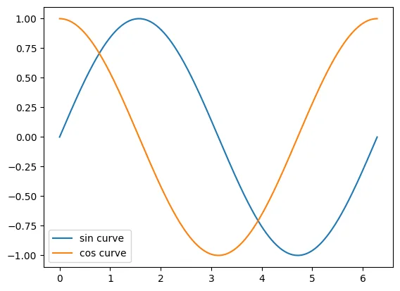

---
title: '使用Python和matplotlib绘制图表的方法【支持Google Colab】'
slug: "Python(matplotlib.pyplot)を使ってグラフを描画する方法"
date: 2023-04-09T01:02:19+09:00
tags: ["Python", "图表", "数学", "matplotlib", "pyplot", "Google Colaboratory"]
draft: false
image: "img.webp"
categories: ["数学·密码·量子"]
description: '面向初学者讲解如何使用Google Colaboratory，借助Python的matplotlib.pyplot库轻松绘制并显示正弦波和余弦波图表。无需搭建环境即可立即尝试。'
---


# 所需条件
- Google 账号

# 步骤

1. 访问 [https://colab.research.google.com/](https://colab.research.google.com/)
2. 选择“文件” -> “新建笔记本”
3. 粘贴并运行以下代码
```python
import matplotlib.pyplot as plt
import numpy as np
x = np.linspace(0, 2*np.pi, 500)
plt.plot(x, np.sin(x), label="sin curve")
plt.plot(x, np.cos(x), label="cos curve")
plt.legend() # 显示图例
plt.show()
```

# 运行结果



# 参考资料

- [matplotlib.pyplot — Matplotlib 3.5.3 documentation](https://matplotlib.org/3.5.3/api/_as_gen/matplotlib.pyplot.html)
