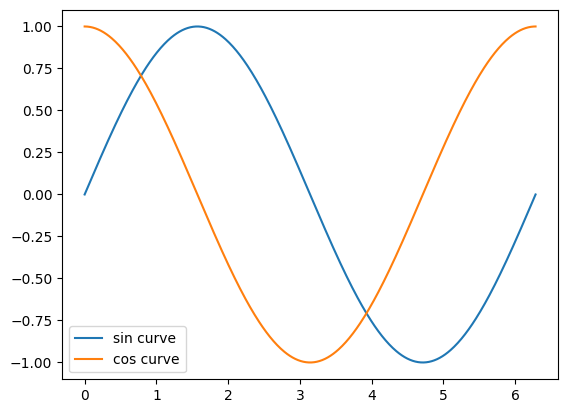

# 需要的東西
- Google 帳號

# 步驟

1. 進入 [https://colab.research.google.com/](https://colab.research.google.com/)
2. 選擇「檔案」→「新增筆記本」
3. 貼上並執行以下程式碼
```python
import matplotlib.pyplot as plt
import numpy as np
x = np.linspace(0, 2*np.pi, 500)
plt.plot(x, np.sin(x), label="sin curve")
plt.plot(x, np.cos(x), label="cos curve")
plt.legend() # 顯示圖例
plt.show()
```

# 執行結果



# 參考資料

- [matplotlib.pyplot — Matplotlib 3.5.3 documentation](https://matplotlib.org/3.5.3/api/_as_gen/matplotlib.pyplot.html)
