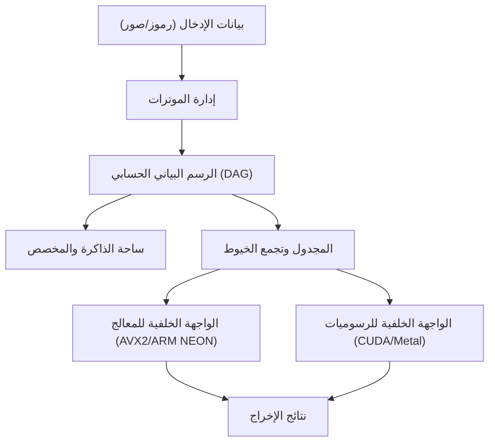
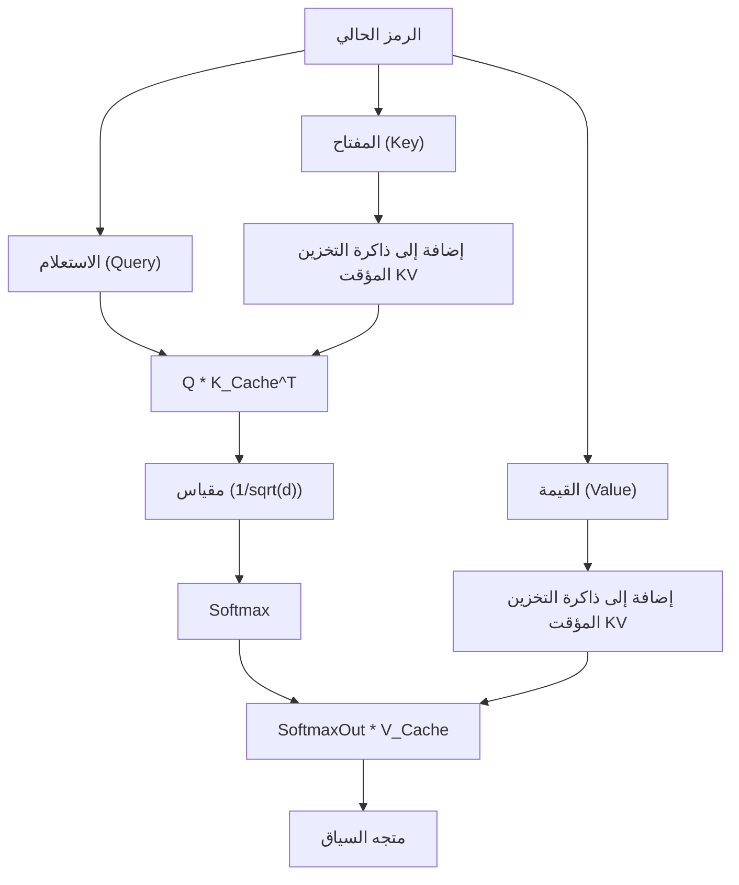

## 1. مقدمة: لماذا نتخلى عن بايثون ونصنع محرك استدلال للذكاء الاصطناعي باستخدام C++؟

في تطوير الذكاء الاصطناعي الحديث، تعتبر بايثون (Python) هي المعيار الفعلي. بفضل أطر العمل القوية مثل PyTorch و TensorFlow، يمكنك بناء وتدريب واستدلال شبكات عصبية معقدة ببضعة أسطر من التعليمات البرمجية. ومع ذلك، وراء كواليس هذه الأطر، تتولى اللغات ذات المستوى المنخفض مثل C++ و CUDA معالجة العمليات الحسابية الثقيلة. إن بايثون تلعب مجرد دور "الصمغ".

إذن، لماذا نحتاج إلى استبعاد بايثون وبناء محرك استدلال للذكاء الاصطناعي باستخدام C++ بمفردها؟ هناك عدة أسباب قوية لذلك:

1. **الأداء الفائق وزمن الانتقال المنخفض**: يمكن التخلص تمامًا من النفقات الإضافية الناتجة عن القفل العالمي للمترجم (GIL) والنوع الديناميكي في بايثون. خاصة في الأنظمة التي تتطلب العمل في الوقت الفعلي، حيث يكون التأخير بالمللي ثانية أمرًا قاتلًا.
2. **سهولة النشر**: من الصعب للغاية بناء بيئة بايثون (مجموعة ضخمة من المكتبات، جحيم التبعيات) في بيئة المستخدم النهائي. باستخدام C++، كل ما عليك فعله هو توزيع ملف تنفيذي ثنائي واحد مرتبط بشكل ثابت (مثل `.exe` أو ثنائيات ELF).
3. **دعم الأجهزة الطرفية**: في البيئات ذات الموارد المحدودة مثل الهواتف الذكية، والأجهزة المدمجة، و Raspberry Pi، لا توجد سعة لتشغيل بيئة تشغيل بايثون التي تستهلك جيجابايتات من الذاكرة.
4. **التحكم المباشر في الأجهزة**: توفر C++ إمكانية التحكم في المستوى المنخفض، مثل توقيت تخصيص الذاكرة، والاستخدام الصريح لتعليمات SIMD، وتحسين عمليات نقل الذاكرة مع وحدة المعالجة الرسومية (GPU).

في هذه المقالة، ومن خلال استلهام كبير من بنية مكتبة "GGML" التي طورها Georgi Gerganov، سنغوص في الأعماق التقنية لشرح عملية بناء محرك استدلال من الصفر باستخدام C++ فقط لتشغيل النماذج اللغوية الكبيرة (LLMs) وغيرها.

---

## 2. النظرة العامة على بنية محرك الاستدلال

تعد عملية الاستدلال في الذكاء الاصطناعي في جوهرها "سلسلة من حسابات المصفوفات الضخمة". لتنفيذ ذلك بكفاءة، يجب أن يتكون محرك الاستدلال من المكونات التالية.



1. **إدارة الموترات (Tensor)**: إدارة هيكل بيانات المصفوفات متعددة الأبعاد، والخطوة (Stride) لكل بُعد.
2. **الرسم البياني الحسابي (Computation Graph)**: تمثيل العمليات الحسابية لكل طبقة من طبقات الشبكة العصبية كرسم بياني موجه غير دوري (DAG).
3. **ساحة الذاكرة (Memory Arena)**: آلية إدارة ذاكرة مخصصة مسبقًا لتجنب النفقات الإضافية لتخصيص الذاكرة الديناميكي (`malloc` أو `new`).
4. **الواجهة الخلفية (Backend)**: تنفيذ العمليات (النواة/Kernels) المحسّنة لأجهزة معينة مثل CPU أو GPU.

سنقوم ببناء هذه المكونات معًا باستخدام ميزات C++ القوية (مثل القوالب، حساب المؤشرات، و RAII).

---

## 3. أسرار إدارة الذاكرة: ساحة الذاكرة (Memory Arena) ومحاذاة SIMD

تعتبر إدارة الذاكرة في محرك الاستدلال من أهم العناصر التي تؤثر بشكل مباشر على الأداء. أثناء الاستدلال، خاصة عند المرور عبر كل طبقة من نموذج Transformer، يتم إنشاء عدد هائل من الموترات الوسيطة. إذا قمنا بتخصيص وتحرير الذاكرة في كل مرة باستخدام `malloc` القياسي، فسيؤدي ذلك إلى تجزئة الكومة (Heap) وتحويل السياق في نظام التشغيل، مما يتسبب في انخفاض فادح في السرعة.

لذلك، نعتمد نهج "**ساحة الذاكرة (Memory Arena)**". تتمثل هذه الطريقة في حساب (أو تحديد) الحد الأقصى للذاكرة المطلوبة في بداية الاستدلال وتخصيصها دفعة واحدة، ثم استقطاع الذاكرة ببساطة عن طريق زيادة المؤشر.

### 3.1 أهمية المحاذاة (Alignment)

تدعم وحدات المعالجة المركزية (CPUs) الحديثة تعليمات SIMD (تعليمة واحدة، بيانات متعددة). مثل AVX2/AVX-512 في Intel/AMD، و NEON في ARM. تقوم هذه التعليمات بمعالجة 256 بت (32 بايت) أو 512 بت (64 بايت) من البيانات دفعة واحدة، ولكن يجب أن تكون ذاكرة البيانات المعالجة محاذاة (Aligned) عند حدود بايت معينة (عادةً 32 بايت أو 64 بايت).

فيما يلي مثال على تنفيذ ساحة ذاكرة في C++ يأخذ المحاذاة في الاعتبار:

```cpp
#include <cstdint>
#include <cstddef>
#include <stdexcept>
#include <iostream>

struct MemoryArena {
    size_t size;
    size_t offset;
    uint8_t* data;

    MemoryArena(size_t size) : size(size), offset(0) {
        // استخدم posix_memalign للأنظمة المتوافقة مع POSIX، و _aligned_malloc لنظام Windows
#ifdef _WIN32
        data = static_cast<uint8_t*>(_aligned_malloc(size, 64));
#else
        if (posix_memalign(reinterpret_cast<void**>(&data), 64, size) != 0) {
            throw std::bad_alloc();
        }
#endif
    }

    ~MemoryArena() {
#ifdef _WIN32
        _aligned_free(data);
#else
        free(data);
#endif
    }

    void* allocate(size_t bytes, size_t alignment = 64) {
        // حساب المحاذاة (إيجاد الحشو)
        size_t pad = (alignment - (offset % alignment)) % alignment;
        if (offset + pad + bytes > size) {
            throw std::runtime_error("OOM: MemoryArena out of memory");
        }
        offset += pad;
        void* ptr = data + offset;
        offset += bytes;
        return ptr;
    }
    
    void reset() {
        offset = 0; // تحرير الذاكرة يكون بمجرد إرجاع المؤشر للخلف (O(1))
    }
};
```

بهذه الطريقة، يتم دائمًا الحصول على الذاكرة من خلال هذه الساحة عند إنشاء الموترات. في كل مرة تنتهي فيها خطوة الاستدلال (مثلًا بعد كل توليد رمز)، يمكنك إعادة استخدام الذاكرة في لمح البصر عن طريق استدعاء `reset()`.

---

## 4. سحر هيكل بيانات الموترات والخطوة (Stride)

الموتر هو تعميم لمفاهيم القيم العددية، والمتجهات، والمصفوفات. في التنفيذ، من المهم أن البيانات الفعلية توضع في الذاكرة كـ **مصفوفة متجاورة أحادية البعد**، بينما نستخدم مفهوم "الخطوة (Stride)" لتفسيرها على أنها متعددة الأبعاد.

```cpp
enum class DataType {
    FP32,
    FP16,
    INT8,  // للتكميم
    INT4   // للتكميم
};

struct Tensor {
    int n_dims;           // عدد الأبعاد
    int64_t ne[4];        // عدد العناصر في كل بُعد (Number of Elements)
    size_t nb[4];         // الخطوة بالبايت لكل بُعد (Number of Bytes)
    DataType type;        // نوع البيانات
    void* data;           // مؤشر للبيانات
    
    // للرسم البياني الحسابي
    enum OpType op;
    Tensor* src0;
    Tensor* src1;
};
```

تمثل الخطوة `nb[i]` المسافة بالبايت في الذاكرة بين العناصر المتجاورة في البُعد `i`.
على سبيل المثال، إذا كانت مصفوفة تحتوي على $M \times N$ عنصر (من نوع FP32، أي 4 بايت لكل عنصر) مخزنة بتنسيق أولوية الصفوف (Row-Major)، فستكون الخطوات كالتالي:
- `nb[0]` = 4 (بايت) : الانتقال في اتجاه العمود
- `nb[1]` = $N \times 4$ (بايت) : الانتقال في اتجاه الصف

باستخدام هذا المفهوم، يمكننا إجراء عمليات مثل "المنقول (Transpose)" أو "العرض (View)" ببساطة عن طريق التبديل بين قيم الخطوات دون الحاجة إلى نسخ الذاكرة. هذه طريقة أنيقة وسريعة جدًا.

---

## 5. بناء الرسم البياني الحسابي (DAG) والتقييم المؤجل

على غرار PyTorch وغيرها، سيعتمد محرك الاستدلال الخاص بنا على التقييم المؤجل (Lazy Evaluation). بمعنى آخر، عند استدعاء دالة عملية رياضية، لا يتم إجراء الحساب الفعلي حينها، بل يتم فقط بناء الرسم البياني (تبعيات العقد).

```cpp
Tensor* tensor_add(MemoryArena& arena, Tensor* a, Tensor* b) {
    Tensor* out = create_tensor(arena, a->type, a->n_dims, a->ne);
    out->op = OpType::ADD;
    out->src0 = a;
    out->src1 = b;
    return out;
}

Tensor* tensor_mul_mat(MemoryArena& arena, Tensor* a, Tensor* b) {
    // b غالبًا ما تكون منقولة
    int64_t ne[2] = { a->ne[0], b->ne[1] };
    Tensor* out = create_tensor(arena, a->type, 2, ne);
    out->op = OpType::MUL_MAT;
    out->src0 = a;
    out->src1 = b;
    return out;
}
```

سيكون تدفق عملية الاستدلال على النحو التالي:


عند تقييم الرسم البياني (المسار الأمامي)، نستخدم الفرز الطوبولوجي لتنفيذ العمليات بدءًا من العقد التي لا تحتوي على تبعيات. نظرًا لأننا نقوم بالاستدلال فقط، فلا داعي للاحتفاظ بالتدرجات الخاصة بالانتشار الخلفي، مما يجعل إدارة الذاكرة بسيطة للغاية.

---

## 6. جوهر الرياضيات والتحسين: ضرب المصفوفات (GEMM) 

يتم استهلاك أكثر من 90% من العمليات الحسابية في استدلال الذكاء الاصطناعي في عمليات ضرب المصفوفات (GEMM: General Matrix Multiply). فآلية الانتباه والشبكات العصبية المتقدمة (FFN) التي تُعد جوهر نماذج Transformer، هي في الأساس عمليات ضرب لمصفوفات ضخمة.

حاصل ضرب $C = A B$ (بحجم $M \times N$) لمصفوفتين $A$ (بحجم $M \times K$) و $B$ (بحجم $K \times N$) يُعبر عنه رياضياً كالتالي:

$$
C_{i,j} = \sum_{k=0}^{K-1} A_{i,k} \cdot B_{k,j}
$$

إذا قمنا بتنفيذ ذلك باستخدام حلقة ثلاثية بسيطة، فسيحدث عدد كبير من إخفاقات ذاكرة التخزين المؤقت، ولن نحصل على أداء جيد إطلاقًا.

### 6.1 حظر ذاكرة التخزين المؤقت وتحسينات SIMD على وحدة المعالجة المركزية

تتلخص الإستراتيجية الأساسية لتسريع عملية GEMM على وحدة المعالجة المركزية في التالي:
1. **تجانب الحلقات (Cache Blocking)**: تقسيم المصفوفات إلى كتل صغيرة تتناسب مع حجم ذاكرة التخزين المؤقت L1/L2 لتسهيل الحسابات.
2. **تعبئة البيانات**: إعادة ترتيب البيانات داخليًا بحيث تصبح أنماط الوصول إلى الذاكرة متسلسلة.
3. **الاستفادة من SIMD**: استخدام تعليمات FMA (الضرب والجمع المدمج) مثل `_mm512_fmadd_ps` في AVX-512 لتنفيذ العديد من عمليات الضرب والجمع في دورة ساعة واحدة.

إليك مثال مبسط لعملية الضرب النقطي للمتجهات باستخدام C++ و SIMD Intrinsics:

```cpp
#include <immintrin.h> // لتعليمات AVX

// الضرب النقطي السريع لـ FP32 باستخدام AVX2
float dot_product_avx2(const float* a, const float* b, int n) {
    __m256 sum256 = _mm256_setzero_ps();
    int i = 0;
    
    // معالجة 8 عناصر في المرة الواحدة (256 بت = 32 بايت = 8 * 4 بايت)
    for (; i <= n - 8; i += 8) {
        __m256 va = _mm256_loadu_ps(a + i);
        __m256 vb = _mm256_loadu_ps(b + i);
        // تعليمة FMA: sum256 = va * vb + sum256
        sum256 = _mm256_fmadd_ps(va, vb, sum256);
    }
    
    // الجمع الأفقي للقيم الموجودة في سجلات SIMD
    float result[8];
    _mm256_storeu_ps(result, sum256);
    float dot = result[0] + result[1] + result[2] + result[3] + 
                result[4] + result[5] + result[6] + result[7];
                
    // معالجة الباقي
    for (; i < n; ++i) {
        dot += a[i] * b[i];
    }
    return dot;
}
```

بهذه التعديلات البسيطة فقط، يمكننا الحصول على زيادة في السرعة تتراوح من عدة أضعاف إلى أكثر من عشرة أضعاف مقارنة بالتنفيذ البسيط.

---

## 7. تجاوز حدود الأجهزة: دمج واجهات CUDA و Metal

رغم أن تنفيذ C++ الخالص يعمل بشكل معقول على وحدة المعالجة المركزية، إلا أنه لتشغيل نماذج ضخمة مثل LLM بسرعة عملية، فإن قوة المعالجة المتوازية في وحدة المعالجة الرسومية (GPU) تعتبر ضرورية. لذلك، سنقدم طبقة تجريد للواجهات الخلفية في محركنا.

### 7.1 تجريد الواجهة الخلفية

باستخدام تعدد الأشكال في C++، يمكننا التبديل بين مُنفذي العمليات الحسابية (Executors).

```cpp
class Backend {
public:
    virtual ~Backend() = default;
    virtual void alloc_buffer(Tensor* t) = 0;
    virtual void free_buffer(Tensor* t) = 0;
    virtual void copy_to_device(Tensor* t) = 0;
    virtual void copy_to_host(Tensor* t) = 0;
    
    // تنفيذ العمليات المختلفة
    virtual void compute_add(Tensor* src0, Tensor* src1, Tensor* dst) = 0;
    virtual void compute_mul_mat(Tensor* src0, Tensor* src1, Tensor* dst) = 0;
};
```

### 7.2 تنفيذ الواجهة الخلفية NVIDIA CUDA

للاستفادة من وحدات معالجة الرسوميات من NVIDIA، سنقوم بتنفيذ واجهة خلفية باستخدام امتدادات CUDA C++. من الممكن كتابة نواة خاصة بنا، ولكن فيما يتعلق بضرب المصفوفات، فإن استخدام "cuBLAS"، وهي أفضل مكتبة تقدمها NVIDIA، هو الحل الأمثل.

```cpp
#include <cublas_v2.h>
#include <cuda_runtime.h>

class CUDABackend : public Backend {
private:
    cublasHandle_t handle;
    
public:
    CUDABackend() {
        cublasCreate(&handle);
    }
    
    ~CUDABackend() {
        cublasDestroy(handle);
    }
    
    void compute_mul_mat(Tensor* src0, Tensor* src1, Tensor* dst) override {
        // في CUDA، التنسيق الافتراضي هو العمود الأول (Column-Major)، لذا يجب الانتباه للمعلمات
        const float alpha = 1.0f;
        const float beta = 0.0f;
        
        int m = src0->ne[0];
        int k = src0->ne[1];
        int n = src1->ne[1]; // بافتراض أن src1 منقولة
        
        cublasSgemm(handle, CUBLAS_OP_T, CUBLAS_OP_N,
                    m, n, k,
                    &alpha,
                    (const float*)src0->data, k,
                    (const float*)src1->data, k,
                    &beta,
                    (float*)dst->data, m);
        cudaDeviceSynchronize();
    }
};
```
نظرًا لأن نقل البيانات بين ذاكرة CUDA وذاكرة المضيف (`cudaMemcpy`) عملية مكلفة للغاية، فمن المهم تصميم النظام بحيث يحتفظ بجميع الأوزان والموترات الوسيطة داخل VRAM قدر الإمكان طوال فترة الاستدلال.

### 7.3 الواجهة الخلفية لـ Apple Silicon (Metal)

في السنوات الأخيرة، أثبتت شرائح M1/M2/M3 في أجهزة Mac كفاءتها العالية كأجهزة استدلال للذكاء الاصطناعي. والسبب في ذلك يعود إلى "الذاكرة الموحدة". نظرًا لأن CPU و GPU يشتركان في نفس مساحة الذاكرة، فإننا نستغني تمامًا عن عمليات نقل الذاكرة المكلفة بين المضيف والجهاز عبر ناقل PCIe كما هو الحال في CUDA.

لاستدعاء Metal من C++، نستخدم Objective-C++ (ملفات `.mm`) كجسر أو نستخدم مكتبة `metal-cpp`.
يتم كتابة النواة باستخدام Metal Compute Shader.

```cpp
// تظليل Metal
#include <metal_stdlib>
using namespace metal;

kernel void mul_mat_kernel(
    device const float* A [[buffer(0)]],
    device const float* B [[buffer(1)]],
    device float* C [[buffer(2)]],
    constant uint3& dims [[buffer(3)]],
    uint2 gid [[thread_position_in_grid]]
) {
    uint m = dims.x; uint k = dims.y; uint n = dims.z;
    uint row = gid.y; uint col = gid.x;
    
    if (row < m && col < n) {
        float sum = 0.0;
        for (uint i = 0; i < k; ++i) {
            sum += A[row * k + i] * B[i * n + col]; // تبسيط
        }
        C[row * n + col] = sum;
    }
}
```

في بيئة Apple Silicon، تتوفر أيضًا مكتبة محسنة لعمليات ضرب المصفوفات تُسمى MPS. باستخدام هذه المكتبة، يمكننا تحقيق سرعات استدلال مذهلة.

---

## 8. المعالجات الخاصة بنماذج Transformer: الانتباه وذاكرة التخزين المؤقت KV

تعتمد أحدث نماذج LLM مثل LLaMA 2/3 و GPT على بنية Transformer. لتنفيذها في C++، من الضروري بناء خوارزمية الانتباه "Scaled Dot-Product Attention" الممثلة في المعادلة التالية:

$$
\text{Attention}(Q, K, V) = \text{softmax}\left(\frac{QK^T}{\sqrt{d_k}}\right)V
$$

بالإضافة إلى ذلك، في توليد الرموز ذاتي الانحدار، من الضروري الاحتفاظ بنتائج حسابات الرموز السابقة. هذا ما يُسمى "**ذاكرة التخزين المؤقت KV**".



يتم تخصيص الذاكرة لذاكرة التخزين المؤقت KV عن طريق حجز مساحة ذاكرة للحد الأقصى لطول السياق مسبقًا في ساحة الذاكرة بطريقة مشابهة للمخزن المؤقت الحلقي. هذا يمنع الحاجة إلى إعادة التخصيص في كل خطوة توليد.

بالنسبة للتشفير الموضعي، سنقوم بتنفيذ "RoPE (Rotary Position Embedding)". إنها طريقة لتضمين معلومات الموقع كمتجه دوران في مساحة معقدة. إن مفتاح الأداء هنا يكمن في تحسين استدعاء دوال `sin` و `cos` في C++.

---

## 9. التحسين الفائق من خلال تكميم النموذج (Quantization)

إذا تم تحميل نموذج ضخم (مثل نموذج LLaMA بـ 7 مليارات معلمة) بصيغة FP32، فسيستهلك حوالي 28 جيجابايت من الذاكرة (VRAM) للأوزان فقط. ومع إضافة ذاكرة التخزين المؤقت KV، يمكن أن يتجاوز بسهولة 30 جيجابايت، مما يجعله مستحيلاً للتشغيل على وحدات المعالجة الرسومية العادية.

لذلك، يصبح من الضروري استخدام تقنية "**التكميم**". وهذا هو صميم وأهم ما يميز تنسيق GGML.

التكميم هو تقنية لتقليل دقة الأوزان عمدًا:
- **FP16 (16-bit)**: يقلل الحجم إلى النصف. مع عدم وجود انخفاض ملحوظ في الدقة.
- **INT8 (8-bit)**: يقلل الحجم إلى الربع. تدهور طفيف.
- **INT4 (4-bit)**: يقلل الحجم إلى الثُمن. باستخدام عوامل القياس والحجب الخاصة، يمكن إجراء استدلال عملي.

على جانب محرك الاستدلال، تُقرأ الأوزان المضغوطة بصيغة INT4 (أو INT8) من الذاكرة، و**مباشرة بعد تحميلها في سجلات CPU أو GPU، يتم فك تكميمها (Dequantize) إلى FP16 أو FP32 لإجراء الحسابات**.

بشكل يثير الدهشة، فإن تقليل كمية البيانات المقروءة من الذاكرة حتى لو أدى ذلك لزيادة العمليات الحسابية يجعل العملية أسرع. وذلك لأن عنق الزجاجة لمهام الاستدلال في الأجهزة الحديثة ليس في "قوة الحوسبة" بل في "**عرض النطاق الترددي للذاكرة**". باستخدام محرك مبني بـ C++ ومكمم بتقنية INT4، يمكنك تشغيل نماذج LLM محليًا بسلاسة حتى على جهاز MacBook Air بذاكرة 8 جيجابايت.

---

## 10. ضبط الأداء: معمارية NUMA وتجمع الخيوط

عند إجراء الاستدلال باستخدام وحدة المعالجة المركزية، يكون تعدد الخيوط أمرًا ضروريًا. ومع ذلك، فإن مجرد بدء تشغيل العديد من `std::thread` لا يعتبر الحل الأمثل.

في الخوادم الحديثة أو معالجات سطح المكتب المتطورة، يتم اعتماد معمارية **NUMA (Non-Uniform Memory Access)**. الوصول إلى الذاكرة القريبة ماديًا من نواة CPU محددة يكون سريعًا، في حين أن الوصول إلى ذاكرة مرتبطة بمعالج آخر يكون بطيئًا للغاية.

في محركات الاستدلال المتقدمة المكتوبة بـ C++، يتم استخدام التقنيات التالية:
1. **تثبيت الخيوط (Thread Pinning)**: تثبيت كل خيط بنواة CPU معينة لمنع تدمير ذاكرة التخزين المؤقت الناتج عن تبديل السياق.
2. **تخصيص مدرك لـ NUMA**: تخصيص الذاكرة على نفس عقدة NUMA التي توجد بها الخيوط التي تعالج تلك البيانات.
3. **تجمع خيوط لسرقة العمل (Work-Stealing)**: تقسيم كل عقدة في الرسم البياني الحسابي إلى مهام دقيقة، وتنفيذ مُجدوِل فعّال يسمح للخيوط الخاملة بسرقة المهام وتنفيذها تلقائيًا.

من خلال الاستفادة من هذه التقنيات، يمكننا إبقاء استخدام وحدة المعالجة المركزية قريبًا من 100%، وتحقيق إنتاجية قريبة من القيمة النظرية.

---

## 11. الخلاصة: متعة قيادة الذكاء الاصطناعي "بعضلات" C++

بايثون لغة مفيدة حقًا. ومع ذلك، بمجرد الانتقال إلى مرحلة "تشغيل النموذج المكتمل بكفاءة على جميع الأجهزة في العالم الحقيقي"، يحين وقت C++.

إن الشعور بالإنجاز عند رؤية محرك استدلال قمت ببنائه بنفسك من خلال معالجة متتاليات البايت في الذاكرة مباشرة، والضغط على السجلات إلى الحد الأقصى بتعليمات SIMD، والمصارعة مع عرض النطاق الترددي لـ VRAM، وهو يولد نصوصًا طبيعية على سطر الأوامر، هو "فرحة هندسية خالصة" لا يمكن أن تحصل عليها أبدًا بمجرد استدعاء `model.generate()` في أحد أطر عمل بايثون.

غالبًا ما يُنظر إلى تقنيات الذكاء الاصطناعي كـ "صندوق أسود"، ولكن بكتابة كل شيء بنفسك باستخدام C++ بدءًا من عمليات الموترات وحتى تخصيص الذاكرة، يمكنك فهم الآلية الحقيقية بعمق وكيف "تفكر" النماذج اللغوية الكبيرة.

إذا كان لديك معرفة أساسية بـ C++ واهتمام قوي بتقنيات الذكاء الاصطناعي الحالية، فجرّب التحدي المتمثل في تطوير محرك الاستدلال الخاص بك. ستكون الأكواد المصدرية لمشاريع مثل GGML أو llama.cpp أفضل الكتب المدرسية الحية.

**هيا بنا إذن، تخلص من بيئة تشغيل بايثون الثقيلة، ودعنا نُشغّل أحدث تقنيات الذكاء الاصطناعي مستخدمين عضلات C++!**
