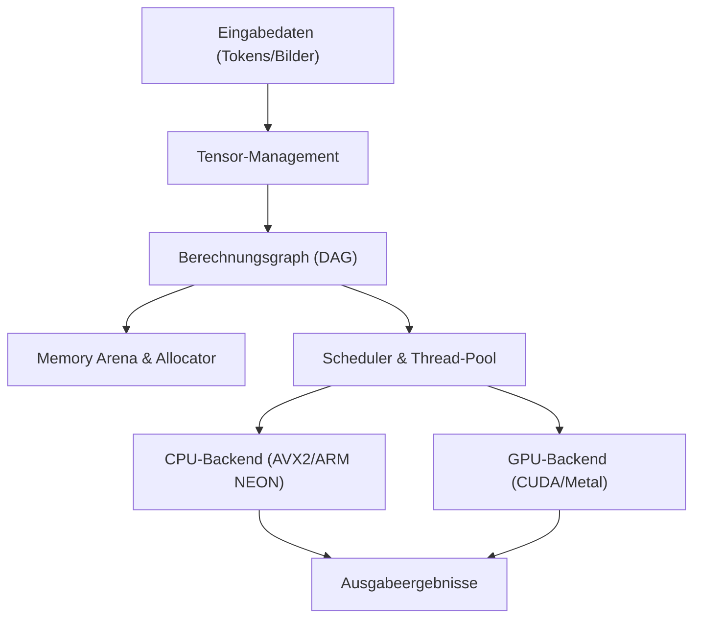
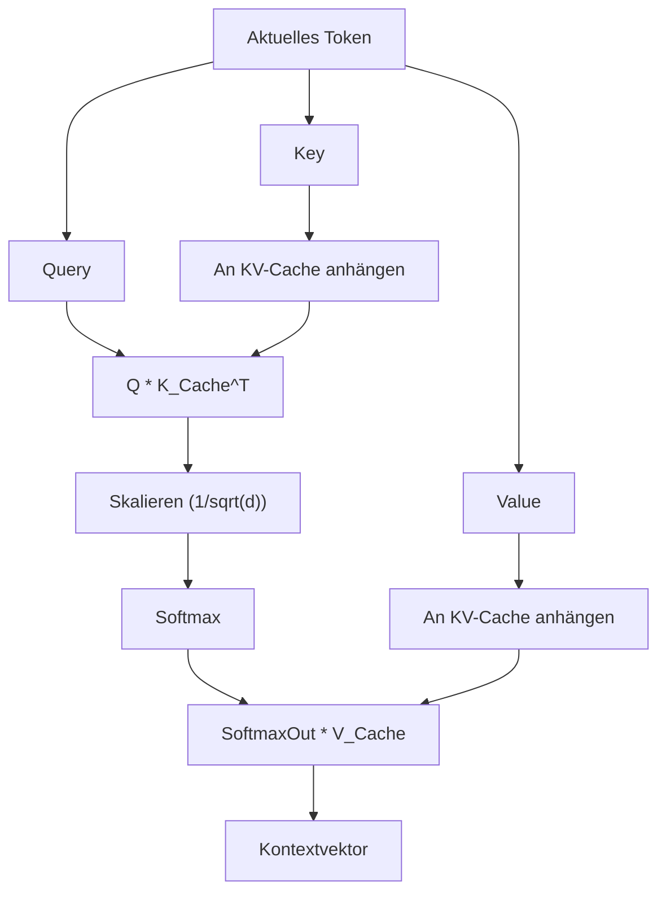

## 1. Einleitung: Warum Python aufgeben und eine KI-Inferenz-Engine in C++ schreiben?

In der modernen KI-Entwicklung ist Python der De-facto-Standard. Dank leistungsstarker Frameworks wie PyTorch und TensorFlow können komplexe neuronale Netze mit nur wenigen Codezeilen aufgebaut, trainiert und für die Inferenz genutzt werden. Hinter den Kulissen dieser Frameworks übernehmen jedoch Low-Level-Sprachen wie C++ und CUDA die rechenintensiven Aufgaben. Python fungiert hier lediglich als "Klebstoff" (Glue).

Warum sollte man also Python explizit ausschließen und eine KI-Inferenz-Engine ausschließlich mit C++ erstellen? Dafür gibt es einige triftige Gründe:

1. **Extreme Leistung und niedrige Latenz**: Der Overhead durch Pythons GIL (Global Interpreter Lock) und die dynamische Typisierung kann vollständig eliminiert werden. Besonders bei Systemen, die Echtzeitfähigkeit erfordern, können Verzögerungen im Millisekundenbereich fatal sein.
2. **Einfaches Deployment**: Der Aufbau einer Python-Umgebung (riesige Bibliotheken, Abhängigkeitshölle) auf dem System des Endbenutzers ist äußerst schwierig. Mit C++ reicht es aus, eine einzige statisch verlinkte ausführbare Binärdatei (`.exe` oder ELF-Binärdatei) zu verteilen.
3. **Unterstützung für Edge-Geräte**: In ressourcenbeschränkten Umgebungen wie Smartphones, eingebetteten Geräten oder dem Raspberry Pi gibt es keinen Spielraum, um eine Python-Laufzeitumgebung auszuführen, die mehrere Gigabyte an Speicher verbraucht.
4. **Direkte Hardwaresteuerung**: Low-Level-Steuerungen wie das Timing der Speicherzuweisung, die explizite Nutzung von SIMD-Befehlen und die Optimierung des Speichertransfers mit der GPU sind mit C++ möglich.

In diesem Artikel werden wir den Prozess des Aufbaus einer Inferenz-Engine für Large Language Models (LLMs) und andere Modelle komplett von Grund auf in C++ tiefgreifend und technisch erklären, stark inspiriert von der Architektur der Bibliothek "GGML", die von Georgi Gerganov entwickelt wurde.

---

## 2. Gesamtarchitektur der Inferenz-Engine

KI-Inferenzprozesse sind im Wesentlichen "eine Reihe gigantischer Matrixberechnungen". Um diese effizient auszuführen, muss eine Inferenz-Engine aus den folgenden Komponenten bestehen:



1. **Tensor-Management**: Verwaltet mehrdimensionale Array-Datenstrukturen und die Strides pro Dimension.
2. **Berechnungsgraph (Computation Graph)**: Repräsentiert die Operationen jeder Schicht des neuronalen Netzes als gerichteten azyklischen Graphen (DAG).
3. **Memory Arena**: Ein Mechanismus zur vorab allokierten Speicherverwaltung, um den Overhead der dynamischen Speicherzuweisung (`malloc` oder `new`) zu vermeiden.
4. **Backend**: Für bestimmte Hardware wie CPU oder GPU optimierte Implementierungen der Operationen (Kernel).

Wir werden diese Komponenten unter Verwendung der mächtigen Funktionen von C++ (Templates, Zeigerarithmetik, RAII usw.) zusammensetzen.

---

## 3. Das Geheimnis der Speicherverwaltung: Memory Arena und SIMD-Alignment

Die Speicherverwaltung in einer Inferenz-Engine ist einer der wichtigsten Faktoren, der sich direkt auf die Leistung auswirkt. Während der Inferenz, insbesondere beim Durchlaufen der einzelnen Schichten eines Transformer-Modells, wird eine enorme Anzahl von Zwischen-Tensoren generiert. Wenn diese jedes Mal mit dem standardmäßigen `malloc` zugewiesen und freigegeben werden, führt dies aufgrund von Heap-Fragmentierung und OS-Kontextwechseln zu massiven Leistungseinbußen.

Daher verwenden wir den Ansatz einer "**Memory Arena**". Bei dieser Methode wird die maximale Speichermenge, die zu Beginn der Inferenz benötigt wird, berechnet (oder vorgegeben) und auf einmal zugewiesen. Der Speicher wird dann einfach durch das Inkrementieren eines Zeigers reserviert.

### 3.1 Die Bedeutung des Alignments

Moderne CPUs unterstützen SIMD-Befehle (Single Instruction, Multiple Data), wie AVX2/AVX-512 von Intel/AMD oder NEON von ARM. Diese Befehle verarbeiten 256 Bit (32 Byte) oder 512 Bit (64 Byte) Daten auf einmal, erfordern aber, dass der zu verarbeitende Datenspeicher an bestimmten Byte-Grenzen (normalerweise 32 Byte oder 64 Byte) ausgerichtet (aligned) ist.

Hier ist ein C++-Implementierungsbeispiel für eine Memory Arena, die das Alignment berücksichtigt.

```cpp
#include <cstdint>
#include <cstddef>
#include <stdexcept>
#include <iostream>

struct MemoryArena {
    size_t size;
    size_t offset;
    uint8_t* data;

    MemoryArena(size_t size) : size(size), offset(0) {
        // Bei POSIX-Systemen posix_memalign verwenden, bei Windows _aligned_malloc
#ifdef _WIN32
        data = static_cast<uint8_t*>(_aligned_malloc(size, 64));
#else
        if (posix_memalign(reinterpret_cast<void**>(&data), 64, size) != 0) {
            throw std::bad_alloc();
        }
#endif
    }

    ~MemoryArena() {
#ifdef _WIN32
        _aligned_free(data);
#else
        free(data);
#endif
    }

    void* allocate(size_t bytes, size_t alignment = 64) {
        // Berechnung des Alignments (Bestimmung des Paddings)
        size_t pad = (alignment - (offset % alignment)) % alignment;
        if (offset + pad + bytes > size) {
            throw std::runtime_error("OOM: MemoryArena out of memory");
        }
        offset += pad;
        void* ptr = data + offset;
        offset += bytes;
        return ptr;
    }
    
    void reset() {
        offset = 0; // Speicherfreigabe erfolgt nur durch Rücksetzen des Zeigers (O(1))
    }
};
```

Auf diese Weise wird der Speicher beim Erstellen von Tensoren immer über diese Arena zugewiesen. Durch einfaches Aufrufen von `reset()` am Ende jedes Inferenzschritts (z. B. nach jeder Token-Generierung) kann der Speicher sofort wiederverwendet werden.

---

## 4. Tensor-Datenstrukturen und die Magie des Strides

Ein Tensor ist ein generalisiertes Konzept von Skalaren, Vektoren und Matrizen. Bei der Implementierung ist es wichtig, das Konzept des "Strides" zu berücksichtigen, das es ermöglicht, die eigentlichen Daten, die als **eindimensionales fortlaufendes Array** im Speicher liegen, als mehrdimensional zu interpretieren.

```cpp
enum class DataType {
    FP32,
    FP16,
    INT8,  // Für Quantisierung
    INT4   // Für Quantisierung
};

struct Tensor {
    int n_dims;           // Anzahl der Dimensionen
    int64_t ne[4];        // Anzahl der Elemente pro Dimension (Number of Elements)
    size_t nb[4];         // Stride pro Dimension (Number of Bytes)
    DataType type;        // Datentyp
    void* data;           // Zeiger auf die Nutzdaten (Payload)
    
    // Für den Berechnungsgraphen
    enum OpType op;
    Tensor* src0;
    Tensor* src1;
};
```

Der Stride `nb[i]` repräsentiert den Byte-Abstand im Speicher zwischen benachbarten Elementen in der Dimension `i`.
Zum Beispiel sieht der Stride für eine Matrix mit $M \times N$ Elementen (FP32, 4 Bytes pro Element), die in Row-Major-Reihenfolge (zeilenweise) gespeichert ist, wie folgt aus:
- `nb[0]` = 4 (Bytes): Bewegung in Spaltenrichtung
- `nb[1]` = $N \times 4$ (Bytes): Bewegung in Zeilenrichtung

Durch die Nutzung dieses Konzepts können Operationen wie "Transponieren" (Transpose) oder "Ansicht" (View) durchgeführt werden, ohne Speicher zu kopieren, indem man lediglich die Stride-Werte austauscht. Das ist sehr elegant und schnell.

---

## 5. Aufbau des Berechnungsgraphen (DAG) und Lazy Evaluation

Ähnlich wie PyTorch verwendet auch unsere Inferenz-Engine eine verzögerte Auswertung (Lazy Evaluation), die dem "Define-by-Run"-Konzept ähnelt. Das bedeutet, dass zum Zeitpunkt des Aufrufs einer mathematischen Funktion keine Berechnungen durchgeführt werden, sondern nur der Graph (die Abhängigkeiten zwischen den Knoten) aufgebaut wird.

```cpp
Tensor* tensor_add(MemoryArena& arena, Tensor* a, Tensor* b) {
    Tensor* out = create_tensor(arena, a->type, a->n_dims, a->ne);
    out->op = OpType::ADD;
    out->src0 = a;
    out->src1 = b;
    return out;
}

Tensor* tensor_mul_mat(MemoryArena& arena, Tensor* a, Tensor* b) {
    // b ist meistens transponiert
    int64_t ne[2] = { a->ne[0], b->ne[1] };
    Tensor* out = create_tensor(arena, a->type, 2, ne);
    out->op = OpType::MUL_MAT;
    out->src0 = a;
    out->src1 = b;
    return out;
}
```

Der Ablauf des Inferenzprozesses ist wie folgt:


Bei der Auswertung des Graphen (Vorwärtspass) wird eine topologische Sortierung verwendet, um Knoten ohne Abhängigkeiten nacheinander auszuführen. Da wir bei reiner Inferenz keine Gradienten für die Backpropagation speichern müssen, bleibt die Speicherverwaltung sehr einfach.

---

## 6. Der Kern von Mathematik und Optimierung: Matrixmultiplikation (GEMM)

Mehr als 90 % der Rechenleistung bei der KI-Inferenz werden für Matrixmultiplikationen (GEMM: General Matrix Multiply) aufgewendet. Der Kern von Transformer-Modellen, der Attention-Mechanismus und das Feed-Forward Network (FFN), sind letztlich gigantische Matrixmultiplikationen.

Das Produkt $C = A B$ (Größe $M \times N$) von zwei Matrizen $A$ (Größe $M \times K$) und $B$ (Größe $K \times N$) wird mathematisch wie folgt ausgedrückt:

$$
C_{i,j} = \sum_{k=0}^{K-1} A_{i,k} \cdot B_{k,j}
$$

Wenn dies mit einer naiven dreifachen Schleife implementiert wird, treten häufig Cache-Misses auf, und es wird kaum Leistung erbracht.

### 6.1 Cache-Blocking auf der CPU und SIMD-Optimierung

Die grundlegende Strategie zur Beschleunigung von GEMM auf der CPU sieht folgendermaßen aus:
1. **Loop-Tiling (Cache-Blocking)**: Die Matrix wird in kleine Blöcke unterteilt, die in den L1/L2-Cache passen, und blockweise berechnet.
2. **Daten-Packing**: Daten werden intern neu angeordnet, um kontinuierliche Speicherzugriffsmuster zu gewährleisten.
3. **Nutzung von SIMD**: Durch die Verwendung von FMA-Befehlen (Fused Multiply-Add) wie `_mm512_fmadd_ps` in AVX-512 können in einem einzigen Taktzyklus viele Multiplikations-Additions-Operationen durchgeführt werden.

Hier ist ein Beispiel für ein vereinfachtes Vektor-Skalarprodukt (Dot Product) unter Verwendung von C++ und SIMD Intrinsics.

```cpp
#include <immintrin.h> // Für AVX-Befehle

// Schnelles FP32-Skalarprodukt mit AVX2
float dot_product_avx2(const float* a, const float* b, int n) {
    __m256 sum256 = _mm256_setzero_ps();
    int i = 0;
    
    // Verarbeite 8 Elemente auf einmal (256 Bit = 32 Byte = 8 * 4 Byte)
    for (; i <= n - 8; i += 8) {
        __m256 va = _mm256_loadu_ps(a + i);
        __m256 vb = _mm256_loadu_ps(b + i);
        // FMA-Befehl: sum256 = va * vb + sum256
        sum256 = _mm256_fmadd_ps(va, vb, sum256);
    }
    
    // Horizontale Addition der Werte im SIMD-Register
    float result[8];
    _mm256_storeu_ps(result, sum256);
    float dot = result[0] + result[1] + result[2] + result[3] + 
                result[4] + result[5] + result[6] + result[7];
                
    // Verarbeitung des Rests
    for (; i < n; ++i) {
        dot += a[i] * b[i];
    }
    return dot;
}
```

Schon dieser kleine Trick kann im Vergleich zu einer naiven Implementierung zu einer mehrfachen bis zu über zehnfachen Geschwindigkeitssteigerung führen.

---

## 7. Hardwaregrenzen überwinden: Integration von CUDA- und Metal-Backends

Eine reine C++-Implementierung läuft auf der CPU zwar einigermaßen gut, aber um riesige Modelle wie LLMs mit praktischer Geschwindigkeit auszuführen (z. B. mehr als 20 Tokens pro Sekunde), ist die parallele Rechenleistung einer GPU unerlässlich. Daher führen wir eine Backend-Abstraktionsschicht in unsere Engine ein.

### 7.1 Backend-Abstraktion

Wir nutzen den C++-Polymorphismus, um die Ausführungseinheit (Executor) für die Berechnungen wechseln zu können.

```cpp
class Backend {
public:
    virtual ~Backend() = default;
    virtual void alloc_buffer(Tensor* t) = 0;
    virtual void free_buffer(Tensor* t) = 0;
    virtual void copy_to_device(Tensor* t) = 0;
    virtual void copy_to_host(Tensor* t) = 0;
    
    // Ausführung verschiedener Operationen
    virtual void compute_add(Tensor* src0, Tensor* src1, Tensor* dst) = 0;
    virtual void compute_mul_mat(Tensor* src0, Tensor* src1, Tensor* dst) = 0;
};
```

### 7.2 Implementierung des NVIDIA CUDA-Backends

Um NVIDIA-GPUs zu nutzen, implementieren wir das Backend mit CUDA-C++-Erweiterungen. Obwohl es möglich ist, eigene Kernel zu schreiben, ist es bei Matrixmultiplikationen am besten, "cuBLAS", die erstklassige Bibliothek von NVIDIA, zu verwenden.

```cpp
#include <cublas_v2.h>
#include <cuda_runtime.h>

class CUDABackend : public Backend {
private:
    cublasHandle_t handle;
    
public:
    CUDABackend() {
        cublasCreate(&handle);
    }
    
    ~CUDABackend() {
        cublasDestroy(handle);
    }
    
    void compute_mul_mat(Tensor* src0, Tensor* src1, Tensor* dst) override {
        // Bei CUDA ist Column-Major der Standard, daher muss man auf die Parameter achten
        const float alpha = 1.0f;
        const float beta = 0.0f;
        
        int m = src0->ne[0];
        int k = src0->ne[1];
        int n = src1->ne[1]; // src1 wird als transponiert vorausgesetzt
        
        cublasSgemm(handle, CUBLAS_OP_T, CUBLAS_OP_N,
                    m, n, k,
                    &alpha,
                    (const float*)src0->data, k,
                    (const float*)src1->data, k,
                    &beta,
                    (float*)dst->data, m);
        cudaDeviceSynchronize();
    }
};
```
Da die Datenübertragung (`cudaMemcpy`) zwischen CUDA-Speicher und Host-(CPU)-Speicher sehr ressourcenintensiv ist, ist es wichtig, die Engine so zu entwerfen, dass alle Gewichte (Gewichtstensoren) und Zwischentensoren während der Inferenz so weit wie möglich im VRAM verbleiben.

### 7.3 Apple Silicon (Metal) Backend

In den letzten Jahren haben sich Macs mit M1/M2/M3-Chips (Apple Silicon) als hervorragende Maschinen für die KI-Inferenz erwiesen. Der Grund dafür ist der "Unified Memory". Da sich CPU und GPU denselben Speicherbereich teilen, entfallen die teuren Host-Device-Speichertransfers über den PCIe-Bus, wie sie bei CUDA erforderlich sind, komplett.

Um Metal von C++ aus aufzurufen, verwendet man entweder Objective-C++ (`.mm`-Dateien) als Brücke oder die Bibliothek `metal-cpp`.
Kernel werden mithilfe von Metal Compute-Shadern (in `.metal`-Dateien C++-ähnlich geschrieben) implementiert.

```cpp
// Metal-Shader (kernel.metal)
#include <metal_stdlib>
using namespace metal;

kernel void mul_mat_kernel(
    device const float* A [[buffer(0)]],
    device const float* B [[buffer(1)]],
    device float* C [[buffer(2)]],
    constant uint3& dims [[buffer(3)]],
    uint2 gid [[thread_position_in_grid]]
) {
    uint m = dims.x; uint k = dims.y; uint n = dims.z;
    uint row = gid.y; uint col = gid.x;
    
    if (row < m && col < n) {
        float sum = 0.0;
        for (uint i = 0; i < k; ++i) {
            sum += A[row * k + i] * B[i * n + col]; // Vereinfacht
        }
        C[row * n + col] = sum;
    }
}
```

In Apple Silicon-Umgebungen steht auch eine optimierte Bibliothek für Matrixmultiplikationen namens MPS (Metal Performance Shaders) zur Verfügung. Wenn man diese in der Praxis nutzt, lassen sich beeindruckende Inferenzgeschwindigkeiten erzielen.

---

## 8. Spezifische Verarbeitung für Transformer-Modelle: Attention und KV-Cache

Hochmoderne LLMs wie LLaMA 2/3 oder GPT basieren auf der Transformer-Architektur. Um dies in C++ zu implementieren, ist es unerlässlich, die "Scaled Dot-Product Attention", ausgedrückt durch folgende mathematische Formel, aufzubauen:

$$
\text{Attention}(Q, K, V) = \text{softmax}\left(\frac{QK^T}{\sqrt{d_k}}\right)V
$$

Zudem müssen bei der autoregressiven Token-Generierung die Berechnungsergebnisse (Key und Value) vergangener Tokens aufbewahrt werden. Dies nennt man "**KV-Cache (Key-Value Cache)**".



Auch für den KV-Cache wird der Speicher im Voraus reserviert. Dies erfolgt ähnlich wie bei einem Ringpuffer, indem man in der Arena Platz für die maximale Kontextlänge (z. B. 4096 oder 8192 Tokens) allokiert. Dadurch können Neuallokationen bei jedem Generierungsschritt vermieden werden.

Für die Positionscodierung (Positional Encoding) implementieren wir "RoPE (Rotary Position Embedding)", was sich in den letzten Jahren durchgesetzt hat. Dies ist eine Methode, bei der Positionsinformationen als Rotationsvektoren im komplexen Raum eingebettet werden. Die Optimierung der Aufrufe von `sin`- und `cos`-Funktionen in C++ (z. B. durch Look-up-Tabellen) ist hier der Schlüssel zur Leistung.

---

## 9. Extreme Optimierung durch Modellquantisierung (Quantization)

Wenn ein großes Modell (beispielsweise ein LLaMA-Modell mit 7 Milliarden Parametern) als FP32 (32-Bit-Fließkommazahl) geladen wird, verbrauchen allein die Gewichte etwa 28 GB Speicher (VRAM). Nimmt man den KV-Cache und die Inferenzpuffer hinzu, übersteigt der Verbrauch leicht 30 GB, was eine Ausführung auf normalen Consumer-GPUs unmöglich macht.

Hier kommt die "**Quantisierung (Quantization)**" ins Spiel. Sie ist auch die wahre Stärke des GGML-Formats.

Bei der Quantisierung wird die Genauigkeit der Gewichte bewusst verringert.
- **FP16 (16-bit)**: Größe halbiert. Nahezu kein Genauigkeitsverlust.
- **INT8 (8-bit)**: Ein Viertel der Größe. Leichte Verschlechterung.
- **INT4 (4-bit)**: Ein Achtel der Größe. Bei Verwendung von eigenem Blocking und Skalierungsfaktoren ist eine praktische Inferenz möglich.

Auf der Seite der Inferenz-Engine werden die als INT4 (oder INT8) komprimierten Gewichte aus dem Speicher gelesen und **unmittelbar nach dem Laden in die CPU- oder GPU-Register auf FP16 oder FP32 entpackt (dequantisiert)**, bevor die Berechnung erfolgt.

Erstaunlicherweise ist es schneller, das aus dem Speicher gelesene Datenvolumen zu reduzieren, selbst wenn dies die Berechnungsmenge erhöht. Dies liegt daran, dass bei moderner Hardware der Engpass bei Inferenzaufgaben nicht in der "Rechenleistung (Compute Bound)", sondern in der "**Speicherbandbreite (Memory Bandwidth Bound)**" liegt. Mit einer in C++ implementierten Engine, die INT4-Quantisierung nutzt, ist es möglich, lokale LLMs selbst auf einem MacBook Air mit 8 GB VRAM flüssig auszuführen.

---

## 10. Performance-Tuning: NUMA-Architektur und Thread-Pools

Bei der Inferenz auf einer CPU ist Multithreading unerlässlich. Es ist jedoch nicht optimal, einfach viele `std::thread`s zu starten.

In modernen Multi-Socket-Servern oder High-End-CPUs wie dem Ryzen Threadripper wird eine **NUMA (Non-Uniform Memory Access)**-Architektur verwendet. Der Zugriff auf physisch nahegelegenen Speicher (lokalen Speicher) von einem bestimmten CPU-Kern aus ist schnell, während der Zugriff auf Speicher, der mit einem anderen Prozessor verbunden ist, extrem langsam ist.

Fortgeschrittene C++-Inferenz-Engines nutzen die folgenden Techniken:
1. **Thread-Pinning**: Jeder Thread wird an einen bestimmten CPU-Kern gebunden (Festlegen der Affinity), um zu verhindern, dass Caches durch Kontextwechsel verworfen werden.
2. **NUMA-Aware Allocation**: Der Speicher wird auf demselben NUMA-Knoten zugewiesen wie der Thread, der die Daten verarbeitet.
3. **Work-Stealing Thread-Pool**: Implementierung eines effizienten Schedulers, der jeden Knoten des Berechnungsgraphen in kleinere Aufgaben unterteilt. Freie Threads "stehlen" sich dann automatisch Aufgaben und führen diese aus.

Indem man all dies einsetzt, kann die CPU-Auslastung konstant nahe an 100 % gehalten und ein Durchsatz erreicht werden, der nah am theoretischen Maximum liegt.

---

## 11. Fazit: Der Spaß daran, KI mit C++-"Muskeln" anzutreiben

Python ist zweifellos praktisch. In der Forschung, Entwicklung und beim Prototyping gibt es keine Sprache, die an seine Produktivität heranreicht. Wenn man jedoch in die Phase übergeht, in der man ein fertiges Modell "in der realen Welt, effizient und auf jedem Gerät ausführen" möchte, schlägt die Stunde von C++.

Das Erfolgserlebnis, das man verspürt, wenn die eigens entwickelte Inferenz-Engine – erschaffen durch das direkte Manipulieren von Speicher-Bytefolgen, das Ausreizen von Registern durch SIMD-Befehle und den Kampf mit der VRAM-Bandbreite der GPU – nacheinander natürliche japanische (oder deutsche) Text-Tokens in der Konsole generiert, bietet eine "reine Ingenieursfreude", die man beim Aufrufen von `model.generate()` in einem Python-Framework niemals erleben wird.

KI-Technologie neigt dazu, eine "Black Box" zu sein. Doch indem man von Tensor-Operationen bis hin zur Speicherverwaltung alles selbst in C++ schreibt, kann man ein tiefes Verständnis für die wahren Mechanismen erlangen und begreifen, wie ein LLM "denkt".

Wenn Sie über Grundkenntnisse in C++ verfügen und ein starkes Interesse an der aktuellen KI-Technologie haben, sollten Sie unbedingt versuchen, eine eigene Inferenz-Engine zu entwickeln. Die Quellcodes von GGML und llama.cpp werden Ihnen dabei als die besten "lebenden Lehrbücher" dienen.

**Also, lassen Sie die schwere Python-Laufzeitumgebung hinter sich und treiben Sie modernste KI mit den Muskeln von C++ an!**
