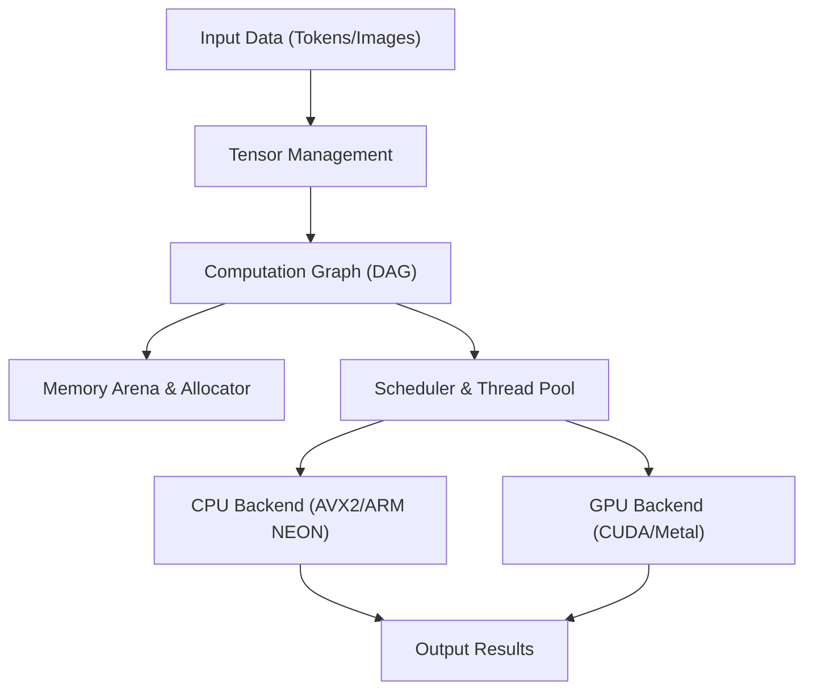
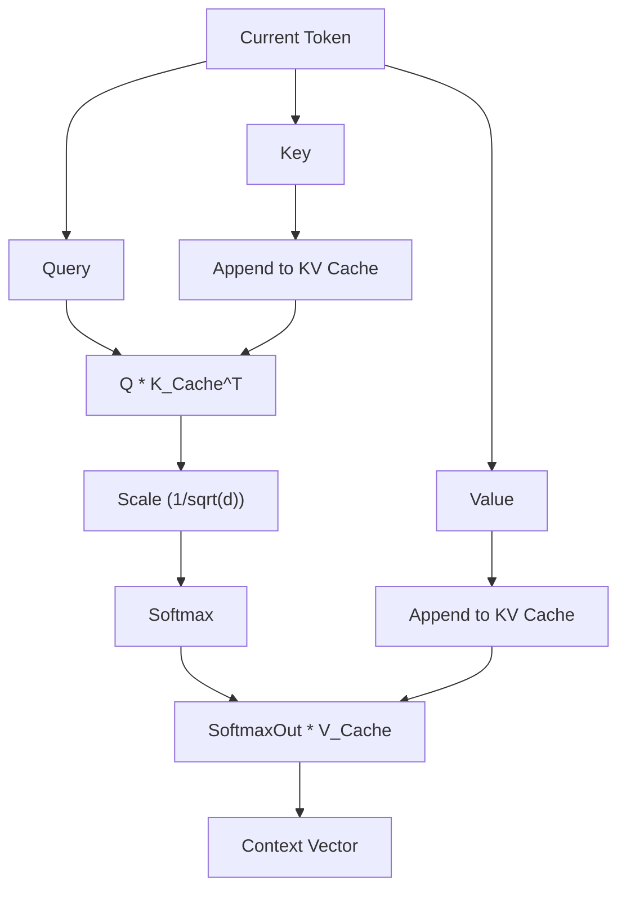

## 1. Introduction: Why let go of Python and build an AI inference engine in C++?

In modern AI development, Python is the de facto standard. Thanks to powerful frameworks like PyTorch and TensorFlow, complex neural networks can be built, trained, and inferred with just a few lines of code. However, behind these frameworks, low-level languages like C++ and CUDA handle the heavy computational processing. Python is merely acting as the "glue".

So why bother eliminating Python and creating an AI inference engine exclusively in C++? There are several compelling reasons.

1. **Extreme Performance and Low Latency**: You can completely eliminate the overhead of Python's GIL (Global Interpreter Lock) and dynamic typing. Especially in systems requiring real-time performance, delays on the millisecond scale can be fatal.
2. **Ease of Deployment**: Building a Python environment (massive library ecosystems, dependency hell) on the end user's system is extremely difficult. With C++, you only need to distribute a single statically linked executable binary (`.exe` or ELF binary).
3. **Edge Device Support**: In highly resource-constrained environments like smartphones, embedded devices, and Raspberry Pi, there is no luxury to run a Python runtime that consumes gigabytes of memory.
4. **Direct Hardware Control**: Low-level control such as memory allocation timing, explicit use of SIMD instructions, and optimization of memory transfers with the GPU is possible with C++.

In this article, while drawing massive inspiration from the architecture of the "GGML" library developed by Georgi Gerganov, we will dive deep into the technical abyss and explain the process of building an inference engine from scratch using only C++ to run Large Language Models (LLMs).

---

## 2. Overview of the Inference Engine Architecture

AI inference processing is essentially a "series of massive matrix calculations". To execute this efficiently, an inference engine needs to be composed of the following components.



1. **Tensor Management**: Manages multidimensional array data structures and strides for each dimension.
2. **Computation Graph**: Represents the operations of each layer in the neural network as a Directed Acyclic Graph (DAG).
3. **Memory Arena**: A pre-allocated memory management mechanism to avoid the overhead of dynamic memory allocation (`malloc` or `new`).
4. **Backend**: Operations (kernels) optimized for specific hardware such as CPUs and GPUs.

We will assemble these using the powerful features of C++ (templates, pointer arithmetic, RAII, etc.).

---

## 3. The Secret of Memory Management: Memory Arena and SIMD Alignment

Memory management in an inference engine is one of the most critical factors directly linked to performance. During inference, especially as data passes through each layer of a Transformer model, a massive number of intermediate tensors are generated. If you allocate and free these with standard `malloc` every time, heap fragmentation and OS context switches will cause a fatal slowdown.

Therefore, we adopt an approach called the "**Memory Arena**". This is a method where the maximum amount of memory required is calculated (or fixed) and allocated at once when inference begins, and memory is carved out simply by incrementing a pointer.

### 3.1 The Importance of Alignment

Modern CPUs support SIMD (Single Instruction, Multiple Data) instructions. Examples include AVX2/AVX-512 for Intel/AMD and NEON for ARM. These instructions process 256 bits (32 bytes) or 512 bits (64 bytes) of data at once, but the target data memory must be aligned to specific byte boundaries (usually 32 bytes or 64 bytes).

Below is an example of a C++ implementation of a memory arena that considers alignment.

```cpp
#include <cstdint>
#include <cstddef>
#include <stdexcept>
#include <iostream>

struct MemoryArena {
    size_t size;
    size_t offset;
    uint8_t* data;

    MemoryArena(size_t size) : size(size), offset(0) {
        // Use posix_memalign for POSIX systems, _aligned_malloc for Windows
#ifdef _WIN32
        data = static_cast<uint8_t*>(_aligned_malloc(size, 64));
#else
        if (posix_memalign(reinterpret_cast<void**>(&data), 64, size) != 0) {
            throw std::bad_alloc();
        }
#endif
    }

    ~MemoryArena() {
#ifdef _WIN32
        _aligned_free(data);
#else
        free(data);
#endif
    }

    void* allocate(size_t bytes, size_t alignment = 64) {
        // Calculate alignment (find padding)
        size_t pad = (alignment - (offset % alignment)) % alignment;
        if (offset + pad + bytes > size) {
            throw std::runtime_error("OOM: MemoryArena out of memory");
        }
        offset += pad;
        void* ptr = data + offset;
        offset += bytes;
        return ptr;
    }
    
    void reset() {
        offset = 0; // Freeing memory is just resetting the pointer (O(1))
    }
};
```

In this way, when creating tensors, memory is always obtained through this arena. By simply calling `reset()` every time an inference step (such as token generation) is completed, memory can be reused instantly.

---

## 4. Tensor Data Structures and the Magic of Strides

A tensor is a generalized concept of scalars, vectors, and matrices. What is important in the implementation is that while the actual data is laid out as a **one-dimensional contiguous array** in memory, it has a concept called "Stride" to interpret it as multidimensional.

```cpp
enum class DataType {
    FP32,
    FP16,
    INT8,  // For quantization
    INT4   // For quantization
};

struct Tensor {
    int n_dims;           // Number of dimensions
    int64_t ne[4];        // Number of elements in each dimension (Number of Elements)
    size_t nb[4];         // Stride in each dimension (Number of Bytes)
    DataType type;        // Data type
    void* data;           // Pointer to payload
    
    // For computation graph
    enum OpType op;
    Tensor* src0;
    Tensor* src1;
};
```

The stride `nb[i]` represents the byte distance in memory between adjacent elements in dimension `i`.
For example, if a matrix of size $M \times N$ (FP32, 4 bytes per element) is stored in Row-Major order, the strides would be:
- `nb[0]` = 4 (bytes) : Movement along the column direction
- `nb[1]` = $N \times 4$ (bytes) : Movement along the row direction

By utilizing this, operations such as "Transpose" and "View" can be achieved without memory copying, simply by swapping the stride values. It is very elegant and fast.

---

## 5. Building the Computation Graph (DAG) and Lazy Evaluation

Similar to PyTorch, our inference engine also adopts Lazy Evaluation, close to "Define-by-Run". That is, at the time the operation function is called, the calculation is not performed; only the graph (dependencies between nodes) is built.

```cpp
Tensor* tensor_add(MemoryArena& arena, Tensor* a, Tensor* b) {
    Tensor* out = create_tensor(arena, a->type, a->n_dims, a->ne);
    out->op = OpType::ADD;
    out->src0 = a;
    out->src1 = b;
    return out;
}

Tensor* tensor_mul_mat(MemoryArena& arena, Tensor* a, Tensor* b) {
    // b is often transposed
    int64_t ne[2] = { a->ne[0], b->ne[1] };
    Tensor* out = create_tensor(arena, a->type, 2, ne);
    out->op = OpType::MUL_MAT;
    out->src0 = a;
    out->src1 = b;
    return out;
}
```

The flow of inference processing is as follows.


When evaluating the graph (forward pass), it uses topological sorting to execute nodes in order, starting from those without dependencies. Since we only do inference, there is no need to retain gradients for backpropagation, making memory management extremely simple.

---

## 6. The Core of Math and Optimization: General Matrix Multiply (GEMM)

Over 90% of the computational cost of AI inference is spent on General Matrix Multiply (GEMM). Both the attention mechanism and the feed-forward network (FFN), which are the core of the Transformer model, are ultimately massive matrix multiplications.

The product $C = A B$ (size $M \times N$) of two matrices $A$ (size $M \times K$) and $B$ (size $K \times N$) is expressed by the following formula.

$$
C_{i,j} = \sum_{k=0}^{K-1} A_{i,k} \cdot B_{k,j}
$$

If this is implemented with a naive triple loop, cache misses will occur frequently, and no performance will be achieved.

### 6.1 Cache Blocking and SIMD Optimization on CPU

The basic strategies for speeding up GEMM on a CPU are as follows.
1. **Loop Tiling (Cache Blocking)**: Divide matrices into smaller blocks that fit in the L1/L2 cache for computation.
2. **Data Packing**: Rearrange data internally so that memory access patterns become contiguous.
3. **Utilizing SIMD**: Use FMA (Fused Multiply-Add) instructions like `_mm512_fmadd_ps` in AVX-512 to perform many multiply-add operations in a single clock cycle.

Here is an example of a simplified vector dot product using C++ and SIMD Intrinsics.

```cpp
#include <immintrin.h> // For AVX instructions

// Fast dot product for FP32 using AVX2
float dot_product_avx2(const float* a, const float* b, int n) {
    __m256 sum256 = _mm256_setzero_ps();
    int i = 0;
    
    // Process 8 elements at a time (256 bits = 32 bytes = 8 * 4 bytes)
    for (; i <= n - 8; i += 8) {
        __m256 va = _mm256_loadu_ps(a + i);
        __m256 vb = _mm256_loadu_ps(b + i);
        // FMA instruction: sum256 = va * vb + sum256
        sum256 = _mm256_fmadd_ps(va, vb, sum256);
    }
    
    // Horizontally add the values in the SIMD register
    float result[8];
    _mm256_storeu_ps(result, sum256);
    float dot = result[0] + result[1] + result[2] + result[3] + 
                result[4] + result[5] + result[6] + result[7];
                
    // Process the remainder
    for (; i < n; ++i) {
        dot += a[i] * b[i];
    }
    return dot;
}
```

Just this small tweak can yield a speed improvement of several to dozens of times compared to a naive implementation.

---

## 7. Crossing Hardware Boundaries: Integrating CUDA and Metal Backends

While pure C++ implementations alone run reasonably well on CPUs, the parallel computing power of GPUs is indispensable to run massive models like LLMs at practical speeds (e.g., generating more than 20 tokens per second). Thus, we introduce a backend abstraction layer to our engine.

### 7.1 Backend Abstraction

Using C++ polymorphism, we make it possible to switch the computation executor.

```cpp
class Backend {
public:
    virtual ~Backend() = default;
    virtual void alloc_buffer(Tensor* t) = 0;
    virtual void free_buffer(Tensor* t) = 0;
    virtual void copy_to_device(Tensor* t) = 0;
    virtual void copy_to_host(Tensor* t) = 0;
    
    // Execution of various operations
    virtual void compute_add(Tensor* src0, Tensor* src1, Tensor* dst) = 0;
    virtual void compute_mul_mat(Tensor* src0, Tensor* src1, Tensor* dst) = 0;
};
```

### 7.2 Implementing the NVIDIA CUDA Backend

To leverage NVIDIA GPUs, we implement the backend using CUDA C++ extensions. While writing custom kernels is possible, for matrix multiplication, the best approach is to utilize "cuBLAS", the premier library provided by NVIDIA.

```cpp
#include <cublas_v2.h>
#include <cuda_runtime.h>

class CUDABackend : public Backend {
private:
    cublasHandle_t handle;
    
public:
    CUDABackend() {
        cublasCreate(&handle);
    }
    
    ~CUDABackend() {
        cublasDestroy(handle);
    }
    
    void compute_mul_mat(Tensor* src0, Tensor* src1, Tensor* dst) override {
        // Since CUDA is Column-Major by default, parameters require care
        const float alpha = 1.0f;
        const float beta = 0.0f;
        
        int m = src0->ne[0];
        int k = src0->ne[1];
        int n = src1->ne[1]; // Assuming src1 is transposed
        
        cublasSgemm(handle, CUBLAS_OP_T, CUBLAS_OP_N,
                    m, n, k,
                    &alpha,
                    (const float*)src0->data, k,
                    (const float*)src1->data, k,
                    &beta,
                    (float*)dst->data, m);
        cudaDeviceSynchronize();
    }
};
```
Data transfer (`cudaMemcpy`) between CUDA memory and host (CPU) memory is very heavy, so it is crucial to design the system to retain all weights (weight tensors) and intermediate tensors on VRAM as much as possible during inference.

### 7.3 Apple Silicon (Metal) Backend

In recent years, Mac's M1/M2/M3 chips (Apple Silicon) have become highly excellent as AI inference machines. The reason for this lies in "Unified Memory". Because the CPU and GPU share the same memory region, the high-cost host-to-device memory transfers via the PCIe bus, as seen in CUDA mentioned above, become completely unnecessary.

To call Metal from C++, we use Objective-C++ (`.mm` files) as a bridge, or use the `metal-cpp` library.
We write kernels using Metal's Compute Shaders (written in a C++-like manner in `.metal` files).

```cpp
// Metal shader (kernel.metal)
#include <metal_stdlib>
using namespace metal;

kernel void mul_mat_kernel(
    device const float* A [[buffer(0)]],
    device const float* B [[buffer(1)]],
    device float* C [[buffer(2)]],
    constant uint3& dims [[buffer(3)]],
    uint2 gid [[thread_position_in_grid]]
) {
    uint m = dims.x; uint k = dims.y; uint n = dims.z;
    uint row = gid.y; uint col = gid.x;
    
    if (row < m && col < n) {
        float sum = 0.0;
        for (uint i = 0; i < k; ++i) {
            sum += A[row * k + i] * B[i * n + col]; // Simplified
        }
        C[row * n + col] = sum;
    }
}
```

In the Apple Silicon environment, an optimized library for matrix multiplication called MPS (Metal Performance Shaders) is also provided, so by utilizing this in production, you can achieve astonishing inference speeds.

---

## 8. Transformer Model Specific Processing: Attention and KV Cache

State-of-the-art LLMs such as LLaMA 2/3 and GPT are based on the Transformer architecture. To implement this in C++, it is essential to construct "Scaled Dot-Product Attention," represented by the following formula.

$$
\text{Attention}(Q, K, V) = \text{softmax}\left(\frac{QK^T}{\sqrt{d_k}}\right)V
$$

Also, in autoregressive token generation, the calculation results of past tokens (Key and Value) must be retained. This is called the "**KV Cache (Key-Value Cache)**".



For memory allocation of the KV Cache, a ring buffer-like operation is used, pre-allocating memory space for the maximum context length (e.g., 4096 or 8192 tokens) in the arena in advance. This prevents reallocation at every generation step.

In addition, we implement "RoPE (Rotary Position Embedding)," which has become mainstream in recent years, for positional encoding. This is a method of embedding position information as rotation vectors in complex space, and optimizing the calling of `sin` and `cos` functions in C++ (such as using lookup tables) is key to performance.

---

## 9. Extreme Optimization via Model Quantization

If you load a large-scale model (e.g., a 7 Billion parameter LLaMA model) in FP32 (32-bit floating-point), it will consume about 28GB of memory (VRAM) just for weights. If you include the KV cache and inference buffers, it easily exceeds 30GB, making it impossible to run on typical consumer GPUs.

This is where "**Quantization**" becomes essential. It is also the true worth of the GGML format.

Quantization is the technique of intentionally reducing the precision of weights.
- **FP16 (16-bit)**: Size halved. Almost no precision degradation.
- **INT8 (8-bit)**: Size 1/4. Slight degradation.
- **INT4 (4-bit)**: Size 1/8. Practical inference is possible by using proprietary blocking and scaling factors.

On the inference engine side, weights compressed in INT4 (or INT8) are read from memory, and **immediately after being loaded into the CPU or GPU registers, they are expanded (Dequantized) to FP16 or FP32 for computation**.

Surprisingly, it is faster to reduce the amount of data read from memory, even if it means increasing the amount of computation. This is because on modern hardware, the bottleneck for inference tasks is not "Compute Bound" but "**Memory Bandwidth Bound**". With a C++ engine implementing INT4 quantization, it becomes possible to run local LLMs smoothly even on a MacBook Air with 8GB VRAM.

---

## 10. Performance Tuning: NUMA Architecture and Thread Pools

When performing inference using a CPU, multi-threading is essential. However, simply launching many `std::thread` instances is not optimal.

Modern multi-socket servers and high-end CPUs like Ryzen Threadripper employ **NUMA (Non-Uniform Memory Access)** architecture. Access to memory physically close to a certain CPU core (local memory) is fast, but access to memory tied to another processor becomes extremely slow.

Advanced C++ inference engines utilize the following techniques.
1. **Thread Pinning**: Fix each thread to a specific CPU core (set Affinity) to prevent cache invalidation due to context switches.
2. **NUMA-aware Allocation**: Allocate memory on the same NUMA node as the thread processing the data.
3. **Work-stealing Thread Pool**: Implement an efficient scheduler that divides each node of the computation graph into fine-grained tasks, and idle threads automatically steal and execute tasks.

By fully utilizing these, you can keep CPU utilization glued near 100% and strike throughput close to theoretical limits.

---

## 11. Conclusion: The Joy of Driving AI with C++ "Muscle"

Python is certainly convenient. In research and development or prototyping, no language can match its productivity. However, the moment you transition to the phase of "running the completed model efficiently on any device in the real world", it is time for C++ to shine.

The sense of accomplishment you get when you see an inference engine—built by directly manipulating byte arrays in memory, pushing registers to their limits with SIMD instructions, and wrestling with GPU VRAM bandwidth—generating natural Japanese text (tokens) one after another on the console, is a "pure joy as an engineer" that you can never obtain simply by calling `model.generate()` in a Python framework.

AI technology tends to be a "Black Box", but by writing everything by hand in C++, from tensor operations to memory allocation, you can deeply understand the true mechanisms of how LLMs "think".

If you have a basic knowledge of C++ and a strong interest in current AI technology, please try taking on the challenge of developing your own inference engine. The source codes of GGML and llama.cpp should serve as the best living textbooks.

**Now, throw away the heavy runtime of Python, and let's run cutting-edge AI with the muscle of C++!**
