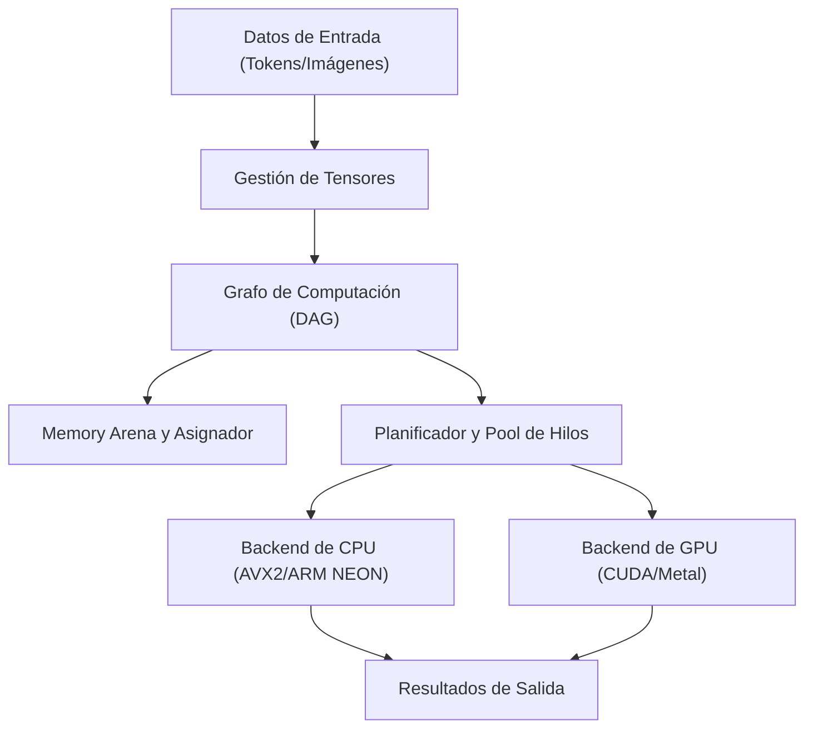
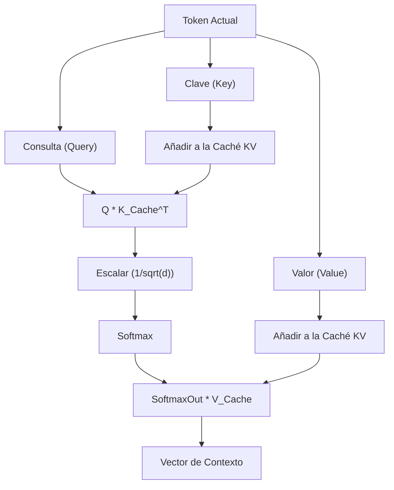

## 1. Introducción: ¿Por qué dejar Python y crear un motor de inferencia de IA en C++?

En el desarrollo de IA moderno, Python es el estándar de facto. Gracias a la ventaja de frameworks potentes como PyTorch o TensorFlow, puedes construir, entrenar e inferir redes neuronales complejas con unas pocas líneas de código. Sin embargo, detrás de estos frameworks, lenguajes de bajo nivel como C++ y CUDA se encargan del procesamiento computacional pesado. Python simplemente juega el papel de "pegamento" (glue).

Entonces, ¿por qué molestarse en eliminar Python y crear un motor de inferencia de IA usando únicamente C++? Hay varias razones de peso para ello.

1. **Rendimiento extremo y baja latencia**: Puedes eliminar por completo la sobrecarga causada por el GIL (Global Interpreter Lock) de Python y su tipado dinámico. Especialmente en sistemas que requieren tiempo real, un retraso de milisegundos puede ser fatal.
2. **Facilidad de implementación (Deployment)**: Construir un entorno de Python (una enorme colección de bibliotecas, un infierno de dependencias) en el entorno del usuario final es extremadamente difícil. Con C++, solo necesitas distribuir un único binario ejecutable enlazado estáticamente (un `.exe` o binario ELF).
3. **Compatibilidad con dispositivos Edge**: En entornos con recursos estrictamente limitados, como teléfonos inteligentes, dispositivos integrados o Raspberry Pi, no hay margen para ejecutar un entorno de ejecución de Python que consume varios gigabytes de memoria.
4. **Control directo del hardware**: C++ permite el control a bajo nivel, como la temporización de la asignación de memoria, el uso explícito de instrucciones SIMD y la optimización de las transferencias de memoria con la GPU.

En este artículo, basándome en gran medida en la arquitectura de la biblioteca "GGML" desarrollada por Georgi Gerganov, explicaré el proceso de construir desde cero un motor de inferencia para ejecutar modelos de lenguaje grande (LLM) usando solo C++, sumergiéndonos en las profundidades técnicas.

---

## 2. Visión general de la arquitectura del motor de inferencia

El procesamiento de inferencia de IA es esencialmente una "sucesión de enormes cálculos matriciales". Para ejecutar esto de manera eficiente, un motor de inferencia debe estar compuesto por los siguientes componentes.



1. **Gestión de Tensores (Tensor)**: Gestiona las estructuras de datos de matrices multidimensionales y el stride de cada dimensión.
2. **Grafo de Computación (Computation Graph)**: Representa las operaciones de cada capa de la red neuronal como un Grafo Acíclico Dirigido (DAG).
3. **Memory Arena (Arena de Memoria)**: Un mecanismo de gestión de memoria preasignada para evitar la sobrecarga de la asignación de memoria dinámica (`malloc` o `new`).
4. **Backend**: Implementaciones de cálculos (kernels) optimizadas para hardware específico, como CPU o GPU.

Ensamblaremos estos componentes utilizando las poderosas características de C++ (plantillas, aritmética de punteros, RAII, etc.).

---

## 3. El secreto de la gestión de memoria: Memory Arena y Alineación SIMD

La gestión de memoria en un motor de inferencia es uno de los factores más importantes directamente relacionados con el rendimiento. Durante la inferencia, especialmente al pasar a través de cada capa de un modelo Transformer, se genera una enorme cantidad de tensores intermedios. Si se asignan y liberan cada vez con el `malloc` estándar, la fragmentación del montón (heap) y los cambios de contexto del sistema operativo causarán caídas drásticas y fatales en la velocidad.

Por lo tanto, adoptamos el enfoque de un "**Memory Arena**". Este es un método en el que se calcula (o se fija) y se asigna de una sola vez la cantidad máxima de memoria necesaria al inicio de la inferencia, y luego la memoria se extrae simplemente incrementando un puntero.

### 3.1 La importancia de la alineación

Las CPU modernas admiten instrucciones SIMD (Single Instruction, Multiple Data). Ejemplos son AVX2/AVX-512 de Intel/AMD y NEON de ARM. Estas instrucciones procesan datos de 256 bits (32 bytes) o 512 bits (64 bytes) a la vez, pero la memoria de datos objetivo debe estar alineada (alineación) a un límite de bytes específico (generalmente 32 o 64 bytes).

A continuación se muestra un ejemplo de implementación en C++ de un Memory Arena considerando la alineación.

```cpp
#include <cstdint>
#include <cstddef>
#include <stdexcept>
#include <iostream>

struct MemoryArena {
    size_t size;
    size_t offset;
    uint8_t* data;

    MemoryArena(size_t size) : size(size), offset(0) {
        // Usa posix_memalign en sistemas POSIX, o _aligned_malloc en Windows
#ifdef _WIN32
        data = static_cast<uint8_t*>(_aligned_malloc(size, 64));
#else
        if (posix_memalign(reinterpret_cast<void**>(&data), 64, size) != 0) {
            throw std::bad_alloc();
        }
#endif
    }

    ~MemoryArena() {
#ifdef _WIN32
        _aligned_free(data);
#else
        free(data);
#endif
    }

    void* allocate(size_t bytes, size_t alignment = 64) {
        // Cálculo de alineación (buscar el padding)
        size_t pad = (alignment - (offset % alignment)) % alignment;
        if (offset + pad + bytes > size) {
            throw std::runtime_error("OOM: MemoryArena se quedó sin memoria");
        }
        offset += pad;
        void* ptr = data + offset;
        offset += bytes;
        return ptr;
    }
    
    void reset() {
        offset = 0; // Liberar memoria es tan simple como reiniciar el puntero (O(1))
    }
};
```

De esta manera, al crear un tensor, siempre se obtiene memoria a través de esta arena. Al final de cada paso de inferencia (por ejemplo, después de generar un token), simplemente llamando a `reset()`, la memoria se puede reutilizar instantáneamente.

---

## 4. Estructura de datos de tensores y la magia de los Strides

Un tensor es un concepto que generaliza escalares, vectores y matrices. Lo importante en la implementación es que, mientras los datos reales se ubican en la memoria como un **arreglo unidimensional contiguo**, tiene el concepto de un "Stride" para interpretarlo como multidimensional.

```cpp
enum class DataType {
    FP32,
    FP16,
    INT8,  // Para cuantización
    INT4   // Para cuantización
};

struct Tensor {
    int n_dims;           // Número de dimensiones
    int64_t ne[4];        // Número de elementos en cada dimensión (Number of Elements)
    size_t nb[4];         // Stride en cada dimensión (Number of Bytes)
    DataType type;        // Tipo de dato
    void* data;           // Puntero al payload
    
    // Para el grafo de computación
    enum OpType op;
    Tensor* src0;
    Tensor* src1;
};
```

El stride `nb[i]` representa la distancia en bytes en la memoria entre elementos adyacentes en la dimensión `i`.
Por ejemplo, si una matriz con un número de elementos $M \times N$ (FP32, 4 bytes por elemento) se almacena en orden Row-Major (prioridad de fila), los strides serían los siguientes:
- `nb[0]` = 4 (bytes)  : Movimiento en dirección de las columnas
- `nb[1]` = $N \times 4$ (bytes) : Movimiento en dirección de las filas

Aprovechando esto, puedes lograr operaciones como "Transposición (Transpose)" y "Vista (View)" simplemente intercambiando los valores de los strides, sin implicar copias de memoria. Es sumamente elegante y rápido.

---

## 5. Construcción del Grafo de Computación (DAG) y Evaluación Perezosa

Al igual que PyTorch, nuestro motor de inferencia también adopta una Evaluación Perezosa (Lazy Evaluation), similar a "Define-by-Run". Es decir, cuando se llama a una función de cálculo, no realiza el cálculo en ese momento, sino que solo construye un grafo (dependencias entre nodos).

```cpp
Tensor* tensor_add(MemoryArena& arena, Tensor* a, Tensor* b) {
    Tensor* out = create_tensor(arena, a->type, a->n_dims, a->ne);
    out->op = OpType::ADD;
    out->src0 = a;
    out->src1 = b;
    return out;
}

Tensor* tensor_mul_mat(MemoryArena& arena, Tensor* a, Tensor* b) {
    // b a menudo está transpuesta
    int64_t ne[2] = { a->ne[0], b->ne[1] };
    Tensor* out = create_tensor(arena, a->type, 2, ne);
    out->op = OpType::MUL_MAT;
    out->src0 = a;
    out->src1 = b;
    return out;
}
```

El flujo del proceso de inferencia es el siguiente.


Al evaluar el grafo (forward pass), se utiliza el ordenamiento topológico para procesar los nodos en orden comenzando por aquellos sin dependencias. Si es solo inferencia, no es necesario mantener gradientes para backpropagation, por lo que la gestión de memoria es muy sencilla.

---

## 6. El núcleo de las matemáticas y la optimización: Producto de Matrices (GEMM)

Más del 90% de la carga computacional de la inferencia de IA se gasta en la multiplicación general de matrices (GEMM: General Matrix Multiply). Tanto el mecanismo de atención, que es el núcleo del modelo Transformer, como las redes feed-forward (FFN), son en última instancia enormes multiplicaciones de matrices.

El producto $C = A B$ (de tamaño $M \times N$) de dos matrices $A$ (tamaño $M \times K$) y $B$ (tamaño $K \times N$) se expresa matemáticamente de la siguiente manera.

$$
C_{i,j} = \sum_{k=0}^{K-1} A_{i,k} \cdot B_{k,j}
$$

Si se implementa ingenuamente usando un triple bucle, habrá frecuentes fallos de caché y no se logrará rendimiento.

### 6.1 Bloqueo de caché y optimización SIMD en la CPU

La estrategia básica para acelerar GEMM en la CPU es la siguiente:
1. **Loop Tiling (Bloqueo de Caché)**: Divide las matrices en pequeños bloques que caben en las cachés L1/L2 para el cálculo.
2. **Empaquetado de Datos**: Reorganiza internamente los datos para que el patrón de acceso a la memoria sea contiguo.
3. **Uso de SIMD**: Usa comandos FMA (Fused Multiply-Add) como `_mm512_fmadd_ps` en AVX-512, manejando múltiples cálculos de multiplicación y suma en un solo ciclo de reloj.

A continuación se muestra un ejemplo de un Producto Punto (Dot Product) de vectores simplificado, utilizando C++ y SIMD Intrinsics.

```cpp
#include <immintrin.h> // Para instrucciones AVX

// Producto punto rápido FP32 usando AVX2
float dot_product_avx2(const float* a, const float* b, int n) {
    __m256 sum256 = _mm256_setzero_ps();
    int i = 0;
    
    // Procesar 8 elementos a la vez (256 bits = 32 bytes = 8 * 4 bytes)
    for (; i <= n - 8; i += 8) {
        __m256 va = _mm256_loadu_ps(a + i);
        __m256 vb = _mm256_loadu_ps(b + i);
        // Instrucción FMA: sum256 = va * vb + sum256
        sum256 = _mm256_fmadd_ps(va, vb, sum256);
    }
    
    // Suma horizontal de los valores en el registro SIMD
    float result[8];
    _mm256_storeu_ps(result, sum256);
    float dot = result[0] + result[1] + result[2] + result[3] + 
                result[4] + result[5] + result[6] + result[7];
                
    // Procesamiento del resto
    for (; i < n; ++i) {
        dot += a[i] * b[i];
    }
    return dot;
}
```

Incluso con este pequeño ajuste, puedes obtener un aumento de velocidad de varias a decenas de veces en comparación con una implementación ingenua.

---

## 7. Superando la barrera del hardware: Integración de Backends CUDA y Metal

Aunque solo con la implementación pura en C++ funcionará de manera decente en la CPU, para ejecutar modelos enormes como LLMs a una velocidad práctica (por ejemplo: generar 20 tokens o más por segundo), la capacidad de cálculo en paralelo de la GPU es indispensable. Por lo tanto, introducimos una capa de abstracción de backend en nuestro motor.

### 7.1 Abstracción del Backend

Usamos el polimorfismo de C++ para permitir el intercambio del ejecutor (Executor) de las operaciones.

```cpp
class Backend {
public:
    virtual ~Backend() = default;
    virtual void alloc_buffer(Tensor* t) = 0;
    virtual void free_buffer(Tensor* t) = 0;
    virtual void copy_to_device(Tensor* t) = 0;
    virtual void copy_to_host(Tensor* t) = 0;
    
    // Ejecución de diversas operaciones
    virtual void compute_add(Tensor* src0, Tensor* src1, Tensor* dst) = 0;
    virtual void compute_mul_mat(Tensor* src0, Tensor* src1, Tensor* dst) = 0;
};
```

### 7.2 Implementación del Backend de NVIDIA CUDA

Para aprovechar la GPU de NVIDIA, implementamos un backend usando la extensión C++ de CUDA. Aunque es posible escribir tus propios kernels, para la multiplicación de matrices, la mejor opción es usar "cuBLAS", la mejor biblioteca proporcionada por NVIDIA.

```cpp
#include <cublas_v2.h>
#include <cuda_runtime.h>

class CUDABackend : public Backend {
private:
    cublasHandle_t handle;
    
public:
    CUDABackend() {
        cublasCreate(&handle);
    }
    
    ~CUDABackend() {
        cublasDestroy(handle);
    }
    
    void compute_mul_mat(Tensor* src0, Tensor* src1, Tensor* dst) override {
        // En CUDA, el orden por defecto es Column-Major, por lo que hay que tener cuidado con los parámetros
        const float alpha = 1.0f;
        const float beta = 0.0f;
        
        int m = src0->ne[0];
        int k = src0->ne[1];
        int n = src1->ne[1]; // Se asume que src1 está transpuesta
        
        cublasSgemm(handle, CUBLAS_OP_T, CUBLAS_OP_N,
                    m, n, k,
                    &alpha,
                    (const float*)src0->data, k,
                    (const float*)src1->data, k,
                    &beta,
                    (float*)dst->data, m);
        cudaDeviceSynchronize();
    }
};
```
Como las transferencias de datos (`cudaMemcpy`) entre la memoria de CUDA y la del host (CPU) son muy costosas, es vital diseñar un sistema que mantenga todos los pesos y tensores intermedios en la VRAM el mayor tiempo posible durante la inferencia.

### 7.3 Backend de Apple Silicon (Metal)

Recientemente, los chips M1/M2/M3 (Apple Silicon) de Mac son excelentes máquinas de inferencia de IA. La razón radica en su "Memoria Unificada". Como la CPU y la GPU comparten la misma área de memoria, las transferencias de memoria de alto costo entre el host y el dispositivo a través de un bus PCIe, como en el caso de CUDA mencionado antes, son completamente innecesarias.

Para llamar a Metal desde C++, se usa Objective-C++ (archivos `.mm`) como puente, o la biblioteca `metal-cpp`.
Escribiremos el kernel usando Compute Shaders de Metal (descrito en un archivo `.metal` de forma similar a C++).

```cpp
// Shader de Metal (kernel.metal)
#include <metal_stdlib>
using namespace metal;

kernel void mul_mat_kernel(
    device const float* A [[buffer(0)]],
    device const float* B [[buffer(1)]],
    device float* C [[buffer(2)]],
    constant uint3& dims [[buffer(3)]],
    uint2 gid [[thread_position_in_grid]]
) {
    uint m = dims.x; uint k = dims.y; uint n = dims.z;
    uint row = gid.y; uint col = gid.x;
    
    if (row < m && col < n) {
        float sum = 0.0;
        for (uint i = 0; i < k; ++i) {
            sum += A[row * k + i] * B[i * n + col]; // Simplificado
        }
        C[row * n + col] = sum;
    }
}
```

En el entorno de Apple Silicon, también se proporciona una biblioteca optimizada para multiplicación de matrices llamada MPS (Metal Performance Shaders), por lo que usarla en un entorno de producción puede lograr velocidades de inferencia asombrosas.

---

## 8. Procesamiento específico del modelo Transformer: Attention y Caché KV

Los LLM de vanguardia, como LLaMA 2/3 y GPT, se basan en la arquitectura Transformer. Para implementar esto en C++, la construcción del "Scaled Dot-Product Attention" expresado en la siguiente fórmula es indispensable.

$$
\text{Attention}(Q, K, V) = \text{softmax}\left(\frac{QK^T}{\sqrt{d_k}}\right)V
$$

Además, en la generación de tokens autorregresiva (Autoregressive), es necesario mantener los resultados de cálculos de los tokens pasados (Key y Value). Esto se denomina "**Caché KV (Key-Value Cache)**".



Para asignar memoria de la caché KV, asignamos en la arena de memoria por adelantado espacio suficiente para la longitud máxima de contexto (por ejemplo, 4096 u 8192 tokens) y lo operamos como un búfer circular (ring buffer). Esto evita las reasignaciones en cada paso de generación.

También, implementamos para la Codificación Posicional (Positional Encoding) el método "RoPE (Rotary Position Embedding)" que es el principal estándar reciente. Este es un método para incrustar información de posición como un vector de rotación en el espacio complejo, y la optimización de las llamadas a las funciones `sin` y `cos` en C++ (por ejemplo, mediante el uso de tablas de búsqueda) es clave para el rendimiento.

---

## 9. Optimización extrema mediante Cuantización de Modelos (Quantization)

Si cargas un modelo de gran escala (por ejemplo, un modelo LLaMA de 7 mil millones de parámetros) en FP32 (punto flotante de 32 bits), consumirá aproximadamente 28 GB de memoria (VRAM) solo para sus pesos. Además, al incluir la caché KV y los buffers de inferencia, puede sobrepasar fácilmente los 30 GB, haciendo que sea imposible de ejecutar en una GPU convencional de consumo.

Aquí es donde entra en juego la "**Cuantización (Quantization)**". También es el verdadero valor del formato GGML.

La cuantización es una técnica que reduce intencionalmente la precisión de los pesos.
- **FP16 (16-bit)**: Reduce el tamaño a la mitad. Casi sin pérdida de precisión.
- **INT8 (8-bit)**: Un cuarto del tamaño. Pérdida menor de precisión.
- **INT4 (4-bit)**: Un octavo del tamaño. Usando técnicas propias de bloqueo y factores de escala, es posible hacer inferencias prácticas.

En el lado del motor de inferencia, se leen los pesos comprimidos como INT4 (o INT8) de la memoria, y **justo después de cargarlos en los registros de la CPU o GPU, se descomprimen (Dequantize) a FP16 o FP32 para realizar los cálculos**.

Sorprendentemente, resulta más rápido reducir la cantidad de datos que se leen desde la memoria, incluso si esto significa aumentar la cantidad de cálculos. Esto se debe a que, en el hardware moderno, el cuello de botella de la tarea de inferencia no es la "Capacidad de Cálculo (Compute Bound)" sino el "**Ancho de Banda de la Memoria (Memory Bandwidth Bound)**". Con un motor implementado en C++ utilizando la cuantización INT4, es posible ejecutar localmente LLMs de manera fluida incluso en dispositivos como un MacBook Air con 8 GB de RAM unificada.

---

## 10. Ajuste de rendimiento: Arquitectura NUMA y Pool de Hilos

Cuando se realiza inferencia utilizando la CPU, el multiprocesamiento (multithreading) es obligatorio. Sin embargo, no es óptimo simplemente instanciar y lanzar muchas `std::thread`.

En los servidores multisocket modernos o en las CPU de gama alta como los Ryzen Threadripper, se adopta la arquitectura **NUMA (Non-Uniform Memory Access)**. Acceder a la memoria que está físicamente cerca de un determinado núcleo de CPU (memoria local) es rápido, pero acceder a la memoria vinculada a otro procesador es extremadamente lento.

En un motor de inferencia avanzado en C++, se utilizan las siguientes técnicas:
1. **Thread Pinning**: Se fija cada hilo a un núcleo de CPU específico (configuración de Affinity) para evitar la pérdida de caché debido a los cambios de contexto.
2. **Asignación consciente de NUMA**: Asegura la memoria en el mismo nodo NUMA donde se encuentra el hilo que procesará los datos.
3. **Pool de Hilos con Work-Stealing**: Implementa un planificador eficiente que divide cada nodo del grafo de computación en pequeñas tareas, de manera que los hilos inactivos roben automáticamente tareas de otros para ejecutarlas.

Al dominar esto, es posible mantener el uso de la CPU pegado a cerca del 100% y lograr un rendimiento cercano al máximo teórico.

---

## 11. Conclusión: El placer de impulsar la IA con el "músculo" de C++

Python, sin duda, es conveniente. En investigación, desarrollo o creación de prototipos, no hay lenguaje que se le iguale en productividad. Sin embargo, en el momento en que se pasa a la fase de "hacer que el modelo ya construido funcione en el mundo real, de manera eficiente, en cualquier dispositivo", es ahí donde C++ brilla.

Manipular los bytes de memoria directamente, presionar los registros al límite con instrucciones SIMD, luchar contra el ancho de banda de la VRAM de la GPU y ver cómo el motor de inferencia que has creado escupe textos (tokens) en un español natural en la consola, otorga un sentido de logro y una "alegría pura como ingeniero" que jamás obtendrías al solo llamar a `model.generate()` en un framework de Python.

Aunque la tecnología de la IA a menudo se considera una "Caja Negra" (Black Box), el simple hecho de programar cada detalle con tus propias manos en C++, desde los cálculos de tensores hasta la asignación de la memoria, te permite comprender profundamente los verdaderos mecanismos detrás de cómo los LLMs "piensan".

Si tienes conocimientos básicos de C++ y un fuerte interés en la tecnología de IA actual, definitivamente deberías intentar construir tu propio motor de inferencia desde cero. El código fuente de GGML o llama.cpp será el mejor libro de texto en vivo que puedas tener.

**¡Vamos, deshazte del pesado entorno de ejecución de Python y ejecuta la IA de vanguardia con los músculos de C++!**
