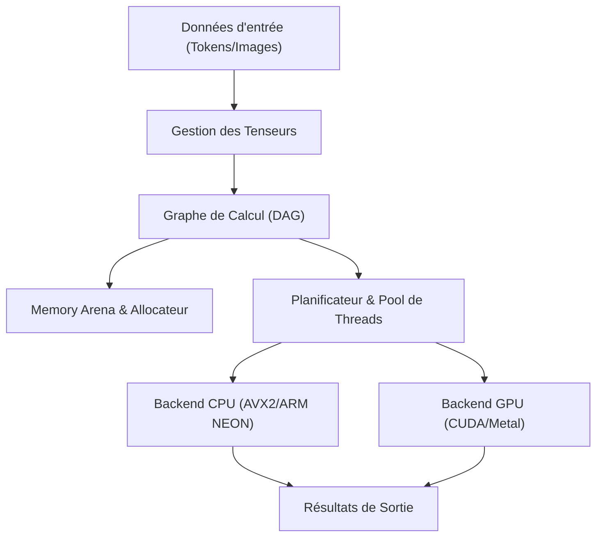
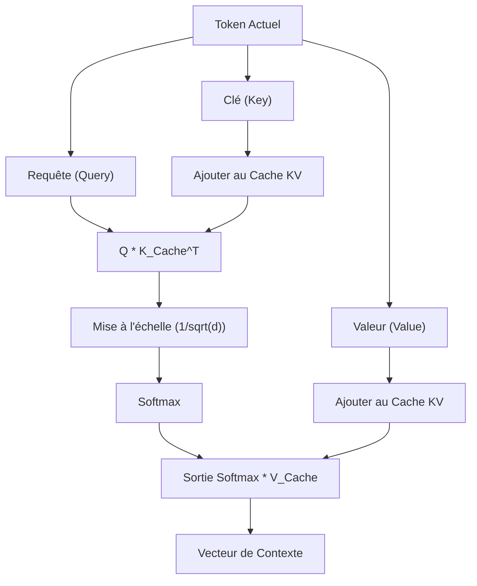

## 1. Introduction : Pourquoi abandonner Python et créer un moteur d'inférence d'IA en C++ ?

Dans le développement moderne de l'IA, Python est le standard de facto. Grâce à des frameworks puissants tels que PyTorch et TensorFlow, il est possible de construire, d'entraîner et d'inférer des réseaux de neurones complexes en quelques lignes de code. Cependant, derrière ces frameworks, des langages de bas niveau comme le C++ et CUDA gèrent les opérations de calcul lourdes. Python ne sert finalement que de « colle » (glue).

Alors, pourquoi s'embêter à exclure Python et à créer un moteur d'inférence d'IA uniquement en C++ ? Il y a plusieurs raisons fortes à cela.

1. **Performances extrêmes et faible latence** : Vous pouvez complètement éliminer les surcoûts liés au GIL (Global Interpreter Lock) de Python et au typage dynamique. Particulièrement dans les systèmes nécessitant un temps réel, un délai de quelques millisecondes peut être fatal.
2. **Facilité de déploiement** : Il est très difficile de configurer un environnement Python (avec d'énormes bibliothèques et l'enfer des dépendances) sur la machine de l'utilisateur final. Avec C++, il vous suffit de distribuer un seul exécutable binaire lié statiquement (un `.exe` ou un binaire ELF).
3. **Prise en charge des périphériques Edge** : Dans des environnements aux ressources très limitées comme les smartphones, les systèmes embarqués ou le Raspberry Pi, il n'y a pas la marge pour exécuter un runtime Python consommant plusieurs gigaoctets de mémoire.
4. **Contrôle direct du matériel** : C++ permet un contrôle de bas niveau tel que le moment de l'allocation de la mémoire, l'utilisation explicite d'instructions SIMD et l'optimisation des transferts de mémoire avec le GPU.

Dans cet article, fortement inspirés par l'architecture de la bibliothèque « GGML » développée par Georgi Gerganov, nous plongerons dans les profondeurs techniques pour expliquer le processus de construction à partir de zéro d'un moteur d'inférence permettant d'exécuter de grands modèles de langage (LLM) uniquement avec du C++.

---

## 2. Vue d'ensemble de l'architecture du moteur d'inférence

Le processus d'inférence de l'IA est essentiellement une « série continue d'énormes calculs matriciels ». Afin d'exécuter cela efficacement, un moteur d'inférence doit être composé des éléments suivants.



1. **Gestion des Tenseurs (Tensor Management)** : Gère la structure de données des tableaux multidimensionnels et le pas (Stride) pour chaque dimension.
2. **Graphe de Calcul (Computation Graph)** : Représente les opérations de chaque couche du réseau de neurones sous la forme d'un graphe orienté acyclique (DAG).
3. **Memory Arena** : Un mécanisme de gestion de mémoire pré-allouée pour éviter le surcoût de l'allocation dynamique de mémoire (`malloc` ou `new`).
4. **Backend** : Implémentations d'opérations (kernels) optimisées pour un matériel spécifique, tel que CPU ou GPU.

Nous allons assembler tout cela en utilisant les puissantes fonctionnalités du C++ (templates, arithmétique de pointeurs, RAII, etc.).

---

## 3. Le secret de la gestion de la mémoire : Memory Arena et alignement SIMD

La gestion de la mémoire dans un moteur d'inférence est l'un des éléments les plus critiques, directement lié aux performances. Lors de l'inférence, en particulier lors du passage à travers chaque couche d'un modèle Transformer, un nombre massif de tenseurs intermédiaires est généré. Si vous allouez et libérez cela avec un `malloc` standard à chaque fois, la fragmentation du tas et les changements de contexte de l'OS entraîneront des baisses de vitesse fatales.

C'est pourquoi nous adoptons l'approche du « **Memory Arena** ». Il s'agit d'une méthode où la quantité maximale de mémoire requise est calculée (ou fixée) et allouée en une seule fois au début de l'inférence, puis la mémoire est découpée en incrémentant simplement un pointeur.

### 3.1 L'importance de l'alignement

Les processeurs modernes prennent en charge les instructions SIMD (Single Instruction, Multiple Data). Il s'agit d'AVX2/AVX-512 pour Intel/AMD et de NEON pour ARM. Ces instructions traitent des données de 256 bits (32 octets) ou de 512 bits (64 octets) à la fois, mais la mémoire de données traitée doit être alignée sur une limite d'octets spécifique (généralement 32 octets ou 64 octets).

Voici un exemple d'implémentation C++ d'un Memory Arena qui prend en compte l'alignement.

```cpp
#include <cstdint>
#include <cstddef>
#include <stdexcept>
#include <iostream>

struct MemoryArena {
    size_t size;
    size_t offset;
    uint8_t* data;

    MemoryArena(size_t size) : size(size), offset(0) {
        // Utilise posix_memalign pour POSIX et _aligned_malloc pour Windows
#ifdef _WIN32
        data = static_cast<uint8_t*>(_aligned_malloc(size, 64));
#else
        if (posix_memalign(reinterpret_cast<void**>(&data), 64, size) != 0) {
            throw std::bad_alloc();
        }
#endif
    }

    ~MemoryArena() {
#ifdef _WIN32
        _aligned_free(data);
#else
        free(data);
#endif
    }

    void* allocate(size_t bytes, size_t alignment = 64) {
        // Calcul de l'alignement (trouver le padding)
        size_t pad = (alignment - (offset % alignment)) % alignment;
        if (offset + pad + bytes > size) {
            throw std::runtime_error("OOM: MemoryArena out of memory");
        }
        offset += pad;
        void* ptr = data + offset;
        offset += bytes;
        return ptr;
    }
    
    void reset() {
        offset = 0; // La libération de mémoire consiste simplement à réinitialiser le pointeur (O(1))
    }
};
```

Ainsi, lors de la création d'un tenseur, la mémoire est toujours obtenue via cette arena. À la fin de chaque étape d'inférence (comme la génération d'un token), il suffit d'appeler `reset()` pour réutiliser instantanément la mémoire.

---

## 4. Structures de données des Tenseurs et la magie du Stride

Un tenseur est un concept qui généralise un scalaire, un vecteur et une matrice. Ce qui est important dans l'implémentation, c'est que bien que les données réelles soient disposées en mémoire comme un **tableau continu unidimensionnel**, elles possèdent le concept de « Stride » (pas) pour être interprétées de manière multidimensionnelle.

```cpp
enum class DataType {
    FP32,
    FP16,
    INT8,  // Pour la quantification
    INT4   // Pour la quantification
};

struct Tensor {
    int n_dims;           // Nombre de dimensions
    int64_t ne[4];        // Nombre d'éléments par dimension (Number of Elements)
    size_t nb[4];         // Stride pour chaque dimension en octets (Number of Bytes)
    DataType type;        // Type de données
    void* data;           // Pointeur vers la charge utile (payload)
    
    // Pour le graphe de calcul
    enum OpType op;
    Tensor* src0;
    Tensor* src1;
};
```

Le stride `nb[i]` représente la distance en octets en mémoire entre des éléments adjacents dans la dimension `i`.
Par exemple, si une matrice de $M \times N$ éléments (FP32, 4 octets par élément) est stockée en Row-Major (priorité aux lignes), le stride sera le suivant :
- `nb[0]` = 4 (octets) : Déplacement dans le sens des colonnes
- `nb[1]` = $N \times 4$ (octets) : Déplacement dans le sens des lignes

En utilisant cela, des opérations telles que « Transposer » (Transpose) ou la création de « Vues » (View) peuvent être réalisées simplement en échangeant les valeurs du stride, sans impliquer de copie de mémoire. C'est très élégant et rapide.

---

## 5. Construction du Graphe de Calcul (DAG) et Évaluation Paresseuse

À l'instar de PyTorch et d'autres, notre moteur d'inférence adopte également une évaluation paresseuse (Lazy Evaluation) proche du « Define-by-Run ». Autrement dit, le calcul n'est pas effectué au moment où la fonction d'opération est appelée ; seul le graphe (les dépendances entre les nœuds) est construit.

```cpp
Tensor* tensor_add(MemoryArena& arena, Tensor* a, Tensor* b) {
    Tensor* out = create_tensor(arena, a->type, a->n_dims, a->ne);
    out->op = OpType::ADD;
    out->src0 = a;
    out->src1 = b;
    return out;
}

Tensor* tensor_mul_mat(MemoryArena& arena, Tensor* a, Tensor* b) {
    // b est souvent transposé
    int64_t ne[2] = { a->ne[0], b->ne[1] };
    Tensor* out = create_tensor(arena, a->type, 2, ne);
    out->op = OpType::MUL_MAT;
    out->src0 = a;
    out->src1 = b;
    return out;
}
```

Le flux du processus d'inférence est le suivant :


Lors de l'évaluation du graphe (passage avant ou Forward Pass), le tri topologique est utilisé pour exécuter les nœuds dans l'ordre, à partir de ceux qui n'ont aucune dépendance. S'il s'agit uniquement d'inférence, la gestion de la mémoire est extrêmement simple car il n'est pas nécessaire de conserver les gradients pour la rétropropagation (Backpropagation).

---

## 6. Le cœur des mathématiques et de l'optimisation : Produit Matriciel (GEMM)

Plus de 90 % de la charge de calcul de l'inférence d'IA est consacrée à la multiplication matricielle (GEMM : General Matrix Multiply). Qu'il s'agisse du mécanisme d'attention, qui est le cœur des modèles Transformer, ou des réseaux feed-forward (FFN), tout se résume à d'énormes produits matriciels.

Le produit $C = A B$ (taille $M \times N$) de deux matrices $A$ (taille $M \times K$) et $B$ (taille $K \times N$) est exprimé mathématiquement comme suit :

$$
C_{i,j} = \sum_{k=0}^{K-1} A_{i,k} \cdot B_{k,j}
$$

Si vous implémentez cela de manière naïve avec une triple boucle, les défauts de cache (cache misses) seront fréquents et les performances seront médiocres.

### 6.1 Blocage de cache (Cache Blocking) sur le CPU et optimisation SIMD

La strategy de base pour accélérer GEMM sur le CPU est la suivante :
1. **Tiling de boucle (Blocage de cache)** : Divisez la matrice en petits blocs qui tiennent dans le cache L1/L2 et effectuez les calculs.
2. **Emballage des données (Packing)** : Réorganisez les données en interne de sorte que le modèle d'accès à la mémoire soit continu.
3. **Utilisation de SIMD** : Utilisez des instructions FMA (Fused Multiply-Add) comme `_mm512_fmadd_ps` dans AVX-512 pour effectuer de nombreuses opérations de multiplication-addition en un seul cycle d'horloge.

Voici un exemple simplifié de produit scalaire vectoriel (Dot Product) utilisant des intrinsèques C++ et SIMD.

```cpp
#include <immintrin.h> // Pour les instructions AVX

// Produit scalaire rapide pour FP32 en utilisant AVX2
float dot_product_avx2(const float* a, const float* b, int n) {
    __m256 sum256 = _mm256_setzero_ps();
    int i = 0;
    
    // Traitement de 8 éléments à la fois (256 bits = 32 octets = 8 * 4 octets)
    for (; i <= n - 8; i += 8) {
        __m256 va = _mm256_loadu_ps(a + i);
        __m256 vb = _mm256_loadu_ps(b + i);
        // Instruction FMA : sum256 = va * vb + sum256
        sum256 = _mm256_fmadd_ps(va, vb, sum256);
    }
    
    // Addition horizontale des valeurs dans le registre SIMD
    float result[8];
    _mm256_storeu_ps(result, sum256);
    float dot = result[0] + result[1] + result[2] + result[3] + 
                result[4] + result[5] + result[6] + result[7];
                
    // Traitement du reste
    for (; i < n; ++i) {
        dot += a[i] * b[i];
    }
    return dot;
}
```

Même avec cette petite amélioration, vous pouvez obtenir une vitesse plusieurs fois à des dizaines de fois supérieure à celle d'une implémentation naïve.

---

## 7. Franchir le mur matériel : Intégration des backends CUDA et Metal

Une implémentation purement C++ fonctionnera raisonnablement bien sur un CPU, mais pour exécuter des modèles gigantesques comme les LLM à des vitesses pratiques (par exemple, générer plus de 20 tokens par seconde), la puissance de calcul parallèle d'un GPU est indispensable. Par conséquent, nous introduisons une couche d'abstraction de backend dans notre moteur.

### 7.1 Abstraction du Backend

En utilisant le polymorphisme C++, nous permettons de changer l'exécuteur (Executor) des opérations.

```cpp
class Backend {
public:
    virtual ~Backend() = default;
    virtual void alloc_buffer(Tensor* t) = 0;
    virtual void free_buffer(Tensor* t) = 0;
    virtual void copy_to_device(Tensor* t) = 0;
    virtual void copy_to_host(Tensor* t) = 0;
    
    // Exécution de diverses opérations
    virtual void compute_add(Tensor* src0, Tensor* src1, Tensor* dst) = 0;
    virtual void compute_mul_mat(Tensor* src0, Tensor* src1, Tensor* dst) = 0;
};
```

### 7.2 Implémentation du backend NVIDIA CUDA

Pour exploiter les GPU NVIDIA, nous implémentons un backend en utilisant les extensions CUDA C++. Bien qu'il soit possible d'écrire vos propres kernels, il est préférable d'utiliser « cuBLAS » pour la multiplication matricielle, car c'est la bibliothèque la plus performante fournie par NVIDIA.

```cpp
#include <cublas_v2.h>
#include <cuda_runtime.h>

class CUDABackend : public Backend {
private:
    cublasHandle_t handle;
    
public:
    CUDABackend() {
        cublasCreate(&handle);
    }
    
    ~CUDABackend() {
        cublasDestroy(handle);
    }
    
    void compute_mul_mat(Tensor* src0, Tensor* src1, Tensor* dst) override {
        // Dans CUDA, la valeur par défaut est Column-Major, il faut donc faire attention aux paramètres
        const float alpha = 1.0f;
        const float beta = 0.0f;
        
        int m = src0->ne[0];
        int k = src0->ne[1];
        int n = src1->ne[1]; // En supposant que src1 est transposé
        
        cublasSgemm(handle, CUBLAS_OP_T, CUBLAS_OP_N,
                    m, n, k,
                    &alpha,
                    (const float*)src0->data, k,
                    (const float*)src1->data, k,
                    &beta,
                    (float*)dst->data, m);
        cudaDeviceSynchronize();
    }
};
```
Le transfert de données (`cudaMemcpy`) entre la mémoire CUDA et la mémoire hôte (CPU) est très lourd, il est donc essentiel de concevoir le système pour conserver autant que possible tous les poids (tenseurs de poids) et les tenseurs intermédiaires dans la VRAM pendant l'inférence.

### 7.3 Backend Apple Silicon (Metal)

Ces dernières années, les puces M1/M2/M3 (Apple Silicon) pour Mac sont devenues excellentes en tant que machines d'inférence d'IA. La raison en est la « mémoire unifiée ». Puisque le CPU et le GPU partagent la même zone mémoire, les transferts de mémoire coûteux entre l'hôte et le périphérique via le bus PCIe, comme avec CUDA mentionné précédemment, sont complètement inutiles.

Pour appeler Metal depuis C++, vous pouvez utiliser l'Objective-C++ (fichiers `.mm`) comme pont, ou utiliser la bibliothèque `metal-cpp`.
Nous utiliserons des Compute Shaders de Metal (écrits dans un style proche du C++ dans des fichiers `.metal`) pour écrire nos kernels.

```cpp
// Shader Metal (kernel.metal)
#include <metal_stdlib>
using namespace metal;

kernel void mul_mat_kernel(
    device const float* A [[buffer(0)]],
    device const float* B [[buffer(1)]],
    device float* C [[buffer(2)]],
    constant uint3& dims [[buffer(3)]],
    uint2 gid [[thread_position_in_grid]]
) {
    uint m = dims.x; uint k = dims.y; uint n = dims.z;
    uint row = gid.y; uint col = gid.x;
    
    if (row < m && col < n) {
        float sum = 0.0;
        for (uint i = 0; i < k; ++i) {
            sum += A[row * k + i] * B[i * n + col]; // Simplification
        }
        C[row * n + col] = sum;
    }
}
```

Dans l'environnement Apple Silicon, une bibliothèque d'optimisation appelée MPS (Metal Performance Shaders) est également fournie pour la multiplication matricielle. En l'utilisant en production, vous pouvez atteindre des vitesses d'inférence stupéfiantes.

---

## 8. Traitement spécifique aux modèles Transformer : Attention et cache KV

Les LLM de pointe tels que LLaMA 2/3 et GPT sont basés sur l'architecture Transformer. Afin de l'implémenter en C++, il est indispensable de construire la « Scaled Dot-Product Attention » représentée par la formule suivante.

$$
\text{Attention}(Q, K, V) = \text{softmax}\left(\frac{QK^T}{\sqrt{d_k}}\right)V
$$

De plus, lors de la génération de tokens de type autorégressif (Autoregressive), il est nécessaire de conserver les résultats calculés des tokens passés (Key et Value). C'est ce qu'on appelle le « **Cache KV (Key-Value Cache)** ».



L'allocation de mémoire pour le cache KV est également effectuée à l'avance dans l'arena pour la longueur maximale du contexte (par exemple, 4096 ou 8192 tokens), fonctionnant comme un buffer circulaire. Cela évite les réallocations à chaque étape de génération.

En outre, pour le codage de position (Positional Encoding), nous implémentons le « RoPE (Rotary Position Embedding) », qui est devenu la norme ces dernières années. Il s'agit d'une méthode pour intégrer les informations de position en tant que vecteur de rotation dans un espace complexe. L'optimisation des appels aux fonctions `sin` et `cos` en C++ (comme l'utilisation de tables de recherche - Lookup Tables) est la clé des performances.

---

## 9. Optimisation extrême grâce à la quantification (Quantization) des modèles

Si vous chargez un grand modèle (par exemple, un modèle LLaMA à 7 milliards de paramètres) tel quel en FP32 (virgule flottante 32 bits), les poids seuls consommeront environ 28 Go de mémoire (VRAM). Si vous incluez le cache KV et les buffers d'inférence, cela dépasse facilement les 30 Go, ce qui le rend impossible à exécuter sur un GPU grand public typique.

C'est là que la « **Quantification (Quantization)** » devient indispensable. C'est également la véritable force du format GGML.

La quantification est une technique permettant de réduire intentionnellement la précision des poids.
- **FP16 (16 bits)** : Réduit la taille de moitié. Presque aucune dégradation de précision.
- **INT8 (8 bits)** : Réduit la taille au quart. Légère dégradation.
- **INT4 (4 bits)** : Réduit la taille au huitième. L'utilisation de facteurs de blocage et de mise à l'échelle personnalisés permet une inférence pratique.

Du côté du moteur d'inférence, il lit les poids compressés en INT4 (ou INT8) depuis la mémoire et **les étend (Dequantize) en FP16 ou FP32 juste après les avoir chargés dans les registres du CPU ou du GPU pour effectuer les calculs**.

Étonnamment, il est plus rapide de réduire la quantité de données lues depuis la mémoire, même si cela augmente la quantité de calcul. En effet, sur le matériel moderne, le goulot d'étranglement pour les tâches d'inférence n'est pas la « puissance de calcul (Compute Bound) » mais la « **Bande Passante Mémoire (Memory Bandwidth Bound)** ». Avec un moteur implémenté en C++ et doté d'une quantification INT4, il est possible de faire tourner fluidement un LLM local même sur un MacBook Air avec 8 Go de VRAM.

---

## 10. Réglage des performances : Architecture NUMA et Pool de Threads

Lors de l'inférence sur CPU, le multithreading est indispensable. Cependant, le simple lancement de nombreux `std::thread` n'est pas optimal.

Dans les serveurs multi-sockets modernes et les CPU haut de gamme comme les Ryzen Threadripper, l'architecture **NUMA (Non-Uniform Memory Access)** est adoptée. L'accès à la mémoire physiquement proche d'un certain cœur de processeur (mémoire locale) est rapide, mais l'accès à la mémoire associée à un autre processeur devient extrêmement lent.

Les moteurs d'inférence C++ avancés utilisent les techniques suivantes :
1. **Épinglage de threads (Thread Pinning)** : Fixer (définir l'Affinité) chaque thread à un cœur CPU spécifique pour éviter l'invalidation du cache causée par les changements de contexte.
2. **Allocation sensible à l'architecture NUMA** : Allouer la mémoire sur le même nœud NUMA que le thread qui traite les données.
3. **Pool de threads avec Work-Stealing** : Implémenter un planificateur (scheduler) efficace où chaque nœud du graphe de calcul est divisé en tâches plus fines, et les threads inactifs s'emparent automatiquement des tâches à exécuter.

En tirant parti de ces techniques, vous pouvez maintenir l'utilisation du CPU à près de 100 % et atteindre un débit (throughput) proche du maximum théorique.

---

## 11. Conclusion : Le plaisir de piloter l'IA avec les « muscles » du C++

Python est certes pratique. En matière de recherche et développement et de prototypage, aucun langage ne peut l'égaler en productivité. Cependant, dès que vous passez à la phase de « faire fonctionner le modèle terminé dans le monde réel, efficacement, et sur n'importe quel appareil », c'est là que le C++ entre en jeu.

Manipuler directement les tableaux d'octets en mémoire, pousser les registres à la limite avec les instructions SIMD, lutter avec la bande passante de la VRAM du GPU, tout cela pour construire un moteur d'inférence qui génère tour à tour du texte naturel (tokens) sur la console... Le sentiment d'accomplissement que vous ressentez à ce moment-là procure une « pure joie d'ingénieur » que vous ne pourrez jamais obtenir en appelant simplement `model.generate()` dans un framework Python.

La technologie de l'IA a tendance à être une « Boîte Noire », mais en écrivant tout vous-même en C++, des opérations sur les tenseurs à l'allocation de mémoire, vous pouvez comprendre en profondeur le véritable mécanisme par lequel les LLM « pensent ».

Si vous avez des connaissances de base en C++ et un fort intérêt pour la technologie de l'IA actuelle, je vous encourage vivement à relever le défi de développer votre propre moteur d'inférence. Le code source de GGML et llama.cpp constitueront sans doute les meilleurs manuels vivants.

**Maintenant, abandonnons le lourd runtime de Python et faisons tourner l'IA de pointe grâce aux muscles du C++ !**
