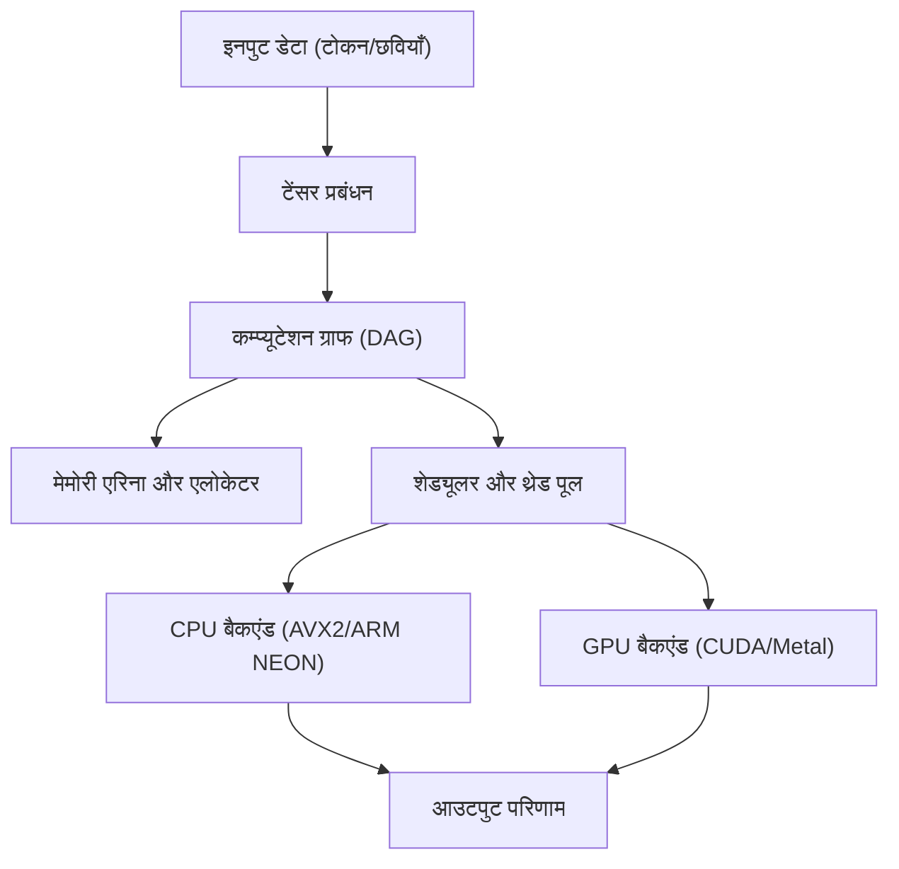
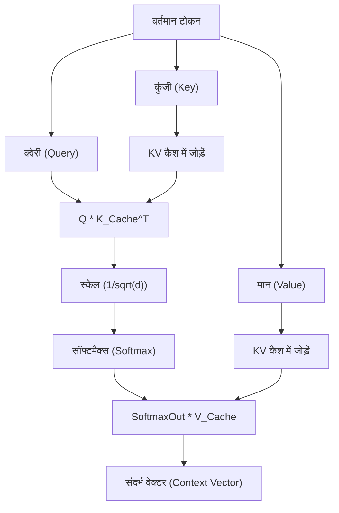

## 1. परिचय: पायथन को छोड़कर केवल C++ से AI इन्फेरेंस इंजन क्यों बनाएं?

आधुनिक AI विकास में, पायथन एक डे-फैक्टो मानक है। PyTorch और TensorFlow जैसे शक्तिशाली फ्रेमवर्क की बदौलत, आप कोड की कुछ पंक्तियों के साथ जटिल न्यूरल नेटवर्क बना, प्रशिक्षित और अनुमान लगा सकते हैं। हालाँकि, इन फ्रेमवर्क के पीछे, C++ और CUDA जैसी निम्न-स्तरीय भाषाएँ भारी गणना प्रसंस्करण को संभालती हैं। पायथन केवल एक "गोंद (glue)" की भूमिका निभाता है।

तो, पायथन को हटाकर केवल C++ के साथ AI इन्फेरेंस इंजन बनाने की क्या आवश्यकता है? इसके कई मजबूत कारण हैं।

1. **अत्यधिक प्रदर्शन और कम लेटेंसी (Extreme Performance and Low Latency)**: पायथन के GIL (Global Interpreter Lock) और डायनेमिक टाइपिंग के ओवरहेड को पूरी तरह से समाप्त किया जा सकता है। विशेष रूप से उन प्रणालियों में जहां रीयल-टाइम प्रदर्शन आवश्यक है, मिलीसेकंड की देरी भी घातक हो सकती है।
2. **परिनियोजन में आसानी (Ease of Deployment)**: अंतिम-उपयोगकर्ता के वातावरण में पायथन वातावरण (विशाल लाइब्रेरी, निर्भरताओं का जाल) स्थापित करना बहुत कठिन है। C++ के साथ, आपको केवल एक स्टैटिकली लिंक्ड सिंगल एग्जीक्यूटेबल बाइनरी (`.exe` या ELF बाइनरी) वितरित करने की आवश्यकता होती है।
3. **एज डिवाइस के लिए समर्थन (Edge Device Support)**: स्मार्टफोन, एम्बेडेड डिवाइस और रास्पबेरी पाई (Raspberry Pi) जैसे सीमित संसाधनों वाले वातावरण में, कई गीगाबाइट मेमोरी की खपत करने वाले पायथन रनटाइम को चलाने की कोई गुंजाइश नहीं है।
4. **हार्डवेयर का सीधा नियंत्रण (Direct Hardware Control)**: निम्न-स्तरीय नियंत्रण, जैसे मेमोरी आवंटन का समय, SIMD निर्देशों का स्पष्ट उपयोग, और GPU के साथ मेमोरी ट्रांसफर का अनुकूलन, C++ के साथ संभव है।

इस लेख में, हम Georgi Gerganov द्वारा विकसित "GGML" लाइब्रेरी के आर्किटेक्चर से काफी प्रेरणा लेते हुए, लार्ज लैंग्वेज मॉडल (LLM) आदि को चलाने के लिए स्क्रैच से केवल C++ का उपयोग करके एक इन्फेरेंस इंजन बनाने की प्रक्रिया को तकनीकी गहराई तक जाकर समझाएंगे।

---

## 2. इन्फेरेंस इंजन आर्किटेक्चर का समग्र दृष्टिकोण

AI इन्फेरेंस प्रक्रिया, अनिवार्य रूप से, "विशाल मैट्रिक्स गणनाओं की एक श्रृंखला" है। इसे कुशलतापूर्वक निष्पादित करने के लिए, एक इन्फेरेंस इंजन में निम्नलिखित घटक होने चाहिए।



1. **टेंसर (Tensor) प्रबंधन**: बहुआयामी सरणी डेटा संरचना और प्रत्येक आयाम के लिए स्ट्राइड (Stride) का प्रबंधन।
2. **कम्प्यूटेशन ग्राफ (Computation Graph)**: न्यूरल नेटवर्क की प्रत्येक परत के संचालन को एक निर्देशित चक्रीय ग्राफ (Directed Acyclic Graph - DAG) के रूप में दर्शाना।
3. **मेमोरी एरिना (Memory Arena)**: गतिशील मेमोरी आवंटन (`malloc` या `new`) के ओवरहेड से बचने के लिए एक पूर्व-आवंटित मेमोरी प्रबंधन तंत्र।
4. **बैकएंड (Backend)**: विशिष्ट हार्डवेयर, जैसे CPU या GPU (कर्नेल) के लिए अनुकूलित संचालन का कार्यान्वयन।

हम इन्हें C++ की शक्तिशाली विशेषताओं (टेम्पलेट, पॉइंटर अरिथमेटिक, RAII, आदि) का उपयोग करके एक साथ जोड़ेंगे।

---

## 3. मेमोरी प्रबंधन का रहस्य: मेमोरी एरिना और SIMD अलाइनमेंट

इन्फेरेंस इंजन में मेमोरी प्रबंधन सबसे महत्वपूर्ण कारकों में से एक है जो सीधे प्रदर्शन को प्रभावित करता है। अनुमान के दौरान, विशेष रूप से जब ट्रांसफॉर्मर मॉडल की प्रत्येक परत से गुजरते हैं, तो भारी मात्रा में मध्यवर्ती टेंसर उत्पन्न होते हैं। यदि हर बार इन्हें मानक `malloc` के साथ आवंटित और मुक्त किया जाता है, तो हीप फ्रैग्मेंटेशन और OS कॉन्टेक्स्ट स्विच के कारण गति में भारी गिरावट आएगी।

इसलिए, हम "**मेमोरी एरिना (Memory Arena)**" दृष्टिकोण अपनाते हैं। यह एक ऐसी तकनीक है जहां अनुमान की शुरुआत में आवश्यक अधिकतम मेमोरी की गणना (या निर्धारण) की जाती है और एक ही बार में आवंटित की जाती है, और मेमोरी को केवल पॉइंटर को बढ़ाकर (increment) निकाला जाता है।

### 3.1 अलाइनमेंट का महत्व

आधुनिक CPU, SIMD (Single Instruction, Multiple Data) निर्देशों का समर्थन करते हैं। उदाहरण के लिए Intel/AMD का AVX2/AVX-512 और ARM का NEON। ये निर्देश एक ही बार में 256 बिट्स (32 बाइट्स) या 512 बिट्स (64 बाइट्स) डेटा संसाधित करते हैं, लेकिन संसाधित की जाने वाली डेटा मेमोरी को एक विशिष्ट बाइट सीमा (आमतौर पर 32 बाइट्स या 64 बाइट्स) पर अलाइन (align) होना चाहिए।

नीचे अलाइनमेंट को ध्यान में रखते हुए मेमोरी एरिना का C++ कार्यान्वयन उदाहरण दिया गया है।

```cpp
#include <cstdint>
#include <cstddef>
#include <stdexcept>
#include <iostream>

struct MemoryArena {
    size_t size;
    size_t offset;
    uint8_t* data;

    MemoryArena(size_t size) : size(size), offset(0) {
        // POSIX सिस्टम के लिए posix_memalign, Windows के लिए _aligned_malloc का उपयोग करें
#ifdef _WIN32
        data = static_cast<uint8_t*>(_aligned_malloc(size, 64));
#else
        if (posix_memalign(reinterpret_cast<void**>(&data), 64, size) != 0) {
            throw std::bad_alloc();
        }
#endif
    }

    ~MemoryArena() {
#ifdef _WIN32
        _aligned_free(data);
#else
        free(data);
#endif
    }

    void* allocate(size_t bytes, size_t alignment = 64) {
        // अलाइनमेंट की गणना (पैडिंग ज्ञात करना)
        size_t pad = (alignment - (offset % alignment)) % alignment;
        if (offset + pad + bytes > size) {
            throw std::runtime_error("OOM: MemoryArena out of memory");
        }
        offset += pad;
        void* ptr = data + offset;
        offset += bytes;
        return ptr;
    }
    
    void reset() {
        offset = 0; // मेमोरी मुक्त करने के लिए बस पॉइंटर को रीसेट करें (O(1))
    }
};
```

इस प्रकार, टेंसर बनाते समय हम हमेशा इस एरिना के माध्यम से मेमोरी प्राप्त करते हैं। अनुमान के प्रत्येक चरण (जैसे प्रत्येक टोकन जनरेशन) के समाप्त होने पर बस `reset()` कॉल करके, हम तुरंत मेमोरी का पुन: उपयोग कर सकते हैं।

---

## 4. टेंसर डेटा संरचना और स्ट्राइड का जादू

टेंसर स्केलर, वेक्टर और मैट्रिक्स की एक सामान्यीकृत अवधारणा है। कार्यान्वयन में जो महत्वपूर्ण है वह यह है कि वास्तविक डेटा को मेमोरी में **1-आयामी सन्निहित सरणी (contiguous array)** के रूप में रखा जाता है, जबकि इसे बहुआयामी रूप में व्याख्या करने के लिए "स्ट्राइड (Stride)" की अवधारणा होती है।

```cpp
enum class DataType {
    FP32,
    FP16,
    INT8,  // क्वांटिज़ेशन के लिए
    INT4   // क्वांटिज़ेशन के लिए
};

struct Tensor {
    int n_dims;           // आयामों की संख्या
    int64_t ne[4];        // प्रत्येक आयाम में तत्वों की संख्या (Number of Elements)
    size_t nb[4];         // प्रत्येक आयाम के लिए स्ट्राइड (Number of Bytes)
    DataType type;        // डेटा प्रकार
    void* data;           // पेलोड के लिए पॉइंटर
    
    // कम्प्यूटेशन ग्राफ के लिए
    enum OpType op;
    Tensor* src0;
    Tensor* src1;
};
```

स्ट्राइड `nb[i]` आयाम `i` में आसन्न तत्वों के बीच मेमोरी में बाइट दूरी को दर्शाता है।
उदाहरण के लिए, यदि $M \times N$ तत्वों का एक मैट्रिक्स (FP32, 1 तत्व 4 बाइट्स) Row-Major (पंक्ति-प्रमुख) में संग्रहीत किया गया है, तो स्ट्राइड इस प्रकार होगा:
- `nb[0]` = 4 (बाइट्स)  : कॉलम दिशा में गति
- `nb[1]` = $N \times 4$ (बाइट्स) : पंक्ति दिशा में गति

इसका उपयोग करके, "ट्रांसपोज़ (Transpose)" और "व्यू (View)" जैसे संचालन, मेमोरी कॉपी के बिना, केवल स्ट्राइड मानों को स्वैप करके प्राप्त किए जा सकते हैं। यह बहुत ही सुरुचिपूर्ण और तेज़ है।

---

## 5. कम्प्यूटेशन ग्राफ (DAG) का निर्माण और लेज़ी इवैल्यूएशन

PyTorch आदि के समान, हमारा इन्फेरेंस इंजन भी "Define-by-Run" के करीब एक लेज़ी इवैल्यूएशन (Lazy Evaluation) को अपनाता है। यानी, जब गणितीय फलन को बुलाया जाता है तो गणना नहीं की जाती है, बल्कि केवल ग्राफ (नोड्स के बीच निर्भरता) बनाया जाता है।

```cpp
Tensor* tensor_add(MemoryArena& arena, Tensor* a, Tensor* b) {
    Tensor* out = create_tensor(arena, a->type, a->n_dims, a->ne);
    out->op = OpType::ADD;
    out->src0 = a;
    out->src1 = b;
    return out;
}

Tensor* tensor_mul_mat(MemoryArena& arena, Tensor* a, Tensor* b) {
    // b अक्सर ट्रांसपोज़ किया हुआ होता है
    int64_t ne[2] = { a->ne[0], b->ne[1] };
    Tensor* out = create_tensor(arena, a->type, 2, ne);
    out->op = OpType::MUL_MAT;
    out->src0 = a;
    out->src1 = b;
    return out;
}
```

इन्फेरेंस प्रक्रिया का प्रवाह इस प्रकार है:


ग्राफ का मूल्यांकन करते समय (फॉरवर्ड पास), टोपोलॉजिकल सॉर्ट का उपयोग उन नोड्स को संसाधित करने के लिए किया जाता है जिनमें कोई निर्भरता नहीं है। यदि यह केवल इन्फेरेंस के लिए है, तो बैकप्रोपेगेशन के लिए ग्रेडिएंट रखने की आवश्यकता नहीं होती है, इसलिए मेमोरी प्रबंधन बहुत सरल हो जाता है।

---

## 6. गणित और अनुकूलन का मूल: मैट्रिक्स गुणन (GEMM)

AI अनुमान के लिए 90% से अधिक कम्प्यूटेशन समय मैट्रिक्स गुणन (GEMM: General Matrix Multiply) पर खर्च होता है। ट्रांसफॉर्मर मॉडल के मूल में अटेंशन मैकेनिज्म और फीडफॉरवर्ड नेटवर्क (FFN) दोनों अंततः विशाल मैट्रिक्स गुणन ही हैं।

2 मैट्रिक्स $A$ (आकार $M \times K$) और $B$ (आकार $K \times N$) का गुणनफल $C = A B$ (आकार $M \times N$) को सूत्र के रूप में इस प्रकार व्यक्त किया जाता है:

$$
C_{i,j} = \sum_{k=0}^{K-1} A_{i,k} \cdot B_{k,j}
$$

यदि इसे साधारण ट्रिपल लूप के साथ लागू किया जाता है, तो कैश मिस (cache miss) बार-बार होगा और प्रदर्शन बिल्कुल भी नहीं मिलेगा।

### 6.1 CPU पर कैश ब्लॉकिंग और SIMD अनुकूलन

CPU पर GEMM को गति देने की बुनियादी रणनीति इस प्रकार है:
1. **लूप टाइलिंग (कैश ब्लॉकिंग)**: मैट्रिक्स को छोटे ब्लॉकों में विभाजित करें जो गणना के लिए L1/L2 कैश में फिट होते हैं।
2. **डेटा पैकिंग**: मेमोरी एक्सेस पैटर्न को सन्निहित (contiguous) बनाने के लिए आंतरिक रूप से डेटा को पुनर्व्यवस्थित करें।
3. **SIMD का उपयोग**: AVX-512 में `_mm512_fmadd_ps` जैसे FMA (Fused Multiply-Add) निर्देशों का उपयोग करके एक ही घड़ी चक्र (clock cycle) में कई गुणा-जोड़ कार्य करें।

नीचे C++ और SIMD इंट्रिंसिक्स का उपयोग करते हुए एक सरलीकृत वेक्टर डॉट उत्पाद (Dot Product) का उदाहरण दिया गया है।

```cpp
#include <immintrin.h> // AVX निर्देशों के लिए

// AVX2 का उपयोग करके FP32 के लिए तेज़ डॉट उत्पाद
float dot_product_avx2(const float* a, const float* b, int n) {
    __m256 sum256 = _mm256_setzero_ps();
    int i = 0;
    
    // एक बार में 8 तत्वों को संसाधित करें (256 बिट्स = 32 बाइट्स = 8 * 4 बाइट्स)
    for (; i <= n - 8; i += 8) {
        __m256 va = _mm256_loadu_ps(a + i);
        __m256 vb = _mm256_loadu_ps(b + i);
        // FMA निर्देश: sum256 = va * vb + sum256
        sum256 = _mm256_fmadd_ps(va, vb, sum256);
    }
    
    // SIMD रजिस्टर में मानों का क्षैतिज योग (Horizontal Add)
    float result[8];
    _mm256_storeu_ps(result, sum256);
    float dot = result[0] + result[1] + result[2] + result[3] + 
                result[4] + result[5] + result[6] + result[7];
                
    // शेष तत्वों को संभालना
    for (; i < n; ++i) {
        dot += a[i] * b[i];
    }
    return dot;
}
```

यहां तक कि यह छोटा सा प्रयास भी एक भोले-भाले (naive) कार्यान्वयन की तुलना में गति में कई गुना सुधार कर सकता है।

---

## 7. हार्डवेयर बाधाओं को पार करना: CUDA और Metal बैकएंड का एकीकरण

हालाँकि एक शुद्ध C++ कार्यान्वयन CPU पर ठीक-ठाक काम करता है, लेकिन LLM जैसे विशाल मॉडलों को व्यावहारिक गति (उदा. 20 टोकन प्रति सेकंड उत्पन्न करना) से चलाने के लिए, GPU की समानांतर गणना (parallel computing) क्षमता अपरिहार्य है। इसलिए, हम अपने इंजन में बैकएंड एब्स्ट्रैक्शन लेयर पेश करते हैं।

### 7.1 बैकएंड एब्स्ट्रैक्शन

हम C++ के पॉलीमोर्फिज्म (polymorphism) का उपयोग करते हैं ताकि गणनाओं के निष्पादक (Executor) को स्विच किया जा सके।

```cpp
class Backend {
public:
    virtual ~Backend() = default;
    virtual void alloc_buffer(Tensor* t) = 0;
    virtual void free_buffer(Tensor* t) = 0;
    virtual void copy_to_device(Tensor* t) = 0;
    virtual void copy_to_host(Tensor* t) = 0;
    
    // विभिन्न परिचालनों का निष्पादन
    virtual void compute_add(Tensor* src0, Tensor* src1, Tensor* dst) = 0;
    virtual void compute_mul_mat(Tensor* src0, Tensor* src1, Tensor* dst) = 0;
};
```

### 7.2 NVIDIA CUDA बैकएंड का कार्यान्वयन

NVIDIA GPU का लाभ उठाने के लिए, हम CUDA C++ एक्सटेंशन का उपयोग करके बैकएंड लागू करते हैं। यद्यपि अपना स्वयं का कर्नेल लिखना संभव है, लेकिन मैट्रिक्स गुणन के लिए NVIDIA द्वारा प्रदान की गई सर्वोच्च लाइब्रेरी "cuBLAS" का उपयोग करना सबसे अच्छा दृष्टिकोण है।

```cpp
#include <cublas_v2.h>
#include <cuda_runtime.h>

class CUDABackend : public Backend {
private:
    cublasHandle_t handle;
    
public:
    CUDABackend() {
        cublasCreate(&handle);
    }
    
    ~CUDABackend() {
        cublasDestroy(handle);
    }
    
    void compute_mul_mat(Tensor* src0, Tensor* src1, Tensor* dst) override {
        // CUDA में डिफ़ॉल्ट रूप से Column-Major होता है, इसलिए मापदंडों पर ध्यान दें
        const float alpha = 1.0f;
        const float beta = 0.0f;
        
        int m = src0->ne[0];
        int k = src0->ne[1];
        int n = src1->ne[1]; // मानते हुए कि src1 ट्रांसपोज़ किया गया है
        
        cublasSgemm(handle, CUBLAS_OP_T, CUBLAS_OP_N,
                    m, n, k,
                    &alpha,
                    (const float*)src0->data, k,
                    (const float*)src1->data, k,
                    &beta,
                    (float*)dst->data, m);
        cudaDeviceSynchronize();
    }
};
```
CUDA मेमोरी और होस्ट (CPU) मेमोरी के बीच डेटा ट्रांसफर (`cudaMemcpy`) बहुत भारी (heavy) होता है, इसलिए यह महत्वपूर्ण है कि इन्फेरेंस के दौरान VRAM पर सभी वेट (वजन टेंसर) और मध्यवर्ती टेंसर को यथासंभव बनाए रखा जाए।

### 7.3 Apple Silicon (Metal) बैकएंड

हाल के वर्षों में, Mac के M1/M2/M3 चिप्स (Apple Silicon) AI इन्फेरेंस मशीन के रूप में उत्कृष्ट हैं। इसका कारण "यूनिफाइड मेमोरी (Unified Memory)" है। चूँकि CPU और GPU एक ही मेमोरी स्पेस साझा करते हैं, ऊपर बताए गए CUDA की तरह PCIe बस पर उच्च-लागत वाले होस्ट-टू-डिवाइस मेमोरी ट्रांसफर की बिल्कुल आवश्यकता नहीं होती है।

C++ से Metal को कॉल करने极, ऑब्जेक्टिव-C++ (`.mm` फ़ाइलें) को ब्रिज के रूप में उपयोग करें या `metal-cpp` लाइब्रेरी का उपयोग करें।
Metal Compute Shader का उपयोग करके कर्नेल लिखें (जिसे `.metal` फ़ाइल में C++ की तरह लिखा गया है)।

```cpp
// Metal शेडर (kernel.metal)
#include <metal_stdlib>
using namespace metal;

kernel void mul_mat_kernel(
    device const float* A [[buffer(0)]],
    device const float* B [[buffer(1)]],
    device float* C [[buffer(2)]],
    constant uint3& dims [[buffer(3)]],
    uint2 gid [[thread_position_in_grid]]
) {
    uint m = dims.x; uint k = dims.y; uint n = dims.z;
    uint row = gid.y; uint col = gid.x;
    
    if (row < m && col < n) {
        float sum = 0.0;
        for (uint i = 0; i < k; ++i) {
            sum += A[row * k + i] * B[i * n + col]; // सरलीकृत
        }
        C[row * n + col] = sum;
    }
}
```

Apple Silicon वातावरण में, MPS (Metal Performance Shaders) नामक मैट्रिक्स गुणन के लिए एक अनुकूलित लाइब्रेरी भी प्रदान की जाती है, इसलिए उत्पादन में इसका उपयोग करके अद्भुत इन्फेरेंस गति प्राप्त की जा सकती है।

---

## 8. ट्रांसफॉर्मर मॉडल विशिष्ट प्रसंस्करण: अटेंशन और KV कैश

LLaMA 2/3 और GPT जैसे अत्याधुनिक LLM ट्रांसफॉर्मर आर्किटेक्चर पर आधारित हैं। C++ में इसे लागू करने के लिए, निम्नलिखित सूत्र द्वारा दर्शाए गए "स्केल्ड डॉट-प्रोडक्ट अटेंशन (Scaled Dot-Product Attention)" का निर्माण आवश्यक है:

$$
\text{Attention}(Q, K, V) = \text{softmax}\left(\frac{QK^T}{\sqrt{d_k}}\right)V
$$

इसके अलावा, ऑटोरेग्रेसिव (Autoregressive) टोकन जनरेशन में, पिछले टोकन (Key और Value) के गणना परिणामों को बनाए रखना आवश्यक है। इसे "**KV कैश (Key-Value Cache)**" कहा जाता है।



KV कैश मेमोरी का आवंटन भी एक रिंग बफर की तरह काम करता है, जो एरिना में पहले से अधिकतम संदर्भ लंबाई (उदा. 4096 या 8192 टोकन) के लिए मेमोरी स्पेस आरक्षित करता है। यह प्रत्येक जनरेशन चरण में पुनर्आवंटन को रोकता है।

स्थिति एन्कोडिंग (Positional Encoding) के लिए, हम "RoPE (Rotary Position Embedding)" लागू करते हैं, जो हाल के वर्षों में मुख्यधारा बन गया है। यह वह तकनीक है जो जटिल स्थान (complex space) में घूर्णन वैक्टर के रूप में स्थितीय जानकारी को एम्बेड करती है। C++ में `sin` और `cos` फ़ंक्शन कॉल (जैसे लुकअप टेबल) का अनुकूलन प्रदर्शन की कुंजी है।

---

## 9. मॉडल क्वांटिज़ेशन (Quantization) के माध्यम से चरम अनुकूलन

यदि आप एक बड़े पैमाने के मॉडल (उदाहरण के लिए, 7 बिलियन पैरामीटर वाला LLaMA मॉडल) को FP32 (32-बिट फ्लोटिंग पॉइंट) के रूप में लोड करते हैं, तो यह अकेले वज़न के लिए लगभग 28GB मेमोरी (VRAM) की खपत करता है। यदि आप KV कैश और इन्फेरेंस बफ़र्स को शामिल करते हैं, तो यह आसानी से 30GB से अधिक हो जाता है, जिससे इसे सामान्य उपभोक्ता GPU पर चलाना असंभव हो जाता है।

यहीं पर "**क्वांटिज़ेशन (Quantization)**" अपरिहार्य हो जाता है। यह GGML प्रारूप का असली मूल्य है।

क्वांटिज़ेशन जानबूझकर वजन की सटीकता को कम करने की तकनीक है।
- **FP16 (16-बिट)**: आकार आधा। सटीकता में लगभग कोई गिरावट नहीं।
- **INT8 (8-बिट)**: आकार 1/4। मामूली गिरावट।
- **INT4 (4-बिट)**: आकार 1/8। अद्वितीय ब्लॉकिंग और स्केलिंग कारकों का उपयोग करके व्यावहारिक इन्फेरेंस संभव है।

इन्फेरेंस इंजन की तरफ से, यह मेमोरी से INT4 (या INT8) में संपीड़ित (compressed) वजन पढ़ता है, और **इसे CPU या GPU रजिस्टर में लोड करने के ठीक बाद, गणना करने के लिए इसे FP16 या FP32 (Dequantize) में विस्तारित करता है**।

हैरानी की बात है कि मेमोरी से पढ़े जाने वाले डेटा की मात्रा को कम करना, भले ही इससे गणना की मात्रा बढ़ जाए, तेज़ होता है। ऐसा इसलिए है क्योंकि आधुनिक हार्डवेयर में, इन्फेरेंस कार्यों की बाधा (bottleneck) "कंप्यूट बॉउंड (Compute Bound)" नहीं बल्कि "**मेमोरी बैंडविड्थ बॉउंड (Memory Bandwidth Bound)**" है। INT4 क्वांटिज़ेशन वाले C++ कार्यान्वयन इंजन के साथ, 8GB VRAM वाले MacBook Air पर भी सुचारू रूप से लोकल LLM चलाना संभव है।

---

## 10. प्रदर्शन ट्यूनिंग: NUMA आर्किटेक्चर और थ्रेड पूल

CPU का उपयोग करके इन्फेरेंस करते समय, मल्टी-थ्रेडिंग आवश्यक है। हालाँकि, केवल कई `std::thread` लॉन्च करना इष्टतम नहीं है।

आधुनिक मल्टी-सॉकेट सर्वर और हाई-एंड CPU जैसे Ryzen Threadripper, **NUMA (Non-Uniform Memory Access)** आर्किटेक्चर को अपनाते हैं। किसी निश्चित CPU कोर से भौतिक रूप से करीब (लोकल मेमोरी) मेमोरी तक पहुंच तेज़ होती है, लेकिन दूसरे प्रोसेसर से जुड़ी मेमोरी तक पहुंच बेहद धीमी होती है।

उन्नत C++ इन्फेरेंस इंजन में निम्नलिखित तकनीकों का उपयोग किया जाता है:
1. **थ्रेड पिनिंग (Thread Pinning)**: कॉन्टेक्स्ट स्विचिंग के कारण कैश के अमान्य होने को रोकने के लिए प्रत्येक थ्रेड को एक विशिष्ट CPU कोर (एफिनिटी सेट करना) पर पिन करना।
2. **NUMA-अवेयर आवंटन**: डेटा को संसाधित करने वाले थ्रेड के समान NUMA नोड पर मेमोरी आवंटित करना।
3. **वर्क-स्टीलिंग थ्रेड पूल**: एक कुशल शेड्यूलर लागू करना जो कम्प्यूटेशन ग्राफ के प्रत्येक नोड को छोटे कार्यों में विभाजित करता है, और निष्क्रिय थ्रेड स्वचालित रूप से कार्यों को चुराते और निष्पादित करते हैं।

इनका पूरा उपयोग करके, आप CPU उपयोग को 100% के करीब रख सकते हैं और सैद्धांतिक मान के करीब थ्रूपुट (throughput) प्राप्त कर सकते हैं।

---

## 11. निष्कर्ष: C++ की "मांसपेशियों" के साथ AI को चलाने का मज़ा

पायथन निश्चित रूप से सुविधाजनक है। अनुसंधान, विकास और प्रोटोटाइपिंग में, उत्पादकता के मामले में कोई भी भाषा इसके बराबर नहीं है। हालाँकि, जिस क्षण आप पूर्ण किए गए मॉडल को "वास्तविक दुनिया में, कुशलतापूर्वक, किसी भी डिवाइस पर चलाने" के चरण में जाते हैं, C++ का समय आ जाता है।

मेमोरी के बाइट्स में सीधे हेरफेर करना, SIMD निर्देशों के साथ रजिस्टरों को उनकी सीमा तक धकेलना, और GPU की VRAM बैंडविड्थ से जूझते हुए बनाए गए इन्फेरेंस इंजन को कंसोल पर एक के बाद एक प्राकृतिक टेक्स्ट (टोकन) उत्पन्न करते हुए देखने पर जो उपलब्धि की भावना मिलती है, वह पायथन फ्रेमवर्क में `model.generate()` को कॉल करने पर कभी प्राप्त नहीं हो सकती। यह "एक इंजीनियर के रूप में शुद्ध आनंद" है।

AI तकनीक, जो एक "ब्लैक बॉक्स (Black Box)" बन जाती है, को टेंसर संचालन से लेकर मेमोरी आवंटन तक सब कुछ अपने हाथों से C++ में लिखकर, आप गहराई से समझ सकते हैं कि LLM कैसे "सोचता" है और इसके सही तंत्र क्या हैं।

यदि आपको C++ का बुनियादी ज्ञान है और वर्तमान AI तकनीक में आपकी गहरी रुचि है, तो कृपया अपना खुद का इन्फेरेंस इंजन विकसित करने का प्रयास करें। GGML और llama.cpp का सोर्स कोड सबसे अच्छी जीवित पाठ्यपुस्तकें (living textbooks) होंगी।

**तो चलिए, पायथन के भारी रनटाइम को छोड़ दें, और C++ की मांसपेशियों के साथ अत्याधुनिक AI चलाएं!**
