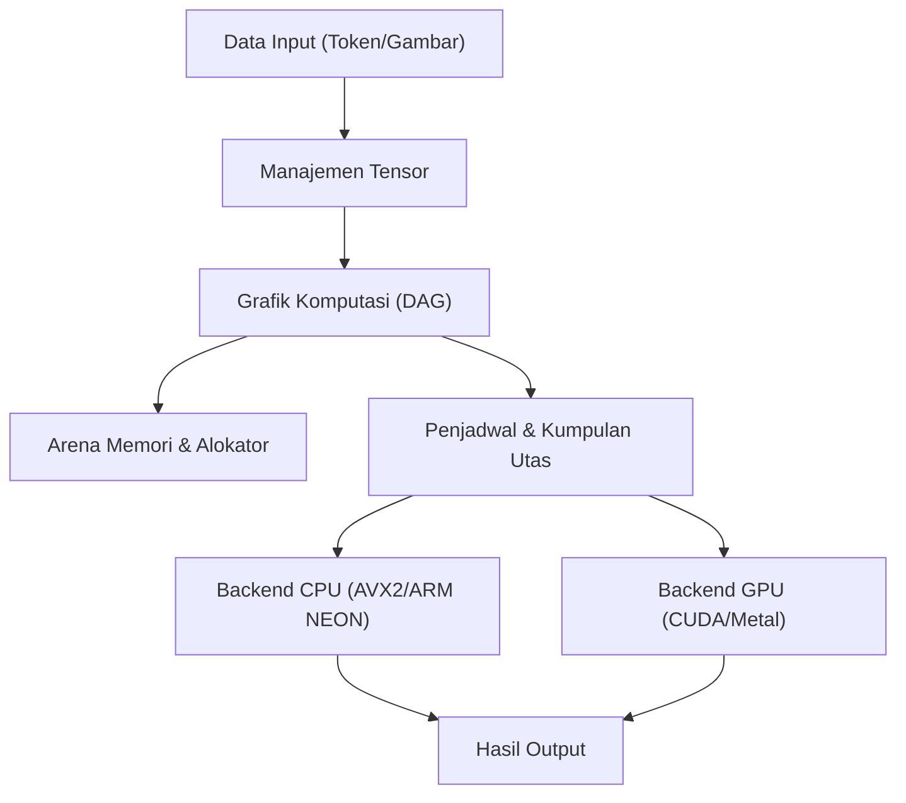
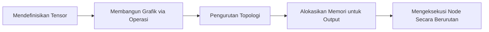
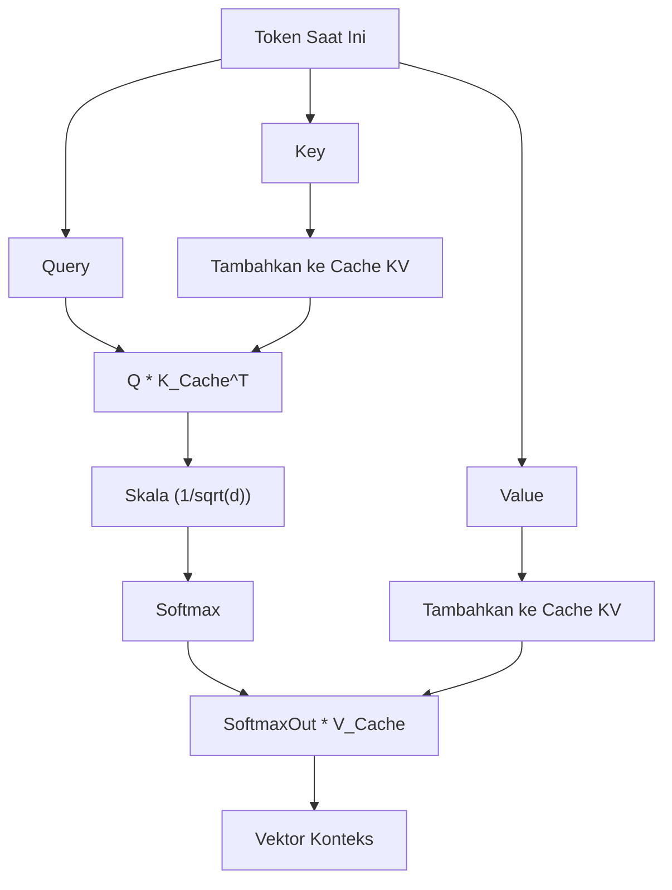

## 1. Pendahuluan: Mengapa Meninggalkan Python dan Membangun Mesin Inferensi AI dengan C++?

Dalam pengembangan AI modern, Python adalah standar de facto. Berkat framework tangguh seperti PyTorch dan TensorFlow, kita dapat membangun, melatih, dan menjalankan inferensi untuk jaringan saraf (neural network) yang kompleks hanya dengan beberapa baris kode. Namun, di balik framework tersebut, bahasa tingkat rendah seperti C++ dan CUDA lah yang menangani proses komputasi berat. Python hanyalah sekadar "lem" (glue) belaka.

Lalu, mengapa kita perlu repot-repot menyingkirkan Python dan membuat mesin inferensi AI menggunakan C++ saja? Ada beberapa alasan kuat untuk itu.

1. **Performa Ekstrem dan Latensi Rendah**: Kita dapat sepenuhnya menghilangkan overhead dari GIL (Global Interpreter Lock) dan pengetikan dinamis (dynamic typing) milik Python. Terutama dalam sistem yang membutuhkan pemrosesan real-time, keterlambatan dalam skala milidetik bisa sangat fatal.
2. **Kemudahan Deployment**: Membangun lingkungan Python (kumpulan library raksasa dan neraka dependensi) di lingkungan pengguna akhir (end-user) sangatlah sulit. Dengan C++, kita hanya perlu mendistribusikan sebuah binari eksekusi tunggal yang ditautkan secara statis (file `.exe` atau binari ELF).
3. **Dukungan untuk Perangkat Edge**: Di lingkungan dengan sumber daya yang sangat terbatas seperti smartphone, perangkat tertanam (embedded devices), atau Raspberry Pi, tidak ada ruang untuk menjalankan runtime Python yang memakan memori hingga beberapa gigabyte.
4. **Kontrol Perangkat Keras Secara Langsung**: Kontrol tingkat rendah seperti penentuan waktu alokasi memori, penggunaan instruksi SIMD secara eksplisit, dan pengoptimalan transfer memori dengan GPU dimungkinkan dengan C++.

Pada artikel ini, dengan mengambil banyak inspirasi dari arsitektur library "GGML" yang dikembangkan oleh Georgi Gerganov, kami akan menyelami jurang teknis dan menjelaskan proses pembuatan mesin inferensi dari nol untuk menjalankan Large Language Model (LLM) hanya menggunakan C++.

---

## 2. Gambaran Keseluruhan Arsitektur Mesin Inferensi

Proses inferensi AI pada dasarnya adalah "rangkaian komputasi matriks raksasa". Agar dapat dieksekusi secara efisien, mesin inferensi harus terdiri dari komponen-komponen berikut.



1. **Manajemen Tensor**: Mengelola struktur data array multidimensi dan stride untuk setiap dimensi.
2. **Grafik Komputasi (Computation Graph)**: Merepresentasikan komputasi setiap lapisan pada neural network sebagai Directed Acyclic Graph (DAG).
3. **Arena Memori (Memory Arena)**: Mekanisme manajemen memori pra-alokasi untuk menghindari overhead dari alokasi memori dinamis (`malloc` atau `new`).
4. **Backend**: Implementasi komputasi (kernel) yang dioptimalkan untuk perangkat keras tertentu seperti CPU atau GPU.

Kita akan menyusun komponen-komponen ini menggunakan fitur-fitur tangguh dari C++ (seperti template, aritmetika pointer, dan RAII).

---

## 3. Rahasia Manajemen Memori: Arena Memori dan Penjajaran (Alignment) SIMD

Manajemen memori pada mesin inferensi adalah salah satu faktor terpenting yang berhubungan langsung dengan performa. Selama inferensi, khususnya saat melewati setiap lapisan pada model Transformer, sejumlah besar tensor perantara dihasilkan. Jika tensor-tensor ini dialokasikan dan dibebaskan menggunakan `malloc` standar setiap saat, fragmentasi heap dan pertukaran konteks (context switch) dari OS akan menyebabkan penurunan kecepatan yang sangat fatal.

Oleh karena itu, kita mengadopsi pendekatan "**Arena Memori (Memory Arena)**". Pendekatan ini merupakan metode di mana memori maksimal yang dibutuhkan dihitung (atau ditetapkan) lalu dialokasikan secara keseluruhan pada saat inferensi dimulai, dan memori dipotong-potong hanya dengan menggunakan penambahan (increment) pada pointer.

### 3.1 Pentingnya Penjajaran (Alignment)

CPU modern mendukung instruksi SIMD (Single Instruction, Multiple Data). Contohnya adalah AVX2/AVX-512 dari Intel/AMD dan NEON dari ARM. Instruksi-instruksi ini memproses data sebesar 256-bit (32 byte) atau 512-bit (64 byte) secara sekaligus, namun memori data yang diproses harus disejajarkan (aligned) pada batasan byte tertentu (biasanya 32 byte atau 64 byte).

Berikut ini adalah contoh implementasi C++ dari Arena Memori dengan mempertimbangkan alignment.

```cpp
#include <cstdint>
#include <cstddef>
#include <stdexcept>
#include <iostream>

struct MemoryArena {
    size_t size;
    size_t offset;
    uint8_t* data;

    MemoryArena(size_t size) : size(size), offset(0) {
        // Menggunakan posix_memalign untuk sistem POSIX, dan _aligned_malloc untuk Windows
#ifdef _WIN32
        data = static_cast<uint8_t*>(_aligned_malloc(size, 64));
#else
        if (posix_memalign(reinterpret_cast<void**>(&data), 64, size) != 0) {
            throw std::bad_alloc();
        }
#endif
    }

    ~MemoryArena() {
#ifdef _WIN32
        _aligned_free(data);
#else
        free(data);
#endif
    }

    void* allocate(size_t bytes, size_t alignment = 64) {
        // Kalkulasi alignment (mencari padding)
        size_t pad = (alignment - (offset % alignment)) % alignment;
        if (offset + pad + bytes > size) {
            throw std::runtime_error("OOM: MemoryArena out of memory");
        }
        offset += pad;
        void* ptr = data + offset;
        offset += bytes;
        return ptr;
    }
    
    void reset() {
        offset = 0; // Pembebasan memori hanya dengan mengembalikan pointer (O(1))
    }
};
```

Dengan cara ini, saat membuat tensor, kita selalu memperoleh memori melalui arena ini. Setiap kali sebuah langkah inferensi selesai (seperti setiap kali sebuah token dihasilkan), kita hanya perlu memanggil `reset()` untuk dapat menggunakan ulang memori tersebut secara instan.

---

## 4. Struktur Data Tensor dan Keajaiban Stride

Tensor adalah konsep yang menggeneralisasi skalar, vektor, dan matriks. Yang penting dalam implementasinya adalah bahwa data yang sebenarnya ditempatkan di dalam memori sebagai **array satu dimensi yang berurutan**, sedangkan untuk dapat menerjemahkannya ke dalam multidimensi, kita menggunakan konsep "Stride".

```cpp
enum class DataType {
    FP32,
    FP16,
    INT8,  // Untuk Kuantisasi
    INT4   // Untuk Kuantisasi
};

struct Tensor {
    int n_dims;           // Jumlah Dimensi
    int64_t ne[4];        // Jumlah elemen per dimensi (Number of Elements)
    size_t nb[4];         // Stride per dimensi (Number of Bytes)
    DataType type;        // Tipe Data
    void* data;           // Pointer ke payload
    
    // Untuk Grafik Komputasi
    enum OpType op;
    Tensor* src0;
    Tensor* src1;
};
```

Stride `nb[i]` merepresentasikan jarak byte di dalam memori antara elemen-elemen yang bersebelahan pada dimensi `i`.
Sebagai contoh, jika sebuah matriks dengan jumlah elemen $M \times N$ (FP32, 1 elemen 4 byte) disimpan dalam bentuk Row-Major (prioritas baris), nilai stride-nya akan seperti berikut:
- `nb[0]` = 4 (byte)  : Pergerakan ke arah kolom
- `nb[1]` = $N \times 4$ (byte) : Pergerakan ke arah baris

Dengan menggunakan teknik ini, operasi seperti "Transpos (Transpose)" dan "Tampilan (View)" dapat diimplementasikan tanpa harus menyalin memori, melainkan cukup dengan menukar nilai stride. Cara ini sangat elegan dan cepat.

---

## 5. Membangun Grafik Komputasi (DAG) dan Evaluasi Malas (Lazy Evaluation)

Sama seperti PyTorch dan framework lainnya, mesin inferensi kita mengadopsi Evaluasi Malas (Lazy Evaluation) yang mirip dengan "Define-by-Run". Dengan kata lain, ketika sebuah fungsi komputasi dipanggil, komputasi tidak langsung dieksekusi, melainkan hanya membangun grafik (hubungan dependensi antar node) terlebih dahulu.

```cpp
Tensor* tensor_add(MemoryArena& arena, Tensor* a, Tensor* b) {
    Tensor* out = create_tensor(arena, a->type, a->n_dims, a->ne);
    out->op = OpType::ADD;
    out->src0 = a;
    out->src1 = b;
    return out;
}

Tensor* tensor_mul_mat(MemoryArena& arena, Tensor* a, Tensor* b) {
    // b biasanya sudah di-transpose
    int64_t ne[2] = { a->ne[0], b->ne[1] };
    Tensor* out = create_tensor(arena, a->type, 2, ne);
    out->op = OpType::MUL_MAT;
    out->src0 = a;
    out->src1 = b;
    return out;
}
```

Alur proses inferensi adalah sebagai berikut:



Ketika mengevaluasi grafik (forward pass), kita menggunakan pengurutan topologi (topological sort) untuk mengeksekusi proses secara berurutan, dimulai dari node yang tidak memiliki dependensi. Karena ini hanya untuk inferensi, tidak perlu menyimpan gradien untuk backpropagation, sehingga manajemen memori menjadi sangat sederhana.

---

## 6. Inti dari Matematika dan Optimasi: Perkalian Matriks (GEMM)

Lebih dari 90% komputasi dalam inferensi AI dihabiskan untuk Perkalian Matriks (GEMM: General Matrix Multiply). Baik mekanisme Attention maupun Feed-Forward Network (FFN), yang merupakan inti dari model Transformer, pada akhirnya adalah perkalian matriks raksasa.

Hasil kali $C = A B$ (ukuran $M \times N$) dari dua matriks $A$ (ukuran $M \times K$) dan $B$ (ukuran $K \times N$), jika direpresentasikan dalam rumus matematika adalah sebagai berikut.

$$
C_{i,j} = \sum_{k=0}^{K-1} A_{i,k} \cdot B_{k,j}
$$

Jika hal ini diimplementasikan dengan loop tiga tingkat (triple loop) biasa, akan sering terjadi cache miss dan performa tidak akan tercapai sama sekali.

### 6.1 Pemblokiran Cache (Cache Blocking) pada CPU dan Optimasi SIMD

Strategi dasar untuk mempercepat GEMM di CPU adalah sebagai berikut.
1. **Loop Tiling (Pemblokiran Cache)**: Membagi matriks ke dalam blok-blok kecil yang muat di dalam cache L1/L2 untuk dihitung.
2. **Pengepakan Data (Data Packing)**: Menyusun ulang data secara internal agar pola akses memori menjadi berurutan.
3. **Pemanfaatan SIMD**: Menggunakan instruksi FMA (Fused Multiply-Add) seperti `_mm512_fmadd_ps` pada AVX-512 untuk menangani banyak operasi multiply-add dalam satu siklus clock.

Berikut adalah contoh penyederhanaan produk titik (Dot Product) vektor menggunakan C++ dan SIMD Intrinsics.

```cpp
#include <immintrin.h> // Untuk instruksi AVX

// Dot product berkecepatan tinggi FP32 menggunakan AVX2
float dot_product_avx2(const float* a, const float* b, int n) {
    __m256 sum256 = _mm256_setzero_ps();
    int i = 0;
    
    // Memproses 8 elemen sekaligus (256-bit = 32 byte = 8 * 4 byte)
    for (; i <= n - 8; i += 8) {
        __m256 va = _mm256_loadu_ps(a + i);
        __m256 vb = _mm256_loadu_ps(b + i);
        // Instruksi FMA: sum256 = va * vb + sum256
        sum256 = _mm256_fmadd_ps(va, vb, sum256);
    }
    
    // Penjumlahan horizontal dari nilai di dalam register SIMD
    float result[8];
    _mm256_storeu_ps(result, sum256);
    float dot = result[0] + result[1] + result[2] + result[3] + 
                result[4] + result[5] + result[6] + result[7];
                
    // Pemrosesan sisanya
    for (; i < n; ++i) {
        dot += a[i] * b[i];
    }
    return dot;
}
```

Dengan trik kecil ini saja, kita bisa memperoleh peningkatan kecepatan hingga beberapa hingga belasan kali lipat dibandingkan dengan implementasi yang biasa.

---

## 7. Melampaui Batas Perangkat Keras: Integrasi Backend CUDA dan Metal

Implementasi C++ murni saja sudah cukup untuk dijalankan dengan lumayan di CPU. Namun, agar model raksasa seperti LLM dapat berjalan dengan kecepatan yang praktis (misalnya menghasilkan 20 token lebih per detik), kemampuan komputasi paralel dari GPU sangatlah penting. Oleh karena itu, kita akan memperkenalkan layer abstraksi backend ke dalam mesin inferensi kita.

### 7.1 Abstraksi Backend

Dengan menggunakan polimorfisme C++, kita dapat beralih dari satu pengeksekusi komputasi (Executor) ke pengeksekusi lainnya.

```cpp
class Backend {
public:
    virtual ~Backend() = default;
    virtual void alloc_buffer(Tensor* t) = 0;
    virtual void free_buffer(Tensor* t) = 0;
    virtual void copy_to_device(Tensor* t) = 0;
    virtual void copy_to_host(Tensor* t) = 0;
    
    // Eksekusi berbagai macam komputasi
    virtual void compute_add(Tensor* src0, Tensor* src1, Tensor* dst) = 0;
    virtual void compute_mul_mat(Tensor* src0, Tensor* src1, Tensor* dst) = 0;
};
```

### 7.2 Implementasi Backend NVIDIA CUDA

Untuk memanfaatkan GPU NVIDIA, kita akan mengimplementasikan backend menggunakan ekstensi CUDA C++. Meskipun kita bisa saja menulis kernel sendiri, untuk perkalian matriks, cara terbaik adalah memanfaatkan "cuBLAS", yaitu library tingkat tinggi yang disediakan oleh NVIDIA.

```cpp
#include <cublas_v2.h>
#include <cuda_runtime.h>

class CUDABackend : public Backend {
private:
    cublasHandle_t handle;
    
public:
    CUDABackend() {
        cublasCreate(&handle);
    }
    
    ~CUDABackend() {
        cublasDestroy(handle);
    }
    
    void compute_mul_mat(Tensor* src0, Tensor* src1, Tensor* dst) override {
        // Pada CUDA default-nya adalah Column-Major, jadi parameternya harus diperhatikan
        const float alpha = 1.0f;
        const float beta = 0.0f;
        
        int m = src0->ne[0];
        int k = src0->ne[1];
        int n = src1->ne[1]; // Diasumsikan src1 sudah di-transpose
        
        cublasSgemm(handle, CUBLAS_OP_T, CUBLAS_OP_N,
                    m, n, k,
                    &alpha,
                    (const float*)src0->data, k,
                    (const float*)src1->data, k,
                    &beta,
                    (float*)dst->data, m);
        cudaDeviceSynchronize();
    }
};
```
Transfer data (`cudaMemcpy`) antara memori CUDA dan memori host (CPU) sangatlah berat. Oleh karena itu, penting untuk merancang agar semaksimal mungkin semua weight (tensor bobot) dan tensor perantara tetap berada di VRAM selama proses inferensi.

### 7.3 Backend Apple Silicon (Metal)

Belakangan ini, chip Mac M1/M2/M3 (Apple Silicon) sangat mumpuni sebagai mesin inferensi AI. Alasannya terletak pada "Unified Memory". Karena CPU dan GPU berbagi ruang memori yang sama, transfer memori antara host dan device yang memakan biaya tinggi melalui bus PCIe—seperti pada CUDA yang disebutkan sebelumnya—menjadi sama sekali tidak diperlukan.

Untuk memanggil Metal dari C++, kita bisa menggunakan Objective-C++ (file `.mm`) sebagai perantara, atau menggunakan library `metal-cpp`.
Kernel ditulis dengan menggunakan Metal Compute Shader (yang ditulis mirip dengan sintaks C++ pada file `.metal`).

```cpp
// Metal Shader (kernel.metal)
#include <metal_stdlib>
using namespace metal;

kernel void mul_mat_kernel(
    device const float* A [[buffer(0)]],
    device const float* B [[buffer(1)]],
    device float* C [[buffer(2)]],
    constant uint3& dims [[buffer(3)]],
    uint2 gid [[thread_position_in_grid]]
) {
    uint m = dims.x; uint k = dims.y; uint n = dims.z;
    uint row = gid.y; uint col = gid.x;
    
    if (row < m && col < n) {
        float sum = 0.0;
        for (uint i = 0; i < k; ++i) {
            sum += A[row * k + i] * B[i * n + col]; // Penyederhanaan
        }
        C[row * n + col] = sum;
    }
}
```

Di lingkungan Apple Silicon, juga disediakan library optimasi perkalian matriks yang disebut MPS (Metal Performance Shaders). Untuk penggunaan nyata, memanfaatkannya bisa menghasilkan kecepatan inferensi yang luar biasa.

---

## 8. Proses Khusus pada Model Transformer: Attention dan Cache KV

LLM termutakhir seperti LLaMA 2/3 dan GPT didasarkan pada arsitektur Transformer. Untuk mengimplementasikannya dalam C++, kita wajib membangun "Scaled Dot-Product Attention" yang diekspresikan dengan rumus berikut:

$$
\text{Attention}(Q, K, V) = \text{softmax}\left(\frac{QK^T}{\sqrt{d_k}}\right)V
$$

Selain itu, dalam generasi token tipe Autoregresif (Autoregressive), kita perlu menyimpan hasil komputasi (Key dan Value) dari token-token sebelumnya. Hal ini disebut "**Cache KV (Key-Value Cache)**".



Untuk alokasi memori dari Cache KV, kita menggunakan konsep seperti ring buffer dengan menyiapkan ruang memori untuk konteks maksimal (misalnya, 4096 atau 8192 token) di dalam arena secara pra-alokasi. Dengan melakukan ini, kita dapat mencegah realokasi di setiap langkah pembuatan (generation step).

Selain itu, untuk pengodean posisi (Positional Encoding), kita mengimplementasikan "RoPE (Rotary Position Embedding)" yang saat ini menjadi arus utama. Ini adalah metode untuk menyematkan informasi posisi sebagai vektor rotasi di ruang kompleks. Pengoptimalan dari pemanggilan fungsi `sin` dan `cos` di C++ (misalnya, menggunakan Look-Up Table) memegang peranan penting terhadap performa.

---

## 9. Optimasi Ekstrem dengan Kuantisasi Model (Quantization)

Jika kita memuat model skala besar (misalnya model LLaMA dengan 7 miliar parameter) menggunakan format FP32 (floating point 32-bit), bobotnya saja akan memakan memori (VRAM) sekitar 28GB. Apalagi jika ditambah dengan Cache KV dan buffer inferensi, penggunaannya dapat dengan mudah melampaui 30GB, sehingga mustahil dijalankan pada GPU konsumen (consumer GPU) biasa.

Oleh karena itu, "**Kuantisasi (Quantization)**" menjadi hal yang wajib dilakukan. Ini juga merupakan nilai utama dari format GGML.

Kuantisasi adalah teknik untuk menurunkan presisi dari bobot (weight) secara sengaja.
- **FP16 (16-bit)**: Ukuran berkurang separuh. Hampir tidak ada degradasi presisi.
- **INT8 (8-bit)**: Ukuran menjadi 1/4. Sedikit terjadi degradasi.
- **INT4 (4-bit)**: Ukuran menjadi 1/8. Dapat digunakan untuk inferensi yang praktis dengan menggunakan teknik blocking dan scaling factor khusus.

Pada sisi mesin inferensi, bobot yang dikompres dalam format INT4 (atau INT8) akan dibaca dari memori, kemudian **segera setelah dimuat ke dalam register CPU atau GPU, akan diekspansi (Dequantize) ke dalam FP16 atau FP32 untuk melakukan komputasi**.

Hal yang menakjubkan adalah bahwa akan jauh lebih cepat jika kita mengurangi jumlah data yang dibaca dari memori meskipun itu berarti harus menambah beban komputasi. Hal ini dikarenakan pada perangkat keras modern, bottleneck pada tugas inferensi bukanlah "Kekuatan Komputasi (Compute Bound)" melainkan "**Bandwidth Memori (Memory Bandwidth Bound)**". Jika kita mengimplementasikan mesin inferensi di C++ dengan kuantisasi INT4, kita dapat menjalankan LLM lokal dengan lancar bahkan di MacBook Air dengan VRAM 8GB.

---

## 10. Penyesuaian Performa (Performance Tuning): Arsitektur NUMA dan Kumpulan Utas (Thread Pool)

Saat melakukan inferensi menggunakan CPU, multithreading sangatlah wajib. Akan tetapi, hanya sekadar menjalankan banyak `std::thread` bukanlah sebuah hal yang optimal.

Pada server multi-soket modern maupun CPU high-end seperti Ryzen Threadripper, telah mengadopsi arsitektur **NUMA (Non-Uniform Memory Access)**. Mengakses memori yang secara fisik dekat dengan suatu core CPU (memori lokal) sangatlah cepat, tetapi mengakses memori yang terhubung dengan prosesor lain akan berjalan sangat lambat.

Di mesin inferensi C++ yang canggih, teknik-teknik berikut dimanfaatkan secara maksimal:
1. **Penyematan Utas (Thread Pinning)**: Mengunci setiap thread ke core CPU tertentu (dengan mengatur Affinity) untuk mencegah kerusakan cache yang disebabkan oleh context switch.
2. **Alokasi Sadar-NUMA (NUMA-aware Allocation)**: Mengalokasikan memori di node NUMA yang sama dengan thread yang sedang memproses data tersebut.
3. **Kumpulan Utas dengan Pencurian Kerja (Work-Stealing Thread Pool)**: Membagi setiap node di dalam grafik komputasi ke dalam tugas-tugas kecil, dan mengimplementasikan penjadwal (scheduler) yang efisien di mana thread yang sedang kosong akan secara otomatis mencuri tugas untuk dieksekusi.

Dengan memanfaatkan teknik-teknik tersebut, kita dapat menjaga pemanfaatan CPU agar selalu menempel pada kisaran 100%, serta memeras tingkat throughput yang mendekati nilai teoretisnya.

---

## 11. Kesimpulan: Kegembiraan Menjalankan AI dengan "Otot" C++

Python memang nyaman digunakan. Untuk tahap penelitian dan pengembangan (R&D) atau pembuatan prototipe, tidak ada bahasa pemrograman lain yang bisa menyaingi produktivitasnya. Namun, pada saat kita beralih ke fase "menjalankan model yang sudah jadi secara efisien di semua perangkat pada dunia nyata", di situlah saatnya C++ mengambil peran.

Mesin inferensi yang dibangun dengan memanipulasi deretan byte memori secara langsung, memeras register hingga batas maksimalnya menggunakan instruksi SIMD, dan bergulat dengan bandwidth VRAM GPU—rasa pencapaian ketika melihat mesin tersebut menghasilkan teks (token) bahasa Jepang yang natural satu per satu di konsol merupakan "kegembiraan murni seorang insinyur" yang tidak akan pernah Anda dapatkan hanya dengan memanggil `model.generate()` di framework Python.

Teknologi AI seringkali menjadi "Kotak Hitam (Black Box)", tetapi dengan menulis semuanya—mulai dari komputasi tensor hingga alokasi memori—sendiri menggunakan C++, Anda dapat memperoleh pemahaman yang mendalam tentang mekanisme nyata di balik bagaimana LLM "berpikir".

Jika Anda memiliki pengetahuan dasar tentang C++ dan ketertarikan yang kuat pada teknologi AI saat ini, cobalah untuk menantang diri dalam membuat mesin inferensi sendiri. Kode sumber dari GGML dan llama.cpp pasti akan menjadi buku pelajaran hidup yang terbaik.

**Ayo, buang runtime Python yang berat itu dan jalankan AI mutakhir dengan otot C++!**
