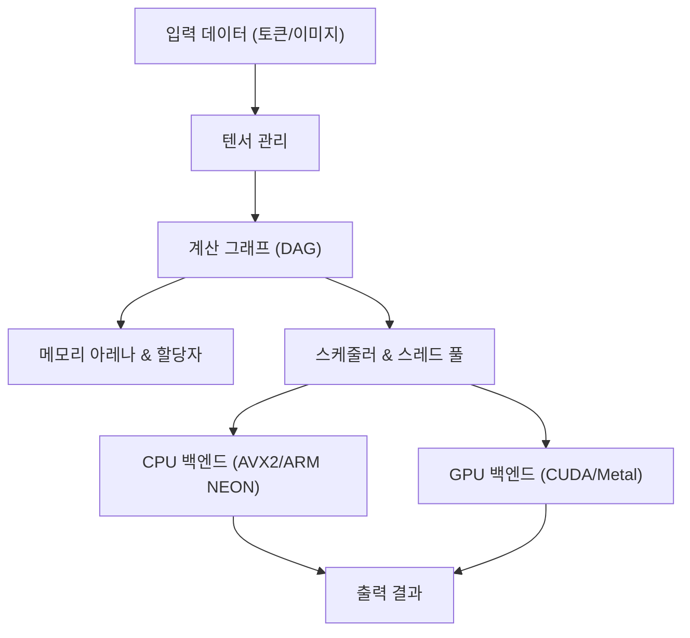
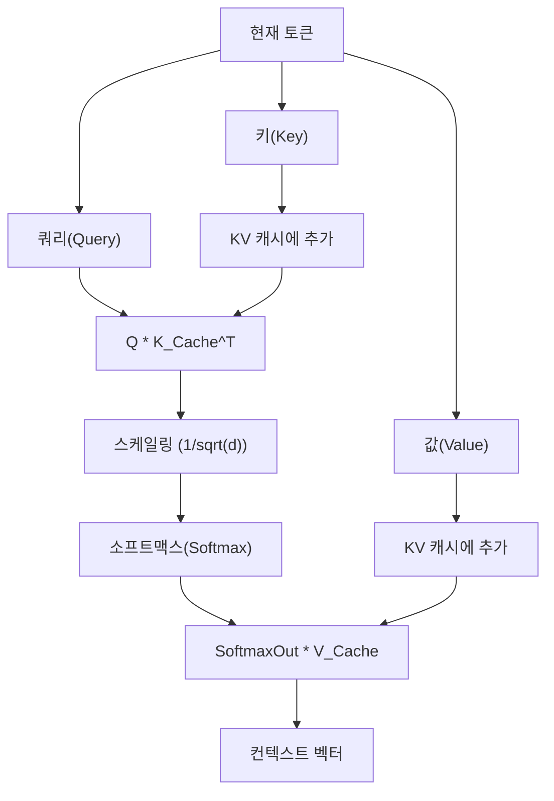

## 1. 시작하며: 왜 Python을 버리고 C++로 AI 추론 엔진을 만드는가?

현대 AI 개발에서 Python은 사실상의 표준(De facto standard)입니다. PyTorch나 TensorFlow 같은 강력한 프레임워크의 은혜 덕분에, 몇 줄의 코드만으로 복잡한 신경망을 구축하고 학습 및 추론시킬 수 있습니다. 하지만 이런 프레임워크의 이면에서는 C++이나 CUDA와 같은 로우 레벨(Low-level) 언어가 계산량이 많은 처리를 담당하고 있습니다. Python은 어디까지나 '접착제(Glue)' 역할을 할 뿐입니다.

그렇다면 왜 굳이 Python을 배제하고 C++ 단독으로 AI 추론 엔진을 만들어야 할까요? 거기에는 몇 가지 강력한 이유가 있습니다.

1. **극한의 성능과 짧은 지연 시간**: Python의 GIL(Global Interpreter Lock)이나 동적 타이핑에 의한 오버헤드를 완전히 제거할 수 있습니다. 특히 실시간성이 요구되는 시스템에서는 밀리초 단위의 지연이 치명적일 수 있습니다.
2. **배포의 용이성**: Python 환경(거대한 라이브러리군, 의존성 지옥)을 최종 사용자의 환경에 구축하는 것은 매우 어렵습니다. C++이라면 정적으로 링크된 단일 실행 바이너리(`.exe`나 ELF 바이너리)를 배포하기만 하면 됩니다.
3. **엣지 디바이스 대응**: 스마트폰이나 임베디드 기기, 라즈베리 파이 같은 리소스 제약이 심한 환경에서 수 기가바이트의 메모리를 소비하는 Python 런타임을 구동할 여유는 없습니다.
4. **하드웨어 직접 제어**: 메모리 할당 타이밍, SIMD 명령어의 명시적 사용, GPU와의 메모리 전송 최적화 등 로우 레벨 제어는 C++에서만 가능합니다.

본 기사에서는 Georgi Gerganov 씨가 개발한 'GGML' 라이브러리의 아키텍처에서 많은 영감을 받아, C++만으로 대규모 언어 모델(LLM) 등을 구동하기 위한 추론 엔진을 처음부터 구축해 나가는 과정을 기술적인 깊은 곳까지 파고들어 해설합니다.

---

## 2. 추론 엔진 아키텍처의 전체적인 모습

AI의 추론 처리는 본질적으로 '거대한 행렬 계산의 연속'입니다. 이를 효율적으로 실행하기 위해, 추론 엔진은 다음과 같은 컴포넌트로 구성되어야 합니다.



1. **텐서(Tensor) 관리**: 다차원 배열의 데이터 구조와 차원별 스트라이드(Stride)를 관리합니다.
2. **계산 그래프(Computation Graph)**: 신경망 각 층의 연산을 방향성 비순환 그래프(DAG)로 표현합니다.
3. **메모리 아레나(Memory Arena)**: 동적 메모리 확보(`malloc`이나 `new`)의 오버헤드를 피하기 위한, 사전 확보형 메모리 관리 메커니즘입니다.
4. **백엔드(Backend)**: CPU나 GPU 등, 특정 하드웨어에 최적화된 연산 구현(커널)입니다.

이들을 C++의 강력한 기능(템플릿, 포인터 연산, RAII 등)을 사용하여 조립해 나갑니다.

---

## 3. 메모리 관리의 극의: 메모리 아레나와 SIMD 정렬

추론 엔진에서 메모리 관리는 성능과 직결되는 가장 중요한 요소 중 하나입니다. 추론 중, 특히 트랜스포머(Transformer) 모델의 각 층을 통과할 때 방대한 수의 중간 텐서가 생성됩니다. 이를 매번 표준 `malloc`으로 할당하고 해제한다면, 힙의 단편화와 OS의 컨텍스트 스위칭으로 인해 치명적인 속도 저하를 초래합니다.

그래서 '**메모리 아레나(Memory Arena)**'라는 접근 방식을 채택합니다. 이는 추론 시작 시 필요한 최대 메모리 양을 계산(또는 미리 결정)하여 일괄적으로 할당하고, 포인터의 증가만으로 메모리를 잘라내어 사용하는 방법입니다.

### 3.1 정렬(Alignment)의 중요성

현대 CPU는 SIMD(Single Instruction, Multiple Data) 명령어를 지원합니다. Intel/AMD의 AVX2/AVX-512나 ARM의 NEON 등이 있습니다. 이 명령어들은 256비트(32바이트)나 512비트(64바이트)의 데이터를 한 번에 처리하지만, 처리 대상 데이터의 메모리가 특정 바이트 경계(보통 32바이트나 64바이트)에 정렬(Alignment)되어 있어야 합니다.

다음은 정렬을 고려한 메모리 아레나의 C++ 구현 예시입니다.

```cpp
#include <cstdint>
#include <cstddef>
#include <stdexcept>
#include <iostream>

struct MemoryArena {
    size_t size;
    size_t offset;
    uint8_t* data;

    MemoryArena(size_t size) : size(size), offset(0) {
        // POSIX 계열이라면 posix_memalign, Windows라면 _aligned_malloc을 사용
#ifdef _WIN32
        data = static_cast<uint8_t*>(_aligned_malloc(size, 64));
#else
        if (posix_memalign(reinterpret_cast<void**>(&data), 64, size) != 0) {
            throw std::bad_alloc();
        }
#endif
    }

    ~MemoryArena() {
#ifdef _WIN32
        _aligned_free(data);
#else
        free(data);
#endif
    }

    void* allocate(size_t bytes, size_t alignment = 64) {
        // 정렬 계산 (패딩 구하기)
        size_t pad = (alignment - (offset % alignment)) % alignment;
        if (offset + pad + bytes > size) {
            throw std::runtime_error("OOM: MemoryArena out of memory");
        }
        offset += pad;
        void* ptr = data + offset;
        offset += bytes;
        return ptr;
    }
    
    void reset() {
        offset = 0; // 메모리 해제는 포인터를 되돌리기만 하면 됨 (O(1))
    }
};
```

이처럼 텐서 생성 시에는 반드시 이 아레나를 통해 메모리를 얻습니다. 추론의 각 단계(토큰 생성마다 등)가 끝날 때마다 `reset()`을 호출하는 것만으로, 순식간에 메모리를 재사용할 수 있습니다.

---

## 4. 텐서 데이터 구조와 스트라이드의 마법

텐서는 스칼라, 벡터, 행렬을 일반화한 개념입니다. 구현에 있어 중요한 것은 실제 데이터가 메모리 상에 **1차원의 연속된 배열**로 배치되어 있는 반면, 이를 다차원으로 해석하기 위한 '스트라이드(Stride)'라는 개념을 갖는다는 점입니다.

```cpp
enum class DataType {
    FP32,
    FP16,
    INT8,  // 양자화용
    INT4   // 양자화용
};

struct Tensor {
    int n_dims;           // 차원의 수
    int64_t ne[4];        // 각 차원의 요소 수 (Number of Elements)
    size_t nb[4];         // 각 차원의 스트라이드 (Number of Bytes)
    DataType type;        // 데이터 타입
    void* data;           // 페이로드 포인터
    
    // 계산 그래프용
    enum OpType op;
    Tensor* src0;
    Tensor* src1;
};
```

스트라이드 `nb[i]`는 차원 `i`에서 인접한 요소 간의 메모리 상 바이트 거리를 나타냅니다.
예를 들어 요소 수 $M \times N$인 행렬(FP32, 1요소 4바이트)이 Row-Major(행 우선)로 저장된 경우, 스트라이드는 다음과 같습니다.
- `nb[0]` = 4 (바이트)  : 열 방향 이동
- `nb[1]` = $N \times 4$ (바이트) : 행 방향 이동

이를 이용하면 메모리 복사 없이 '전치(Transpose)'나 '뷰(View)' 같은 연산을 스트라이드 값의 교환만으로 구현할 수 있습니다. 매우 우아하고 빠릅니다.

---

## 5. 계산 그래프(DAG) 구축과 지연 평가

PyTorch 등과 마찬가지로, 우리의 추론 엔진도 'Define-by-Run'에 가까운 지연 평가(Lazy Evaluation)를 채택합니다. 즉, 연산 함수를 호출한 시점에서는 계산을 수행하지 않고, 그래프(노드 간의 의존 관계)만 구축합니다.

```cpp
Tensor* tensor_add(MemoryArena& arena, Tensor* a, Tensor* b) {
    Tensor* out = create_tensor(arena, a->type, a->n_dims, a->ne);
    out->op = OpType::ADD;
    out->src0 = a;
    out->src1 = b;
    return out;
}

Tensor* tensor_mul_mat(MemoryArena& arena, Tensor* a, Tensor* b) {
    // b는 전치되어 있는 경우가 많음
    int64_t ne[2] = { a->ne[0], b->ne[1] };
    Tensor* out = create_tensor(arena, a->type, 2, ne);
    out->op = OpType::MUL_MAT;
    out->src0 = a;
    out->src1 = b;
    return out;
}
```

추론 처리의 흐름은 다음과 같습니다.


그래프를 평가할 때(순전파 패스), 위상 정렬을 사용하여 의존 관계가 없는 노드부터 순서대로 처리를 실행합니다. 추론만 한다면 역전파용 기울기를 유지할 필요가 없으므로 메모리 관리가 매우 단순해집니다.

---

## 6. 수학과 최적화의 핵심: 행렬곱 (GEMM) 

AI 추론 연산량의 90% 이상은 행렬 곱셈(GEMM: General Matrix Multiply)에 소요됩니다. 트랜스포머 모델의 핵심인 어텐션(Attention) 메커니즘도 피드포워드 신경망(FFN)도 궁극적으로는 거대한 행렬곱입니다.

두 행렬 $A$ (크기 $M \times K$)와 $B$ (크기 $K \times N$)의 곱 $C = A B$ (크기 $M \times N$)은 수식으로 표현하면 다음과 같습니다.

$$
C_{i,j} = \sum_{k=0}^{K-1} A_{i,k} \cdot B_{k,j}
$$

이를 단순한 삼중 루프로 구현하면 캐시 미스가 빈발하여 성능이 전혀 나오지 않습니다.

### 6.1 CPU에서의 캐시 블로킹과 SIMD 최적화

CPU에서 GEMM을 가속하기 위한 기본 전략은 다음과 같습니다.
1. **루프 타일링(캐시 블로킹)**: L1/L2 캐시에 들어갈 수 있는 작은 블록으로 행렬을 분할하여 계산합니다.
2. **데이터 팩킹**: 메모리 접근 패턴이 연속적이 되도록 내부적으로 데이터를 재배열합니다.
3. **SIMD 활용**: AVX-512의 `_mm512_fmadd_ps`와 같은 FMA(Fused Multiply-Add) 명령어를 사용하여 한 클록 사이클에 다수의 곱셈 및 덧셈 연산을 처리합니다.

C++과 SIMD Intrinsics를 사용한 단순화된 벡터 내적(Dot Product)의 예를 보여드립니다.

```cpp
#include <immintrin.h> // AVX 명령어용

// AVX2를 활용한 FP32 고속 내적
float dot_product_avx2(const float* a, const float* b, int n) {
    __m256 sum256 = _mm256_setzero_ps();
    int i = 0;
    
    // 8개 요소씩 한 번에 처리 (256비트 = 32바이트 = 8 * 4바이트)
    for (; i <= n - 8; i += 8) {
        __m256 va = _mm256_loadu_ps(a + i);
        __m256 vb = _mm256_loadu_ps(b + i);
        // FMA 명령어: sum256 = va * vb + sum256
        sum256 = _mm256_fmadd_ps(va, vb, sum256);
    }
    
    // SIMD 레지스터 내의 값을 수평 가산
    float result[8];
    _mm256_storeu_ps(result, sum256);
    float dot = result[0] + result[1] + result[2] + result[3] + 
                result[4] + result[5] + result[6] + result[7];
                
    // 나머지 처리
    for (; i < n; ++i) {
        dot += a[i] * b[i];
    }
    return dot;
}
```

이 작은工夫(고안)만으로도 단순 구현에 비해 몇 배에서 십여 배의 속도 향상을 얻을 수 있습니다.

---

## 7. 하드웨어의 장벽을 넘다: CUDA 및 Metal 백엔드 통합

순수 C++ 구현만으로도 CPU 상에서는 어느 정도 동작하지만, LLM과 같은 거대 모델을 실용적인 속도(예: 1초당 20토큰 이상 생성)로 구동하기 위해서는 GPU의 병렬 계산 능력이 필수적입니다. 따라서 우리 엔진에 백엔드 추상화 레이어를 도입합니다.

### 7.1 백엔드 추상화

C++의 다형성을 이용하여 연산 실행기(Executor)를 전환할 수 있도록 합니다.

```cpp
class Backend {
public:
    virtual ~Backend() = default;
    virtual void alloc_buffer(Tensor* t) = 0;
    virtual void free_buffer(Tensor* t) = 0;
    virtual void copy_to_device(Tensor* t) = 0;
    virtual void copy_to_host(Tensor* t) = 0;
    
    // 각종 연산의 실행
    virtual void compute_add(Tensor* src0, Tensor* src1, Tensor* dst) = 0;
    virtual void compute_mul_mat(Tensor* src0, Tensor* src1, Tensor* dst) = 0;
};
```

### 7.2 NVIDIA CUDA 백엔드 구현

NVIDIA의 GPU를 활용하기 위해, CUDA C++ 확장을 사용하여 백엔드를 구현합니다. 독자적인 커널을 작성하는 것도 가능하지만, 행렬곱에 관해서는 NVIDIA가 제공하는 최고 수준의 라이브러리인 'cuBLAS'를 활용하는 것이 최선의 선택입니다.

```cpp
#include <cublas_v2.h>
#include <cuda_runtime.h>

class CUDABackend : public Backend {
private:
    cublasHandle_t handle;
    
public:
    CUDABackend() {
        cublasCreate(&handle);
    }
    
    ~CUDABackend() {
        cublasDestroy(handle);
    }
    
    void compute_mul_mat(Tensor* src0, Tensor* src1, Tensor* dst) override {
        // CUDA는 기본이 Column-Major이므로 파라미터에 주의가 필요함
        const float alpha = 1.0f;
        const float beta = 0.0f;
        
        int m = src0->ne[0];
        int k = src0->ne[1];
        int n = src1->ne[1]; // src1은 전치되어 있다는 전제
        
        cublasSgemm(handle, CUBLAS_OP_T, CUBLAS_OP_N,
                    m, n, k,
                    &alpha,
                    (const float*)src0->data, k,
                    (const float*)src1->data, k,
                    &beta,
                    (float*)dst->data, m);
        cudaDeviceSynchronize();
    }
};
```
CUDA 메모리와 호스트(CPU) 메모리 간의 데이터 전송(`cudaMemcpy`)은 매우 무겁기 때문에, 추론 중에는 가급적 모든 가중치(웨이트 텐서)와 중간 텐서를 VRAM 상에 계속 유지하는 설계가 중요합니다.

### 7.3 Apple Silicon (Metal) 백엔드

최근 Mac의 M1/M2/M3 칩(Apple Silicon)은 AI 추론기로서 매우 우수합니다. 그 이유는 '통합 메모리(Unified Memory)'에 있습니다. CPU와 GPU가 동일한 메모리 영역을 공유하고 있기 때문에, 앞서 언급한 CUDA와 같은 PCIe 버스를 통한 고비용의 호스트-디바이스 간 메모리 전송이 전혀 필요하지 않습니다.

C++에서 Metal을 호출하려면 Objective-C++(`.mm` 파일)을 브리지로 사용하거나, `metal-cpp` 라이브러리를 이용합니다.
Metal의 Compute Shader(`.metal` 파일에 C++와 비슷하게 작성)를 사용하여 커널을 작성합니다.

```cpp
// Metal 셰이더 (kernel.metal)
#include <metal_stdlib>
using namespace metal;

kernel void mul_mat_kernel(
    device const float* A [[buffer(0)]],
    device const float* B [[buffer(1)]],
    device float* C [[buffer(2)]],
    constant uint3& dims [[buffer(3)]],
    uint2 gid [[thread_position_in_grid]]
) {
    uint m = dims.x; uint k = dims.y; uint n = dims.z;
    uint row = gid.y; uint col = gid.x;
    
    if (row < m && col < n) {
        float sum = 0.0;
        for (uint i = 0; i < k; ++i) {
            sum += A[row * k + i] * B[i * n + col]; // 간략화됨
        }
        C[row * n + col] = sum;
    }
}
```

Apple Silicon 환경에서는 MPS(Metal Performance Shaders)라는 행렬곱 전용 최적화 라이브러리도 제공하고 있으므로, 실제 운용 시에는 이를 활용하여 경이로운 추론 속도를 달성할 수 있습니다.

---

## 8. 트랜스포머 모델 특유의 처리: 어텐션(Attention)과 KV 캐시

LLaMA 2/3이나 GPT와 같은 최첨단 LLM은 트랜스포머 아키텍처에 기반을 두고 있습니다. 이를 C++로 구현하기 위해서는 다음 수식으로 표현되는 'Scaled Dot-Product Attention'의 구축이 필수입니다.

$$
\text{Attention}(Q, K, V) = \text{softmax}\left(\frac{QK^T}{\sqrt{d_k}}\right)V
$$

또한, 자기회귀형(Autoregressive) 토큰 생성에서는 과거 토큰의 계산 결과(Key와 Value)를 유지해 두어야 합니다. 이를 '**KV 캐시(Key-Value Cache)**'라고 부릅니다.



KV 캐시의 메모리 할당도, 사전에 최대 컨텍스트 길이(예를 들어 4096이나 8192 토큰)만큼의 메모리 공간을 아레나에 확보해 두어 링 버퍼처럼 운용합니다. 이를 통해 생성 단계마다 재할당되는 것을 방지할 수 있습니다.

또한 위치 인코딩(Positional Encoding)에는 최근 주류가 된 'RoPE(Rotary Position Embedding)'를 구현합니다. 이는 복소 공간에서의 회전 벡터로 위치 정보를 임베딩하는 기법으로, C++에서의 `sin` 및 `cos` 함수 호출 최적화(룩업 테이블 등)가 성능의 열쇠를 쥐고 있습니다.

---

## 9. 모델 양자화(Quantization)를 통한 극한의 최적화

대규모 모델(예: 70억 파라미터의 LLaMA 모델)을 FP32(32비트 부동 소수점) 그대로 읽어 들이면 가중치만으로 약 28GB의 메모리(VRAM)를 소비합니다. 여기에 KV 캐시와 추론용 버퍼를 포함하면 30GB를 훌쩍 넘어 일반적인 소비자용 GPU에서는 실행이 불가능합니다.

따라서 필수가 되는 것이 '**양자화(Quantization)**'입니다. 이는 GGML 포맷의 진면목이기도 합니다.

양자화란 가중치의 정밀도를 의도적으로 낮추는 기술입니다.
- **FP16 (16-bit)**: 크기 절반 감소. 정밀도 저하 거의 없음.
- **INT8 (8-bit)**: 크기 1/4 감소. 약간의 저하.
- **INT4 (4-bit)**: 크기 1/8 감소. 독자적인 블로킹과 스케일링 팩터를 사용하면 실용적인 추론 가능.

추론 엔진 측에서는 메모리에서 INT4(또는 INT8)로 압축된 가중치를 읽어내어, **CPU나 GPU의 레지스터에 로드한 직후에 FP16 또는 FP32로 전개(Dequantize)하여 계산**을 수행합니다.

놀랍게도 계산량을 늘려서라도 메모리에서 읽어들이는 데이터 양을 줄이는 쪽이 더 빠릅니다. 이는 현대 하드웨어에서 추론 작업의 병목 현상이 '계산 능력(Compute Bound)'이 아니라 '**메모리 대역폭(Memory Bandwidth Bound)**'에 있기 때문입니다. INT4 양자화를 적용한 C++ 구현 엔진이라면, 8GB VRAM을 가진 MacBook Air 등에서도 쾌적하게 로컬 LLM을 구동할 수 있습니다.

---

## 10. 성능 튜닝: NUMA 아키텍처와 스레드 풀

CPU를 이용한 추론을 할 경우 멀티스레딩은 필수입니다. 하지만 단순히 `std::thread`를 많이 띄우기만 해서는 최적이라 할 수 없습니다.

현대의 멀티 소켓 서버나 Ryzen Threadripper와 같은 하이엔드 CPU에서는 **NUMA(Non-Uniform Memory Access)** 아키텍처가 채택되어 있습니다. 어떤 CPU 코어에서 물리적으로 가까운 메모리(로컬 메모리)로의 접근은 빠르지만, 다른 프로세서에 연결된 메모리에 접근하는 것은 극단적으로 느려집니다.

고도화된 C++ 추론 엔진에서는 다음과 같은 기술을 구사합니다.
1. **스레드 피닝(Thread Pinning)**: 각 스레드를 특정 CPU 코어에 고정(Affinity 설정)하여, 컨텍스트 스위치에 의한 캐시 무효화를 방지합니다.
2. **NUMA 인식 할당(NUMA-aware Allocation)**: 데이터를 처리하는 스레드와 동일한 NUMA 노드 상에 메모리를 확보합니다.
3. **워크 스틸링(Work-stealing) 기반 스레드 풀**: 계산 그래프의 각 노드를 작은 태스크로 분할하고, 유휴 스레드가 자동으로 태스크를 훔쳐서(steal) 실행하는 효율적인 스케줄러를 구현합니다.

이들을 구사함으로써 CPU 사용률을 100% 부근에 딱 붙여 이론치에 가까운 처리량을 뽑아낼 수 있습니다.

---

## 11. 정리: C++의 '근육'으로 AI를 구동하는 즐거움

Python은 확실히 편리합니다. 연구 개발이나 프로토타이핑에 있어 그 생산성을 능가할 언어는 없습니다. 하지만 완성된 모델을 '현실 세계에서, 효율적으로, 모든 디바이스에서 구동한다'는 단계로 넘어가는 순간 C++이 나설 차례입니다.

메모리의 바이트 배열을 직접 조작하고, SIMD 명령어로 레지스터를 한계까지 몰아붙이며, GPU의 VRAM 대역폭과 씨름하며 만들어낸 추론 엔진이, 콘솔 상에 연이어 자연스러운 한국어(또는 일본어 등) 텍스트(토큰)를 생성해 나가는 모습을 보았을 때의 성취감은, Python 프레임워크에서 `model.generate()`를 호출했을 때는 결코 얻을 수 없는 '엔지니어로서의 순수한 기쁨'이 있습니다.

'블랙박스'가 되기 쉬운 AI 기술이지만, 텐서 연산부터 메모리 할당에 이르기까지 모든 것을 내 손으로 C++로 작성함으로써 LLM이 어떻게 '생각'하는지 그 진정한 메커니즘을 깊이 이해할 수 있습니다.

만약 여러분이 C++에 대한 기초 지식이 있고 현재의 AI 기술에 강한 흥미가 있다면, 꼭 직접 추론 엔진 개발에 도전해 보시기 바랍니다. GGML이나 llama.cpp의 소스 코드는 최고의 살아있는 교과서가 될 것입니다.

**자, Python의 무거운 런타임을 버리고 C++의 근육으로 최첨단 AI를 달리게 합시다!**
