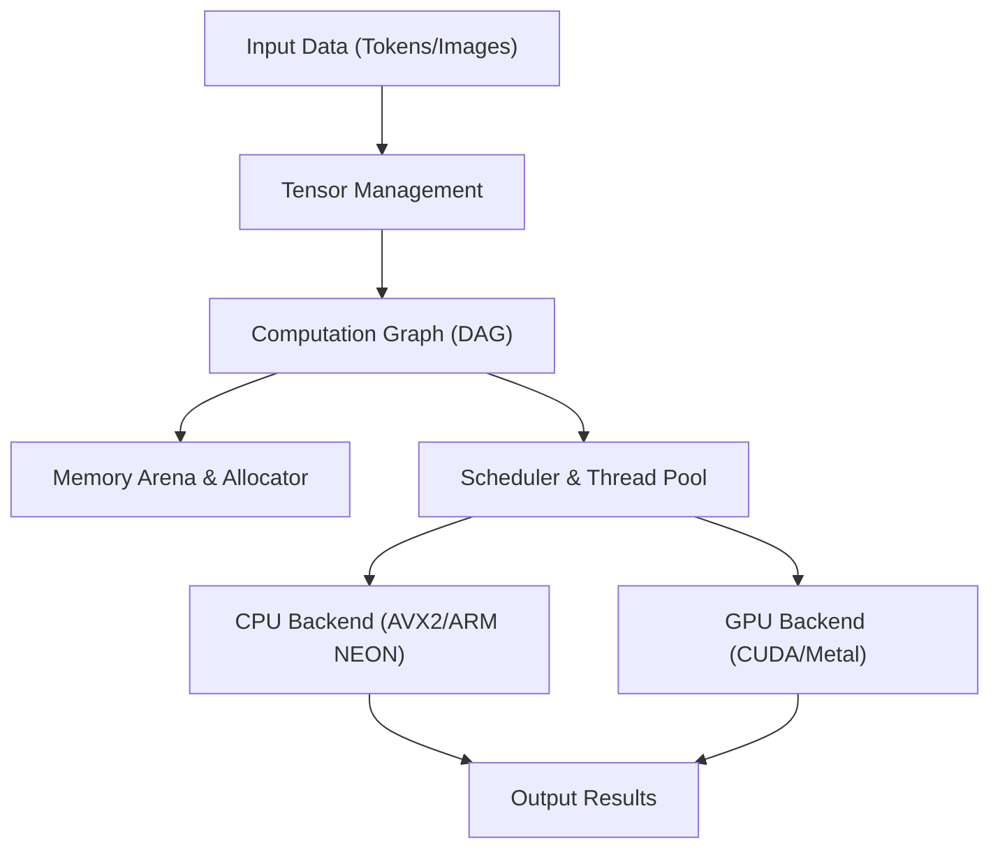
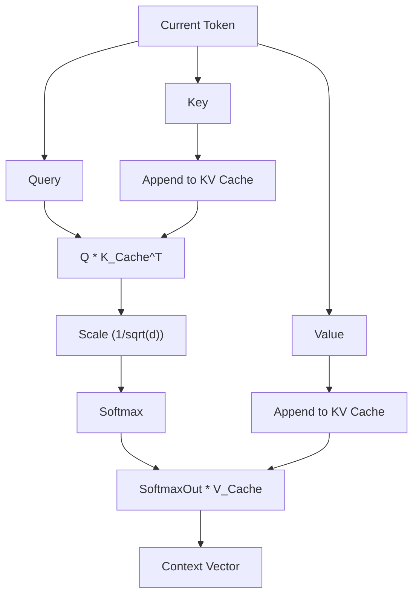

## 1. はじめに：なぜPythonを手放し、C++でAI推論エンジンを作るのか？

現代のAI開発において、Pythonはデファクトスタンダードです。PyTorchやTensorFlowといった強力なフレームワークの恩恵により、数行のコードで複雑なニューラルネットワークを構築・学習・推論させることができます。しかし、これらのフレームワークの裏側では、C++やCUDAといった低レイヤーの言語が計算の重い処理を担っています。Pythonはあくまで「糊（グルー）」の役割を果たしているに過ぎません。

では、なぜわざわざPythonを排除し、C++単独でAI推論エンジンを作る必要があるのでしょうか？それにはいくつかの強力な理由があります。

1. **極限のパフォーマンスと低レイテンシ**: PythonのGIL（Global Interpreter Lock）や動的型付けによるオーバーヘッドを完全に排除できます。特にリアルタイム性が求められるシステムでは、ミリ秒単位の遅延が命取りになります。
2. **デプロイの容易さ**: Python環境（巨大なライブラリ群、依存関係の地獄）をエンドユーザーの環境に構築するのは非常に困難です。C++であれば、静的リンクされた単一の実行バイナリ（`.exe`やELFバイナリ）を配布するだけで済みます。
3. **エッジデバイスへの対応**: スマートフォンや組み込み機器、Raspberry Piのようなリソース制約の厳しい環境において、数ギガバイトものメモリを消費するPythonランタイムを動かす余裕はありません。
4. **ハードウェアの直接制御**: メモリアロケーションのタイミング、SIMD命令の明示的な利用、GPUとのメモリ転送の最適化など、低レイヤーの制御がC++なら可能です。

本記事では、Georgi Gerganov氏によって開発された「GGML」ライブラリのアーキテクチャに多大なインスピレーションを受けつつ、C++だけで大規模言語モデル（LLM）などを動かすための推論エンジンをスクラッチで構築していく過程を、技術的な深淵まで潜って解説します。

---

## 2. 推論エンジンのアーキテクチャ全体像

AIの推論処理は、本質的には「巨大な行列計算の連続」です。これを効率よく実行するためには、推論エンジンは以下のようなコンポーネントで構成される必要があります。



1. **テンソル（Tensor）管理**: 多次元配列のデータ構造と、次元ごとのストライド（Stride）を管理。
2. **計算グラフ（Computation Graph）**: ニューラルネットワークの各層の演算を、有向非巡回グラフ（DAG）として表現。
3. **メモリアリーナ（Memory Arena）**: 動的メモリ確保（`malloc`や`new`）のオーバーヘッドを避けるための、事前確保型メモリ管理機構。
4. **バックエンド（Backend）**: CPUやGPUなど、特定のハードウェアに最適化された演算の実装（カーネル）。

これらをC++の強力な機能（テンプレート、ポインタ演算、RAIIなど）を用いて組み上げていきます。

---

## 3. メモリ管理の極意：メモリアリーナとSIMDアライメント

推論エンジンにおけるメモリ管理は、パフォーマンスに直結する最も重要な要素の一つです。推論中、特にTransformerモデルの各層を通過する際、膨大な数の中間テンソルが生成されます。これを毎回標準の`malloc`で確保・解放していては、ヒープの断片化とOSのコンテキストスイッチによって致命的な速度低下を引き起こします。

そこで、「**メモリアリーナ（Memory Arena）**」というアプローチを採用します。これは推論開始時に必要な最大メモリ量を計算（または決め打ち）して一括確保し、ポインタのインクリメントだけでメモリを切り出していく手法です。

### 3.1 アライメントの重要性

現代のCPUは、SIMD（Single Instruction, Multiple Data）命令をサポートしています。Intel/AMDのAVX2/AVX-512や、ARMのNEONなどです。これらの命令は、256ビット（32バイト）や512ビット（64バイト）のデータを一度に処理しますが、処理対象のデータメモリが特定のバイト境界（通常は32バイトや64バイト）にアライメント（整列）されている必要があります。

以下は、アライメントを考慮したメモリアリーナのC++実装例です。

```cpp
#include <cstdint>
#include <cstddef>
#include <stdexcept>
#include <iostream>

struct MemoryArena {
    size_t size;
    size_t offset;
    uint8_t* data;

    MemoryArena(size_t size) : size(size), offset(0) {
        // POSIX系なら posix_memalign、Windowsなら _aligned_malloc を使用
#ifdef _WIN32
        data = static_cast<uint8_t*>(_aligned_malloc(size, 64));
#else
        if (posix_memalign(reinterpret_cast<void**>(&data), 64, size) != 0) {
            throw std::bad_alloc();
        }
#endif
    }

    ~MemoryArena() {
#ifdef _WIN32
        _aligned_free(data);
#else
        free(data);
#endif
    }

    void* allocate(size_t bytes, size_t alignment = 64) {
        // アライメントの計算（パディングを求める）
        size_t pad = (alignment - (offset % alignment)) % alignment;
        if (offset + pad + bytes > size) {
            throw std::runtime_error("OOM: MemoryArena out of memory");
        }
        offset += pad;
        void* ptr = data + offset;
        offset += bytes;
        return ptr;
    }
    
    void reset() {
        offset = 0; // メモリの解放はポインタを戻すだけ（O(1)）
    }
};
```

このように、テンソル作成時には必ずこのアリーナ経由でメモリを取得します。推論の各ステップ（トークン生成ごとなど）が終わるたびに `reset()` を呼ぶだけで、瞬時にメモリを再利用できるのです。

---

## 4. テンソルデータ構造とストライドの魔法

テンソルはスカラー、ベクトル、行列を一般化した概念です。実装において重要なのは、実際のデータがメモリ上に**1次元の連続した配列**として配置されている一方で、それを多次元として解釈するための「ストライド（Stride）」という概念を持つことです。

```cpp
enum class DataType {
    FP32,
    FP16,
    INT8,  // 量子化用
    INT4   // 量子化用
};

struct Tensor {
    int n_dims;           // 次元の数
    int64_t ne[4];        // 各次元の要素数 (Number of Elements)
    size_t nb[4];         // 各次元のストライド (Number of Bytes)
    DataType type;        // データ型
    void* data;           // ペイロードへのポインタ
    
    // 計算グラフ用
    enum OpType op;
    Tensor* src0;
    Tensor* src1;
};
```

ストライド `nb[i]` は、次元 `i` において隣接する要素間のメモリ上のバイト距離を表します。
例えば、要素数 $M \times N$ の行列（FP32、1要素4バイト）がRow-Major（行優先）で格納されている場合、ストライドは以下のようになります。
- `nb[0]` = 4 (バイト)  ：列方向への移動
- `nb[1]` = $N \times 4$ (バイト) ：行方向への移動

これを利用することで、メモリのコピーを伴わずに「転置（Transpose）」や「ビュー（View）」といった操作をストライドの数値を入れ替えるだけで実現できます。非常にエレガントかつ高速です。

---

## 5. 計算グラフ（DAG）の構築と遅延評価

PyTorchなどと同様に、我々の推論エンジンも「Define-by-Run」に近い遅延評価（Lazy Evaluation）を採用します。つまり、演算関数を呼び出した時点では計算を行わず、グラフ（ノード間の依存関係）だけを構築します。

```cpp
Tensor* tensor_add(MemoryArena& arena, Tensor* a, Tensor* b) {
    Tensor* out = create_tensor(arena, a->type, a->n_dims, a->ne);
    out->op = OpType::ADD;
    out->src0 = a;
    out->src1 = b;
    return out;
}

Tensor* tensor_mul_mat(MemoryArena& arena, Tensor* a, Tensor* b) {
    // bは転置されていることが多い
    int64_t ne[2] = { a->ne[0], b->ne[1] };
    Tensor* out = create_tensor(arena, a->type, 2, ne);
    out->op = OpType::MUL_MAT;
    out->src0 = a;
    out->src1 = b;
    return out;
}
```

推論処理のフローは以下のようになります。


グラフを評価する際（フォワードパス）は、トポロジカルソートを用いて依存関係のないノードから順に処理を実行します。推論のみであればバックプロパゲーション用の勾配を保持する必要がないため、メモリ管理は非常にシンプルになります。

---

## 6. 数学と最適化の核心：行列積 (GEMM) 

AI推論の計算量の90%以上は、行列乗算（GEMM: General Matrix Multiply）に費やされます。Transformerモデルの中核であるアテンション機構もフィードフォワードネットワーク（FFN）も、突き詰めれば巨大な行列積です。

2つの行列 $A$ (サイズ $M \times K$) と $B$ (サイズ $K \times N$) の積 $C = A B$ (サイズ $M \times N$) は、数式で表すと以下のようになります。

$$
C_{i,j} = \sum_{k=0}^{K-1} A_{i,k} \cdot B_{k,j}
$$

これを素朴な三重ループで実装すると、キャッシュミスが頻発しパフォーマンスが全く出ません。

### 6.1 CPUでのキャッシュブロッキングとSIMD最適化

CPUでGEMMを高速化するための基本戦略は以下の通りです。
1. **ループタイリング（キャッシュブロッキング）**: L1/L2キャッシュに収まる小さなブロックに行列を分割して計算します。
2. **データのパック**: メモリアクセスパターンが連続になるように、内部的にデータを並べ替えます。
3. **SIMDの活用**: AVX-512における `_mm512_fmadd_ps` のようなFMA（Fused Multiply-Add）命令を使い、一度のクロックサイクルで多数の積和演算をこなします。

C++とSIMD Intrinsicsを用いた、単純化されたベクトルの内積（Dot Product）の例を示します。

```cpp
#include <immintrin.h> // AVX命令用

// AVX2を用いたFP32の高速内積
float dot_product_avx2(const float* a, const float* b, int n) {
    __m256 sum256 = _mm256_setzero_ps();
    int i = 0;
    
    // 8要素ずつ一度に処理（256ビット = 32バイト = 8 * 4バイト）
    for (; i <= n - 8; i += 8) {
        __m256 va = _mm256_loadu_ps(a + i);
        __m256 vb = _mm256_loadu_ps(b + i);
        // FMA命令: sum256 = va * vb + sum256
        sum256 = _mm256_fmadd_ps(va, vb, sum256);
    }
    
    // SIMDレジスタ内の値を水平加算
    float result[8];
    _mm256_storeu_ps(result, sum256);
    float dot = result[0] + result[1] + result[2] + result[3] + 
                result[4] + result[5] + result[6] + result[7];
                
    // 余りの処理
    for (; i < n; ++i) {
        dot += a[i] * b[i];
    }
    return dot;
}
```

この小さな工夫だけでも、素朴な実装に比べて数倍〜十数倍の速度向上が得られます。

---

## 7. ハードウェアの壁を越える：CUDAとMetalバックエンドの統合

純粋なC++実装だけでもCPU上ではそこそこ動きますが、LLMなどの巨大なモデルを実用的な速度（例：1秒間に20トークン以上生成）で動かすには、GPUの並列計算能力が不可欠です。そこで、我々のエンジンにバックエンドの抽象化レイヤーを導入します。

### 7.1 バックエンド抽象化

C++のポリモーフィズムを用いて、演算の実行器（Executor）を切り替えられるようにします。

```cpp
class Backend {
public:
    virtual ~Backend() = default;
    virtual void alloc_buffer(Tensor* t) = 0;
    virtual void free_buffer(Tensor* t) = 0;
    virtual void copy_to_device(Tensor* t) = 0;
    virtual void copy_to_host(Tensor* t) = 0;
    
    // 各種演算の実行
    virtual void compute_add(Tensor* src0, Tensor* src1, Tensor* dst) = 0;
    virtual void compute_mul_mat(Tensor* src0, Tensor* src1, Tensor* dst) = 0;
};
```

### 7.2 NVIDIA CUDA バックエンドの実装

NVIDIAのGPUを活用するために、CUDA C++拡張を用いてバックエンドを実装します。独自のカーネルを書くことも可能ですが、行列積に関してはNVIDIAが提供する最高峰のライブラリである「cuBLAS」を活用するのが最善手です。

```cpp
#include <cublas_v2.h>
#include <cuda_runtime.h>

class CUDABackend : public Backend {
private:
    cublasHandle_t handle;
    
public:
    CUDABackend() {
        cublasCreate(&handle);
    }
    
    ~CUDABackend() {
        cublasDestroy(handle);
    }
    
    void compute_mul_mat(Tensor* src0, Tensor* src1, Tensor* dst) override {
        // CUDAではデフォルトがColumn-Majorのため、パラメータに注意が必要
        const float alpha = 1.0f;
        const float beta = 0.0f;
        
        int m = src0->ne[0];
        int k = src0->ne[1];
        int n = src1->ne[1]; // src1は転置されている前提
        
        cublasSgemm(handle, CUBLAS_OP_T, CUBLAS_OP_N,
                    m, n, k,
                    &alpha,
                    (const float*)src0->data, k,
                    (const float*)src1->data, k,
                    &beta,
                    (float*)dst->data, m);
        cudaDeviceSynchronize();
    }
};
```
CUDAメモリとホスト（CPU）メモリ間のデータ転送（`cudaMemcpy`）は非常に重いため、推論中は極力全てのウェイト（重みテンソル）と中間テンソルをVRAM上に保持し続ける設計が重要になります。

### 7.3 Apple Silicon (Metal) バックエンド

近年、MacのM1/M2/M3チップ（Apple Silicon）はAI推論機として非常に優秀です。その理由は「ユニファイドメモリ」にあります。CPUとGPUが同一のメモリ領域を共有しているため、前述したCUDAのようなPCIeバス経由での高コストなホスト・デバイス間のメモリ転送が完全に不要になります。

C++からMetalを呼び出すには、Objective-C++ (`.mm` ファイル) をブリッジとして使用するか、`metal-cpp`ライブラリを利用します。
MetalのCompute Shader（`.metal`ファイルにC++ライクに記述）を用いてカーネルを記述します。

```cpp
// Metalシェーダ (kernel.metal)
#include <metal_stdlib>
using namespace metal;

kernel void mul_mat_kernel(
    device const float* A [[buffer(0)]],
    device const float* B [[buffer(1)]],
    device float* C [[buffer(2)]],
    constant uint3& dims [[buffer(3)]],
    uint2 gid [[thread_position_in_grid]]
) {
    uint m = dims.x; uint k = dims.y; uint n = dims.z;
    uint row = gid.y; uint col = gid.x;
    
    if (row < m && col < n) {
        float sum = 0.0;
        for (uint i = 0; i < k; ++i) {
            sum += A[row * k + i] * B[i * n + col]; // 簡略化
        }
        C[row * n + col] = sum;
    }
}
```

Apple Silicon環境では、MPS（Metal Performance Shaders）という行列積用の最適化ライブラリも提供されているため、実運用ではこれを利用することで驚異的な推論速度を叩き出すことができます。

---

## 8. Transformerモデル特有の処理：AttentionとKVキャッシュ

LLaMA 2/3やGPTといった最先端のLLMはTransformerアーキテクチャに基づいています。これをC++で実装するためには、以下の数式で表される「Scaled Dot-Product Attention」の構築が必須です。

$$
\text{Attention}(Q, K, V) = \text{softmax}\left(\frac{QK^T}{\sqrt{d_k}}\right)V
$$

また、自己回帰型（Autoregressive）のトークン生成では、過去のトークンの計算結果（KeyとValue）を保持しておく必要があります。これを「**KVキャッシュ（Key-Value Cache）**」と呼びます。



KVキャッシュのメモリ確保も、事前に最大コンテキスト長（例えば4096や8192トークン）分のメモリ空間をアリーナに確保しておくリングバッファのような運用を行います。これにより、生成ステップごとの再配置を防ぐことができます。

また、位置エンコーディング（Positional Encoding）には近年主流となっている「RoPE（Rotary Position Embedding）」を実装します。これは複素空間での回転ベクトルとして位置情報を埋め込む手法で、C++での `sin` および `cos` 関数の呼び出し最適化（ルックアップテーブル化など）がパフォーマンスの鍵を握ります。

---

## 9. モデルの量子化（Quantization）による極限の最適化

大規模モデル（例えば70億パラメータのLLaMAモデル）をFP32（32ビット浮動小数点）のまま読み込むと、重みだけで約28GBのメモリ（VRAM）を消費します。さらにKVキャッシュや推論用バッファを含めると30GBを容易に超え、一般的なコンシューマ向けGPUでは実行不可能です。

そこで必須となるのが「**量子化（Quantization）**」です。GGMLフォーマットの真骨頂でもあります。

量子化とは、重みの精度を意図的に落とす技術です。
- **FP16 (16-bit)**: サイズ半減。ほぼ精度劣化なし。
- **INT8 (8-bit)**: サイズ1/4。僅かな劣化。
- **INT4 (4-bit)**: サイズ1/8。独自のブロッキングとスケーリングファクターを用いれば実用的な推論が可能。

推論エンジン側では、メモリからINT4（またはINT8）で圧縮されたウェイトを読み出し、**CPUまたはGPUのレジスタにロードした直後にFP16またはFP32に展開（Dequantize）して計算**を行います。

驚くべきことに、計算量を増やしてでもメモリから読み込むデータ量を減らした方が速くなります。これは現代のハードウェアにおいて、推論タスクのボトルネックが「計算力（Compute Bound）」ではなく「**メモリ帯域幅（Memory Bandwidth Bound）**」にあるからです。INT4量子化を施したC++実装のエンジンであれば、8GB VRAMのMacBook AirなどでもサクサクとローカルLLMを動かすことが可能になります。

---

## 10. パフォーマンスチューニング：NUMAアーキテクチャとスレッドプール

CPUを用いた推論を行う場合、マルチスレッド化は必須です。しかし、単純に `std::thread` を多数起動するだけでは最適とは言えません。

現代のマルチソケットサーバーやRyzen ThreadripperのようなハイエンドCPUでは、**NUMA（Non-Uniform Memory Access）** アーキテクチャが採用されています。あるCPUコアから物理的に近いメモリ（ローカルメモリ）へのアクセスは高速ですが、別のプロセッサに紐付いたメモリへのアクセスは極端に遅くなります。

高度なC++推論エンジンでは、以下のテクニックを駆使します。
1. **スレッドピンニング（Thread Pinning）**: 各スレッドを特定のCPUコアに固定（Affinityを設定）し、コンテキストスイッチによるキャッシュ破棄を防ぐ。
2. **NUMAアウェアなアロケーション**: データを処理するスレッドと同じNUMAノード上にメモリを確保する。
3. **ワークスティーリング型スレッドプール**: 計算グラフの各ノードを細かなタスクに分割し、空いているスレッドが自動的にタスクを奪取して実行する効率的なスケジューラを実装。

これらを駆使することで、CPU使用率を100%付近にピタリと張り付かせ、理論値に近いスループットを叩き出すことができます。

---

## 11. まとめ：C++の「筋肉」でAIを駆動する楽しさ

Pythonは確かに便利です。研究開発やプロトタイピングにおいて、その生産性に敵う言語はありません。しかし、出来上がったモデルを「実世界で、効率よく、あらゆるデバイスで動かす」というフェーズに移行した瞬間、C++の出番がやってきます。

メモリのバイト列を直接操作し、SIMD命令でレジスタを限界まで叩き、GPUのVRAM帯域幅と格闘しながら作り上げた推論エンジンが、コンソール上に次々と自然な日本語のテキスト（トークン）を生成していくのを見た時の達成感は、Pythonのフレームワークで `model.generate()` を呼び出した時には決して得られない「エンジニアとしての純粋な喜び」があります。

「Black Box」となりがちなAI技術ですが、テンソルの演算からメモリ確保に至るまですべてを自分の手でC++で書き上げることで、LLMがどのようにして「考えている」のか、その真のメカニズムを深く理解することができます。

もしあなたがC++の基礎知識を持っていて、現在のAI技術に強い興味があるなら、ぜひ自作の推論エンジンの開発に挑戦してみてください。GGMLやllama.cppのソースコードは、最高の生きた教科書になるはずです。

**さあ、Pythonの重いランタイムを捨てて、C++の筋肉で最先端のAIを走らせましょう！**
