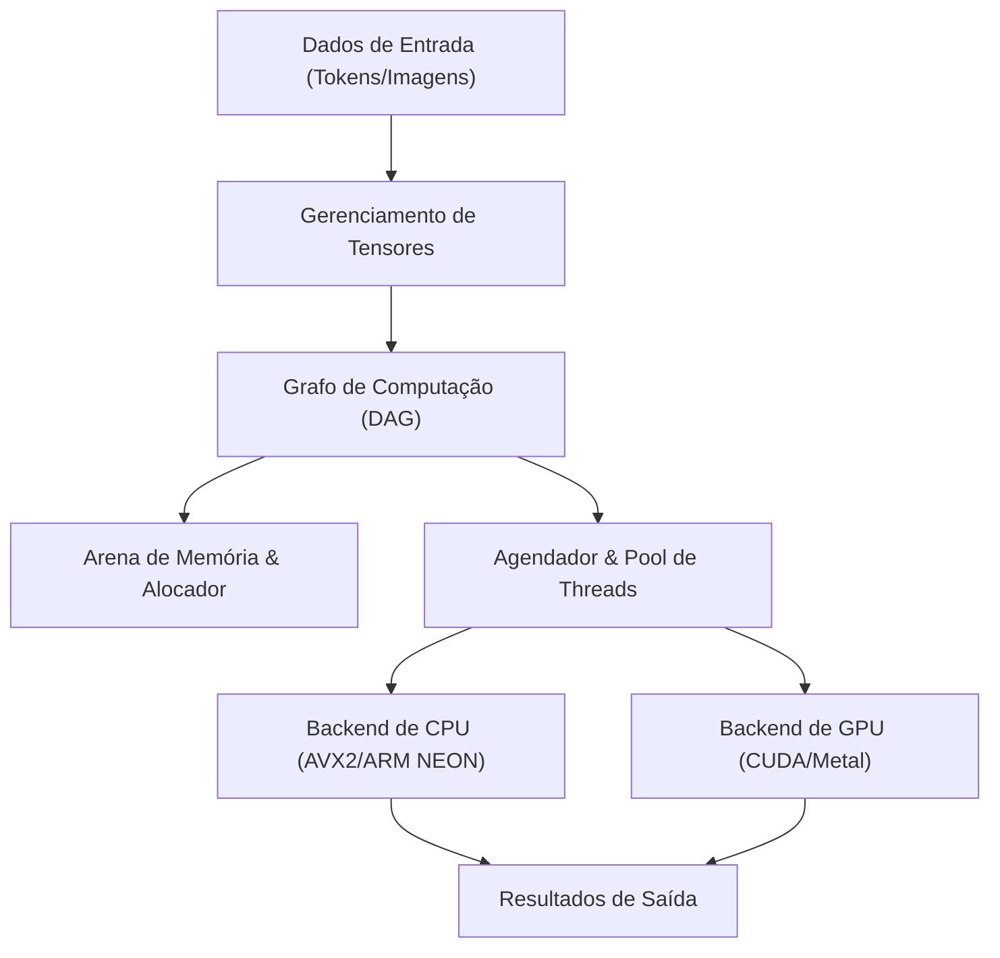
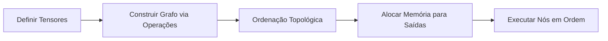
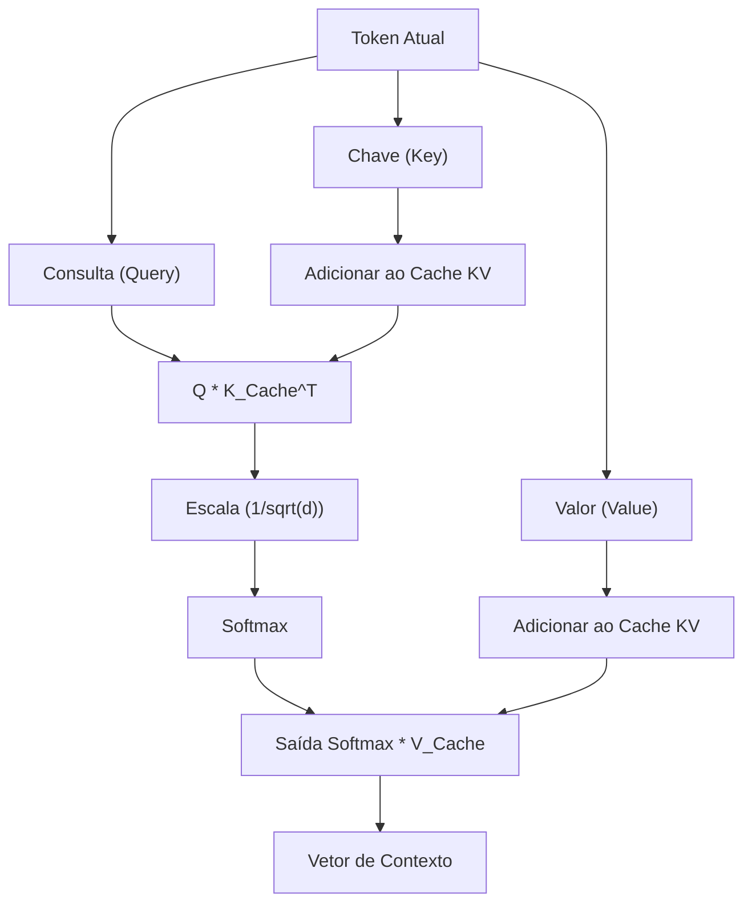

## 1. Introdução: Por que abandonar o Python e criar um motor de inferência de IA em C++?

No desenvolvimento moderno de IA, o Python é o padrão de fato. Graças a frameworks poderosos como PyTorch e TensorFlow, é possível construir, treinar e inferir redes neurais complexas com apenas algumas linhas de código. No entanto, por trás desses frameworks, linguagens de baixo nível como C++ e CUDA estão lidando com o processamento pesado de cálculos. O Python atua apenas como uma "cola" (glue).

Então, por que se dar ao trabalho de eliminar o Python e construir um motor de inferência de IA exclusivamente em C++? Existem várias razões fortes para isso.

1. **Desempenho extremo e baixa latência**: Você pode eliminar completamente o overhead causado pelo GIL (Global Interpreter Lock) e pela tipagem dinâmica do Python. Especialmente em sistemas que exigem tempo real, atrasos de milissegundos podem ser fatal.
2. **Facilidade de implantação**: Configurar um ambiente Python (enormes bibliotecas, inferno de dependências) no ambiente do usuário final é extremamente difícil. Com o C++, basta distribuir um único binário executável (`.exe` ou binário ELF) vinculado estaticamente.
3. **Suporte a dispositivos de borda**: Em ambientes com severas restrições de recursos, como smartphones, dispositivos embarcados e Raspberry Pi, não há margem para executar um runtime Python que consome vários gigabytes de memória.
4. **Controle direto de hardware**: O controle de baixo nível, como o tempo de alocação de memória, uso explícito de instruções SIMD e otimização de transferências de memória com a GPU, é possível em C++.

Neste artigo, inspirando-nos muito na arquitetura da biblioteca "GGML" desenvolvida por Georgi Gerganov, explicaremos profundamente o processo de construir do zero um motor de inferência para executar Modelos de Linguagem de Grande Escala (LLMs) apenas com C++, mergulhando nas profundezas técnicas.

---

## 2. Visão geral da arquitetura do motor de inferência

O processamento de inferência de IA é, essencialmente, uma "série contínua de cálculos de matrizes gigantes". Para executar isso de forma eficiente, o motor de inferência precisa ser composto pelos seguintes componentes.



1. **Gerenciamento de Tensores (Tensor)**: Gerencia a estrutura de dados de arrays multidimensionais e o passo (Stride) de cada dimensão.
2. **Grafo de Computação (Computation Graph)**: Representa as operações de cada camada da rede neural como um Grafo Acíclico Dirigido (DAG).
3. **Arena de Memória (Memory Arena)**: Um mecanismo de gerenciamento de memória pré-alocada para evitar o overhead de alocação dinâmica de memória (`malloc` ou `new`).
4. **Backend**: A implementação de operações otimizadas para hardwares específicos, como CPU ou GPU (Kernels).

Vamos montar tudo isso usando os poderosos recursos do C++ (templates, aritmética de ponteiros, RAII, etc.).

---

## 3. Os segredos do gerenciamento de memória: Arena de Memória e Alinhamento SIMD

O gerenciamento de memória em um motor de inferência é um dos fatores mais importantes que afeta diretamente o desempenho. Durante a inferência, um número colossal de tensores intermediários é gerado, especialmente ao passar por cada camada de um modelo Transformer. Se alocarmos e liberarmos isso a cada vez com o `malloc` padrão, a fragmentação do heap e as trocas de contexto do SO causarão uma lentidão fatal.

Portanto, adotamos a abordagem da "**Arena de Memória (Memory Arena)**". Trata-se de uma técnica em que calculamos (ou fixamos) a quantidade máxima de memória necessária no início da inferência, alocamos tudo de uma vez e separamos a memória apenas incrementando um ponteiro.

### 3.1 A importância do alinhamento

As CPUs modernas suportam instruções SIMD (Single Instruction, Multiple Data). Exemplos incluem AVX2/AVX-512 da Intel/AMD e NEON da ARM. Essas instruções processam 256 bits (32 bytes) ou 512 bits (64 bytes) de dados de uma só vez, mas a memória de dados a ser processada deve estar alinhada a um limite específico de bytes (geralmente 32 ou 64 bytes).

Abaixo, um exemplo de implementação em C++ de uma arena de memória considerando o alinhamento:

```cpp
#include <cstdint>
#include <cstddef>
#include <stdexcept>
#include <iostream>

struct MemoryArena {
    size_t size;
    size_t offset;
    uint8_t* data;

    MemoryArena(size_t size) : size(size), offset(0) {
        // POSIX系なら posix_memalign、Windowsなら _aligned_malloc を使用
#ifdef _WIN32
        data = static_cast<uint8_t*>(_aligned_malloc(size, 64));
#else
        if (posix_memalign(reinterpret_cast<void**>(&data), 64, size) != 0) {
            throw std::bad_alloc();
        }
#endif
    }

    ~MemoryArena() {
#ifdef _WIN32
        _aligned_free(data);
#else
        free(data);
#endif
    }

    void* allocate(size_t bytes, size_t alignment = 64) {
        // アライメントの計算（パディングを求める）
        size_t pad = (alignment - (offset % alignment)) % alignment;
        if (offset + pad + bytes > size) {
            throw std::runtime_error("OOM: MemoryArena out of memory");
        }
        offset += pad;
        void* ptr = data + offset;
        offset += bytes;
        return ptr;
    }
    
    void reset() {
        offset = 0; // メモリの解放はポインタを戻すだけ（O(1)）
    }
};
```

Dessa forma, sempre obteremos memória através desta arena ao criar tensores. Simplesmente chamando `reset()` ao final de cada etapa da inferência (como a cada geração de token), podemos reutilizar a memória instantaneamente.

---

## 4. Estrutura de dados do Tensor e a magia do Stride

O tensor é uma generalização dos conceitos de escalar, vetor e matriz. O importante na implementação é que, embora os dados reais estejam organizados na memória como um **array contíguo unidimensional**, eles possuem o conceito de "passo" (Stride) para interpretá-los como multidimensionais.

```cpp
enum class DataType {
    FP32,
    FP16,
    INT8,  // 量子化用
    INT4   // 量子化用
};

struct Tensor {
    int n_dims;           // 次元の数
    int64_t ne[4];        // 各次元の要素数 (Number of Elements)
    size_t nb[4];         // 各次元のストライド (Number of Bytes)
    DataType type;        // データ型
    void* data;           // ペイロードへのポインタ
    
    // 計算グラフ用
    enum OpType op;
    Tensor* src0;
    Tensor* src1;
};
```

O stride `nb[i]` representa a distância em bytes na memória entre elementos adjacentes na dimensão `i`.
Por exemplo, se uma matriz com elementos $M \times N$ (FP32, 4 bytes por elemento) for armazenada em Row-Major (ordem de linha principal), os strides serão os seguintes:
- `nb[0]` = 4 (bytes): movimento na direção da coluna
- `nb[1]` = $N \times 4$ (bytes): movimento na direção da linha

Ao utilizar isso, operações como "Transposição (Transpose)" e "Visão (View)" podem ser realizadas apenas trocando os valores de stride, sem envolver cópias de memória. É extremamente elegante e rápido.

---

## 5. Construção do Grafo de Computação (DAG) e Avaliação Preguiçosa

Assim como no PyTorch, nosso motor de inferência também adota uma avaliação preguiçosa (Lazy Evaluation) semelhante ao "Define-by-Run". Ou seja, no momento em que a função de operação é chamada, o cálculo não é realizado; constrói-se apenas o grafo (as dependências entre os nós).

```cpp
Tensor* tensor_add(MemoryArena& arena, Tensor* a, Tensor* b) {
    Tensor* out = create_tensor(arena, a->type, a->n_dims, a->ne);
    out->op = OpType::ADD;
    out->src0 = a;
    out->src1 = b;
    return out;
}

Tensor* tensor_mul_mat(MemoryArena& arena, Tensor* a, Tensor* b) {
    // bは転置されていることが多い
    int64_t ne[2] = { a->ne[0], b->ne[1] };
    Tensor* out = create_tensor(arena, a->type, 2, ne);
    out->op = OpType::MUL_MAT;
    out->src0 = a;
    out->src1 = b;
    return out;
}
```

O fluxo de processamento da inferência será o seguinte:



Ao avaliar o grafo (forward pass), utilizamos a ordenação topológica para executar o processamento em ordem a partir dos nós sem dependências. Se for apenas para inferência, não há necessidade de reter gradientes para retropropagação (backpropagation), o que torna o gerenciamento de memória extremamente simples.

---

## 6. O núcleo da matemática e otimização: Produto de Matrizes (GEMM) 

Mais de 90% da quantidade de cálculos de inferência de IA é gasta em multiplicação de matrizes (GEMM: General Matrix Multiply). O mecanismo de atenção (Attention), núcleo do modelo Transformer, bem como as redes feed-forward (FFN), resumem-se, em última análise, a produtos gigantes de matrizes.

O produto $C = A B$ (tamanho $M \times N$) de duas matrizes $A$ (tamanho $M \times K$) e $B$ (tamanho $K \times N$) pode ser expresso através da seguinte fórmula:

$$
C_{i,j} = \sum_{k=0}^{K-1} A_{i,k} \cdot B_{k,j}
$$

Se isso for implementado com um loop triplo ingênuo, os erros de cache (cache misses) ocorrerão com frequência, e não haverá nenhum desempenho.

### 6.1 Bloqueio de Cache (Cache Blocking) e Otimização SIMD na CPU

A estratégia básica para acelerar o GEMM na CPU é a seguinte:
1. **Loop Tiling (Bloqueio de Cache)**: A matriz é dividida em blocos menores que cabem no cache L1/L2 e calculados.
2. **Empacotamento de Dados (Data Packing)**: Os dados são reorganizados internamente para que o padrão de acesso à memória seja contíguo.
3. **Aproveitamento de SIMD**: Utilizamos instruções FMA (Fused Multiply-Add) como `_mm512_fmadd_ps` no AVX-512 para executar várias operações de multiplicar-adicionar em um único ciclo de clock.

Aqui está um exemplo simplificado do produto escalar (Dot Product) de vetores utilizando C++ e SIMD Intrinsics:

```cpp
#include <immintrin.h> // AVX命令用

// AVX2を用いたFP32の高速内積
float dot_product_avx2(const float* a, const float* b, int n) {
    __m256 sum256 = _mm256_setzero_ps();
    int i = 0;
    
    // 8要素ずつ一度に処理（256ビット = 32バイト = 8 * 4バイト）
    for (; i <= n - 8; i += 8) {
        __m256 va = _mm256_loadu_ps(a + i);
        __m256 vb = _mm256_loadu_ps(b + i);
        // FMA命令: sum256 = va * vb + sum256
        sum256 = _mm256_fmadd_ps(va, vb, sum256);
    }
    
    // SIMDレジスタ内の値を水平加算
    float result[8];
    _mm256_storeu_ps(result, sum256);
    float dot = result[0] + result[1] + result[2] + result[3] + 
                result[4] + result[5] + result[6] + result[7];
                
    // 余りの処理
    for (; i < n; ++i) {
        dot += a[i] * b[i];
    }
    return dot;
}
```

Apenas com esse pequeno esforço, podemos obter uma melhoria de velocidade de várias a dezenas de vezes em comparação com uma implementação ingênua.

---

## 7. Ultrapassando a barreira do hardware: Integração dos backends CUDA e Metal

Embora uma implementação puramente em C++ já funcione consideravelmente bem na CPU, o poder de computação paralela das GPUs é indispensável para executar modelos gigantes como LLMs a velocidades práticas (ex.: gerar 20 tokens ou mais por segundo). Por isso, introduziremos uma camada de abstração de backend em nosso motor.

### 7.1 Abstração de Backend

Usando o polimorfismo do C++, permitiremos a troca do executor das operações (Executor).

```cpp
class Backend {
public:
    virtual ~Backend() = default;
    virtual void alloc_buffer(Tensor* t) = 0;
    virtual void free_buffer(Tensor* t) = 0;
    virtual void copy_to_device(Tensor* t) = 0;
    virtual void copy_to_host(Tensor* t) = 0;
    
    // 各種演算の実行
    virtual void compute_add(Tensor* src0, Tensor* src1, Tensor* dst) = 0;
    virtual void compute_mul_mat(Tensor* src0, Tensor* src1, Tensor* dst) = 0;
};
```

### 7.2 Implementação do Backend NVIDIA CUDA

Para utilizar as GPUs da NVIDIA, implementaremos o backend usando a extensão CUDA C++. Embora seja possível escrever nossos próprios kernels, a melhor abordagem em relação à multiplicação de matrizes é aproveitar a "cuBLAS", a biblioteca de ponta fornecida pela NVIDIA.

```cpp
#include <cublas_v2.h>
#include <cuda_runtime.h>

class CUDABackend : public Backend {
private:
    cublasHandle_t handle;
    
public:
    CUDABackend() {
        cublasCreate(&handle);
    }
    
    ~CUDABackend() {
        cublasDestroy(handle);
    }
    
    void compute_mul_mat(Tensor* src0, Tensor* src1, Tensor* dst) override {
        // CUDAではデフォルトがColumn-Majorのため、パラメータに注意が必要
        const float alpha = 1.0f;
        const float beta = 0.0f;
        
        int m = src0->ne[0];
        int k = src0->ne[1];
        int n = src1->ne[1]; // src1は転置されている前提
        
        cublasSgemm(handle, CUBLAS_OP_T, CUBLAS_OP_N,
                    m, n, k,
                    &alpha,
                    (const float*)src0->data, k,
                    (const float*)src1->data, k,
                    &beta,
                    (float*)dst->data, m);
        cudaDeviceSynchronize();
    }
};
```
Como a transferência de dados (`cudaMemcpy`) entre a memória CUDA e a memória host (CPU) é muito pesada, é importante projetar para manter ao máximo todos os pesos (tensores de peso) e tensores intermediários na VRAM durante a inferência.

### 7.3 Backend Apple Silicon (Metal)

Nos últimos anos, os chips M1/M2/M3 do Mac (Apple Silicon) têm se mostrado excelentes como máquinas de inferência de IA. A razão para isso está na "memória unificada" (Unified Memory). Como a CPU e a GPU compartilham a mesma área de memória, elimina-se totalmente a necessidade de transferências de memória onerosas entre host e dispositivo através do barramento PCIe, como acontece com CUDA.

Para chamar o Metal a partir do C++, usamos Objective-C++ (arquivos `.mm`) como ponte ou utilizamos a biblioteca `metal-cpp`.
Escrevemos o kernel utilizando o Compute Shader do Metal (escrito em arquivos `.metal` de forma semelhante ao C++).

```cpp
// Metalシェーダ (kernel.metal)
#include <metal_stdlib>
using namespace metal;

kernel void mul_mat_kernel(
    device const float* A [[buffer(0)]],
    device const float* B [[buffer(1)]],
    device float* C [[buffer(2)]],
    constant uint3& dims [[buffer(3)]],
    uint2 gid [[thread_position_in_grid]]
) {
    uint m = dims.x; uint k = dims.y; uint n = dims.z;
    uint row = gid.y; uint col = gid.x;
    
    if (row < m && col < n) {
        float sum = 0.0;
        for (uint i = 0; i < k; ++i) {
            sum += A[row * k + i] * B[i * n + col]; // 簡略化
        }
        C[row * n + col] = sum;
    }
}
```

Em ambientes Apple Silicon, uma biblioteca de otimização chamada MPS (Metal Performance Shaders) voltada para o produto de matrizes também é fornecida, e sua utilização na prática pode alcançar velocidades de inferência surpreendentes.

---

## 8. Processamento específico para modelos Transformer: Attention e Cache KV

Os LLMs de ponta, como LLaMA 2/3 e GPT, são baseados na arquitetura Transformer. Para implementar isso em C++, é indispensável construir o "Scaled Dot-Product Attention", expresso pela seguinte fórmula:

$$
\text{Attention}(Q, K, V) = \text{softmax}\left(\frac{QK^T}{\sqrt{d_k}}\right)V
$$

Além disso, na geração de tokens autorregressiva (Autoregressive), é necessário manter os resultados de cálculo (Key e Value) de tokens passados. A isso damos o nome de "**Cache KV (Key-Value Cache)**".



A alocação de memória para o Cache KV também deve operar como um buffer circular (ring buffer), garantindo antecipadamente na arena um espaço de memória equivalente ao comprimento máximo de contexto (por exemplo, 4096 ou 8192 tokens). Isso evita a necessidade de realocar memória a cada etapa de geração.

Além disso, para a Codificação Posicional (Positional Encoding), implementaremos o "RoPE (Rotary Position Embedding)", que tem se tornado a norma nos últimos anos. Esta técnica embute a informação de posição como um vetor de rotação num espaço complexo, e a otimização de chamadas de funções `sin` e `cos` em C++ (por exemplo, uso de tabelas de consulta / look-up tables) é a chave para a performance.

---

## 9. Otimização extrema por meio da Quantização (Quantization) de modelos

Se carregarmos um modelo de grande escala (por exemplo, o modelo LLaMA com 7 bilhões de parâmetros) em FP32 (ponto flutuante de 32 bits), ele consumirá cerca de 28 GB de memória (VRAM) apenas para os pesos. Ao incluir o cache KV e os buffers de inferência, ultrapassará facilmente os 30 GB, tornando-se inexequível em GPUs de uso comum para consumidores.

Aí entra a necessidade indispensável da "**Quantização (Quantization)**". Esse é, inclusive, o verdadeiro ponto forte do formato GGML.

A quantização é a técnica de reduzir intencionalmente a precisão dos pesos.
- **FP16 (16 bits)**: Tamanho reduzido pela metade. Quase nenhuma degradação de precisão.
- **INT8 (8 bits)**: 1/4 do tamanho. Leve degradação.
- **INT4 (4 bits)**: 1/8 do tamanho. Utilizando bloqueios e fatores de escala próprios, a inferência prática torna-se possível.

No lado do motor de inferência, lemos os pesos comprimidos em INT4 (ou INT8) da memória e, **imediatamente após carregá-los nos registradores da CPU ou GPU, expandimos (Desquantização/Dequantize) para FP16 ou FP32 para realizar os cálculos**.

Surpreendentemente, mesmo que o volume de cálculos aumente, reduzir a quantidade de dados lidos da memória torna o processo mais rápido. Isso ocorre porque o gargalo nas tarefas de inferência no hardware moderno não é o "Poder de Computação (Compute Bound)", mas sim a "**Largura de Banda da Memória (Memory Bandwidth Bound)**". Com um motor implementado em C++ utilizando quantização INT4, é possível executar LLMs locais suavemente até mesmo em um MacBook Air com 8 GB de RAM unificada.

---

## 10. Ajuste de desempenho (Performance Tuning): Arquitetura NUMA e Pool de Threads

Ao realizar inferência utilizando CPU, a implementação de multi-threading é obrigatória. No entanto, não podemos dizer que é o ideal simplesmente inicializar um grande número de `std::thread`.

Em servidores multi-soquete modernos ou CPUs de ponta como o Ryzen Threadripper, adota-se a arquitetura **NUMA (Non-Uniform Memory Access)**. O acesso de um núcleo de CPU para a memória fisicamente mais próxima (memória local) é rápido, mas o acesso à memória vinculada a outro processador será extremamente lento.

Em um motor de inferência C++ avançado, fazemos pleno uso das seguintes técnicas:
1. **Fixação de Threads (Thread Pinning)**: Fixa cada thread a um núcleo de CPU específico (definindo Afinidade/Affinity) para evitar a invalidação de cache causada por trocas de contexto.
2. **Alocação ciente de NUMA (NUMA-aware allocation)**: Garante a alocação de memória no mesmo nó NUMA que a thread que está processando os dados.
3. **Pool de threads do tipo Work-Stealing**: Divide cada nó do grafo de computação em pequenas tarefas e implementa um agendador eficiente onde threads ociosas capturam (roubam) tarefas automaticamente para execução.

Fazendo uso dessas técnicas, é possível manter a taxa de uso da CPU muito próxima de 100%, atingindo um rendimento (throughput) que se aproxima do valor teórico.

---

## 11. Conclusão: A alegria de conduzir a IA com os "músculos" do C++

É certo que o Python é conveniente. Não há linguagem que se iguale à sua produtividade na fase de pesquisa, desenvolvimento e prototipagem. Contudo, no instante em que passamos para a fase de "executar o modelo concluído no mundo real, de forma eficiente e em todos os dispositivos", chega o momento de usar o C++.

Manipular a sequência de bytes na memória de forma direta, forçar os registradores ao limite com instruções SIMD e lutar contra a largura de banda da VRAM da GPU para construir um motor de inferência que vai gerando textos (tokens) em japonês natural (ou qualquer outro idioma) sequencialmente no console... A sensação de realização ao ver isso acontecer proporciona uma "alegria genuína de engenheiro", a qual nunca se obterá simplesmente chamando `model.generate()` em um framework Python.

Embora a tecnologia de IA tenda a se tornar uma "Caixa Preta (Black Box)", escrever tudo à mão em C++, desde as operações de tensores até a alocação de memória, permite a você entender profundamente o verdadeiro mecanismo de como um LLM "pensa".

Se você tem conhecimentos básicos de C++ e possui um forte interesse nas atuais tecnologias de IA, experimente o desafio de desenvolver seu próprio motor de inferência. Os códigos-fonte do GGML ou llama.cpp servirão, sem dúvida, como os melhores livros didáticos vivos disponíveis.

**Vamos lá, jogue fora os pesados runtimes do Python e faça a IA de ponta rodar com os músculos do C++!**
