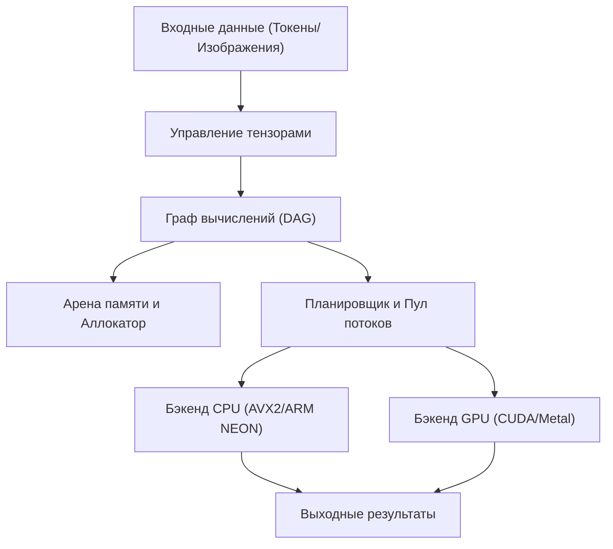
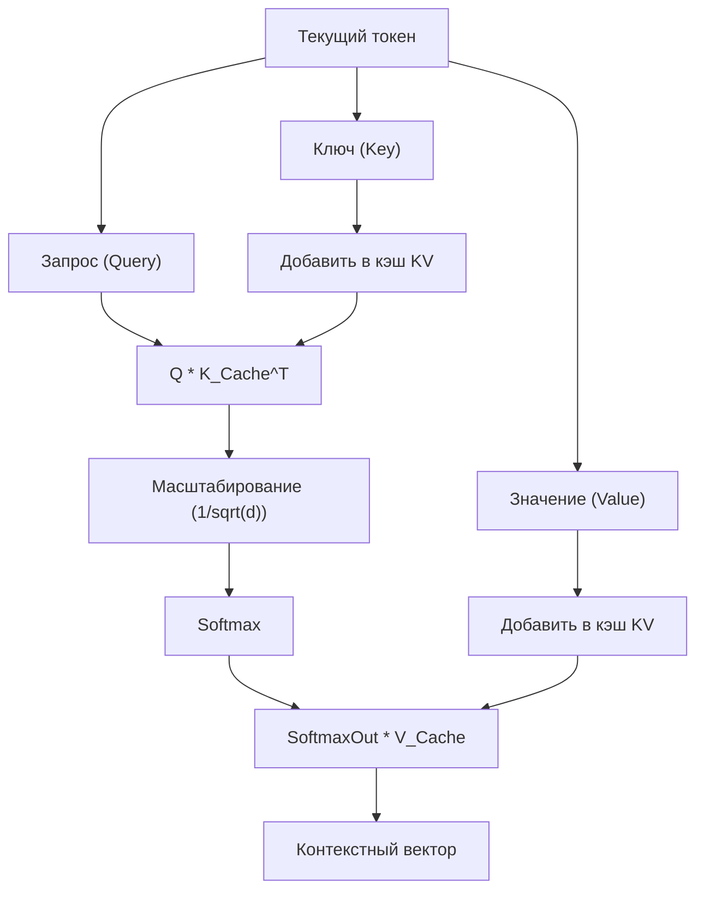

## 1. Введение: Почему стоит отказаться от Python и создать движок ИИ-вывода на C++?

В современной разработке ИИ Python является стандартом де-факто. Благодаря мощным фреймворкам, таким как PyTorch и TensorFlow, можно создавать, обучать и запускать сложные нейронные сети всего несколькими строками кода. Однако за кулисами этих фреймворков стоят низкоуровневые языки, такие как C++ и CUDA, которые берут на себя тяжелые вычислительные процессы. Python играет лишь роль «клея».

Так зачем же отказываться от Python и создавать движок ИИ-вывода исключительно на C++? Для этого есть несколько веских причин:

1. **Максимальная производительность и низкая задержка**: Полностью устраняются накладные расходы, связанные с GIL (Global Interpreter Lock) в Python и динамической типизацией. Особенно в системах, требующих работы в реальном времени, задержка в миллисекундах может быть критичной.
2. **Простота развертывания**: Настроить среду Python (огромное количество библиотек, ад зависимостей) на стороне конечного пользователя очень сложно. В случае C++ достаточно распространять один скомпилированный исполняемый бинарный файл (с расширением `.exe` или ELF-бинарник) со статической линковкой.
3. **Поддержка периферийных устройств (Edge Devices)**: В средах с жесткими ограничениями ресурсов, таких как смартфоны, встраиваемые устройства или Raspberry Pi, нет возможности запускать среду выполнения Python, потребляющую гигабайты памяти.
4. **Прямое управление оборудованием**: C++ позволяет осуществлять низкоуровневый контроль, такой как выбор времени выделения памяти, явное использование SIMD-инструкций и оптимизация передачи данных в память GPU.

В этой статье мы подробно, погружаясь в технические глубины, рассмотрим процесс создания с нуля движка вывода для запуска больших языковых моделей (LLM) исключительно на C++, черпая огромное вдохновение в архитектуре библиотеки «GGML», разработанной Георгием Гергановым (Georgi Gerganov).

---

## 2. Общая архитектура движка вывода

Процесс вывода ИИ по своей сути представляет собой «непрерывную серию огромных матричных вычислений». Для эффективного выполнения этой задачи движок вывода должен состоять из следующих компонентов:



1. **Управление тензорами (Tensor Management)**: Управление структурами данных многомерных массивов и шагом (Stride) для каждого измерения.
2. **Граф вычислений (Computation Graph)**: Представление операций каждого слоя нейронной сети в виде направленного ациклического графа (DAG).
3. **Арена памяти (Memory Arena)**: Механизм предварительного выделения памяти, позволяющий избежать накладных расходов на динамическое выделение памяти (`malloc` или `new`).
4. **Бэкенд (Backend)**: Реализация вычислений (ядер), оптимизированная для конкретного оборудования, такого как CPU или GPU.

Мы будем собирать эти компоненты, используя мощные возможности C++ (шаблоны, адресная арифметика указателей, RAII и т.д.).

---

## 3. Секреты управления памяти: Арена памяти и SIMD-выравнивание

Управление памятью в движке вывода — один из самых важных факторов, напрямую влияющих на производительность. Во время вывода, особенно при прохождении через каждый слой модели Transformer, генерируется огромное количество промежуточных тензоров. Если каждый раз выделять и освобождать их с помощью стандартного `malloc`, фрагментация кучи и переключение контекста ОС приведут к фатальному падению скорости.

Поэтому мы применим подход, называемый «**Арена памяти (Memory Arena)**». Этот метод заключается в вычислении (или фиксированном задании) максимального объема памяти, необходимого в начале вывода, ее выделении одним блоком и последующем распределении памяти простым увеличением (инкрементом) указателя.

### 3.1 Важность выравнивания (Alignment)

Современные процессоры поддерживают SIMD-инструкции (Single Instruction, Multiple Data). К ним относятся AVX2/AVX-512 от Intel/AMD и NEON от ARM. Эти инструкции обрабатывают 256 бит (32 байта) или 512 бит (64 байта) данных за один раз, но требуют, чтобы обрабатываемые данные в памяти были выровнены по определенной границе байтов (обычно 32 или 64 байта).

Ниже приведен пример реализации арены памяти на C++ с учетом выравнивания.

```cpp
#include <cstdint>
#include <cstddef>
#include <stdexcept>
#include <iostream>

struct MemoryArena {
    size_t size;
    size_t offset;
    uint8_t* data;

    MemoryArena(size_t size) : size(size), offset(0) {
        // Использование posix_memalign для POSIX систем и _aligned_malloc для Windows
#ifdef _WIN32
        data = static_cast<uint8_t*>(_aligned_malloc(size, 64));
#else
        if (posix_memalign(reinterpret_cast<void**>(&data), 64, size) != 0) {
            throw std::bad_alloc();
        }
#endif
    }

    ~MemoryArena() {
#ifdef _WIN32
        _aligned_free(data);
#else
        free(data);
#endif
    }

    void* allocate(size_t bytes, size_t alignment = 64) {
        // Вычисление выравнивания (определение отступа)
        size_t pad = (alignment - (offset % alignment)) % alignment;
        if (offset + pad + bytes > size) {
            throw std::runtime_error("OOM: MemoryArena out of memory");
        }
        offset += pad;
        void* ptr = data + offset;
        offset += bytes;
        return ptr;
    }
    
    void reset() {
        offset = 0; // Освобождение памяти — это просто возврат указателя (O(1))
    }
};
```

Таким образом, при создании тензора память всегда получается через эту арену. Просто вызывая `reset()` после завершения каждого шага вывода (например, генерации каждого токена), можно мгновенно повторно использовать память.

---

## 4. Магия структуры данных тензоров и шагов (Stride)

Тензор — это концепция, обобщающая скаляры, векторы и матрицы. Важным моментом в реализации является то, что фактические данные располагаются в памяти в виде **одномерного непрерывного массива**, но при этом существует понятие «шага (Stride)», позволяющее интерпретировать их как многомерные.

```cpp
enum class DataType {
    FP32,
    FP16,
    INT8,  // Для квантования
    INT4   // Для квантования
};

struct Tensor {
    int n_dims;           // Количество измерений
    int64_t ne[4];        // Количество элементов в каждом измерении (Number of Elements)
    size_t nb[4];         // Шаг каждого измерения в байтах (Number of Bytes)
    DataType type;        // Тип данных
    void* data;           // Указатель на полезную нагрузку
    
    // Для графа вычислений
    enum OpType op;
    Tensor* src0;
    Tensor* src1;
};
```

Шаг `nb[i]` представляет собой расстояние в байтах в памяти между соседними элементами в измерении `i`.
Например, если матрица с количеством элементов $M \times N$ (FP32, 1 элемент = 4 байта) хранится в формате Row-Major (по строкам), шаги будут следующими:
- `nb[0]` = 4 (байта) : Перемещение по столбцам
- `nb[1]` = $N \times 4$ (байта) : Перемещение по строкам

Используя это, можно реализовать такие операции, как «Транспонирование (Transpose)» или «Представление (View)» без копирования памяти, просто поменяв местами значения шагов. Это очень элегантно и быстро.

---

## 5. Построение графа вычислений (DAG) и ленивые вычисления

Подобно PyTorch и другим, наш движок вывода также использует концепцию ленивых вычислений (Lazy Evaluation), близкую к «Define-by-Run». То есть, в момент вызова функции вычисления сами вычисления не выполняются, а строится только граф (зависимости между узлами).

```cpp
Tensor* tensor_add(MemoryArena& arena, Tensor* a, Tensor* b) {
    Tensor* out = create_tensor(arena, a->type, a->n_dims, a->ne);
    out->op = OpType::ADD;
    out->src0 = a;
    out->src1 = b;
    return out;
}

Tensor* tensor_mul_mat(MemoryArena& arena, Tensor* a, Tensor* b) {
    // b часто бывает транспонирован
    int64_t ne[2] = { a->ne[0], b->ne[1] };
    Tensor* out = create_tensor(arena, a->type, 2, ne);
    out->op = OpType::MUL_MAT;
    out->src0 = a;
    out->src1 = b;
    return out;
}
```

Поток процесса вывода выглядит следующим образом:


При оценке графа (прямой проход - forward pass) используется топологическая сортировка для последовательного выполнения узлов, начиная с тех, у которых нет зависимостей. Поскольку это только вывод, нет необходимости хранить градиенты для обратного распространения ошибки, что делает управление памятью очень простым.

---

## 6. Ядро математики и оптимизации: Умножение матриц (GEMM)

Более 90% вычислительной нагрузки при выводе ИИ тратится на общее умножение матриц (GEMM: General Matrix Multiply). Механизм внимания (Attention) и полносвязные сети (Feed-Forward Networks, FFN), являющиеся ядром моделей Transformer, в конечном итоге сводятся к огромным матричным умножениям.

Произведение $C = A B$ (размер $M \times N$) двух матриц $A$ (размер $M \times K$) и $B$ (размер $K \times N$) можно выразить математически следующим образом:

$$
C_{i,j} = \sum_{k=0}^{K-1} A_{i,k} \cdot B_{k,j}
$$

Если реализовать это в виде простого тройного цикла, будут постоянно возникать промахи кэша, и производительность будет нулевой.

### 6.1 Кэш-блокировка на CPU и оптимизация SIMD

Базовые стратегии для ускорения GEMM на CPU следующие:
1. **Разбиение циклов на тайлы (Кэш-блокировка - Cache Blocking)**: Разделение матрицы на небольшие блоки, помещающиеся в кэш L1/L2, и вычисление по ним.
2. **Упаковка данных (Data Packing)**: Внутренняя перестановка данных для обеспечения последовательного паттерна доступа к памяти.
3. **Использование SIMD**: Использование инструкций FMA (Fused Multiply-Add), таких как `_mm512_fmadd_ps` в AVX-512, для выполнения множества операций умножения-сложения за один тактовый цикл.

Ниже приведен пример упрощенного скалярного произведения векторов (Dot Product) с использованием C++ и SIMD Intrinsics.

```cpp
#include <immintrin.h> // Для инструкций AVX

// Быстрое скалярное произведение для FP32 с использованием AVX2
float dot_product_avx2(const float* a, const float* b, int n) {
    __m256 sum256 = _mm256_setzero_ps();
    int i = 0;
    
    // Обработка по 8 элементов за раз (256 бит = 32 байта = 8 * 4 байта)
    for (; i <= n - 8; i += 8) {
        __m256 va = _mm256_loadu_ps(a + i);
        __m256 vb = _mm256_loadu_ps(b + i);
        // Инструкция FMA: sum256 = va * vb + sum256
        sum256 = _mm256_fmadd_ps(va, vb, sum256);
    }
    
    // Горизонтальное сложение значений в SIMD регистре
    float result[8];
    _mm256_storeu_ps(result, sum256);
    float dot = result[0] + result[1] + result[2] + result[3] + 
                result[4] + result[5] + result[6] + result[7];
                
    // Обработка остатка
    for (; i < n; ++i) {
        dot += a[i] * b[i];
    }
    return dot;
}
```

Даже эта небольшая хитрость позволяет увеличить скорость в несколько, а то и в десяток раз по сравнению с наивной реализацией.

---

## 7. Преодоление аппаратных барьеров: Интеграция бэкендов CUDA и Metal

Хотя чистая реализация на C++ работает довольно неплохо на CPU, для запуска гигантских моделей, таких как LLM, с приемлемой скоростью (например, генерация 20 и более токенов в секунду) вычислительные возможности GPU становятся необходимыми. Для этого мы внедряем в наш движок уровень абстракции бэкендов.

### 7.1 Абстракция бэкенда

Используя полиморфизм в C++, мы можем переключать исполнителей операций (Executors).

```cpp
class Backend {
public:
    virtual ~Backend() = default;
    virtual void alloc_buffer(Tensor* t) = 0;
    virtual void free_buffer(Tensor* t) = 0;
    virtual void copy_to_device(Tensor* t) = 0;
    virtual void copy_to_host(Tensor* t) = 0;
    
    // Выполнение различных операций
    virtual void compute_add(Tensor* src0, Tensor* src1, Tensor* dst) = 0;
    virtual void compute_mul_mat(Tensor* src0, Tensor* src1, Tensor* dst) = 0;
};
```

### 7.2 Реализация бэкенда NVIDIA CUDA

Для использования графических процессоров NVIDIA мы реализуем бэкенд с помощью расширения CUDA C++. Можно написать собственные ядра, но для умножения матриц лучше всего использовать «cuBLAS» — библиотеку высшего класса, предоставляемую самой NVIDIA.

```cpp
#include <cublas_v2.h>
#include <cuda_runtime.h>

class CUDABackend : public Backend {
private:
    cublasHandle_t handle;
    
public:
    CUDABackend() {
        cublasCreate(&handle);
    }
    
    ~CUDABackend() {
        cublasDestroy(handle);
    }
    
    void compute_mul_mat(Tensor* src0, Tensor* src1, Tensor* dst) override {
        // В CUDA по умолчанию используется формат Column-Major, поэтому нужно быть осторожным с параметрами
        const float alpha = 1.0f;
        const float beta = 0.0f;
        
        int m = src0->ne[0];
        int k = src0->ne[1];
        int n = src1->ne[1]; // предполагается, что src1 транспонирован
        
        cublasSgemm(handle, CUBLAS_OP_T, CUBLAS_OP_N,
                    m, n, k,
                    &alpha,
                    (const float*)src0->data, k,
                    (const float*)src1->data, k,
                    &beta,
                    (float*)dst->data, m);
        cudaDeviceSynchronize();
    }
};
```
Передача данных (`cudaMemcpy`) между памятью CUDA и памятью хоста (CPU) очень «тяжелая», поэтому критически важен дизайн, при котором все веса (тензоры весов) и промежуточные тензоры по возможности хранятся в VRAM (видеопамяти) на протяжении всего вывода.

### 7.3 Бэкенд Apple Silicon (Metal)

В последние годы процессоры Mac M1/M2/M3 (Apple Silicon) показывают превосходные результаты в качестве машин для вывода ИИ. Причина кроется в их «объединенной памяти» (Unified Memory). Поскольку CPU и GPU делят одну и ту же область памяти, высокозатратная передача данных между хостом и устройством по шине PCIe, как в случае с CUDA, описанным выше, становится совершенно не нужной.

Для вызова Metal из C++ используется Objective-C++ (файлы `.mm`) в качестве моста, либо библиотека `metal-cpp`.
Мы описываем ядра с помощью Metal Compute Shader (написанных в файлах `.metal` в стиле C++).

```cpp
// Шейдер Metal (kernel.metal)
#include <metal_stdlib>
using namespace metal;

kernel void mul_mat_kernel(
    device const float* A [[buffer(0)]],
    device const float* B [[buffer(1)]],
    device float* C [[buffer(2)]],
    constant uint3& dims [[buffer(3)]],
    uint2 gid [[thread_position_in_grid]]
) {
    uint m = dims.x; uint k = dims.y; uint n = dims.z;
    uint row = gid.y; uint col = gid.x;
    
    if (row < m && col < n) {
        float sum = 0.0;
        for (uint i = 0; i < k; ++i) {
            sum += A[row * k + i] * B[i * n + col]; // Упрощено
        }
        C[row * n + col] = sum;
    }
}
```

В среде Apple Silicon также предоставляется библиотека оптимизации умножения матриц MPS (Metal Performance Shaders), поэтому при ее использовании в реальных задачах можно добиться потрясающей скорости вывода.

---

## 8. Специфическая обработка для моделей Transformer: Attention и кэш KV

Передовые LLM, такие как LLaMA 2/3 и GPT, основаны на архитектуре Transformer. Для реализации этого на C++ необходимо создать «Scaled Dot-Product Attention», который описывается следующей формулой:

$$
\text{Attention}(Q, K, V) = \text{softmax}\left(\frac{QK^T}{\sqrt{d_k}}\right)V
$$

Кроме того, при авторегрессионной (Autoregressive) генерации токенов необходимо сохранять результаты вычислений прошлых токенов (Key и Value). Это называется «**KV-кэшем (Key-Value Cache)**».



Для KV-кэша также применяется стратегия предварительного выделения в арене пространства памяти, достаточного для максимальной длины контекста (например, 4096 или 8192 токена), и его использование по принципу кольцевого буфера. Это предотвращает необходимость перераспределения памяти на каждом шаге генерации.

Кроме того, для позиционного кодирования (Positional Encoding) реализуется «RoPE (Rotary Position Embedding)», который стал мейнстримом в последние годы. Это метод встраивания информации о позиции в виде вектора вращения в комплексном пространстве, где ключом к производительности является оптимизация вызовов функций `sin` и `cos` в C++ (например, путем создания таблиц поиска).

---

## 9. Экстремальная оптимизация посредством квантования моделей (Quantization)

Если загрузить большую модель (например, модель LLaMA с 7 миллиардами параметров) в формате FP32 (32-битное число с плавающей запятой), то только веса займут около 28 ГБ памяти (VRAM). А если добавить к этому KV-кэш и буферы для вывода, объем легко превысит 30 ГБ, что делает выполнение на обычных потребительских видеокартах невозможным.

Здесь на помощь приходит «**Квантование (Quantization)**». Это истинная сила формата GGML.

Квантование — это технология намеренного снижения точности весов.
- **FP16 (16-бит)**: Размер уменьшается вдвое. Потеря точности практически отсутствует.
- **INT8 (8-бит)**: Размер уменьшается в 4 раза. Незначительная потеря точности.
- **INT4 (4-бит)**: Размер уменьшается в 8 раз. Использование уникальных факторов блокировки и масштабирования позволяет осуществлять вывод с приемлемым качеством.

На стороне движка вывода сжатые в INT4 (или INT8) веса считываются из памяти и **развертываются (Dequantize) в FP16 или FP32 сразу после их загрузки в регистры CPU или GPU**, после чего выполняются вычисления.

Удивительно, но выгоднее уменьшить объем данных, считываемых из памяти, даже ценой увеличения количества вычислений. Это связано с тем, что в современном оборудовании узким местом при задачах вывода является не «вычислительная мощность (Compute Bound)», а «**пропускная способность памяти (Memory Bandwidth Bound)**». Движок, реализованный на C++ с квантованием INT4, позволяет быстро запускать локальные LLM даже на MacBook Air с 8 ГБ объединенной памяти.

---

## 10. Тюнинг производительности: Архитектура NUMA и пул потоков

При выполнении вывода с использованием CPU многопоточность обязательна. Однако простого запуска множества `std::thread` будет недостаточно для достижения оптимальных результатов.

Современные многопроцессорные серверы и высокопроизводительные процессоры, такие как Ryzen Threadripper, используют архитектуру **NUMA (Non-Uniform Memory Access)**. Доступ ядра CPU к физически близкой к нему памяти (локальной памяти) осуществляется быстро, но доступ к памяти, привязанной к другому процессору, становится крайне медленным.

В продвинутых движках вывода на C++ используются следующие техники:
1. **Привязка потоков (Thread Pinning)**: Закрепление каждого потока за определенным ядром CPU (установка Affinity) для предотвращения сброса кэша из-за переключения контекста.
2. **NUMA-ориентированное выделение памяти**: Выделение памяти на том же узле NUMA, где находится поток, обрабатывающий данные.
3. **Пул потоков с кражей работы (Work-Stealing)**: Реализация эффективного планировщика, который разбивает каждый узел графа вычислений на мелкие задачи, и свободные потоки автоматически «крадут» и выполняют эти задачи.

Полное использование этих методов позволяет удерживать загрузку CPU близко к 100% и достигать пропускной способности, близкой к теоретическому максимуму.

---

## 11. Заключение: Удовольствие от работы с ИИ на «мускулах» C++

Python, безусловно, удобен. В области исследований и разработки, а также создания прототипов нет языка, способного сравниться с ним в продуктивности. Однако, как только вы переходите на этап, когда готовую модель необходимо «эффективно запускать в реальном мире на любых устройствах», наступает время для C++.

Когда вы видите, как движок вывода, созданный путем прямого манипулирования массивами байтов в памяти, максимального использования регистров через SIMD-инструкции и борьбы за пропускную способность VRAM графического процессора, один за другим генерирует на консоли токены естественного текста — вы испытываете чувство глубокого удовлетворения, «чистую радость инженера», которую невозможно получить, просто вызвав `model.generate()` во фреймворке Python.

Технологии ИИ часто кажутся «черным ящиком», но, написав все своими руками на C++, от тензорных операций до выделения памяти, вы сможете глубоко понять истинные механизмы того, как «мыслит» LLM.

Если вы обладаете базовыми знаниями C++ и глубоко интересуетесь современными технологиями ИИ, обязательно попробуйте создать свой собственный движок вывода. Исходный код GGML и llama.cpp станет для вас лучшим живым учебником.

**Итак, отбросьте тяжелую среду выполнения Python и позвольте передовому ИИ работать на мощных мускулах C++!**
