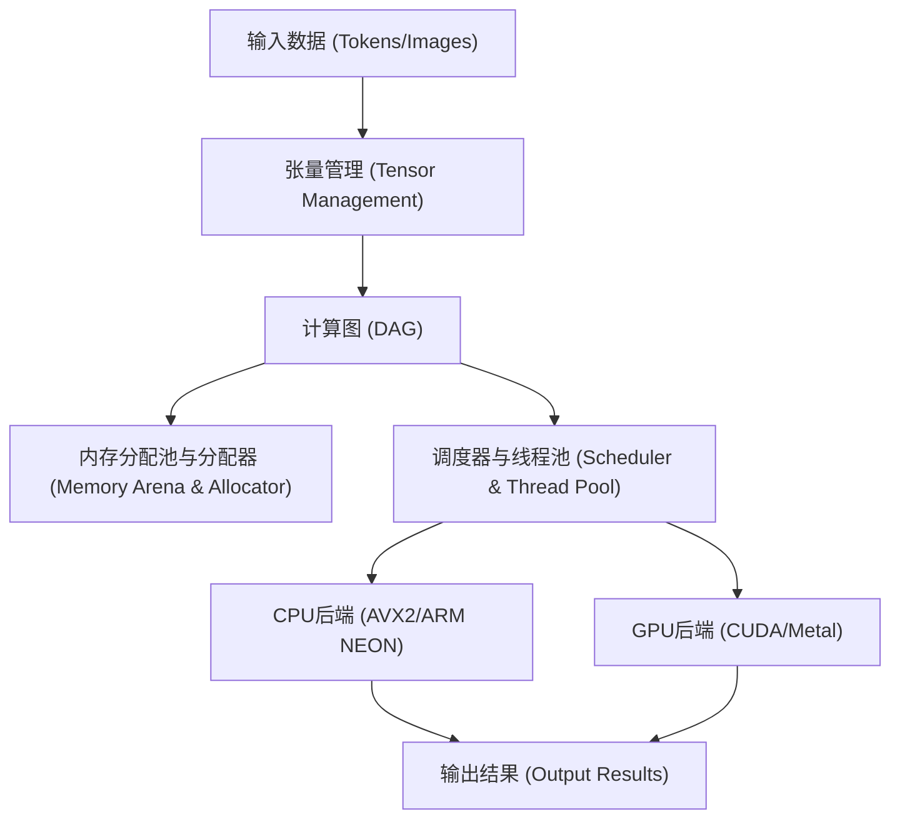
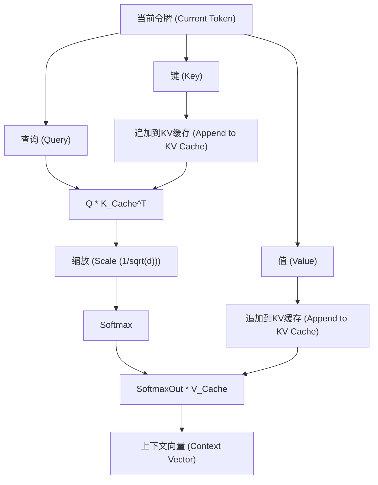

## 1. 引言：为什么要抛弃Python，用C++构建AI推理引擎？

在现代AI开发中，Python是事实上的标准。得益于PyTorch和TensorFlow等强大的框架，只需几行代码就能构建、训练和推理复杂的神经网络。然而，在这些框架的背后，是C++和CUDA等底层语言在承担着繁重的计算处理。Python只不过是发挥了“胶水（Glue）”的作用。

那么，为什么非要排除Python，单独使用C++来构建AI推理引擎呢？这有几个强有力的理由。

1. **极致的性能和低延迟**: 可以完全消除Python的GIL（全局解释器锁）和动态类型带来的开销。特别是在需要实时性的系统中，毫秒级的延迟是致命的。
2. **部署的便利性**: 在最终用户的环境中构建Python环境（庞大的库、依赖地狱）非常困难。如果是C++，只需分发静态链接的单个可执行二进制文件（`.exe`或ELF二进制）即可。
3. **支持边缘设备**: 在智能手机、嵌入式设备、Raspberry Pi等资源受限的环境中，没有余力运行消耗数GB内存的Python运行时。
4. **硬件的直接控制**: 内存分配的时机、显式使用SIMD指令、优化与GPU的内存传输等底层控制，在C++中是可以实现的。

本文深受Georgi Gerganov开发的“GGML”库架构的启发，将深入技术深渊，解说如何从零开始仅使用C++构建运行大型语言模型（LLM）等推理引擎的过程。

---

## 2. 推理引擎的架构全貌

AI的推理处理本质上是“巨大的矩阵计算的连续”。为了高效执行这一操作，推理引擎需要由以下组件构成。



1. **张量（Tensor）管理**: 管理多维数组的数据结构和各个维度的步长（Stride）。
2. **计算图（Computation Graph）**: 将神经网络各层的运算表示为有向无环图（DAG）。
3. **内存分配池（Memory Arena）**: 预先分配型内存管理机制，以避免动态内存分配（`malloc`或`new`）的开销。
4. **后端（Backend）**: 针对CPU或GPU等特定硬件优化的运算实现（内核）。

我们将利用C++的强大功能（模板、指针运算、RAII等）来组装这些组件。

---

## 3. 内存管理的奥秘：内存分配池与SIMD对齐

推理引擎中的内存管理是直接影响性能的最重要因素之一。在推理过程中，特别是在通过Transformer模型的各层时，会生成大量的中间张量。如果每次都使用标准的`malloc`来分配和释放，堆的碎片化和操作系统的上下文切换将导致致命的速度下降。

因此，我们采用“**内存分配池（Memory Arena）**”的方法。这是一种在推理开始时计算（或固定）所需的最大内存量并一次性分配，之后仅通过递增指针来切分内存的手法。

### 3.1 对齐的重要性

现代CPU支持SIMD（单指令多数据流）指令。如Intel/AMD的AVX2/AVX-512，以及ARM的NEON等。这些指令能够一次处理256位（32字节）或512位（64字节）的数据，但处理目标的数据内存必须在特定的字节边界（通常是32字节或64字节）对齐（Alignment）。

以下是考虑了对齐的内存分配池的C++实现示例。

```cpp
#include <cstdint>
#include <cstddef>
#include <stdexcept>
#include <iostream>

struct MemoryArena {
    size_t size;
    size_t offset;
    uint8_t* data;

    MemoryArena(size_t size) : size(size), offset(0) {
        // POSIX系统使用 posix_memalign，Windows使用 _aligned_malloc
#ifdef _WIN32
        data = static_cast<uint8_t*>(_aligned_malloc(size, 64));
#else
        if (posix_memalign(reinterpret_cast<void**>(&data), 64, size) != 0) {
            throw std::bad_alloc();
        }
#endif
    }

    ~MemoryArena() {
#ifdef _WIN32
        _aligned_free(data);
#else
        free(data);
#endif
    }

    void* allocate(size_t bytes, size_t alignment = 64) {
        // 计算对齐（求填充字节）
        size_t pad = (alignment - (offset % alignment)) % alignment;
        if (offset + pad + bytes > size) {
            throw std::runtime_error("OOM: MemoryArena out of memory");
        }
        offset += pad;
        void* ptr = data + offset;
        offset += bytes;
        return ptr;
    }
    
    void reset() {
        offset = 0; // 释放内存只需重置指针即可（O(1)）
    }
};
```

这样，在创建张量时始终通过此内存分配池获取内存。在推理的每个步骤（如每次生成令牌）结束后，只需调用 `reset()` 就可以瞬间重用内存。

---

## 4. 张量数据结构与步长的魔法

张量是标量、向量和矩阵的广义概念。在实现中最重要的一点是，虽然实际数据在内存中是作为**一维连续数组**排列的，但它具有将其解释为多维的“步长（Stride）”概念。

```cpp
enum class DataType {
    FP32,
    FP16,
    INT8,  // 用于量化
    INT4   // 用于量化
};

struct Tensor {
    int n_dims;           // 维度数
    int64_t ne[4];        // 各维度的元素数 (Number of Elements)
    size_t nb[4];         // 各维度的步长 (Number of Bytes)
    DataType type;        // 数据类型
    void* data;           // 指向有效载荷的指针
    
    // 用于计算图
    enum OpType op;
    Tensor* src0;
    Tensor* src1;
};
```

步长 `nb[i]` 表示在维度 `i` 中相邻元素之间在内存上的字节距离。
例如，当元素数为 $M \times N$ 的矩阵（FP32，每个元素4字节）按Row-Major（行优先）存储时，步长如下：
- `nb[0]` = 4 (字节)  ：列方向的移动
- `nb[1]` = $N \times 4$ (字节) ：行方向的移动

利用这一点，在不伴随内存复制的情况下，只需交换步长的数值就能实现“转置（Transpose）”或“视图（View）”等操作。非常优雅且高速。

---

## 5. 计算图（DAG）的构建与延迟评估

与PyTorch等类似，我们的推理引擎也采用接近“Define-by-Run”的延迟评估（Lazy Evaluation）。也就是说，在调用运算函数时并不执行计算，而是仅构建图（节点间的依赖关系）。

```cpp
Tensor* tensor_add(MemoryArena& arena, Tensor* a, Tensor* b) {
    Tensor* out = create_tensor(arena, a->type, a->n_dims, a->ne);
    out->op = OpType::ADD;
    out->src0 = a;
    out->src1 = b;
    return out;
}

Tensor* tensor_mul_mat(MemoryArena& arena, Tensor* a, Tensor* b) {
    // b 通常是已转置的
    int64_t ne[2] = { a->ne[0], b->ne[1] };
    Tensor* out = create_tensor(arena, a->type, 2, ne);
    out->op = OpType::MUL_MAT;
    out->src0 = a;
    out->src1 = b;
    return out;
}
```

推理处理的流程如下所示。


在评估图（前向传递）时，使用拓扑排序从没有依赖关系的节点开始依次执行处理。由于仅进行推理，不需要保留用于反向传播的梯度，因此内存管理变得非常简单。

---

## 6. 数学与优化的核心：矩阵乘法 (GEMM) 

AI推理计算量的90%以上都花费在矩阵乘法（GEMM: General Matrix Multiply）上。Transformer模型核心的注意力机制和前馈网络（FFN），归根结底都是巨大的矩阵乘积。

两个矩阵 $A$ (大小为 $M \times K$) 和 $B$ (大小为 $K \times N$) 的乘积 $C = A B$ (大小为 $M \times N$) 用公式表示如下。

$$
C_{i,j} = \sum_{k=0}^{K-1} A_{i,k} \cdot B_{k,j}
$$

如果用朴素的三重循环来实现这个公式，会频繁发生缓存未命中，毫无性能可言。

### 6.1 CPU上的缓存分块与SIMD优化

在CPU上加速GEMM的基本策略如下：
1. **循环分块（缓存分块）**: 将矩阵分割成能够放入L1/L2缓存的小块来进行计算。
2. **数据打包**: 内部重新排列数据，使内存访问模式连续。
3. **利用SIMD**: 使用AVX-512中如 `_mm512_fmadd_ps` 这样的FMA（融合乘加）指令，在一个时钟周期内完成大量的乘加运算。

以下是使用C++和SIMD Intrinsics实现的简化向量内积（Dot Product）示例。

```cpp
#include <immintrin.h> // 用于AVX指令

// 使用AVX2的FP32高速内积
float dot_product_avx2(const float* a, const float* b, int n) {
    __m256 sum256 = _mm256_setzero_ps();
    int i = 0;
    
    // 一次处理8个元素（256位 = 32字节 = 8 * 4字节）
    for (; i <= n - 8; i += 8) {
        __m256 va = _mm256_loadu_ps(a + i);
        __m256 vb = _mm256_loadu_ps(b + i);
        // FMA指令: sum256 = va * vb + sum256
        sum256 = _mm256_fmadd_ps(va, vb, sum256);
    }
    
    // 将SIMD寄存器内的值水平相加
    float result[8];
    _mm256_storeu_ps(result, sum256);
    float dot = result[0] + result[1] + result[2] + result[3] + 
                result[4] + result[5] + result[6] + result[7];
                
    // 处理剩余部分
    for (; i < n; ++i) {
        dot += a[i] * b[i];
    }
    return dot;
}
```

仅凭这一点小小的巧思，就能获得比朴素实现快几倍至十几倍的速度提升。

---

## 7. 跨越硬件壁垒：CUDA与Metal后端的集成

虽然纯C++实现在CPU上能跑得还凑合，但要在实际可用的速度（例如：每秒生成20个令牌以上）下运行LLM等庞大的模型，GPU的并行计算能力是不可或缺的。因此，我们要在引擎中引入后端抽象层。

### 7.1 后端抽象

利用C++的多态性，使运算执行器（Executor）可以被切换。

```cpp
class Backend {
public:
    virtual ~Backend() = default;
    virtual void alloc_buffer(Tensor* t) = 0;
    virtual void free_buffer(Tensor* t) = 0;
    virtual void copy_to_device(Tensor* t) = 0;
    virtual void copy_to_host(Tensor* t) = 0;
    
    // 各类运算的执行
    virtual void compute_add(Tensor* src0, Tensor* src1, Tensor* dst) = 0;
    virtual void compute_mul_mat(Tensor* src0, Tensor* src1, Tensor* dst) = 0;
};
```

### 7.2 NVIDIA CUDA 后端实现

为了充分利用NVIDIA的GPU，我们使用CUDA C++扩展来实现后端。虽然可以编写自己的内核，但对于矩阵乘法来说，利用NVIDIA提供的顶级库“cuBLAS”是最好的选择。

```cpp
#include <cublas_v2.h>
#include <cuda_runtime.h>

class CUDABackend : public Backend {
private:
    cublasHandle_t handle;
    
public:
    CUDABackend() {
        cublasCreate(&handle);
    }
    
    ~CUDABackend() {
        cublasDestroy(handle);
    }
    
    void compute_mul_mat(Tensor* src0, Tensor* src1, Tensor* dst) override {
        // CUDA默认是Column-Major，因此参数需要注意
        const float alpha = 1.0f;
        const float beta = 0.0f;
        
        int m = src0->ne[0];
        int k = src0->ne[1];
        int n = src1->ne[1]; // 前提是 src1 已转置
        
        cublasSgemm(handle, CUBLAS_OP_T, CUBLAS_OP_N,
                    m, n, k,
                    &alpha,
                    (const float*)src0->data, k,
                    (const float*)src1->data, k,
                    &beta,
                    (float*)dst->data, m);
        cudaDeviceSynchronize();
    }
};
```
由于CUDA内存和主机（CPU）内存之间的数据传输（`cudaMemcpy`）开销非常大，在推理过程中，尽量将所有的权重（权重张量）和中间张量保留在VRAM上的设计变得至关重要。

### 7.3 Apple Silicon (Metal) 后端

近年来，Mac的M1/M2/M3芯片（Apple Silicon）作为AI推理机非常优秀。其原因在于“统一内存”。由于CPU和GPU共享同一内存区域，因此完全不需要像前面提到的CUDA那样，通过PCIe总线进行高成本的主机-设备间内存传输。

要从C++调用Metal，可以使用Objective-C++（`.mm`文件）作为桥梁，或者使用`metal-cpp`库。
利用Metal的Compute Shader（在`.metal`文件中以类似C++的方式编写）来编写内核。

```cpp
// Metal着色器 (kernel.metal)
#include <metal_stdlib>
using namespace metal;

kernel void mul_mat_kernel(
    device const float* A [[buffer(0)]],
    device const float* B [[buffer(1)]],
    device float* C [[buffer(2)]],
    constant uint3& dims [[buffer(3)]],
    uint2 gid [[thread_position_in_grid]]
) {
    uint m = dims.x; uint k = dims.y; uint n = dims.z;
    uint row = gid.y; uint col = gid.x;
    
    if (row < m && col < n) {
        float sum = 0.0;
        for (uint i = 0; i < k; ++i) {
            sum += A[row * k + i] * B[i * n + col]; // 简化
        }
        C[row * n + col] = sum;
    }
}
```

在Apple Silicon环境下，还提供了称为MPS（Metal Performance Shaders）的矩阵乘法优化库，在实际运用中通过使用它，可以获得惊人的推理速度。

---

## 8. Transformer模型特有的处理：Attention与KV缓存

像LLaMA 2/3或GPT这样最先进的LLM是基于Transformer架构的。要在C++中实现它，必须构建以下公式表示的“缩放点积注意力 (Scaled Dot-Product Attention)”。

$$
\text{Attention}(Q, K, V) = \text{softmax}\left(\frac{QK^T}{\sqrt{d_k}}\right)V
$$

另外，在自回归（Autoregressive）令牌生成中，必须保留过去令牌的计算结果（Key和Value）。这被称为“**KV缓存（Key-Value Cache）**”。



在KV缓存的内存分配方面，也要像环形缓冲区一样进行操作，预先在内存分配池中分配最大上下文长度（例如4096或8192个令牌）的内存空间。这可以防止每次生成步骤都进行重新分配。

此外，对于位置编码（Positional Encoding），将实现近年来成为主流的“RoPE（旋转位置嵌入）”。这是一种将位置信息作为复数空间中的旋转向量嵌入的方法，在C++中优化 `sin` 和 `cos` 函数的调用（如使用查找表等）是性能的关键。

---

## 9. 模型量化（Quantization）带来的极致优化

如果将大型模型（例如70亿参数的LLaMA模型）原封不动地以FP32（32位浮点数）加载，仅权重就会消耗约28GB的内存（VRAM）。再加上KV缓存和推理用的缓冲区，很容易就会超过30GB，一般的消费级GPU根本无法运行。

因此，“**量化（Quantization）**”就变得不可或缺了。这也是GGML格式的精髓所在。

量化是有意降低权重精度的技术。
- **FP16 (16位)**: 大小减半。精度几乎没有衰减。
- **INT8 (8位)**: 大小1/4。轻微的衰减。
- **INT4 (4位)**: 大小1/8。使用独特的分块和比例因子，可进行实用的推理。

在推理引擎端，从内存中读取被压缩为INT4（或INT8）的权重，在**加载到CPU或GPU的寄存器后，立即展开（反量化）为FP16或FP32进行计算**。

令人惊讶的是，即使增加了计算量，减少从内存中读取的数据量反而会更快。这是因为在现代硬件中，推理任务的瓶颈不在于“计算力（Compute Bound）”，而在于“**内存带宽（Memory Bandwidth Bound）**”。如果是实现了INT4量化的C++引擎，即便是8GB VRAM的MacBook Air等设备也能非常流畅地运行本地LLM。

---

## 10. 性能调优：NUMA架构与线程池

在使用CPU进行推理时，多线程化是必须的。但是，如果仅仅启动大量的 `std::thread`，并不能说是最优的。

在现代的多插槽服务器或如Ryzen Threadripper这样的高端CPU中，采用了**NUMA（非一致性内存访问）**架构。从某个CPU核心访问物理上较近的内存（本地内存）速度很快，但访问绑定到其他处理器的内存时，速度会急剧下降。

在高级C++推理引擎中，会充分运用以下技巧：
1. **线程绑定（Thread Pinning）**: 将每个线程固定到特定的CPU核心（设置亲和性），以防止上下文切换导致缓存失效。
2. **感知NUMA的分配**: 在处理数据的线程所在的同一NUMA节点上分配内存。
3. **工作窃取型线程池**: 将计算图的各个节点分割成细小的任务，实现空闲线程自动夺取并执行任务的高效调度器。

通过运用这些技巧，可以让CPU利用率紧贴100%，爆发出接近理论值的吞吐量。

---

## 11. 总结：用C++的“肌肉”驱动AI的乐趣

Python确实很方便。在研究开发和原型制作方面，它的生产力是任何语言都无法比拟的。但是，当我们过渡到将完成的模型“在现实世界中高效地、在各种设备上运行”这一阶段时，C++登场的时刻就到了。

直接操作内存的字节流，用SIMD指令将寄存器压榨到极限，与GPU的VRAM带宽搏斗，最终完成的推理引擎在控制台上源源不断地生成自然语言文本（令牌）——当你看到这一切时所体会到的成就感，是你在Python框架中调用 `model.generate()` 时绝对无法体验到的“纯粹的工程师之喜悦”。

虽然AI技术很容易成为“黑盒”，但通过用C++亲手从张量运算到内存分配编写一切，可以深刻理解LLM究竟是如何“思考”的，领悟其真正的机制。

如果你具备C++的基础知识，并对当下的AI技术有着浓厚的兴趣，请务必尝试挑战开发自己的推理引擎。GGML和llama.cpp的源代码，绝对是最好的活教材。

**现在，让我们抛弃Python沉重的运行时，用C++的肌肉让最前沿的AI跑起来吧！**
