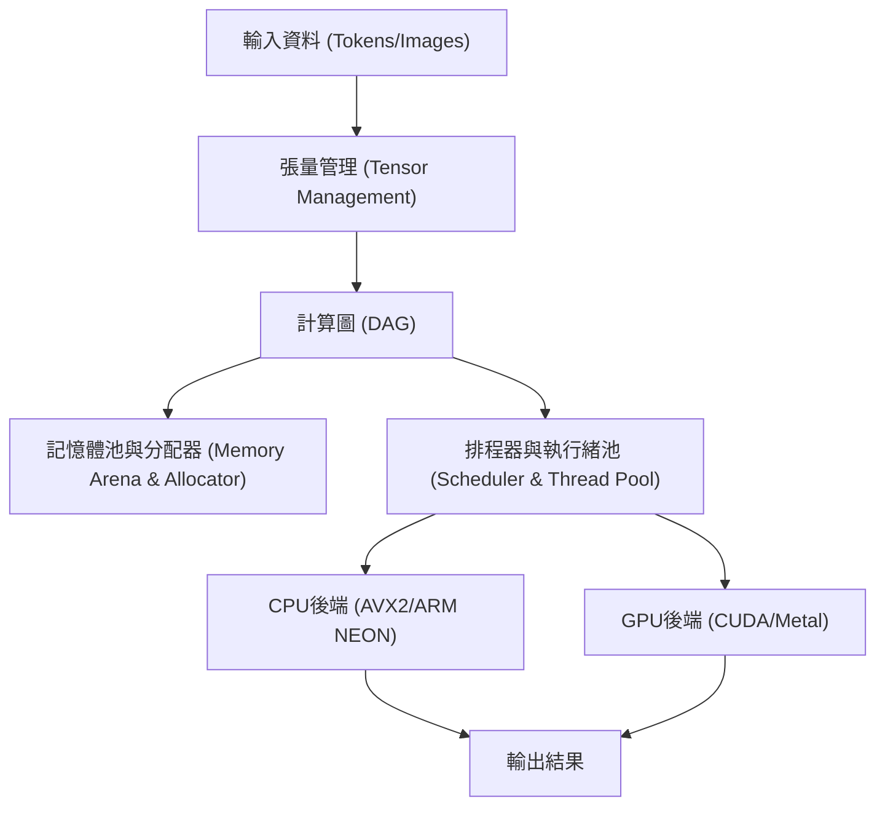
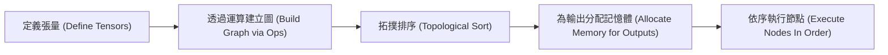
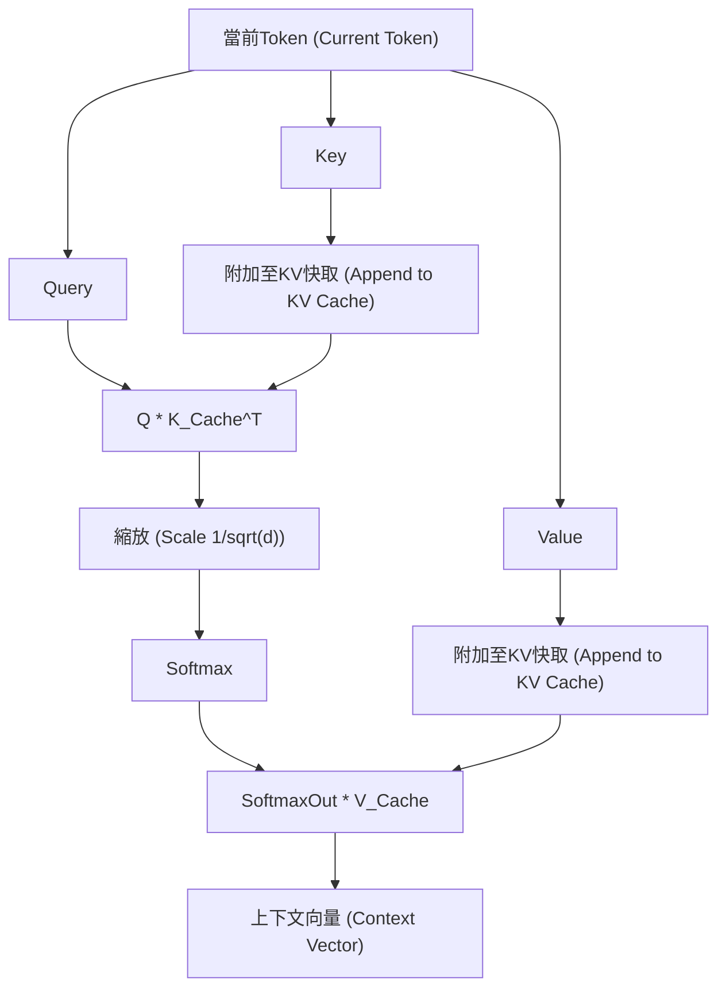

## 1. 前言：為什麼要放棄Python，改用C++製作AI推論引擎？

在現代的AI開發中，Python是事實上的標準。得益於PyTorch和TensorFlow等強大的框架，我們只需幾行程式碼就能建構、訓練並推論複雜的神經網路。然而，在這些框架的背後，是C++和CUDA等底層語言在負責繁重的計算處理。Python充其量只扮演了「膠水」的角色。

那麼，為什麼我們需要特地排除Python，單獨用C++來打造AI推論引擎呢？這有幾個強而有力的理由。

1. **極致的效能與低延遲**：可以完全消除Python的GIL（全域直譯器鎖）以及動態型別帶來的開銷。特別是在需要即時性的系統中，毫秒級的延遲都是致命的。
2. **部署的便利性**：要在終端使用者的環境中建構Python環境（龐大的函式庫群、依賴關係的地獄）非常困難。如果是C++，只需要發布靜態連結的單一執行檔（`.exe`或ELF二進位檔）即可。
3. **支援邊緣設備**：在智慧型手機、嵌入式設備、Raspberry Pi等資源嚴重受限的環境中，沒有餘裕去執行會消耗數GB記憶體的Python執行階段（Runtime）。
4. **硬體的直接控制**：像是記憶體分配的時機、明確地使用SIMD指令、最佳化與GPU之間的記憶體傳輸等，只有C++這類底層語言才能做到。

本文將在深受Georgi Gerganov所開發的「GGML」函式庫架構啟發之下，深入技術深淵，解說如何從零開始、純用C++建構出能運行大型語言模型（LLM）的推論引擎。

---

## 2. 推論引擎架構全貌

AI的推論處理，本質上就是「連續的巨大矩陣計算」。為了有效率地執行這些計算，推論引擎必須由以下幾個元件構成。



1. **張量（Tensor）管理**：管理多維陣列的資料結構以及各維度的步幅（Stride）。
2. **計算圖（Computation Graph）**：將神經網路各層的運算，表示為有向無環圖（DAG）。
3. **記憶體池（Memory Arena）**：為了避免動態記憶體分配（`malloc`或`new`）的開銷，採用預先分配型的記憶體管理機制。
4. **後端（Backend）**：針對CPU或GPU等特定硬體最佳化的運算實作（Kernel）。

我們將運用C++的強大功能（樣板、指標運算、RAII等）將這些組裝起來。

---

## 3. 記憶體管理的奧秘：記憶體池與SIMD對齊

推論引擎中的記憶體管理，是直接關係到效能的最重要因素之一。在推論過程中，特別是通過Transformer模型的各層時，會產生數量龐大的中間張量。如果每次都用標準的`malloc`來分配與釋放，堆積（Heap）的碎片化以及作業系統的上下文切換將會導致致命的速度下降。

因此，我們採用了「**記憶體池（Memory Arena）**」的方法。這是在推論開始時計算（或寫死）所需的最大記憶體量並一次性分配，之後只需遞增指標就能切割出記憶體的手法。

### 3.1 對齊（Alignment）的重要性

現代CPU支援SIMD（Single Instruction, Multiple Data）指令。例如Intel/AMD的AVX2/AVX-512，以及ARM的NEON等。這些指令可以一次處理256位元（32位元組）或512位元（64位元組）的資料，但處理對象的資料記憶體必須對齊（Alignment）在特定的位元組邊界（通常是32位元組或64位元組）。

以下是考慮到對齊的記憶體池C++實作範例。

```cpp
#include <cstdint>
#include <cstddef>
#include <stdexcept>
#include <iostream>

struct MemoryArena {
    size_t size;
    size_t offset;
    uint8_t* data;

    MemoryArena(size_t size) : size(size), offset(0) {
        // 在POSIX系統使用 posix_memalign，Windows使用 _aligned_malloc
#ifdef _WIN32
        data = static_cast<uint8_t*>(_aligned_malloc(size, 64));
#else
        if (posix_memalign(reinterpret_cast<void**>(&data), 64, size) != 0) {
            throw std::bad_alloc();
        }
#endif
    }

    ~MemoryArena() {
#ifdef _WIN32
        _aligned_free(data);
#else
        free(data);
#endif
    }

    void* allocate(size_t bytes, size_t alignment = 64) {
        // 計算對齊（求出填充大小）
        size_t pad = (alignment - (offset % alignment)) % alignment;
        if (offset + pad + bytes > size) {
            throw std::runtime_error("OOM: MemoryArena out of memory");
        }
        offset += pad;
        void* ptr = data + offset;
        offset += bytes;
        return ptr;
    }
    
    void reset() {
        offset = 0; // 釋放記憶體只需將指標歸零（O(1)）
    }
};
```

像這樣，建立張量時必定透過這個記憶體池來取得記憶體。每次推論步驟（例如每次生成Token）結束後，只要呼叫 `reset()` 就能瞬間重新利用記憶體。

---

## 4. 張量資料結構與步幅的魔法

張量是純量、向量、矩陣的廣義概念。在實作上重要的是，雖然實際資料在記憶體上是以**一維的連續陣列**來配置，但為了將其解釋為多維，我們導入了「步幅（Stride）」的概念。

```cpp
enum class DataType {
    FP32,
    FP16,
    INT8,  // 量化用
    INT4   // 量化用
};

struct Tensor {
    int n_dims;           // 維度數量
    int64_t ne[4];        // 各維度的元素數量 (Number of Elements)
    size_t nb[4];         // 各維度的步幅 (Number of Bytes)
    DataType type;        // 資料型態
    void* data;           // 指向有效負載（Payload）的指標
    
    // 計算圖用
    enum OpType op;
    Tensor* src0;
    Tensor* src1;
};
```

步幅 `nb[i]` 代表在維度 `i` 中，相鄰元素之間在記憶體上的位元組距離。
例如，元素數量為 $M \times N$ 的矩陣（FP32，1個元素4位元組），如果以列優先（Row-Major）儲存，其步幅如下：
- `nb[0]` = 4 (位元組)  ：往行（Column）方向移動
- `nb[1]` = $N \times 4$ (位元組) ：往列（Row）方向移動

利用這一點，我們可以不用複製記憶體，只需交換步幅的數值，就能實現「轉置（Transpose）」或「視圖（View）」等操作。這非常優雅且高效。

---

## 5. 建立計算圖（DAG）與延遲評估

與PyTorch等類似，我們的推論引擎也採用接近「Define-by-Run」的延遲評估（Lazy Evaluation）。也就是說，在呼叫運算函式時不進行計算，只建立圖（節點間的依賴關係）。

```cpp
Tensor* tensor_add(MemoryArena& arena, Tensor* a, Tensor* b) {
    Tensor* out = create_tensor(arena, a->type, a->n_dims, a->ne);
    out->op = OpType::ADD;
    out->src0 = a;
    out->src1 = b;
    return out;
}

Tensor* tensor_mul_mat(MemoryArena& arena, Tensor* a, Tensor* b) {
    // b 通常已經被轉置
    int64_t ne[2] = { a->ne[0], b->ne[1] };
    Tensor* out = create_tensor(arena, a->type, 2, ne);
    out->op = OpType::MUL_MAT;
    out->src0 = a;
    out->src1 = b;
    return out;
}
```

推論處理的流程如下：



在評估圖（前向傳播）時，我們使用拓撲排序，從沒有依賴關係的節點開始依序執行。因為只是進行推論，不需要保留反向傳播用的梯度，因此記憶體管理會變得非常簡單。

---

## 6. 數學與最佳化的核心：矩陣乘法 (GEMM)

AI推論計算量有90%以上花費在矩陣乘法（GEMM: General Matrix Multiply）上。Transformer模型核心的注意力機制和前饋神經網路（FFN），歸根究柢也是巨大的矩陣乘法。

兩個矩陣 $A$ (大小 $M \times K$) 與 $B$ (大小 $K \times N$) 的乘積 $C = A B$ (大小 $M \times N$) ，用數學式表示如下：

$$
C_{i,j} = \sum_{k=0}^{K-1} A_{i,k} \cdot B_{k,j}
$$

如果用樸素的三層迴圈來實作，會頻繁發生快取未命中（Cache Miss），完全發揮不出效能。

### 6.1 CPU上的快取區塊化與SIMD最佳化

在CPU上加速GEMM的基本策略如下：
1. **迴圈平鋪（Loop Tiling/快取區塊化）**：將矩陣分割成能放進L1/L2快取的小區塊來進行計算。
2. **資料打包（Data Packing）**：在內部重新排列資料，使記憶體存取模式變得連續。
3. **活用SIMD**：使用AVX-512中的 `_mm512_fmadd_ps` 等FMA（Fused Multiply-Add）指令，在一個時脈週期內完成大量乘加運算。

以下展示一個使用C++和SIMD Intrinsics（內建函式）簡化版的向量內積（Dot Product）範例。

```cpp
#include <immintrin.h> // 供AVX指令使用

// 使用AVX2的FP32高速內積
float dot_product_avx2(const float* a, const float* b, int n) {
    __m256 sum256 = _mm256_setzero_ps();
    int i = 0;
    
    // 一次處理8個元素（256位元 = 32位元組 = 8 * 4位元組）
    for (; i <= n - 8; i += 8) {
        __m256 va = _mm256_loadu_ps(a + i);
        __m256 vb = _mm256_loadu_ps(b + i);
        // FMA指令: sum256 = va * vb + sum256
        sum256 = _mm256_fmadd_ps(va, vb, sum256);
    }
    
    // 將SIMD暫存器內的值進行水平相加
    float result[8];
    _mm256_storeu_ps(result, sum256);
    float dot = result[0] + result[1] + result[2] + result[3] + 
                result[4] + result[5] + result[6] + result[7];
                
    // 處理剩餘部分
    for (; i < n; ++i) {
        dot += a[i] * b[i];
    }
    return dot;
}
```

光是這個小小的技巧，就能比樸素的實作獲得數倍至十幾倍的速度提升。

---

## 7. 跨越硬體高牆：整合CUDA與Metal後端

雖然只有純C++實作也能在CPU上有一定的運行表現，但要以實用的速度（例如：每秒生成20個Token以上）來運行LLM等巨大模型，GPU的平行計算能力是不可或缺的。因此，我們在引擎中導入後端（Backend）的抽象層。

### 7.1 後端抽象化

利用C++的多型（Polymorphism），讓我們能切換運算的執行器（Executor）。

```cpp
class Backend {
public:
    virtual ~Backend() = default;
    virtual void alloc_buffer(Tensor* t) = 0;
    virtual void free_buffer(Tensor* t) = 0;
    virtual void copy_to_device(Tensor* t) = 0;
    virtual void copy_to_host(Tensor* t) = 0;
    
    // 執行各種運算
    virtual void compute_add(Tensor* src0, Tensor* src1, Tensor* dst) = 0;
    virtual void compute_mul_mat(Tensor* src0, Tensor* src1, Tensor* dst) = 0;
};
```

### 7.2 NVIDIA CUDA 後端實作

為了活用NVIDIA的GPU，我們使用CUDA C++擴充功能來實作後端。雖然可以自己寫核心（Kernel），但關於矩陣乘法，活用NVIDIA提供的最高階函式庫「cuBLAS」才是上策。

```cpp
#include <cublas_v2.h>
#include <cuda_runtime.h>

class CUDABackend : public Backend {
private:
    cublasHandle_t handle;
    
public:
    CUDABackend() {
        cublasCreate(&handle);
    }
    
    ~CUDABackend() {
        cublasDestroy(handle);
    }
    
    void compute_mul_mat(Tensor* src0, Tensor* src1, Tensor* dst) override {
        // CUDA預設為行優先（Column-Major），因此參數需要特別注意
        const float alpha = 1.0f;
        const float beta = 0.0f;
        
        int m = src0->ne[0];
        int k = src0->ne[1];
        int n = src1->ne[1]; // 假設src1已被轉置
        
        cublasSgemm(handle, CUBLAS_OP_T, CUBLAS_OP_N,
                    m, n, k,
                    &alpha,
                    (const float*)src0->data, k,
                    (const float*)src1->data, k,
                    &beta,
                    (float*)dst->data, m);
        cudaDeviceSynchronize();
    }
};
```
CUDA記憶體與主機（CPU）記憶體之間的資料傳輸（`cudaMemcpy`）非常耗時，因此在設計上非常重要的一點是：在推論過程中應盡可能將所有的權重（重み張量）與中間張量保存在VRAM中。

### 7.3 Apple Silicon (Metal) 後端

近年來，Mac的M1/M2/M3晶片（Apple Silicon）作為AI推論機非常優秀。其原因在於「統一記憶體（Unified Memory）」。由於CPU和GPU共享同一塊記憶體區域，因此完全不需要像前述CUDA那樣透過PCIe匯流排進行高成本的主機與設備間記憶體傳輸。

要從C++呼叫Metal，可以將Objective-C++（`.mm` 檔案）當作橋樑，或是利用`metal-cpp`函式庫。
我們使用Metal的Compute Shader（在`.metal`檔案中以類似C++的語法撰寫）來編寫核心（Kernel）。

```cpp
// Metal著色器 (kernel.metal)
#include <metal_stdlib>
using namespace metal;

kernel void mul_mat_kernel(
    device const float* A [[buffer(0)]],
    device const float* B [[buffer(1)]],
    device float* C [[buffer(2)]],
    constant uint3& dims [[buffer(3)]],
    uint2 gid [[thread_position_in_grid]]
) {
    uint m = dims.x; uint k = dims.y; uint n = dims.z;
    uint row = gid.y; uint col = gid.x;
    
    if (row < m && col < n) {
        float sum = 0.0;
        for (uint i = 0; i < k; ++i) {
            sum += A[row * k + i] * B[i * n + col]; // 簡化版
        }
        C[row * n + col] = sum;
    }
}
```

在Apple Silicon環境中，還提供了名為MPS（Metal Performance Shaders）的矩陣乘法專用最佳化函式庫，在實際應用中使用它能跑出驚人的推論速度。

---

## 8. Transformer模型特有的處理：Attention與KV Cache

像LLaMA 2/3或GPT等最先進的LLM，都是基於Transformer架構。為了用C++實作它，必須建構出由以下數學式所表示的「Scaled Dot-Product Attention」。

$$
\text{Attention}(Q, K, V) = \text{softmax}\left(\frac{QK^T}{\sqrt{d_k}}\right)V
$$

此外，在自迴歸型（Autoregressive）的Token生成中，必須保留過去Token的計算結果（Key與Value）。我們稱之為「**KV快取（Key-Value Cache）**」。



在KV快取的記憶體分配上，也會預先在記憶體池中保留最大上下文長度（例如4096或8192 Tokens）的記憶體空間，並採用類似環狀緩衝區（Ring Buffer）的方式來運作。這樣就能防止在每個生成步驟重新分配記憶體。

另外，針對位置編碼（Positional Encoding），我們將實作近年來成為主流的「RoPE（Rotary Position Embedding）」。這是一種將位置資訊作為複數空間旋轉向量嵌入的手法，在C++中對 `sin` 及 `cos` 函式呼叫的最佳化（例如建立尋找表 Lookup Table 等）是影響效能的關鍵。

---

## 9. 透過模型量化（Quantization）達成極限最佳化

如果將大型模型（例如70億參數的LLaMA模型）維持在FP32（32位元浮點數）載入，光是權重就會消耗約28GB的記憶體（VRAM）。再把KV快取和推論用緩衝區算進去，很容易就超過30GB，一般的消費級GPU根本無法執行。

因此，「**量化（Quantization）**」就成了不可或缺的技術。這也是GGML格式的精髓所在。

量化是指刻意降低權重精度的技術。
- **FP16 (16-bit)**: 大小減半。精度幾乎沒有下降。
- **INT8 (8-bit)**: 大小變成1/4。僅有微小下降。
- **INT4 (4-bit)**: 大小變成1/8。若使用獨特的區塊化（Blocking）與縮放因子（Scaling Factor），即可進行具實用性的推論。

在推論引擎端，會從記憶體讀出被壓縮為INT4（或INT8）的權重，**在載入到CPU或GPU的暫存器後，立刻解壓縮（Dequantize）回FP16或FP32再進行計算**。

令人驚訝的是，即使增加了計算量，減少從記憶體讀取的資料量反而能讓速度更快。這是因為在現代硬體中，推論任務的瓶頸不在於「計算力（Compute Bound）」，而在於「**記憶體頻寬（Memory Bandwidth Bound）**」。如果是實作了INT4量化的C++引擎，即使是只有8GB VRAM的MacBook Air等設備，也能流暢地運行本機端的LLM。

---

## 10. 效能調校：NUMA架構與執行緒池

當使用CPU進行推論時，多執行緒化是必須的。但如果只是單純啟動多個 `std::thread`，並不能算是最佳做法。

在現代的多插槽（Multi-socket）伺服器或Ryzen Threadripper等高階CPU上，採用了**NUMA（Non-Uniform Memory Access）**架構。從某個CPU核心存取實體上較近的記憶體（本地記憶體）速度很快，但存取綁定在其他處理器上的記憶體則會變得極慢。

在進階的C++推論引擎中，會靈活運用以下技巧：
1. **執行緒綁定（Thread Pinning）**：將各個執行緒固定在特定的CPU核心（設定親和性 Affinity），防止上下文切換導致快取失效。
2. **感知NUMA的記憶體分配（NUMA-aware Allocation）**：在處理資料的執行緒所在的同一個NUMA節點上分配記憶體。
3. **工作竊取型執行緒池（Work-stealing Thread Pool）**：將計算圖的各個節點分割成細小的任務，並實作能讓閒置執行緒自動奪取任務執行的有效率排程器。

透過活用這些技巧，能將CPU使用率緊緊貼在100%附近，跑出接近理論值的吞吐量。

---

## 11. 總結：用C++的「肌肉」驅動AI的樂趣

Python確實很方便。在研發和製作原型時，沒有任何語言能比得上它的生產力。然而，當完成的模型要轉移到「在真實世界中，有效率地、在各種設備上運行」的階段時，C++出場的時刻就到了。

直接操作記憶體的位元組陣列，用SIMD指令將暫存器操到極限，一邊與GPU的VRAM頻寬搏鬥一邊打造出的推論引擎，看著它在終端機上陸續生成自然的文字（Token）時，那種成就感，是呼叫Python框架中 `model.generate()` 時絕對無法體會到的「身為工程師純粹的喜悅」。

AI技術往往容易變成「黑盒子（Black Box）」，但透過自己親手用C++寫下從張量運算到記憶體分配的所有過程，可以深刻理解LLM究竟是如何「思考」的，洞悉其真正的機制。

如果你具備C++的基礎知識，且對現在的AI技術有著強烈的興趣，請務必挑戰開發自製的推論引擎。GGML和llama.cpp的原始碼，絕對會是你最棒的活教材。

**來吧，拋開Python沉重的執行階段，用C++的肌肉讓最先進的AI跑起來吧！**
