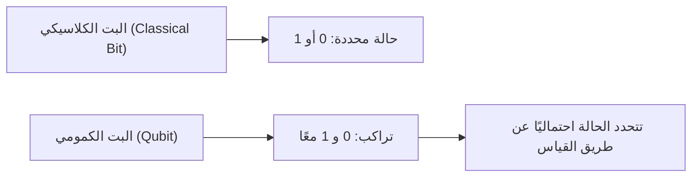
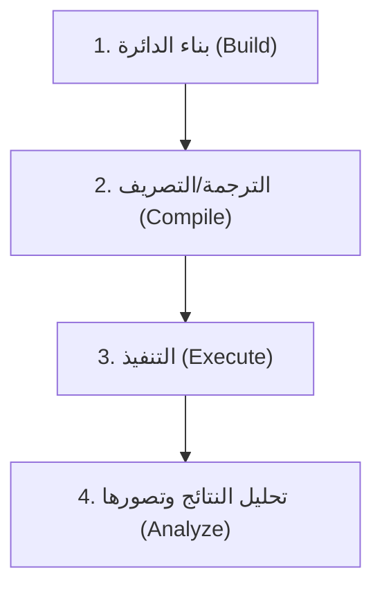
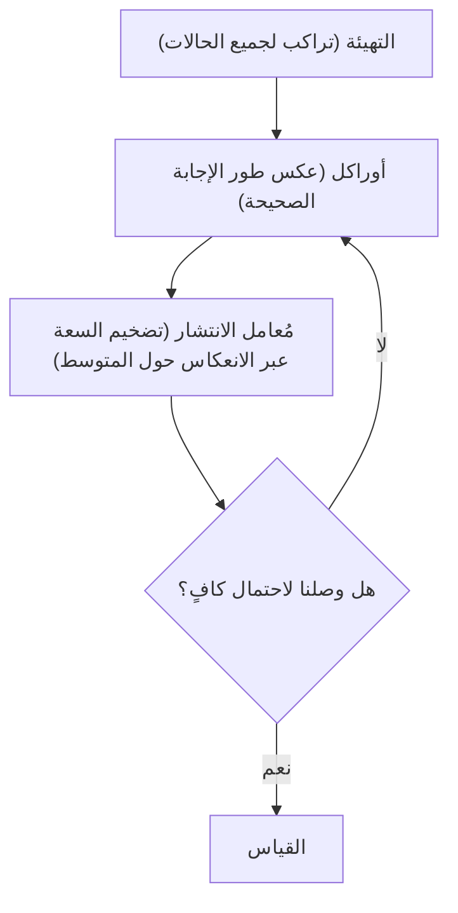

## 1. مقدمة

أحدثت أجهزة الكمبيوتر الحديثة (الكلاسيكية) تغييراً جذرياً في حياتنا، وهي تدعم جميع جوانب المجتمع بقدراتها الحسابية العالية. ومع ذلك، من المعروف أنه بالنسبة لبعض المشكلات المحددة (مثل تحليل الأعداد الضخمة إلى عواملها الأولية، ومحاكاة الهياكل الجزيئية المعقدة، ومشكلات التحسين، إلخ)، حتى أحدث أجهزة الكمبيوتر الفائقة الحالية قد تستغرق وقتًا أطول من عمر الكون لحلها.

لكسر هذه "الحدود لأجهزة الكمبيوتر الكلاسيكية"، يبرز **الكمبيوتر الكمومي (Quantum Computer)** كاحتمال واعد. من خلال الاستفادة من الخصائص العجيبة لميكانيكا الكم (التراكب والتشابك الكمومي) كموارد حسابية، يُعتقد أنه يمكن تسريع حل مشكلات معينة بشكل هائل.

في هذه المقالة، سنتخذ الخطوة الأولى نحو عالم البرمجة الكمومية باستخدام **Qiskit**، وهو إطار عمل مفتوح المصدر للحوسبة الكمومية تقدمه IBM. هذا الدليل التمهيدي مفصل للغاية، حيث يشرح الأساسيات الفيزيائية والرياضية بعناية، ويغطي العملية من كتابة الكود فعليًا بلغة Python إلى تشغيل الدوائر الكمومية على جهاز محاكاة.

---

## 2. الأساسيات الفيزيائية والرياضية التي تدعم الحوسبة الكمومية

لفهم البرمجة الكمومية، يجب أولاً فهم المفاهيم الأساسية لميكانيكا الكم. هنا، سنشرح ثلاث ركائز مهمة: الكيوبتات (البتات الكمومية)، التراكب، والتشابك الكمومي.

### 2.1 البت الكلاسيكي والبت الكمومي (Qubit)

وحدة المعلومات في الكمبيوتر الكلاسيكي هي "البت (Bit)". يتخذ البت دائمًا إحدى الحالتين إما `0` أو `1`.

من ناحية أخرى، تسمى أصغر وحدة للمعلومات في الكمبيوتر الكمومي **البت الكمومي (Qubit: Quantum bit)**. لا يمكن للبت الكمومي أن يتخذ الحالة `0` و `1` فحسب، بل يمكنه **الاحتفاظ بكلتا الحالتين في نفس الوقت**.

رياضياً، يتم التعبير عن حالة البت الكمومي $|\psi\rangle$ كتركيب خطي (تراكب) للحالات الأساسية $|0\rangle$ و $|1\rangle$.

$$
|\psi\rangle = \alpha|0\rangle + \beta|1\rangle
$$

هنا، $\alpha$ و $\beta$ عبارة عن أعداد مركبة، وتمثل سعات الاحتمال لملاحظة الحالتين $|0\rangle$ و $|1\rangle$ على التوالي. استنادًا إلى المبادئ الأساسية لميكانيكا الكم، يجب أن يكون مجموع الاحتمالات 1، لذا فإنها تلبي شرط المعايرة التالي:

$$
|\alpha|^2 + |\beta|^2 = 1
$$

بمعنى آخر، عند "قياس (ملاحظة)" هذا البت الكمومي، فإن احتمال الحصول على $|0\rangle$ هو $|\alpha|^2$، واحتمال الحصول على $|1\rangle$ هو $|\beta|^2$. حقيقة أن الحالة لا تتحدد إلا بشكل احتمالي قبل القياس هي الفرق الحاسم بينه وبين البت الكلاسيكي.



### 2.2 التراكب (Superposition)

كما ذُكر سابقًا، يُطلق على الحالة التي تمتزج فيها الحالتان $|0\rangle$ و $|1\rangle$ اسم **التراكب (Superposition)**.

على سبيل المثال، إذا كان بت كمومي واحد في حالة تراكب متساوٍ تمامًا، فإن $\alpha = \frac{1}{\sqrt{2}}$ و $\beta = \frac{1}{\sqrt{2}}$.

$$
|\psi\rangle = \frac{1}{\sqrt{2}}|0\rangle + \frac{1}{\sqrt{2}}|1\rangle
$$

إذا قمت بقياس هذه الحالة، فستتم ملاحظة $|0\rangle$ و $|1\rangle$ باحتمال 50% لكل منهما.
إذا كان هناك 2 بت كمومي، يمكننا إنشاء تراكب من 4 حالات: $|00\rangle, |01\rangle, |10\rangle, |11\rangle$. وإذا كان هناك $n$ بت كمومي، فيمكن تمثيل $2^n$ حالة في نفس الوقت، وهذا هو أحد مصادر قدرة المعالجة المتوازية للكمبيوتر الكمومي.

### 2.3 التشابك الكمومي (Entanglement)

الخاصية الأقوى والأكثر غرابة في الحوسبة الكمومية هي **التشابك الكمومي (Entanglement)**. هذه الظاهرة، التي أطلق عليها أينشتاين اسم "التأثير الشبحي عن بُعد"، تعني أن اثنين أو أكثر من البتات الكمومية مرتبطة ببعضها البعض بقوة، وبمجرد تحديد حالة أحد البتات الكمومية، تتحدد حالة البت الكمومي الآخر على الفور، بغض النظر عن المسافة الفيزيائية بينهما.

واحدة من أشهر حالات التشابك الكمومي، "حالة بيل (Bell State)"، تُعرف بحالة $\Phi^+$ وتُعبر عنها المعادلة التالية:

$$
|\Phi^+\rangle = \frac{|00\rangle + |11\rangle}{\sqrt{2}}
$$

في هذه الحالة، لا توجد حالات مثل $|01\rangle$ أو $|10\rangle$. لذلك، إذا قمت بقياس البت الكمومي الأول ووجدت أنه $|0\rangle$، فمن المؤكد أن البت الثاني سيكون $|0\rangle$ دون الحاجة إلى قياسه. والعكس صحيح، إذا كان الأول $|1\rangle$، فإن الثاني سيكون دائمًا $|1\rangle$.

---

## 3. البوابات المنطقية الكمومية (Quantum Logic Gates)

تمامًا كما تستخدم أجهزة الكمبيوتر الكلاسيكية البوابات المنطقية مثل AND و OR و NOT لإجراء الحسابات، تستخدم أجهزة الكمبيوتر الكمومية **البوابات الكمومية** لمعالجة حالات البتات الكمومية. نظرًا لأن الحالة الكمومية هي متجه، يتم تمثيل البوابة الكمومية كـ "مصفوفة وحدوية (Unitary matrix)" تعمل على هذا المتجه.

### 3.1 بوابات باولي (Pauli-X, Y, Z)

بوابات باولي هي العمليات الأساسية على بت كمومي واحد.

**・بوابة Pauli-X (بوابة NOT)**
تعادل بوابة NOT الكلاسيكية. تقلب $|0\rangle$ إلى $|1\rangle$ و $|1\rangle$ إلى $|0\rangle$. (دوران بمقدار 180 درجة حول المحور X في كرة بلوخ)

$$
X = \begin{pmatrix} 0 & 1 \\ 1 & 0 \end{pmatrix}
$$

**・بوابة Pauli-Y**
تقوم بدوران بمقدار 180 درجة حول المحور Y. لها تأثير عكس كل من الطور والبت.

$$
Y = \begin{pmatrix} 0 & -i \\ i & 0 \end{pmatrix}
$$

**・بوابة Pauli-Z (بوابة عكس الطور)**
تبقي حالة $|0\rangle$ كما هي، وتعكس طور حالة $|1\rangle$ (بالضرب في $-1$). (دوران بمقدار 180 درجة حول المحور Z)

$$
Z = \begin{pmatrix} 1 & 0 \\ 0 & -1 \end{pmatrix}
$$

### 3.2 بوابة هادامارد (Hadamard Gate)

بوابة هادامارد (بوابة H) هي بوابة مهمة جدًا تحول حالة محددة ($|0\rangle$ أو $|1\rangle$) إلى حالة تراكب.

$$
H = \frac{1}{\sqrt{2}}
\begin{pmatrix}
1 & 1 \\
1 & -1
\end{pmatrix}
$$

عند تطبيق بوابة H على $|0\rangle$، نحصل على حالة تراكب متساوية $|+\rangle$.

$$
H|0\rangle = \frac{1}{\sqrt{2}}|0\rangle + \frac{1}{\sqrt{2}}|1\rangle = |+\rangle
$$

### 3.3 بوابات الطور (Phase Gates)

بوابة الطور هي تعميم لبوابة Z، وتقوم بتدوير طور الحالة $|1\rangle$ بزاوية محددة $\theta$.

$$
P(\theta) = \begin{pmatrix} 1 & 0 \\ 0 & e^{i\theta} \end{pmatrix}
$$

ومن الأمثلة النموذجية بوابة S ($\theta = \pi/2$) وبوابة T ($\theta = \pi/4$).

### 3.4 بوابة CNOT (Controlled-NOT Gate)

بوابة CNOT (بوابة CX) هي بوابة تقوم بإجراء عملية بين اثنين من البتات الكمومية، وهي ضرورية لتوليد التشابك الكمومي. تتكون من "بت التحكم (Control bit)" و "البت المستهدف (Target bit)".

فقط إذا كان بت التحكم $|1\rangle$، يتم تطبيق بوابة X (عملية NOT) على البت المستهدف، وإذا كان بت التحكم $|0\rangle$، لا يتم إجراء أي تغيير.

$$
CNOT = \begin{pmatrix}
1 & 0 & 0 & 0 \\
0 & 1 & 0 & 0 \\
0 & 0 & 0 & 1 \\
0 & 0 & 1 & 0
\end{pmatrix}
$$

---

## 4. أساسيات Qiskit وإعداد البيئة

من هنا، سنقوم فعليًا بكتابة برامج كمومية باستخدام Python و Qiskit.

### 4.1 ما هو Qiskit؟

**Qiskit** عبارة عن مجموعة أدوات تطوير برمجيات (SDK) مفتوحة المصدر للحوسبة الكمومية تم تطويرها بواسطة IBM Quantum. تتيح لك بناء الدوائر الكمومية بشكل حدسي باستخدام Python، وتشغيلها إما على أجهزة محاكاة محلية أو على أجهزة كمبيوتر كمومية حقيقية من IBM عبر السحابة.

### 4.2 طريقة التثبيت

لاستخدام Qiskit، ستحتاج إلى بيئة Python. يمكنك تثبيت Qiskit والحزم ذات الصلة (أجهزة المحاكاة ومكتبات الرسم) باستخدام الأمر التالي.

```bash
pip install qiskit qiskit-aer qiskit-ibm-runtime matplotlib pylatexenc
```

### 4.3 التدفق الأساسي للبرمجة

تتقدم البرمجة الكمومية باستخدام Qiskit بشكل أساسي عبر الخطوات التالية.



1. **بناء الدائرة**: قم بإنشاء كائن `QuantumCircuit` وإضافة البوابات إليه.
2. **الترجمة**: قم بتحسين الدائرة لتلائم الواجهة الخلفية (الجهاز الحقيقي أو جهاز المحاكاة) التي سيتم التنفيذ عليها.
3. **التنفيذ**: أرسل المهمة إلى الواجهة الخلفية واحصل على النتائج.
4. **التحليل**: ارسم المدرج التكراري لنتائج القياس وغيرها من التمثيلات.

---

## 5. تطبيق عملي: بناء دائرة تصنع حالة بيل (التشابك الكمومي)

دعونا ننشئ "التشابك الكمومي (حالة بيل)" التي درسناها نظريًا باستخدام Qiskit. الحالة المستهدفة هي $|\Phi^+\rangle = \frac{|00\rangle + |11\rangle}{\sqrt{2}}$.

### 5.1 تصميم الدائرة

لإنشاء حالة بيل، نتبع الخطوات التالية:
1. قم بإعداد 2 من البتات الكمومية (الحالة الأولية لكليهما هي $|0\rangle$).
2. طبق بوابة هادامارد (H) على البت الكمومي الأول لجعله في حالة تراكب.
3. طبق بوابة CNOT بحيث يكون البت الكمومي الأول هو "بت التحكم" والثاني هو "البت المستهدف".
4. قم بالقياس (Measure) لقراءة النتائج.

### 5.2 التنفيذ بالكود عبر Python/Qiskit

دعونا نلقي نظرة على الكود الفعلي.

```python
import numpy as np
from qiskit import QuantumCircuit, transpile
from qiskit_aer import Aer
from qiskit.visualization import plot_histogram
import matplotlib.pyplot as plt

# 1. تهيئة الدائرة
# إنشاء دائرة كمومية تحتوي على 2 بت كمومي و 2 بت كلاسيكي
qc = QuantumCircuit(2, 2)

# 2. تطبيق بوابة H
# تطبيق بوابة هادامارد على البت الكمومي 0 (q0)
qc.h(0)

# 3. تطبيق بوابة CNOT
# تطبيق CNOT بجعل q0 بت التحكم و q1 البت المستهدف
qc.cx(0, 1)

# 4. القياس
# قياس البت الكمومي 0 و 1 وكتابة النتائج في البت الكلاسيكي 0 و 1 على التوالي
qc.measure([0, 1], [0, 1])

# رسم مخطط الدائرة (باستخدام matplotlib)
# qc.draw('mpl')
print(qc.draw())
```

عند تشغيل هذا الكود، سيظهر المخطط التوضيحي التالي للدائرة الكمومية على شكل فن الأسكي (ASCII art) في وحدة التحكم.

```text
     ┌───┐     ┌─┐   
q_0: ┤ H ├──■──┤M├───
     └───┘┌─┴─┐└╥┘┌─┐
q_1: ─────┤ X ├─╫─┤M├
          └───┘ ║ └╥┘
c: 2/═══════════╩══╩═
                0  1 
```
تشير `H` إلى بوابة هادامارد، والجمع بين `■` و `X` يمثل بوابة CNOT، و `M` تمثل القياس.

### 5.3 التنفيذ على جهاز المحاكاة وتفسير النتائج

بعد ذلك، سنقوم بتشغيل هذه الدائرة على جهاز محاكاة `Aer` عالي الأداء من IBM للتحقق من النتائج.

```python
# الحصول على الواجهة الخلفية لجهاز المحاكاة Aer
simulator = Aer.get_backend('qasm_simulator')

# ترجمة الدائرة لجهاز المحاكاة (تحسين)
compiled_circuit = transpile(qc, simulator)

# تشغيل الدائرة (هنا نقوم بتنفيذ 1000 طلقة "shots")
job = simulator.run(compiled_circuit, shots=1000)

# الحصول على النتيجة
result = job.result()

# الحصول على عدد مرات مشاهدة الحالة (العدد)
counts = result.get_counts(compiled_circuit)
print("\nنتيجة القياس:", counts)

# رسم المدرج التكراري (الهيستوجرام)
# plot_histogram(counts)
# plt.show()
```

**تفسير النتائج**

يجب أن يكون مخرج وحدة التحكم كالتالي تقريبًا.
`نتيجة القياس: {'00': 495, '11': 505}`
(* نظرًا لأن الاحتمالات عشوائية، فستتقلب الأرقام بشكل طفيف مع كل تنفيذ)

في بيئة المحاكاة المثالية، تُلاحظ نتائج القياس `00` و `11` بنسبة 50% تقريبًا لكل منهما، ولا تُلاحظ `01` أو `10` على الإطلاق.
هذا يتوافق تمامًا مع التوقع النظري لحالة بيل التي أنشأناها $|\Phi^+\rangle = \frac{|00\rangle + |11\rangle}{\sqrt{2}}$. تمت محاكاة "التشابك الكمومي" بدقة، حيث إذا كان البت الكمومي الأول 0، فإن الثاني سيكون بالتأكيد 0، وإذا كان 1، فسيكون الثاني بالتأكيد 1.

بالمناسبة، إذا تم التشغيل على جهاز كمبيوتر كمومي حقيقي (IBM Quantum Hardware)، قد تتم ملاحظة القليل من `01` و `10` بسبب تأثير الضوضاء (فك الترابط الكمومي وأخطاء البوابات). إن كيفية تقليل هذه الضوضاء (تصحيح الخطأ الكمومي) تعد إحدى أكبر التحديات في تطوير أجهزة الكمبيوتر الكمومية حاليًا.

---

## 6. التوسع إلى خوارزميات أكثر تقدمًا

يمكن اعتبار إنشاء حالة بيل بمثابة "Hello World" في البرمجة الكمومية. من خلال تطوير هذا بشكل أكبر، يمكننا بناء خوارزميات قوية تتفوق على أجهزة الكمبيوتر الكلاسيكية.

### 6.1 خوارزمية دويتش-جوزا (Deutsch-Jozsa Algorithm)

هذه مسألة تتعلق بتحديد ما إذا كانت دالة معينة $f(x)$ هي "دالة ثابتة (تُخرج دائمًا 0 أو تُخرج دائمًا 1 بغض النظر عن المدخلات)" أو "دالة متوازنة (تُخرج 0 لنصف المدخلات و 1 للنصف الآخر)".
في الكمبيوتر الكلاسيكي، يتطلب الأمر في أسوأ الحالات تقييم الدالة $2^{n-1} + 1$ مرة، ولكن باستخدام خوارزمية دويتش-جوزا، يمكنك الاستفادة من التوازي الكمومي لتحديد ذلك من خلال **تقييم واحد فقط**. يوضح هذا النمط الأساسي للخوارزمية الكمومية، حيث يتم إدخال حالة تراكب واستخدام التداخل (Interference) لإلغاء الحالات غير الضرورية وتضخيم الإجابة المطلوبة.

### 6.2 خوارزمية غروفر (Grover's Algorithm)

في مشكلة البحث للعثور على بيانات معينة من قاعدة بيانات غير مصنفة تحتوي على $N$ من العناصر، بينما تتطلب الخوارزمية الكلاسيكية في المتوسط $N/2$ عملية حسابية، يمكن لخوارزمية غروفر العثور على البيانات المطلوبة في $\sqrt{N}$ عملية.
تستخدم هذه الخوارزمية صندوقًا أسود يسمى "أوراكل (Oracle)" لقلب طور الحل المستهدف، ثم تقوم بـ "تضخيم السعة (Amplitude Amplification)" لزيادة احتمال ملاحظة الحل المستهدف بشكل كبير.



---

## 7. الخاتمة وماذا تتعلم بعد ذلك

في هذه المقالة، بدأنا بالمفاهيم الأساسية للحوسبة الكمومية، وهي التراكب والتشابك الكمومي، وقمنا بشرح مفصل لكيفية التعامل مع البوابات المنطقية الكمومية باستخدام Qiskit، وصولاً إلى بناء ومحاكاة حالة بيل فعليًا وتفسير النتائج.

يعد Qiskit أداة قوية تتيح لك تجاوز الحواجز الرياضية والفيزيائية والتركيز على بناء الخوارزميات، وذلك لأنه يتيح الكتابة بلغة مألوفة مثل Python. تعيش الحوسبة الكمومية حاليًا في عصر "الأجهزة الكمومية ذات الحجم المتوسط المصحوبة بالضوضاء" (NISQ: Noisy Intermediate-Scale Quantum)، ولكن يتم إحراز تقدم سريع عالميًا في الأبحاث التطبيقية في العديد من المجالات، مثل التعلم الآلي الكمومي (Quantum Machine Learning)، والمحاكاة الكيميائية (Quantum Chemistry)، وفك التشفير.

انتهز هذه الفرصة واستخدم Qiskit لبناء دوائر كمومية متنوعة بنفسك، وحاول تشغيلها على معالج IBM Quantum الحقيقي. من المؤكد أنك ستتمكن من تجربة نموذج الحوسبة المستقبلي بيديك.

### مراجع
- [وثائق Qiskit الرسمية](https://qiskit.org/documentation/)
- [كتاب Qiskit](https://qiskit.org/textbook/ja/preface.html) - نص رسمي موصى به لأولئك الذين يرغبون في التعمق في الخلفية الرياضية والخوارزميات
- IBM Quantum Learning

مرحباً بك في العالم الكمومي!
