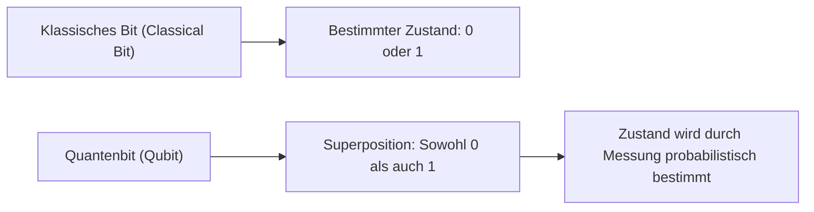
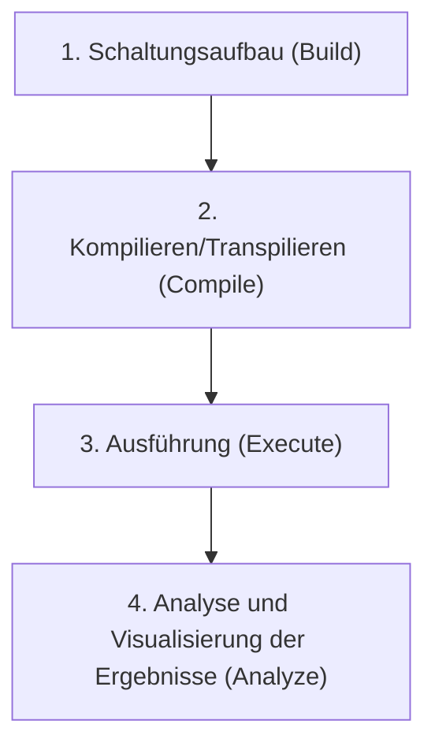
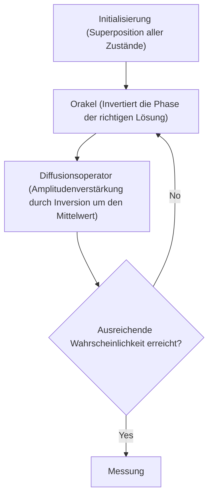

## 1. Einführung

Moderne Computer (klassische Computer) haben unser Leben dramatisch verändert und unterstützen mit ihrer hohen Rechenleistung alle Aspekte der Gesellschaft. Es ist jedoch bekannt, dass für bestimmte, spezifische Probleme (z.B. die Primfaktorzerlegung riesiger Zahlen, die Simulation komplexer Molekularstrukturen, Optimierungsprobleme etc.) selbst die modernsten Supercomputer unserer Zeit mehr Zeit benötigen würden, als das Universum alt ist.

Der **Quantencomputer (Quantum Computer)** birgt das Potenzial, diese „Grenzen klassischer Computer“ zu durchbrechen. Man geht davon aus, dass er durch die Nutzung der faszinierenden Eigenschaften der Quantenmechanik (Superposition und Quantenverschränkung) als Rechenressource in der Lage ist, bestimmte Probleme drastisch zu beschleunigen.

In diesem Artikel machen wir die ersten Schritte in die Welt der Quantenprogrammierung, indem wir das von IBM als Open Source bereitgestellte Quantencomputing-Framework **Qiskit** verwenden. Dies ist ein sehr detaillierter Einstiegsguide, der von den physikalischen und mathematischen Grundlagen über das Schreiben von Code in Python bis hin zur Ausführung von Quantenschaltungen auf einem Simulator alles sorgfältig erklärt.

---

## 2. Physikalische und mathematische Grundlagen des Quantenrechnens

Um die Quantenprogrammierung zu verstehen, müssen Sie zunächst die grundlegenden Konzepte der Quantenmechanik begreifen. Hier erklären wir die drei wichtigen Säulen: Quantenbits, Superposition und Quantenverschränkung.

### 2.1 Das klassische Bit und das Quantenbit (Qubit)

Die Informationseinheit klassischer Computer ist das „Bit“. Ein Bit nimmt immer genau einen von zwei Zuständen ein: entweder `0` oder `1`.

Andererseits wird die kleinste Informationseinheit eines Quantencomputers als **Quantenbit (Qubit: Quantum bit)** bezeichnet. Ein Qubit kann nicht nur die Zustände `0` und `1` annehmen, sondern ist auch in der Lage, **beide Zustände gleichzeitig beizubehalten**.

Mathematisch wird der Zustand eines Qubits $|\psi\rangle$ als Linearkombination (Superposition) der Basiszustände $|0\rangle$ und $|1\rangle$ ausgedrückt.

$$
|\psi\rangle = \alpha|0\rangle + \beta|1\rangle
$$

Hierbei sind $\alpha$ und $\beta$ komplexe Zahlen, die die Wahrscheinlichkeitsamplituden dafür darstellen, dass die Zustände $|0\rangle$ bzw. $|1\rangle$ beobachtet werden. Basierend auf den Grundprinzipien der Quantenmechanik muss die Summe der Wahrscheinlichkeiten 1 ergeben, weshalb die folgende Normierungsbedingung erfüllt sein muss:

$$
|\alpha|^2 + |\beta|^2 = 1
$$

Das bedeutet, wenn wir dieses Qubit „messen (beobachten)“, ist die Wahrscheinlichkeit, $|0\rangle$ zu erhalten, $|\alpha|^2$, und die Wahrscheinlichkeit, $|1\rangle$ zu erhalten, $|\beta|^2$. Der entscheidende Unterschied zum klassischen Bit besteht darin, dass der Zustand vor der Messung nur probabilistisch bestimmt ist.



### 2.2 Superposition (Überlagerung)

Wie bereits erwähnt, wird der Zustand, in dem die Zustände $|0\rangle$ und $|1\rangle$ vermischt sind, als **Superposition** bezeichnet.

Wenn sich beispielsweise ein einzelnes Qubit in einem Zustand der vollkommen gleichmäßigen Superposition befindet, gilt $\alpha = \frac{1}{\sqrt{2}}$ und $\beta = \frac{1}{\sqrt{2}}$.

$$
|\psi\rangle = \frac{1}{\sqrt{2}}|0\rangle + \frac{1}{\sqrt{2}}|1\rangle
$$

Wenn dieser Zustand gemessen wird, werden $|0\rangle$ und $|1\rangle$ jeweils mit einer Wahrscheinlichkeit von 50% beobachtet.
Wenn zwei Qubits vorhanden sind, können wir eine Superposition der vier Zustände $|00\rangle, |01\rangle, |10\rangle, |11\rangle$ erstellen. Mit $n$ Qubits können wir $2^n$ Zustände gleichzeitig repräsentieren, was eine der Hauptquellen für die parallele Verarbeitungsfähigkeit von Quantencomputern darstellt.

### 2.3 Quantenverschränkung (Entanglement)

Die stärkste und mysteriöseste Eigenschaft im Quantencomputing ist die **Quantenverschränkung (Entanglement)**. Dieses Phänomen, das Einstein als "spukhafte Fernwirkung" bezeichnete, beschreibt die Eigenschaft, dass zwei oder mehr Qubits so stark miteinander verbunden sind, dass die Bestimmung des Zustands des einen Qubits sofort auch den Zustand des anderen bestimmt, ganz gleich, wie weit sie physisch voneinander entfernt sind.

Einer der bekanntesten verschränkten Quantenzustände, der „Bell-Zustand (Bell State)“, der $\Phi^+$-Zustand, wird wie folgt ausgedrückt:

$$
|\Phi^+\rangle = \frac{|00\rangle + |11\rangle}{\sqrt{2}}
$$

In diesem Zustand existieren die Zustände $|01\rangle$ und $|10\rangle$ nicht. Wenn wir also das erste Qubit messen und es sich im Zustand $|0\rangle$ befindet, ist es sicher, dass das zweite Qubit sich ebenfalls im Zustand $|0\rangle$ befindet, noch bevor wir es gemessen haben. Umgekehrt, wenn das erste Qubit $|1\rangle$ ist, wird das zweite definitiv auch $|1\rangle$ sein.

---

## 3. Quantenlogikgatter (Quantum Logic Gates)

So wie klassische Computer Logikgatter wie AND, OR und NOT verwenden, um Berechnungen durchzuführen, verwenden Quantencomputer **Quantengatter**, um den Zustand von Qubits zu manipulieren. Da ein Quantenzustand ein Vektor ist, wird ein Quantengatter als "unitäre Matrix" ausgedrückt, die auf diesen Vektor wirkt.

### 3.1 Pauli-Gatter (Pauli-X, Y, Z)

Pauli-Gatter sind grundlegende Operationen für ein einzelnes Qubit.

**・Pauli-X Gatter (NOT-Gatter)**
Es entspricht dem klassischen NOT-Gatter. Es invertiert $|0\rangle$ zu $|1\rangle$ und $|1\rangle$ zu $|0\rangle$. (Eine 180-Grad-Drehung um die X-Achse auf der Bloch-Kugel)

$$
X = \begin{pmatrix} 0 & 1 \\ 1 & 0 \end{pmatrix}
$$

**・Pauli-Y Gatter**
Führt eine 180-Grad-Drehung um die Y-Achse aus. Es hat den Effekt, sowohl die Phase als auch das Bit zu invertieren.

$$
Y = \begin{pmatrix} 0 & -i \\ i & 0 \end{pmatrix}
$$

**・Pauli-Z Gatter (Phaseninversionsgatter)**
Es belässt den Zustand von $|0\rangle$ unverändert und invertiert die Phase (multipliziert mit $-1$) des Zustands $|1\rangle$. (Eine 180-Grad-Drehung um die Z-Achse)

$$
Z = \begin{pmatrix} 1 & 0 \\ 0 & -1 \end{pmatrix}
$$

### 3.2 Hadamard-Gatter (Hadamard Gate)

Das Hadamard-Gatter (H-Gatter) ist ein sehr wichtiges Gatter, das einen bestimmten Zustand ($|0\rangle$ oder $|1\rangle$) in einen Superpositionszustand überführt.

$$
H = \frac{1}{\sqrt{2}}
\begin{pmatrix}
1 & 1 \\
1 & -1
\end{pmatrix}
$$

Die Anwendung des H-Gatters auf $|0\rangle$ führt zu $|+\rangle$, was einem gleichmäßigen Superpositionszustand entspricht.

$$
H|0\rangle = \frac{1}{\sqrt{2}}|0\rangle + \frac{1}{\sqrt{2}}|1\rangle = |+\rangle
$$

### 3.3 Phasengatter (Phase Gates)

Phasengatter sind eine Verallgemeinerung des Z-Gatters; sie rotieren die Phase des Zustands $|1\rangle$ um einen angegebenen Winkel $\theta$.

$$
P(\theta) = \begin{pmatrix} 1 & 0 \\ 0 & e^{i\theta} \end{pmatrix}
$$

Typische Beispiele sind das S-Gatter ($\theta = \pi/2$) und das T-Gatter ($\theta = \pi/4$).

### 3.4 CNOT-Gatter (Controlled-NOT Gate)

Das CNOT-Gatter (CX-Gatter) führt Operationen zwischen zwei Qubits durch und ist unerlässlich für die Erzeugung von Quantenverschränkung. Es besteht aus einem "Kontroll-Bit (Control)" und einem "Ziel-Bit (Target)".

Nur wenn das Kontrollbit $|1\rangle$ ist, wird das X-Gatter (NOT-Operation) auf das Zielbit angewendet; wenn das Kontrollbit $|0\rangle$ ist, passiert nichts.

$$
CNOT = \begin{pmatrix}
1 & 0 & 0 & 0 \\
0 & 1 & 0 & 0 \\
0 & 0 & 0 & 1 \\
0 & 0 & 1 & 0
\end{pmatrix}
$$

---

## 4. Grundlagen und Umgebungseinrichtung von Qiskit

Von hier an werden wir Quantenprogramme mithilfe von Python und Qiskit schreiben.

### 4.1 Was ist Qiskit?

**Qiskit** ist ein Open-Source Software Development Kit (SDK) für Quantencomputing, das von IBM Quantum entwickelt wurde. Es ermöglicht die intuitive Erstellung von Quantenschaltungen in Python und deren Ausführung auf lokalen Simulatoren oder über die Cloud auf echten Quantencomputern von IBM.

### 4.2 Installationsmethode

Um Qiskit zu verwenden, ist eine Python-Umgebung erforderlich. Installieren Sie Qiskit und die zugehörigen Pakete (Simulator und Zeichnungsbibliotheken) mit dem folgenden Befehl:

```bash
pip install qiskit qiskit-aer qiskit-ibm-runtime matplotlib pylatexenc
```

### 4.3 Grundlegender Ablauf der Programmierung

Die Quantenprogrammierung mit Qiskit erfolgt hauptsächlich in den folgenden Schritten:



1. **Schaltungsaufbau**: Erstellen eines `QuantumCircuit`-Objekts und Hinzufügen von Gattern.
2. **Kompilieren**: Optimierung der Schaltung für das ausführende Backend (echte Maschine oder Simulator).
3. **Ausführung**: Senden von Jobs an das Backend und Abrufen der Ergebnisse.
4. **Analyse**: Zeichnen von Histogrammen der Messergebnisse usw.

---

## 5. Praxis: Aufbau einer Schaltung zur Erzeugung eines Bell-Zustands (Quantenverschränkung)

Lassen Sie uns die "Quantenverschränkung (den Bell-Zustand)", die wir in der Theorie gelernt haben, nun tatsächlich mit Qiskit erzeugen. Unser Zielzustand ist $|\Phi^+\rangle = \frac{|00\rangle + |11\rangle}{\sqrt{2}}$.

### 5.1 Schaltungsentwurf

Um einen Bell-Zustand zu erzeugen, gehen wir wie folgt vor:
1. Bereiten Sie zwei Qubits vor (beide haben als Anfangszustand $|0\rangle$).
2. Wenden Sie das Hadamard-Gatter (H) auf das erste Qubit an, um es in einen Superpositionszustand zu versetzen.
3. Wenden Sie das CNOT-Gatter an, wobei das erste Qubit das "Kontrollbit" und das zweite das "Zielbit" ist.
4. Führen Sie eine Messung (Measure) durch, um die Ergebnisse auszulesen.

### 5.2 Python/Qiskit Code-Implementierung

Schauen wir uns nun den tatsächlichen Code an.

```python
import numpy as np
from qiskit import QuantumCircuit, transpile
from qiskit_aer import Aer
from qiskit.visualization import plot_histogram
import matplotlib.pyplot as plt

# 1. Initialisierung der Schaltung
# Erstellen einer Quantenschaltung mit 2 Quantenbits und 2 klassischen Bits
qc = QuantumCircuit(2, 2)

# 2. Anwendung des H-Gates
# Hadamard-Gate auf das Quantenbit 0 (q0) anwenden
qc.h(0)

# 3. Anwendung des CNOT-Gates
# CNOT anwenden mit q0 als Steuerbit und q1 als Zielbit
qc.cx(0, 1)

# 4. Messung
# Quantenbits 0 und 1 messen und in die klassischen Bits 0 und 1 schreiben
qc.measure([0, 1], [0, 1])

# Schaltungsdiagramm zeichnen (mit matplotlib)
# qc.draw('mpl')
print(qc.draw())
```

Wenn Sie diesen Code ausführen, wird in der Konsole als ASCII-Art das folgende Quantenschaltungsdiagramm angezeigt:

```text
     ┌───┐     ┌─┐   
q_0: ┤ H ├──■──┤M├───
     └───┘┌─┴─┐└╥┘┌─┐
q_1: ─────┤ X ├─╫─┤M├
          └───┘ ║ └╥┘
c: 2/═══════════╩══╩═
                0  1 
```
`H` stellt das Hadamard-Gatter dar, die Kombination aus `■` und `X` ist das CNOT-Gatter, und `M` repräsentiert die Messung.

### 5.3 Ausführung auf dem Simulator und Interpretation der Ergebnisse

Als Nächstes führen wir diese Schaltung auf IBMs Hochleistungs-Simulator `Aer` aus und überprüfen die Ergebnisse.

```python
# Das Backend des Aer-Simulators abrufen
simulator = Aer.get_backend('qasm_simulator')

# Schaltung für den Simulator transpilieren (optimieren)
compiled_circuit = transpile(qc, simulator)

# Schaltung ausführen (hier 1000 Shots ausführen)
job = simulator.run(compiled_circuit, shots=1000)

# Ergebnisse abrufen
result = job.result()

# Anzahl der Beobachtungen der Zustände (Counts) abrufen
counts = result.get_counts(compiled_circuit)
print("\nMessergebnis:", counts)

# Histogramm plotten
# plot_histogram(counts)
# plt.show()
```

**Interpretation der Ergebnisse**

Die Konsolenausgabe sollte in etwa wie folgt aussehen:
`Messergebnis: {'00': 495, '11': 505}`
(*Da die Wahrscheinlichkeiten zufällig sind, schwanken die genauen Werte bei jeder Ausführung leicht)

In einer idealen Simulationsumgebung werden als Messergebnisse zu etwa 50% `00` und zu 50% `11` beobachtet, und `01` oder `10` werden gar nicht beobachtet.
Dies stimmt exakt mit der theoretischen Vorhersage unseres generierten Bell-Zustands $|\Phi^+\rangle = \frac{|00\rangle + |11\rangle}{\sqrt{2}}$ überein. Wenn das erste Qubit 0 ist, ist das zweite notwendigerweise 0; wenn es 1 ist, ist das zweite notwendigerweise 1. Diese „Quantenverschränkung“ wurde somit exakt simuliert.

Wenn Sie dies jedoch auf einer echten Quantencomputer-Hardware (IBM Quantum Hardware) ausführen, können aufgrund der Auswirkungen von Rauschen (Quantendekohärenz und Gatterfehler) geringfügig Zustände wie `01` und `10` beobachtet werden. Wie dieses Rauschen minimiert werden kann (Quantenfehlerkorrektur), ist eine der größten Herausforderungen in der aktuellen Entwicklung von Quantencomputern.

---

## 6. Hochskalierung zu fortgeschritteneren Algorithmen

Die Erzeugung eines Bell-Zustands kann man als das „Hello World“ der Quantenprogrammierung bezeichnen. Indem wir darauf aufbauen, können wir leistungsstarke Algorithmen konstruieren, die klassische Computer übertreffen.

### 6.1 Der Deutsch-Jozsa-Algorithmus (Deutsch-Jozsa Algorithm)

Bei diesem Problem geht es darum zu bestimmen, ob eine gegebene Funktion $f(x)$ eine „konstante Funktion“ (sie gibt immer 0 oder immer 1 aus, unabhängig von der Eingabe) oder eine „balancierte Funktion“ (sie gibt für die Hälfte der Eingaben 0 und für die andere Hälfte 1 aus) ist.
Ein klassischer Computer würde im ungünstigsten Fall $2^{n-1} + 1$ Funktionsauswertungen erfordern, aber der Deutsch-Jozsa-Algorithmus kann mithilfe der Quantenparallelität diese Bestimmung mit **nur einer einzigen Auswertung** vornehmen. Dies veranschaulicht das Grundmuster von Quantenalgorithmen: Einen Superpositionszustand als Eingabe bereitzustellen und Interferenz (Interference) zu nutzen, um unerwünschte Zustände auszulöschen und die gewünschte Antwort zu verstärken.

### 6.2 Der Grover-Algorithmus (Grover's Algorithm)

Bei Suchproblemen, in denen eine unsortierte Datenbank mit $N$ Elementen nach spezifischen Daten durchsucht wird, benötigt ein klassischer Algorithmus im Durchschnitt $N/2$ Rechenschritte. Der Grover-Algorithmus hingegen kann die Zieldaten in nur $\sqrt{N}$ Schritten finden.
Dieser Algorithmus verwendet eine Blackbox, die als „Orakel (Oracle)“ bezeichnet wird, um die Phase der Ziellösung zu invertieren, und führt dann eine „Amplitudenverstärkung (Amplitude Amplification)“ durch, um die Wahrscheinlichkeit drastisch zu erhöhen, dass die Ziellösung gemessen wird.



---

## 7. Zusammenfassung und zukünftiges Lernen

In diesem Artikel haben wir detailliert die Reise erläutert – angefangen bei den grundlegenden Konzepten des Quantencomputings wie Superposition und Quantenverschränkung, über die Manipulation von Quantenlogikgattern mittels Qiskit, bis hin zum tatsächlichen Aufbau, zur Simulation eines Bell-Zustands und der Interpretation der Ergebnisse.

Da Qiskit in der zugänglichen Programmiersprache Python geschrieben werden kann, ist es ein leistungsstarkes Werkzeug, das es Ihnen ermöglicht, mathematische und physikalische Barrieren zu überwinden und sich auf die Konstruktion von Algorithmen zu konzentrieren. Quantencomputer befinden sich derzeit in der Ära rauschanfälliger Quantengeräte mittlerer Größe (NISQ: Noisy Intermediate-Scale Quantum), aber angewandte Forschungen in vielen Bereichen wie maschinelles Quantenlernen (Quantum Machine Learning), chemische Simulationen (Quantum Chemistry) und Kryptanalyse schreiten weltweit rasant voran.

Nutzen Sie diese Gelegenheit, um verschiedene Quantenschaltungen mit Qiskit selbst zu erstellen und auf realen IBM Quantum-Prozessoren auszuführen. Sie sollten in der Lage sein, das Computer-Paradigma der Zukunft aus erster Hand zu erleben.

### Referenzen
- [Offizielle Qiskit-Dokumentation](https://qiskit.org/documentation/)
- [Qiskit Textbook](https://qiskit.org/textbook/ja/preface.html) - Das empfohlene offizielle Lehrbuch für alle, die tiefer in die mathematischen Hintergründe und Algorithmen eintauchen möchten
- IBM Quantum Learning

Willkommen in der Quantenwelt!
