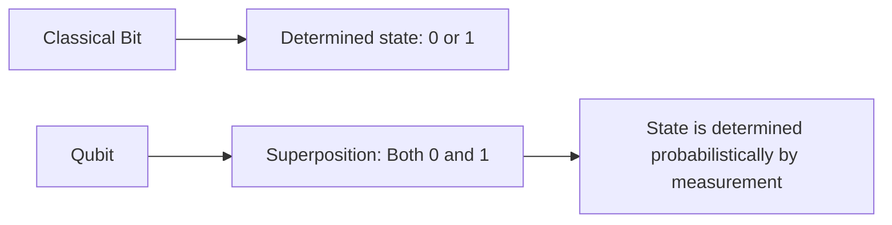
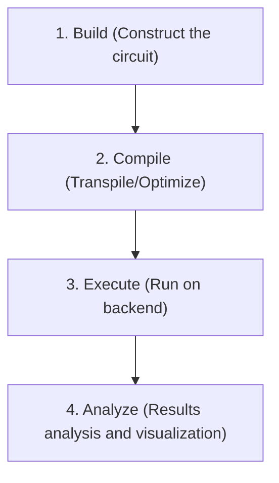
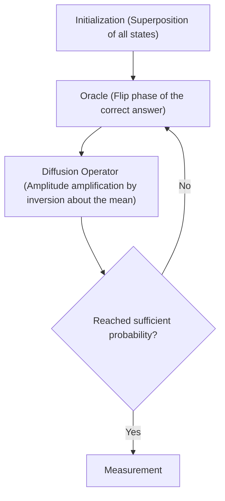

## 1. Introduction

Modern computers (classical computers) have dramatically changed our lives, supporting every aspect of society with their advanced computational power. However, it is known that for certain specific problems (such as factoring extremely large numbers, simulating complex molecular structures, and optimization problems), even the most cutting-edge supercomputers of today would require a time longer than the age of the universe.

What holds the potential to break through these "limits of classical computers" is the **Quantum Computer**. By utilizing the mysterious properties of quantum mechanics (superposition and quantum entanglement) as computational resources, it is believed that specific problems can be dramatically accelerated.

In this article, we will take our first steps into the world of quantum programming using **Qiskit**, an open-source quantum computing framework provided by IBM. This is an extremely detailed introductory guide that carefully explains everything from the basics of physics and mathematics, to actually writing code in Python and running quantum circuits on a simulator.

---

## 2. Fundamentals of Physics and Mathematics Behind Quantum Computing

To understand quantum programming, you first need to grasp the basic concepts of quantum mechanics. Here, we will explain the three important pillars: qubits, superposition, and quantum entanglement.

### 2.1 Classical Bits and Qubits (Quantum Bits)

The unit of information in classical computers is the "Bit". A bit always takes one of two states: `0` or `1`.

On the other hand, the smallest unit of information in a quantum computer is called a **Qubit (Quantum bit)**. A qubit can not only take the state of `0` and `1`, but it can also **hold both states simultaneously**.

Mathematically, the state of a qubit $|\psi\rangle$ is represented as a linear combination (superposition) of the basis states $|0\rangle$ and $|1\rangle$.

$$
|\psi\rangle = \alpha|0\rangle + \beta|1\rangle
$$

Here, $\alpha$ and $\beta$ are complex numbers, representing the probability amplitudes of observing the states $|0\rangle$ and $|1\rangle$, respectively. Based on the fundamental principles of quantum mechanics, the sum of probabilities must equal 1, thus satisfying the following normalization condition:

$$
|\alpha|^2 + |\beta|^2 = 1
$$

In other words, when this qubit is "measured (observed)", the probability of getting $|0\rangle$ is $|\alpha|^2$, and the probability of getting $|1\rangle$ is $|\beta|^2$. The decisive difference from classical bits is that the state is only determined probabilistically before measurement.



### 2.2 Superposition

As mentioned earlier, the state where $|0\rangle$ and $|1\rangle$ are mixed together is called **Superposition**.

For example, when a single qubit is in a perfectly equal superposition state, $\alpha = \frac{1}{\sqrt{2}}$ and $\beta = \frac{1}{\sqrt{2}}$.

$$
|\psi\rangle = \frac{1}{\sqrt{2}}|0\rangle + \frac{1}{\sqrt{2}}|1\rangle
$$

When this state is measured, $|0\rangle$ and $|1\rangle$ are observed with a 50% probability each.
If you have 2 qubits, you can create a superposition of 4 states: $|00\rangle, |01\rangle, |10\rangle, |11\rangle$. With $n$ qubits, $2^n$ states can be represented simultaneously, which is one of the sources of the parallel processing power of quantum computers.

### 2.3 Quantum Entanglement

The most powerful and mysterious property in quantum computing is **Quantum Entanglement**. This phenomenon, which Einstein called "spooky action at a distance," is a property where two or more qubits become strongly linked to each other. When the state of one qubit is determined, the state of the other qubit is instantaneously determined, no matter how far apart they are physically.

One of the most famous quantum entangled states, the "Bell State", specifically the $\Phi^+$ state, is expressed as follows:

$$
|\Phi^+\rangle = \frac{|00\rangle + |11\rangle}{\sqrt{2}}
$$

In this state, the states $|01\rangle$ and $|10\rangle$ do not exist. Therefore, if the first qubit is measured and is $|0\rangle$, the second qubit is guaranteed to be $|0\rangle$ without even needing to be measured. Conversely, if the first is $|1\rangle$, the second will also necessarily be $|1\rangle$.

---

## 3. Quantum Logic Gates

Just as classical computers perform calculations using logic gates like AND, OR, and NOT, quantum computers also manipulate the state of qubits using **Quantum Gates**. Since a quantum state is a vector, a quantum gate is represented as a "unitary matrix" acting on that vector.

### 3.1 Pauli Gates (Pauli-X, Y, Z)

Pauli gates are fundamental operations on a single qubit.

**・Pauli-X Gate (NOT Gate)**
Equivalent to the classical NOT gate. It flips $|0\rangle$ to $|1\rangle$, and $|1\rangle$ to $|0\rangle$. (A 180-degree rotation around the X-axis on the Bloch sphere)

$$
X = \begin{pmatrix} 0 & 1 \\ 1 & 0 \end{pmatrix}
$$

**・Pauli-Y Gate**
Performs a 180-degree rotation around the Y-axis. It has the effect of flipping both the phase and the bit.

$$
Y = \begin{pmatrix} 0 & -i \\ i & 0 \end{pmatrix}
$$

**・Pauli-Z Gate (Phase Flip Gate)**
Leaves the state of $|0\rangle$ as is, but flips the phase of the $|1\rangle$ state (multiplies by $-1$). (A 180-degree rotation around the Z-axis)

$$
Z = \begin{pmatrix} 1 & 0 \\ 0 & -1 \end{pmatrix}
$$

### 3.2 Hadamard Gate

The Hadamard gate (H gate) is an extremely important gate that transforms a determined state ($|0\rangle$ or $|1\rangle$) into a superposition state.

$$
H = \frac{1}{\sqrt{2}}
\begin{pmatrix}
1 & 1 \\
1 & -1
\end{pmatrix}
$$

Applying the H gate to $|0\rangle$ results in $|+\rangle$, which is an equal superposition state.

$$
H|0\rangle = \frac{1}{\sqrt{2}}|0\rangle + \frac{1}{\sqrt{2}}|1\rangle = |+\rangle
$$

### 3.3 Phase Gates

Phase gates are a generalization of the Z gate, rotating the phase of the $|1\rangle$ state by a specified angle $\theta$.

$$
P(\theta) = \begin{pmatrix} 1 & 0 \\ 0 & e^{i\theta} \end{pmatrix}
$$

Typical examples include the S gate ($\theta = \pi/2$) and the T gate ($\theta = \pi/4$).

### 3.4 CNOT Gate (Controlled-NOT Gate)

The CNOT gate (CX gate) is a gate that performs an operation between two qubits and is essential for generating quantum entanglement. It consists of a "Control bit" and a "Target bit".

Only when the control bit is $|1\rangle$, an X gate (NOT operation) is applied to the target bit; if the control bit is $|0\rangle$, nothing happens.

$$
CNOT = \begin{pmatrix}
1 & 0 & 0 & 0 \\
0 & 1 & 0 & 0 \\
0 & 0 & 0 & 1 \\
0 & 0 & 1 & 0
\end{pmatrix}
$$

---

## 4. Basics of Qiskit and Environment Setup

From here on, we will actually write quantum programs using Python and Qiskit.

### 4.1 What is Qiskit?

**Qiskit** is an open-source software development kit (SDK) for quantum computing developed by IBM Quantum. Using Python, you can intuitively build quantum circuits and run them on a local simulator or on actual IBM quantum computers via the cloud.

### 4.2 Installation Method

To use Qiskit, a Python environment is required. You can install Qiskit and related packages (simulator and drawing libraries) with the following command:

```bash
pip install qiskit qiskit-aer qiskit-ibm-runtime matplotlib pylatexenc
```

### 4.3 Basic Flow of Programming

Quantum programming using Qiskit mainly progresses through the following steps:



1. **Build**: Create a `QuantumCircuit` object and add gates to it.
2. **Compile**: Optimize the circuit for the backend (actual hardware or simulator) to be executed on.
3. **Execute**: Send the job to the backend and retrieve the results.
4. **Analyze**: Plot histograms of the measurement results, etc.

---

## 5. Practice: Building a Circuit to Create a Bell State (Quantum Entanglement)

Let's actually create the "Quantum Entanglement (Bell State)" we learned in theory using Qiskit. The target state is $|\Phi^+\rangle = \frac{|00\rangle + |11\rangle}{\sqrt{2}}$.

### 5.1 Circuit Design

To create a Bell state, we follow these steps:
1. Prepare two qubits (both initially in the $|0\rangle$ state).
2. Apply a Hadamard gate (H) to the first qubit to create a superposition state.
3. Apply a CNOT gate with the first qubit as the "Control bit" and the second qubit as the "Target bit".
4. Perform a Measurement to read the result.

### 5.2 Python/Qiskit Code Implementation

Now, let's look at the actual code.

```python
import numpy as np
from qiskit import QuantumCircuit, transpile
from qiskit_aer import Aer
from qiskit.visualization import plot_histogram
import matplotlib.pyplot as plt

# 1. Circuit Initialization
# Create a quantum circuit with 2 qubits and 2 classical bits
qc = QuantumCircuit(2, 2)

# 2. Applying the H Gate
# Apply a Hadamard gate to qubit 0 (q0)
qc.h(0)

# 3. Applying the CNOT Gate
# Apply CNOT using q0 as the control bit and q1 as the target bit
qc.cx(0, 1)

# 4. Measurement
# Measure qubits 0 and 1, and write the results to classical bits 0 and 1, respectively
qc.measure([0, 1], [0, 1])

# Draw the circuit diagram (using matplotlib)
# qc.draw('mpl')
print(qc.draw())
```

When you execute this code, the following quantum circuit diagram will be displayed as ASCII art on the console.

```text
     ┌───┐     ┌─┐   
q_0: ┤ H ├──■──┤M├───
     └───┘┌─┴─┐└╥┘┌─┐
q_1: ─────┤ X ├─╫─┤M├
          └───┘ ║ └╥┘
c: 2/═══════════╩══╩═
                0  1 
```
`H` represents the Hadamard gate, the combination of `■` and `X` is the CNOT gate, and `M` represents measurement.

### 5.3 Execution on Simulator and Interpretation of Results

Next, we will run this circuit on IBM's high-performance simulator `Aer` and check the results.

```python
# Get the Aer simulator backend
simulator = Aer.get_backend('qasm_simulator')

# Transpile (optimize) the circuit for the simulator
compiled_circuit = transpile(qc, simulator)

# Execute the circuit (here, running 1000 shots)
job = simulator.run(compiled_circuit, shots=1000)

# Retrieve the result
result = job.result()

# Get the observation counts for the states
counts = result.get_counts(compiled_circuit)
print("\nMeasurement results:", counts)

# Plotting the histogram
# plot_histogram(counts)
# plt.show()
```

**Interpretation of Results**

The console output should look something like this:
`Measurement results: {'00': 495, '11': 505}`
(*Note: Because probabilities are random, the numbers will fluctuate slightly with each execution.)

In an ideal simulation environment, the measurement results will show `00` and `11` observed roughly 50% of the time each, with `01` and `10` never being observed.
This completely matches the theoretical prediction of the Bell state $|\Phi^+\rangle = \frac{|00\rangle + |11\rangle}{\sqrt{2}}$ that we created. It accurately simulates "quantum entanglement" where if the first qubit is 0, the second is always 0, and if the first is 1, the second is always 1.

Furthermore, when executed on an actual quantum computer (IBM Quantum Hardware), `01` and `10` might be observed slightly due to the influence of noise (quantum decoherence and gate errors). How to reduce this noise (quantum error correction) is one of the biggest challenges in current quantum computer development.

---

## 6. Scaling Up to More Advanced Algorithms

Creating a Bell state can be considered the "Hello World" of quantum programming. By expanding upon this, we can construct powerful algorithms that surpass classical computers.

### 6.1 Deutsch-Jozsa Algorithm

This is a problem to determine whether a given function $f(x)$ is a "constant function" (always outputs 0 or always outputs 1 regardless of input) or a "balanced function" (outputs 0 for half of the inputs and 1 for the other half).
While a classical computer requires at worst $2^{n-1} + 1$ evaluations of the function, the Deutsch-Jozsa algorithm can determine it with **just 1 evaluation** by utilizing quantum parallelism. This demonstrates the basic pattern of quantum algorithms: inputting a superposition state, using interference to cancel out unnecessary states, and amplifying the desired answer.

### 6.2 Grover's Algorithm

In the search problem of finding specific data from $N$ unsorted database elements, a classical algorithm requires an average of $N/2$ computations, whereas Grover's algorithm can find the target data in $\sqrt{N}$ computations.
This algorithm uses a black box called an "Oracle" to flip the phase of the target solution, and further applies "Amplitude Amplification" to dramatically increase the probability of observing the target solution.



---

## 7. Conclusion and Future Learning

In this article, we started with fundamental concepts of quantum computing such as superposition and quantum entanglement, and explained in detail the manipulation of quantum logic gates using Qiskit, up to actually constructing and simulating a Bell state and interpreting the results.

Because Qiskit allows you to write in a familiar language like Python, it is a powerful tool that helps you focus on algorithm construction by overcoming mathematical and physical barriers. Although quantum computers are currently in the era of Noisy Intermediate-Scale Quantum (NISQ) devices, applied research is rapidly advancing worldwide in numerous fields such as Quantum Machine Learning, Quantum Chemistry simulations, and cryptography.

By all means, take this opportunity to create various quantum circuits using Qiskit and try running them on actual IBM Quantum processors. You should be able to experience the computing paradigm of the future firsthand.

### References
- [Qiskit Official Documentation](https://qiskit.org/documentation/)
- [Qiskit Textbook](https://qiskit.org/textbook/ja/preface.html) - An official textbook recommended for those who want to learn deeper mathematical backgrounds and algorithms
- IBM Quantum Learning

Welcome to the quantum world!
