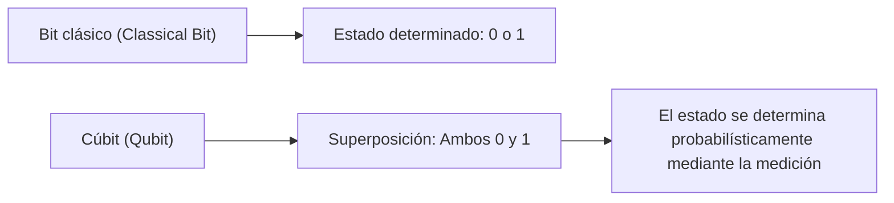
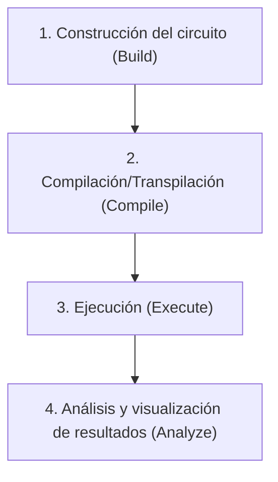
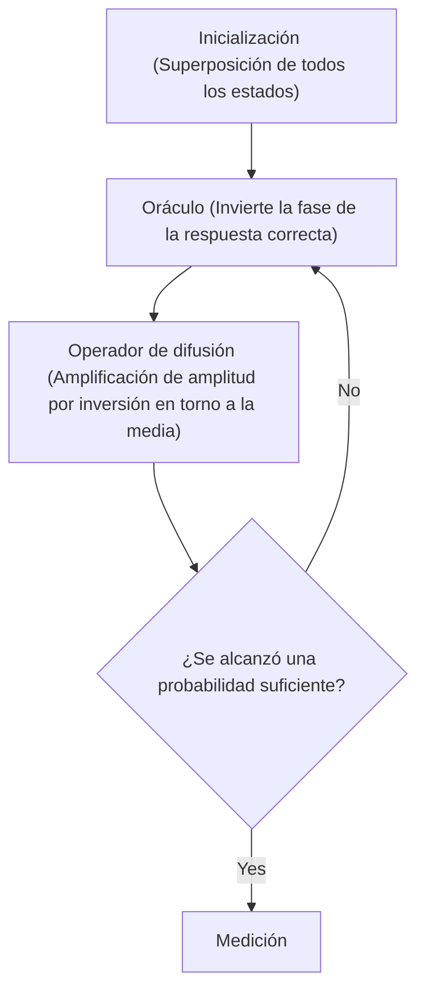

## 1. Introducción

Las computadoras modernas (computadoras clásicas) han cambiado drásticamente nuestras vidas, apoyando todos los aspectos de la sociedad a través de su alta capacidad de cálculo. Sin embargo, para ciertos problemas específicos (por ejemplo, la factorización de números primos gigantescos, la simulación de estructuras moleculares complejas, problemas de optimización, etc.), se sabe que incluso las supercomputadoras más avanzadas de la actualidad necesitarían más tiempo que la edad del universo.

Lo que tiene el potencial de romper estos "límites de las computadoras clásicas" es la **computadora cuántica (Quantum Computer)**. Al aprovechar las extrañas propiedades de la mecánica cuántica (superposición y entrelazamiento cuántico) como recursos de cálculo, se cree que es posible acelerar drásticamente la resolución de problemas específicos.

En este artículo, daremos el primer paso en el mundo de la programación cuántica utilizando **Qiskit**, el framework de computación cuántica de código abierto proporcionado por IBM. Esta es una guía introductoria muy detallada que explica cuidadosamente desde los fundamentos de la física y las matemáticas, hasta el proceso de escribir código real en Python y ejecutar circuitos cuánticos en un simulador.

---

## 2. Fundamentos físicos y matemáticos que sustentan la computación cuántica

Para entender la programación cuántica, primero es necesario comprender los conceptos básicos de la mecánica cuántica. Aquí explicaremos los tres pilares importantes: cúbit, superposición y entrelazamiento cuántico.

### 2.1 Bit clásico y cúbit (Qubit)

La unidad de información de una computadora clásica es el "bit (Bit)". Un bit siempre toma uno de los dos estados: `0` o `1`.

Por otro lado, la unidad mínima de información en una computadora cuántica se llama **cúbit (Qubit: Quantum bit)**. Los cúbits no solo pueden tomar los estados `0` y `1`, sino que también pueden **mantener ambos estados simultáneamente**.

Matemáticamente, el estado de un cúbit $|\psi\rangle$ se expresa como una combinación lineal (superposición) de los estados base $|0\rangle$ y $|1\rangle$.

$$
|\psi\rangle = \alpha|0\rangle + \beta|1\rangle
$$

Aquí, $\alpha$ y $\beta$ son números complejos que representan las amplitudes de probabilidad de observar los estados $|0\rangle$ y $|1\rangle$, respectivamente. Basado en los principios básicos de la mecánica cuántica, dado que la suma de las probabilidades debe ser 1, se cumple la siguiente condición de normalización:

$$
|\alpha|^2 + |\beta|^2 = 1
$$

Es decir, cuando "medimos (observamos)" este cúbit, la probabilidad de obtener $|0\rangle$ es $|\alpha|^2$ y la probabilidad de obtener $|1\rangle$ es $|\beta|^2$. El hecho de que el estado solo se determine probabilísticamente antes de la medición es una diferencia crucial con respecto a los bits clásicos.



### 2.2 Superposición (Superposition)

Como se mencionó anteriormente, el estado en el que se mezclan $|0\rangle$ y $|1\rangle$ se llama **superposición (Superposition)**.

Por ejemplo, cuando un cúbit está en un estado de superposición completamente uniforme, $\alpha = \frac{1}{\sqrt{2}}$ y $\beta = \frac{1}{\sqrt{2}}$.

$$
|\psi\rangle = \frac{1}{\sqrt{2}}|0\rangle + \frac{1}{\sqrt{2}}|1\rangle
$$

Al medir este estado, se observa $|0\rangle$ y $|1\rangle$ con un 50% de probabilidad cada uno.
Si tenemos 2 cúbits, podemos crear una superposición de 4 estados: $|00\rangle, |01\rangle, |10\rangle, |11\rangle$. Si tenemos $n$ cúbits, podemos representar $2^n$ estados simultáneamente, y esta es una de las fuentes del poder de procesamiento paralelo de las computadoras cuánticas.

### 2.3 Entrelazamiento cuántico (Entanglement)

La propiedad más poderosa y misteriosa en la computación cuántica es el **entrelazamiento cuántico (Entanglement)**. Este fenómeno, que Einstein llamó "acción fantasmal a distancia", es una propiedad donde dos o más cúbits están fuertemente conectados entre sí, y cuando se determina el estado de uno de ellos, el estado del otro se determina instantáneamente, sin importar cuán lejos estén físicamente.

Uno de los estados entrelazados más famosos, el estado $\Phi^+$ de los "estados de Bell (Bell State)", se expresa de la siguiente manera:

$$
|\Phi^+\rangle = \frac{|00\rangle + |11\rangle}{\sqrt{2}}
$$

En este estado, los estados $|01\rangle$ y $|10\rangle$ no existen. Por lo tanto, si medimos el primer cúbit y es $|0\rangle$, sin siquiera medir el segundo, sabemos con certeza que es $|0\rangle$. Por el contrario, si el primero es $|1\rangle$, el segundo obligatoriamente será $|1\rangle$.

---

## 3. Puertas lógicas cuánticas (Quantum Logic Gates)

Al igual que las computadoras clásicas realizan cálculos utilizando puertas lógicas como AND, OR y NOT, las computadoras cuánticas manipulan el estado de los cúbits utilizando **puertas cuánticas**. Dado que los estados cuánticos son vectores, las puertas cuánticas se representan como "matrices unitarias" que actúan sobre esos vectores.

### 3.1 Puertas de Pauli (Pauli-X, Y, Z)

Las puertas de Pauli son operaciones básicas sobre 1 cúbit.

**・Puerta Pauli-X (Puerta NOT)**
Equivale a la puerta NOT clásica. Invierte $|0\rangle$ a $|1\rangle$, y $|1\rangle$ a $|0\rangle$. (Rotación de 180 grados alrededor del eje X en la esfera de Bloch).

$$
X = \begin{pmatrix} 0 & 1 \\ 1 & 0 \end{pmatrix}
$$

**・Puerta Pauli-Y**
Realiza una rotación de 180 grados alrededor del eje Y. Tiene el efecto de invertir tanto la fase como el bit.

$$
Y = \begin{pmatrix} 0 & -i \\ i & 0 \end{pmatrix}
$$

**・Puerta Pauli-Z (Puerta de inversión de fase)**
Mantiene el estado $|0\rangle$ tal como está, e invierte la fase del estado $|1\rangle$ (multiplica por $-1$). (Rotación de 180 grados alrededor del eje Z).

$$
Z = \begin{pmatrix} 1 & 0 \\ 0 & -1 \end{pmatrix}
$$

### 3.2 Puerta de Hadamard (Hadamard Gate)

La puerta de Hadamard (Puerta H) es una puerta extremadamente importante que convierte un estado determinado ($|0\rangle$ o $|1\rangle$) en un estado de superposición.

$$
H = \frac{1}{\sqrt{2}}
\begin{pmatrix}
1 & 1 \\
1 & -1
\end{pmatrix}
$$

Al aplicar la puerta H a $|0\rangle$, obtenemos el estado $|+\rangle$, que es un estado de superposición uniforme.

$$
H|0\rangle = \frac{1}{\sqrt{2}}|0\rangle + \frac{1}{\sqrt{2}}|1\rangle = |+\rangle
$$

### 3.3 Puertas de fase (Phase Gates)

Las puertas de fase generalizan la puerta Z, rotando la fase del estado $|1\rangle$ un ángulo específico $\theta$.

$$
P(\theta) = \begin{pmatrix} 1 & 0 \\ 0 & e^{i\theta} \end{pmatrix}
$$

Ejemplos típicos son la puerta S ($\theta = \pi/2$) y la puerta T ($\theta = \pi/4$).

### 3.4 Puerta CNOT (Controlled-NOT Gate)

La puerta CNOT (Puerta CX) es una puerta que opera entre 2 cúbits y es indispensable para generar entrelazamiento cuántico. Consiste en un "bit de control (Control)" y un "bit objetivo (Target)".

Solo cuando el bit de control es $|1\rangle$, se aplica una puerta X (operación NOT) al bit objetivo. Si el bit de control es $|0\rangle$, no hace nada.

$$
CNOT = \begin{pmatrix}
1 & 0 & 0 & 0 \\
0 & 1 & 0 & 0 \\
0 & 0 & 0 & 1 \\
0 & 0 & 1 & 0
\end{pmatrix}
$$

---

## 4. Conceptos básicos de Qiskit y configuración del entorno

A partir de aquí, utilizaremos Python y Qiskit en la práctica para escribir un programa cuántico.

### 4.1 ¿Qué es Qiskit?

**Qiskit** es un kit de desarrollo de software (SDK) de código abierto para computación cuántica desarrollado por IBM Quantum. Permite construir circuitos cuánticos de forma intuitiva utilizando Python y ejecutarlos en simuladores locales o en hardware cuántico real de IBM a través de la nube.

### 4.2 Método de instalación

Para utilizar Qiskit, necesitas un entorno de Python. Instala Qiskit y los paquetes relacionados (simuladores y bibliotecas de dibujo) con el siguiente comando.

```bash
pip install qiskit qiskit-aer qiskit-ibm-runtime matplotlib pylatexenc
```

### 4.3 Flujo básico de programación

La programación cuántica utilizando Qiskit procede principalmente en los siguientes pasos.



1. **Construcción del circuito**: Se crea un objeto `QuantumCircuit` y se van agregando puertas.
2. **Compilación**: Se optimiza el circuito de acuerdo al backend de ejecución (hardware real o simulador).
3. **Ejecución**: Se envía el trabajo al backend y se obtienen los resultados.
4. **Análisis**: Se grafica un histograma de los resultados de la medición.

---

## 5. Práctica: Construcción de un circuito que crea el estado de Bell (Entrelazamiento cuántico)

Intentemos crear el "entrelazamiento cuántico (estado de Bell)" que aprendimos en la teoría, en la práctica con Qiskit. El estado objetivo es $|\Phi^+\rangle = \frac{|00\rangle + |11\rangle}{\sqrt{2}}$.

### 5.1 Diseño del circuito

Para crear el estado de Bell, seguiremos los siguientes pasos:
1. Preparar 2 cúbits (el estado inicial de ambos es $|0\rangle$).
2. Aplicar una puerta de Hadamard (H) al primer cúbit para ponerlo en un estado de superposición.
3. Aplicar una puerta CNOT utilizando el primer cúbit como "bit de control" y el segundo cúbit como "bit objetivo".
4. Realizar una medición (Measure) para leer el resultado.

### 5.2 Implementación del código en Python/Qiskit

Veamos el código real.

```python
import numpy as np
from qiskit import QuantumCircuit, transpile
from qiskit_aer import Aer
from qiskit.visualization import plot_histogram
import matplotlib.pyplot as plt

# 1. Inicialización del circuito
# Crear un circuito cuántico con 2 cúbits y 2 bits clásicos
qc = QuantumCircuit(2, 2)

# 2. Aplicación de la puerta H
# Aplicar la puerta de Hadamard al cúbit 0 (q0)
qc.h(0)

# 3. Aplicación de la puerta CNOT
# Aplicar CNOT con q0 como bit de control y q1 como bit objetivo
qc.cx(0, 1)

# 4. Medición
# Medir los cúbits 0 y 1 y escribir en los bits clásicos 0 y 1 respectivamente
qc.measure([0, 1], [0, 1])

# Dibujar el diagrama del circuito (usando matplotlib)
# qc.draw('mpl')
print(qc.draw())
```

Al ejecutar este código, se mostrará el siguiente diagrama de circuito cuántico en arte ASCII en la consola.

```text
     ┌───┐     ┌─┐   
q_0: ┤ H ├──■──┤M├───
     └───┘┌─┴─┐└╥┘┌─┐
q_1: ─────┤ X ├─╫─┤M├
          └───┘ ║ └╥┘
c: 2/═══════════╩══╩═
                0  1 
```
`H` representa la puerta de Hadamard, la combinación de `■` y `X` es la puerta CNOT, y `M` representa la medición.

### 5.3 Ejecución en el simulador e interpretación de los resultados

A continuación, ejecutaremos este circuito en el simulador de alto rendimiento `Aer` de IBM y verificaremos los resultados.

```python
# Obtener el backend del simulador Aer
simulator = Aer.get_backend('qasm_simulator')

# Transpilar (optimizar) el circuito para el simulador
compiled_circuit = transpile(qc, simulator)

# Ejecutar el circuito (aquí ejecutamos 1000 disparos)
job = simulator.run(compiled_circuit, shots=1000)

# Obtener los resultados
result = job.result()

# Obtener el recuento de observaciones del estado
counts = result.get_counts(compiled_circuit)
print("\nResultados de medición:", counts)

# Graficar el histograma
# plot_histogram(counts)
# plt.show()
```

**Interpretación de los resultados**

La salida en la consola debería verse así:
`Resultados de medición: {'00': 495, '11': 505}`
(*Como la probabilidad es aleatoria, los números variarán ligeramente en cada ejecución).

En un entorno de simulación ideal, los resultados de la medición mostrarán `00` y `11` con aproximadamente un 50% de probabilidad cada uno, y `01` y `10` no se observarán en absoluto.
Esto coincide perfectamente con la predicción teórica del estado de Bell $|\Phi^+\rangle = \frac{|00\rangle + |11\rangle}{\sqrt{2}}$ que hemos creado. Si el primer cúbit es 0, el segundo siempre será 0, y si es 1, siempre será 1, simulando con precisión este "entrelazamiento cuántico".

Cabe señalar que al ejecutarlo en una computadora cuántica real (IBM Quantum Hardware), los estados `01` y `10` pueden ser observados ligeramente debido al impacto del ruido (decoherencia cuántica y errores de puerta). Reducir este ruido (corrección de errores cuánticos) es uno de los mayores desafíos en el desarrollo actual de las computadoras cuánticas.

---

## 6. Escalando a algoritmos más avanzados

La creación del estado de Bell puede considerarse el "Hello World" de la programación cuántica. Al desarrollarlo aún más, es posible construir poderosos algoritmos que superan a las computadoras clásicas.

### 6.1 Algoritmo de Deutsch-Jozsa (Deutsch-Jozsa Algorithm)

Este es un problema en el que se determina si una función dada $f(x)$ es una "función constante" (siempre devuelve 0 o siempre devuelve 1 independientemente de la entrada) o una "función equilibrada" (devuelve 0 para la mitad de las entradas y 1 para la otra mitad).
En una computadora clásica, en el peor de los casos, se requerirían $2^{n-1} + 1$ evaluaciones de la función, pero utilizando el algoritmo de Deutsch-Jozsa, se puede determinar con **solo 1 evaluación** utilizando el paralelismo cuántico. Esto muestra el patrón básico de los algoritmos cuánticos, donde se introduce un estado de superposición, se utiliza la interferencia (Interference) para cancelar los estados innecesarios y se amplifica la respuesta deseada.

### 6.2 Algoritmo de Grover (Grover's Algorithm)

En el problema de buscar datos específicos en una base de datos de $N$ elementos no ordenados, mientras que un algoritmo clásico requiere un promedio de $N/2$ cálculos, el algoritmo de Grover puede encontrar los datos deseados en $\sqrt{N}$ cálculos.
Este algoritmo utiliza una caja negra llamada "oráculo (Oracle)" para invertir la fase de la solución objetivo, y luego realiza una "amplificación de amplitud (Amplitude Amplification)" para aumentar drásticamente la probabilidad de observar la solución deseada.



---

## 7. Conclusión y próximos pasos en el aprendizaje

En este artículo, comenzamos desde conceptos fundamentales de la computación cuántica como la superposición y el entrelazamiento cuántico, y explicamos detalladamente hasta la manipulación de puertas lógicas cuánticas utilizando Qiskit, así como la construcción real, simulación e interpretación de resultados del estado de Bell.

Dado que Qiskit se puede escribir en un lenguaje familiar como Python, es una herramienta poderosa que te permite superar las barreras matemáticas y físicas, y concentrarte en la construcción de algoritmos. Aunque actualmente las computadoras cuánticas están en la era de los dispositivos cuánticos ruidosos de escala intermedia (NISQ: Noisy Intermediate-Scale Quantum), la investigación aplicada está avanzando rápidamente en todo el mundo en muchos campos como el aprendizaje automático cuántico (Quantum Machine Learning), la simulación química (Quantum Chemistry) y la criptografía.

Aprovecha esta oportunidad para construir varios circuitos cuánticos por ti mismo utilizando Qiskit y ejecútalos en procesadores reales de IBM Quantum. Seguramente podrás experimentar con tus propias manos el paradigma computacional del futuro.

### Referencias
- [Documentación oficial de Qiskit](https://qiskit.org/documentation/)
- [Qiskit Textbook](https://qiskit.org/textbook/ja/preface.html) - Texto oficial recomendado para aquellos que deseen profundizar en los antecedentes matemáticos y algorítmicos.
- IBM Quantum Learning

¡Bienvenido al mundo cuántico!
