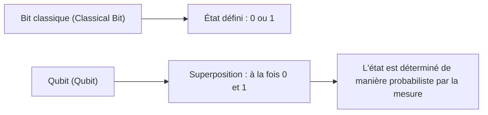
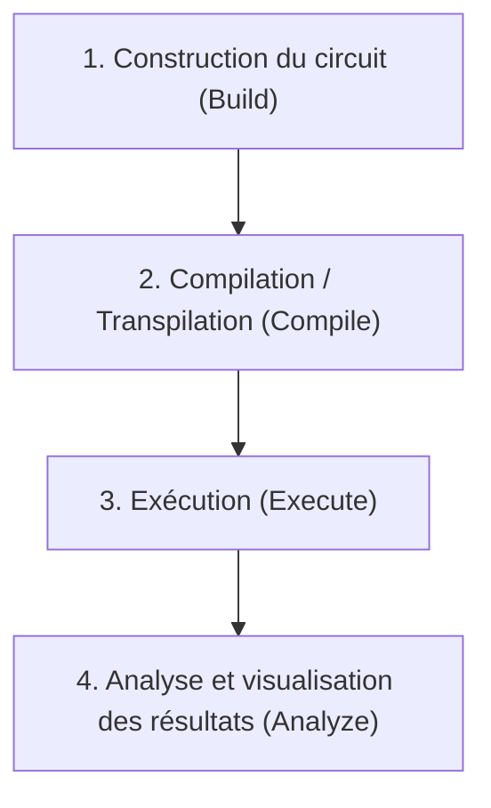
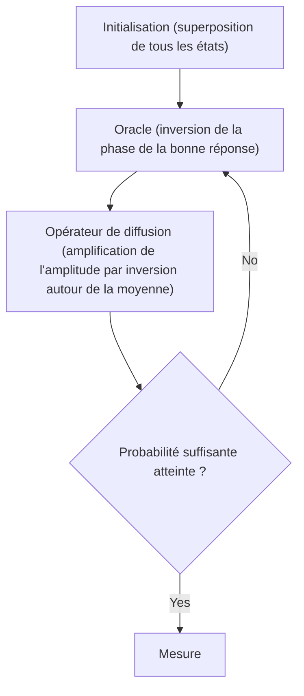

## 1. Introduction

Les ordinateurs modernes (ordinateurs classiques) ont radicalement changé nos vies et soutiennent tous les aspects de la société grâce à leur puissance de calcul avancée. Cependant, il est connu que pour certains problèmes spécifiques (par exemple, la factorisation de très grands nombres, la simulation de structures moléculaires complexes, les problèmes d'optimisation, etc.), même les superordinateurs de pointe actuels nécessiteraient un temps supérieur à l'âge de l'univers.

Les **ordinateurs quantiques (Quantum Computer)** ont le potentiel de briser ces "limites des ordinateurs classiques". En utilisant les propriétés étranges de la mécanique quantique (superposition et intrication quantique) comme ressources de calcul, on pense que certains problèmes peuvent être résolus de manière considérablement plus rapide.

Dans cet article, nous ferons notre premier pas dans le monde de la programmation quantique en utilisant **Qiskit**, un framework d'informatique quantique open source fourni par IBM. Il s'agit d'un guide d'introduction très détaillé couvrant tout le processus, allant des bases de la physique et des mathématiques jusqu'à l'écriture de code en Python et l'exécution de circuits quantiques sur un simulateur.

---

## 2. Fondements physiques et mathématiques du calcul quantique

Pour comprendre la programmation quantique, vous devez d'abord comprendre les concepts de base de la mécanique quantique. Nous expliquons ici trois piliers importants : les qubits, la superposition et l'intrication quantique.

### 2.1 Bits classiques et bits quantiques (Qubit)

L'unité d'information d'un ordinateur classique est le "bit". Un bit prend toujours l'un des deux états : `0` ou `1`.

D'autre part, la plus petite unité d'information d'un ordinateur quantique est appelée **bit quantique (Qubit : Quantum bit)**. Un qubit peut non seulement prendre les états `0` et `1`, mais il peut également **maintenir ces deux états en même temps**.

Mathématiquement, l'état d'un qubit $|\psi\rangle$ s'exprime comme une combinaison linéaire (superposition) des états de base $|0\rangle$ et $|1\rangle$.

$$
|\psi\rangle = \alpha|0\rangle + \beta|1\rangle
$$

Ici, $\alpha$ et $\beta$ sont des nombres complexes, représentant respectivement l'amplitude de probabilité d'observer les états $|0\rangle$ et $|1\rangle$. D'après les principes de base de la mécanique quantique, la somme des probabilités doit être égale à 1, ce qui satisfait à la condition de normalisation suivante :

$$
|\alpha|^2 + |\beta|^2 = 1
$$

En d'autres termes, lorsque ce qubit est "mesuré (observé)", la probabilité d'obtenir $|0\rangle$ est $|\alpha|^2$ et la probabilité d'obtenir $|1\rangle$ est $|\beta|^2$. La différence cruciale avec un bit classique est que l'état n'est déterminé que de manière probabiliste avant la mesure.



### 2.2 Superposition (Superposition)

Comme mentionné précédemment, l'état dans lequel $|0\rangle$ et $|1\rangle$ sont mélangés est appelé **superposition (Superposition)**.

Par exemple, si un seul qubit est dans un état de superposition parfaitement égale, alors $\alpha = \frac{1}{\sqrt{2}}$ et $\beta = \frac{1}{\sqrt{2}}$.

$$
|\psi\rangle = \frac{1}{\sqrt{2}}|0\rangle + \frac{1}{\sqrt{2}}|1\rangle
$$

Lorsque cet état est mesuré, $|0\rangle$ et $|1\rangle$ sont observés chacun avec une probabilité de 50%.
Si vous avez deux qubits, vous pouvez créer une superposition de quatre états : $|00\rangle, |01\rangle, |10\rangle, |11\rangle$. Si vous avez $n$ qubits, vous pouvez exprimer $2^n$ états simultanément, ce qui est l'une des sources de la capacité de traitement parallèle des ordinateurs quantiques.

### 2.3 Intrication quantique (Entanglement)

La propriété la plus puissante et la plus mystérieuse du calcul quantique est **l'intrication quantique (Entanglement)**. Ce phénomène, appelé "action fantôme à distance" par Einstein, est la propriété selon laquelle deux ou plusieurs qubits sont si fortement liés que lorsque l'état de l'un d'eux est déterminé, l'état de l'autre est instantanément déterminé, quelle que soit la distance physique qui les sépare.

L'un des états d'intrication quantique les plus célèbres, l'« état de Bell (Bell State) », l'état $\Phi^+$, est exprimé comme suit :

$$
|\Phi^+\rangle = \frac{|00\rangle + |11\rangle}{\sqrt{2}}
$$

Dans cet état, les états $|01\rangle$ ou $|10\rangle$ n'existent pas. Par conséquent, si le premier qubit est mesuré et s'avère être $|0\rangle$, il est certain que le second est $|0\rangle$ sans même avoir besoin de le mesurer. Inversement, si le premier est $|1\rangle$, le second sera inévitablement $|1\rangle$.

---

## 3. Portes logiques quantiques (Quantum Logic Gates)

Tout comme les ordinateurs classiques utilisent des portes logiques telles que AND, OR et NOT pour effectuer des calculs, les ordinateurs quantiques utilisent des **portes quantiques** pour manipuler l'état des qubits. L'état quantique étant un vecteur, une porte quantique est représentée par une "matrice unitaire" agissant sur ce vecteur.

### 3.1 Portes de Pauli (Pauli-X, Y, Z)

Les portes de Pauli sont des opérations de base sur un seul qubit.

**・Porte Pauli-X (Porte NOT)**
Équivalent à la porte NOT classique. Elle inverse $|0\rangle$ en $|1\rangle$, et $|1\rangle$ en $|0\rangle$. (Rotation de 180 degrés autour de l'axe X sur la sphère de Bloch)

$$
X = \begin{pmatrix} 0 & 1 \\ 1 & 0 \end{pmatrix}
$$

**・Porte Pauli-Y**
Effectue une rotation de 180 degrés autour de l'axe Y. Elle a pour effet d'inverser à la fois la phase et le bit.

$$
Y = \begin{pmatrix} 0 & -i \\ i & 0 \end{pmatrix}
$$

**・Porte Pauli-Z (Porte d'inversion de phase)**
Laisse l'état $|0\rangle$ tel quel et inverse la phase de l'état $|1\rangle$ (en le multipliant par $-1$). (Rotation de 180 degrés autour de l'axe Z)

$$
Z = \begin{pmatrix} 1 & 0 \\ 0 & -1 \end{pmatrix}
$$

### 3.2 Porte de Hadamard (Hadamard Gate)

La porte de Hadamard (porte H) est une porte extrêmement importante qui convertit un état défini ($|0\rangle$ ou $|1\rangle$) en un état superposé.

$$
H = \frac{1}{\sqrt{2}}
\begin{pmatrix}
1 & 1 \\
1 & -1
\end{pmatrix}
$$

L'application de la porte H à $|0\rangle$ donne $|+\rangle$, qui est un état de superposition égale.

$$
H|0\rangle = \frac{1}{\sqrt{2}}|0\rangle + \frac{1}{\sqrt{2}}|1\rangle = |+\rangle
$$

### 3.3 Portes de phase (Phase Gates)

La porte de phase est une généralisation de la porte Z, qui fait tourner la phase de l'état $|1\rangle$ d'un angle spécifié $\theta$.

$$
P(\theta) = \begin{pmatrix} 1 & 0 \\ 0 & e^{i\theta} \end{pmatrix}
$$

Les représentantes typiques sont la porte S ($\theta = \pi/2$) et la porte T ($\theta = \pi/4$).

### 3.4 Porte CNOT (Controlled-NOT Gate)

La porte CNOT (porte CX) est une porte qui opère entre deux qubits et est essentielle pour générer l'intrication quantique. Elle se compose d'un "bit de contrôle (Control)" et d'un "bit cible (Target)".

Elle n'applique la porte X (opération NOT) au bit cible que si le bit de contrôle est $|1\rangle$, et ne fait rien si le bit de contrôle est $|0\rangle$.

$$
CNOT = \begin{pmatrix}
1 & 0 & 0 & 0 \\
0 & 1 & 0 & 0 \\
0 & 0 & 0 & 1 \\
0 & 0 & 1 & 0
\end{pmatrix}
$$

---

## 4. Bases de Qiskit et configuration de l'environnement

À partir de là, nous allons écrire des programmes quantiques en utilisant Python et Qiskit.

### 4.1 Qu'est-ce que Qiskit ?

**Qiskit** est un kit de développement logiciel (SDK) d'informatique quantique open source développé par IBM Quantum. En utilisant Python, vous pouvez construire intuitivement des circuits quantiques et les exécuter sur un simulateur local ou sur de véritables ordinateurs quantiques IBM via le cloud.

### 4.2 Méthode d'installation

Pour utiliser Qiskit, vous avez besoin d'un environnement Python. Installez Qiskit et les packages associés (simulateurs, bibliothèques de dessin) à l'aide de la commande suivante.

```bash
pip install qiskit qiskit-aer qiskit-ibm-runtime matplotlib pylatexenc
```

### 4.3 Flux de base de la programmation

La programmation quantique avec Qiskit se déroule principalement selon les étapes suivantes.



1. **Construction du circuit** : Créez un objet `QuantumCircuit` et ajoutez-y des portes.
2. **Compilation** : Optimisez le circuit pour le backend d'exécution (machine réelle ou simulateur).
3. **Exécution** : Envoyez le job au backend et obtenez les résultats.
4. **Analyse** : Tracez des histogrammes des résultats de mesure, etc.

---

## 5. Pratique : Construction d'un circuit pour créer un état de Bell (intrication quantique)

Essayons de créer « l'intrication quantique (état de Bell) » apprise en théorie avec Qiskit. L'état cible est $|\Phi^+\rangle = \frac{|00\rangle + |11\rangle}{\sqrt{2}}$.

### 5.1 Conception du circuit

Pour créer un état de Bell, suivez ces étapes :
1. Préparez deux qubits (l'état initial est $|0\rangle$ pour les deux).
2. Appliquez une porte de Hadamard (H) au premier qubit pour le mettre dans un état superposé.
3. Appliquez une porte CNOT avec le premier qubit comme "bit de contrôle" et le deuxième qubit comme "bit cible".
4. Effectuez une mesure (Measure) pour lire les résultats.

### 5.2 Implémentation du code Python/Qiskit

Examinons le code réel.

```python
import numpy as np
from qiskit import QuantumCircuit, transpile
from qiskit_aer import Aer
from qiskit.visualization import plot_histogram
import matplotlib.pyplot as plt

# 1. Initialisation du circuit
# Créer un circuit quantique avec 2 qubits et 2 bits classiques
qc = QuantumCircuit(2, 2)

# 2. Application de la porte H
# Appliquer la porte de Hadamard au qubit 0 (q0)
qc.h(0)

# 3. Application de la porte CNOT
# Appliquer CNOT avec q0 comme bit de contrôle et q1 comme bit cible
qc.cx(0, 1)

# 4. Mesure
# Mesurer les qubits 0 et 1 et les écrire respectivement dans les bits classiques 0 et 1
qc.measure([0, 1], [0, 1])

# Dessiner le diagramme du circuit (en utilisant matplotlib)
# qc.draw('mpl')
print(qc.draw())
```

Lorsque vous exécutez ce code, le schéma de circuit quantique suivant s'affiche en art ASCII sur la console.

```text
     ┌───┐     ┌─┐   
q_0: ┤ H ├──■──┤M├───
     └───┘┌─┴─┐└╥┘┌─┐
q_1: ─────┤ X ├─╫─┤M├
          └───┘ ║ └╥┘
c: 2/═══════════╩══╩═
                0  1 
```
`H` représente la porte de Hadamard, la combinaison de `■` et `X` représente la porte CNOT, et `M` représente la mesure.

### 5.3 Exécution sur le simulateur et interprétation des résultats

Ensuite, nous allons exécuter ce circuit sur le simulateur hautes performances d'IBM `Aer` et vérifier les résultats.

```python
# Obtenir le backend du simulateur Aer
simulator = Aer.get_backend('qasm_simulator')

# Transpiler (optimiser) le circuit pour le simulateur
compiled_circuit = transpile(qc, simulator)

# Exécuter le circuit (ici, exécution de 1000 tirs)
job = simulator.run(compiled_circuit, shots=1000)

# Obtenir le résultat
result = job.result()

# Obtenir le nombre d'observations (counts) des états
counts = result.get_counts(compiled_circuit)
print("\nRésultat de mesure :", counts)

# Tracer l'histogramme
# plot_histogram(counts)
# plt.show()
```

**Interprétation des résultats**

La sortie de la console devrait ressembler à ceci :
`Résultat de mesure : {'00': 495, '11': 505}`
(* Les probabilités étant aléatoires, les valeurs fluctueront légèrement à chaque exécution)

Dans un environnement de simulation idéal, les résultats de mesure pour `00` et `11` sont observés à environ 50 % chacun, tandis que `01` et `10` ne sont pas du tout observés.
Cela correspond parfaitement à la prédiction théorique de l'état de Bell $|\Phi^+\rangle = \frac{|00\rangle + |11\rangle}{\sqrt{2}}$ que nous avons créé. "L'intrication quantique", où si le premier qubit est 0 le second est toujours 0, et s'il est 1 le second est toujours 1, est simulée avec précision.

Notez que lors de l'exécution sur une véritable machine quantique (IBM Quantum Hardware), en raison de l'influence du bruit (décohérence quantique et erreurs de porte), `01` ou `10` peuvent être légèrement observés. Comment réduire ce bruit (correction d'erreurs quantiques) est l'un des plus grand défis du développement actuel des ordinateurs quantiques.

---

## 6. Mise à l'échelle vers des algorithmes plus avancés

La création d'un état de Bell est comparable au "Hello World" de la programmation quantique. En développant cela plus loin, il est possible de construire de puissants algorithmes surpassant les ordinateurs classiques.

### 6.1 Algorithme de Deutsch-Jozsa (Deutsch-Jozsa Algorithm)

Il s'agit du problème de déterminer si une fonction donnée $f(x)$ est une "fonction constante (sort toujours 0 ou toujours 1 indépendamment de l'entrée)" ou une "fonction équilibrée (sort 0 pour la moitié des entrées et 1 pour l'autre moitié)".
Un ordinateur classique nécessite dans le pire des cas $2^{n-1} + 1$ évaluations de la fonction, mais l'algorithme de Deutsch-Jozsa peut prendre cette décision avec **une seule évaluation** en utilisant le parallélisme quantique. Ceci illustre le modèle de base d'un algorithme quantique : entrer un état superposé, utiliser l'interférence (Interference) pour annuler les états inutiles, et amplifier la réponse souhaitée.

### 6.2 Algorithme de Grover (Grover's Algorithm)

Dans le problème de recherche d'une donnée spécifique parmi $N$ bases de données non triées, alors qu'un algorithme classique nécessite en moyenne $N/2$ calculs, l'algorithme de Grover permet de trouver la donnée cible en $\sqrt{N}$ fois.
Cet algorithme utilise une boîte noire appelée "Oracle (Oracle)" pour inverser la phase de la solution cible, puis effectue une "amplification d'amplitude (Amplitude Amplification)" pour augmenter considérablement la probabilité que la solution cible soit observée.



---

## 7. Conclusion et apprentissage futur

Dans cet article, nous avons expliqué en détail les concepts fondamentaux du calcul quantique tels que la superposition et l'intrication quantique, la manipulation de portes logiques quantiques à l'aide de Qiskit, puis la construction, la simulation et l'interprétation des résultats d'un état de Bell.

Qiskit pouvant être écrit en Python, un langage familier, c'est un outil puissant qui permet de surmonter les barrières mathématiques et physiques pour se concentrer sur la construction d'algorithmes. Les ordinateurs quantiques sont actuellement à l'ère des dispositifs quantiques à échelle intermédiaire bruités (NISQ : Noisy Intermediate-Scale Quantum), mais la recherche appliquée progresse rapidement dans le monde entier dans de nombreux domaines tels que l'apprentissage automatique (Quantum Machine Learning), la simulation chimique (Quantum Chemistry) et la cryptanalyse.

Profitez de cette occasion pour créer vous-même divers circuits quantiques à l'aide de Qiskit et essayez de les faire fonctionner sur de véritables processeurs IBM Quantum. Vous devriez pouvoir expérimenter par vous-même le paradigme informatique du futur.

### Références
- [Documentation officielle de Qiskit](https://qiskit.org/documentation/)
- [Qiskit Textbook](https://qiskit.org/textbook/ja/preface.html) - Texte officiel recommandé pour ceux qui souhaitent approfondir leurs connaissances sur le contexte mathématique et les algorithmes
- IBM Quantum Learning

Bienvenue dans le monde quantique !
