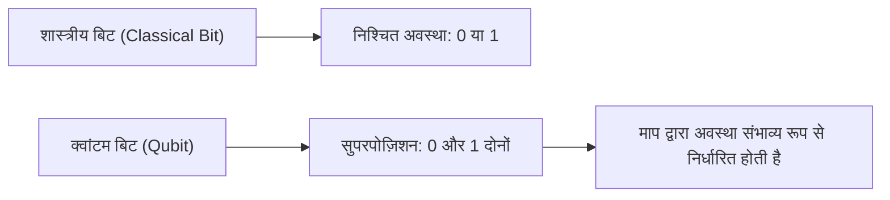
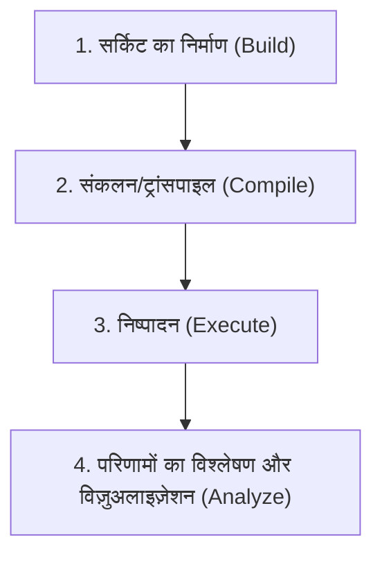
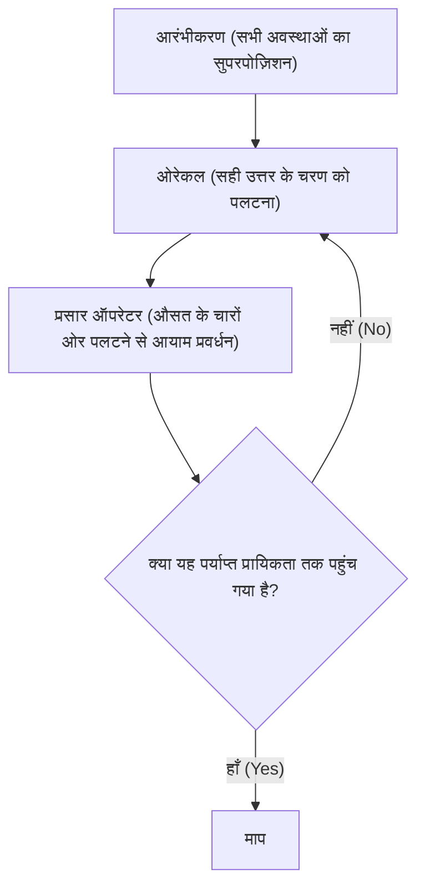

## 1. परिचय

आधुनिक कंप्यूटर (शास्त्रीय कंप्यूटर) ने हमारे जीवन को नाटकीय रूप से बदल दिया है और अपनी उच्च गणना क्षमताओं के साथ समाज के हर पहलू का समर्थन करते हैं। हालांकि, कुछ विशिष्ट समस्याओं (जैसे, बहुत बड़ी संख्याओं का अभाज्य गुणनखंडन, जटिल आणविक संरचनाओं का सिमुलेशन, और अनुकूलन समस्याएं) के लिए, यह ज्ञात है कि वर्तमान के सबसे उन्नत सुपर कंप्यूटरों को भी ब्रह्मांड की आयु से अधिक समय की आवश्यकता होगी।

इन "शास्त्रीय कंप्यूटरों की सीमाओं" को तोड़ने की क्षमता रखने वाले कंप्यूटर को **क्वांटम कंप्यूटर (Quantum Computer)** कहा जाता है। क्वांटम यांत्रिकी के रहस्यमय गुणों (सुपरपोज़िशन और क्वांटम एंटैंगलमेंट) को कम्प्यूटेशनल संसाधनों के रूप में उपयोग करके, यह माना जाता है कि कुछ विशिष्ट समस्याओं को नाटकीय रूप से तेज किया जा सकता है।

इस लेख में, हम IBM द्वारा प्रदान किए गए एक ओपन-सोर्स क्वांटम कंप्यूटिंग फ्रेमवर्क, **Qiskit (किस्किट)** का उपयोग करके क्वांटम प्रोग्रामिंग की दुनिया में अपना पहला कदम रखेंगे। यह एक बहुत ही विस्तृत परिचयात्मक मार्गदर्शिका है जो भौतिकी और गणित की बुनियादी बातों से लेकर पायथन में कोड लिखने और एक सिम्युलेटर पर क्वांटम सर्किट चलाने तक की पूरी प्रक्रिया को कवर करती है।

---

## 2. क्वांटम गणना का समर्थन करने वाले भौतिकी और गणित की बुनियादी बातें

क्वांटम प्रोग्रामिंग को समझने के लिए, सबसे पहले क्वांटम यांत्रिकी की बुनियादी अवधारणाओं को समझना आवश्यक है। यहाँ हम तीन महत्वपूर्ण स्तंभों: क्वांटम बिट्स, सुपरपोज़िशन, और क्वांटम एंटैंगलमेंट की व्याख्या करेंगे।

### 2.1 शास्त्रीय बिट्स और क्वांटम बिट्स (Qubit)

शास्त्रीय कंप्यूटरों की सूचना इकाई "बिट (Bit)" है। एक बिट हमेशा `0` या `1` की अवस्था में होता है।

दूसरी ओर, क्वांटम कंप्यूटरों में सूचना की सबसे छोटी इकाई को **क्वांटम बिट (Qubit: Quantum bit)** कहा जाता है। क्वांटम बिट्स न केवल `0` और `1` की अवस्था ले सकते हैं, बल्कि **इन दोनों अवस्थाओं को एक साथ बनाए रखना** भी संभव है।

गणितीय रूप से, क्वांटम बिट की अवस्था $|\psi\rangle$ को आधार अवस्थाओं $|0\rangle$ और $|1\rangle$ के रैखिक संयोजन (सुपरपोज़िशन) के रूप में व्यक्त किया जाता है।

$$
|\psi\rangle = \alpha|0\rangle + \beta|1\rangle
$$

यहाँ, $\alpha$ और $\beta$ सम्मिश्र संख्याएँ हैं, जो क्रमशः अवस्था $|0\rangle$ और $|1\rangle$ को देखने के प्रायिकता आयामों को दर्शाती हैं। क्वांटम यांत्रिकी के मूल सिद्धांतों के आधार पर, प्रायिकताओं का योग 1 होना चाहिए, इसलिए निम्नलिखित सामान्यीकरण शर्त पूरी होती है:

$$
|\alpha|^2 + |\beta|^2 = 1
$$

यानी, जब आप इस क्वांटम बिट को "मापते (observe)" हैं, तो $|0\rangle$ प्राप्त होने की प्रायिकता $|\alpha|^2$ है, और $|1\rangle$ प्राप्त होने की प्रायिकता $|\beta|^2$ है। शास्त्रीय बिट के साथ एक महत्वपूर्ण अंतर यह है कि मापने से पहले स्थिति केवल संभाव्य रूप से निर्धारित होती है।



### 2.2 सुपरपोज़िशन (Superposition)

जैसा कि पहले उल्लेख किया गया है, उस अवस्था को जहाँ $|0\rangle$ और $|1\rangle$ अवस्थाएँ मिश्रित होती हैं, **सुपरपोज़िशन (Superposition)** कहा जाता है।

उदाहरण के लिए, यदि एक क्वांटम बिट पूरी तरह से समान सुपरपोज़िशन अवस्था में है, तो $\alpha = \frac{1}{\sqrt{2}}$ और $\beta = \frac{1}{\sqrt{2}}$ होगा।

$$
|\psi\rangle = \frac{1}{\sqrt{2}}|0\rangle + \frac{1}{\sqrt{2}}|1\rangle
$$

जब इस अवस्था को मापा जाता है, तो $|0\rangle$ और $|1\rangle$ दोनों को 50% की प्रायिकता के साथ देखा जाता है।
यदि आपके पास 2 क्वांटम बिट्स हैं, तो आप 4 अवस्थाओं: $|00\rangle, |01\rangle, |10\rangle, |11\rangle$ का एक सुपरपोज़िशन बना सकते हैं। यदि आपके पास $n$ क्वांटम बिट्स हैं, तो आप एक ही समय में $2^n$ अवस्थाओं को व्यक्त कर सकते हैं, जो क्वांटम कंप्यूटरों की समानांतर प्रसंस्करण शक्ति के स्रोतों में से एक है।

### 2.3 क्वांटम एंटैंगलमेंट (Entanglement)

क्वांटम गणना में सबसे शक्तिशाली और रहस्यमय गुण **क्वांटम एंटैंगलमेंट (Entanglement)** है। आइंस्टीन ने इस घटना को "दूरी पर डरावनी कार्रवाई (spooky action at a distance)" कहा था। यह एक ऐसी संपत्ति है जहाँ दो या दो से अधिक क्वांटम बिट्स एक-दूसरे से मजबूती से जुड़े होते हैं, और एक बार जब एक क्वांटम बिट की अवस्था निर्धारित हो जाती है, तो दूसरे क्वांटम बिट की अवस्था तुरंत निर्धारित हो जाती है, भले ही वे भौतिक रूप से कितनी भी दूर हों।

सबसे प्रसिद्ध क्वांटम एंटैंगलमेंट अवस्थाओं में से एक "बेल अवस्था (Bell State)" $\Phi^+$ अवस्था है, जिसे इस प्रकार व्यक्त किया जाता है:

$$
|\Phi^+\rangle = \frac{|00\rangle + |11\rangle}{\sqrt{2}}
$$

इस अवस्था में, $|01\rangle$ और $|10\rangle$ अवस्थाएँ मौजूद नहीं हैं। इसलिए, यदि पहले क्वांटम बिट को मापा जाता है और वह $|0\rangle$ है, तो निश्चित रूप से यह निर्धारित होता है कि दूसरा भी $|0\rangle$ है, बिना दूसरे क्वांटम बिट को मापने की आवश्यकता के। इसके विपरीत, यदि पहला $|1\rangle$ है, तो दूसरा भी हमेशा $|1\rangle$ होगा।

---

## 3. क्वांटम लॉजिक गेट्स (Quantum Logic Gates)

जिस तरह शास्त्रीय कंप्यूटर गणना करने के लिए AND, OR, और NOT जैसे लॉजिक गेट्स का उपयोग करते हैं, उसी तरह क्वांटम कंप्यूटर क्वांटम बिट्स की अवस्थाओं में हेरफेर करने के लिए **क्वांटम गेट्स** का उपयोग करते हैं। चूंकि क्वांटम अवस्थाएँ वैक्टर हैं, इसलिए क्वांटम गेट्स को उन वैक्टरों पर काम करने वाले "यूनिटरी मैट्रिसेस (Unitary Matrices)" के रूप में दर्शाया जाता है।

### 3.1 पाउली गेट्स (Pauli-X, Y, Z)

पाउली गेट्स एक क्वांटम बिट पर बुनियादी संचालन हैं।

**・Pauli-X गेट (NOT गेट)**
यह शास्त्रीय NOT गेट के बराबर है। यह $|0\rangle$ को $|1\rangle$ में और $|1\rangle$ को $|0\rangle$ में उलट देता है। (बलोच क्षेत्र में X अक्ष के चारों ओर 180-डिग्री का घुमाव)

$$
X = \begin{pmatrix} 0 & 1 \\ 1 & 0 \end{pmatrix}
$$

**・Pauli-Y गेट**
यह Y अक्ष के चारों ओर 180-डिग्री का घुमाव करता है। इसका प्रभाव चरण (Phase) और बिट दोनों को उलटने में होता है।

$$
Y = \begin{pmatrix} 0 & -i \\ i & 0 \end{pmatrix}
$$

**・Pauli-Z गेट (फेज फ्लिप गेट)**
यह $|0\rangle$ की अवस्था को अपरिवर्तित छोड़ देता है और $|1\rangle$ अवस्था के चरण को उलट देता है ($-1$ से गुणा करता है)। (Z अक्ष के चारों ओर 180-डिग्री का घुमाव)

$$
Z = \begin{pmatrix} 1 & 0 \\ 0 & -1 \end{pmatrix}
$$

### 3.2 हैडामार्ड गेट (Hadamard Gate)

हैडामार्ड गेट (H गेट) एक बहुत ही महत्वपूर्ण गेट है जो एक निश्चित अवस्था ($|0\rangle$ या $|1\rangle$) को एक सुपरपोज़िशन अवस्था में परिवर्तित करता है।

$$
H = \frac{1}{\sqrt{2}}
\begin{pmatrix}
1 & 1 \\
1 & -1
\end{pmatrix}
$$

जब H गेट को $|0\rangle$ पर लागू किया जाता है, तो यह एक समान सुपरपोज़िशन अवस्था $|+\rangle$ बन जाता है।

$$
H|0\rangle = \frac{1}{\sqrt{2}}|0\rangle + \frac{1}{\sqrt{2}}|1\rangle = |+\rangle
$$

### 3.3 फेज गेट्स (Phase Gates)

फेज गेट Z गेट का एक सामान्यीकरण है, जो $|1\rangle$ अवस्था के चरण को एक निर्दिष्ट कोण $\theta$ से घुमाता है।

$$
P(\theta) = \begin{pmatrix} 1 & 0 \\ 0 & e^{i\theta} \end{pmatrix}
$$

विशिष्ट उदाहरणों में S गेट ($\theta = \pi/2$) और T गेट ($\theta = \pi/4$) शामिल हैं।

### 3.4 CNOT गेट (Controlled-NOT Gate)

CNOT गेट (CX गेट) एक ऐसा गेट है जो दो क्वांटम बिट्स के बीच काम करता है और क्वांटम एंटैंगलमेंट उत्पन्न करने के लिए आवश्यक है। इसमें एक "कंट्रोल (Control) बिट" और एक "टारगेट (Target) बिट" होता है।

केवल यदि कंट्रोल बिट $|1\rangle$ है, तो X गेट (NOT ऑपरेशन) टारगेट बिट पर लागू होता है; यदि कंट्रोल बिट $|0\rangle$ है, तो यह कुछ नहीं करता है।

$$
CNOT = \begin{pmatrix}
1 & 0 & 0 & 0 \\
0 & 1 & 0 & 0 \\
0 & 0 & 0 & 1 \\
0 & 0 & 1 & 0
\end{pmatrix}
$$

---

## 4. Qiskit की मूल बातें और पर्यावरण सेटअप

अब हम वास्तविक क्वांटम प्रोग्राम लिखने के लिए पायथन और Qiskit का उपयोग करेंगे।

### 4.1 Qiskit क्या है?

**Qiskit** एक ओपन-सोर्स क्वांटम कंप्यूटिंग सॉफ्टवेयर डेवलपमेंट किट (SDK) है जिसे IBM Quantum द्वारा विकसित किया गया है। यह आपको सहज रूप से क्वांटम सर्किट बनाने के लिए पायथन का उपयोग करने की अनुमति देता है, और उन्हें स्थानीय सिमुलेटर पर या वास्तविक IBM क्वांटम कंप्यूटरों पर क्लाउड के माध्यम से निष्पादित करने की अनुमति देता है।

### 4.2 स्थापित करने की विधि

Qiskit का उपयोग करने के लिए, पायथन वातावरण की आवश्यकता होती है। आप निम्नलिखित कमांड से Qiskit और संबंधित पैकेजों (सिमुलेटर और ड्राइंग लाइब्रेरी) को स्थापित कर सकते हैं:

```bash
pip install qiskit qiskit-aer qiskit-ibm-runtime matplotlib pylatexenc
```

### 4.3 प्रोग्रामिंग का मूल प्रवाह

Qiskit का उपयोग करते हुए क्वांटम प्रोग्रामिंग मुख्य रूप से निम्नलिखित चरणों में आगे बढ़ती है:



1. **सर्किट का निर्माण**: एक `QuantumCircuit` ऑब्जेक्ट बनाएं और गेट्स जोड़ें।
2. **संकलन**: निष्पादन के लिए बैकएंड (वास्तविक मशीन या सिम्युलेटर) से मेल खाने के लिए सर्किट को अनुकूलित करें।
3. **निष्पादन**: बैकएंड पर काम भेजें और परिणाम प्राप्त करें।
4. **विश्लेषण**: माप परिणामों के हिस्टोग्राम आदि प्लॉट करें।

---

## 5. अभ्यास: बेल स्टेट (क्वांटम एंटैंगलमेंट) बनाने के लिए एक सर्किट का निर्माण

आइए Qiskit का उपयोग करके उस "क्वांटम एंटैंगलमेंट (बेल स्टेट)" को बनाएं जिसे हमने सिद्धांत में सीखा था। लक्ष्य अवस्था $|\Phi^+\rangle = \frac{|00\rangle + |11\rangle}{\sqrt{2}}$ है।

### 5.1 सर्किट का डिज़ाइन

बेल स्टेट बनाने के लिए, हम इन चरणों का पालन करते हैं:
1. 2 क्वांटम बिट्स तैयार करें (प्रारंभिक अवस्था दोनों के लिए $|0\rangle$ है)।
2. इसे एक सुपरपोज़िशन अवस्था में रखने के लिए पहले क्वांटम बिट पर एक हैडामार्ड गेट (H) लागू करें।
3. पहले क्वांटम बिट को "कंट्रोल बिट" और दूसरे क्वांटम बिट को "टारगेट बिट" के रूप में उपयोग करते हुए एक CNOT गेट लागू करें।
4. परिणाम को पढ़ने के लिए माप (Measure) करें।

### 5.2 Python/Qiskit कोड का कार्यान्वयन

आइए वास्तविक कोड देखें।

```python
import numpy as np
from qiskit import QuantumCircuit, transpile
from qiskit_aer import Aer
from qiskit.visualization import plot_histogram
import matplotlib.pyplot as plt

# 1. सर्किट आरंभीकरण
# 2 क्वांटम बिट्स और 2 शास्त्रीय बिट्स के साथ एक क्वांटम सर्किट बनाएं
qc = QuantumCircuit(2, 2)

# 2. H गेट लागू करें
# क्वांटम बिट 0 (q0) पर हैडामार्ड गेट लागू करें
qc.h(0)

# 3. CNOT गेट लागू करें
# q0 को कंट्रोल बिट और q1 को टारगेट बिट के रूप में मानते हुए CNOT लागू करें
qc.cx(0, 1)

# 4. माप
# क्वांटम बिट्स 0 और 1 को मापें, और उन्हें क्रमशः शास्त्रीय बिट्स 0 और 1 में लिखें
qc.measure([0, 1], [0, 1])

# सर्किट आरेख ड्रा करें (matplotlib का उपयोग करके)
# qc.draw('mpl')
print(qc.draw())
```

जब आप इस कोड को चलाते हैं, तो कंसोल पर ASCII आर्ट में निम्नलिखित क्वांटम सर्किट आरेख प्रदर्शित होगा:

```text
     ┌───┐     ┌─┐   
q_0: ┤ H ├──■──┤M├───
     └───┘┌─┴─┐└╥┘┌─┐
q_1: ─────┤ X ├─╫─┤M├
          └───┘ ║ └╥┘
c: 2/═══════════╩══╩═
                0  1 
```
`H` हैडामार्ड गेट का प्रतिनिधित्व करता है, `■` और `X` का संयोजन CNOT गेट का प्रतिनिधित्व करता है, और `M` माप का प्रतिनिधित्व करता है।

### 5.3 सिम्युलेटर पर निष्पादन और परिणामों की व्याख्या

इसके बाद, हम इस सर्किट को IBM के उच्च-प्रदर्शन सिम्युलेटर `Aer` पर चलाएंगे और परिणामों की जांच करेंगे।

```python
# Aer सिम्युलेटर का बैकएंड प्राप्त करें
simulator = Aer.get_backend('qasm_simulator')

# सिम्युलेटर के लिए सर्किट को ट्रांसपाइल (अनुकूलित) करें
compiled_circuit = transpile(qc, simulator)

# सर्किट चलाएं (यहाँ हम 1000 शॉट्स निष्पादित करते हैं)
job = simulator.run(compiled_circuit, shots=1000)

# परिणाम प्राप्त करें
result = job.result()

# अवस्था के देखे जाने की संख्या (गणना) प्राप्त करें
counts = result.get_counts(compiled_circuit)
print("\nमाप परिणाम:", counts)

# हिस्टोग्राम प्लॉट करें
# plot_histogram(counts)
# plt.show()
```

**परिणामों की व्याख्या**

कंसोल का आउटपुट कुछ इस तरह होना चाहिए:
`माप परिणाम: {'00': 495, '11': 505}`
(※चूंकि प्रायिकताएं यादृच्छिक होती हैं, इसलिए हर बार निष्पादित होने पर संख्याएं थोड़ी बदल जाएंगी)

एक आदर्श सिमुलेशन वातावरण में, `00` और `11` को लगभग 50% मापा जाएगा, और `01` या `10` को बिल्कुल नहीं देखा जाएगा।
यह ठीक उसी तरह है जैसा हमने जो बेल स्टेट $|\Phi^+\rangle = \frac{|00\rangle + |11\rangle}{\sqrt{2}}$ बनाया है, उसके सैद्धांतिक पूर्वानुमान के साथ पूरी तरह मेल खाता है। "क्वांटम एंटैंगलमेंट" जहां यदि पहला क्वांटम बिट 0 है, तो दूसरा भी 0 होना चाहिए, और यदि यह 1 है, तो यह 1 होना चाहिए, सटीक रूप से अनुकरण किया गया है।

ध्यान दें कि यदि इसे वास्तविक क्वांटम कंप्यूटर (IBM Quantum Hardware) पर चलाया जाता है, तो शोर (क्वांटम डिकोहेरेंस और गेट त्रुटियों) के प्रभाव के कारण `01` या `10` को थोड़ा देखा जा सकता है। वर्तमान क्वांटम कंप्यूटर के विकास में सबसे बड़ी चुनौतियों में से एक इस शोर को कम करना है (क्वांटम त्रुटि सुधार)।

---

## 6. अधिक उन्नत एल्गोरिदम में स्केल अप करना

बेल स्टेट का निर्माण क्वांटम प्रोग्रामिंग के "हैलो वर्ल्ड (Hello World)" जैसा है। इसे और विकसित करके, हम शक्तिशाली एल्गोरिदम बना सकते हैं जो शास्त्रीय कंप्यूटरों को पार करते हैं।

### 6.1 ड्यूश-जोस्ज़ा एल्गोरिदम (Deutsch-Jozsa Algorithm)

यह यह निर्धारित करने की समस्या है कि दिया गया फ़ंक्शन $f(x)$ "निरंतर फ़ंक्शन (इनपुट की परवाह किए बिना हमेशा 0 या हमेशा 1 आउटपुट करता है)" है या "संतुलित फ़ंक्शन (आधे इनपुट के लिए 0 और बाकी आधे के लिए 1 आउटपुट करता है)" है।
शास्त्रीय कंप्यूटरों को सबसे खराब स्थिति में फ़ंक्शन के $2^{n-1} + 1$ मूल्यांकन की आवश्यकता होती है, लेकिन ड्यूश-जोस्ज़ा एल्गोरिदम का उपयोग करके, आप क्वांटम समानांतरता का उपयोग करके **केवल 1 मूल्यांकन** में इसे निर्धारित कर सकते हैं। यह क्वांटम एल्गोरिदम के मूल पैटर्न को दर्शाता है जो एक सुपरपोज़िशन अवस्था को इनपुट करता है, अनावश्यक अवस्थाओं को रद्द करने के लिए हस्तक्षेप (Interference) का उपयोग करता है, और वांछित उत्तर को बढ़ाता है।

### 6.2 ग्रोवर का एल्गोरिदम (Grover's Algorithm)

एक खोज समस्या में जहां $N$ बिना क्रमबद्ध डेटाबेस से विशिष्ट डेटा की खोज की जाती है, एक शास्त्रीय एल्गोरिदम को औसतन $N/2$ गणनाओं की आवश्यकता होती है, जबकि ग्रोवर का एल्गोरिदम $\sqrt{N}$ बार में लक्ष्य डेटा ढूंढ सकता है।
यह एल्गोरिदम लक्ष्य समाधान के चरण को पलटने के लिए "ओरेकल (Oracle)" नामक ब्लैक बॉक्स का उपयोग करता है, और "आयाम प्रवर्धन (Amplitude Amplification)" करके लक्ष्य समाधान को देखे जाने की प्रायिकता को नाटकीय रूप से बढ़ाता है।



---

## 7. निष्कर्ष और भविष्य की शिक्षा

इस लेख में, हमने सुपरपोज़िशन और क्वांटम एंटैंगलमेंट जैसी क्वांटम कंप्यूटिंग की मौलिक अवधारणाओं से शुरू किया, और Qiskit का उपयोग करके क्वांटम लॉजिक गेट्स के संचालन को विस्तार से समझाया, और वास्तव में एक बेल स्टेट का निर्माण, अनुकरण, और परिणामों की व्याख्या की।

चूंकि Qiskit को पायथन में लिखा जा सकता है, जो एक परिचित भाषा है, इसलिए यह एक शक्तिशाली उपकरण है जो आपको गणितीय और भौतिक बाधाओं को दूर करने और एल्गोरिदम के निर्माण पर ध्यान केंद्रित करने की अनुमति देता है। क्वांटम कंप्यूटर वर्तमान में शोर वाले मध्यवर्ती-स्तरीय क्वांटम उपकरणों (NISQ: Noisy Intermediate-Scale Quantum) के युग में हैं, लेकिन क्वांटम मशीन लर्निंग (Quantum Machine Learning), क्वांटम रसायन विज्ञान (Quantum Chemistry), और क्रिप्टोग्राफी जैसे कई क्षेत्रों में दुनिया भर में लागू अनुसंधान तेजी से आगे बढ़ रहा है।

कृपया इस अवसर का लाभ उठाकर Qiskit का उपयोग करके विभिन्न क्वांटम सर्किट बनाएं और उन्हें वास्तविक IBM Quantum प्रोसेसर पर चलाएं। आपको अपने हाथों से भविष्य के कंप्यूटिंग प्रतिमान का अनुभव करने में सक्षम होना चाहिए।

### संदर्भ
- [Qiskit आधिकारिक दस्तावेज़](https://qiskit.org/documentation/)
- [Qiskit पाठ्यपुस्तक (Textbook)](https://qiskit.org/textbook/ja/preface.html) - आधिकारिक पाठ्यपुस्तक जो उन लोगों के लिए अनुशंसित है जो गणितीय पृष्ठभूमि और एल्गोरिदम को अधिक गहराई से सीखना चाहते हैं
- IBM Quantum Learning

क्वांटम की दुनिया में आपका स्वागत है!
