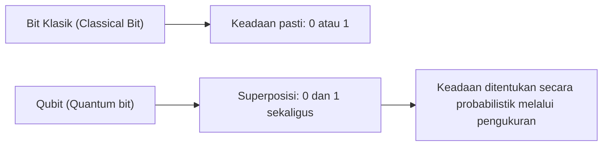
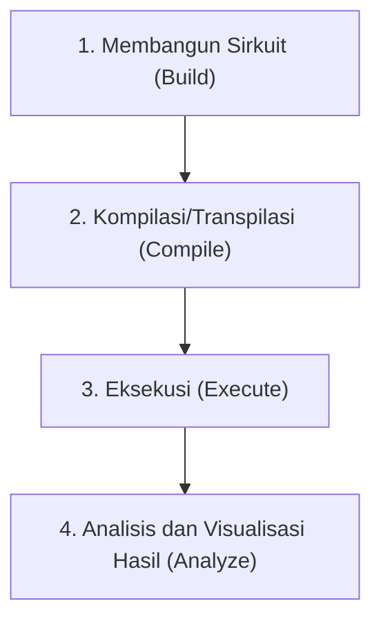
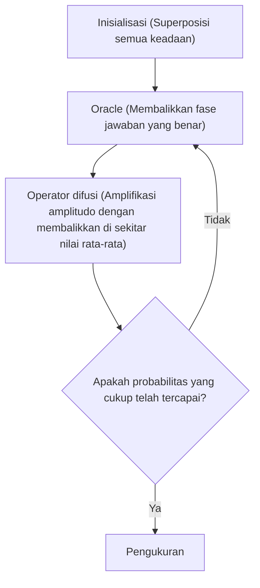

## 1. Pendahuluan

Komputer modern (komputer klasik) telah secara dramatis mengubah kehidupan kita dan mendukung berbagai aspek masyarakat dengan kemampuan komputasi yang canggih. Namun, untuk beberapa masalah tertentu (seperti faktorisasi bilangan prima yang sangat besar, simulasi struktur molekul yang kompleks, masalah optimasi, dll.), diketahui bahwa bahkan superkomputer paling canggih saat ini pun akan membutuhkan waktu lebih lama daripada usia alam semesta.

Yang memiliki potensi untuk mendobrak "keterbatasan komputer klasik" ini adalah **Komputer Kuantum (Quantum Computer)**. Dengan memanfaatkan sifat-sifat aneh mekanika kuantum (superposisi dan keterikatan kuantum) sebagai sumber daya komputasi, diyakini bahwa masalah-masalah tertentu dapat dipercepat secara dramatis.

Dalam artikel ini, kita akan mengambil langkah pertama ke dunia pemrograman kuantum menggunakan **Qiskit**, sebuah kerangka kerja komputasi kuantum sumber terbuka yang disediakan oleh IBM. Ini adalah panduan pengantar yang sangat rinci yang menjelaskan secara saksama dari dasar-dasar fisika dan matematika, hingga proses penulisan kode dengan Python dan menjalankan sirkuit kuantum di simulator.

---

## 2. Dasar-dasar Fisika dan Matematika yang Mendukung Komputasi Kuantum

Untuk memahami pemrograman kuantum, pertama-tama kita perlu memahami konsep dasar mekanika kuantum. Di sini, kita akan menjelaskan tiga pilar penting: qubit, superposisi, dan keterikatan kuantum.

### 2.1 Bit Klasik dan Qubit (Quantum bit)

Unit informasi komputer klasik adalah "Bit". Sebuah bit selalu mengambil salah satu dari dua keadaan, `0` atau `1`.

Di sisi lain, unit minimum informasi dalam komputer kuantum disebut **Qubit (Quantum bit)**. Qubit tidak hanya dapat mengambil keadaan `0` dan `1`, tetapi juga dapat **mempertahankan kedua keadaan tersebut secara bersamaan**.

Secara matematis, keadaan qubit $|\psi\rangle$ direpresentasikan sebagai kombinasi linear (superposisi) dari keadaan basis $|0\rangle$ dan $|1\rangle$.

$$
|\psi\rangle = \alpha|0\rangle + \beta|1\rangle
$$

Di sini, $\alpha$ dan $\beta$ adalah bilangan kompleks, masing-masing merepresentasikan amplitudo probabilitas untuk mengamati keadaan $|0\rangle$ dan $|1\rangle$. Berdasarkan prinsip dasar mekanika kuantum, jumlah total probabilitas harus sama dengan 1, sehingga memenuhi kondisi normalisasi berikut:

$$
|\alpha|^2 + |\beta|^2 = 1
$$

Artinya, ketika qubit ini "diukur (diobservasi)", probabilitas mendapatkan $|0\rangle$ adalah $|\alpha|^2$, dan probabilitas mendapatkan $|1\rangle$ adalah $|\beta|^2$. Fakta bahwa keadaannya hanya ditentukan secara probabilistik sebelum pengukuran adalah perbedaan krusial dari bit klasik.



### 2.2 Superposisi (Superposition)

Seperti yang disebutkan sebelumnya, keadaan di mana status $|0\rangle$ dan $|1\rangle$ bercampur disebut **Superposisi (Superposition)**.

Misalnya, ketika satu qubit berada dalam keadaan superposisi yang benar-benar seimbang, $\alpha = \frac{1}{\sqrt{2}}$, $\beta = \frac{1}{\sqrt{2}}$.

$$
|\psi\rangle = \frac{1}{\sqrt{2}}|0\rangle + \frac{1}{\sqrt{2}}|1\rangle
$$

Jika kita mengukur keadaan ini, $|0\rangle$ dan $|1\rangle$ masing-masing akan diamati dengan probabilitas 50%.
Jika ada 2 qubit, kita dapat membuat superposisi dari 4 keadaan: $|00\rangle, |01\rangle, |10\rangle, |11\rangle$. Jika ada $n$ qubit, $2^n$ keadaan dapat direpresentasikan secara bersamaan, yang merupakan salah satu sumber kemampuan pemrosesan paralel komputer kuantum.

### 2.3 Keterikatan Kuantum (Entanglement)

Sifat paling kuat dan misterius dalam komputasi kuantum adalah **Keterikatan Kuantum (Entanglement)**. Fenomena yang disebut Einstein sebagai "aksi seram dari kejauhan" ini adalah sifat di mana dua atau lebih qubit sangat terkait satu sama lain, sedemikian rupa sehingga ketika keadaan salah satu qubit ditentukan, keadaan qubit lainnya akan langsung ditentukan pula secara instan, tidak peduli seberapa jauh jarak fisiknya.

Salah satu "Keadaan Bell (Bell State)", yang merupakan keadaan keterikatan kuantum paling terkenal, keadaan $\Phi^+$ dinyatakan sebagai berikut:

$$
|\Phi^+\rangle = \frac{|00\rangle + |11\rangle}{\sqrt{2}}
$$

Dalam keadaan ini, status $|01\rangle$ dan $|10\rangle$ tidak ada. Oleh karena itu, jika qubit pertama diukur dan hasilnya $|0\rangle$, bahkan tanpa mengukur qubit kedua, sudah pasti hasilnya adalah $|0\rangle$. Sebaliknya, jika qubit pertama $|1\rangle$, maka yang kedua juga pasti $|1\rangle$.

---

## 3. Gerbang Logika Kuantum (Quantum Logic Gates)

Sama seperti komputer klasik yang menggunakan gerbang logika seperti AND, OR, dan NOT untuk melakukan komputasi, komputer kuantum juga menggunakan **gerbang kuantum** untuk memanipulasi keadaan qubit. Karena keadaan kuantum adalah vektor, gerbang kuantum direpresentasikan sebagai "matriks uniter" yang bekerja pada vektor tersebut.

### 3.1 Gerbang Pauli (Pauli-X, Y, Z)

Gerbang Pauli adalah operasi dasar pada 1 qubit.

**・Gerbang Pauli-X (Gerbang NOT)**
Setara dengan gerbang NOT klasik. Membalikkan $|0\rangle$ menjadi $|1\rangle$, dan $|1\rangle$ menjadi $|0\rangle$. (Rotasi 180 derajat di sekitar sumbu X pada bola Bloch)

$$
X = \begin{pmatrix} 0 & 1 \\ 1 & 0 \end{pmatrix}
$$

**・Gerbang Pauli-Y**
Melakukan rotasi 180 derajat di sekitar sumbu Y. Memiliki efek membalikkan fase dan bit.

$$
Y = \begin{pmatrix} 0 & -i \\ i & 0 \end{pmatrix}
$$

**・Gerbang Pauli-Z (Gerbang pembalikan fase)**
Membiarkan keadaan $|0\rangle$ tetap sama, tetapi membalikkan fase keadaan $|1\rangle$ (mengalikan dengan $-1$). (Rotasi 180 derajat di sekitar sumbu Z)

$$
Z = \begin{pmatrix} 1 & 0 \\ 0 & -1 \end{pmatrix}
$$

### 3.2 Gerbang Hadamard (Hadamard Gate)

Gerbang Hadamard (gerbang H) adalah gerbang yang sangat penting yang mengubah keadaan pasti ($|0\rangle$ atau $|1\rangle$) menjadi keadaan superposisi.

$$
H = \frac{1}{\sqrt{2}}
\begin{pmatrix}
1 & 1 \\
1 & -1
\end{pmatrix}
$$

Menerapkan gerbang H pada $|0\rangle$ menghasilkan keadaan superposisi seimbang $|+\rangle$.

$$
H|0\rangle = \frac{1}{\sqrt{2}}|0\rangle + \frac{1}{\sqrt{2}}|1\rangle = |+\rangle
$$

### 3.3 Gerbang Fase (Phase Gates)

Gerbang fase adalah bentuk umum dari gerbang Z, yang memutar fase keadaan $|1\rangle$ sebesar sudut $\theta$ yang ditentukan.

$$
P(\theta) = \begin{pmatrix} 1 & 0 \\ 0 & e^{i\theta} \end{pmatrix}
$$

Contoh tipikalnya adalah gerbang S ($\theta = \pi/2$) dan gerbang T ($\theta = \pi/4$).

### 3.4 Gerbang CNOT (Controlled-NOT Gate)

Gerbang CNOT (gerbang CX) adalah gerbang yang beroperasi di antara dua qubit dan sangat penting untuk menghasilkan keterikatan kuantum. Terdiri dari "bit kontrol (Control bit)" dan "bit target (Target bit)".

Hanya ketika bit kontrol adalah $|1\rangle$, gerbang X (operasi NOT) diterapkan pada bit target, dan tidak ada yang dilakukan jika bit kontrol adalah $|0\rangle$.

$$
CNOT = \begin{pmatrix}
1 & 0 & 0 & 0 \\
0 & 1 & 0 & 0 \\
0 & 0 & 0 & 1 \\
0 & 0 & 1 & 0
\end{pmatrix}
$$

---

## 4. Dasar-dasar Qiskit dan Penyiapan Lingkungan

Mulai dari sini, kita akan benar-benar menulis program kuantum menggunakan Python dan Qiskit.

### 4.1 Apa itu Qiskit?

**Qiskit** adalah kit pengembangan perangkat lunak (SDK) komputasi kuantum sumber terbuka yang dikembangkan oleh IBM Quantum. Anda dapat membangun sirkuit kuantum secara intuitif menggunakan Python dan menjalankannya pada simulator lokal atau komputer kuantum riil IBM melalui cloud.

### 4.2 Cara Menginstal

Lingkungan Python diperlukan untuk menggunakan Qiskit. Instal Qiskit dan paket terkait (simulator dan pustaka visualisasi) menggunakan perintah berikut.

```bash
pip install qiskit qiskit-aer qiskit-ibm-runtime matplotlib pylatexenc
```

### 4.3 Alur Dasar Pemrograman

Pemrograman kuantum dengan Qiskit pada dasarnya dilanjutkan dengan langkah-langkah berikut.



1. **Membangun Sirkuit**: Buat objek `QuantumCircuit` dan tambahkan gerbang.
2. **Kompilasi**: Optimalkan sirkuit untuk backend target (mesin nyata atau simulator).
3. **Eksekusi**: Kirim pekerjaan (job) ke backend dan dapatkan hasilnya.
4. **Analisis**: Plot histogram hasil pengukuran, dsb.

---

## 5. Praktik: Membangun Sirkuit untuk Membuat Keadaan Bell (Keterikatan Kuantum)

Mari kita coba membuat "Keterikatan Kuantum (Keadaan Bell)" yang telah kita pelajari secara teori menggunakan Qiskit. Keadaan targetnya adalah $|\Phi^+\rangle = \frac{|00\rangle + |11\rangle}{\sqrt{2}}$.

### 5.1 Desain Sirkuit

Untuk membuat keadaan Bell, ikuti langkah-langkah berikut:
1. Siapkan dua qubit (keadaan awal keduanya adalah $|0\rangle$).
2. Terapkan gerbang Hadamard (H) ke qubit pertama untuk membuatnya menjadi keadaan superposisi.
3. Terapkan gerbang CNOT dengan menetapkan qubit pertama sebagai "bit kontrol" dan qubit kedua sebagai "bit target".
4. Lakukan pengukuran (Measure) untuk membaca hasilnya.

### 5.2 Implementasi Kode Python/Qiskit

Mari kita lihat kode yang sebenarnya.

```python
import numpy as np
from qiskit import QuantumCircuit, transpile
from qiskit_aer import Aer
from qiskit.visualization import plot_histogram
import matplotlib.pyplot as plt

# 1. Inisialisasi Sirkuit
# Buat sirkuit kuantum dengan 2 qubit dan 2 bit klasik
qc = QuantumCircuit(2, 2)

# 2. Penerapan Gerbang H
# Terapkan gerbang Hadamard pada qubit 0 (q0)
qc.h(0)

# 3. Penerapan Gerbang CNOT
# Terapkan CNOT dengan q0 sebagai bit kontrol dan q1 sebagai bit target
qc.cx(0, 1)

# 4. Pengukuran
# Ukur qubit 0 dan 1, lalu tulis hasilnya ke bit klasik 0 dan 1 secara berurutan
qc.measure([0, 1], [0, 1])

# Menggambar diagram sirkuit (menggunakan matplotlib)
# qc.draw('mpl')
print(qc.draw())
```

Saat Anda menjalankan kode ini, diagram sirkuit kuantum dalam seni ASCII akan ditampilkan di konsol seperti berikut.

```text
     ┌───┐     ┌─┐   
q_0: ┤ H ├──■──┤M├───
     └───┘┌─┴─┐└╥┘┌─┐
q_1: ─────┤ X ├─╫─┤M├
          └───┘ ║ └╥┘
c: 2/═══════════╩══╩═
                0  1 
```
`H` mewakili gerbang Hadamard, kombinasi `■` dan `X` adalah gerbang CNOT, dan `M` mewakili pengukuran.

### 5.3 Eksekusi di Simulator dan Interpretasi Hasil

Selanjutnya, kita akan menjalankan sirkuit ini di simulator berkinerja tinggi `Aer` milik IBM dan memeriksa hasilnya.

```python
# Dapatkan backend simulator Aer
simulator = Aer.get_backend('qasm_simulator')

# Transpilasi (optimasi) sirkuit untuk simulator
compiled_circuit = transpile(qc, simulator)

# Eksekusi sirkuit (di sini menjalankan 1000 tembakan/shots)
job = simulator.run(compiled_circuit, shots=1000)

# Dapatkan hasilnya
result = job.result()

# Dapatkan jumlah frekuensi pengamatan keadaan (counts)
counts = result.get_counts(compiled_circuit)
print("\nHasil pengukuran:", counts)

# Plot histogram
# plot_histogram(counts)
# plt.show()
```

**Interpretasi Hasil**

Output konsol seharusnya terlihat seperti ini:
`Hasil pengukuran: {'00': 495, '11': 505}`
(*Karena probabilitasnya bersifat acak, angkanya akan sedikit bervariasi pada setiap eksekusi)

Dalam lingkungan simulasi yang ideal, hasil pengukuran `00` dan `11` masing-masing akan diamati sekitar 50% probabilitas, sementara `01` dan `10` tidak akan pernah diamati sama sekali.
Ini sepenuhnya sesuai dengan prediksi teoretis dari keadaan Bell $|\Phi^+\rangle = \frac{|00\rangle + |11\rangle}{\sqrt{2}}$ yang telah kita buat. Ini mensimulasikan "keterikatan kuantum" secara akurat, di mana jika qubit pertama bernilai 0, maka yang kedua pasti 0, dan jika bernilai 1, maka yang kedua juga pasti 1.

Namun perlu dicatat, jika dijalankan pada komputer kuantum riil (IBM Quantum Hardware), sedikit kemunculan `01` atau `10` mungkin teramati karena pengaruh gangguan/noise (dekoherensi kuantum dan kesalahan gerbang). Bagaimana cara mengurangi noise ini (Koreksi Kesalahan Kuantum) adalah salah satu tantangan terbesar dalam pengembangan komputer kuantum saat ini.

---

## 6. Peningkatan Skala ke Algoritma yang Lebih Lanjut

Membuat keadaan Bell dapat disebut sebagai "Hello World" dari pemrograman kuantum. Dengan mengembangkannya lebih jauh dari sini, kita dapat membangun algoritma tangguh yang melampaui komputer klasik.

### 6.1 Algoritma Deutsch-Jozsa

Ini adalah masalah untuk menentukan apakah sebuah fungsi $f(x)$ yang diberikan adalah "fungsi konstan (selalu menghasilkan 0 atau selalu menghasilkan 1 terlepas dari inputnya)" atau "fungsi seimbang (menghasilkan 0 untuk setengah input, dan 1 untuk setengah sisanya)".
Dalam komputer klasik, pada kasus terburuk membutuhkan evaluasi fungsi sebanyak $2^{n-1} + 1$ kali. Namun, dengan menggunakan Algoritma Deutsch-Jozsa, hal ini dapat ditentukan **hanya dengan 1 evaluasi** dengan memanfaatkan paralelisme kuantum. Hal ini menunjukkan pola dasar algoritma kuantum, yaitu memasukkan keadaan superposisi, memanfaatkan interferensi (Interference) untuk membatalkan keadaan yang tidak diinginkan, dan memperkuat jawaban yang diinginkan.

### 6.2 Algoritma Grover

Dalam masalah pencarian data tertentu dari basis data tidak terurut yang berisi $N$ elemen, algoritma klasik rata-rata membutuhkan $N/2$ perhitungan, sedangkan Algoritma Grover dapat menemukan data target dalam $\sqrt{N}$ kali pencarian.
Algoritma ini menggunakan kotak hitam yang disebut "Oracle" untuk membalikkan fase solusi target, dan kemudian melakukan "Amplifikasi Amplitudo (Amplitude Amplification)" untuk secara dramatis meningkatkan probabilitas ditemukannya solusi target.



---

## 7. Kesimpulan dan Pembelajaran Selanjutnya

Dalam artikel ini, kita telah secara rinci menjelaskan mulai dari konsep dasar komputasi kuantum seperti superposisi dan keterikatan kuantum, hingga pengoperasian gerbang logika kuantum menggunakan Qiskit, serta proses membangun, menyimulasikan, dan menginterpretasikan keadaan Bell yang sesungguhnya.

Karena Qiskit dapat ditulis dalam bahasa Python yang sudah familier, Qiskit adalah alat kuat yang memungkinkan kita untuk melampaui batasan matematis/fisika dan fokus pada membangun algoritma. Komputer kuantum saat ini berada di era perangkat kuantum skala menengah yang ber-noise (NISQ: Noisy Intermediate-Scale Quantum), tetapi penelitian terapan di berbagai bidang seperti Pembelajaran Mesin Kuantum (Quantum Machine Learning), Simulasi Kimia (Quantum Chemistry), dan Kriptanalisis sedang berkembang pesat di seluruh dunia.

Dengan segala cara, silakan gunakan Qiskit untuk membuat berbagai sirkuit kuantum Anda sendiri dan jalankan pada prosesor perangkat keras riil IBM Quantum. Anda pasti akan dapat mengalami langsung paradigma komputasi masa depan.

### Referensi
- [Dokumentasi Resmi Qiskit](https://qiskit.org/documentation/)
- [Buku Teks Qiskit](https://qiskit.org/textbook/ja/preface.html) - Teks resmi yang direkomendasikan bagi mereka yang ingin mempelajari latar belakang matematika dan algoritma lebih dalam
- IBM Quantum Learning

Selamat datang di dunia kuantum!
