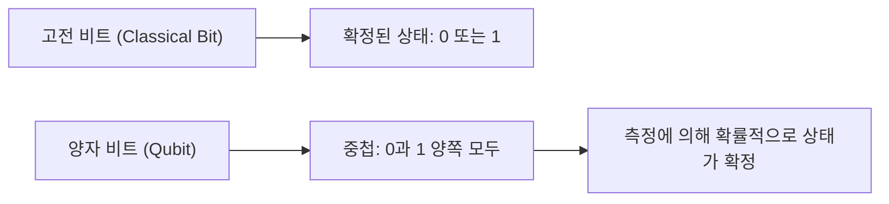
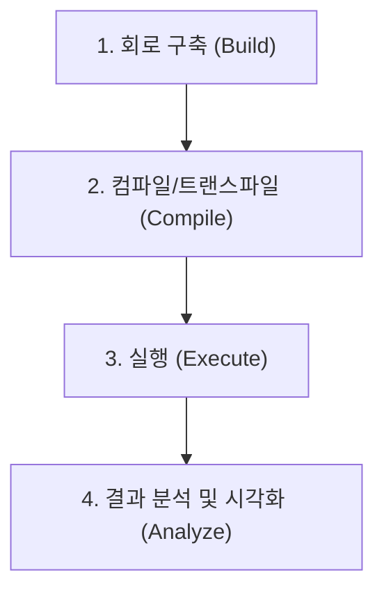
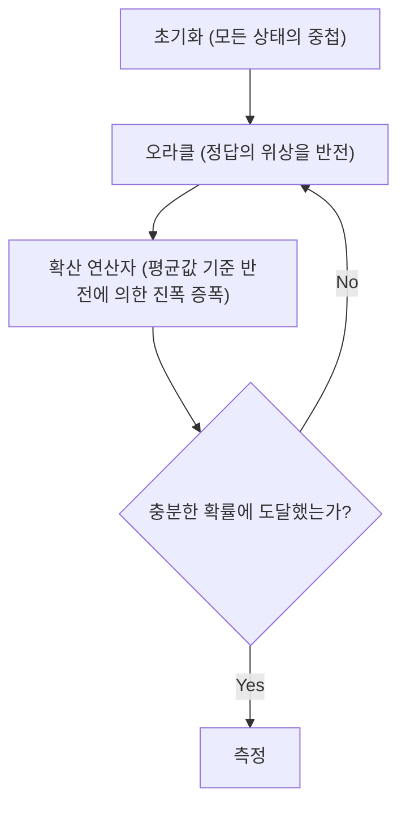

## 1. 시작하며

현대의 컴퓨터(고전 컴퓨터)는 우리의 삶을 극적으로 변화시켰고, 고도의 계산 능력으로 사회의 모든 측면을 지탱하고 있습니다. 그러나 일부 특정 문제(예를 들어, 거대한 수의 소인수분해, 복잡한 분자 구조의 시뮬레이션, 최적화 문제 등)에 있어서는 현재 최첨단 슈퍼컴퓨터라 하더라도 우주의 나이보다 더 긴 시간이 필요할 수 있음이 알려져 있습니다.

이러한 '고전 컴퓨터의 한계'를 뛰어넘을 가능성을 비장하고 있는 것이 **양자 컴퓨터(Quantum Computer)**입니다. 양자역학의 신비한 성질(중첩이나 양자 얽힘)을 계산 자원으로 활용함으로써 특정 문제를 극적으로 고속화할 수 있을 것으로 생각됩니다.

본 기사에서는 IBM이 오픈소스로 제공하는 양자 컴퓨팅 프레임워크인 **Qiskit(키스킷)**을 사용하여 양자 프로그래밍의 세계로 첫걸음을 내딛습니다. 물리나 수학의 기초부터 친절하게 해설하고, 실제로 Python으로 코드를 작성하여 시뮬레이터 상에서 양자 회로를 구동하기까지의 프로세스를 망라한 매우 상세한 입문 가이드입니다.

---

## 2. 양자 계산을 지탱하는 물리와 수학의 기초

양자 프로그래밍을 이해하기 위해서는 먼저 양자역학의 기본적인 개념을 이해할 필요가 있습니다. 여기서는 양자 비트, 중첩, 양자 얽힘이라는 3가지 중요한 기둥에 대해 해설합니다.

### 2.1 고전 비트와 양자 비트(Qubit)

고전 컴퓨터의 정보 단위는 '비트(Bit)'입니다. 비트는 항상 `0` 또는 `1` 중 하나의 상태를 취합니다.

반면, 양자 컴퓨터 정보의 최소 단위는 **양자 비트(Qubit: Quantum bit)**라고 불립니다. 양자 비트는 `0`과 `1`의 상태를 취할 수 있을 뿐만 아니라, **그 두 가지 상태를 동시에 유지하는** 것이 가능합니다.

수학적으로 양자 비트의 상태 $|\psi\rangle$는 기저 상태 $|0\rangle$과 $|1\rangle$의 선형 결합(중첩)으로 표현됩니다.

$$
|\psi\rangle = \alpha|0\rangle + \beta|1\rangle
$$

여기서 $\alpha$와 $\beta$는 복소수이며, 각각 상태 $|0\rangle$과 $|1\rangle$이 관측될 확률 진폭을 나타냅니다. 양자역학의 기본 원리에 따라 확률의 합은 1이 되어야 하므로 다음의 규격화 조건을 만족합니다.

$$
|\alpha|^2 + |\beta|^2 = 1
$$

즉, 이 양자 비트를 '측정(관측)'했을 때 $|0\rangle$을 얻을 확률은 $|\alpha|^2$, $|1\rangle$을 얻을 확률은 $|\beta|^2$가 됩니다. 측정 전에는 상태가 확률적으로만 결정되어 있다는 점이 고전 비트와의 결정적인 차이입니다.



### 2.2 중첩(Superposition)

앞서 언급했듯이, $|0\rangle$과 $|1\rangle$의 상태가 섞여 있는 상태를 **중첩(Superposition)**이라고 부릅니다.

예를 들어, 1개의 양자 비트가 완전히 균등한 중첩 상태에 있을 경우 $\alpha = \frac{1}{\sqrt{2}}$, $\beta = \frac{1}{\sqrt{2}}$가 됩니다.

$$
|\psi\rangle = \frac{1}{\sqrt{2}}|0\rangle + \frac{1}{\sqrt{2}}|1\rangle
$$

이 상태를 측정하면 $|0\rangle$과 $|1\rangle$이 각각 50%의 확률로 관측됩니다.
만약 2개의 양자 비트가 있다면, $|00\rangle, |01\rangle, |10\rangle, |11\rangle$의 4가지 상태의 중첩을 만들 수 있습니다. $n$개의 양자 비트가 있다면 $2^n$개의 상태를 동시에 표현할 수 있게 되며, 이것이 양자 컴퓨터의 병렬 처리 능력의 원천 중 하나가 됩니다.

### 2.3 양자 얽힘(Entanglement)

양자 계산에서 가장 강력하고도 신비한 성질이 **양자 얽힘(Entanglement)**입니다. 아인슈타인이 '기분 나쁜 원격 작용'이라고 불렀던 이 현상은, 2개 이상의 양자 비트가 서로 강하게 결합되어 한쪽 양자 비트의 상태가 결정되면 물리적으로 아무리 떨어져 있더라도 다른 쪽 양자 비트의 상태가 순식간에 결정된다는 성질입니다.

가장 유명한 양자 얽힘 상태인 '벨 상태(Bell State)' 중 하나인 $\Phi^+$ 상태는 다음과 같이 표현됩니다.

$$
|\Phi^+\rangle = \frac{|00\rangle + |11\rangle}{\sqrt{2}}
$$

이 상태에서는 $|01\rangle$이나 $|10\rangle$이라는 상태가 존재하지 않습니다. 따라서 1번째 양자 비트를 측정하여 $|0\rangle$이 나왔을 경우, 2번째 양자 비트를 측정할 것도 없이 확실하게 $|0\rangle$임이 확정됩니다. 반대로 1번째가 $|1\rangle$이라면 2번째도 반드시 $|1\rangle$이 됩니다.

---

## 3. 양자 논리 게이트(Quantum Logic Gates)

고전 컴퓨터가 AND, OR, NOT 등의 논리 게이트를 사용하여 계산을 수행하는 것처럼, 양자 컴퓨터도 **양자 게이트**를 사용하여 양자 비트의 상태를 조작합니다. 양자 상태는 벡터이므로 양자 게이트는 그 벡터에 작용하는 '유니터리 행렬'로 표현됩니다.

### 3.1 파울리 게이트(Pauli-X, Y, Z)

파울리 게이트는 1 양자 비트에 대한 기본적인 조작입니다.

**· Pauli-X 게이트 (NOT 게이트)**
고전 컴퓨터의 NOT 게이트에 해당합니다. $|0\rangle$을 $|1\rangle$로, $|1\rangle$을 $|0\rangle$로 반전시킵니다. (블로흐 구에서 X축을 기준으로 180도 회전)

$$
X = \begin{pmatrix} 0 & 1 \\ 1 & 0 \end{pmatrix}
$$

**· Pauli-Y 게이트**
Y축을 기준으로 180도 회전합니다. 위상과 비트 모두를 반전시키는 효과가 있습니다.

$$
Y = \begin{pmatrix} 0 & -i \\ i & 0 \end{pmatrix}
$$

**· Pauli-Z 게이트 (위상 반전 게이트)**
$|0\rangle$의 상태는 그대로 두고, $|1\rangle$ 상태의 위상을 반전($-1$을 곱함)시킵니다. (Z축을 기준으로 180도 회전)

$$
Z = \begin{pmatrix} 1 & 0 \\ 0 & -1 \end{pmatrix}
$$

### 3.2 아다마르 게이트(Hadamard Gate)

아다마르 게이트(H 게이트)는 확정된 상태($|0\rangle$나 $|1\rangle$)를 중첩 상태로 변환하는 매우 중요한 게이트입니다.

$$
H = \frac{1}{\sqrt{2}}
\begin{pmatrix}
1 & 1 \\
1 & -1
\end{pmatrix}
$$

$|0\rangle$에 H 게이트를 적용하면 균등한 중첩 상태인 $|+\rangle$이 됩니다.

$$
H|0\rangle = \frac{1}{\sqrt{2}}|0\rangle + \frac{1}{\sqrt{2}}|1\rangle = |+\rangle
$$

### 3.3 위상 게이트(Phase Gates)

위상 게이트는 Z 게이트를 일반화한 것으로, $|1\rangle$ 상태의 위상을 지정된 각도 $\theta$만큼 회전시킵니다.

$$
P(\theta) = \begin{pmatrix} 1 & 0 \\ 0 & e^{i\theta} \end{pmatrix}
$$

대표적인 것으로 S 게이트($\theta = \pi/2$)나 T 게이트($\theta = \pi/4$)가 있습니다.

### 3.4 CNOT 게이트(Controlled-NOT Gate)

CNOT 게이트(CX 게이트)는 2개의 양자 비트 간에 조작을 수행하는 게이트로, 양자 얽힘을 생성하기 위해 필수 불가결합니다. '제어(Control) 비트'와 '표적(Target) 비트'로 구성됩니다.

제어 비트가 $|1\rangle$일 경우에만 표적 비트에 X 게이트(NOT 조작)를 적용하고, 제어 비트가 $|0\rangle$일 경우에는 아무것도 하지 않습니다.

$$
CNOT = \begin{pmatrix}
1 & 0 & 0 & 0 \\
0 & 1 & 0 & 0 \\
0 & 0 & 0 & 1 \\
0 & 0 & 1 & 0
\end{pmatrix}
$$

---

## 4. Qiskit의 기본과 환경 구축

여기부터는 실제로 Python과 Qiskit을 사용하여 양자 프로그램을 작성해 보겠습니다.

### 4.1 Qiskit이란?

**Qiskit**은 IBM Quantum이 개발한 오픈소스 양자 컴퓨팅용 소프트웨어 개발 키트(SDK)입니다. Python을 사용하여 직관적으로 양자 회로를 구축하고 로컬 시뮬레이터나 클라우드를 통해 실제 IBM의 양자 컴퓨터 실기에서 실행할 수 있습니다.

### 4.2 설치 방법

Qiskit을 이용하기 위해서는 Python 환경이 필요합니다. 다음 명령어로 Qiskit과 관련 패키지(시뮬레이터 및 그리기용 라이브러리)를 설치합니다.

```bash
pip install qiskit qiskit-aer qiskit-ibm-runtime matplotlib pylatexenc
```

### 4.3 프로그래밍의 기본 흐름

Qiskit을 사용한 양자 프로그래밍은 주로 다음 단계로 진행됩니다.



1. **회로 구축**: `QuantumCircuit` 객체를 생성하고 게이트를 추가해 나간다.
2. **컴파일**: 실행할 백엔드(실기나 시뮬레이터)에 맞춰 회로를 최적화.
3. **실행**: 백엔드에 작업을 전송하고 결과를 획득.
4. **분석**: 측정 결과의 히스토그램 등을 플롯.

---

## 5. 실전: 벨 상태(양자 얽힘)를 만드는 회로 구축

이론에서 배운 '양자 얽힘(벨 상태)'을 실제로 Qiskit으로 만들어 봅시다. 목표로 하는 상태는 $|\Phi^+\rangle = \frac{|00\rangle + |11\rangle}{\sqrt{2}}$입니다.

### 5.1 회로 설계

벨 상태를 만들려면 다음 절차를 거칩니다.
1. 2개의 양자 비트를 준비한다(초기 상태는 둘 다 $|0\rangle$).
2. 1번째 양자 비트에 아다마르 게이트(H)를 적용하여 중첩 상태로 만든다.
3. 1번째 양자 비트를 '제어 비트', 2번째 양자 비트를 '표적 비트'로 하여 CNOT 게이트를 적용한다.
4. 결과를 읽어내기 위해 측정(Measure)을 수행한다.

### 5.2 Python/Qiskit 코드 구현

그러면 실제 코드를 살펴봅시다.

```python
import numpy as np
from qiskit import QuantumCircuit, transpile
from qiskit_aer import Aer
from qiskit.visualization import plot_histogram
import matplotlib.pyplot as plt

# 1. 회로 초기화
# 2개의 양자 비트와 2개의 고전 비트를 가지는 양자 회로 생성
qc = QuantumCircuit(2, 2)

# 2. H 게이트 적용
# 양자 비트 0 (q0)에 아다마르 게이트 적용
qc.h(0)

# 3. CNOT 게이트 적용
# q0을 제어 비트로, q1을 표적 비트로 CNOT 적용
qc.cx(0, 1)

# 4. 측정
# 양자 비트 0과 1을 측정하여 각각 고전 비트 0과 1에 쓰기
qc.measure([0, 1], [0, 1])

# 회로도 그리기 (matplotlib 사용)
# qc.draw('mpl')
print(qc.draw())
```

이 코드를 실행하면 콘솔 상에 아스키 아트로 다음과 같은 양자 회로도가 표시됩니다.

```text
     ┌───┐     ┌─┐   
q_0: ┤ H ├──■──┤M├───
     └───┘┌─┴─┐└╥┘┌─┐
q_1: ─────┤ X ├─╫─┤M├
          └───┘ ║ └╥┘
c: 2/═══════════╩══╩═
                0  1 
```
`H`가 아다마르 게이트, `■`와 `X`의 조합이 CNOT 게이트, `M`이 측정을 나타냅니다.

### 5.3 시뮬레이터에서의 실행 및 결과 해석

다음으로 이 회로를 IBM의 고성능 시뮬레이터 `Aer`에서 실행하여 결과를 확인합니다.

```python
# Aer 시뮬레이터 백엔드 가져오기
simulator = Aer.get_backend('qasm_simulator')

# 시뮬레이터용으로 회로 트랜스파일(최적화)
compiled_circuit = transpile(qc, simulator)

# 회로 실행(여기서는 1000 샷 실행)
job = simulator.run(compiled_circuit, shots=1000)

# 결과 가져오기
result = job.result()

# 상태 관측 횟수(카운트) 가져오기
counts = result.get_counts(compiled_circuit)
print("\n측정 결과:", counts)

# 히스토그램 플롯
# plot_histogram(counts)
# plt.show()
```

**결과 해석**

콘솔의 출력은 다음과 같이 나타날 것입니다.
`측정 결과: {'00': 495, '11': 505}`
(※확률은 무작위이므로 실행할 때마다 수치는 약간 변동합니다)

이상적인 시뮬레이션 환경에서는 측정 결과 `00`과 `11`이 대략 50%씩 관측되며, `01`이나 `10`은 전혀 관측되지 않습니다.
이것은 바로 우리가 작성한 벨 상태 $|\Phi^+\rangle = \frac{|00\rangle + |11\rangle}{\sqrt{2}}$의 이론적 예측과 완전히 일치합니다. 1번째 양자 비트가 0이면 2번째도 반드시 0, 1이면 반드시 1이 된다는 '양자 얽힘'이 정확하게 시뮬레이트된 것입니다.

참고로 실기 양자 컴퓨터(IBM Quantum Hardware)에서 실행할 경우, 노이즈(양자 결어긋남이나 게이트 오류)의 영향으로 인해 드물게 `01`이나 `10`이 관측될 수도 있습니다. 이 노이즈를 어떻게 줄일 것인가(양자 오류 정정)가 현재 양자 컴퓨터 개발의 가장 큰 과제 중 하나입니다.

---

## 6. 더 고도화된 알고리즘으로의 스케일업

벨 상태의 생성은 양자 프로그래밍의 'Hello World'라고도 할 수 있습니다. 이를 바탕으로 더욱 발전시킴으로써 고전 컴퓨터를 능가하는 강력한 알고리즘을 구축할 수 있습니다.

### 6.1 도이치-조사 알고리즘(Deutsch-Jozsa Algorithm)

주어진 함수 $f(x)$가 '상수 함수(입력에 상관없이 항상 0 또는 항상 1을 출력)'인지 '균형 함수(입력의 절반에 대해 0, 나머지 절반에 대해 1을 출력)'인지 판정하는 문제입니다.
고전 컴퓨터에서는 최악의 경우 $2^{n-1} + 1$번의 함수 평가가 필요하지만, 도이치-조사 알고리즘을 사용하면 양자의 병렬성을 이용하여 **단 1번의 평가**만으로 판정할 수 있습니다. 이는 중첩 상태를 입력하고 간섭(Interference)을 이용해 불필요한 상태를 상쇄하여 원하는 답을 증폭시키는 양자 알고리즘의 기본 패턴을 보여줍니다.

### 6.2 그로버의 알고리즘(Grover's Algorithm)

정렬되지 않은 $N$개의 데이터베이스에서 특정 데이터를 찾는 검색 문제에 있어, 고전 알고리즘이 평균 $N/2$번의 계산을 요구하는 반면 그로버의 알고리즘은 $\sqrt{N}$번 만에 원하는 데이터를 찾아낼 수 있습니다.
이 알고리즘은 '오라클(Oracle)'이라 불리는 블랙박스를 사용하여 목적 해의 위상을 반전시키고, 나아가 '진폭 증폭(Amplitude Amplification)'을 수행함으로써 목적 해가 관측될 확률을 극적으로 높입니다.



---

## 7. 마무리 및 향후 학습

이 기사에서는 양자 컴퓨팅의 근본적인 개념인 중첩과 양자 얽힘에서 시작하여, Qiskit을 이용한 양자 논리 게이트의 조작, 그리고 실제로 벨 상태를 구축하고 시뮬레이션하여 결과를 해석하기까지 자세히 해설했습니다.

Qiskit은 Python이라는 친숙한 언어로 작성할 수 있어 수학적, 물리적인 장벽을 넘어 알고리즘 구축에 집중할 수 있게 해주는 강력한 도구입니다. 양자 컴퓨터는 현재 노이즈를 동반하는 중간 규모 양자 장치(NISQ: Noisy Intermediate-Scale Quantum) 시대에 접어들었지만, 기계 학습(Quantum Machine Learning), 화학 시뮬레이션(Quantum Chemistry), 암호 해독 등 수많은 분야에서의 응용 연구가 전 세계적으로 빠르게 진행되고 있습니다.

부디 이번 기회에 Qiskit을 사용하여 다양한 양자 회로를 직접 만들고, 실제 IBM Quantum 프로세서에서 구동해 보시길 바랍니다. 미래의 컴퓨팅 패러다임을 직접 체험할 수 있을 것입니다.

### 참고 자료
- [Qiskit 공식 문서](https://qiskit.org/documentation/)
- [Qiskit Textbook](https://qiskit.org/textbook/ja/preface.html) - 수학적 배경이나 알고리즘을 더 깊이 배우고 싶은 분들에게 추천하는 공식 텍스트
- IBM Quantum Learning

양자의 세계로 오신 것을 환영합니다!
