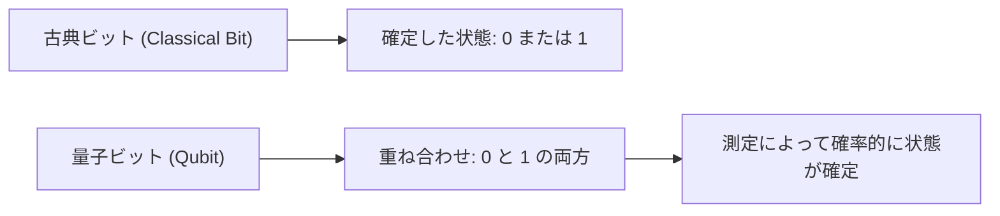
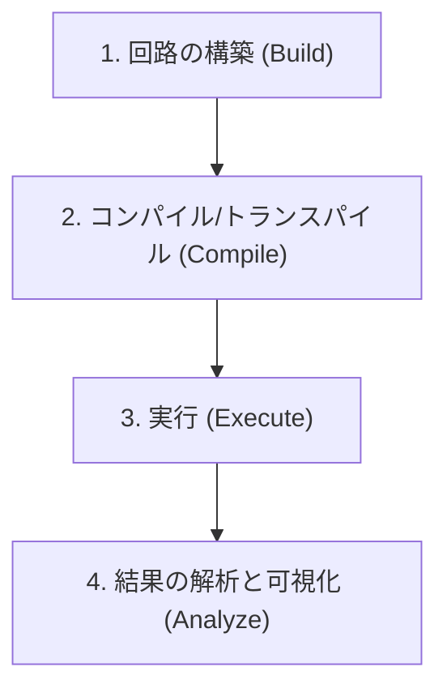
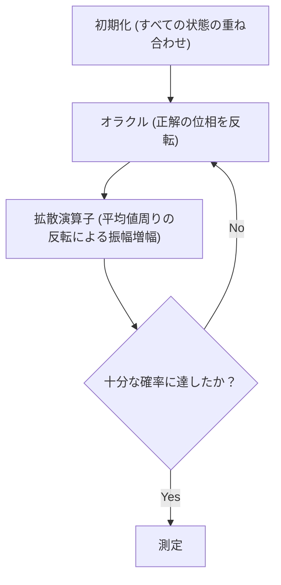

## 1. はじめに

現代のコンピュータ（古典コンピュータ）は、私たちの生活を劇的に変化させ、高度な計算能力によって社会のあらゆる側面を支えています。しかし、一部の特定の問題（例えば、巨大な数の素因数分解、複雑な分子構造のシミュレーション、最適化問題など）においては、現在の最先端のスーパーコンピュータであっても、宇宙の年齢より長い時間が必要になることが知られています。

こうした「古典コンピュータの限界」を打ち破る可能性を秘めているのが**量子コンピュータ（Quantum Computer）**です。量子力学の不思議な性質（重ね合わせや量子もつれ）を計算資源として活用することで、特定の問題を劇的に高速化できると考えられています。

本記事では、IBMがオープンソースで提供している量子コンピューティングのフレームワークである**Qiskit（キスキット）**を用いて、量子プログラミングの世界へ第一歩を踏み出します。物理や数学の基礎から丁寧に解説し、実際にPythonでコードを書き、シミュレータ上で量子回路を動かすまでのプロセスを網羅した、非常に詳細な入門ガイドです。

---

## 2. 量子計算を支える物理と数学の基礎

量子プログラミングを理解するためには、まず量子力学の基本的な概念を理解する必要があります。ここでは、量子ビット、重ね合わせ、量子もつれという3つの重要な柱について解説します。

### 2.1 古典ビットと量子ビット（Qubit）

古典コンピュータの情報単位は「ビット（Bit）」です。ビットは常に `0` か `1` のどちらか一つの状態をとります。

一方、量子コンピュータの情報の最小単位は**量子ビット（Qubit: Quantum bit）**と呼ばれます。量子ビットは、`0` と `1` の状態をとることができるだけでなく、**その両方の状態を同時に保持する**ことが可能です。

数学的には、量子ビットの状態 $|\psi\rangle$ は、基底状態 $|0\rangle$ と $|1\rangle$ の線形結合（重ね合わせ）として表現されます。

$$
|\psi\rangle = \alpha|0\rangle + \beta|1\rangle
$$

ここで、$\alpha$ と $\beta$ は複素数であり、それぞれ状態 $|0\rangle$ と $|1\rangle$ を観測する確率振幅を表します。量子力学の基本原理に基づき、確率の合計は1にならなければならないため、以下の規格化条件を満たします。

$$
|\alpha|^2 + |\beta|^2 = 1
$$

つまり、この量子ビットを「測定（観測）」したとき、$|0\rangle$ が得られる確率は $|\alpha|^2$、$|1\rangle$ が得られる確率は $|\beta|^2$ となります。測定前は確率的にしか状態が決まっていないという点が、古典ビットとの決定的な違いです。



### 2.2 重ね合わせ（Superposition）

先ほど述べたように、$|0\rangle$ と $|1\rangle$ の状態が混ざり合っている状態を**重ね合わせ（Superposition）**と呼びます。

例えば、1つの量子ビットが完全に均等な重ね合わせ状態にある場合、$\alpha = \frac{1}{\sqrt{2}}$、$\beta = \frac{1}{\sqrt{2}}$ となります。

$$
|\psi\rangle = \frac{1}{\sqrt{2}}|0\rangle + \frac{1}{\sqrt{2}}|1\rangle
$$

この状態を測定すると、$|0\rangle$ と $|1\rangle$ がそれぞれ50%の確率で観測されます。
もし2つの量子ビットがあれば、$|00\rangle, |01\rangle, |10\rangle, |11\rangle$ の4つの状態の重ね合わせを作ることができます。$n$個の量子ビットがあれば、$2^n$ 個の状態を同時に表現できることになり、これが量子コンピュータの並列処理能力の源泉の一つとなっています。

### 2.3 量子もつれ（Entanglement）

量子計算において最も強力かつ不思議な性質が**量子もつれ（Entanglement）**です。アインシュタインが「不気味な遠隔作用」と呼んだこの現象は、2つ以上の量子ビットが互いに強く結びつき、一方の量子ビットの状態が決定されると、物理的にどれだけ離れていても、もう一方の量子ビットの状態が瞬時に決定されるという性質です。

最も有名な量子もつれ状態である「ベル状態（Bell State）」の一つ、$\Phi^+$ 状態は次のように表されます。

$$
|\Phi^+\rangle = \frac{|00\rangle + |11\rangle}{\sqrt{2}}
$$

この状態では、$|01\rangle$ や $|10\rangle$ という状態は存在しません。したがって、1つ目の量子ビットを測定して $|0\rangle$ だった場合、2つ目の量子ビットを測定するまでもなく、確実に $|0\rangle$ であることが確定します。逆に、1つ目が $|1\rangle$ なら、2つ目も必ず $|1\rangle$ となります。

---

## 3. 量子論理ゲート（Quantum Logic Gates）

古典コンピュータがAND、OR、NOTなどの論理ゲートを用いて計算を行うように、量子コンピュータも**量子ゲート**を用いて量子ビットの状態を操作します。量子状態はベクトルであるため、量子ゲートはそのベクトルに作用する「ユニタリ行列」として表現されます。

### 3.1 パウリゲート（Pauli-X, Y, Z）

パウリゲートは、1量子ビットに対する基本的な操作です。

**・Pauli-X ゲート (NOTゲート)**
古典のNOTゲートに相当します。$|0\rangle$ を $|1\rangle$ に、$|1\rangle$ を $|0\rangle$ に反転させます。（ブロッホ球においてX軸周りの180度回転）

$$
X = \begin{pmatrix} 0 & 1 \\ 1 & 0 \end{pmatrix}
$$

**・Pauli-Y ゲート**
Y軸周りの180度回転を行います。位相とビットの両方を反転させる効果があります。

$$
Y = \begin{pmatrix} 0 & -i \\ i & 0 \end{pmatrix}
$$

**・Pauli-Z ゲート (位相反転ゲート)**
$|0\rangle$ の状態はそのままに、$|1\rangle$ の状態の位相を反転（$-1$ を掛ける）させます。（Z軸周りの180度回転）

$$
Z = \begin{pmatrix} 1 & 0 \\ 0 & -1 \end{pmatrix}
$$

### 3.2 アダマールゲート（Hadamard Gate）

アダマールゲート（Hゲート）は、確定した状態（$|0\rangle$ や $|1\rangle$）を重ね合わせ状態に変換する、非常に重要なゲートです。

$$
H = \frac{1}{\sqrt{2}}
\begin{pmatrix}
1 & 1 \\
1 & -1
\end{pmatrix}
$$

$|0\rangle$ にHゲートを適用すると、均等な重ね合わせ状態である $|+\rangle$ になります。

$$
H|0\rangle = \frac{1}{\sqrt{2}}|0\rangle + \frac{1}{\sqrt{2}}|1\rangle = |+\rangle
$$

### 3.3 位相ゲート（Phase Gates）

位相ゲートは、Zゲートを一般化したもので、$|1\rangle$ 状態の位相を指定した角度 $\theta$ だけ回転させます。

$$
P(\theta) = \begin{pmatrix} 1 & 0 \\ 0 & e^{i\theta} \end{pmatrix}
$$

代表的なものとして、Sゲート（$\theta = \pi/2$）や Tゲート（$\theta = \pi/4$）があります。

### 3.4 CNOTゲート（Controlled-NOT Gate）

CNOTゲート（CXゲート）は、2つの量子ビット間で操作を行うゲートで、量子もつれを生成するために不可欠です。「制御（Control）ビット」と「標的（Target）ビット」から構成されます。

制御ビットが $|1\rangle$ の場合のみ、標的ビットにXゲート（NOT操作）を適用し、制御ビットが $|0\rangle$ の場合は何もしません。

$$
CNOT = \begin{pmatrix}
1 & 0 & 0 & 0 \\
0 & 1 & 0 & 0 \\
0 & 0 & 0 & 1 \\
0 & 0 & 1 & 0
\end{pmatrix}
$$

---

## 4. Qiskitの基本と環境構築

ここからは、実際にPythonとQiskitを使用して量子プログラムを書いていきます。

### 4.1 Qiskitとは？

**Qiskit**は、IBM Quantumが開発したオープンソースの量子コンピューティング向けソフトウェア開発キット（SDK）です。Pythonを用いて直感的に量子回路を構築し、ローカルのシミュレータや、クラウド経由で実際のIBMの量子コンピュータ実機で実行することができます。

### 4.2 インストール方法

Qiskitを利用するためには、Python環境が必要です。以下のコマンドでQiskitと関連パッケージ（シミュレータや描画用ライブラリ）をインストールします。

```bash
pip install qiskit qiskit-aer qiskit-ibm-runtime matplotlib pylatexenc
```

### 4.3 プログラミングの基本フロー

Qiskitを使った量子プログラミングは、主に以下のステップで進行します。



1. **回路の構築**: `QuantumCircuit` オブジェクトを作成し、ゲートを追加していく。
2. **コンパイル**: 実行するバックエンド（実機やシミュレータ）に合わせて回路を最適化。
3. **実行**: バックエンドにジョブを送信し、結果を取得。
4. **解析**: 測定結果のヒストグラムなどをプロット。

---

## 5. 実践：ベル状態（量子もつれ）を作る回路の構築

理論で学んだ「量子もつれ（ベル状態）」を、実際にQiskitで作成してみましょう。目標とする状態は $|\Phi^+\rangle = \frac{|00\rangle + |11\rangle}{\sqrt{2}}$ です。

### 5.1 回路の設計

ベル状態を作るには、以下の手順を踏みます。
1. 2つの量子ビットを用意する（初期状態はどちらも $|0\rangle$）。
2. 1つ目の量子ビットにアダマールゲート（H）を適用し、重ね合わせ状態にする。
3. 1つ目の量子ビットを「制御ビット」、2つ目の量子ビットを「標的ビット」として、CNOTゲートを適用する。
4. 結果を読み取るために測定（Measure）を行う。

### 5.2 Python/Qiskit コード実装

それでは、実際のコードを見てみましょう。

```python
import numpy as np
from qiskit import QuantumCircuit, transpile
from qiskit_aer import Aer
from qiskit.visualization import plot_histogram
import matplotlib.pyplot as plt

# 1. 回路の初期化
# 2つの量子ビットと、2つの古典ビットを持つ量子回路を作成
qc = QuantumCircuit(2, 2)

# 2. Hゲートの適用
# 量子ビット 0 (q0) にアダマールゲートを適用
qc.h(0)

# 3. CNOTゲートの適用
# q0 を制御ビット、q1 を標的ビットとして CNOT を適用
qc.cx(0, 1)

# 4. 測定
# 量子ビット 0 と 1 を測定し、古典ビット 0 と 1 にそれぞれ書き込む
qc.measure([0, 1], [0, 1])

# 回路図を描画 (matplotlibを使用)
# qc.draw('mpl')
print(qc.draw())
```

このコードを実行すると、コンソール上にアスキーアートで以下のような量子回路図が表示されます。

```text
     ┌───┐     ┌─┐   
q_0: ┤ H ├──■──┤M├───
     └───┘┌─┴─┐└╥┘┌─┐
q_1: ─────┤ X ├─╫─┤M├
          └───┘ ║ └╥┘
c: 2/═══════════╩══╩═
                0  1 
```
`H` がアダマールゲート、`■` と `X` の組み合わせがCNOTゲート、`M` が測定を表しています。

### 5.3 シミュレータでの実行と結果の解釈

次に、この回路をIBMの高性能シミュレータ `Aer` で実行し、結果を確認します。

```python
# Aerシミュレータのバックエンドを取得
simulator = Aer.get_backend('qasm_simulator')

# シミュレータ向けに回路をトランスパイル（最適化）
compiled_circuit = transpile(qc, simulator)

# 回路を実行（ここでは1000回ショットを実行）
job = simulator.run(compiled_circuit, shots=1000)

# 結果を取得
result = job.result()

# 状態の観測回数（カウント）を取得
counts = result.get_counts(compiled_circuit)
print("\n測定結果:", counts)

# ヒストグラムのプロット
# plot_histogram(counts)
# plt.show()
```

**結果の解釈**

コンソールの出力は以下のようになるはずです。
`測定結果: {'00': 495, '11': 505}`
（※確率はランダムなため、実行ごとに数値はわずかに変動します）

理想的なシミュレーション環境では、測定結果は `00` と `11` がおよそ50%ずつ観測され、`01` や `10` は一切観測されません。
これはまさに、私たちが作成したベル状態 $|\Phi^+\rangle = \frac{|00\rangle + |11\rangle}{\sqrt{2}}$ の理論的予測と完全に一致しています。1つ目の量子ビットが0であれば2つ目も必ず0、1であれば必ず1になるという「量子もつれ」が正確にシミュレートされています。

なお、実機の量子コンピュータ（IBM Quantum Hardware）で実行した場合、ノイズ（量子デコヒーレンスやゲートエラー）の影響により、わずかに `01` や `10` が観測されることがあります。このノイズをいかに減らすか（量子誤り訂正）が、現在の量子コンピュータ開発における最大の課題の一つです。

---

## 6. より高度なアルゴリズムへのスケールアップ

ベル状態の作成は量子プログラミングの「Hello World」とも言えます。ここからさらに発展させることで、古典コンピュータを凌駕する強力なアルゴリズムを構築できます。

### 6.1 ドイチェ・ジョサのアルゴリズム（Deutsch-Jozsa Algorithm）

与えられた関数 $f(x)$ が「定数関数（入力に関わらず常に0または常に1を出力する）」か「均衡関数（半分の入力に対して0、残りの半分に対して1を出力する）」のどちらであるかを判定する問題です。
古典コンピュータでは最悪の場合 $2^{n-1} + 1$ 回の関数の評価が必要ですが、ドイチェ・ジョサのアルゴリズムを使えば、量子の並列性を利用して**たった1回の評価**で判定することができます。これは、重ね合わせ状態を入力し、干渉（Interference）を利用して不要な状態を打ち消し、欲しい答えを増幅させるという量子アルゴリズムの基本パターンを示しています。

### 6.2 グローバーのアルゴリズム（Grover's Algorithm）

ソートされていない $N$ 個のデータベースから特定のデータを探し出す検索問題において、古典アルゴリズムが平均 $N/2$ 回の計算を要するのに対し、グローバーのアルゴリズムは $\sqrt{N}$ 回で目的のデータを見つけ出すことができます。
このアルゴリズムは、「オラクル（Oracle）」と呼ばれるブラックボックスを用いて目的の解の位相を反転させ、さらに「振幅増幅（Amplitude Amplification）」を行うことで、目的の解が観測される確率を劇的に高めます。



---

## 7. まとめとこれからの学習

この記事では、量子コンピューティングの根本的な概念である重ね合わせや量子もつれから始まり、Qiskitを用いた量子論理ゲートの操作、そして実際にベル状態を構築・シミュレーションして結果を解釈するまでを詳細に解説しました。

QiskitはPythonという親しみやすい言語で記述できるため、数学的・物理的な壁を越えて、アルゴリズムの構築に集中させてくれる強力なツールです。量子コンピュータは現在、ノイズを伴う中規模量子デバイス（NISQ: Noisy Intermediate-Scale Quantum）の時代にありますが、機械学習（Quantum Machine Learning）、化学シミュレーション（Quantum Chemistry）、暗号解読など、数多くの分野での応用研究が世界中で急速に進められています。

ぜひ、この機会にQiskitを使って様々な量子回路を自作し、実機のIBM Quantumプロセッサで動かしてみてください。未来のコンピューティング・パラダイムをその手で体験できるはずです。

### 参考資料
- [Qiskit公式ドキュメント](https://qiskit.org/documentation/)
- [Qiskit Textbook](https://qiskit.org/textbook/ja/preface.html) - より深く数学的背景やアルゴリズムを学びたい方におすすめの公式テキスト
- IBM Quantum Learning

量子の世界へようこそ！
