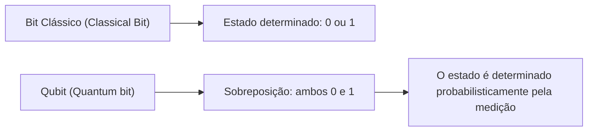
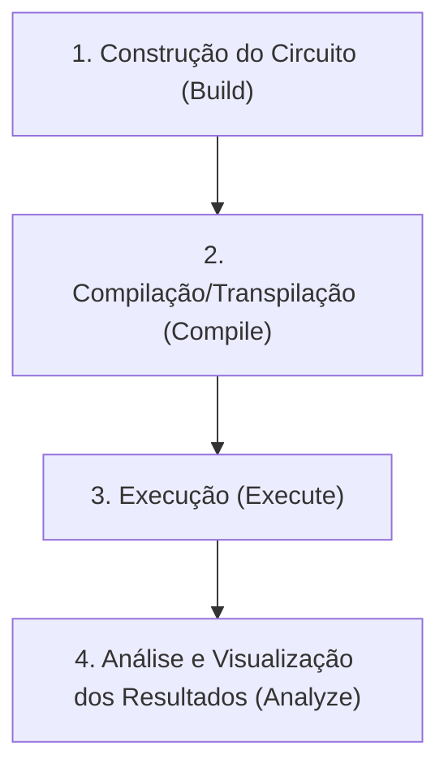
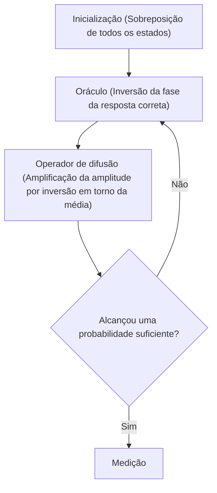

## 1. Introdução

Os computadores modernos (computadores clássicos) mudaram drasticamente as nossas vidas, apoiando todos os aspectos da sociedade através de seu alto poder computacional. No entanto, sabe-se que para certos problemas específicos (como a fatoração de números primos gigantescos, a simulação de estruturas moleculares complexas, problemas de otimização, etc.), mesmo os supercomputadores mais avançados da atualidade precisariam de um tempo superior à idade do universo para resolvê-los.

O que possui o potencial para quebrar esses "limites dos computadores clássicos" é o **computador quântico (Quantum Computer)**. Acredita-se que, utilizando propriedades fascinantes da mecânica quântica (sobreposição e emaranhamento quântico) como recursos computacionais, é possível acelerar drasticamente a resolução de determinados problemas.

Neste artigo, daremos o primeiro passo no mundo da programação quântica utilizando o **Qiskit**, um framework de computação quântica de código aberto fornecido pela IBM. Este é um guia de introdução extremamente detalhado, cobrindo tudo de forma minuciosa, desde os fundamentos da física e da matemática, até escrever código na prática em Python e executar circuitos quânticos em um simulador.

---

## 2. Fundamentos de Física e Matemática que Sustentam a Computação Quântica

Para compreender a programação quântica, é necessário primeiro entender os conceitos fundamentais da mecânica quântica. Aqui, explicaremos três pilares importantes: qubits, sobreposição e emaranhamento quântico.

### 2.1 Bits Clássicos e Qubits (Quantum bits)

A unidade de informação de um computador clássico é o "bit (Bit)". Um bit sempre assume um de dois estados: `0` ou `1`.

Por outro lado, a menor unidade de informação de um computador quântico é chamada de **qubit (Qubit: Quantum bit)**. Um qubit não só pode assumir o estado `0` ou `1`, mas também é capaz de **manter ambos os estados simultaneamente**.

Matematicamente, o estado de um qubit $|\psi\rangle$ é expresso como uma combinação linear (sobreposição) dos estados base $|0\rangle$ e $|1\rangle$.

$$
|\psi\rangle = \alpha|0\rangle + \beta|1\rangle
$$

Aqui, $\alpha$ e $\beta$ são números complexos e representam as amplitudes de probabilidade de observar os estados $|0\rangle$ e $|1\rangle$, respectivamente. Com base nos princípios fundamentais da mecânica quântica, a soma das probabilidades deve ser 1, de modo que satisfaçam a seguinte condição de normalização:

$$
|\alpha|^2 + |\beta|^2 = 1
$$

Isso significa que, quando este qubit é "medido (observado)", a probabilidade de se obter $|0\rangle$ é $|\alpha|^2$ e a probabilidade de se obter $|1\rangle$ é $|\beta|^2$. O fato de que o estado é determinado apenas de forma probabilística antes da medição é a diferença crucial em relação aos bits clássicos.



### 2.2 Sobreposição (Superposition)

Como mencionado anteriormente, o estado onde $|0\rangle$ e $|1\rangle$ estão misturados é chamado de **sobreposição (Superposition)**.

Por exemplo, quando um qubit está em um estado de sobreposição perfeitamente uniforme, temos $\alpha = \frac{1}{\sqrt{2}}$ e $\beta = \frac{1}{\sqrt{2}}$.

$$
|\psi\rangle = \frac{1}{\sqrt{2}}|0\rangle + \frac{1}{\sqrt{2}}|1\rangle
$$

Quando medimos este estado, $|0\rangle$ e $|1\rangle$ são observados com 50% de probabilidade cada.
Se tivermos 2 qubits, podemos criar uma sobreposição de 4 estados: $|00\rangle, |01\rangle, |10\rangle, |11\rangle$. Com $n$ qubits, $2^n$ estados podem ser representados simultaneamente, e essa é uma das fontes do poder de processamento paralelo dos computadores quânticos.

### 2.3 Emaranhamento Quântico (Entanglement)

A propriedade mais poderosa e misteriosa da computação quântica é o **emaranhamento quântico (Entanglement)**. Este fenômeno, que Einstein chamou de "ação fantasmagórica à distância", é a propriedade em que dois ou mais qubits se tornam fortemente interligados, de modo que quando o estado de um qubit é determinado, o estado do outro qubit é determinado instantaneamente, independentemente da distância física que os separe.

Um dos mais famosos estados de emaranhamento quântico, o "Estado de Bell (Bell State)" $\Phi^+$, é expresso da seguinte forma:

$$
|\Phi^+\rangle = \frac{|00\rangle + |11\rangle}{\sqrt{2}}
$$

Neste estado, os estados $|01\rangle$ e $|10\rangle$ não existem. Portanto, se o primeiro qubit for medido e resultar em $|0\rangle$, é certo que o segundo qubit também será $|0\rangle$, sem nem mesmo precisar medi-lo. Inversamente, se o primeiro for $|1\rangle$, o segundo também será necessariamente $|1\rangle$.

---

## 3. Portas Lógicas Quânticas (Quantum Logic Gates)

Assim como computadores clássicos usam portas lógicas como AND, OR e NOT para realizar cálculos, os computadores quânticos usam **portas quânticas** para manipular o estado dos qubits. Como um estado quântico é um vetor, uma porta quântica é representada como uma "matriz unitária" que atua nesse vetor.

### 3.1 Portas de Pauli (Pauli-X, Y, Z)

As portas de Pauli são operações básicas em um único qubit.

**・Porta Pauli-X (Porta NOT)**
Equivale à porta NOT clássica. Inverte o estado $|0\rangle$ para $|1\rangle$, e $|1\rangle$ para $|0\rangle$. (Rotação de 180 graus em torno do eixo X na Esfera de Bloch).

$$
X = \begin{pmatrix} 0 & 1 \\ 1 & 0 \end{pmatrix}
$$

**・Porta Pauli-Y**
Realiza uma rotação de 180 graus em torno do eixo Y. Tem o efeito de inverter tanto a fase quanto o bit.

$$
Y = \begin{pmatrix} 0 & -i \\ i & 0 \end{pmatrix}
$$

**・Porta Pauli-Z (Porta de inversão de fase)**
Mantém o estado $|0\rangle$ como está, e inverte a fase (multiplica por $-1$) do estado $|1\rangle$. (Rotação de 180 graus em torno do eixo Z).

$$
Z = \begin{pmatrix} 1 & 0 \\ 0 & -1 \end{pmatrix}
$$

### 3.2 Porta Hadamard (Hadamard Gate)

A porta Hadamard (Porta H) é uma porta extremamente importante que converte estados definidos ($|0\rangle$ ou $|1\rangle$) em estados de sobreposição.

$$
H = \frac{1}{\sqrt{2}}
\begin{pmatrix}
1 & 1 \\
1 & -1
\end{pmatrix}
$$

Aplicando a porta H a $|0\rangle$, obtemos $|+\rangle$, que é um estado de sobreposição uniforme.

$$
H|0\rangle = \frac{1}{\sqrt{2}}|0\rangle + \frac{1}{\sqrt{2}}|1\rangle = |+\rangle
$$

### 3.3 Portas de Fase (Phase Gates)

A porta de fase é uma generalização da porta Z, que gira a fase do estado $|1\rangle$ por um ângulo especificado $\theta$.

$$
P(\theta) = \begin{pmatrix} 1 & 0 \\ 0 & e^{i\theta} \end{pmatrix}
$$

Exemplos típicos são a porta S ($\theta = \pi/2$) e a porta T ($\theta = \pi/4$).

### 3.4 Porta CNOT (Controlled-NOT Gate)

A porta CNOT (Porta CX) opera entre dois qubits e é essencial para criar emaranhamento quântico. Consiste em um "bit de controle (Control)" e um "bit alvo (Target)".

Aplica-se uma porta X (operação NOT) no bit alvo apenas se o bit de controle for $|1\rangle$, e não faz nada se o bit de controle for $|0\rangle$.

$$
CNOT = \begin{pmatrix}
1 & 0 & 0 & 0 \\
0 & 1 & 0 & 0 \\
0 & 0 & 0 & 1 \\
0 & 0 & 1 & 0
\end{pmatrix}
$$

---

## 4. Noções Básicas e Configuração do Ambiente Qiskit

A partir daqui, vamos de fato usar Python e Qiskit para escrever um programa quântico.

### 4.1 O que é o Qiskit?

**Qiskit** é um kit de desenvolvimento de software (SDK) de código aberto para computação quântica desenvolvido pela IBM Quantum. Ele permite construir circuitos quânticos intuitivamente usando Python e executá-los em um simulador local ou em um computador quântico real da IBM através da nuvem.

### 4.2 Como Instalar

Para usar o Qiskit, é necessário um ambiente Python. Você pode instalar o Qiskit e pacotes relacionados (como simuladores e bibliotecas de visualização) com o seguinte comando:

```bash
pip install qiskit qiskit-aer qiskit-ibm-runtime matplotlib pylatexenc
```

### 4.3 Fluxo Básico de Programação

A programação quântica usando o Qiskit prossegue principalmente nas seguintes etapas:



1. **Construção do Circuito**: Criar um objeto `QuantumCircuit` e adicionar portas a ele.
2. **Compilação**: Otimizar o circuito de acordo com o backend (hardware real ou simulador) onde será executado.
3. **Execução**: Enviar o trabalho (job) para o backend e obter os resultados.
4. **Análise**: Plotar um histograma dos resultados da medição, etc.

---

## 5. Prática: Construindo um Circuito para Criar um Estado de Bell (Emaranhamento Quântico)

Vamos agora usar o Qiskit para criar na prática o "emaranhamento quântico (Estado de Bell)" que aprendemos na teoria. O estado alvo é $|\Phi^+\rangle = \frac{|00\rangle + |11\rangle}{\sqrt{2}}$.

### 5.1 Projeto do Circuito

Para criar o estado de Bell, seguiremos os seguintes passos:
1. Preparar 2 qubits (ambos inicialmente no estado $|0\rangle$).
2. Aplicar a porta Hadamard (H) ao primeiro qubit para colocá-lo em um estado de sobreposição.
3. Aplicar a porta CNOT, usando o primeiro qubit como "bit de controle" e o segundo qubit como "bit alvo".
4. Realizar a medição (Measure) para ler os resultados.

### 5.2 Implementação do Código em Python/Qiskit

Vejamos agora o código real.

```python
import numpy as np
from qiskit import QuantumCircuit, transpile
from qiskit_aer import Aer
from qiskit.visualization import plot_histogram
import matplotlib.pyplot as plt

# 1. Inicialização do Circuito
# Criar um circuito quântico com 2 qubits e 2 bits clássicos
qc = QuantumCircuit(2, 2)

# 2. Aplicação da porta H
# Aplicar a porta Hadamard ao qubit 0 (q0)
qc.h(0)

# 3. Aplicação da porta CNOT
# Aplicar CNOT usando q0 como bit de controle e q1 como bit alvo
qc.cx(0, 1)

# 4. Medição
# Medir os qubits 0 e 1, e escrever os resultados nos bits clássicos 0 e 1, respectivamente
qc.measure([0, 1], [0, 1])

# Desenhar o diagrama do circuito (usando matplotlib)
# qc.draw('mpl')
print(qc.draw())
```

Ao executar este código, o seguinte diagrama de circuito quântico será exibido em arte ASCII no console:

```text
     ┌───┐     ┌─┐   
q_0: ┤ H ├──■──┤M├───
     └───┘┌─┴─┐└╥┘┌─┐
q_1: ─────┤ X ├─╫─┤M├
          └───┘ ║ └╥┘
c: 2/═══════════╩══╩═
                0  1 
```
`H` representa a porta Hadamard, a combinação de `■` e `X` representa a porta CNOT, e `M` representa a medição.

### 5.3 Execução no Simulador e Interpretação dos Resultados

Em seguida, executaremos este circuito no simulador de alto desempenho da IBM, `Aer`, e verificaremos os resultados.

```python
# Obter o backend do simulador Aer
simulator = Aer.get_backend('qasm_simulator')

# Transpilar (otimizar) o circuito para o simulador
compiled_circuit = transpile(qc, simulator)

# Executar o circuito (aqui, realizamos 1000 execuções ou "shots")
job = simulator.run(compiled_circuit, shots=1000)

# Obter o resultado
result = job.result()

# Obter a contagem de vezes que cada estado foi observado
counts = result.get_counts(compiled_circuit)
print("\nResultados da medição:", counts)

# Plotar o histograma
# plot_histogram(counts)
# plt.show()
```

**Interpretação dos Resultados**

A saída do console deve ser algo semelhante a isto:
`Resultados da medição: {'00': 495, '11': 505}`
(*Nota: como as probabilidades são aleatórias, os números variam ligeiramente a cada execução*)

Em um ambiente de simulação ideal, os resultados da medição mostrarão `00` e `11` sendo observados com cerca de 50% de probabilidade cada um, e `01` e `10` não serão observados em absoluto.
Isto corresponde perfeitamente à previsão teórica para o estado de Bell $|\Phi^+\rangle = \frac{|00\rangle + |11\rangle}{\sqrt{2}}$ que criamos. O "emaranhamento quântico" foi simulado com precisão, confirmando que se o primeiro qubit for 0, o segundo também será necessariamente 0, e se o primeiro for 1, o segundo também será necessariamente 1.

No entanto, se for executado em um hardware quântico real (IBM Quantum Hardware), os estados `01` ou `10` podem ser levemente observados devido à influência de ruídos (decoerência quântica e erros de portas). Como reduzir esse ruído (correção de erros quânticos) é atualmente um dos maiores desafios no desenvolvimento de computadores quânticos.

---

## 6. Escalando para Algoritmos Mais Avançados

A criação do estado de Bell pode ser considerada o "Hello World" da programação quântica. Ao nos desenvolvermos a partir daqui, podemos construir algoritmos poderosos que superam os computadores clássicos.

### 6.1 Algoritmo de Deutsch-Jozsa (Deutsch-Jozsa Algorithm)

Este é um problema para determinar se uma dada função $f(x)$ é "constante" (sempre gera 0 ou sempre 1 independentemente da entrada) ou "balanceada" (gera 0 para metade das entradas e 1 para a outra metade).
Em um computador clássico, no pior dos casos, seriam necessárias $2^{n-1} + 1$ avaliações da função, mas usando o algoritmo de Deutsch-Jozsa, podemos usar o paralelismo quântico para determinar a resposta com **apenas 1 avaliação**. Isto demonstra o padrão básico de algoritmos quânticos: inserir um estado de sobreposição e usar a interferência (Interference) para cancelar estados indesejados e amplificar a resposta desejada.

### 6.2 Algoritmo de Grover (Grover's Algorithm)

Em um problema de busca onde procuramos por dados específicos em um banco de dados não ordenado de $N$ itens, um algoritmo clássico requer em média $N/2$ cálculos, enquanto o algoritmo de Grover pode encontrar os dados desejados em cerca de $\sqrt{N}$ vezes.
Este algoritmo usa uma caixa preta chamada "Oráculo (Oracle)" para inverter a fase da solução desejada e, em seguida, realiza uma "Amplificação de Amplitude (Amplitude Amplification)", o que aumenta drasticamente a probabilidade de a solução desejada ser observada.



---

## 7. Conclusão e Próximos Passos no Aprendizado

Neste artigo, explicamos detalhadamente, desde os conceitos fundamentais da computação quântica como sobreposição e emaranhamento quântico, passando pela manipulação de portas lógicas quânticas usando o Qiskit, até a construção, simulação prática de um estado de Bell e interpretação de seus resultados.

O Qiskit é uma ferramenta poderosa que, por poder ser escrita em uma linguagem familiar como o Python, permite superar barreiras matemáticas e físicas para que você possa se concentrar na construção de algoritmos. Os computadores quânticos estão atualmente na era dos Dispositivos Quânticos Ruidosos de Escala Intermediária (NISQ: Noisy Intermediate-Scale Quantum), mas a pesquisa aplicada está avançando rapidamente ao redor do mundo em muitos campos, como Aprendizado de Máquina Quântico (Quantum Machine Learning), Simulação Química (Quantum Chemistry) e Criptografia.

Por favor, aproveite esta oportunidade para criar por conta própria vários circuitos quânticos usando o Qiskit e tente executá-los em processadores reais do IBM Quantum. Você certamente poderá experimentar com as próprias mãos o paradigma da computação do futuro.

### Materiais de Referência
- [Documentação Oficial do Qiskit](https://qiskit.org/documentation/)
- [Qiskit Textbook](https://qiskit.org/textbook/ja/preface.html) - Um livro didático oficial recomendado para quem deseja aprender mais profundamente os fundamentos matemáticos e os algoritmos (disponível em vários idiomas).
- IBM Quantum Learning

Bem-vindo ao mundo quântico!
