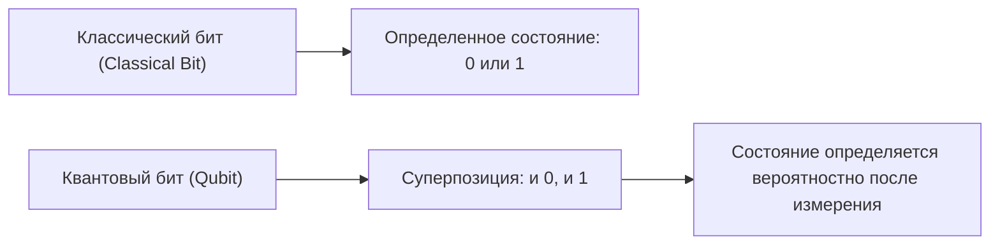
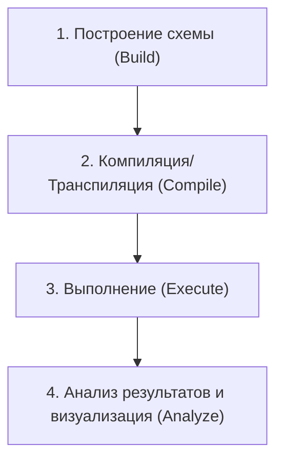
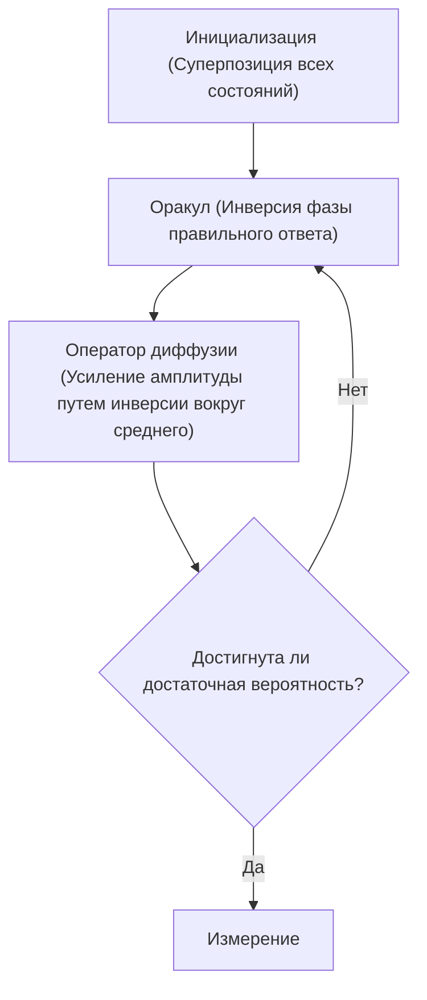

## 1. Введение

Современные компьютеры (классические компьютеры) кардинально изменили нашу жизнь, поддерживая все аспекты жизни общества благодаря своим высоким вычислительным возможностям. Однако известно, что для решения некоторых специфических задач (например, факторизации очень больших чисел, симуляции сложных молекулярных структур, задач оптимизации и т. д.) даже самым современным суперкомпьютерам потребуется время, превышающее возраст Вселенной.

Эти «ограничения классических компьютеров» обладает потенциалом преодолеть **квантовый компьютер (Quantum Computer)**. Считается, что за счет использования удивительных свойств квантовой механики (суперпозиции и квантовой запутанности) в качестве вычислительных ресурсов, можно радикально ускорить решение определенных задач.

В этой статье мы сделаем первый шаг в мир квантового программирования, используя **Qiskit**, фреймворк для квантовых вычислений с открытым исходным кодом от IBM. Это очень подробное вводное руководство, в котором тщательно объясняются основы физики и математики, а также охватывается весь процесс написания кода на Python и запуска квантовых схем на симуляторе.

---

## 2. Физические и математические основы квантовых вычислений

Чтобы понять квантовое программирование, сначала необходимо понять базовые концепции квантовой механики. Здесь мы обсудим три важных столпа: кубиты, суперпозицию и квантовую запутанность.

### 2.1 Классические биты и квантовые биты (Qubit)

Единицей информации в классическом компьютере является "бит (Bit)". Бит всегда находится в одном из двух состояний: `0` или `1`.

С другой стороны, минимальная единица информации в квантовом компьютере называется **квантовым битом (Qubit: Quantum bit)**. Кубит может находиться не только в состояниях `0` и `1`, но и **в обоих этих состояниях одновременно**.

Математически состояние кубита $|\psi\rangle$ выражается как линейная комбинация (суперпозиция) базисных состояний $|0\rangle$ и $|1\rangle$.

$$
|\psi\rangle = \alpha|0\rangle + \beta|1\rangle
$$

Где $\alpha$ и $\beta$ - комплексные числа, представляющие амплитуды вероятности наблюдения состояний $|0\rangle$ и $|1\rangle$ соответственно. Согласно фундаментальному принципу квантовой механики, сумма вероятностей должна быть равна 1, поэтому выполняется следующее условие нормировки:

$$
|\alpha|^2 + |\beta|^2 = 1
$$

Другими словами, когда мы "измеряем (наблюдаем)" этот кубит, вероятность получения $|0\rangle$ равна $|\alpha|^2$, а вероятность получения $|1\rangle$ равна $|\beta|^2$. Решающее отличие от классических битов состоит в том, что до измерения состояние определяется лишь вероятностно.



### 2.2 Суперпозиция (Superposition)

Как упоминалось ранее, состояние, в котором состояния $|0\rangle$ и $|1\rangle$ смешаны, называется **суперпозицией (Superposition)**.

Например, когда один кубит находится в полностью равномерной суперпозиции, $\alpha = \frac{1}{\sqrt{2}}$ и $\beta = \frac{1}{\sqrt{2}}$.

$$
|\psi\rangle = \frac{1}{\sqrt{2}}|0\rangle + \frac{1}{\sqrt{2}}|1\rangle
$$

При измерении этого состояния, $|0\rangle$ и $|1\rangle$ наблюдаются с вероятностью 50% каждое.
Если у нас есть два кубита, мы можем создать суперпозицию 4 состояний: $|00\rangle, |01\rangle, |10\rangle, |11\rangle$. С $n$ кубитами можно одновременно представить $2^n$ состояний, что является одним из источников возможности параллельной обработки квантовых компьютеров.

### 2.3 Квантовая запутанность (Entanglement)

Самое мощное и таинственное свойство в квантовых вычислениях — **квантовая запутанность (Entanglement)**. Эйнштейн называл это явление "жутким дальнодействием". Это свойство, при котором два или более кубитов настолько сильно связаны друг с другом, что как только состояние одного кубита определяется, состояние другого определяется мгновенно, независимо от того, насколько далеко физически они находятся друг от друга.

Одно из самых известных квантово-запутанных состояний — "Состояние Белла (Bell State)", состояние $\Phi^+$, выражается следующим образом:

$$
|\Phi^+\rangle = \frac{|00\rangle + |11\rangle}{\sqrt{2}}
$$

В этом состоянии не существуют таких вариантов, как $|01\rangle$ или $|10\rangle$. Поэтому, если мы измерим первый кубит и он окажется $|0\rangle$, то даже не измеряя второй кубит, можно с уверенностью утверждать, что он будет $|0\rangle$. И наоборот, если первый кубит $|1\rangle$, то второй кубит обязательно будет $|1\rangle$.

---

## 3. Квантовые логические вентили (Quantum Logic Gates)

Точно так же, как классические компьютеры выполняют вычисления с помощью логических вентилей, таких как AND, OR, NOT, квантовые компьютеры используют **квантовые вентили** для управления состояниями кубитов. Поскольку квантовые состояния являются векторами, квантовые вентили представляются как "унитарные матрицы", действующие на эти векторы.

### 3.1 Вентили Паули (Pauli-X, Y, Z)

Вентили Паули — это базовые операции над одним кубитом.

**・Вентиль Pauli-X (Вентиль NOT)**
Эквивалентен классическому вентилю NOT. Он инвертирует $|0\rangle$ в $|1\rangle$ и $|1\rangle$ в $|0\rangle$. (Поворот на 180 градусов вокруг оси X на сфере Блоха)

$$
X = \begin{pmatrix} 0 & 1 \\ 1 & 0 \end{pmatrix}
$$

**・Вентиль Pauli-Y**
Выполняет поворот на 180 градусов вокруг оси Y. Обладает эффектом инвертирования как фазы, так и бита.

$$
Y = \begin{pmatrix} 0 & -i \\ i & 0 \end{pmatrix}
$$

**・Вентиль Pauli-Z (Вентиль инверсии фазы)**
Оставляет состояние $|0\rangle$ без изменений и инвертирует фазу (умножает на $-1$) состояния $|1\rangle$. (Поворот на 180 градусов вокруг оси Z)

$$
Z = \begin{pmatrix} 1 & 0 \\ 0 & -1 \end{pmatrix}
$$

### 3.2 Вентиль Адамара (Hadamard Gate)

Вентиль Адамара (H-вентиль) — это чрезвычайно важный вентиль, который преобразует определенные состояния ($|0\rangle$ или $|1\rangle$) в состояния суперпозиции.

$$
H = \frac{1}{\sqrt{2}}
\begin{pmatrix}
1 & 1 \\
1 & -1
\end{pmatrix}
$$

При применении H-вентиля к $|0\rangle$, оно переходит в состояние $|+\rangle$, которое является равномерной суперпозицией.

$$
H|0\rangle = \frac{1}{\sqrt{2}}|0\rangle + \frac{1}{\sqrt{2}}|1\rangle = |+\rangle
$$

### 3.3 Фазовые вентили (Phase Gates)

Фазовый вентиль является обобщением Z-вентиля; он вращает фазу состояния $|1\rangle$ на заданный угол $\theta$.

$$
P(\theta) = \begin{pmatrix} 1 & 0 \\ 0 & e^{i\theta} \end{pmatrix}
$$

Типичными примерами являются S-вентиль ($\theta = \pi/2$) и T-вентиль ($\theta = \pi/4$).

### 3.4 Вентиль CNOT (Controlled-NOT Gate)

Вентиль CNOT (CX-вентиль) — это вентиль, выполняющий операцию между двумя кубитами, и он незаменим для создания квантовой запутанности. Он состоит из "Управляющего (Control) бита" и "Целевого (Target) бита".

X-вентиль (операция NOT) применяется к целевому биту только тогда, когда управляющий бит находится в состоянии $|1\rangle$, и ничего не делает, если управляющий бит находится в состоянии $|0\rangle$.

$$
CNOT = \begin{pmatrix}
1 & 0 & 0 & 0 \\
0 & 1 & 0 & 0 \\
0 & 0 & 0 & 1 \\
0 & 0 & 1 & 0
\end{pmatrix}
$$

---

## 4. Основы Qiskit и настройка среды

С этого момента мы фактически будем писать квантовые программы, используя Python и Qiskit.

### 4.1 Что такое Qiskit?

**Qiskit** — это набор для разработки программного обеспечения (SDK) с открытым исходным кодом для квантовых вычислений, разработанный IBM Quantum. Используя Python, вы можете интуитивно строить квантовые схемы и запускать их на локальных симуляторах или на реальных квантовых компьютерах IBM через облако.

### 4.2 Способ установки

Для использования Qiskit требуется среда Python. Установите Qiskit и связанные с ним пакеты (симуляторы и библиотеки для построения графиков) с помощью следующей команды:

```bash
pip install qiskit qiskit-aer qiskit-ibm-runtime matplotlib pylatexenc
```

### 4.3 Базовый рабочий процесс программирования

Квантовое программирование с использованием Qiskit в основном состоит из следующих шагов:



1. **Построение схемы**: Создайте объект `QuantumCircuit` и добавляйте вентили.
2. **Компиляция**: Оптимизируйте схему под целевой бэкенд (реальное оборудование или симулятор).
3. **Выполнение**: Отправьте задание на бэкенд и получите результаты.
4. **Анализ**: Постройте графики, например, гистограмму результатов измерений.

---

## 5. Практика: Построение схемы для создания состояния Белла (Квантовая запутанность)

Давайте фактически создадим «квантовую запутанность (состояние Белла)», о которой мы узнали в теории, с помощью Qiskit. Наше целевое состояние — $|\Phi^+\rangle = \frac{|00\rangle + |11\rangle}{\sqrt{2}}$.

### 5.1 Проектирование схемы

Чтобы создать состояние Белла, мы выполним следующие шаги:
1. Подготовить два кубита (оба инициализируются в состоянии $|0\rangle$).
2. Применить вентиль Адамара (H) к первому кубиту, чтобы перевести его в состояние суперпозиции.
3. Применить вентиль CNOT, используя первый кубит как "управляющий бит", а второй как "целевой бит".
4. Выполнить измерение (Measure) для считывания результатов.

### 5.2 Реализация кода на Python/Qiskit

Давайте теперь посмотрим на реальный код.

```python
import numpy as np
from qiskit import QuantumCircuit, transpile
from qiskit_aer import Aer
from qiskit.visualization import plot_histogram
import matplotlib.pyplot as plt

# 1. Инициализация схемы
# Создание квантовой схемы с 2 квантовыми и 2 классическими битами
qc = QuantumCircuit(2, 2)

# 2. Применение H-вентиля
# Применяем вентиль Адамара к кубиту 0 (q0)
qc.h(0)

# 3. Применение CNOT-вентиля
# Применяем CNOT: q0 - управляющий бит, q1 - целевой бит
qc.cx(0, 1)

# 4. Измерение
# Измеряем кубиты 0 и 1, и записываем результаты в классические биты 0 и 1 соответственно
qc.measure([0, 1], [0, 1])

# Отрисовка схемы (с использованием matplotlib)
# qc.draw('mpl')
print(qc.draw())
```

При запуске этого кода на консоли отобразится следующая квантовая схема в виде ASCII-графики:

```text
     ┌───┐     ┌─┐   
q_0: ┤ H ├──■──┤M├───
     └───┘┌─┴─┐└╥┘┌─┐
q_1: ─────┤ X ├─╫─┤M├
          └───┘ ║ └╥┘
c: 2/═══════════╩══╩═
                0  1 
```
`H` обозначает вентиль Адамара, комбинация `■` и `X` — вентиль CNOT, а `M` — измерение.

### 5.3 Выполнение на симуляторе и интерпретация результатов

Затем мы запустим эту схему на высокопроизводительном симуляторе IBM `Aer` и проверим результаты.

```python
# Получение бэкенда симулятора Aer
simulator = Aer.get_backend('qasm_simulator')

# Транспиляция (оптимизация) схемы для симулятора
compiled_circuit = transpile(qc, simulator)

# Выполнение схемы (здесь мы делаем 1000 запусков (shots))
job = simulator.run(compiled_circuit, shots=1000)

# Получение результатов
result = job.result()

# Получение частот наблюдения состояний (counts)
counts = result.get_counts(compiled_circuit)
print("\nРезультаты измерений:", counts)

# Построение гистограммы
# plot_histogram(counts)
# plt.show()
```

**Интерпретация результатов**

Вывод в консоли должен выглядеть примерно так:
`Результаты измерений: {'00': 495, '11': 505}`
(※Поскольку вероятности случайны, значения будут немного отличаться при каждом запуске)

В идеальной симуляционной среде состояния `00` и `11` будут наблюдаться примерно в 50% случаев каждое, а `01` или `10` не будут наблюдаться вообще.
Это полностью соответствует нашему теоретическому предсказанию созданного состояния Белла $|\Phi^+\rangle = \frac{|00\rangle + |11\rangle}{\sqrt{2}}$. Точно смоделирована "квантовая запутанность", при которой если первый кубит равен 0, то второй всегда 0, а если первый 1, то второй всегда 1.

Отметим, что при запуске на реальном квантовом компьютере (IBM Quantum Hardware) состояния `01` или `10` могут наблюдаться в небольших количествах из-за влияния шума (квантовой декогеренции или ошибок вентилей). То, как уменьшить этот шум (квантовая коррекция ошибок), является одной из самых больших проблем в современной разработке квантовых компьютеров.

---

## 6. Масштабирование до более продвинутых алгоритмов

Создание состояния Белла можно назвать квантовой версией «Hello World». Развивая эту концепцию дальше, мы можем создавать мощные алгоритмы, превосходящие классические компьютеры.

### 6.1 Алгоритм Дойча-Йожи (Deutsch-Jozsa Algorithm)

Это задача по определению, является ли заданная функция $f(x)$ "константной функцией" (которая всегда выводит 0 или всегда 1 независимо от входа) или "сбалансированной функцией" (которая выводит 0 для половины возможных входов и 1 для другой половины).
Классическому компьютеру в худшем случае потребовалось бы $2^{n-1} + 1$ вычислений функции, но алгоритм Дойча-Йожи может решить эту задачу всего за **одно вычисление**, используя квантовый параллелизм. Это демонстрирует базовый шаблон квантовых алгоритмов: ввод состояния суперпозиции и использование интерференции (Interference) для подавления ненужных состояний и усиления правильного ответа.

### 6.2 Алгоритм Гровера (Grover's Algorithm)

В задаче поиска конкретных данных в неструктурированной базе данных из $N$ элементов классическому алгоритму требуется в среднем $N/2$ вычислений, в то время как алгоритм Гровера может найти нужные данные за $\sqrt{N}$ вычислений.
Этот алгоритм использует черный ящик, называемый "оракулом (Oracle)", для инвертирования фазы целевого решения, а затем применяет "усиление амплитуды (Amplitude Amplification)" для резкого повышения вероятности наблюдения искомого решения.



---

## 7. Заключение и дальнейшее обучение

В этой статье подробно объясняются темы от фундаментальных концепций квантовых вычислений, таких как суперпозиция и квантовая запутанность, до управления квантовыми логическими вентилями с помощью Qiskit, а также практическое построение состояния Белла, симуляция и интерпретация результатов.

Поскольку Qiskit позволяет писать код на доступном языке Python, это мощный инструмент, который позволяет вам преодолеть математические и физические барьеры и сосредоточиться на построении алгоритмов. Квантовые компьютеры в настоящее время находятся в эпохе шумных квантовых устройств промежуточного масштаба (NISQ: Noisy Intermediate-Scale Quantum), но во всем мире стремительно ведутся прикладные исследования в многочисленных областях, таких как квантовое машинное обучение (Quantum Machine Learning), квантовая химия (Quantum Chemistry) и криптоанализ.

Пожалуйста, воспользуйтесь этой возможностью, чтобы создать различные квантовые схемы с помощью Qiskit и запустить их на реальных квантовых процессорах IBM. Вы сможете своими руками испытать парадигму вычислений будущего.

### Справочные материалы
- [Официальная документация Qiskit](https://qiskit.org/documentation/)
- [Учебник Qiskit](https://qiskit.org/textbook/ja/preface.html) - Официальный учебник, рекомендуемый для тех, кто хочет глубже изучить математические основы и алгоритмы
- IBM Quantum Learning

Добро пожаловать в квантовый мир!
