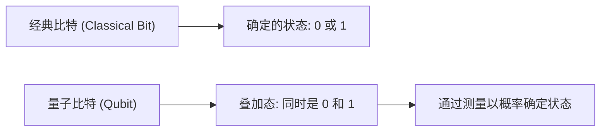
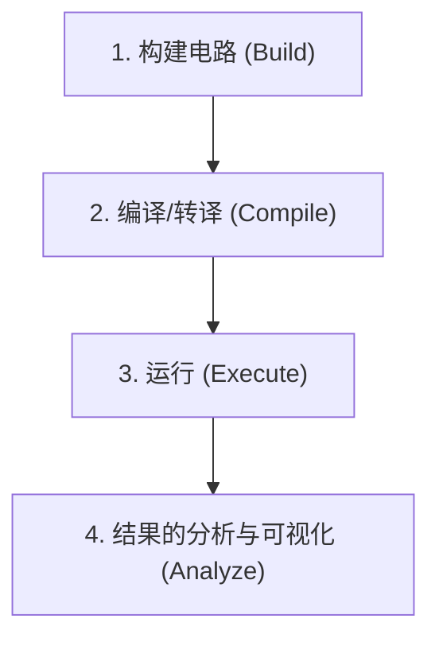
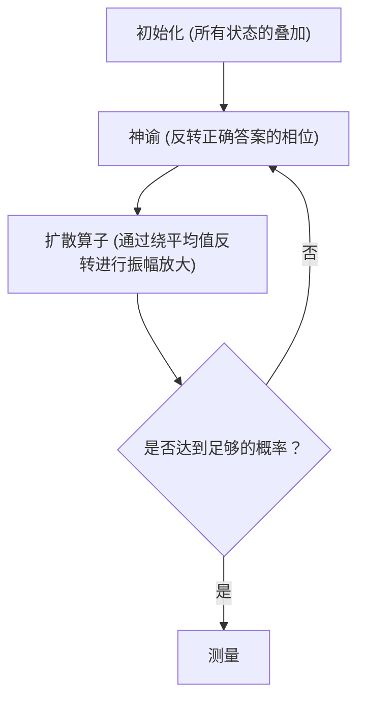

## 1. 简介

现代计算机（经典计算机）极大地改变了我们的生活，以其强大的计算能力支撑着社会的方方面面。然而，在某些特定的问题上（例如，巨大数字的质因数分解、复杂分子结构的模拟、优化问题等），即使是当今最先进的超级计算机，已知也需要比宇宙年龄还要长的时间。

有望打破这种“经典计算机极限”的正是**量子计算机（Quantum Computer）**。人们认为，通过将量子力学的奇妙特性（叠加态和量子纠缠）作为计算资源来利用，可以极大地加速特定问题的解决。

在本文中，我们将使用IBM提供的开源量子计算框架**Qiskit**，迈出进入量子编程世界的第一步。这是一份非常详细的入门指南，涵盖了从仔细讲解物理和数学基础，到实际使用Python编写代码，并在模拟器上运行量子电路的全过程。

---

## 2. 支撑量子计算的物理和数学基础

为了理解量子编程，首先需要理解量子力学的基本概念。在这里，我们将解说量子比特、叠加态、量子纠缠这三个重要的支柱。

### 2.1 经典比特与量子比特（Qubit）

经典计算机的信息单位是“比特（Bit）”。比特总是处于 `0` 或 `1` 两种状态之一。

另一方面，量子计算机的信息最小单位被称为**量子比特（Qubit: Quantum bit）**。量子比特不仅可以处于 `0` 和 `1` 的状态，而且还可以**同时保持这两种状态**。

在数学上，量子比特的状态 $|\psi\rangle$ 表示为基态 $|0\rangle$ 和 $|1\rangle$ 的线性组合（叠加）：

$$
|\psi\rangle = \alpha|0\rangle + \beta|1\rangle
$$

这里，$\alpha$ 和 $\beta$ 是复数，分别表示观测到状态 $|0\rangle$ 和 $|1\rangle$ 的概率幅。根据量子力学的基本原理，概率的总和必须为1，因此满足以下归一化条件：

$$
|\alpha|^2 + |\beta|^2 = 1
$$

也就是说，当我们“测量（观测）”这个量子比特时，得到 $|0\rangle$ 的概率为 $|\alpha|^2$，得到 $|1\rangle$ 的概率为 $|\beta|^2$。在测量之前，状态只能以概率的方式确定，这是它与经典比特决定性的不同之处。



### 2.2 叠加态（Superposition）

如前所述，$|0\rangle$ 和 $|1\rangle$ 的状态混合在一起的状态被称为**叠加态（Superposition）**。

例如，如果1个量子比特处于完全均匀的叠加态中，则 $\alpha = \frac{1}{\sqrt{2}}$，$\beta = \frac{1}{\sqrt{2}}$。

$$
|\psi\rangle = \frac{1}{\sqrt{2}}|0\rangle + \frac{1}{\sqrt{2}}|1\rangle
$$

当测量这个状态时，将各有50%的概率观测到 $|0\rangle$ 和 $|1\rangle$。
如果有2个量子比特，就可以产生 $|00\rangle, |01\rangle, |10\rangle, |11\rangle$ 4种状态的叠加。如果有 $n$ 个量子比特，就可以同时表示 $2^n$ 种状态，这也是量子计算机并行处理能力的一个源泉。

### 2.3 量子纠缠（Entanglement）

在量子计算中，最强大且最神奇的特性是**量子纠缠（Entanglement）**。爱因斯坦将其称为“幽灵般的超距作用”，这种现象是指两个或多个量子比特之间产生强烈的联系，一旦其中一个量子比特的状态被确定，无论物理距离有多远，另一个量子比特的状态也会瞬间确定。

最著名的量子纠缠态之一“贝尔态（Bell State）”的 $\Phi^+$ 态表示如下：

$$
|\Phi^+\rangle = \frac{|00\rangle + |11\rangle}{\sqrt{2}}
$$

在这种状态下，不存在 $|01\rangle$ 或 $|10\rangle$ 这样的状态。因此，如果测量第一个量子比特得到 $|0\rangle$，那么无需测量第二个量子比特，它也必定是 $|0\rangle$。相反，如果第一个是 $|1\rangle$，第二个也必定是 $|1\rangle$。

---

## 3. 量子逻辑门（Quantum Logic Gates）

就像经典计算机使用AND、OR、NOT等逻辑门进行计算一样，量子计算机也使用**量子门**来操作量子比特的状态。由于量子态是一个向量，因此量子门表现为作用于该向量的“幺正矩阵”。

### 3.1 泡利门（Pauli-X, Y, Z）

泡利门是对单个量子比特的基本操作。

**・Pauli-X 门 (NOT门)**
相当于经典的NOT门。将 $|0\rangle$ 翻转为 $|1\rangle$，将 $|1\rangle$ 翻转为 $|0\rangle$。（在布洛赫球中绕X轴旋转180度）

$$
X = \begin{pmatrix} 0 & 1 \\ 1 & 0 \end{pmatrix}
$$

**・Pauli-Y 门**
绕Y轴进行180度旋转。具有同时翻转相位和比特的效果。

$$
Y = \begin{pmatrix} 0 & -i \\ i & 0 \end{pmatrix}
$$

**・Pauli-Z 门 (相位翻转门)**
保持 $|0\rangle$ 的状态不变，将 $|1\rangle$ 状态的相位翻转（乘以 $-1$）。（在布洛赫球中绕Z轴旋转180度）

$$
Z = \begin{pmatrix} 1 & 0 \\ 0 & -1 \end{pmatrix}
$$

### 3.2 哈达玛门（Hadamard Gate）

哈达玛门（H门）是一个非常重要的门，它将确定的状态（$|0\rangle$ 或 $|1\rangle$）转换为叠加态。

$$
H = \frac{1}{\sqrt{2}}
\begin{pmatrix}
1 & 1 \\
1 & -1
\end{pmatrix}
$$

将H门应用于 $|0\rangle$，会得到均匀的叠加态 $|+\rangle$。

$$
H|0\rangle = \frac{1}{\sqrt{2}}|0\rangle + \frac{1}{\sqrt{2}}|1\rangle = |+\rangle
$$

### 3.3 相位门（Phase Gates）

相位门是Z门的推广，将 $|1\rangle$ 状态的相位旋转指定的角度 $\theta$。

$$
P(\theta) = \begin{pmatrix} 1 & 0 \\ 0 & e^{i\theta} \end{pmatrix}
$$

具有代表性的相位门包括S门（$\theta = \pi/2$）和 T门（$\theta = \pi/4$）。

### 3.4 CNOT门（Controlled-NOT Gate）

CNOT门（CX门）是在两个量子比特之间进行操作的门，对于生成量子纠缠是不可或缺的。它由“控制（Control）比特”和“目标（Target）比特”组成。

仅当控制比特为 $|1\rangle$ 时，才对目标比特应用X门（NOT操作）；如果控制比特为 $|0\rangle$，则不进行任何操作。

$$
CNOT = \begin{pmatrix}
1 & 0 & 0 & 0 \\
0 & 1 & 0 & 0 \\
0 & 0 & 0 & 1 \\
0 & 0 & 1 & 0
\end{pmatrix}
$$

---

## 4. Qiskit基础与环境搭建

从这里开始，我们将实际使用Python和Qiskit来编写量子程序。

### 4.1 什么是Qiskit？

**Qiskit** 是IBM Quantum开发的开源量子计算软件开发工具包（SDK）。通过使用Python直观地构建量子电路，可以在本地模拟器上运行，也可以通过云端在IBM真实的量子计算机硬件上运行。

### 4.2 安装方法

为了使用Qiskit，需要Python环境。使用以下命令安装Qiskit及相关包（模拟器和绘图库）。

```bash
pip install qiskit qiskit-aer qiskit-ibm-runtime matplotlib pylatexenc
```

### 4.3 编程的基本流程

使用Qiskit进行量子编程主要按照以下步骤进行：



1. **构建电路**: 创建 `QuantumCircuit` 对象，并添加门。
2. **编译**: 针对要运行的后端（真机或模拟器）优化电路。
3. **运行**: 向后端发送作业，并获取结果。
4. **分析**: 绘制测量结果的直方图等。

---

## 5. 实践：构建生成贝尔态（量子纠缠）的电路

让我们在Qiskit中实际创建理论中学习过的“量子纠缠（贝尔态）”。目标状态是 $|\Phi^+\rangle = \frac{|00\rangle + |11\rangle}{\sqrt{2}}$。

### 5.1 电路设计

为了产生贝尔态，需要遵循以下步骤：
1. 准备2个量子比特（初始状态均为 $|0\rangle$）。
2. 对第1个量子比特应用哈达玛门（H），使其变为叠加态。
3. 将第1个量子比特作为“控制比特”，第2个量子比特作为“目标比特”，应用CNOT门。
4. 进行测量（Measure）以读取结果。

### 5.2 Python/Qiskit 代码实现

那么，让我们来看看实际的代码。

```python
import numpy as np
from qiskit import QuantumCircuit, transpile
from qiskit_aer import Aer
from qiskit.visualization import plot_histogram
import matplotlib.pyplot as plt

# 1. 电路初始化
# 创建一个具有2个量子比特和2个经典比特的量子电路
qc = QuantumCircuit(2, 2)

# 2. 应用H门
# 对量子比特 0 (q0) 应用哈达玛门
qc.h(0)

# 3. 应用CNOT门
# 将 q0 作为控制比特，q1 作为目标比特，应用 CNOT
qc.cx(0, 1)

# 4. 测量
# 测量量子比特 0 和 1，并分别写入经典比特 0 和 1
qc.measure([0, 1], [0, 1])

# 绘制电路图 (使用 matplotlib)
# qc.draw('mpl')
print(qc.draw())
```

当执行这段代码时，控制台上将以ASCII艺术形式显示以下量子电路图。

```text
     ┌───┐     ┌─┐   
q_0: ┤ H ├──■──┤M├───
     └───┘┌─┴─┐└╥┘┌─┐
q_1: ─────┤ X ├─╫─┤M├
          └───┘ ║ └╥┘
c: 2/═══════════╩══╩═
                0  1 
```
`H` 代表哈达玛门，`■` 和 `X` 的组合代表CNOT门，`M` 代表测量。

### 5.3 在模拟器上运行并解释结果

接下来，我们将在IBM的高性能模拟器 `Aer` 上运行此电路，并查看结果。

```python
# 获取 Aer 模拟器的后端
simulator = Aer.get_backend('qasm_simulator')

# 针对模拟器转译（优化）电路
compiled_circuit = transpile(qc, simulator)

# 运行电路（这里执行了 1000 次 shot）
job = simulator.run(compiled_circuit, shots=1000)

# 获取结果
result = job.result()

# 获取状态的观测次数（计数）
counts = result.get_counts(compiled_circuit)
print("\n测量结果:", counts)

# 绘制直方图
# plot_histogram(counts)
# plt.show()
```

**结果解释**

控制台的输出应如下所示。
`测量结果: {'00': 495, '11': 505}`
（※由于概率具有随机性，每次执行的具体数值会略有变动）

在理想的模拟环境中，测量结果中 `00` 和 `11` 各有大约50%的观测概率，而完全不会观测到 `01` 或 `10`。
这与我们构建的贝尔态 $|\Phi^+\rangle = \frac{|00\rangle + |11\rangle}{\sqrt{2}}$ 的理论预测完全一致。精确地模拟了“如果第一个量子比特是0，那么第二个也必然是0；如果是1，第二个也必然是1”的“量子纠缠”。

需要注意的是，如果在真实的量子计算机（IBM Quantum Hardware）上运行，由于噪声（量子退相干和门误差）的影响，有时可能会观测到极少量的 `01` 或 `10`。如何减少这种噪声（量子纠错）是当前量子计算机研发中最大的课题之一。

---

## 6. 扩展至更高级的算法

构建贝尔态可以说是量子编程的“Hello World”。以此为基础进一步发展，可以构建出超越经典计算机的强大算法。

### 6.1 多伊奇-乔萨算法（Deutsch-Jozsa Algorithm）

该算法用于判断给定函数 $f(x)$ 到底是“常数函数”（无论输入什么，总是输出0或总是输出1）还是“平衡函数”（对一半的输入输出0，另一半输出1）的问题。
在最坏的情况下，经典计算机需要评估 $2^{n-1} + 1$ 次函数，而使用多伊奇-乔萨算法，利用量子并行性，**仅需评估1次**即可做出判断。这展示了量子算法的基本模式：输入叠加态，利用干涉（Interference）抵消不需要的状态，并放大想要的答案。

### 6.2 Grover 算法（Grover's Algorithm）

在从 $N$ 个未排序的数据库中寻找特定数据的搜索问题中，经典算法平均需要 $N/2$ 次计算，而Grover算法只需 $\sqrt{N}$ 次即可找到目标数据。
该算法使用称为“神谕（Oracle）”的黑盒来反转目标解的相位，然后进行“振幅放大（Amplitude Amplification）”，从而极大地提高观测到目标解的概率。



---

## 7. 总结与后续学习

本文详细解说了量子计算的根本概念，从叠加态和量子纠缠开始，介绍了使用Qiskit操作量子逻辑门，以及实际构建、模拟贝尔态并解释其结果。

由于Qiskit可以使用平易近人的Python语言编写，它是一个强大的工具，能帮助我们跨越数学和物理的障碍，专注于算法的构建。虽然量子计算机目前处于带噪中等规模量子（NISQ: Noisy Intermediate-Scale Quantum）时代，但在量子机器学习（Quantum Machine Learning）、量子化学模拟（Quantum Chemistry）、密码破解等众多领域的应用研究正在世界各地迅速推进。

请务必借此机会使用Qiskit自己动手制作各种量子电路，并在IBM Quantum的真实处理器上运行一下。你一定能亲手体验到未来的计算范式。

### 参考资料
- [Qiskit官方文档](https://qiskit.org/documentation/)
- [Qiskit Textbook](https://qiskit.org/textbook/ja/preface.html) - 推荐给想深入学习数学背景和算法的人的官方教材
- IBM Quantum Learning

欢迎来到量子世界！
