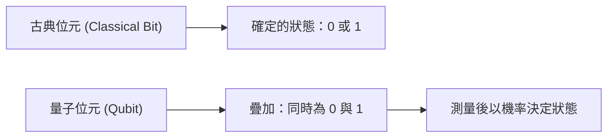
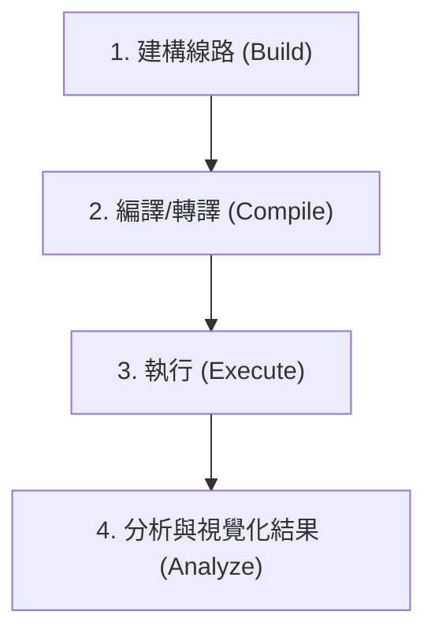
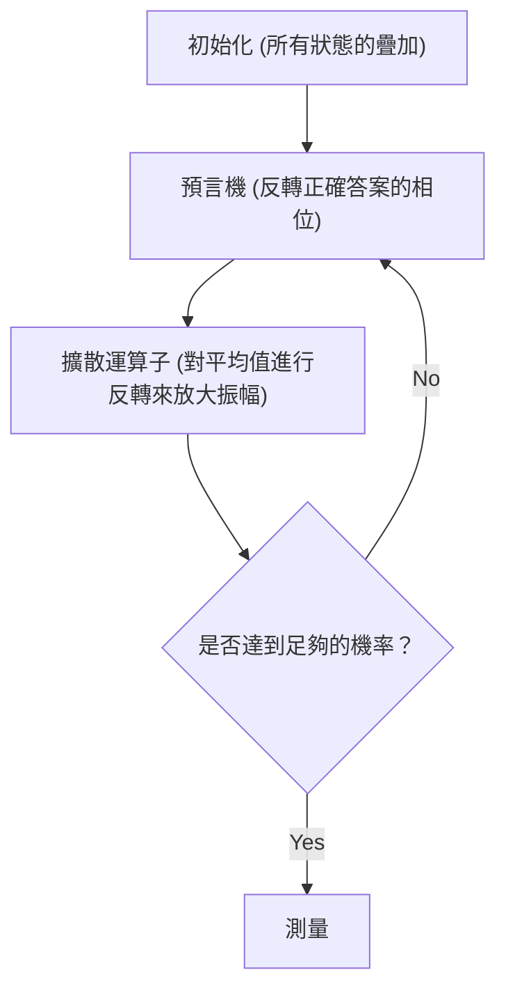

## 1. 簡介

現代的電腦（古典電腦）戲劇性地改變了我們的生活，並以高度的運算能力支撐著社會的各個層面。然而，對於某些特定的問題（例如：巨大數字的質因數分解、複雜分子結構的模擬、最佳化問題等），已知即使是目前最先進的超級電腦，也需要比宇宙年齡更長的時間才能解決。

有望突破這種「古典電腦的極限」的就是**量子電腦（Quantum Computer）**。藉由將量子力學的奇妙特性（疊加與量子糾纏）作為運算資源來運用，被認為能夠將特定問題的處理速度戲劇性地加快。

在本文中，我們將使用 IBM 開源提供的量子運算框架 **Qiskit**，邁出進入量子程式設計世界的第一步。這是一份非常詳細的入門指南，從物理與數學的基礎開始仔細解說，涵蓋了實際使用 Python 撰寫程式碼，直到在模擬器上運行量子線路的整個過程。

---

## 2. 支撐量子運算的物理與數學基礎

為了理解量子程式設計，首先必須了解量子力學的基本概念。在此，我們將解說量子位元、疊加與量子糾纏這三個重要的支柱。

### 2.1 古典位元與量子位元（Qubit）

古典電腦的資訊單位是「位元（Bit）」。位元總是處於 `0` 或 `1` 其中一種狀態。

另一方面，量子電腦資訊的最小單位被稱為**量子位元（Qubit: Quantum bit）**。量子位元不僅能處於 `0` 和 `1` 的狀態，還能**同時保持這兩種狀態**。

在數學上，量子位元的狀態 $|\psi\rangle$ 表示為基底狀態 $|0\rangle$ 和 $|1\rangle$ 的線性組合（疊加）。

$$
|\psi\rangle = \alpha|0\rangle + \beta|1\rangle
$$

這裡的 $\alpha$ 和 $\beta$ 是複數，分別代表觀測到狀態 $|0\rangle$ 和 $|1\rangle$ 的機率幅。根據量子力學的基本原理，機率的總和必須為 1，因此滿足以下歸一化條件：

$$
|\alpha|^2 + |\beta|^2 = 1
$$

也就是說，當對這個量子位元進行「測量（觀測）」時，得到 $|0\rangle$ 的機率為 $|\alpha|^2$，得到 $|1\rangle$ 的機率為 $|\beta|^2$。在測量前，狀態只能以機率來決定，這是與古典位元決定性的不同之處。



### 2.2 疊加（Superposition）

如前所述，$|0\rangle$ 和 $|1\rangle$ 的狀態混合在一起的狀態稱為**疊加（Superposition）**。

例如，當一個量子位元處於完全均等的疊加狀態時，$\alpha = \frac{1}{\sqrt{2}}$，$\beta = \frac{1}{\sqrt{2}}$。

$$
|\psi\rangle = \frac{1}{\sqrt{2}}|0\rangle + \frac{1}{\sqrt{2}}|1\rangle
$$

測量這個狀態時，會分別以 50% 的機率觀測到 $|0\rangle$ 和 $|1\rangle$。
如果有 2 個量子位元，就可以製造出 $|00\rangle, |01\rangle, |10\rangle, |11\rangle$ 這 4 種狀態的疊加。如果有 $n$ 個量子位元，就能同時表示 $2^n$ 個狀態，這正是量子電腦平行處理能力的一個泉源。

### 2.3 量子糾纏（Entanglement）

量子運算中最強大且奇妙的特性就是**量子糾纏（Entanglement）**。愛因斯坦稱這個現象為「鬼魅般的超距作用」，其性質是兩個以上的量子位元彼此強烈連結，當其中一個量子位元的狀態被決定時，無論物理距離有多遠，另一個量子位元的狀態也會瞬間被決定。

最著名的量子糾纏態「貝爾態（Bell State）」之一，$\Phi^+$ 狀態表示如下：

$$
|\Phi^+\rangle = \frac{|00\rangle + |11\rangle}{\sqrt{2}}
$$

在這個狀態下，不存在 $|01\rangle$ 或 $|10\rangle$ 的狀態。因此，如果測量第一個量子位元得到 $|0\rangle$，不用測量第二個量子位元，也能確定它必定是 $|0\rangle$。反之，如果第一個是 $|1\rangle$，第二個也必定是 $|1\rangle$。

---

## 3. 量子邏輯閘（Quantum Logic Gates）

就像古典電腦使用 AND、OR、NOT 等邏輯閘進行運算一樣，量子電腦也使用**量子閘**來操作量子位元的狀態。由於量子狀態是向量，因此量子閘表示為作用於該向量的「酉矩陣（Unitary matrix）」。

### 3.1 包立閘（Pauli-X, Y, Z）

包立閘是對 1 個量子位元的基本操作。

**・Pauli-X 閘 (NOT閘)**
相當於古典的 NOT 閘。將 $|0\rangle$ 反轉為 $|1\rangle$，將 $|1\rangle$ 反轉為 $|0\rangle$。（在布洛赫球面上繞 X 軸旋轉 180 度）

$$
X = \begin{pmatrix} 0 & 1 \\ 1 & 0 \end{pmatrix}
$$

**・Pauli-Y 閘**
繞 Y 軸旋轉 180 度。具有同時反轉相位與位元的效果。

$$
Y = \begin{pmatrix} 0 & -i \\ i & 0 \end{pmatrix}
$$

**・Pauli-Z 閘 (相位反轉閘)**
保持 $|0\rangle$ 的狀態不變，將 $|1\rangle$ 狀態的相位反轉（乘以 $-1$）。（繞 Z 軸旋轉 180 度）

$$
Z = \begin{pmatrix} 1 & 0 \\ 0 & -1 \end{pmatrix}
$$

### 3.2 Hadamard 閘（Hadamard Gate）

Hadamard 閘（H 閘）是將確定的狀態（$|0\rangle$ 或 $|1\rangle$）轉換為疊加狀態的非常重要的邏輯閘。

$$
H = \frac{1}{\sqrt{2}}
\begin{pmatrix}
1 & 1 \\
1 & -1
\end{pmatrix}
$$

對 $|0\rangle$ 應用 H 閘，會得到均等的疊加狀態 $|+\rangle$。

$$
H|0\rangle = \frac{1}{\sqrt{2}}|0\rangle + \frac{1}{\sqrt{2}}|1\rangle = |+\rangle
$$

### 3.3 相位閘（Phase Gates）

相位閘是 Z 閘的推廣，將 $|1\rangle$ 狀態的相位旋轉指定的角度 $\theta$。

$$
P(\theta) = \begin{pmatrix} 1 & 0 \\ 0 & e^{i\theta} \end{pmatrix}
$$

代表性的有 S 閘（$\theta = \pi/2$）與 T 閘（$\theta = \pi/4$）。

### 3.4 CNOT 閘（Controlled-NOT Gate）

CNOT 閘（CX 閘）是在兩個量子位元之間進行操作的邏輯閘，是生成量子糾纏所不可或缺的。由「控制（Control）位元」與「目標（Target）位元」組成。

只有當控制位元為 $|1\rangle$ 時，才會對目標位元應用 X 閘（NOT 操作）；當控制位元為 $|0\rangle$ 時則不作任何動作。

$$
CNOT = \begin{pmatrix}
1 & 0 & 0 & 0 \\
0 & 1 & 0 & 0 \\
0 & 0 & 0 & 1 \\
0 & 0 & 1 & 0
\end{pmatrix}
$$

---

## 4. Qiskit 的基礎與環境建置

接下來，我們將實際使用 Python 和 Qiskit 來撰寫量子程式。

### 4.1 什麼是 Qiskit？

**Qiskit** 是由 IBM Quantum 開發的開源量子運算軟體開發套件（SDK）。使用 Python 就能直覺地建構量子線路，並在本地的模擬器，或透過雲端在實際的 IBM 量子電腦硬體上執行。

### 4.2 安裝方法

要使用 Qiskit，需要有 Python 環境。請使用以下指令安裝 Qiskit 與相關套件（模擬器與繪圖用的函式庫）。

```bash
pip install qiskit qiskit-aer qiskit-ibm-runtime matplotlib pylatexenc
```

### 4.3 程式設計的基本流程

使用 Qiskit 的量子程式設計，主要依循以下步驟進行：



1. **建構線路**: 建立 `QuantumCircuit` 物件，並加入邏輯閘。
2. **編譯**: 配合要執行的後端（實機或模擬器）對線路進行最佳化。
3. **執行**: 將任務發送至後端，並取得結果。
4. **分析**: 繪製測量結果的直方圖等。

---

## 5. 實踐：建構產生貝爾態（量子糾纏）的線路

讓我們實際用 Qiskit 來建立理論中學過的「量子糾纏（貝爾態）」。目標狀態是 $|\Phi^+\rangle = \frac{|00\rangle + |11\rangle}{\sqrt{2}}$。

### 5.1 線路設計

要製造貝爾態，需遵循以下步驟：
1. 準備 2 個量子位元（初始狀態皆為 $|0\rangle$）。
2. 對第 1 個量子位元應用 Hadamard 閘（H），使其進入疊加狀態。
3. 將第 1 個量子位元作為「控制位元」，第 2 個量子位元作為「目標位元」，應用 CNOT 閘。
4. 為了讀取結果，進行測量（Measure）。

### 5.2 Python/Qiskit 程式碼實作

那麼，我們來看看實際的程式碼。

```python
import numpy as np
from qiskit import QuantumCircuit, transpile
from qiskit_aer import Aer
from qiskit.visualization import plot_histogram
import matplotlib.pyplot as plt

# 1. 初始化線路
# 建立擁有 2 個量子位元與 2 個古典位元的量子線路
qc = QuantumCircuit(2, 2)

# 2. 應用 H 閘
# 對量子位元 0 (q0) 應用 Hadamard 閘
qc.h(0)

# 3. 應用 CNOT 閘
# 將 q0 作為控制位元、q1 作為目標位元，應用 CNOT
qc.cx(0, 1)

# 4. 測量
# 測量量子位元 0 與 1，並分別寫入古典位元 0 與 1
qc.measure([0, 1], [0, 1])

# 繪製線路圖（使用 matplotlib）
# qc.draw('mpl')
print(qc.draw())
```

執行這段程式碼後，主控台上會顯示如下由 ASCII 藝術構成的量子線路圖。

```text
     ┌───┐     ┌─┐   
q_0: ┤ H ├──■──┤M├───
     └───┘┌─┴─┐└╥┘┌─┐
q_1: ─────┤ X ├─╫─┤M├
          └───┘ ║ └╥┘
c: 2/═══════════╩══╩═
                0  1 
```
`H` 代表 Hadamard 閘，`■` 和 `X` 的組合代表 CNOT 閘，`M` 則代表測量。

### 5.3 在模擬器上執行與解釋結果

接下來，我們將這個線路放在 IBM 的高效能模擬器 `Aer` 上執行，並確認結果。

```python
# 取得 Aer 模擬器的後端
simulator = Aer.get_backend('qasm_simulator')

# 為模擬器進行線路轉譯（最佳化）
compiled_circuit = transpile(qc, simulator)

# 執行線路（這裡執行 1000 次 shots）
job = simulator.run(compiled_circuit, shots=1000)

# 取得結果
result = job.result()

# 取得狀態的觀測次數（計數）
counts = result.get_counts(compiled_circuit)
print("\n測量結果:", counts)

# 繪製直方圖
# plot_histogram(counts)
# plt.show()
```

**解釋結果**

主控台的輸出應該會如下所示。
`測量結果: {'00': 495, '11': 505}`
（※由於機率是隨機的，每次執行的數值會有些微變動）

在理想的模擬環境中，測量結果觀測到 `00` 和 `11` 的比例大約各佔 50%，且完全不會觀測到 `01` 或 `10`。
這恰好與我們建立的貝爾態 $|\Phi^+\rangle = \frac{|00\rangle + |11\rangle}{\sqrt{2}}$ 的理論預測完全一致。第一個量子位元如果是 0，第二個也必定是 0；如果是 1，則必定是 1。這種「量子糾纏」已被準確地模擬出來了。

此外，如果在實際的量子電腦硬體（IBM Quantum Hardware）上執行，受到雜訊（量子去相干或邏輯閘錯誤）的影響，可能偶爾會觀測到 `01` 或 `10`。如何減少這種雜訊（量子錯誤更正），是目前量子電腦開發中最大的課題之一。

---

## 6. 擴展至更高階的演算法

建立貝爾態可以說是量子程式設計的「Hello World」。從這裡進一步發展，就能建構出超越古典電腦的強大演算法。

### 6.1 Deutsch-Jozsa 演算法（Deutsch-Jozsa Algorithm）

這是判定給定的函數 $f(x)$ 是「常數函數（無論輸入為何，總是輸出 0 或總是輸出 1）」還是「平衡函數（對一半的輸入輸出 0，另一半輸出 1）」的問題。
在古典電腦上，最壞的情況下需要對函數進行 $2^{n-1} + 1$ 次評估；但若使用 Deutsch-Jozsa 演算法，利用量子的平行性，**僅需 1 次評估**即可判定。這展示了輸入疊加狀態，並利用干涉（Interference）抵消不需要的狀態，放大所需答案的量子演算法基本模式。

### 6.2 Grover 演算法（Grover's Algorithm）

在未排序的 $N$ 個資料庫中找出特定資料的搜尋問題中，古典演算法平均需要進行 $N/2$ 次運算，而 Grover 演算法僅需 $\sqrt{N}$ 次即可找出目標資料。
該演算法使用稱為「預言機（Oracle）」的黑盒子將目標解的相位反轉，接著再進行「振幅放大（Amplitude Amplification）」，從而大幅提高觀測到目標解的機率。



---

## 7. 總結與未來的學習

在本文中，我們從量子運算的根本概念（如疊加與量子糾纏）開始，詳細解說了使用 Qiskit 操作量子邏輯閘，並實際建構、模擬貝爾態以及解釋結果。

Qiskit 可以使用 Python 這種容易親近的語言來撰寫，這是一項能幫助我們跨越數學與物理的障礙，專注於建構演算法的強大工具。目前量子電腦正處於帶雜訊的中等規模量子裝置（NISQ: Noisy Intermediate-Scale Quantum）時代，但在量子機器學習（Quantum Machine Learning）、量子化學模擬（Quantum Chemistry）、密碼破解等眾多領域的應用研究，正於世界各地飛速進展。

請務必把握這個機會，使用 Qiskit 自製各種量子線路，並在實際的 IBM Quantum 處理器上運行看看。你一定能親手體驗到未來的運算典範。

### 參考資料
- [Qiskit 官方文件](https://qiskit.org/documentation/)
- [Qiskit Textbook](https://qiskit.org/textbook/ja/preface.html) - 推薦給想更深入學習數學背景與演算法的官方教材
- IBM Quantum Learning

歡迎來到量子的世界！
