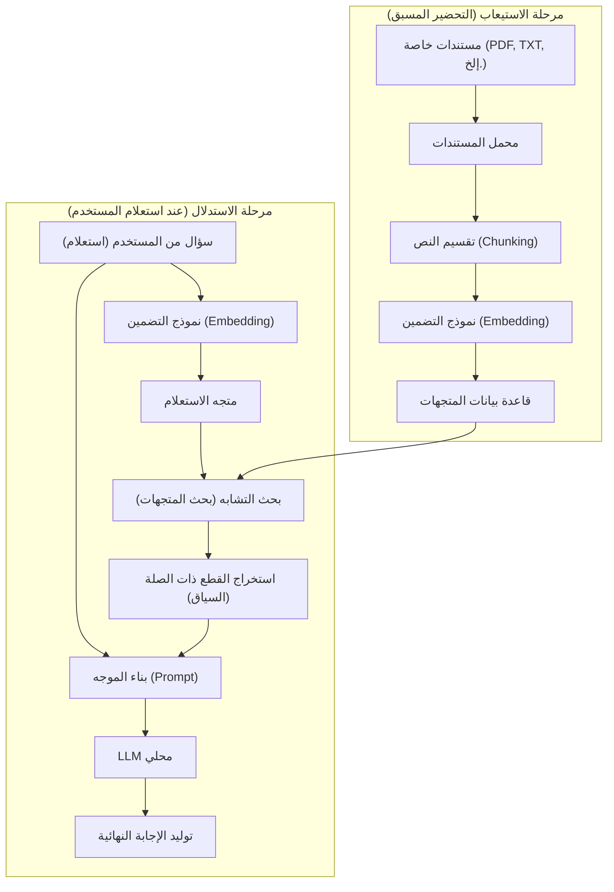
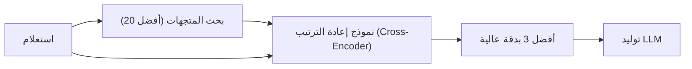

# مقدمة

في السنوات الأخيرة، كان التطور في نماذج اللغة الكبيرة (LLM) ملحوظًا، حيث تغلغل العديد من أنظمة الذكاء الاصطناعي مثل ChatGPT و Claude في حياتنا وأعمالنا. ومع ذلك، هناك نقطة ضعف واضحة في نماذج LLM العامة. وهي أنها لا تعرف سوى "المعلومات العامة المتاحة وقت التدريب". بالطبع، لا يمكنها الإجابة على الأسئلة المتعلقة بـ "المستندات الخاصة" مثل لوائح الشركة، والمذكرات الشخصية، ومواد المشاريع غير المنشورة. إذا حاولت إجبارها على الإجابة، فهناك خطر كبير من أنها ستولد أكاذيب تبدو معقولة ولكنها بعيدة عن الحقيقة (الهلوسة - Hallucination).

لذلك، فإن البنية المعمارية التقنية التي تنتشر حاليًا بشكل هائل في جميع أنحاء العالم هي **RAG (Retrieval-Augmented Generation: التوليد المعزز بالاسترجاع)**. باستخدام RAG، يصبح من الممكن تزويد LLM بالمعرفة الخاصة ديناميكيًا من قاعدة بيانات خارجية، وجعلها تولد إجابات دقيقة وموثوقة بناءً على ذلك.

علاوة على ذلك، عند التعامل مع مجال الشركات أو المعلومات الشخصية السرية، غالبًا ما يكون إرسال البيانات إلى واجهات برمجة التطبيقات (APIs) المستندة إلى السحابة مثل OpenAI غير مسموح به بموجب سياسة الأمان. ما هو مطلوب هنا هو بناء "RAG محلي" مدمج مع **الذكاء الاصطناعي المحلي** (LLM يعمل بالكامل على جهاز الكمبيوتر الخاص بك أو الخادم المحلي - On-Premise).

في هذه المقالة، سنشرح بالتفصيل كل شيء بدءًا من النظريات الأساسية لـ RAG، وطرق التنفيذ المحددة لـ RAG المحلي باستخدام Python، والخلفية الرياضية (آلية البحث عن المتجهات)، إلى التقنيات المتقدمة لتشغيل النظام في بيئة الإنتاج.

---

# 1. البنية المعمارية العامة لـ RAG

RAG ليس نموذج ذكاء اصطناعي واحد، بل هو بنية نظام تتعاون فيها مكونات متعددة. يتكون بشكل رئيسي من مرحلتين: "مرحلة الاستيعاب (إدخال البيانات)" و "مرحلة الاسترجاع والتوليد (البحث والتوليد)".

يوضح مخطط Mermaid التالي الصورة العامة لنظام RAG.



## مرحلة الاستيعاب (التحضير المسبق)
1. **تحميل المستندات**: تحميل البيانات غير المهيكلة مثل ملفات PDF، Word، والملفات النصية.
2. **التقسيم (Chunking)**: تقسيم النصوص الطويلة إلى كتل ذات معنى (Chunks) لتتناسب مع قيود الإدخال في LLM (نافذة السياق) ولتحسين دقة البحث.
3. **التضمين (Embedding / تحويل إلى متجهات)**: إدخال الكتل المقسمة إلى نموذج التضمين (Embedding Model) وتحويلها إلى مصفوفات من الأرقام (متجهات) ذات مئات إلى آلاف الأبعاد.
4. **الحفظ في قاعدة البيانات**: حفظ المتجهات المحولة مرتبطة بالبيانات النصية الأصلية في قاعدة بيانات المتجهات (Vector DB).

## مرحلة الاستدلال (أثناء التشغيل)
1. **تحويل الاستعلام إلى متجهات**: تحويل سؤال المستخدم إلى متجه باستخدام نفس نموذج التضمين المستخدم في التحضير المسبق.
2. **بحث التشابه**: حساب التشابه بين متجه الاستعلام ومتجهات المستندات في قاعدة البيانات، واسترداد أعلى الكتل النصية الأقرب دلاليًا (ذات الصلة العالية).
3. **بناء الموجه (Prompt)**: دمج النصوص المستردة ذات الصلة كـ "سياق (معرفة خلفية)" مع سؤال المستخدم لإنشاء موجه الإدخال لـ LLM.
4. **توليد الإجابة**: يتلقى LLM الموجه الموسع ويولد إجابة بناءً على معلومات السياق المرفقة.

---

# 2. الفهم العميق للبحث في المتجهات والتضمين (Embeddings)

جوهر RAG هو "البحث في المتجهات (البحث الدلالي)". بينما يعتمد بحث الكلمات الرئيسية التقليدي (مثل BM25) على المطابقة التامة للكلمات وتكرارها، يعتمد البحث في المتجهات على "التشابه الدلالي". على سبيل المثال، حتى الكلمات المختلفة مثل "كلب" و "جرو"، أو "حاسوب" و "كمبيوتر"، ستظهر في نتائج البحث إذا كانت معانيها متقاربة.

## ما هو نموذج التضمين (Embedding Model)؟

نموذج التضمين هو شبكة عصبية تأخذ النصوص باللغة الطبيعية كإدخال وتخرج متجهًا كثيفًا ثابت الطول (Dense Vector). النماذج الشائعة (مثل `text-embedding-3-small` أو النماذج مفتوحة المصدر مثل `multilingual-e5-large`) تقوم بتعيين النص إلى متجه حقيقي بأبعاد 384 أو 1024.

في هذا الفضاء متعدد الأبعاد (الفضاء الكامن - Latent Space)، يتم تدريب النموذج بحيث تكون المسافة في فضاء الإحداثيات أقرب كلما كانت الجمل متشابهة في المعنى.

## الخلفية الرياضية لحساب التشابه: تشابه جيب التمام (Cosine Similarity)

عندما تبحث قاعدة بيانات المتجهات عن المستندات ذات الصلة، فإن مقياس المسافة الأكثر استخدامًا هو **تشابه جيب التمام (Cosine Similarity)**. على عكس المسافة الإقليدية (المسافة المطلقة المكانية)، يركز تشابه جيب التمام على "الزاوية بين متجهين". نظرًا لأنه أقل تأثرًا بطول الجملة (معيار المتجه)، فهو مناسب جدًا لحساب تشابه النصوص.

يتم التعبير عن تشابه جيب التمام للمتجهين $\mathbf{A}$ و $\mathbf{B}$ رياضياً كالتالي:

$$ \text{Cosine Similarity}(\mathbf{A}, \mathbf{B}) = \cos(\theta) = \frac{\mathbf{A} \cdot \mathbf{B}}{\|\mathbf{A}\| \|\mathbf{B}\|} = \frac{\sum_{i=1}^{n} A_i B_i}{\sqrt{\sum_{i=1}^{n} A_i^2} \sqrt{\sum_{i=1}^{n} B_i^2}} $$

- $\mathbf{A} \cdot \mathbf{B}$ يمثل الجداء النقطي (Dot Product).
- $\|\mathbf{A}\|$ يمثل معيار L2 (الطول) للمتجه $\mathbf{A}$.
- $n$ هو عدد أبعاد المتجه.

يأخذ تشابه جيب التمام قيمًا من -1 إلى 1.
- **قريب من 1**: اتجاه كلا المتجهين هو نفسه تقريبًا (المعنى متشابه جدًا)
- **قريب من 0**: المتجهان متعامدان (غير مرتبطين)
- **قريب من -1**: المتجهان في اتجاهين متعاكسين (المعنى معاكس)

تستخدم قواعد بيانات المتجهات الحديثة (مثل Chroma، FAISS، Qdrant) خوارزمية بحث أقرب جار تقريبي (ANN) تسمى HNSW (Hierarchical Navigable Small World)، والتي تم تحسينها للبحث عن المستندات ذات تشابه جيب التمام العالي من بين ملايين البيانات المتجهة في أجزاء من الثانية.

---

# 3. حزمة التقنيات لبناء RAG محلي

لبناء RAG محلي بالكامل لا يعتمد على السحابة، سنستفيد من نظام المصادر المفتوحة. نوصي بحزمة التقنيات التالية:

1. **نموذج اللغة (LLM)**
   - الأداة: `Ollama` أو `Llama.cpp`
   - النماذج: نماذج مفتوحة خفيفة وعالية الأداء مثل `Llama-3-8B-Instruct`، `Gemma-2-9B-It`، `Qwen2-7B-Instruct`. للمهام باللغة اليابانية، تعتبر النماذج المضبوطة لليابانية مثل `Llama-3-ELYZA-JP-8B` مناسبة (يمكن استخدام نماذج تدعم اللغة العربية للمهام العربية).
2. **نموذج التضمين (Embedding)**
   - النماذج: `intfloat/multilingual-e5-large` أو `BAAI/bge-m3`. لتشغيله محليًا، من الشائع تنزيله من Hugging Face وتشغيله باستخدام Sentence-Transformers.
3. **قاعدة بيانات المتجهات (Vector DB)**
   - `ChromaDB`: مبني على Python وسهل الإعداد للغاية. مثالي للتطوير المحلي.
   - `FAISS`: مكتبة بحث متجهات سريعة طورتها Meta.
   - `Qdrant` / `Milvus`: مخصص للبيئات الأكبر وبيئات الإنتاج.
4. **إطار عمل التنسيق (Orchestration Framework)**
   - `LangChain`: المعيار الفعلي لربط المكونات (Chain).
   - `LlamaIndex`: إطار عمل للاتصال بالبيانات متخصص بشكل خاص في RAG.

في هذه المرة، سنقوم بالتنفيذ باستخدام المزيج الأسهل في التقديم: **LangChain + ChromaDB + Ollama + HuggingFaceEmbeddings**.

---

# 4. دورة تعليمية للتنفيذ: بناء RAG محلي كامل باستخدام Python

من هنا، سنقوم ببناء RAG محلي من خلال كتابة كود Python فعليًا. مسبقًا، يرجى تثبيت Ollama على جهاز الكمبيوتر الخاص بك وتشغيله في الخلفية. أيضًا، قم بسحب (Pull) النموذج على Ollama (مثال: `ollama run llama3`).

## الخطوة 1: تثبيت المكتبات المطلوبة

```bash
pip install langchain langchain-community langchain-huggingface
pip install chromadb sentence-transformers pypdf
```

## الخطوة 2: الكود البرمجي الكامل للتنفيذ

فيما يلي برنامج نصي كامل بلغة Python لقراءة ملف PDF، وتحويله إلى متجهات، وجعل نموذج LLM المحلي يجيب على الأسئلة.

```python
import os
from langchain_community.document_loaders import PyPDFLoader
from langchain_text_splitters import RecursiveCharacterTextSplitter
from langchain_huggingface import HuggingFaceEmbeddings
from langchain_community.vectorstores import Chroma
from langchain_community.llms import Ollama
from langchain_core.prompts import PromptTemplate
from langchain.chains import RetrievalQA

def main():
    # 1. تحميل المستندات
    print("جاري تحميل المستندات...")
    # حدد مسار ملف PDF الذي تريد قراءته
    file_path = "sample_company_policy.pdf" 
    loader = PyPDFLoader(file_path)
    documents = loader.load()

    # 2. تقسيم النص (Text Splitting)
    # التقسيم إلى أحجام مناسبة دون تدمير معنى الجمل
    text_splitter = RecursiveCharacterTextSplitter(
        chunk_size=500,     # أقصى عدد من الأحرف لكل كتلة
        chunk_overlap=50,   # عدد الأحرف المتداخلة بين الكتل (لمنع انقطاع السياق)
        separators=["\n\n", "\n", "。", "、", " ", ""]
    )
    chunks = text_splitter.split_documents(documents)
    print(f"تم التقسيم إلى {len(chunks)} كتلة.")

    # 3. تهيئة نموذج التضمين (Local HuggingFace Model)
    # استخدام نموذج متعدد اللغات
    print("جاري تحميل نموذج التضمين...")
    embeddings = HuggingFaceEmbeddings(
        model_name="intfloat/multilingual-e5-large",
        model_kwargs={'device': 'cpu'} # 'cuda' أو 'mps' إذا كان لديك وحدة معالجة رسومات (GPU)
    )

    # 4. بناء قاعدة بيانات المتجهات (Chroma)
    print("جاري بناء قاعدة بيانات المتجهات...")
    persist_directory = "./chroma_db"
    vectorstore = Chroma.from_documents(
        documents=chunks,
        embedding=embeddings,
        persist_directory=persist_directory
    )
    # إنشاء المسترد (Retriever). إعداد لجلب أفضل 3 مستندات ذات صلة
    retriever = vectorstore.as_retriever(search_kwargs={"k": 3})

    # 5. تهيئة LLM المحلي (Ollama)
    print("جاري الاتصال بـ LLM المحلي...")
    # تأكد من الحصول على النموذج مسبقًا باستخدام شيء مثل 'ollama pull llama3'
    llm = Ollama(model="llama3")

    # 6. تعريف قالب الموجه (Prompt Template)
    prompt_template = """أنت مساعد ممتاز على دراية بلوائح الشركة والمعلومات الداخلية.
يرجى الإجابة على سؤال المستخدم بالتفصيل باستخدام السياق (معلومات الخلفية) التالي فقط.
إذا لم تتمكن من العثور على الإجابة في السياق، فلا تخمن من نفسك وأجب بصدق "لا يمكن المعرفة من المعلومات المقدمة".

【السياق】
{context}

【السؤال】
{question}

【الإجابة】:
"""
    PROMPT = PromptTemplate(
        template=prompt_template, 
        input_variables=["context", "question"]
    )

    # 7. بناء سلسلة RAG
    qa_chain = RetrievalQA.from_chain_type(
        llm=llm,
        chain_type="stuff",
        retriever=retriever,
        return_source_documents=True, # إعداد لإرجاع مصدر المعلومات
        chain_type_kwargs={"prompt": PROMPT}
    )

    # 8. تنفيذ السؤال
    query = "يرجى إخباري عن شروط دفع نفقات النقل المتعلقة بالعمل عن بعد."
    print(f"\nالسؤال: {query}\n")
    
    result = qa_chain.invoke({"query": query})
    
    print("【الإجابة】")
    print(result['result'])
    print("\n---")
    print("【مصادر المعلومات المرجعية】")
    for doc in result['source_documents']:
        print(f"- صفحة {doc.metadata.get('page', 'غير معروف')}: {doc.page_content[:50]}...")

if __name__ == "__main__":
    main()
```

## شرح نقاط الكود

1. **RecursiveCharacterTextSplitter**:
   وهو المقسم الموصى به بشدة عند تقسيم اللغة الطبيعية. يحاول التقسيم بترتيب الفقرات (`\n\n`)، الأسطر (`\n`)، وعلامات الترقيم (`。`)، بحيث يتناسب مع `chunk_size` المحدد مع الحفاظ على وحدة المعنى قدر الإمكان. عن طريق تعيين `chunk_overlap`، فإنه يمنع فقدان المعلومات بسبب انقطاع الحدود السياقية.
2. **HuggingFaceEmbeddings**:
   `intfloat/multilingual-e5-large` هو نموذج تضمين مفتوح المصدر قوي جدًا يدعم لغات متعددة. يتيح لك تحويل النصوص إلى متجهات على الذاكرة المحلية دون اتصال بالإنترنت، دون استخدام واجهات برمجة التطبيقات السحابية (مثل `text-embedding-ada-002` الخاص بـ OpenAI).
3. **ChromaDB**:
   نظرًا لأنه يعمل في الذاكرة (In-memory) أو في التخزين المحلي (مبني على SQLite)، فلا حاجة لإعداد خادم قاعدة بيانات معقد. بتحديد `persist_directory`، يمكنك تخطي عملية التحويل إلى متجهات عند إعادة التشغيل وقراءة قاعدة البيانات من القرص.

---

# 5. تقنيات RAG المتقدمة (Advanced RAG Techniques)

النظام الأساسي (Naive RAG) الذي بنيناه في الدورة التعليمية أعلاه يعمل، ولكن إذا كانت هناك حاجة إلى دقة إجابة عالية في بيئة الإنتاج، فمن الضروري تقديم تقنيات متقدمة مثل ما يلي.

## 5.1 البحث الهجين (Hybrid Search)
البحث في المتجهات ممتاز في التقاط "المعنى"، ولكنه قد يعاني مع عمليات البحث الدقيقة بالكلمات الرئيسية مثل "أسماء الأعلام الخاصة"، "أرقام طرازات المنتجات"، أو "معرفات الموظفين".
لذلك، من خلال إجراء **البحث الدلالي** عبر بحث المتجهات والبحث بالكلمات الرئيسية باستخدام خوارزميات مثل BM25 بشكل متوازٍ، ثم تسجيل ودمج نتائج كليهما (باستخدام طرق مثل دمج الترتيب المتبادل؛ Reciprocal Rank Fusion; RRF)، يمكن تقليل حالات الإخفاق في البحث بشكل كبير.

## 5.2 إعادة الترتيب (Re-ranking)
البحث في المتجهات سريع، ولكنه لا يقيّم بالضرورة الملاءمة السياقية الدقيقة للسياق. خط أنابيب المعالجة (Pipeline) الشائع لتحسين دقة البحث هو كالتالي:
1. **البحث الأولي (First-stage Retrieval)**: استرجاع حوالي 20 إلى 30 كتلة نصية ذات صلة بشكل واسع وسطحي من قاعدة بيانات المتجهات.
2. **إعادة التقييم (Re-ranking)**: استخدام نموذج تعلم آلي آخر أثقل يُعرف باسم Cross-Encoder (مثل `bge-reranker`)، وإدخال زوج من استعلام المستخدم والكتل المستردة لإعادة حساب درجة الملاءمة الدلالية.
3. **الفرز**: تمرير أفضل 3 إلى 5 كتل ذات أعلى الدرجات كـسياق نهائي إلى موجه LLM.

من خلال هذه الطريقة، يمكن منع تمرير معلومات الضوضاء غير ذات الصلة إلى LLM، مما يزيد بشكل كبير من دقة الإجابة (Precision).



## 5.3 التقسيم الدلالي (Semantic Chunking) والبحث في المستند الأصلي
بدلاً من تقسيم النص ميكانيكيًا بعدد ثابت من الأحرف، توجد طريقة تسمى "التقسيم الدلالي" (Semantic Chunking) تكتشف تغيرات المعنى في الجملة باستخدام الذكاء الاصطناعي لتقسيمها.
أيضًا، في طريقة تُعرف باسم "البحث في المستند الأصل" (Parent Document Retriever)، يتم تحويل النص إلى متجهات بوحدات صغيرة جدًا (مثل الجمل) لأغراض البحث لتحقيق بحث عالي الدقة، وعند تمريره إلى LLM، يتم تمرير "الفقرة الكبيرة الأصلية (المستند الأصل)" التي تحتوي على تلك الجملة، مما يوفر سياقًا كافيًا لـ LLM.

---

# 6. تحديات وحلول عند تشغيل RAG محلي

عند بناء وتشغيل RAG في بيئة محلية، توجد عقبات محددة.

- **نفاد ذاكرة الفيديو (VRAM)**:
  لتشغيل LLM محلي بسرعة عملية (عشرات الرموز في الثانية)، يجب تحميل النموذج في ذاكرة الفيديو (VRAM) الخاصة بوحدة المعالجة الرسومية (GPU). لتشغيل نموذج من فئة 8B بصيغة fp16 (نقطة عائمة 16 بت)، يتطلب الأمر حوالي 16 غيغابايت من VRAM، ولكن باستخدام تقنيات **التكميم (Quantization)** (تقنيات الضغط إلى 4 بت أو 8 بت مثل صيغ GGUF و AWQ)، من الممكن تشغيلها بسرعة كافية حتى على 8 غيغابايت من VRAM (مثل أجهزة الكمبيوتر المخصصة للألعاب). يدعم كل من Llama.cpp و Ollama تنسيقات التكميم هذه افتراضيًا.
- **حدود نافذة السياق**:
  إذا كان حجم السياق المسترد كبيرًا جدًا، فقد يتجاوز الحد الأقصى لإدخال LLM (حد الرموز)، أو قد ينسى النموذج الجزء الأوسط من المعلومات (ظاهرة الضياع في المنتصف - Lost in the middle). من الضروري تعديل عدد الكتل المستخرجة والاختيار الدقيق من خلال تقنية إعادة الترتيب المذكورة أعلاه.
- **إدارة حداثة البيانات**:
  عند تحديث المستندات المصدرية، يجب أيضًا تحديث المتجهات أو حذفها (عمليات CRUD) للمستندات المقابلة في قاعدة بيانات المتجهات. نظرًا لأن ChromaDB يدعم التحديثات بناءً على معرف المستند (Document ID)، فمن العملي إدارة قيم التجزئة (Hash) للملفات وإعداد معالجة مجمعة (Batch Processing) لمزامنة التغييرات فقط.

---

# الخاتمة

RAG (التوليد المعزز بالاسترجاع) هو نموذج قوي يطور الذكاء الاصطناعي من مساعد عام عادي إلى "خبيرك الشخصي" أو "خبير متخصص في الأعمال الداخلية".

حتى في المتطلبات شديدة السرية حيث لا يمكن استخدام الخدمات السحابية، وجدنا أنه من السهل نسبيًا بناء بيئة "RAG محلي" كاملة من خلال الجمع بين أنظمة المصادر المفتوحة مثل Ollama، LangChain، و ChromaDB.

بناءً على الفهم الرياضي للفضاء المتجه، والأساليب المتقدمة مثل تقسيم النصوص وإعادة الترتيب الموضحة في هذه المقالة، يرجى محاولة تطوير نظام ذكاء اصطناعي خاص بك باستخدام بياناتك الخاصة. إن سرعة تطور الذكاء الاصطناعي المحلي مذهلة، والنظام الذي تبنيه اليوم يمكن ترقية أدائه في لحظة بمجرد استبداله بنموذج خفيف الوزن وأكثر ذكاءً قد يظهر غدًا.

---
*في هذه المدونة، سنستمر في نشر مقالات متعمقة حول تكنولوجيا الذكاء الاصطناعي و RAG. إذا كان لديك أي أسئلة أو ملاحظات، يرجى تركها في قسم التعليقات.*
