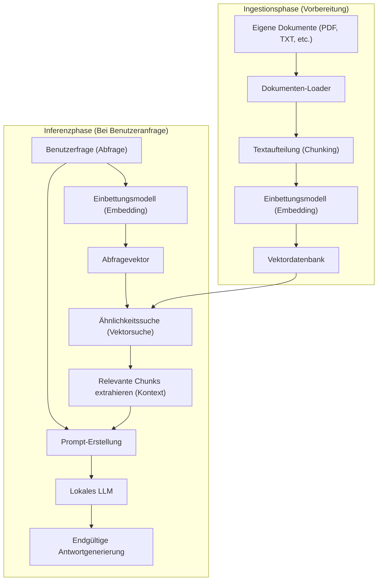
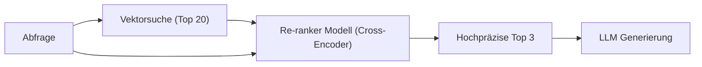

# Einführung

In den letzten Jahren war die Entwicklung von großen Sprachmodellen (LLMs) bemerkenswert, und viele KIs, angeführt von ChatGPT und Claude, haben unseren Alltag und unsere Arbeit durchdrungen. Allgemeine LLMs haben jedoch eine offensichtliche Schwäche. Sie kennen nur "öffentliche Informationen zum Zeitpunkt des Trainings". Natürlich können sie keine Fragen zu "privaten Dokumenten" wie internen Firmenrichtlinien, persönlichen Notizen und unveröffentlichten Projektmaterialien beantworten. Wenn man versucht, sie zur Beantwortung zu zwingen, steigt das Risiko, dass sie plausibel klingende Lügen (Halluzinationen) generieren, die nicht den Tatsachen entsprechen.

Daher verbreitet sich derzeit eine Technologiearchitektur namens **RAG (Retrieval-Augmented Generation)** weltweit rasant. Durch den Einsatz von RAG ist es möglich, LLMs dynamisch mit eigenem Wissen aus externen Datenbanken zu versorgen und sie basierend darauf genaue und fundierte Antworten generieren zu lassen.

Darüber hinaus ist es bei der Verarbeitung von vertraulichen Unternehmens- oder persönlichen Informationen oft aufgrund von Sicherheitsrichtlinien inakzeptabel, Daten an cloudbasierte APIs wie OpenAI zu senden. Was hier benötigt wird, ist der Aufbau eines "lokalen RAG" in Kombination mit einer **lokalen KI** (einem LLM, das vollständig auf dem eigenen PC oder On-Premise-Server läuft).

In diesem Artikel werden wir alles von der grundlegenden RAG-Theorie über die konkrete Implementierung eines lokalen RAG mit Python, den mathematischen Hintergrund (wie die Vektorsuche funktioniert) bis hin zu fortgeschrittenen Techniken für den produktiven Betrieb des Systems umfassend erklären.

---

# 1. Die Gesamtarchitektur von RAG

RAG ist nicht ein einzelnes KI-Modell, sondern eine Systemarchitektur, bei der mehrere Komponenten zusammenarbeiten. Es besteht grob aus zwei Phasen: der "Ingestionsphase (Datenaufnahme)" und der "Retrieval- & Generationsphase (Suche und Generierung)".

Das folgende Mermaid-Diagramm zeigt das Gesamtbild eines RAG-Systems.



## Ingestionsphase (Vorbereitung)
1. **Dokumente laden**: Lesen von unstrukturierten Daten wie PDFs, Word- und Textdateien.
2. **Chunking (Textaufteilung)**: Um in das Eingabelimit (Kontextfenster) des LLM zu passen und die Suchgenauigkeit zu erhöhen, werden lange Texte in sinnvolle Blöcke (Chunks) aufgeteilt.
3. **Embedding (Vektorisierung)**: Die aufgeteilten Chunks werden in ein Einbettungsmodell (Embedding Model) eingegeben und in numerische Arrays (Vektoren) mit Hunderten bis Tausenden von Dimensionen umgewandelt.
4. **In der Datenbank speichern**: Die konvertierten Vektoren werden zusammen mit den ursprünglichen Textdaten in einer Vektordatenbank (Vector DB) gespeichert.

## Inferenzphase (Laufzeit)
1. **Abfrage vektorisieren**: Die Frage des Benutzers wird mit demselben Einbettungsmodell vektorisiert, das in der Vorbereitungsphase verwendet wurde.
2. **Ähnlichkeitssuche**: Die Ähnlichkeit zwischen dem Abfragevektor und den Dokumentenvektoren in der Datenbank wird berechnet, und die semantisch ähnlichsten (hochrelevanten) Text-Chunks werden abgerufen.
3. **Prompt-Erstellung**: Der abgerufene relevante Text wird als "Kontext (Hintergrundwissen)" mit der Frage des Benutzers kombiniert, um den Eingabe-Prompt für das LLM zu erstellen.
4. **Antwortgenerierung**: Das LLM empängt den erweiterten Prompt und generiert eine Antwort basierend auf den bereitgestellten Kontextinformationen.

---

# 2. Ein tieferes Verständnis von Vektorsuche und Embeddings

Der Kern von RAG ist die "Vektorsuche (semantische Suche)". Während die traditionelle Stichwortsuche (wie BM25) auf exakten Wortübereinstimmungen oder Häufigkeiten basiert, basiert die Vektorsuche auf "semantischer Ähnlichkeit". Auch wenn unterschiedliche Wörter verwendet werden, wie z.B. "Hund" und "Welpe" oder "PC" und "Computer", werden sie bei der Suche gefunden, wenn ihre Bedeutungen ähnlich sind.

## Was ist ein Einbettungsmodell (Embedding Model)?

Ein Einbettungsmodell ist ein neuronales Netzwerk, das natürlichsprachlichen Text als Eingabe nimmt und einen dichten Vektor (Dense Vector) fester Länge als Ausgabe liefert. Gängige Modelle (wie `text-embedding-3-small` oder das quelloffene `multilingual-e5-large`) bilden Text auf reellwertige Vektoren mit 384 oder 1024 Dimensionen ab.

In diesem mehrdimensionalen Raum (latenter Raum) werden Modelle so trainiert, dass Sätze mit ähnlichen Bedeutungen näher beieinander im Koordinatenraum liegen.

## Der mathematische Hintergrund der Ähnlichkeitsberechnung: Kosinus-Ähnlichkeit

Wenn eine Vektordatenbank nach relevanten Dokumenten sucht, ist die am häufigsten verwendete Distanzmetrik die **Kosinus-Ähnlichkeit (Cosine Similarity)**. Im Gegensatz zur euklidischen Distanz (räumliche absolute Distanz) konzentriert sich die Kosinus-Ähnlichkeit auf den "Winkel zwischen zwei Vektoren". Sie ist sehr gut für die Textähnlichkeitsberechnung geeignet, da sie weniger durch die Länge des Textes (die Norm des Vektors) beeinflusst wird.

Mathematisch ausgedrückt ist die Kosinus-Ähnlichkeit zwischen den Vektoren $\mathbf{A}$ und $\mathbf{B}$ wie folgt:

$$ \text{Cosine Similarity}(\mathbf{A}, \mathbf{B}) = \cos(\theta) = \frac{\mathbf{A} \cdot \mathbf{B}}{\|\mathbf{A}\| \|\mathbf{B}\|} = \frac{\sum_{i=1}^{n} A_i B_i}{\sqrt{\sum_{i=1}^{n} A_i^2} \sqrt{\sum_{i=1}^{n} B_i^2}} $$

- $\mathbf{A} \cdot \mathbf{B}$ repräsentiert das Skalarprodukt (Dot Product).
- $\|\mathbf{A}\|$ repräsentiert die L2-Norm (Länge) des Vektors $\mathbf{A}$.
- $n$ ist die Anzahl der Dimensionen des Vektors.

Die Kosinus-Ähnlichkeit nimmt Werte von -1 bis 1 an.
- **Nahe bei 1**: Die Richtungen der beiden Vektoren sind fast identisch (die Bedeutungen sind sehr ähnlich)
- **Nahe bei 0**: Die beiden Vektoren sind orthogonal (kein Zusammenhang)
- **Nahe bei -1**: Die beiden Vektoren zeigen in entgegengesetzte Richtungen (gegenteilige Bedeutungen)

Moderne Vektor-DBs (Chroma, FAISS, Qdrant usw.) verwenden Algorithmen zur ungefähren Nächste-Nachbarn-Suche (ANN), wie HNSW (Hierarchical Navigable Small World), die optimiert sind, um Dokumente mit hoher Kosinus-Ähnlichkeit selbst in Millionen von Vektordaten in Millisekunden zu finden.

---

# 3. Der Technologie-Stack für den Aufbau eines lokalen RAG

Um ein vollständig lokales RAG aufzubauen, das nicht auf die Cloud angewiesen ist, nutzen wir das Open-Source-Ökosystem. Der folgende Technologie-Stack wird empfohlen:

1. **Sprachmodell (LLM)**
   - Tool: `Ollama` oder `Llama.cpp`
   - Modelle: Leichte und leistungsstarke offene Modelle wie `Llama-3-8B-Instruct`, `Gemma-2-9B-It`, `Qwen2-7B-Instruct`. Für japanische Aufgaben eignen sich auf Japanisch abgestimmte Modelle wie `Llama-3-ELYZA-JP-8B`.
2. **Einbettungsmodell (Embedding)**
   - Modelle: `intfloat/multilingual-e5-large` oder `BAAI/bge-m3`. Bei lokaler Ausführung ist es üblich, diese von Hugging Face herunterzuladen und mit Sentence-Transformers auszuführen.
3. **Vektordatenbank (Vector DB)**
   - `ChromaDB`: Basiert auf Python und ist extrem einfach einzurichten. Ideal für die lokale Entwicklung.
   - `FAISS`: Eine von Meta entwickelte schnelle Vektorsuchbibliothek.
   - `Qdrant` / `Milvus`: Besser geeignet für größere Skalierungen und Produktionsumgebungen.
4. **Orchestrierungs-Framework**
   - `LangChain`: Der De-facto-Standard zur Verknüpfung (Chaining) von Komponenten.
   - `LlamaIndex`: Ein Datenverbindungs-Framework, das speziell auf RAG ausgerichtet ist.

Dieses Mal werden wir es mit der Kombination implementieren, die am einfachsten einzurichten ist: **LangChain + ChromaDB + Ollama + HuggingFaceEmbeddings**.

---

# 4. Implementierungs-Tutorial: Vollständiger lokaler RAG-Aufbau mit Python

Von hier an werden wir ein lokales RAG aufbauen, indem wir tatsächlich Python-Code schreiben. Bitte installieren Sie Ollama im Voraus auf Ihrem PC und lassen Sie es im Hintergrund laufen. Ziehen Sie außerdem ein Modell auf Ollama (z.B. `ollama run llama3`).

## Schritt 1: Installation der benötigten Bibliotheken

```bash
pip install langchain langchain-community langchain-huggingface
pip install chromadb sentence-transformers pypdf
```

## Schritt 2: Überblick über den Implementierungscode

Das Folgende ist ein vollständiges Python-Skript, um eine PDF-Datei zu lesen, sie zu vektorisieren und ein lokales LLM Fragen dazu beantworten zu lassen.

```python
import os
from langchain_community.document_loaders import PyPDFLoader
from langchain_text_splitters import RecursiveCharacterTextSplitter
from langchain_huggingface import HuggingFaceEmbeddings
from langchain_community.vectorstores import Chroma
from langchain_community.llms import Ollama
from langchain_core.prompts import PromptTemplate
from langchain.chains import RetrievalQA

def main():
    # 1. Dokumenten-Loader
    print("Dokumente werden geladen...")
    # Geben Sie den Pfad des PDFs an, das Sie laden möchten
    file_path = "sample_company_policy.pdf" 
    loader = PyPDFLoader(file_path)
    documents = loader.load()

    # 2. Textaufteilung (Text Splitting)
    # Aufteilung in eine angemessene Größe, ohne die Bedeutung des Textes zu zerstören
    text_splitter = RecursiveCharacterTextSplitter(
        chunk_size=500,     # Maximale Anzahl von Zeichen pro Chunk
        chunk_overlap=50,   # Anzahl der überlappenden Zeichen zwischen den Chunks (verhindert Kontextverlust)
        separators=["\n\n", "\n", "。", "、", " ", ""]
    )
    chunks = text_splitter.split_documents(documents)
    print(f"In {len(chunks)} Chunks aufgeteilt.")

    # 3. Initialisierung des Einbettungsmodells (Lokal HuggingFace Model)
    # Verwendung eines mehrsprachigen Modells
    print("Einbettungsmodell wird geladen...")
    embeddings = HuggingFaceEmbeddings(
        model_name="intfloat/multilingual-e5-large",
        model_kwargs={'device': 'cpu'} # 'cuda' oder 'mps', falls eine GPU verfügbar ist
    )

    # 4. Aufbau der Vektordatenbank (Chroma)
    print("Vektordatenbank wird aufgebaut...")
    persist_directory = "./chroma_db"
    vectorstore = Chroma.from_documents(
        documents=chunks,
        embedding=embeddings,
        persist_directory=persist_directory
    )
    # Erstellung des Retrievers. So konfiguriert, dass die Top-3 der relevanten Dokumente abgerufen werden
    retriever = vectorstore.as_retriever(search_kwargs={"k": 3})

    # 5. Initialisierung des lokalen LLMs (Ollama)
    print("Verbindung zum lokalen LLM wird hergestellt...")
    # Stellen Sie sicher, dass Sie das Modell vorher mit z.B. 'ollama pull llama3' abrufen
    llm = Ollama(model="llama3")

    # 6. Definition der Prompt-Vorlage
    prompt_template = """Du bist ein hervorragender Assistent, der mit Unternehmensrichtlinien und internen Informationen bestens vertraut ist.
Bitte beantworte die Fragen des Benutzers ausführlich auf Deutsch, wobei du AUSSCHLIESSLICH den folgenden Kontext (Hintergrundinformationen) verwendest.
Wenn die Antwort nicht im Kontext zu finden ist, spekuliere nicht, sondern antworte ehrlich: "Aus den bereitgestellten Informationen nicht ersichtlich."

[Kontext]
{context}

[Frage]
{question}

[Antwort]:
"""
    PROMPT = PromptTemplate(
        template=prompt_template, 
        input_variables=["context", "question"]
    )

    # 7. Aufbau der RAG-Kette
    qa_chain = RetrievalQA.from_chain_type(
        llm=llm,
        chain_type="stuff",
        retriever=retriever,
        return_source_documents=True, # Legt fest, ob Quellenangaben zurückgegeben werden
        chain_type_kwargs={"prompt": PROMPT}
    )

    # 8. Ausführung der Frage
    query = "Bitte erläutern Sie die Bedingungen für die Erstattung von Fahrtkosten im Zusammenhang mit Remote-Arbeit."
    print(f"\nFrage: {query}\n")
    
    result = qa_chain.invoke({"query": query})
    
    print("[Antwort]")
    print(result['result'])
    print("\n---")
    print("[Referenzierte Informationsquellen]")
    for doc in result['source_documents']:
        print(f"- Seite {doc.metadata.get('page', 'Unbekannt')}: {doc.page_content[:50]}...")

if __name__ == "__main__":
    main()
```

## Erklärung der Code-Highlights

1. **RecursiveCharacterTextSplitter**:
   Dies ist der am meisten empfohlene Splitter für das Teilen von natürlicher Sprache. Er versucht, den Text in der Reihenfolge Absatz (`\n\n`), Zeile (`\n`) und Punkt (`。`) aufzuteilen, wobei semantische Gruppierungen so weit wie möglich beibehalten werden, um in die angegebene `chunk_size` zu passen. Durch Einstellen von `chunk_overlap` verhindern wir, dass Informationen verloren gehen, wenn Kontextgrenzen abgeschnitten werden.
2. **HuggingFaceEmbeddings**:
   `intfloat/multilingual-e5-large` ist ein sehr leistungsstarkes Open-Source-Einbettungsmodell, das mehrere Sprachen unterstützt. Es ermöglicht Ihnen, Text offline im lokalen Speicher zu vektorisieren, ohne eine Cloud-API (wie `text-embedding-ada-002` von OpenAI) zu verwenden.
3. **ChromaDB**:
   Da es im Arbeitsspeicher oder im lokalen Speicher (SQLite-basiert) läuft, ist es nicht notwendig, einen komplexen Datenbankserver einzurichten. Durch die Angabe von `persist_directory` können Sie den Vektorisierungsprozess bei erneuter Ausführung überspringen und die DB von der Festplatte laden.

---

# 5. Fortgeschrittene RAG-Techniken (Advanced RAG Techniques)

Obwohl das Basis-RAG-System (Naive RAG), das wir im obigen Tutorial aufgebaut haben, funktioniert, erfordert der produktive Einsatz mit hohen Anforderungen an die Antwortgenauigkeit die Einführung fortgeschrittener Techniken wie den folgenden.

## 5.1 Hybride Suche (Hybrid Search)
Die Vektorsuche ist gut darin, "Bedeutung" zu erfassen, kann aber Schwierigkeiten mit strengen Stichwortsuchen haben, wie z.B. bei "bestimmten Eigennamen", "Produktmodellnummern" oder "Mitarbeiter-IDs".
Indem man eine **semantische Suche** basierend auf der Vektorsuche parallel zu einer **Stichwortsuche** unter Verwendung von Algorithmen wie BM25 durchführt und die Ergebnisse beider bewertet und integriert (unter Verwendung von Methoden wie Reciprocal Rank Fusion; RRF), können Suchauslassungen drastisch reduziert werden.

## 5.2 Re-ranking (Neubewertung)
Die Vektorsuche ist schnell, wertet aber nicht unbedingt die genaue kontextuelle Eignung des Kontexts aus. Eine gängige Pipeline zur Verbesserung der Suchgenauigkeit sieht wie folgt aus:
1. **Initiale Suche (First-stage Retrieval)**: Etwa 20 bis 30 relevante Chunks werden breit und flach aus der Vektor-DB abgerufen.
2. **Neubewertung (Re-ranking)**: Ein weiteres, schwereres maschinelles Lernmodell (z.B. `bge-reranker`), das als Cross-Encoder bezeichnet wird, wird verwendet, um das Paar aus der Benutzeranfrage und dem abgerufenen Chunk einzugeben und den semantischen Eignungsscore neu zu berechnen.
3. **Auswahl**: Nur die Top 3 bis 5 mit den höchsten Scores werden an den LLM-Prompt als finaler Kontext weitergegeben.

Diese Methode verhindert, dass irrelevante Rauschinformationen an das LLM weitergegeben werden, und kann die Genauigkeit (Precision) der Antworten erheblich verbessern.



## 5.3 Semantisches Chunking und Parent-Dokument-Suche
Es gibt eine Technik namens "Semantic Chunking", bei der die KI Verschiebungen in der Bedeutung von Sätzen erkennt und den Text entsprechend aufteilt, anstatt den Text mechanisch nach einer festen Zeichenanzahl zu unterteilen.
Zusätzlich verwendet eine Methode, die als "Parent Document Retriever" bezeichnet wird, sehr kleine Einheiten (wie Sätze) für die Vektorisierung zu Suchzwecken, um eine hochpräzise Suche zu erreichen. Bei der Übergabe an das LLM wird der "ursprüngliche große Absatz (das Parent-Dokument)", der diesen Satz enthält, weitergegeben und bietet dem LLM so ausreichend Kontext.

---

# 6. Herausforderungen und Lösungen beim Betrieb eines lokalen RAG

Der Aufbau und Betrieb von RAG in einer lokalen Umgebung bringt spezifische Hürden mit sich.

- **Erschöpfung von VRAM (Videospeicher)**:
  Um ein lokales LLM mit einer praktischen Geschwindigkeit (Dutzende von Token pro Sekunde) laufen zu lassen, muss das Modell in den VRAM der GPU geladen werden. Ein Modell der 8B-Klasse benötigt bei fp16 (16-Bit-Gleitkomma) etwa 16 GB VRAM. Durch den Einsatz von **Quantisierungstechnologien** (wie GGUF- oder AWQ-Formate, die auf 4-Bit oder 8-Bit komprimieren) ist es jedoch möglich, es auch mit 8 GB VRAM (wie z.B. in Standard-Gaming-PCs) ausreichend schnell laufen zu lassen. Llama.cpp und Ollama unterstützen diese Quantisierungsformate standardmäßig.
- **Limitierung des Kontextfensters**:
  Wenn die Menge des abgerufenen Kontexts zu groß ist, kann das Eingabelimit (Tokenlimit) des LLM überschritten werden, oder das Modell könnte Informationen im mittleren Teil vergessen ("Lost in the middle"-Phänomen). Eine Anpassung der Anzahl der extrahierten Chunks und eine sorgfältige Auswahl durch die oben genannten Re-ranking-Techniken sind unerlässlich.
- **Datenaktualitätsmanagement**:
  Wenn ein Quelldokument aktualisiert wird, müssen die Vektoren der entsprechenden Dokumente in der Vektordatenbank ebenfalls aktualisiert oder gelöscht werden (CRUD-Operationen). Da ChromaDB ID-basierte Dokumentenaktualisierungen unterstützt, ist es praktisch, Hash-Werte von Dateien zu verwalten und einen Batch-Prozess einzurichten, der nur die Unterschiede synchronisiert.

---

# Zusammenfassung

RAG (Retrieval-Augmented Generation) ist ein mächtiges Paradigma, das KI von einem allgemeinen Allzweck-Assistenten zu "Ihrem exklusiven Experten" oder "einem Experten für interne Abläufe" weiterentwickelt.

Wir haben gesehen, dass es selbst bei hochsensiblen Anforderungen, bei denen Cloud-Dienste nicht genutzt werden können, durch die Kombination von Open-Source-Ökosystemen wie Ollama, LangChain und ChromaDB relativ einfach ist, eine vollständige "lokale RAG"-Umgebung aufzubauen.

Bitte versuchen Sie, auf der Grundlage des in diesem Artikel erläuterten mathematischen Verständnisses des Vektorraums und fortgeschrittener Ansätze wie Textaufteilung und Re-ranking ein originelles KI-System mit Ihren eigenen Daten zu entwickeln. Die Entwicklungsgeschwindigkeit von lokalen KIs ist erstaunlich, und das heute aufgebaute System kann sofort in der Leistung verbessert werden, indem es einfach durch ein intelligenteres, leichteres Modell ersetzt wird, das morgen erscheint.

---
*Wir werden auf diesem Blog weiterhin vertiefende Artikel zu KI-Technologien und RAG veröffentlichen. Wenn Sie Fragen oder Feedback haben, hinterlassen Sie diese bitte im Kommentarbereich.*
