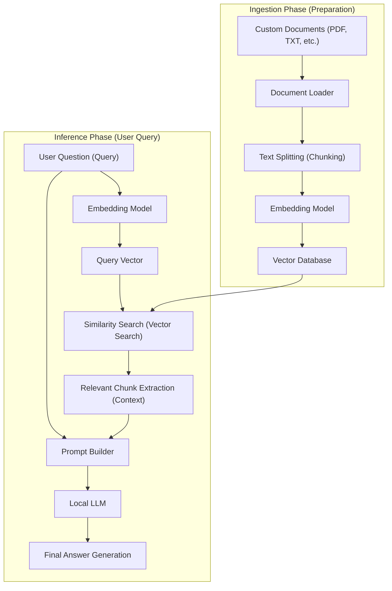
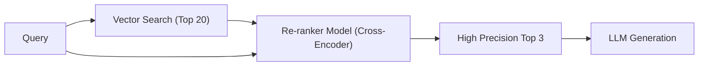

# Introduction

In recent years, the evolution of Large Language Models (LLMs) has been remarkable, and many AIs, led by ChatGPT and Claude, have permeated our daily lives and business operations. However, general LLMs have a distinct weakness. That is, they only know "public information at the time of their training". Naturally, they cannot answer questions about "private documents" such as internal company regulations, personal notes, and unpublished project materials. Forcing them to answer increases the risk of generating plausible lies (hallucinations) that differ from the facts.

Therefore, the technological architecture known as **RAG (Retrieval-Augmented Generation)** is currently spreading explosively worldwide. By using RAG, it becomes possible to dynamically provide unique knowledge to the LLM from an external database and have it generate accurate and well-founded answers based on it.

Furthermore, when handling enterprise domains or personal confidential information, sending data to cloud-based APIs like OpenAI is often unacceptable under security policies. What is required there is the construction of "Local RAG" combined with **Local AI** (an LLM that operates entirely on your own PC or on-premise server).

In this article, we will thoroughly explain everything from the fundamental theory of RAG, specific implementation methods of Local RAG using Python, mathematical background (how vector search works), to advanced techniques for running the system in production.

---

# 1. Overall Architecture of RAG

RAG is not a single AI model, but a system architecture where multiple components work together. It broadly consists of two phases: the "Ingestion (Data Loading) Phase" and the "Retrieval & Generation Phase".

The Mermaid diagram below shows the overall picture of a RAG system.



## Ingestion Phase (Preparation)
1. **Document Loading**: Loads unstructured data such as PDFs, Word documents, and text files.
2. **Chunking (Text Splitting)**: Splits long texts into meaningful chunks to fit within the LLM's input limit (context window) and to improve search accuracy.
3. **Embedding (Vectorization)**: Inputs the split chunks into an Embedding Model and converts them into an array of numerical values (vectors) with hundreds to thousands of dimensions.
4. **Saving to Database**: Saves the converted vectors and their associated original text data into a Vector Database (Vector DB).

## Inference Phase (Runtime)
1. **Query Vectorization**: Vectorizes the user's question text using the same embedding model used in the preparation phase.
2. **Similarity Search**: Performs a similarity calculation between the query vector and the document vectors in the database, and retrieves the top few semantic (highly relevant) text chunks.
3. **Prompt Building**: Combines the retrieved relevant text as "context (background knowledge)" with the user's question text to create an input prompt for the LLM.
4. **Answer Generation**: The LLM, receiving the augmented prompt, generates an answer based on the provided context information.

---

# 2. Deep Understanding of Vector Search and Embeddings

At the core of RAG is "Vector Search (Semantic Search)". While traditional keyword search (like BM25) is based on exact word matching and frequency, vector search is based on "semantic similarity". For example, even if the words are different, like "dog" and "puppy", or "PC" and "computer", they will be hit in the search if their meanings are close.

## What is an Embedding Model?

An embedding model is a neural network that takes natural language text as input and outputs a fixed-length dense vector. Common models (e.g., `text-embedding-3-small` or the open-source `multilingual-e5-large`) map text into a vector of real numbers with 384 or 1024 dimensions.

In this multi-dimensional space (latent space), the model is trained so that sentences with similar meanings are closer in distance in the coordinate space.

## Mathematical Background of Similarity Calculation: Cosine Similarity

When a vector database searches for relevant documents, the most commonly used distance metric is **Cosine Similarity**. Unlike Euclidean distance (absolute spatial distance), cosine similarity focuses on the "angle between two vectors". Since it is less affected by the length of the sentence (the norm of the vector), it is highly suitable for calculating text similarity.

Expressed mathematically, the cosine similarity between vectors $\mathbf{A}$ and $\mathbf{B}$ is as follows:

$$ \text{Cosine Similarity}(\mathbf{A}, \mathbf{B}) = \cos(\theta) = \frac{\mathbf{A} \cdot \mathbf{B}}{\|\mathbf{A}\| \|\mathbf{B}\|} = \frac{\sum_{i=1}^{n} A_i B_i}{\sqrt{\sum_{i=1}^{n} A_i^2} \sqrt{\sum_{i=1}^{n} B_i^2}} $$

- $\mathbf{A} \cdot \mathbf{B}$ represents the Dot Product.
- $\|\mathbf{A}\|$ represents the L2 norm (length) of vector $\mathbf{A}$.
- $n$ is the number of dimensions of the vector.

Cosine similarity takes a value from -1 to 1.
- **Close to 1**: The directions of the two vectors are almost the same (meanings are very similar).
- **Close to 0**: The two vectors are orthogonal (unrelated).
- **Close to -1**: The two vectors are in opposite directions (meanings are opposite).

Recent Vector DBs (Chroma, FAISS, Qdrant, etc.) employ an Approximate Nearest Neighbor (ANN) algorithm called HNSW (Hierarchical Navigable Small World), optimizing them to search for documents with high cosine similarity in milliseconds even from millions of vector data.

---

# 3. Technology Stack for Building Local RAG

To build a fully local RAG that does not rely on the cloud, we leverage the open-source ecosystem. The recommended technology stack is introduced below.

1. **Large Language Model (LLM)**
   - Tools: `Ollama` or `Llama.cpp`
   - Models: Lightweight, high-performance open models like `Llama-3-8B-Instruct`, `Gemma-2-9B-It`, `Qwen2-7B-Instruct`. For Japanese tasks, Japanese-tuned models like `Llama-3-ELYZA-JP-8B` are suitable.
2. **Embedding Model (Embedding)**
   - Models: `intfloat/multilingual-e5-large` or `BAAI/bge-m3`. When running locally, it is common to download them from Hugging Face and run them with Sentence-Transformers.
3. **Vector Database (Vector DB)**
   - `ChromaDB`: Python-based and extremely easy to set up. Ideal for local development.
   - `FAISS`: A fast vector search library developed by Meta.
   - `Qdrant` / `Milvus`: For larger scale and production environments.
4. **Orchestration Framework**
   - `LangChain`: The de facto standard for chaining components together.
   - `LlamaIndex`: A data connection framework specifically specialized for RAG.

This time, we will implement it using the easiest combination to introduce: **LangChain + ChromaDB + Ollama + HuggingFaceEmbeddings**.

---

# 4. Implementation Tutorial: Building a Full Local RAG with Python

From here, we will build a local RAG while actually writing Python code. Please install Ollama on your PC in advance and have it running in the background. Also, pull a model on Ollama (e.g., `ollama run llama3`).

## Step 1: Installing Required Libraries

```bash
pip install langchain langchain-community langchain-huggingface
pip install chromadb sentence-transformers pypdf
```

## Step 2: Complete Implementation Code

Below is the complete Python script to load a PDF file, vectorize it, and have the local LLM answer questions.

```python
import os
from langchain_community.document_loaders import PyPDFLoader
from langchain_text_splitters import RecursiveCharacterTextSplitter
from langchain_huggingface import HuggingFaceEmbeddings
from langchain_community.vectorstores import Chroma
from langchain_community.llms import Ollama
from langchain_core.prompts import PromptTemplate
from langchain.chains import RetrievalQA

def main():
    # 1. Document Loading
    print("Loading document...")
    # Specify the path of the PDF you want to load
    file_path = "sample_company_policy.pdf" 
    loader = PyPDFLoader(file_path)
    documents = loader.load()

    # 2. Chunking (Text Splitting)
    # Split into appropriate sizes without breaking the meaning of the sentences
    text_splitter = RecursiveCharacterTextSplitter(
        chunk_size=500,     # Maximum number of characters per chunk
        chunk_overlap=50,   # Overlap characters between previous and next chunks (prevents context disconnection)
        separators=["\n\n", "\n", "。", "、", " ", ""]
    )
    chunks = text_splitter.split_documents(documents)
    print(f"Split into {len(chunks)} chunks.")

    # 3. Initialization of Embedding Model (Local HuggingFace Model)
    # Using a multilingual model with strong Japanese support
    print("Loading embedding model...")
    embeddings = HuggingFaceEmbeddings(
        model_name="intfloat/multilingual-e5-large",
        model_kwargs={'device': 'cpu'} # 'cuda' or 'mps' if you have a GPU
    )

    # 4. Building Vector Database (Chroma)
    print("Building vector database...")
    persist_directory = "./chroma_db"
    vectorstore = Chroma.from_documents(
        documents=chunks,
        embedding=embeddings,
        persist_directory=persist_directory
    )
    # Creating a Retriever. Configured to get the top 3 relevant documents
    retriever = vectorstore.as_retriever(search_kwargs={"k": 3})

    # 5. Initialization of Local LLM (Ollama)
    print("Connecting to Local LLM...")
    # Make sure to get the model in advance with 'ollama pull llama3' etc.
    llm = Ollama(model="llama3")

    # 6. Definition of Prompt Template
    prompt_template = """You are an excellent assistant familiar with company regulations and internal information.
Please answer the user's question in detail based ONLY on the following context (background information).
If you cannot find the answer from the context, please do not guess and honestly answer "I don't know from the provided information."

[Context]
{context}

[Question]
{question}

[Answer]:
"""
    PROMPT = PromptTemplate(
        template=prompt_template, 
        input_variables=["context", "question"]
    )

    # 7. Building RAG Chain
    qa_chain = RetrievalQA.from_chain_type(
        llm=llm,
        chain_type="stuff",
        retriever=retriever,
        return_source_documents=True, # Set whether to return source documents
        chain_type_kwargs={"prompt": PROMPT}
    )

    # 8. Executing a Question
    query = "Please tell me about the conditions for transportation expenses payment regarding remote work."
    print(f"\nQuestion: {query}\n")
    
    result = qa_chain.invoke({"query": query})
    
    print("[Answer]")
    print(result['result'])
    print("\n---")
    print("[Reference Sources]")
    for doc in result['source_documents']:
        print(f"- Page {doc.metadata.get('page', 'Unknown')}: {doc.page_content[:50]}...")

if __name__ == "__main__":
    main()
```

## Explanation of Key Code Points

1. **RecursiveCharacterTextSplitter**:
   This is the most recommended splitter for dividing natural language. It attempts to split in the order of paragraphs (`\n\n`), lines (`\n`), and periods (`。`), keeping semantic blocks together as much as possible while fitting within the specified `chunk_size`. By setting `chunk_overlap`, you prevent context boundaries from being cut off and information from being lost.
2. **HuggingFaceEmbeddings**:
   `intfloat/multilingual-e5-large` is a very powerful open-source embedding model that supports multiple languages. You can vectorize text locally on your memory offline without using a cloud API (like OpenAI's `text-embedding-ada-002`).
3. **ChromaDB**:
   Since it runs in-memory or on local storage (SQLite-based), there is no need to spin up a complex database server. By specifying `persist_directory`, you can skip the vectorization process on subsequent runs and load the DB from disk.

---

# 5. Advanced RAG Techniques

The basic RAG system (Naive RAG) built in the above tutorial works, but if high answer accuracy is required in a production environment, the introduction of advanced techniques like the following becomes necessary.

## 5.1 Hybrid Search
While vector search is good at capturing "meaning", it can be poor at strict keyword searches like "specific proper nouns", "product model numbers", and "employee IDs".
Therefore, by running **semantic search** via vector search and **keyword search** using algorithms like BM25 in parallel, and integrating both results by scoring them (using techniques like Reciprocal Rank Fusion; RRF), you can drastically reduce search misses.

## 5.2 Re-ranking
Vector search is fast, but it does not necessarily evaluate the exact contextual relevance of the context. A general pipeline for improving search accuracy is as follows:
1. **First-stage Retrieval**: Retrieve a broad and shallow range of relevant chunks (about 20-30) from the Vector DB.
2. **Re-ranking**: Use another heavier machine learning model called a Cross-Encoder (e.g., `bge-reranker`) to input pairs of the user's query and the retrieved chunks, and recalculate their semantic relevance scores.
3. **Selection**: Pass only the top 3-5 with the highest scores as the final context to the LLM prompt.

This technique prevents irrelevant noise information from being passed to the LLM, significantly increasing the precision of the answers.



## 5.3 Semantic Chunking and Parent Document Retrieval
Instead of mechanically splitting text by a fixed number of characters, there is a technique called "Semantic Chunking" that uses AI to detect shifts in meaning and splits the text accordingly.
Also, in the "Parent Document Retriever" technique, you vectorize in very small units (like sentences) for high-precision search, but when passing it to the LLM, you provide the "original large paragraph (parent document)" containing that sentence, thus providing sufficient context to the LLM.

---

# 6. Challenges and Countermeasures when Operating Local RAG

There are unique hurdles when building and operating RAG in a local environment.

- **VRAM (Video Memory) Exhaustion**:
  To run a Local LLM at a practical speed (dozens of tokens per second), you need to load the model into the GPU's VRAM. Running an 8B class model in fp16 (16-bit floating point) requires about 16GB of VRAM, but by using **Quantization** technologies (compressing to 4-bit or 8-bit, such as GGUF or AWQ formats), it is possible to run it fast enough even with 8GB of VRAM (like a standard gaming PC). Llama.cpp and Ollama support these quantization formats by default.
- **Context Window Limits**:
  If the amount of retrieved context is too large, it may exceed the LLM's input limit (token limit), or the model might forget the middle part of the information (Lost in the middle phenomenon). Adjusting the number of chunks to extract and carefully selecting them through the aforementioned re-ranking techniques are essential.
- **Data Freshness Management**:
  When a source document is updated, the corresponding document's vector in the vector database also needs to be updated or deleted (CRUD operations). Since ChromaDB supports updates based on document IDs, it is practical to manage file hash values and set up a batch process to sync only the differences.

---

# Conclusion

RAG (Retrieval-Augmented Generation) is a powerful paradigm that evolves AI from a general-purpose assistant into your "exclusive expert" or an "expert specialized in internal business".

We found that even with highly confidential requirements where cloud services cannot be used, a complete "Local RAG" environment can be relatively easily built by combining the open-source ecosystem such as Ollama, LangChain, and ChromaDB.

Based on the advanced approaches such as mathematical understanding of vector space, text splitting, and re-ranking explained in this article, please try developing an original AI system using your own data. The speed of evolution in local AI is astounding, and the system you build today can instantly update its performance tomorrow simply by swapping in a smarter lightweight model that appears.

---
*This blog will continue to publish deep-dive articles on AI technology and RAG. If you have any questions or feedback, please share them in the comments section.*
