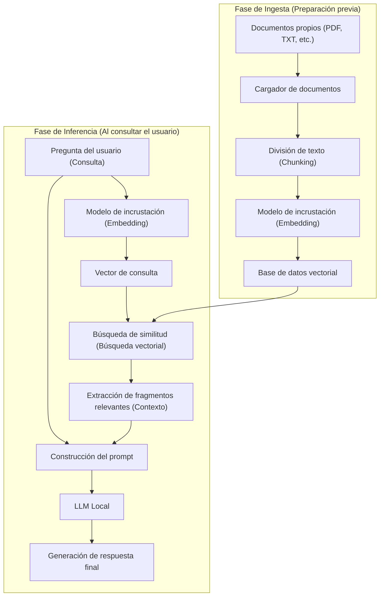
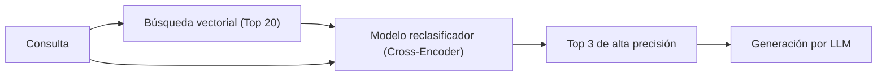

# Introducción

En los últimos años, la evolución de los Grandes Modelos de Lenguaje (LLM) ha sido notable, con inteligencias artificiales como ChatGPT y Claude infiltrándose en nuestras vidas y trabajos. Sin embargo, los LLM generales tienen una clara debilidad: solo conocen la "información pública en el momento de su entrenamiento". Naturalmente, no pueden responder preguntas sobre "documentos privados" como reglamentos internos de la empresa, notas personales o materiales de proyectos no publicados. Si se les fuerza a responder, aumenta el riesgo de que generen mentiras plausibles que no se ajustan a los hechos (alucinaciones).

Por lo tanto, la arquitectura tecnológica que está experimentando una adopción explosiva en todo el mundo en este momento es **RAG (Retrieval-Augmented Generation: Generación Aumentada por Recuperación)**. Al utilizar RAG, es posible proporcionar de forma dinámica conocimientos propios al LLM desde una base de datos externa, permitiéndole generar respuestas precisas y fundamentadas basadas en dichos conocimientos.

Además, al manejar información confidencial de empresas o individuos, el envío de datos a API basadas en la nube como las de OpenAI a menudo no está permitido por las políticas de seguridad. Lo que se necesita en estos casos es la construcción de un "RAG local" combinado con una **IA local** (un LLM que opera de manera autónoma en tu propia PC o en un servidor on-premise).

En este artículo, explicaremos exhaustivamente desde la teoría fundamental de RAG hasta métodos específicos para implementar un RAG local con Python, los antecedentes matemáticos (cómo funciona la búsqueda vectorial) y técnicas avanzadas para poner el sistema en producción.

---

# 1. Arquitectura general de RAG

RAG no es un modelo de IA único, sino una arquitectura de sistema en la que múltiples componentes colaboran entre sí. Se divide principalmente en dos fases: la "Fase de ingesta (importación de datos)" y la "Fase de recuperación y generación (búsqueda y generación)".

El siguiente diagrama de Mermaid muestra la imagen general del sistema RAG.



## Fase de ingesta (Preparación previa)
1. **Carga de documentos**: Se leen datos no estructurados como archivos PDF, Word o de texto.
2. **Chunking (División de texto)**: Se dividen los textos largos en fragmentos significativos (chunks) para que se ajusten al límite de entrada del LLM (ventana de contexto) y para mejorar la precisión de la búsqueda.
3. **Embedding (Vectorización)**: Se introducen los fragmentos divididos en un modelo de incrustación (Embedding Model) y se convierten en matrices numéricas (vectores) de cientos a miles de dimensiones.
4. **Almacenamiento en la base de datos**: Los vectores convertidos se vinculan con los datos de texto originales y se guardan en una base de datos vectorial (Vector DB).

## Fase de inferencia (Tiempo de ejecución)
1. **Vectorización de la consulta**: Se vectoriza la pregunta del usuario usando el mismo modelo de incrustación de la fase de preparación.
2. **Búsqueda de similitud**: Se calcula la similitud entre el vector de consulta y los vectores de los documentos en la base de datos para recuperar los fragmentos de texto con mayor relevancia (cercanía semántica).
3. **Construcción del prompt**: Los textos relevantes recuperados se combinan con la pregunta del usuario como "contexto (conocimiento de fondo)" para crear el prompt de entrada para el LLM.
4. **Generación de la respuesta**: El LLM, tras recibir el prompt aumentado, genera una respuesta basándose en la información de contexto proporcionada.

---

# 2. Entendimiento profundo de la búsqueda vectorial y las incrustaciones (Embeddings)

El núcleo de RAG es la "búsqueda vectorial (búsqueda semántica)". Mientras que la búsqueda por palabras clave tradicional (como BM25) se basa en coincidencias exactas y frecuencias de palabras, la búsqueda vectorial se basa en la "similitud de significado". Por ejemplo, palabras diferentes como "perro" y "cachorro", o "PC" y "ordenador", aparecerán en los resultados si su significado es parecido.

## ¿Qué es un modelo de incrustación (Embedding Model)?

Un modelo de incrustación es una red neuronal que toma textos en lenguaje natural como entrada y emite un vector denso (Dense Vector) de longitud fija. Los modelos comunes (como `text-embedding-3-small` o el de código abierto `multilingual-e5-large`) mapean el texto a vectores de números reales de 384 o 1024 dimensiones.

En este espacio multidimensional (espacio latente), el modelo está entrenado para que los textos con significados similares tengan distancias más cortas en las coordenadas espaciales.

## Antecedentes matemáticos del cálculo de similitud: Similitud del coseno

Cuando una base de datos vectorial busca documentos relevantes, la métrica de distancia más comúnmente utilizada es la **similitud del coseno (Cosine Similarity)**. A diferencia de la distancia euclidiana (distancia espacial absoluta), la similitud del coseno se centra en el "ángulo entre dos vectores". Es altamente adecuada para calcular la similitud de textos, ya que no se ve tan afectada por la longitud del texto (la norma del vector).

Expresado matemáticamente, la similitud del coseno entre los vectores $\mathbf{A}$ y $\mathbf{B}$ es la siguiente:

$$ \text{Cosine Similarity}(\mathbf{A}, \mathbf{B}) = \cos(\theta) = \frac{\mathbf{A} \cdot \mathbf{B}}{\|\mathbf{A}\| \|\mathbf{B}\|} = \frac{\sum_{i=1}^{n} A_i B_i}{\sqrt{\sum_{i=1}^{n} A_i^2} \sqrt{\sum_{i=1}^{n} B_i^2}} $$

- $\mathbf{A} \cdot \mathbf{B}$ representa el producto escalar (Dot Product).
- $\|\mathbf{A}\|$ representa la norma L2 (longitud) del vector $\mathbf{A}$.
- $n$ es el número de dimensiones del vector.

La similitud del coseno toma valores entre -1 y 1.
- **Cercano a 1**: La dirección de los dos vectores es casi la misma (sus significados son muy similares).
- **Cercano a 0**: Los dos vectores son ortogonales (no están relacionados).
- **Cercano a -1**: Los dos vectores apuntan en direcciones opuestas (significados opuestos).

Las bases de datos vectoriales recientes (Chroma, FAISS, Qdrant, etc.) adoptan un algoritmo de búsqueda de vecino más cercano aproximado (ANN) llamado HNSW (Hierarchical Navigable Small World), que está optimizado para buscar documentos con una alta similitud de coseno entre millones de datos vectoriales en milisegundos.

---

# 3. Pila tecnológica para construir un RAG local

Para construir un RAG local completo que no dependa de la nube, aprovechamos el ecosistema de código abierto. A continuación se presentan las pilas tecnológicas recomendadas:

1. **Modelo de lenguaje (LLM)**
   - Herramienta: `Ollama` o `Llama.cpp`
   - Modelo: Modelos abiertos ligeros y de alto rendimiento como `Llama-3-8B-Instruct`, `Gemma-2-9B-It`, `Qwen2-7B-Instruct`. Para tareas en japonés, son adecuados modelos ajustados al japonés como `Llama-3-ELYZA-JP-8B`.
2. **Modelo de incrustación (Embedding)**
   - Modelo: `intfloat/multilingual-e5-large` o `BAAI/bge-m3`. Si se ejecuta localmente, lo común es descargarlo desde Hugging Face y ejecutarlo con Sentence-Transformers.
3. **Base de datos vectorial (Vector DB)**
   - `ChromaDB`: Basado en Python y extremadamente fácil de configurar. Ideal para el desarrollo local.
   - `FAISS`: Una biblioteca de búsqueda vectorial rápida desarrollada por Meta.
   - `Qdrant` / `Milvus`: Orientado a entornos de producción de mayor escala.
4. **Marco de orquestación**
   - `LangChain`: El estándar de facto para encadenar componentes (Chain).
   - `LlamaIndex`: Un marco de conexión de datos especializado especialmente en RAG.

En esta ocasión, lo implementaremos con la combinación más sencilla de introducir: **LangChain + ChromaDB + Ollama + HuggingFaceEmbeddings**.

---

# 4. Tutorial de implementación: Construcción de un RAG local completo con Python

A partir de aquí, construiremos el RAG local mientras escribimos código Python real. Asegúrate de tener Ollama instalado en tu PC y ejecutándose en segundo plano con antelación. Además, obtén un modelo en Ollama (ej. `ollama run llama3`).

## Paso 1: Instalación de las bibliotecas necesarias

```bash
pip install langchain langchain-community langchain-huggingface
pip install chromadb sentence-transformers pypdf
```

## Paso 2: Visión general del código de implementación

A continuación, se muestra un script de Python completo para leer un archivo PDF, vectorizarlo y hacer que un LLM local responda preguntas basadas en él.

```python
import os
from langchain_community.document_loaders import PyPDFLoader
from langchain_text_splitters import RecursiveCharacterTextSplitter
from langchain_huggingface import HuggingFaceEmbeddings
from langchain_community.vectorstores import Chroma
from langchain_community.llms import Ollama
from langchain_core.prompts import PromptTemplate
from langchain.chains import RetrievalQA

def main():
    # 1. Cargar el documento
    print("Cargando el documento...")
    # Especifica la ruta del PDF que deseas cargar
    file_path = "sample_company_policy.pdf" 
    loader = PyPDFLoader(file_path)
    documents = loader.load()

    # 2. División en fragmentos (Text Splitting)
    # Divide en un tamaño adecuado para no romper el significado del texto
    text_splitter = RecursiveCharacterTextSplitter(
        chunk_size=500,     # Número máximo de caracteres por fragmento
        chunk_overlap=50,   # Número de caracteres superpuestos con el fragmento anterior y siguiente (evita la ruptura del contexto)
        separators=["\n\n", "\n", "。", "、", " ", ""]
    )
    chunks = text_splitter.split_documents(documents)
    print(f"Se ha dividido en {len(chunks)} fragmentos.")

    # 3. Inicialización del modelo de incrustación (Local HuggingFace Model)
    # Usando un modelo multilingüe fuerte en japonés (y otros idiomas)
    print("Cargando el modelo de incrustación...")
    embeddings = HuggingFaceEmbeddings(
        model_name="intfloat/multilingual-e5-large",
        model_kwargs={'device': 'cpu'} # Si tienes GPU, usa 'cuda' o 'mps'
    )

    # 4. Construcción de la base de datos vectorial (Chroma)
    print("Construyendo la base de datos vectorial...")
    persist_directory = "./chroma_db"
    vectorstore = Chroma.from_documents(
        documents=chunks,
        embedding=embeddings,
        persist_directory=persist_directory
    )
    # Creación del recuperador (Retriever). Configurado para obtener los 3 mejores documentos relevantes
    retriever = vectorstore.as_retriever(search_kwargs={"k": 3})

    # 5. Inicialización del LLM local (Ollama)
    print("Conectando al LLM local...")
    # Asegúrate de haber obtenido el modelo de antemano con 'ollama pull llama3' o similar
    llm = Ollama(model="llama3")

    # 6. Definición de la plantilla del prompt
    prompt_template = """Eres un asistente excelente, experto en los reglamentos y la información interna de la empresa.
Usa únicamente el siguiente contexto (información de fondo) para responder a la pregunta del usuario detalladamente en español.
Si no puedes encontrar la respuesta en el contexto, no adivines; responde honestamente con un "No se puede determinar a partir de la información proporcionada".

【Contexto】
{context}

【Pregunta】
{question}

【Respuesta】:
"""
    PROMPT = PromptTemplate(
        template=prompt_template, 
        input_variables=["context", "question"]
    )

    # 7. Construcción de la cadena RAG
    qa_chain = RetrievalQA.from_chain_type(
        llm=llm,
        chain_type="stuff",
        retriever=retriever,
        return_source_documents=True, # Configura si deseas devolver la fuente de información
        chain_type_kwargs={"prompt": PROMPT}
    )

    # 8. Ejecución de la pregunta
    query = "Cuéntame sobre las condiciones de pago de gastos de transporte para el trabajo remoto."
    print(f"\nPregunta: {query}\n")
    
    result = qa_chain.invoke({"query": query})
    
    print("【Respuesta】")
    print(result['result'])
    print("\n---")
    print("【Fuentes consultadas】")
    for doc in result['source_documents']:
        print(f"- Página {doc.metadata.get('page', 'desconocido')}: {doc.page_content[:50]}...")

if __name__ == "__main__":
    main()
```

## Explicación de los puntos clave del código

1. **RecursiveCharacterTextSplitter**:
   Es el separador más recomendado para dividir el lenguaje natural. Intenta dividir en el orden de párrafo (`\n\n`), línea (`\n`) y punto (`。`), dividiendo el texto para que se ajuste al `chunk_size` especificado mientras se mantiene el significado en la medida de lo posible. Al configurar el `chunk_overlap`, se evita que se rompa el límite del contexto y se pierda información.
2. **HuggingFaceEmbeddings**:
   `intfloat/multilingual-e5-large` es un modelo de incrustación de código abierto muy potente que soporta múltiples idiomas. Permite vectorizar texto en la memoria local sin conexión, sin utilizar una API en la nube (como `text-embedding-ada-002` de OpenAI).
3. **ChromaDB**:
   Dado que funciona en memoria o en el almacenamiento local (basado en SQLite), no requiere la configuración de un servidor de base de datos complejo. Al especificar un `persist_directory`, se puede omitir el proceso de vectorización en ejecuciones posteriores y cargar la base de datos desde el disco.

---

# 5. Técnicas avanzadas de RAG (Advanced RAG Techniques)

El sistema básico de RAG (Naive RAG) construido en el tutorial anterior funcionará, pero si se requiere una alta precisión de respuesta en un entorno de producción, será necesario introducir técnicas avanzadas como las siguientes.

## 5.1 Búsqueda Híbrida (Hybrid Search)
La búsqueda vectorial es buena capturando el "significado", pero a veces puede tener dificultades con búsquedas estrictas de palabras clave como "nombres propios específicos", "números de modelo de productos" o "identificadores de empleados".
Por lo tanto, se puede reducir drásticamente las omisiones de búsqueda ejecutando en paralelo la **búsqueda semántica** basada en vectores y la **búsqueda por palabras clave** usando algoritmos como BM25, y luego integrando los resultados de ambos (usando técnicas como Reciprocal Rank Fusion; RRF).

## 5.2 Reclasificación (Re-ranking)
La búsqueda vectorial es rápida, pero no siempre evalúa la idoneidad contextual exacta. Una canalización general para mejorar la precisión de la búsqueda es la siguiente:
1. **Búsqueda inicial (First-stage Retrieval)**: Se recuperan de 20 a 30 fragmentos relevantes de la base de datos vectorial, buscando de forma amplia y superficial.
2. **Reevaluación (Re-ranking)**: Se utiliza otro modelo de aprendizaje automático más pesado llamado Cross-Encoder (por ejemplo, `bge-reranker`) para introducir los pares de la consulta del usuario y los fragmentos recuperados, y recalcular la puntuación de adecuación semántica.
3. **Selección**: Solo los 3 a 5 mejores resultados con las puntuaciones más altas se pasan como contexto final al prompt del LLM.

Con este enfoque, se evita pasar información de ruido irrelevante al LLM, aumentando significativamente la precisión (Precision) de la respuesta.



## 5.3 Chunking semántico y búsqueda de documentos primarios
Existe una técnica llamada "Semantic Chunking" (división semántica) que en lugar de dividir el texto mecánicamente con un número fijo de caracteres, utiliza IA para detectar cambios en el significado de las oraciones y dividir allí.
Además, la técnica del "Parent Document Retriever" (Búsqueda de documentos primarios) permite lograr búsquedas altamente precisas vectorizando unidades muy pequeñas (como oraciones) para la búsqueda, pero al pasarlo al LLM, proporciona el "párrafo original grande (documento primario)" que contiene esa oración, entregando un contexto suficiente al LLM.

---

# 6. Retos y contramedidas al operar un RAG local

Existen obstáculos específicos al construir y operar RAG en un entorno local.

- **Agotamiento de VRAM (Memoria de video)**:
  Para ejecutar un LLM local a una velocidad práctica (decenas de tokens por segundo), es necesario cargar el modelo en la VRAM de la GPU. Ejecutar un modelo de clase 8B en fp16 (punto flotante de 16 bits) requiere aproximadamente 16 GB de VRAM. Sin embargo, al usar tecnología de **cuantización (Quantization)** (compresión a 4 bits u 8 bits, como los formatos GGUF o AWQ), es posible que funcione lo suficientemente rápido incluso con 8 GB de VRAM (como en una PC de juegos típica). Llama.cpp y Ollama son compatibles con estos formatos cuantizados por defecto.
- **Límite de la ventana de contexto**:
  Si la cantidad de contexto recuperado es demasiada, puede exceder el límite de entrada (límite de tokens) del LLM o causar que el modelo olvide la información en el medio (fenómeno de "Lost in the middle"). Es esencial ajustar el número de fragmentos a extraer y realizar una selección rigurosa utilizando la técnica de reclasificación mencionada anteriormente.
- **Gestión de la frescura de los datos**:
  Si se actualiza el documento de origen, los vectores correspondientes en la base de datos vectorial también deben ser actualizados o eliminados (operaciones CRUD). Dado que ChromaDB soporta actualizaciones basadas en el ID del documento, es práctico gestionar los valores hash de los archivos y establecer un proceso por lotes que sincronice solo las diferencias.

---

# Conclusión

RAG (Generación Aumentada por Recuperación) es un potente paradigma que evoluciona a la IA de ser un asistente generalizado a un "experto personal exclusivo" o un "especialista en tareas internas de la empresa".

Hemos visto que incluso con requisitos altamente confidenciales donde no se pueden usar servicios en la nube, es relativamente fácil construir un entorno "RAG local" completo combinando ecosistemas de código abierto como Ollama, LangChain y ChromaDB.

Basándote en el entendimiento matemático del espacio vectorial explicado en este artículo, y enfoques avanzados como la división de texto y la reclasificación, te animamos a desarrollar tu propio sistema de IA utilizando tus propios datos. La velocidad de evolución de la IA local es asombrosa, y el sistema que construyes hoy puede ser actualizado instantáneamente reemplazando el modelo por uno más ligero e inteligente que aparezca mañana.

---
*En este blog continuaremos publicando artículos en profundidad sobre la tecnología de IA y RAG. Si tienes preguntas o comentarios, por favor déjalos en la sección de comentarios.*
