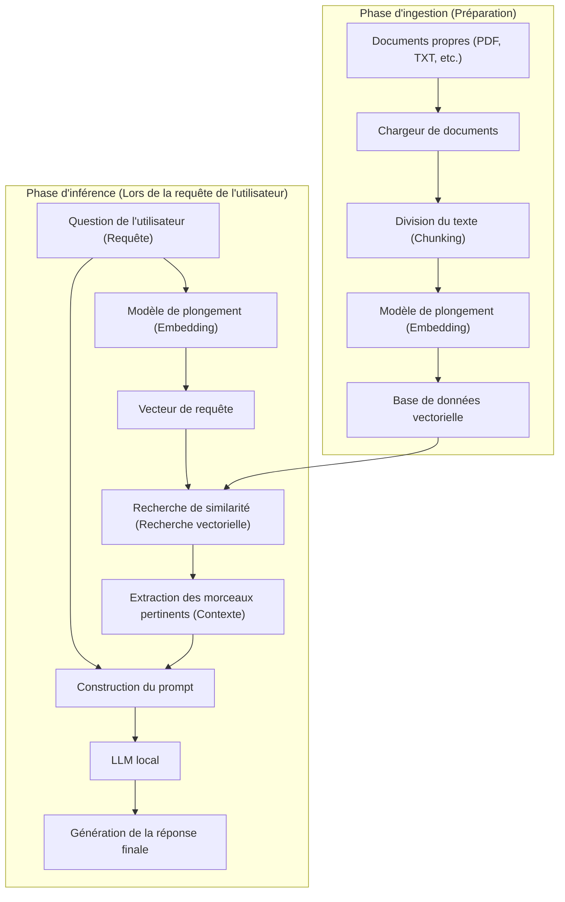
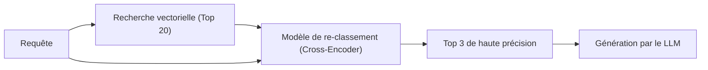

# Introduction

Ces dernières années, l'évolution des grands modèles de langage (LLM) a été remarquable, et de nombreuses IA telles que ChatGPT et Claude ont imprégné nos vies et nos entreprises. Cependant, les LLM généraux présentent une faiblesse évidente. Ils ne connaissent que les « informations publiques au moment de leur entraînement ». Naturellement, ils ne peuvent pas répondre aux questions concernant des « documents privés » tels que les règlements internes d'une entreprise, les notes personnelles ou les documents de projets non publiés. Si vous essayez de les forcer à répondre, le risque qu'ils génèrent des mensonges plausibles qui ne correspondent pas aux faits (hallucinations) augmente considérablement.

C'est pourquoi l'architecture technologique appelée **RAG (Retrieval-Augmented Generation : Génération Augmentée par la Recherche)** connaît actuellement une diffusion explosive dans le monde entier. L'utilisation du RAG permet de fournir dynamiquement des connaissances propres au LLM à partir d'une base de données externe, ce qui lui permet de générer des réponses précises et fondées.

De plus, lors du traitement d'informations confidentielles d'entreprise ou personnelles, l'envoi de données à des API basées sur le cloud telles qu'OpenAI est souvent inacceptable du point de vue de la politique de sécurité. C'est là qu'intervient la construction d'un « RAG local » combiné à une **IA locale** (un LLM qui fonctionne entièrement sur votre propre PC ou serveur sur site).

Dans cet article, nous expliquerons en détail la théorie de base du RAG, les méthodes concrètes d'implémentation d'un RAG local avec Python, le contexte mathématique (le fonctionnement de la recherche vectorielle) et les techniques avancées pour faire fonctionner le système en production.

---

# 1. Architecture globale du RAG

Le RAG n'est pas un modèle d'IA unique, mais une architecture système dans laquelle plusieurs composants collaborent. Il se compose principalement de deux phases : la « phase d'ingestion (importation des données) » et la « phase de recherche et de génération (Retrieval & Generation) ».

Le diagramme Mermaid ci-dessous montre la vue d'ensemble du système RAG.



## Phase d'ingestion (Préparation)
1. **Chargement des documents** : Chargez des données non structurées telles que des PDF, des documents Word, des fichiers texte, etc.
2. **Chunking (Division du texte)** : Divisez les textes longs en blocs significatifs (chunks) pour les adapter à la limite d'entrée (fenêtre de contexte) du LLM et pour améliorer la précision de la recherche.
3. **Embedding (Vectorisation)** : Entrez les chunks divisés dans un modèle de plongement (Embedding Model) et convertissez-les en un tableau de nombres (vecteur) de plusieurs centaines à plusieurs milliers de dimensions.
4. **Enregistrement dans la base de données** : Enregistrez les vecteurs convertis et les données textuelles d'origine associées dans une base de données vectorielle (Vector DB).

## Phase d'inférence (Lors de l'exécution)
1. **Vectorisation de la requête** : Vectorisez la question de l'utilisateur en utilisant le même modèle de plongement que celui de la préparation.
2. **Recherche de similarité** : Calculez la similarité entre le vecteur de la requête et les vecteurs des documents dans la base de données, et récupérez les chunks de texte les plus proches sémantiquement (les plus pertinents).
3. **Construction du prompt** : Combinez les textes pertinents obtenus comme « contexte (connaissances de base) » avec la question de l'utilisateur pour créer le prompt d'entrée pour le LLM.
4. **Génération de la réponse** : Le LLM reçoit le prompt augmenté et génère une réponse basée sur les informations de contexte fournies.

---

# 2. Compréhension approfondie de la recherche vectorielle et des plongements (Embeddings)

Le cœur du RAG est la « recherche vectorielle (recherche sémantique) ». Alors que la recherche par mots-clés traditionnelle (comme BM25) est basée sur la correspondance exacte et la fréquence des mots, la recherche vectorielle est basée sur la « similarité de sens ». Par exemple, même des mots différents comme « chien » et « chiot », ou « PC » et « ordinateur » seront trouvés si leur sens est proche.

## Qu'est-ce qu'un modèle de plongement (Embedding Model) ?

Un modèle de plongement est un réseau de neurones qui prend un texte en langage naturel en entrée et génère un vecteur dense de longueur fixe (Dense Vector). Les modèles courants (par exemple, `text-embedding-3-small` ou l'open source `multilingual-e5-large`) associent le texte à un vecteur de nombres réels de 384 ou 1024 dimensions.

Dans cet espace multidimensionnel (espace latent), l'apprentissage est fait de manière à ce que les textes ayant des significations similaires soient plus proches en termes de distance dans l'espace des coordonnées.

## Contexte mathématique du calcul de similarité : Similarité cosinus

Lorsque la base de données vectorielle recherche des documents pertinents, la mesure de distance la plus couramment utilisée est la **similarité cosinus (Cosine Similarity)**. Contrairement à la distance euclidienne (distance spatiale absolue), la similarité cosinus se concentre sur « l'angle entre deux vecteurs ». Étant donné qu'elle est peu affectée par la longueur du texte (la norme du vecteur), elle est très adaptée au calcul de similarité de textes.

Exprimée mathématiquement, la similarité cosinus des vecteurs $\mathbf{A}$ et $\mathbf{B}$ est la suivante :

$$ \text{Cosine Similarity}(\mathbf{A}, \mathbf{B}) = \cos(\theta) = \frac{\mathbf{A} \cdot \mathbf{B}}{\|\mathbf{A}\| \|\mathbf{B}\|} = \frac{\sum_{i=1}^{n} A_i B_i}{\sqrt{\sum_{i=1}^{n} A_i^2} \sqrt{\sum_{i=1}^{n} B_i^2}} $$

- $\mathbf{A} \cdot \mathbf{B}$ représente le produit scalaire (Dot Product).
- $\|\mathbf{A}\|$ représente la norme L2 (longueur) du vecteur $\mathbf{A}$.
- $n$ est le nombre de dimensions du vecteur.

La similarité cosinus prend une valeur comprise entre -1 et 1.
- **Proche de 1** : Les directions des deux vecteurs sont presque les mêmes (les sens sont très similaires)
- **Proche de 0** : Les deux vecteurs sont orthogonaux (aucun rapport)
- **Proche de -1** : Les directions des deux vecteurs sont opposées (les sens sont opposés)

Les bases de données vectorielles récentes (Chroma, FAISS, Qdrant, etc.) adoptent un algorithme de recherche des plus proches voisins approximatifs (ANN) appelé HNSW (Hierarchical Navigable Small World), optimisé pour rechercher des documents ayant une similarité cosinus élevée en millisecondes, même à partir de millions de données vectorielles.

---

# 3. Pile technologique pour construire un RAG local

Pour construire un RAG local complet qui ne dépend pas du cloud, nous tirerons parti de l'écosystème open source. Voici la pile technologique recommandée.

1. **Modèle de langage (LLM)**
   - Outils : `Ollama` ou `Llama.cpp`
   - Modèles : Des modèles ouverts légers et performants tels que `Llama-3-8B-Instruct`, `Gemma-2-9B-It`, `Qwen2-7B-Instruct`. Pour les tâches en japonais, des modèles ajustés pour le japonais comme `Llama-3-ELYZA-JP-8B` sont appropriés.
2. **Modèle de plongement (Embedding)**
   - Modèles : `intfloat/multilingual-e5-large` ou `BAAI/bge-m3`. Lors de l'exécution locale, il est courant de les télécharger depuis Hugging Face et de les exécuter avec Sentence-Transformers.
3. **Base de données vectorielle (Vector DB)**
   - `ChromaDB` : Basée sur Python, son installation est extrêmement simple. Idéale pour le développement local.
   - `FAISS` : Une bibliothèque de recherche vectorielle rapide développée par Meta.
   - `Qdrant` / `Milvus` : À plus grande échelle et destinées aux environnements de production.
4. **Framework d'orchestration**
   - `LangChain` : Le standard de facto pour relier les composants (Chain).
   - `LlamaIndex` : Un framework de connexion de données spécialement conçu pour le RAG.

Cette fois, nous l'implémenterons avec la combinaison la plus simple à introduire : **LangChain + ChromaDB + Ollama + HuggingFaceEmbeddings**.

---

# 4. Tutoriel d'implémentation : Construction complète d'un RAG local avec Python

À partir d'ici, nous allons construire un RAG local tout en écrivant du code Python. Au préalable, veuillez installer Ollama sur votre PC et le lancer en arrière-plan. De plus, téléchargez un modèle sur Ollama (exemple : `ollama run llama3`).

## Étape 1 : Installation des bibliothèques nécessaires

```bash
pip install langchain langchain-community langchain-huggingface
pip install chromadb sentence-transformers pypdf
```

## Étape 2 : Vue d'ensemble du code d'implémentation

Voici un script Python complet pour lire un fichier PDF, le vectoriser et permettre à un LLM local de répondre aux questions.

```python
import os
from langchain_community.document_loaders import PyPDFLoader
from langchain_text_splitters import RecursiveCharacterTextSplitter
from langchain_huggingface import HuggingFaceEmbeddings
from langchain_community.vectorstores import Chroma
from langchain_community.llms import Ollama
from langchain_core.prompts import PromptTemplate
from langchain.chains import RetrievalQA

def main():
    # 1. Chargement des documents
    print("Chargement des documents...")
    # Spécifiez le chemin du PDF que vous souhaitez charger
    file_path = "sample_company_policy.pdf" 
    loader = PyPDFLoader(file_path)
    documents = loader.load()

    # 2. Division en chunks (Text Splitting)
    # Diviser en tailles appropriées pour ne pas détruire le sens du texte
    text_splitter = RecursiveCharacterTextSplitter(
        chunk_size=500,     # Nombre maximum de caractères par chunk
        chunk_overlap=50,   # Nombre de caractères qui se chevauchent entre les chunks (empêche la rupture du contexte)
        separators=["\n\n", "\n", "。", "、", " ", ""]
    )
    chunks = text_splitter.split_documents(documents)
    print(f"Divisé en {len(chunks)} chunks.")

    # 3. Initialisation du modèle de plongement (Local HuggingFace Model)
    # Utilisation d'un modèle multilingue performant
    print("Chargement du modèle de plongement...")
    embeddings = HuggingFaceEmbeddings(
        model_name="intfloat/multilingual-e5-large",
        model_kwargs={'device': 'cpu'} # Si vous avez un GPU, 'cuda' ou 'mps'
    )

    # 4. Construction de la base de données vectorielle (Chroma)
    print("Construction de la base de données vectorielle...")
    persist_directory = "./chroma_db"
    vectorstore = Chroma.from_documents(
        documents=chunks,
        embedding=embeddings,
        persist_directory=persist_directory
    )
    # Création du système de recherche (Retriever). Configuration pour récupérer les 3 documents les plus pertinents
    retriever = vectorstore.as_retriever(search_kwargs={"k": 3})

    # 5. Initialisation du LLM local (Ollama)
    print("Connexion au LLM local...")
    # Assurez-vous d'obtenir le modèle au préalable avec 'ollama pull llama3' par exemple
    llm = Ollama(model="llama3")

    # 6. Définition du modèle de prompt
    prompt_template = """Vous êtes un excellent assistant qui connaît bien les règlements de l'entreprise et les informations internes.
Veuillez répondre en détail à la question de l'utilisateur en français, en utilisant uniquement le contexte (informations de base) ci-dessous.
Si vous ne trouvez pas la réponse dans le contexte, ne devinez pas et répondez honnêtement « Je ne sais pas à partir des informations fournies ».

【Contexte】
{context}

【Question】
{question}

【Réponse】:
"""
    PROMPT = PromptTemplate(
        template=prompt_template, 
        input_variables=["context", "question"]
    )

    # 7. Construction de la chaîne RAG
    qa_chain = RetrievalQA.from_chain_type(
        llm=llm,
        chain_type="stuff",
        retriever=retriever,
        return_source_documents=True, # Définir s'il faut renvoyer la source d'information
        chain_type_kwargs={"prompt": PROMPT}
    )

    # 8. Exécution de la question
    query = "Veuillez m'expliquer les conditions de remboursement des frais de transport pour le télétravail."
    print(f"\nQuestion : {query}\n")
    
    result = qa_chain.invoke({"query": query})
    
    print("【Réponse】")
    print(result['result'])
    print("\n---")
    print("【Sources consultées】")
    for doc in result['source_documents']:
        print(f"- Page {doc.metadata.get('page', 'inconnue')} : {doc.page_content[:50]}...")

if __name__ == "__main__":
    main()
```

## Explication des points clés du code

1. **RecursiveCharacterTextSplitter** :
   C'est le diviseur le plus recommandé pour la division du langage naturel. Il tente de diviser dans l'ordre par paragraphe (`\n\n`), ligne (`\n`) et point (`。`), en gardant les blocs de sens autant que possible tout en respectant la taille spécifiée `chunk_size`. En définissant `chunk_overlap`, on évite de perdre des informations aux limites du contexte.
2. **HuggingFaceEmbeddings** :
   `intfloat/multilingual-e5-large` est un modèle de plongement open source très puissant qui prend en charge plusieurs langues. Sans utiliser d'API cloud (telles que `text-embedding-ada-002` d'OpenAI), vous pouvez vectoriser le texte hors ligne en mémoire locale.
3. **ChromaDB** :
   Étant donné qu'il fonctionne en mémoire ou sur le stockage local (basé sur SQLite), il n'est pas nécessaire de mettre en place un serveur de base de données complexe. En spécifiant `persist_directory`, vous pouvez ignorer le processus de vectorisation lors de la réexécution et charger la base de données à partir du disque.

---

# 5. Techniques avancées de RAG (Advanced RAG Techniques)

Bien que le système RAG de base (Naive RAG) construit dans le tutoriel ci-dessus fonctionne, si une précision de réponse élevée est requise en production, l'introduction de techniques avancées telles que les suivantes sera nécessaire.

## 5.1 Recherche hybride (Hybrid Search)
Bien que la recherche vectorielle excelle à saisir le « sens », elle peut avoir des difficultés avec les recherches de mots-clés exacts tels que des « noms propres spécifiques », des « numéros de modèles de produits » ou des « identifiants d'employés ».
Par conséquent, en effectuant parallèlement une **recherche sémantique** basée sur la recherche vectorielle et une **recherche par mot-clé** utilisant un algorithme tel que BM25, puis en évaluant et en fusionnant les deux résultats (en utilisant des méthodes telles que Reciprocal Rank Fusion ; RRF), il est possible de réduire considérablement les omissions de recherche.

## 5.2 Re-classement (Re-ranking)
La recherche vectorielle est rapide, mais elle n'évalue pas nécessairement la pertinence contextuelle exacte du contexte. Un pipeline courant pour améliorer la précision de la recherche est le suivant :
1. **Recherche initiale (First-stage Retrieval)** : Récupérez largement et superficiellement environ 20 à 30 chunks pertinents à partir de la base de données vectorielle.
2. **Réévaluation (Re-ranking)** : Utilisez un autre modèle d'apprentissage automatique plus lourd appelé Cross-Encoder (par exemple : `bge-reranker`, etc.) pour entrer la paire de la requête de l'utilisateur et du chunk récupéré, et recalculez le score de pertinence sémantique.
3. **Sélection** : Seuls les 3 à 5 premiers résultats ayant les scores les plus élevés sont passés au prompt du LLM en tant que contexte final.

Cette méthode empêche les informations bruyantes non pertinentes d'être transmises au LLM et peut considérablement augmenter la précision (Precision) des réponses.



## 5.3 Chunking sémantique et recherche de document parent
Plutôt que de diviser mécaniquement le texte par un nombre fixe de caractères, il existe une technique appelée « Semantic Chunking » qui utilise l'IA pour détecter les changements de sens dans les phrases et les diviser.
De plus, dans une technique appelée « Parent Document Retriever (Recherche de document parent) », la vectorisation est effectuée en très petites unités (comme des phrases) pour la recherche afin d'obtenir une recherche très précise. Mais lorsqu'elle est transmise au LLM, c'est le « grand paragraphe d'origine (document parent) » contenant cette phrase qui est fourni, offrant ainsi un contexte suffisant au LLM.

---

# 6. Défis et solutions lors de l'exploitation d'un RAG local

Lors de la construction et de l'exploitation d'un RAG dans un environnement local, des obstacles spécifiques existent.

- **Épuisement de la VRAM (Mémoire vidéo)** :
  Pour faire fonctionner un LLM local à une vitesse pratique (des dizaines de tokens par seconde), le modèle doit être chargé dans la VRAM du GPU. Pour exécuter un modèle de classe 8B en fp16 (virgule flottante 16 bits), environ 16 Go de VRAM sont nécessaires. Cependant, en utilisant des technologies de **quantification (Quantization)** (techniques de compression en 4 bits ou 8 bits telles que les formats GGUF ou AWQ), il est possible de le faire fonctionner suffisamment vite même avec 8 Go de VRAM (PC de jeu standard, etc.). Llama.cpp et Ollama prennent en charge ces formats quantifiés de manière native.
- **Limite de la fenêtre de contexte** :
  Si la quantité de contexte récupérée par la recherche est trop importante, elle peut dépasser la limite d'entrée du LLM (limite de tokens), ou le modèle peut oublier les parties intermédiaires de l'information (phénomène de Lost in the middle). L'ajustement du nombre de chunks extraits et la sélection stricte à l'aide de la technologie de re-classement mentionnée ci-dessus sont essentiels.
- **Gestion de la fraîcheur des données** :
  Lorsque le document source est mis à jour, les vecteurs du document correspondant dans la base de données vectorielle doivent également être mis à jour/supprimés (opérations CRUD). Étant donné que ChromaDB prend en charge les mises à jour basées sur les identifiants de documents, il est pratique de mettre en place un traitement par lots qui gère les valeurs de hachage des fichiers et ne synchronise que les différences.

---

# Conclusion

Le RAG (Génération Augmentée par la Recherche) est un paradigme puissant qui fait évoluer l'IA d'un assistant généraliste typique vers « votre expert exclusif » ou un « expert spécialisé dans les opérations internes ».

Nous avons vu que même pour des exigences hautement confidentielles où les services cloud ne peuvent pas être utilisés, un environnement « RAG local » complet peut être construit relativement facilement en combinant l'écosystème open source comme Ollama, LangChain et ChromaDB.

En vous basant sur la compréhension mathématique de l'espace vectoriel, la division de texte et les approches avancées telles que le re-classement expliquées dans cet article, n'hésitez pas à développer votre propre système d'IA original en utilisant vos propres données. La vitesse d'évolution de l'IA locale est stupéfiante, et le système que vous construisez aujourd'hui peut voir ses performances mises à jour instantanément, simplement en le remplaçant par un modèle léger encore plus intelligent qui sortira demain.

---
*Dans ce blog, nous continuerons à publier des articles approfondis sur la technologie de l'IA et le RAG. Si vous avez des questions ou des commentaires, n'hésitez pas à nous en faire part dans la section des commentaires.*
