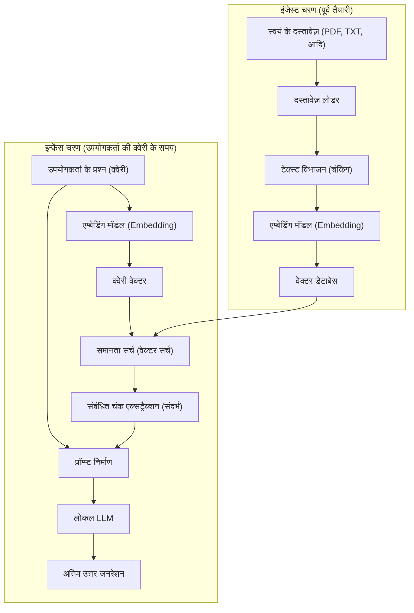
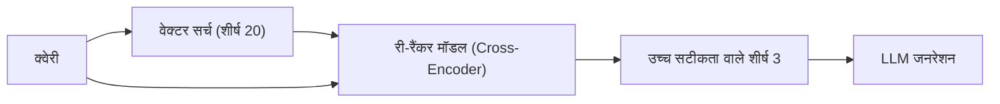

# परिचय

हाल के वर्षों में, लार्ज लैंग्वेज मॉडल (LLM) का विकास उल्लेखनीय रहा है, और ChatGPT और Claude जैसी कई AI हमारी जिंदगी और काम का अहम हिस्सा बन गई हैं। हालाँकि, सामान्य LLMs की एक स्पष्ट कमजोरी होती है। वह यह है कि वे केवल "ट्रेनिंग के समय उपलब्ध सार्वजनिक जानकारी" ही जानते हैं। स्वाभाविक रूप से, वे कंपनी के नियमों, व्यक्तिगत नोट्स, और अप्रकाशित प्रोजेक्ट दस्तावेज़ों जैसे "निजी दस्तावेज़ों" के बारे में सवालों का जवाब नहीं दे सकते। यदि आप उन्हें जबरदस्ती जवाब देने के लिए कहते हैं, तो इस बात का बहुत अधिक जोखिम होता है कि वे मनगढ़ंत और झूठी जानकारी (हैलुसिनेशन) उत्पन्न कर दें।

इसलिए, वर्तमान में दुनिया भर में **RAG (Retrieval-Augmented Generation: रिट्रीवल-ऑगमेंटेड जनरेशन)** नामक एक तकनीकी आर्किटेक्चर तेजी से लोकप्रिय हो रहा है। RAG का उपयोग करके, बाहरी डेटाबेस से LLM को गतिशील रूप से अपना खुद का ज्ञान प्रदान करना और इसके आधार पर सटीक और प्रामाणिक उत्तर उत्पन्न करना संभव है।

इसके अलावा, जब एंटरप्राइज़ क्षेत्र या व्यक्तिगत गोपनीय जानकारी से निपटते हैं, तो सुरक्षा नीतियों के कारण OpenAI जैसे क्लाउड-आधारित API में डेटा भेजना अक्सर अस्वीकार्य होता है। ऐसी स्थिति में, एक **लोकल AI** (एक LLM जो आपके अपने PC या ऑन-प्रिमाइस सर्वर पर पूरी तरह से चलता है) के साथ संयुक्त "लोकल RAG" का निर्माण आवश्यक हो जाता है।

इस लेख में, हम RAG के बुनियादी सिद्धांत से लेकर, Python का उपयोग करके लोकल RAG के विशिष्ट इम्प्लीमेंटेशन, इसके गणितीय आधार (वेक्टर सर्च कैसे काम करता है), और सिस्टम को उत्पादन (प्रोडक्शन) में चलाने की उन्नत तकनीकों तक सब कुछ विस्तार से समझाएंगे।

---

# 1. RAG का समग्र आर्किटेक्चर

RAG कोई एक AI मॉडल नहीं है, बल्कि एक सिस्टम आर्किटेक्चर है जहां कई कंपोनेंट्स एक साथ काम करते हैं। इसे मुख्य रूप से दो चरणों में बांटा जा सकता है: "इंजेस्ट (डेटा इनपुट) चरण" और "रिट्रीवल और जनरेशन (सर्च और जनरेशन) चरण"।

नीचे दिया गया Mermaid आरेख RAG सिस्टम का समग्र दृश्य दिखाता है।



## इंजेस्ट चरण (पूर्व तैयारी)
1. **दस्तावेज़ों को पढ़ना**: PDF, Word, और टेक्स्ट फ़ाइलों जैसे अनस्ट्रक्चर्ड डेटा को लोड किया जाता है।
2. **चंकिंग (टेक्स्ट विभाजन)**: LLM की इनपुट सीमा (संदर्भ विंडो) के भीतर फिट होने और सर्च सटीकता में सुधार करने के लिए, लंबे टेक्स्ट को अर्थपूर्ण भागों (चंक्स) में विभाजित किया जाता है।
3. **एम्बेडिंग (वेक्टराइजेशन)**: विभाजित चंक्स को एक एम्बेडिंग मॉडल (Embedding Model) में इनपुट किया जाता है और सैकड़ों से हजारों आयामों वाले संख्याओं की एक ऐरे (वेक्टर) में बदल दिया जाता है।
4. **डेटाबेस में सेव करना**: परिवर्तित वेक्टर्स और मूल टेक्स्ट डेटा को एक साथ जोड़ा जाता है और एक वेक्टर डेटाबेस (Vector DB) में सेव किया जाता है।

## इन्फ्रेंस चरण (रनटाइम)
1. **क्वेरी का वेक्टराइजेशन**: पूर्व तैयारी के समान एम्बेडिंग मॉडल का उपयोग करके उपयोगकर्ता के प्रश्न को एक वेक्टर में बदल दिया जाता है।
2. **समानता सर्च (Similarity Search)**: डेटाबेस में क्वेरी वेक्टर और दस्तावेज़ वेक्टर्स के बीच समानता की गणना की जाती है, और अर्थपूर्ण रूप से निकटतम (अत्यधिक प्रासंगिक) टेक्स्ट चंक्स में से शीर्ष कुछ को प्राप्त किया जाता है।
3. **प्रॉम्प्ट का निर्माण**: प्राप्त संबंधित टेक्स्ट को उपयोगकर्ता के प्रश्न के साथ "संदर्भ (पृष्ठभूमि ज्ञान)" के रूप में जोड़ा जाता है ताकि LLM के लिए एक इनपुट प्रॉम्प्ट बनाया जा सके।
4. **उत्तर का जनरेशन**: विस्तारित प्रॉम्प्ट प्राप्त करने वाला LLM प्रदान की गई संदर्भ जानकारी के आधार पर एक उत्तर उत्पन्न करता है।

---

# 2. वेक्टर सर्च और एम्बेडिंग (Embeddings) की गहरी समझ

RAG का मूल "वेक्टर सर्च (सिमेंटिक सर्च)" है। पारंपरिक कीवर्ड सर्च (जैसे BM25) के विपरीत, जो सटीक शब्द मिलान या आवृत्ति पर आधारित होता है, वेक्टर सर्च "अर्थ की समानता" पर आधारित होता है। उदाहरण के लिए, भले ही शब्द भिन्न हों जैसे "कुत्ता" और "पिल्ला", या "PC" और "कंप्यूटर", वे सर्च में दिखाई देंगे यदि उनके अर्थ करीब हैं।

## एम्बेडिंग मॉडल (Embedding Model) क्या है?

एक एम्बेडिंग मॉडल एक न्यूरल नेटवर्क है जो प्राकृतिक भाषा के टेक्स्ट को इनपुट के रूप में लेता है और एक फिक्स्ड-लेंथ डेंस वेक्टर (Dense Vector) आउटपुट करता है। सामान्य मॉडल (जैसे `text-embedding-3-small` या ओपन-सोर्स `multilingual-e5-large`) टेक्स्ट को 384-आयामी या 1024-आयामी वास्तविक संख्या वेक्टर में मैप करते हैं।

इस बहुआयामी स्पेस (लेटेंट स्पेस) में, मॉडल को इस तरह से प्रशिक्षित किया जाता है कि समान अर्थ वाले वाक्यों की कोआर्डिनेट स्पेस में दूरी कम हो।

## समानता गणना की गणितीय पृष्ठभूमि: कोसाइन समानता (Cosine Similarity)

जब एक वेक्टर डेटाबेस संबंधित दस्तावेज़ों को खोजता है, तो सबसे अधिक इस्तेमाल किया जाने वाला दूरी मीट्रिक **कोसाइन समानता (Cosine Similarity)** है। यूक्लिडियन दूरी (पूर्ण स्थानिक दूरी) के विपरीत, कोसाइन समानता "दो वेक्टर्स के बीच के कोण" पर केंद्रित होती है। क्योंकि यह वाक्यों की लंबाई (वेक्टर नॉर्म) से कम प्रभावित होती है, यह टेक्स्ट समानता की गणना के लिए बहुत उपयुक्त है।

गणितीय रूप से व्यक्त किया गया, वेक्टर $\mathbf{A}$ और $\mathbf{B}$ की कोसाइन समानता इस प्रकार है:

$$ \text{Cosine Similarity}(\mathbf{A}, \mathbf{B}) = \cos(\theta) = \frac{\mathbf{A} \cdot \mathbf{B}}{\|\mathbf{A}\| \|\mathbf{B}\|} = \frac{\sum_{i=1}^{n} A_i B_i}{\sqrt{\sum_{i=1}^{n} A_i^2} \sqrt{\sum_{i=1}^{n} B_i^2}} $$

- $\mathbf{A} \cdot \mathbf{B}$ डॉट प्रोडक्ट (Dot Product) को दर्शाता है।
- $\|\mathbf{A}\|$ वेक्टर $\mathbf{A}$ के L2 नॉर्म (लंबाई) को दर्शाता है।
- $n$ वेक्टर के आयामों की संख्या है।

कोसाइन समानता का मान -1 से 1 के बीच होता है:
- **1 के करीब**: दो वेक्टर्स की दिशा लगभग समान होती है (अर्थ बहुत समान हैं)।
- **0 के करीब**: दो वेक्टर्स एक-दूसरे के समकोण पर हैं (असंबंधित)।
- **-1 के करीब**: दो वेक्टर्स विपरीत दिशाओं में हैं (अर्थ विपरीत हैं)।

नवीनतम वेक्टर DBs (Chroma, FAISS, Qdrant, आदि) HNSW (Hierarchical Navigable Small World) नामक एक अनुमानित निकटतम पड़ोसी (Approximate Nearest Neighbor - ANN) एल्गोरिदम का उपयोग करते हैं, जो लाखों वेक्टर डेटा से मिलीसेकंड में उच्च कोसाइन समानता वाले दस्तावेज़ों को खोजने के लिए अनुकूलित है।

---

# 3. लोकल RAG के निर्माण के लिए तकनीकी स्टैक

क्लाउड से स्वतंत्र पूरी तरह से लोकल RAG बनाने के लिए, हम ओपन-सोर्स इकोसिस्टम का लाभ उठाते हैं। नीचे अनुशंसित तकनीकी स्टैक दिया गया है:

1. **लैंग्वेज मॉडल (LLM)**
   - टूल्स: `Ollama` या `Llama.cpp`
   - मॉडल: `Llama-3-8B-Instruct`, `Gemma-2-9B-It`, `Qwen2-7B-Instruct` जैसे हल्के और उच्च-प्रदर्शन वाले ओपन मॉडल। जापानी कार्यों के लिए, जापानी-ट्यून किए गए `Llama-3-ELYZA-JP-8B` आदि उपयुक्त हैं।
2. **एम्बेडिंग मॉडल (Embedding)**
   - मॉडल: `intfloat/multilingual-e5-large` या `BAAI/bge-m3`। जब इसे लोकली चलाया जाता है, तो आमतौर पर इसे Hugging Face से डाउनलोड किया जाता है और Sentence-Transformers के साथ निष्पादित किया जाता है।
3. **वेक्टर डेटाबेस (Vector DB)**
   - `ChromaDB`: Python-आधारित और सेट अप करने में बेहद आसान। लोकल डेवलपमेंट के लिए आदर्श।
   - `FAISS`: Meta द्वारा विकसित एक तेज़ वेक्टर सर्च लाइब्रेरी।
   - `Qdrant` / `Milvus`: बड़े पैमाने और उत्पादन (प्रोडक्शन) वातावरण के लिए अधिक उपयुक्त।
4. **ऑर्केस्ट्रेशन फ्रेमवर्क**
   - `LangChain`: कंपोनेंट्स को जोड़ने (Chain) के लिए वास्तविक मानक (de facto standard)।
   - `LlamaIndex`: विशेष रूप से RAG के लिए एक डेटा कनेक्शन फ्रेमवर्क।

इस बार, हम **LangChain + ChromaDB + Ollama + HuggingFaceEmbeddings** के संयोजन का उपयोग करके इसे लागू करेंगे, जिसे इंस्टॉल करना सबसे आसान है।

---

# 4. इम्प्लीमेंटेशन ट्यूटोरियल: Python का उपयोग करके पूर्ण लोकल RAG का निर्माण

यहाँ से, हम वास्तव में Python कोड लिखते हुए एक लोकल RAG बनाएंगे। कृपया सुनिश्चित करें कि Ollama आपके PC पर स्थापित है और पहले से ही बैकग्राउंड में चल रहा है। इसके अलावा, Ollama पर मॉडल को पुल करें (उदाहरण के लिए: `ollama run llama3`)।

## चरण 1: आवश्यक लाइब्रेरीज़ इंस्टॉल करना

```bash
pip install langchain langchain-community langchain-huggingface
pip install chromadb sentence-transformers pypdf
```

## चरण 2: सम्पूर्ण इम्प्लीमेंटेशन कोड

नीचे एक पूर्ण Python स्क्रिप्ट दी गई है जो PDF फ़ाइलों को पढ़ती है, उन्हें वेक्टराइज करती है, और एक लोकल LLM को प्रश्नों का उत्तर देने की अनुमति देती है।

```python
import os
from langchain_community.document_loaders import PyPDFLoader
from langchain_text_splitters import RecursiveCharacterTextSplitter
from langchain_huggingface import HuggingFaceEmbeddings
from langchain_community.vectorstores import Chroma
from langchain_community.llms import Ollama
from langchain_core.prompts import PromptTemplate
from langchain.chains import RetrievalQA

def main():
    # 1. दस्तावेज़ लोड करना
    print("दस्तावेज़ लोड हो रहा है...")
    # आप जिस PDF को पढ़ना चाहते हैं उसका पाथ निर्दिष्ट करें
    file_path = "sample_company_policy.pdf" 
    loader = PyPDFLoader(file_path)
    documents = loader.load()

    # 2. चंक विभाजन (Text Splitting)
    # वाक्यों के अर्थ को नष्ट किए बिना उन्हें उचित आकार में विभाजित करें
    text_splitter = RecursiveCharacterTextSplitter(
        chunk_size=500,     # प्रति चंक अधिकतम कैरेक्टर्स
        chunk_overlap=50,   # आसन्न चंक्स में ओवरलैपिंग कैरेक्टर्स (संदर्भ के टूटने को रोकने के लिए)
        separators=["\n\n", "\n", "।", "、", " ", ""]
    )
    chunks = text_splitter.split_documents(documents)
    print(f"{len(chunks)} चंक्स में विभाजित किया गया।")

    # 3. एम्बेडिंग मॉडल का इनिशियलाइज़ेशन (Local HuggingFace Model)
    # मजबूत बहुभाषी मॉडल का उपयोग करें
    print("एम्बेडिंग मॉडल लोड हो रहा है...")
    embeddings = HuggingFaceEmbeddings(
        model_name="intfloat/multilingual-e5-large",
        model_kwargs={'device': 'cpu'} # अगर GPU है तो 'cuda' या 'mps'
    )

    # 4. वेक्टर डेटाबेस का निर्माण (Chroma)
    print("वेक्टर डेटाबेस का निर्माण हो रहा है...")
    persist_directory = "./chroma_db"
    vectorstore = Chroma.from_documents(
        documents=chunks,
        embedding=embeddings,
        persist_directory=persist_directory
    )
    # रिट्रीवर (Retriever) बनाना। शीर्ष 3 प्रासंगिक दस्तावेज़ प्राप्त करने के लिए सेट किया गया
    retriever = vectorstore.as_retriever(search_kwargs={"k": 3})

    # 5. लोकल LLM का इनिशियलाइज़ेशन (Ollama)
    print("लोकल LLM से कनेक्ट हो रहा है...")
    # 'ollama pull llama3' आदि के साथ पहले से मॉडल प्राप्त करना सुनिश्चित करें
    llm = Ollama(model="llama3")

    # 6. प्रॉम्प्ट टेम्पलेट की परिभाषा
    prompt_template = """आप एक बेहतरीन सहायक हैं जो कंपनी के नियमों और आंतरिक जानकारी से अच्छी तरह वाकिफ हैं।
कृपया उपयोगकर्ता के प्रश्न का हिंदी में विस्तार से उत्तर देने के लिए केवल निम्नलिखित संदर्भ (पृष्ठभूमि जानकारी) का उपयोग करें।
यदि आपको संदर्भ में उत्तर नहीं मिल रहा है, तो कृपया अनुमान न लगाएं और ईमानदारी से कहें, "प्रदान की गई जानकारी से मैं उत्तर नहीं दे सकता।"

【संदर्भ】
{context}

【प्रश्न】
{question}

【उत्तर】:
"""
    PROMPT = PromptTemplate(
        template=prompt_template, 
        input_variables=["context", "question"]
    )

    # 7. RAG चेन का निर्माण
    qa_chain = RetrievalQA.from_chain_type(
        llm=llm,
        chain_type="stuff",
        retriever=retriever,
        return_source_documents=True, # क्या स्रोत दस्तावेज़ वापस करने हैं, यह सेट करें
        chain_type_kwargs={"prompt": PROMPT}
    )

    # 8. प्रश्न का निष्पादन
    query = "रिमोट वर्क के लिए परिवहन खर्च के भत्ते की शर्तों के बारे में बताएं।"
    print(f"\nप्रश्न: {query}\n")
    
    result = qa_chain.invoke({"query": query})
    
    print("【उत्तर】")
    print(result['result'])
    print("\n---")
    print("【संदर्भित स्रोत】")
    for doc in result['source_documents']:
        print(f"- पृष्ठ {doc.metadata.get('page', 'अज्ञात')}: {doc.page_content[:50]}...")

if __name__ == "__main__":
    main()
```

## कोड के मुख्य बिंदुओं की व्याख्या

1. **RecursiveCharacterTextSplitter**:
   यह प्राकृतिक भाषा को विभाजित करने के लिए सबसे अधिक अनुशंसित स्प्लिटर है। यह पैराग्राफ (`\n\n`), लाइन्स (`\n`), और पूर्ण विराम (`。` या `।`) के क्रम में विभाजित करने का प्रयास करता है, और अर्थ को यथासंभव संरक्षित रखते हुए निर्दिष्ट `chunk_size` में फिट होने के लिए विभाजित करता है। `chunk_overlap` सेट करके, यह संदर्भ की सीमाओं को टूटने और जानकारी के नुकसान को रोकता है।
2. **HuggingFaceEmbeddings**:
   `intfloat/multilingual-e5-large` एक बहुत शक्तिशाली ओपन-सोर्स एम्बेडिंग मॉडल है जो कई भाषाओं का समर्थन करता है। क्लाउड API (जैसे OpenAI का `text-embedding-ada-002`) का उपयोग किए बिना, आप टेक्स्ट को ऑफलाइन अपनी लोकल मेमोरी में वेक्टराइज़ कर सकते हैं।
3. **ChromaDB**:
   चूंकि यह इन-मेमोरी या लोकल स्टोरेज (SQLite पर आधारित) में काम करता है, इसलिए किसी जटिल डेटाबेस सर्वर को स्थापित करने की आवश्यकता नहीं है। `persist_directory` को निर्दिष्ट करके, आप फिर से निष्पादित करते समय वेक्टराइजेशन प्रक्रिया को छोड़ सकते हैं और डेटाबेस को डिस्क से लोड कर सकते हैं।

---

# 5. उन्नत RAG तकनीकें (Advanced RAG Techniques)

उपरोक्त ट्यूटोरियल में बनाया गया बुनियादी RAG सिस्टम (Naive RAG) काम करेगा, लेकिन यदि उत्पादन वातावरण में उच्च उत्तर सटीकता की आवश्यकता है, तो आपको निम्नलिखित उन्नत तकनीकों को पेश करने की आवश्यकता होगी:

## 5.1 हाइब्रिड सर्च (Hybrid Search)
वेक्टर सर्च "अर्थ" को पकड़ने में अच्छा है, लेकिन यह सटीक कीवर्ड खोजों जैसे "विशिष्ट उचित संज्ञा (proper nouns)", "उत्पाद मॉडल संख्या", या "कर्मचारी ID" के साथ संघर्ष कर सकता है।
इसलिए, वेक्टर सर्च के माध्यम से **सिमेंटिक सर्च** और BM25 एल्गोरिदम आदि का उपयोग करके **कीवर्ड सर्च** समानांतर में करके, और दोनों परिणामों को स्कोरिंग और एकीकृत करके (रेसिप्रोकल रैंक फ्यूजन; RRF जैसी तकनीकों का उपयोग करके), आप छूटे हुए सर्च परिणामों को काफी कम कर सकते हैं।

## 5.2 री-रैंकिंग (Re-ranking)
वेक्टर सर्च तेज है, लेकिन यह हमेशा संदर्भ की सटीक प्रासंगिकता का आकलन नहीं करता है। सर्च सटीकता में सुधार के लिए एक सामान्य पाइपलाइन इस प्रकार है:
1. **प्रारंभिक सर्च (First-stage Retrieval)**: वेक्टर DB से मोटे तौर पर और सतही तौर पर लगभग 20-30 संबंधित चंक्स प्राप्त किए जाते हैं।
2. **पुनर्मूल्यांकन (Re-ranking)**: एक अन्य भारी मशीन लर्निंग मॉडल जिसे Cross-Encoder कहा जाता है (उदाहरण के लिए: `bge-reranker` आदि) का उपयोग करके, उपयोगकर्ता की क्वेरी और प्राप्त चंक्स की जोड़ी को इनपुट किया जाता है, और सिमेंटिक प्रासंगिकता स्कोर की पुनर्गणना की जाती है।
3. **चयन**: केवल उच्चतम स्कोर वाले शीर्ष 3-5 चंक्स को अंतिम संदर्भ के रूप में LLM के प्रॉम्प्ट में पास किया जाता है।

यह तकनीक अप्रासंगिक नॉइज़ जानकारी को LLM तक पहुंचने से रोकती है और उत्तर की सटीकता (Precision) में काफी सुधार करती है।



## 5.3 सिमेंटिक चंकिंग और पेरेंट दस्तावेज़ सर्च
वाक्यों को उनकी निश्चित लंबाई के आधार पर यंत्रवत विभाजित करने के बजाय, "सिमेंटिक चंकिंग (Semantic Chunking)" नामक एक तकनीक है जो वाक्यों के अर्थ में परिवर्तन का पता लगाने और तदनुसार उन्हें विभाजित करने के लिए AI का उपयोग करती है।
इसके अलावा, "पेरेंट डॉक्यूमेंट रिट्रीवर (Parent Document Retriever)" तकनीक में, सटीक सर्च प्राप्त करने के लिए सर्च के उद्देश्य से वेक्टरकरण बहुत छोटी इकाइयों (जैसे वाक्यों) में किया जाता है, लेकिन जब इसे LLM को पास किया जाता है, तो "मूल बड़ा पैराग्राफ (पेरेंट दस्तावेज़)" जिसमें वह वाक्य शामिल होता है, LLM को पर्याप्त संदर्भ प्रदान करने के लिए पास किया जाता है।

---

# 6. लोकल RAG को संचालित करते समय चुनौतियां और समाधान

जब लोकल वातावरण में RAG के निर्माण और संचालन की बात आती है, तो कुछ विशिष्ट बाधाएं होती हैं।

- **VRAM (वीडियो मेमोरी) की कमी**:
  व्यावहारिक गति (दसियों टोकन प्रति सेकंड) पर एक लोकल LLM चलाने के लिए, मॉडल को GPU के VRAM में लोड करने की आवश्यकता होती है। एक 8B क्लास मॉडल को fp16 (16-बिट फ्लोटिंग पॉइंट) में चलाने के लिए लगभग 16GB VRAM की आवश्यकता होती है, लेकिन **क्वांटाइजेशन (Quantization)** तकनीक (GGUF या AWQ प्रारूप जैसे इसे 4-बिट या 8-बिट में संपीड़ित करने की तकनीक) का उपयोग करके, इसे 8GB VRAM (जैसे सामान्य गेमिंग PC) के साथ भी काफी तेज गति से चलाना संभव है। Llama.cpp और Ollama मानक रूप से इन क्वांटाइजेशन प्रारूपों का समर्थन करते हैं।
- **संदर्भ विंडो (Context Window) की सीमाएं**:
  यदि सर्च के माध्यम से प्राप्त संदर्भ की मात्रा बहुत अधिक है, तो यह LLM की इनपुट सीमा (टोकन सीमा) को पार कर सकती है, या मॉडल जानकारी के मध्य भाग को भूल सकता है (Lost in the middle की घटना)। निकाले गए चंक्स की संख्या को समायोजित करना और पहले बताई गई री-रैंकिंग तकनीक के माध्यम से उन्हें सावधानीपूर्वक चुनना आवश्यक है।
- **डेटा की ताजगी (Data Freshness) का प्रबंधन**:
  जब स्रोत दस्तावेज़ अपडेट किया जाता है, तो वेक्टर डेटाबेस में संबंधित दस्तावेज़ के वेक्टर को भी अपडेट या हटाया (CRUD ऑपरेशन) जाना चाहिए। चूंकि ChromaDB दस्तावेज़ ID के आधार पर अपडेट करने का समर्थन करता है, इसलिए फ़ाइल के हैश मान को प्रबंधित करना और केवल अंतर (differences) को सिंक्रनाइज़ करने के लिए एक बैच प्रक्रिया (batch process) सेट अप करना व्यावहारिक है।

---

# निष्कर्ष

RAG (रिट्रीवल-ऑगमेंटेड जनरेशन) एक शक्तिशाली प्रतिमान (paradigm) है जो AI को एक सामान्य-उद्देश्य सहायक से "आपके अपने विशेष विशेषज्ञ" या "कंपनी के संचालन में एक विशेषज्ञ" के रूप में विकसित करता है।

हमने सीखा कि यहां तक ​​कि अत्यधिक गोपनीय आवश्यकताओं के लिए भी जहां क्लाउड सेवाओं का उपयोग नहीं किया जा सकता है, Ollama, LangChain, और ChromaDB जैसे ओपन-सोर्स इकोसिस्टम को मिलाकर पूरी तरह से "लोकल RAG" वातावरण बनाना अपेक्षाकृत आसान है।

इस लेख में समझाए गए वेक्टर स्पेस की गणितीय समझ, और टेक्स्ट विभाजन (text splitting) और री-रैंकिंग (re-ranking) जैसे उन्नत दृष्टिकोणों के आधार पर, कृपया अपने स्वयं के डेटा का उपयोग करके अपना मूल AI सिस्टम विकसित करने का प्रयास करें। लोकल AI के विकास की गति चौंका देने वाली है, और जो सिस्टम आप आज बनाते हैं उसे कल आने वाले एक और भी अधिक स्मार्ट और हल्के मॉडल के साथ बदलकर तुरंत अपडेट किया जा सकता है।

---
*यह ब्लॉग AI तकनीक और RAG पर गहन लेख प्रकाशित करता रहेगा। यदि आपके कोई प्रश्न या प्रतिक्रिया (feedback) है, तो कृपया उन्हें टिप्पणी अनुभाग (comments section) में छोड़ें।*
