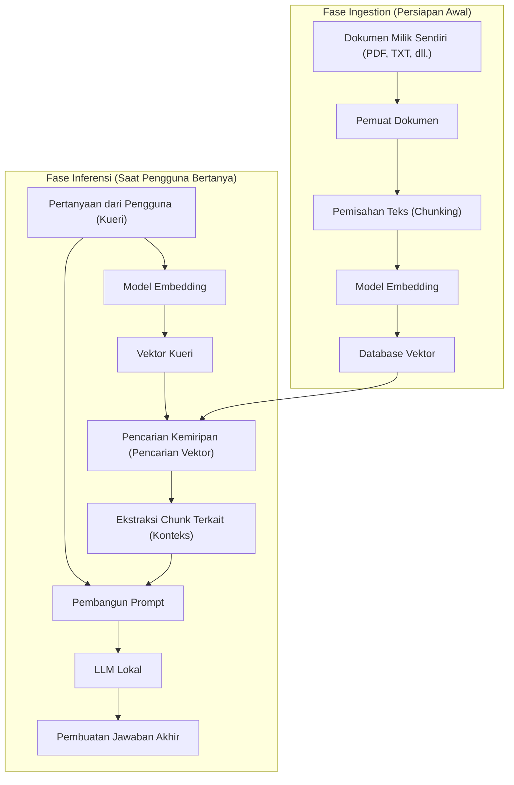
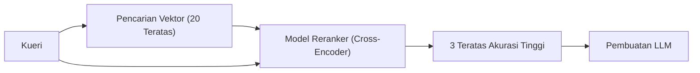

# Pendahuluan

Dalam beberapa tahun terakhir, evolusi Large Language Models (LLM) sangat luar biasa, dengan banyak AI seperti ChatGPT dan Claude menyusup ke kehidupan dan pekerjaan kita. Namun, LLM umum memiliki kelemahan yang jelas. Yaitu mereka hanya mengetahui "informasi publik pada saat pelatihan". Secara alami, mereka tidak dapat menjawab pertanyaan mengenai "dokumen pribadi" seperti peraturan internal perusahaan, catatan pribadi, dan materi proyek yang belum dipublikasikan. Jika Anda memaksanya untuk menjawab, ada risiko tinggi bahwa ia akan menghasilkan kebohongan yang masuk akal tetapi bertentangan dengan fakta (halusinasi).

Oleh karena itu, arsitektur teknologi yang saat ini meledak dalam popularitas di seluruh dunia adalah **RAG (Retrieval-Augmented Generation)**. Dengan menggunakan RAG, dimungkinkan untuk secara dinamis memberikan pengetahuan unik dari basis data eksternal ke LLM, memungkinkannya untuk menghasilkan jawaban yang akurat dan berdasar berdasarkan pengetahuan tersebut.

Selain itu, ketika menangani area perusahaan atau informasi rahasia pribadi, mengirim data ke API berbasis cloud seperti OpenAI seringkali tidak diizinkan berdasarkan kebijakan keamanan. Di sinilah dibutuhkan pembangunan "RAG lokal" yang dikombinasikan dengan **AI lokal** (LLM yang beroperasi secara mandiri di PC Anda sendiri atau server on-premise).

Dalam artikel ini, kami akan menjelaskan secara mendalam mulai dari teori dasar RAG, metode implementasi spesifik dari RAG lokal menggunakan Python, latar belakang matematis (mekanisme pencarian vektor), hingga teknik lanjutan untuk menjalankan sistem di lingkungan produksi.

---

# 1. Arsitektur Keseluruhan RAG

RAG bukanlah model AI tunggal, melainkan arsitektur sistem tempat berbagai komponen bekerja sama. Secara garis besar, ia terdiri dari dua fase: "Fase Ingestion (Pemasukan Data)" dan "Fase Retrieval & Generation (Pencarian dan Pembuatan)".

Diagram Mermaid berikut menunjukkan gambaran keseluruhan sistem RAG.



## Fase Ingestion (Persiapan Awal)
1. **Pemuatan Dokumen**: Memuat data tidak terstruktur seperti PDF, Word, dan file teks.
2. **Chunking (Pemisahan Teks)**: Untuk menyesuaikan batasan input LLM (jendela konteks) dan untuk meningkatkan akurasi pencarian, teks panjang dipisahkan menjadi bagian-bagian (chunk) yang bermakna.
3. **Embedding (Vektorisasi)**: Chunk yang telah dipisahkan dimasukkan ke dalam model embedding (Embedding Model) dan diubah menjadi array numerik (vektor) dengan dimensi ratusan hingga ribuan.
4. **Penyimpanan ke Database**: Menyimpan vektor yang telah diubah beserta data teks aslinya ke dalam database vektor (Vector DB) dengan saling menautkan satu sama lain.

## Fase Inferensi (Saat Dijalankan)
1. **Vektorisasi Kueri**: Kalimat pertanyaan dari pengguna divektorisasi menggunakan model embedding yang sama dengan yang digunakan saat persiapan awal.
2. **Pencarian Kemiripan**: Perhitungan kemiripan dilakukan antara vektor kueri dan vektor dokumen di dalam database, dan sejumlah kecil teks chunk teratas yang secara semantik dekat (relevansi tinggi) akan diambil.
3. **Pembangunan Prompt**: Teks terkait yang diambil akan digabungkan dengan kalimat pertanyaan pengguna sebagai "konteks (pengetahuan latar belakang)" untuk membuat prompt input bagi LLM.
4. **Pembuatan Jawaban**: LLM, yang menerima prompt yang telah diperluas, akan menghasilkan jawaban berdasarkan informasi konteks yang diberikan.

---

# 2. Pemahaman Mendalam tentang Pencarian Vektor dan Embeddings

Inti dari RAG adalah "pencarian vektor (pencarian semantik)". Sementara pencarian kata kunci tradisional (seperti BM25) didasarkan pada kecocokan kata yang tepat atau frekuensi, pencarian vektor didasarkan pada "kemiripan makna". Misalnya, kata yang berbeda seperti "anjing" dan "anak anjing", atau "PC" dan "komputer pribadi" akan cocok dalam pencarian jika maknanya mirip.

## Apa itu Model Embedding (Embedding Model)?

Model embedding adalah jaringan saraf yang menerima teks bahasa alami sebagai input dan mengeluarkan vektor padat (Dense Vector) dengan panjang tetap. Model umum (misalnya `text-embedding-3-small` atau sumber terbuka `multilingual-e5-large`) memetakan teks ke dalam vektor bilangan real berdimensi 384 atau 1024.

Dalam ruang multidimensi (ruang laten) ini, telah dipelajari bahwa kalimat dengan makna yang mirip akan memiliki jarak spasial yang lebih dekat di ruang koordinat.

## Latar Belakang Matematis Perhitungan Kemiripan: Kesamaan Kosinus

Ketika database vektor mencari dokumen yang relevan, metrik jarak yang paling umum digunakan adalah **Kesamaan Kosinus (Cosine Similarity)**. Berbeda dengan jarak Euclidean (jarak spasial absolut), Kesamaan Kosinus berfokus pada "sudut antara dua vektor". Karena tidak terlalu terpengaruh oleh panjang kalimat (norma vektor), metrik ini sangat cocok untuk menghitung kemiripan teks.

Dinyatakan secara matematis, Kesamaan Kosinus dari vektor $\mathbf{A}$ dan $\mathbf{B}$ adalah sebagai berikut.

$$ \text{Cosine Similarity}(\mathbf{A}, \mathbf{B}) = \cos(\theta) = \frac{\mathbf{A} \cdot \mathbf{B}}{\|\mathbf{A}\| \|\mathbf{B}\|} = \frac{\sum_{i=1}^{n} A_i B_i}{\sqrt{\sum_{i=1}^{n} A_i^2} \sqrt{\sum_{i=1}^{n} B_i^2}} $$

- $\mathbf{A} \cdot \mathbf{B}$ merepresentasikan produk titik (Dot Product).
- $\|\mathbf{A}\|$ merepresentasikan norma L2 (panjang) dari vektor $\mathbf{A}$.
- $n$ adalah jumlah dimensi vektor.

Kesamaan kosinus mengambil nilai dari -1 hingga 1.
- **Mendekati 1**: Arah kedua vektor hampir sama (maknanya sangat mirip)
- **Mendekati 0**: Kedua vektor ortogonal (tidak berhubungan)
- **Mendekati -1**: Kedua vektor menghadap ke arah yang berlawanan (maknanya berlawanan)

Database vektor terbaru (seperti Chroma, FAISS, Qdrant) mengadopsi algoritma Approximate Nearest Neighbor (ANN) yang disebut HNSW (Hierarchical Navigable Small World), yang dioptimalkan untuk dapat mencari dokumen dengan kesamaan kosinus tinggi dalam hitungan milidetik, bahkan dari jutaan data vektor.

---

# 3. Tumpukan Teknologi untuk Membangun RAG Lokal

Untuk membangun RAG lokal sepenuhnya yang tidak bergantung pada cloud, kita memanfaatkan ekosistem sumber terbuka (open source). Berikut ini adalah tumpukan teknologi yang direkomendasikan.

1. **Model Bahasa (LLM)**
   - Alat: `Ollama` atau `Llama.cpp`
   - Model: Model terbuka yang ringan dan berkinerja tinggi seperti `Llama-3-8B-Instruct`, `Gemma-2-9B-It`, `Qwen2-7B-Instruct`. Untuk tugas bahasa Jepang, model yang disetel untuk bahasa Jepang seperti `Llama-3-ELYZA-JP-8B` cukup sesuai.
2. **Model Embedding (Embedding)**
   - Model: `intfloat/multilingual-e5-large` atau `BAAI/bge-m3`. Saat berjalan secara lokal, umumnya model ini diunduh dari Hugging Face dan dijalankan dengan Sentence-Transformers.
3. **Database Vektor (Vector DB)**
   - `ChromaDB`: Berbasis Python dan sangat mudah diatur. Ideal untuk pengembangan lokal.
   - `FAISS`: Pustaka pencarian vektor berkecepatan tinggi yang dikembangkan oleh Meta.
   - `Qdrant` / `Milvus`: Untuk lingkungan produksi skala besar.
4. **Kerangka Kerja Orkestrasi**
   - `LangChain`: Standar de facto untuk menghubungkan komponen (Chain).
   - `LlamaIndex`: Kerangka koneksi data yang dikhususkan terutama untuk RAG.

Kali ini, kita akan mengimplementasikannya dengan kombinasi yang paling mudah diperkenalkan: **LangChain + ChromaDB + Ollama + HuggingFaceEmbeddings**.

---

# 4. Tutorial Implementasi: Membangun RAG Lokal Lengkap dengan Python

Mulai dari sini, kita akan membangun RAG lokal sambil menulis kode Python yang sebenarnya. Pastikan Anda telah menginstal Ollama di PC Anda dan menjalankannya di latar belakang. Juga, pastikan untuk menarik (pull) model di Ollama terlebih dahulu (misalnya: `ollama run llama3`).

## Langkah 1: Menginstal Pustaka yang Diperlukan

```bash
pip install langchain langchain-community langchain-huggingface
pip install chromadb sentence-transformers pypdf
```

## Langkah 2: Gambaran Keseluruhan Kode Implementasi

Berikut adalah skrip Python lengkap untuk memuat file PDF, mengubahnya menjadi vektor, dan meminta LLM lokal untuk menjawab pertanyaan.

```python
import os
from langchain_community.document_loaders import PyPDFLoader
from langchain_text_splitters import RecursiveCharacterTextSplitter
from langchain_huggingface import HuggingFaceEmbeddings
from langchain_community.vectorstores import Chroma
from langchain_community.llms import Ollama
from langchain_core.prompts import PromptTemplate
from langchain.chains import RetrievalQA

def main():
    # 1. Memuat dokumen
    print("Memuat dokumen...")
    # Tentukan jalur PDF yang ingin dibaca
    file_path = "sample_company_policy.pdf" 
    loader = PyPDFLoader(file_path)
    documents = loader.load()

    # 2. Pemisahan Chunk (Text Splitting)
    # Pisahkan ke ukuran yang sesuai agar tidak merusak makna kalimat
    text_splitter = RecursiveCharacterTextSplitter(
        chunk_size=500,     # Jumlah karakter maksimum per chunk
        chunk_overlap=50,   # Jumlah karakter tumpang tindih antara chunk sebelumnya dan berikutnya (mencegah putusnya konteks)
        separators=["\n\n", "\n", "。", "、", " ", ""]
    )
    chunks = text_splitter.split_documents(documents)
    print(f"Dibagi menjadi {len(chunks)} chunk.")

    # 3. Inisialisasi Model Embedding (Local HuggingFace Model)
    # Menggunakan model multibahasa
    print("Memuat model embedding...")
    embeddings = HuggingFaceEmbeddings(
        model_name="intfloat/multilingual-e5-large",
        model_kwargs={'device': 'cpu'} # Jika ada GPU, gunakan 'cuda' atau 'mps'
    )

    # 4. Membangun Database Vektor (Chroma)
    print("Membangun database vektor...")
    persist_directory = "./chroma_db"
    vectorstore = Chroma.from_documents(
        documents=chunks,
        embedding=embeddings,
        persist_directory=persist_directory
    )
    # Membuat pencari (Retriever). Diatur untuk mengambil 3 dokumen terkait teratas
    retriever = vectorstore.as_retriever(search_kwargs={"k": 3})

    # 5. Inisialisasi LLM Lokal (Ollama)
    print("Terhubung ke LLM lokal...")
    # Pastikan Anda telah mengambil model terlebih dahulu dengan 'ollama pull llama3' atau semacamnya
    llm = Ollama(model="llama3")

    # 6. Definisi Template Prompt
    prompt_template = """Anda adalah asisten cerdas yang mengetahui peraturan perusahaan dan informasi internal.
Gunakan hanya konteks (informasi latar belakang) berikut untuk menjawab pertanyaan pengguna secara rinci.
Jika Anda tidak dapat menemukan jawaban dari konteks, jujurlah dan jawab "Saya tidak tahu dari informasi yang diberikan" tanpa menebak-nebak.

【Konteks】
{context}

【Pertanyaan】
{question}

【Jawaban】:
"""
    PROMPT = PromptTemplate(
        template=prompt_template, 
        input_variables=["context", "question"]
    )

    # 7. Membangun Rantai RAG
    qa_chain = RetrievalQA.from_chain_type(
        llm=llm,
        chain_type="stuff",
        retriever=retriever,
        return_source_documents=True, # Atur apakah akan mengembalikan sumber informasi
        chain_type_kwargs={"prompt": PROMPT}
    )

    # 8. Eksekusi Pertanyaan
    query = "Tolong beri tahu saya tentang persyaratan penggantian biaya transportasi untuk kerja jarak jauh."
    print(f"\nPertanyaan: {query}\n")
    
    result = qa_chain.invoke({"query": query})
    
    print("【Jawaban】")
    print(result['result'])
    print("\n---")
    print("【Sumber Informasi Referensi】")
    for doc in result['source_documents']:
        print(f"- Halaman {doc.metadata.get('page', 'Tidak diketahui')}: {doc.page_content[:50]}...")

if __name__ == "__main__":
    main()
```

## Penjelasan Poin-Poin Kode

1. **RecursiveCharacterTextSplitter**:
   Ini adalah pemisah yang paling direkomendasikan dalam pemisahan bahasa alami. Ia mencoba untuk membagi dalam urutan paragraf (`\n\n`), baris (`\n`), dan tanda baca titik (`。`), berusaha untuk mempertahankannya dalam `chunk_size` yang ditentukan sambil sebisa mungkin menjaga kesatuan makna. Dengan mengatur `chunk_overlap`, ini mencegah terputusnya batas konteks yang menyebabkan hilangnya informasi.
2. **HuggingFaceEmbeddings**:
   `intfloat/multilingual-e5-large` adalah model embedding sumber terbuka yang sangat kuat dan mendukung banyak bahasa. Teks dapat divektorisasi secara offline dalam memori lokal tanpa menggunakan API cloud (seperti `text-embedding-ada-002` milik OpenAI).
3. **ChromaDB**:
   Karena beroperasi dalam memori atau penyimpanan lokal (berbasis SQLite), tidak perlu menyiapkan server database yang rumit. Dengan menentukan `persist_directory`, Anda dapat melompati proses vektorisasi pada saat dijalankan ulang dan memuat DB dari disk.

---

# 5. Teknik RAG Lanjutan (Advanced RAG Techniques)

Sistem RAG dasar (Naive RAG) yang dibangun dalam tutorial di atas sudah dapat beroperasi, tetapi ketika akurasi respons yang tinggi diwajibkan di lingkungan produksi, pengenalan teknik tingkat lanjut berikut ini diperlukan.

## 5.1 Pencarian Hibrida (Hybrid Search)
Meskipun pencarian vektor mahir menangkap "makna", terkadang pencarian ini buruk pada pencarian kata kunci yang ketat seperti "kata benda khusus", "nomor model produk", atau "ID karyawan".
Oleh karena itu, dengan melakukan **pencarian semantik** melalui pencarian vektor secara paralel dengan **pencarian kata kunci** menggunakan algoritma seperti BM25, lalu memberikan skor dan mengintegrasikan hasil dari keduanya (menggunakan metode seperti Reciprocal Rank Fusion; RRF), kita dapat secara dramatis mengurangi kelalaian dalam pencarian.

## 5.2 Pemeringkatan Ulang (Re-ranking)
Meskipun pencarian vektor cepat, hal tersebut tidak selalu mengevaluasi relevansi kontekstual yang tepat dari konteks tersebut. Alur pipa umum untuk meningkatkan akurasi pencarian adalah sebagai berikut.
1. **Pencarian Awal (First-stage Retrieval)**: Mengambil sekitar 20 hingga 30 chunk terkait secara luas dan dangkal dari database vektor.
2. **Evaluasi Ulang (Re-ranking)**: Menggunakan model pembelajaran mesin lain yang lebih berat yang disebut Cross-Encoder (contoh: `bge-reranker`), kita memasukkan pasangan kueri pengguna dan chunk yang diambil untuk menghitung ulang skor kesesuaian semantik.
3. **Penyaringan**: Hanya 3 hingga 5 teratas dengan skor tinggi yang akan diteruskan ke prompt LLM sebagai konteks akhir.

Metode ini mencegah informasi noise yang tidak relevan masuk ke LLM dan dapat sangat meningkatkan presisi (Precision) jawaban.



## 5.3 Chunking Semantik dan Pencarian Dokumen Induk
Alih-alih memisahkan teks secara mekanis dengan jumlah karakter tetap, ada teknik yang disebut "Semantic Chunking" yang mendeteksi perubahan makna kalimat dengan AI dan memisahkannya.
Selain itu, dalam teknik yang disebut "Parent Document Retriever (Pencarian Dokumen Induk)", vektorisasi dilakukan dalam unit yang sangat kecil (seperti kalimat) untuk pencarian guna mencapai pencarian presisi tinggi, dan saat diteruskan ke LLM, "paragraf besar asli (dokumen induk)" yang berisi kalimat tersebut diserahkan kepada LLM, sehingga menyediakan konteks yang memadai untuk LLM.

---

# 6. Tantangan dan Solusi saat Mengoperasikan RAG Lokal

Saat membangun dan mengoperasikan RAG di lingkungan lokal, terdapat beberapa hambatan tertentu.

- **Kehabisan VRAM (Memori Video)**:
  Untuk menjalankan LLM lokal pada kecepatan praktis (puluhan token per detik), model tersebut harus dimuat ke dalam VRAM GPU. Menjalankan model kelas 8B dalam fp16 (titik kambang 16-bit) memerlukan sekitar 16GB VRAM, tetapi dengan menggunakan teknologi **Kuantisasi (Quantization)** (teknologi kompresi menjadi 4-bit atau 8-bit, seperti format GGUF atau AWQ), kecepatan operasi yang memadai dapat dicapai bahkan pada 8GB VRAM (seperti pada PC gaming biasa). Llama.cpp dan Ollama mendukung format kuantisasi ini secara standar.
- **Batasan Jendela Konteks**:
  Jika jumlah konteks yang diperoleh melalui pencarian terlalu banyak, dapat melampaui batas input LLM (batas token) atau menyebabkan model melupakan bagian tengah dari informasi tersebut (fenomena Lost in the middle). Menyesuaikan jumlah chunk yang diekstrak dan menyeleksinya secara ketat dengan teknik pemeringkatan ulang (re-ranking) yang disebutkan sebelumnya adalah suatu keharusan.
- **Manajemen Kesegaran Data**:
  Saat dokumen sumber diperbarui, vektor dokumen yang bersangkutan di dalam database vektor juga harus diperbarui atau dihapus (operasi CRUD). Karena ChromaDB mendukung pembaruan berbasis ID dokumen, mengelola nilai hash file dan mengatur pemrosesan batch yang hanya menyinkronkan perbedaannya adalah langkah yang praktis.

---

# Kesimpulan

RAG (Retrieval-Augmented Generation) adalah paradigma kuat yang mengubah AI dari sekadar asisten serbaguna biasa menjadi "pakar pribadi Anda" atau "pakar spesialis dalam operasi internal perusahaan".

Bahkan dengan persyaratan kerahasiaan tingkat tinggi yang tidak dapat menggunakan layanan cloud, terbukti bahwa dengan menggabungkan ekosistem sumber terbuka seperti Ollama, LangChain, dan ChromaDB, sebuah lingkungan "RAG Lokal" yang lengkap dapat dibangun dengan relatif mudah.

Berdasarkan pemahaman matematis tentang ruang vektor dan pendekatan lanjutan seperti pemisahan teks dan pemeringkatan ulang yang dijelaskan dalam artikel ini, silakan coba kembangkan sistem AI orisinal Anda menggunakan data Anda sendiri. Kecepatan evolusi AI lokal sangat mencengangkan, dan sistem yang Anda bangun hari ini dapat secara instan ditingkatkan kinerjanya pada hari esok hanya dengan menukarnya ke model ringan yang lebih cerdas saat model tersebut dirilis.

---
*Di blog ini, kami akan terus menerbitkan artikel mendalam tentang teknologi AI dan RAG di masa mendatang. Jika Anda memiliki pertanyaan atau masukan, jangan ragu untuk meninggalkannya di kolom komentar.*
