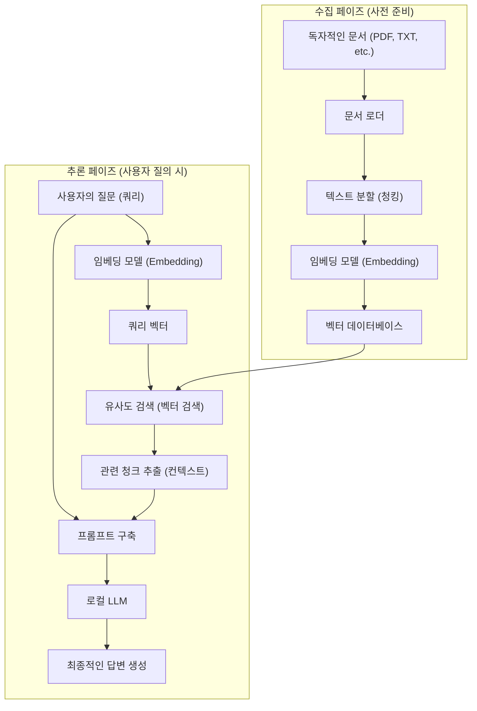
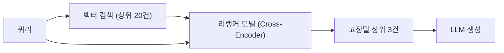

# 들어가며

최근 대규모 언어 모델(LLM)의 진화는 눈부시며, ChatGPT와 Claude 등을 필두로 많은 AI가 우리의 생활과 업무에 스며들고 있습니다. 하지만 일반적인 LLM에는 명확한 약점이 존재합니다. 바로 '학습 시점의 공개 정보'밖에 모른다는 점입니다. 사내 규정, 개인적인 메모, 미공개 프로젝트 자료와 같은 '비공개 문서'와 관련된 질문에는 당연히 대답할 수 없습니다. 무리하게 대답을 유도하면 사실과 다른 그럴듯한 거짓말(환각, Hallucination)을 생성할 위험이 커집니다.

그래서 현재 전 세계적으로 폭발적으로 보급되고 있는 것이 **RAG(Retrieval-Augmented Generation: 검색 증강 생성)** 라는 기술 아키텍처입니다. RAG를 사용하면 LLM에 독자적인 지식을 외부 데이터베이스로부터 동적으로 제공하고, 이를 바탕으로 정확하고 근거 있는 답변을 생성하게 할 수 있습니다.

또한, 엔터프라이즈 영역이나 개인의 기밀 정보를 다룰 경우, OpenAI와 같은 클라우드 기반 API에 데이터를 전송하는 것은 보안 정책상 허용되지 않는 경우가 많습니다. 여기서 요구되는 것이 **로컬 AI**(자신의 PC나 온프레미스 서버에서 독립적으로 동작하는 LLM)와 결합한 '로컬 RAG'의 구축입니다.

이 글에서는 RAG의 기초 이론부터 Python을 사용한 로컬 RAG의 구체적인 구현 방법, 수학적 배경(벡터 검색의 원리), 그리고 시스템을 실제 운영 환경에서 가동하기 위한 고급 기술까지 철저하게 해설합니다.

---

# 1. RAG의 전체 아키텍처

RAG는 단일 AI 모델이 아니라 여러 컴포넌트가 연계되는 시스템 아키텍처입니다. 크게 '수집(데이터 로드) 페이즈'와 '검색 및 생성(Retrieval & Generation) 페이즈'의 두 가지로 구성됩니다.

아래의 Mermaid 다이어그램은 RAG 시스템의 전체적인 모습을 보여줍니다.



## 수집 페이즈 (사전 준비)
1. **문서 로드**: PDF, Word, 텍스트 파일 등의 비정형 데이터를 읽어 들입니다.
2. **청킹 (텍스트 분할)**: LLM의 입력 제한(컨텍스트 윈도우) 내에 맞추고 검색 정확도를 높이기 위해, 긴 문장을 의미 있는 덩어리(청크)로 분할합니다.
3. **임베딩 (벡터화)**: 분할된 청크를 임베딩 모델(Embedding Model)에 입력하여 수백~수천 차원의 수치 배열(벡터)로 변환합니다.
4. **데이터베이스에 저장**: 변환된 벡터와 원본 텍스트 데이터를 연결하여 벡터 데이터베이스(Vector DB)에 저장합니다.

## 추론 페이즈 (실행 시)
1. **쿼리 벡터화**: 사용자의 질문 문장을 사전 준비와 동일한 임베딩 모델을 사용하여 벡터화합니다.
2. **유사도 검색**: 쿼리 벡터와 데이터베이스 내의 문서 벡터 간에 유사도 계산을 수행하여, 의미적으로 가까운(관련성이 높은) 텍스트 청크를 상위 몇 개 가져옵니다.
3. **프롬프트 구축**: 가져온 관련 텍스트를 '컨텍스트(배경지식)'로서 사용자의 질문 문장과 결합하여 LLM에 입력할 프롬프트를 만듭니다.
4. **답변 생성**: 확장된 프롬프트를 받은 LLM이 제공된 컨텍스트 정보를 바탕으로 답변을 생성합니다.

---

# 2. 벡터 검색과 임베딩(Embeddings)의 깊은 이해

RAG의 핵심을 이루는 것이 '벡터 검색(시맨틱 검색)'입니다. 기존의 키워드 검색(BM25 등)이 단어의 완전 일치나 빈도에 기반하는 반면, 벡터 검색은 '의미의 유사성'에 기반합니다. 예를 들어 '개'와 '강아지', 'PC'와 '컴퓨터'처럼 다른 단어라도 의미가 비슷하면 검색 결과에 나타납니다.

## 임베딩 모델(Embedding Model)이란 무엇인가?

임베딩 모델은 자연어 텍스트를 입력으로 받아, 고정 길이의 밀집 벡터(Dense Vector)를 출력하는 신경망입니다. 일반적인 모델(예를 들어 `text-embedding-3-small`이나 오픈소스인 `multilingual-e5-large`)은 텍스트를 384차원이나 1024차원의 실수 벡터로 매핑합니다.

이 다차원 공간(잠재 공간)에서는 의미가 비슷한 문장일수록 좌표 공간상의 거리가 가까워지도록 학습되어 있습니다.

## 유사도 계산의 수학적 배경: 코사인 유사도

벡터 데이터베이스가 관련 문서를 검색할 때 가장 일반적으로 사용되는 거리 지표가 **코사인 유사도(Cosine Similarity)** 입니다. 유클리드 거리(공간적인 절대 거리)와는 달리, 코사인 유사도는 '두 벡터가 이루는 각'에 주목합니다. 문장의 길이(벡터의 노름)에 영향을 덜 받기 때문에 텍스트의 유사도 계산에 매우 적합합니다.

수식으로 나타내면, 벡터 $\mathbf{A}$와 $\mathbf{B}$의 코사인 유사도는 다음과 같습니다.

$$ \text{Cosine Similarity}(\mathbf{A}, \mathbf{B}) = \cos(\theta) = \frac{\mathbf{A} \cdot \mathbf{B}}{\|\mathbf{A}\| \|\mathbf{B}\|} = \frac{\sum_{i=1}^{n} A_i B_i}{\sqrt{\sum_{i=1}^{n} A_i^2} \sqrt{\sum_{i=1}^{n} B_i^2}} $$

- $\mathbf{A} \cdot \mathbf{B}$ 는 내적(Dot Product)을 나타냅니다.
- $\|\mathbf{A}\|$ 는 벡터 $\mathbf{A}$ 의 L2 노름(길이)을 나타냅니다.
- $n$ 은 벡터의 차원 수입니다.

코사인 유사도는 -1에서 1 사이의 값을 가집니다.
- **1 에 가까움**: 두 벡터의 방향이 거의 같음 (의미가 매우 비슷함)
- **0 에 가까움**: 두 벡터가 직교함 (무관함)
- **-1 에 가까움**: 두 벡터의 방향이 정반대임 (의미가 반대임)

최근의 벡터 DB(Chroma, FAISS, Qdrant 등)는 HNSW(Hierarchical Navigable Small World)라고 불리는 근사 최근접 이웃 탐색(ANN) 알고리즘을 채택하고 있어, 수백만 건의 벡터 데이터에서도 밀리초 단위로 코사인 유사도가 높은 문서를 검색할 수 있도록 최적화되어 있습니다.

---

# 3. 로컬 RAG를 구축하기 위한 기술 스택

클라우드에 의존하지 않는 완전한 로컬 RAG를 구축하려면 오픈소스 생태계를 활용합니다. 아래에 권장되는 기술 스택을 소개합니다.

1. **언어 모델 (LLM)**
   - 도구: `Ollama` 또는 `Llama.cpp`
   - 모델: `Llama-3-8B-Instruct`, `Gemma-2-9B-It`, `Qwen2-7B-Instruct` 등의 경량·고성능 오픈 모델. 일본어 태스크에는 일본어 튜닝이 된 `Llama-3-ELYZA-JP-8B` 등이 적합합니다.
2. **임베딩 모델 (Embedding)**
   - 모델: `intfloat/multilingual-e5-large` 또는 `BAAI/bge-m3`. 로컬에서 구동할 경우, Hugging Face에서 다운로드하여 Sentence-Transformers로 실행하는 것이 일반적입니다.
3. **벡터 데이터베이스 (Vector DB)**
   - `ChromaDB`: Python 기반으로 설정이 매우 간단함. 로컬 개발에 최적.
   - `FAISS`: Meta가 개발한 고속 벡터 검색 라이브러리.
   - `Qdrant` / `Milvus`: 보다 대규모이며 프로덕션 환경용.
4. **오케스트레이션 프레임워크**
   - `LangChain`: 컴포넌트들을 연결(Chain)하기 위한 사실상의 표준.
   - `LlamaIndex`: 특히 RAG에 특화된 데이터 연결 프레임워크.

이번에는 도입이 가장 간단한 **LangChain + ChromaDB + Ollama + HuggingFaceEmbeddings** 조합으로 구현합니다.

---

# 4. 구현 튜토리얼: Python을 활용한 완전한 로컬 RAG 구축

지금부터는 실제로 Python 코드를 작성하면서 로컬 RAG를 구축해 보겠습니다. 사전에 PC에 Ollama를 설치하고 백그라운드에서 실행해 두세요. 또한, Ollama에서 모델을 풀(pull)해 둡니다(예: `ollama run llama3`).

## Step 1: 필요한 라이브러리 설치

```bash
pip install langchain langchain-community langchain-huggingface
pip install chromadb sentence-transformers pypdf
```

## Step 2: 구현 코드 전체 모습

다음은 PDF 파일을 읽어 벡터화하고 로컬 LLM이 질문에 답하게 하는 완전한 Python 스크립트입니다.

```python
import os
from langchain_community.document_loaders import PyPDFLoader
from langchain_text_splitters import RecursiveCharacterTextSplitter
from langchain_huggingface import HuggingFaceEmbeddings
from langchain_community.vectorstores import Chroma
from langchain_community.llms import Ollama
from langchain_core.prompts import PromptTemplate
from langchain.chains import RetrievalQA

def main():
    # 1. 문서 로드
    print("문서를 읽고 있습니다...")
    # 읽어 들일 PDF의 경로를 지정
    file_path = "sample_company_policy.pdf" 
    loader = PyPDFLoader(file_path)
    documents = loader.load()

    # 2. 청크 분할 (Text Splitting)
    # 문장의 의미를 훼손하지 않도록 적당한 크기로 분할한다
    text_splitter = RecursiveCharacterTextSplitter(
        chunk_size=500,     # 1청크당 최대 글자 수
        chunk_overlap=50,   # 앞뒤 청크의 중복 글자 수 (문맥 단절 방지)
        separators=["\n\n", "\n", "。", "、", " ", ""]
    )
    chunks = text_splitter.split_documents(documents)
    print(f"{len(chunks)}개의 청크로 분할되었습니다.")

    # 3. 임베딩 모델 초기화 (Local HuggingFace Model)
    # 일본어에 강한 다국어 모델 사용
    print("임베딩 모델을 로드하고 있습니다...")
    embeddings = HuggingFaceEmbeddings(
        model_name="intfloat/multilingual-e5-large",
        model_kwargs={'device': 'cpu'} # GPU가 있는 경우 'cuda' 또는 'mps'
    )

    # 4. 벡터 데이터베이스 구축 (Chroma)
    print("벡터 데이터베이스를 구축하고 있습니다...")
    persist_directory = "./chroma_db"
    vectorstore = Chroma.from_documents(
        documents=chunks,
        embedding=embeddings,
        persist_directory=persist_directory
    )
    # 검색기(Retriever) 생성. 상위 3건의 관련 문서를 가져오도록 설정
    retriever = vectorstore.as_retriever(search_kwargs={"k": 3})

    # 5. 로컬 LLM 초기화 (Ollama)
    print("로컬 LLM에 연결하고 있습니다...")
    # 사전에 'ollama pull llama3' 등으로 모델을 다운로드해 둘 것
    llm = Ollama(model="llama3")

    # 6. 프롬프트 템플릿 정의
    prompt_template = """당신은 회사의 규정이나 사내 정보에 해박한 우수한 어시스턴트입니다.
아래의 컨텍스트(배경 정보)만을 사용하여 사용자의 질문에 한국어로 상세히 답해 주세요.
컨텍스트에서 답을 찾을 수 없는 경우, 함부로 추측하지 말고 '제공된 정보로는 알 수 없습니다'라고 솔직하게 답해 주세요.

【컨텍스트】
{context}

【질문】
{question}

【답변】:
"""
    PROMPT = PromptTemplate(
        template=prompt_template, 
        input_variables=["context", "question"]
    )

    # 7. RAG 체인 구축
    qa_chain = RetrievalQA.from_chain_type(
        llm=llm,
        chain_type="stuff",
        retriever=retriever,
        return_source_documents=True, # 정보 출처를 반환할지 설정
        chain_type_kwargs={"prompt": PROMPT}
    )

    # 8. 질문 실행
    query = "원격 근무 시 교통비 지급 조건에 대해 알려주세요."
    print(f"\n질문: {query}\n")
    
    result = qa_chain.invoke({"query": query})
    
    print("【답변】")
    print(result['result'])
    print("\n---")
    print("【참조한 정보 출처】")
    for doc in result['source_documents']:
        print(f"- 페이지 {doc.metadata.get('page', '알 수 없음')}: {doc.page_content[:50]}...")

if __name__ == "__main__":
    main()
```

## 코드의 포인트 해설

1. **RecursiveCharacterTextSplitter**:
   자연어 분할에서 가장 권장되는 스플리터입니다. 단락(`\n\n`), 줄(`\n`), 마침표(`。`) 순으로 분할을 시도하며, 의미 덩어리를 가능한 한 유지한 채 지정된 `chunk_size`에 맞도록 분할합니다. `chunk_overlap`을 설정함으로써 문맥의 경계가 끊어져 정보가 손실되는 것을 방지합니다.
2. **HuggingFaceEmbeddings**:
   `intfloat/multilingual-e5-large`는 다국어를 지원하는 매우 강력한 오픈소스 임베딩 모델입니다. 클라우드 API(OpenAI의 `text-embedding-ada-002` 등)를 사용하지 않고도, 오프라인으로 로컬 메모리상에서 텍스트를 벡터화할 수 있습니다.
3. **ChromaDB**:
   인메모리 또는 로컬 스토리지(SQLite 기반)에서 동작하기 때문에 복잡한 데이터베이스 서버를 구동할 필요가 없습니다. `persist_directory`를 지정하면, 재실행 시 벡터화 프로세스를 건너뛰고 디스크에서 DB를 읽어올 수 있습니다.

---

# 5. 발전된 RAG 기법 (Advanced RAG Techniques)

위의 튜토리얼에서 구축한 기본 RAG 시스템(Naive RAG)으로도 동작하지만, 프로덕션 환경에서 높은 답변 정확도를 요구받을 경우 다음과 같은 고급 기술의 도입이 필요해집니다.

## 5.1 하이브리드 검색 (Hybrid Search)
벡터 검색은 '의미'를 파악하는 데에는 능하지만, '특정 고유명사', '제품 모델명', '직원 ID' 등과 같은 엄밀한 키워드 검색에는 약할 수 있습니다.
그래서 벡터 검색에 의한 **시맨틱 검색**과 BM25 알고리즘 등을 사용한 **키워드 검색**을 병행하고, 양쪽의 결과를 스코어링하여 통합하는(Reciprocal Rank Fusion; RRF 등의 기법을 사용) 방식으로 검색 누락을 극적으로 줄일 수 있습니다.

## 5.2 리랭킹 (Re-ranking)
벡터 검색은 고속이지만, 반드시 컨텍스트의 정확한 문맥 적합성을 평가하고 있는 것은 아닙니다. 검색 정확도를 향상시키기 위한 일반적인 파이프라인은 다음과 같습니다.
1. **초기 검색 (First-stage Retrieval)**: 벡터 DB에서 넓고 얕게 관련 청크를 20~30건 정도 가져옵니다.
2. **재평가 (Re-ranking)**: Cross-Encoder라고 불리는 다른 더 무거운 머신러닝 모델(예: `bge-reranker` 등)을 사용하여, 사용자의 쿼리와 가져온 청크의 쌍을 입력해 의미적 적합도 점수를 다시 계산합니다.
3. **선별**: 점수가 높은 상위 3~5건만을 최종적인 컨텍스트로서 LLM의 프롬프트에 전달합니다.

이 기법을 통해 무관한 노이즈 정보가 LLM에 전달되는 것을 방지하고 답변의 정확도(Precision)를 대폭 높일 수 있습니다.



## 5.3 시맨틱 청킹과 부모 문서 검색
고정된 글자 수로 기계적으로 텍스트를 분할하는 것이 아니라, 문장의 의미 변화를 AI로 감지하여 분할하는 'Semantic Chunking(시맨틱 청킹)'이라는 기법이 있습니다.
또한, 'Parent 단락 검색(Parent Document Retriever)'이라는 기법에서는 검색용으로 매우 작은 단위(문장 등)로 벡터화를 수행하여 정확도 높은 검색을 실현하면서도, LLM에 전달할 때는 그 문장이 포함된 '원래의 큰 단락(부모 문서)'을 전달함으로써 LLM에 충분한 문맥(컨텍스트)을 제공합니다.

---

# 6. 로컬 RAG 운영 시의 과제와 대책

로컬 환경에서 RAG를 구축하고 운영할 때는 특유의 장벽이 존재합니다.

- **VRAM(비디오 메모리) 고갈**:
  로컬 LLM을 실용적인 속도(1초에 수십 토큰)로 구동하려면 GPU의 VRAM에 모델을 올려야 합니다. 8B 클래스의 모델을 fp16(16비트 부동소수점)으로 구동하려면 약 16GB의 VRAM이 필요하지만, **양자화(Quantization)** 기술(GGUF나 AWQ 형식 등, 4bit나 8bit로 압축하는 기술)을 사용하면 8GB의 VRAM(일반적인 게이밍 PC 등)에서도 충분히 고속으로 동작시킬 수 있습니다. Llama.cpp나 Ollama는 기본적으로 이러한 양자화 포맷을 지원합니다.
- **컨텍스트 윈도우의 제한**:
  검색하여 가져온 컨텍스트의 양이 너무 많으면 LLM의 입력 상한(토큰 제한)을 초과해 버리거나, 모델이 정보의 중간 부분을 잊어버리는(Lost in the middle 현상) 경우가 있습니다. 추출할 청크 수의 조정이나 앞서 언급한 리랭킹 기술을 통한 엄선이 필수적입니다.
- **데이터 최신성 관리**:
  소스 문서가 업데이트된 경우, 벡터 데이터베이스 내의 해당 문서 벡터도 업데이트 및 삭제(CRUD 작업)할 필요가 있습니다. ChromaDB에서는 문서 ID 기반의 업데이트를 지원하므로, 파일의 해시값을 관리하여 변경 사항만을 동기화하는 배치 처리를 구성하는 것이 실용적입니다.

---

# 마무리

RAG(검색 증강 생성)는 AI를 일반적인 범용 어시스턴트에서 '당신 전속의 전문가'나 '사내 업무에 특화된 전문가'로 진화시키는 강력한 패러다임입니다.

클라우드 서비스를 이용할 수 없는 기밀성이 높은 요구사항이라도, Ollama, LangChain, ChromaDB 등의 오픈소스 생태계를 결합함으로써 완전한 '로컬 RAG' 환경을 비교적 쉽게 구축할 수 있음을 알 수 있었습니다.

이 글에서 해설한 벡터 공간의 수학적 이해나 텍스트 분할, 리랭킹과 같은 발전된 접근 방식을 바탕으로, 꼭 자신이 보유한 데이터를 사용하여 독자적인 AI 시스템을 개발해 보시기 바랍니다. 로컬 AI의 진화 속도는 경이로우며, 오늘 구축한 시스템은 내일 등장할 더욱 똑똑한 경량 모델로 교체하는 것만으로 순식간에 성능을 업데이트할 수 있습니다.

---
*본 블로그에서는 앞으로도 AI 기술이나 RAG에 관한 심층 기사를 게재할 예정입니다. 질문이나 피드백이 있으시다면 꼭 댓글란에 남겨주세요.*
