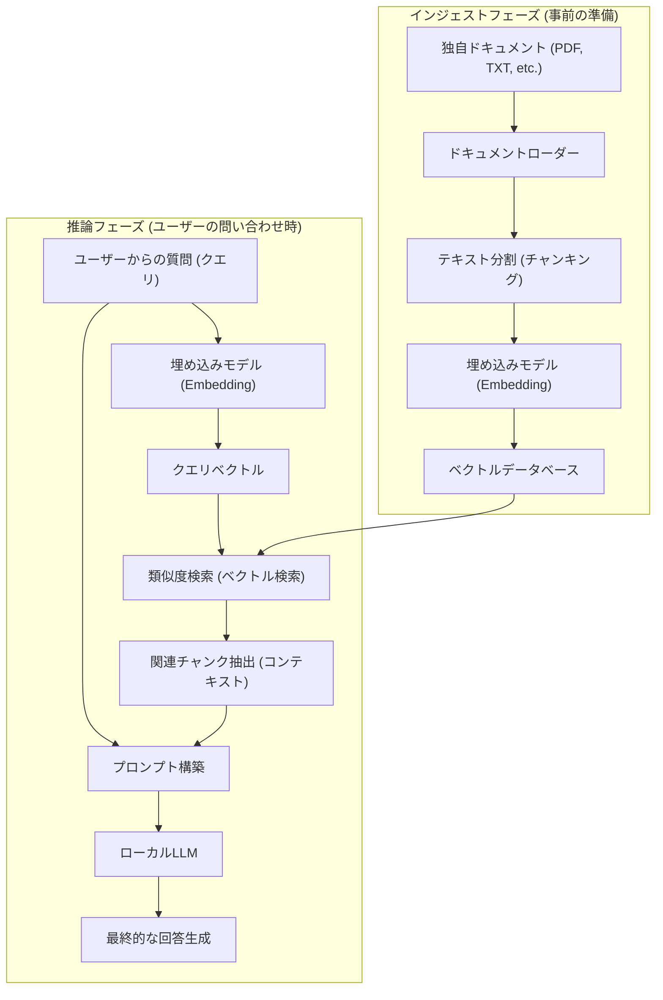
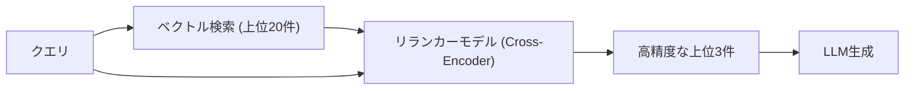

# はじめに

近年、大規模言語モデル（LLM）の進化は目覚ましく、ChatGPTやClaudeなどを筆頭に多くのAIが私たちの生活や業務に浸透しています。しかし、一般的なLLMには明確な弱点が存在します。それは「学習時点での公開情報」しか知らないという点です。社内規程、個人的なメモ、未公開のプロジェクト資料といった「プライベートなドキュメント」に関する質問には、当然ながら答えることができません。無理に答えさせようとすると、事実とは異なるもっともらしい嘘（ハルシネーション）を生成してしまうリスクが高まります。

そこで現在、世界中で爆発的に普及しているのが **RAG (Retrieval-Augmented Generation: 検索拡張生成)** という技術アーキテクチャです。RAGを用いることで、LLMに独自の知識を外部データベースから動的に与え、それに基づいた正確で根拠のある回答を生成させることが可能になります。

さらに、エンタープライズ領域や個人の機密情報を扱う場合、OpenAIなどのクラウドベースのAPIにデータを送信することは、セキュリティポリシー上許容されないことが多々あります。そこで求められるのが、**ローカルAI**（自分のPCやオンプレミスサーバーで完結して動作するLLM）と組み合わせた「ローカルRAG」の構築です。

本記事では、RAGの基礎理論から、Pythonを用いたローカルRAGの具体的な実装方法、数学的な背景（ベクトル検索の仕組み）、そしてシステムを本番稼働させるための高度なテクニックまでを、徹底的に解説します。

---

# 1. RAGの全体アーキテクチャ

RAGは単一のAIモデルではなく、複数のコンポーネントが連携するシステムアーキテクチャです。大きく分けて「インジェスト（データ取り込み）フェーズ」と「リトリーバル＆ジェネレーション（検索と生成）フェーズ」の2つから構成されます。

以下のMermaid図は、RAGシステムの全体像を示しています。



## インジェストフェーズ（事前準備）
1. **ドキュメントの読み込み**: PDF、Word、テキストファイルなどの非構造化データを読み込みます。
2. **チャンキング（テキスト分割）**: LLMの入力制限（コンテキストウィンドウ）に収めるため、そして検索精度を上げるために、長い文章を意味のある塊（チャンク）に分割します。
3. **エンベディング（ベクトル化）**: 分割されたチャンクを、埋め込みモデル（Embedding Model）に入力し、数百〜数千次元の数値の配列（ベクトル）に変換します。
4. **データベースへの保存**: 変換されたベクトルと、元のテキストデータを紐付けてベクトルデータベース（Vector DB）に保存します。

## 推論フェーズ（実行時）
1. **クエリのベクトル化**: ユーザーからの質問文を、事前準備と同じ埋め込みモデルを使ってベクトル化します。
2. **類似度検索**: クエリベクトルと、データベース内のドキュメントベクトルの間で類似度計算を行い、意味的に近い（関連性の高い）テキストチャンクを上位数件取得します。
3. **プロンプトの構築**: 取得した関連テキストを「コンテキスト（背景知識）」としてユーザーの質問文と結合し、LLMへの入力プロンプトを作成します。
4. **回答の生成**: 拡張されたプロンプトを受け取ったLLMが、付与されたコンテキスト情報を基にして回答を生成します。

---

# 2. ベクトル検索と埋め込み（Embeddings）の深い理解

RAGの中核をなすのが「ベクトル検索（セマンティック検索）」です。従来のキーワード検索（BM25など）が単語の完全一致や頻度に基づくのに対し、ベクトル検索は「意味の類似性」に基づきます。例えば「犬」と「子犬」、「PC」と「パソコン」のように、異なる単語でも意味が近ければ検索にヒットします。

## 埋め込みモデル（Embedding Model）とは何か？

埋め込みモデルは、自然言語のテキストを入力として受け取り、固定長の密なベクトル（Dense Vector）を出力するニューラルネットワークです。一般的なモデル（例えば `text-embedding-3-small` やオープンソースの `multilingual-e5-large`）は、テキストを384次元や1024次元の実数ベクトルにマッピングします。

この多次元空間（潜在空間）においては、意味が似ている文章ほど、座標空間上の距離が近くなるように学習されています。

## 類似度計算の数学的背景：コサイン類似度

ベクトルデータベースが関連ドキュメントを検索する際、最も一般的に用いられる距離指標が**コサイン類似度（Cosine Similarity）**です。ユークリッド距離（空間的な絶対距離）とは異なり、コサイン類似度は「2つのベクトルのなす角」に注目します。文章の長さ（ベクトルのノルム）に影響されにくいため、テキストの類似度計算に非常に適しています。

数式で表すと、ベクトル $\mathbf{A}$ と $\mathbf{B}$ のコサイン類似度は以下のようになります。

$$ \text{Cosine Similarity}(\mathbf{A}, \mathbf{B}) = \cos(\theta) = \frac{\mathbf{A} \cdot \mathbf{B}}{\|\mathbf{A}\| \|\mathbf{B}\|} = \frac{\sum_{i=1}^{n} A_i B_i}{\sqrt{\sum_{i=1}^{n} A_i^2} \sqrt{\sum_{i=1}^{n} B_i^2}} $$

- $\mathbf{A} \cdot \mathbf{B}$ は内積（Dot Product）を表します。
- $\|\mathbf{A}\|$ はベクトル $\mathbf{A}$ のL2ノルム（長さ）を表します。
- $n$ はベクトルの次元数です。

コサイン類似度は -1 から 1 の値を取ります。
- **1 に近い**: 2つのベクトルの向きがほぼ同じ（意味が非常に似ている）
- **0 に近い**: 2つのベクトルが直交している（無関係）
- **-1 に近い**: 2つのベクトルが正反対の向き（意味が逆）

最近のベクトルDB（Chroma, FAISS, Qdrantなど）は、HNSW（Hierarchical Navigable Small World）と呼ばれる近似最近傍探索（ANN）アルゴリズムを採用しており、数百万件のベクトルデータからでもミリ秒単位でコサイン類似度が高いドキュメントを検索できるよう最適化されています。

---

# 3. ローカルRAGを構築するための技術スタック

クラウドに依存しない完全なローカルRAGを構築するには、オープンソースのエコシステムを活用します。以下に推奨される技術スタックを紹介します。

1. **言語モデル (LLM)**
   - ツール: `Ollama` または `Llama.cpp`
   - モデル: `Llama-3-8B-Instruct`, `Gemma-2-9B-It`, `Qwen2-7B-Instruct` などの軽量・高性能なオープンモデル。日本語タスクには日本語チューンされた `Llama-3-ELYZA-JP-8B` などが適しています。
2. **埋め込みモデル (Embedding)**
   - モデル: `intfloat/multilingual-e5-large` または `BAAI/bge-m3`。ローカルで動かす場合、Hugging FaceからダウンロードしてSentence-Transformersで実行するのが一般的です。
3. **ベクトルデータベース (Vector DB)**
   - `ChromaDB`: Pythonベースでセットアップが極めて簡単。ローカル開発に最適。
   - `FAISS`: Metaが開発した高速なベクトル検索ライブラリ。
   - `Qdrant` / `Milvus`: より大規模で本番環境向け。
4. **オーケストレーションフレームワーク**
   - `LangChain`: コンポーネントを繋ぎ合わせる（Chain）ためのデファクトスタンダード。
   - `LlamaIndex`: 特にRAGに特化したデータ接続フレームワーク。

今回は、最も導入が簡単な **LangChain + ChromaDB + Ollama + HuggingFaceEmbeddings** の組み合わせで実装します。

---

# 4. 実装チュートリアル：Pythonによる完全なローカルRAG構築

ここからは、実際にPythonコードを書きながらローカルRAGを構築していきます。あらかじめ、PCにOllamaをインストールし、バックグラウンドで起動しておいてください。また、Ollama上でモデルをプルしておきます（例：`ollama run llama3`）。

## Step 1: 必要なライブラリのインストール

```bash
pip install langchain langchain-community langchain-huggingface
pip install chromadb sentence-transformers pypdf
```

## Step 2: 実装コード全体像

以下は、PDFファイルを読み込み、ベクトル化してローカルのLLMに質問応答させるための完全なPythonスクリプトです。

```python
import os
from langchain_community.document_loaders import PyPDFLoader
from langchain_text_splitters import RecursiveCharacterTextSplitter
from langchain_huggingface import HuggingFaceEmbeddings
from langchain_community.vectorstores import Chroma
from langchain_community.llms import Ollama
from langchain_core.prompts import PromptTemplate
from langchain.chains import RetrievalQA

def main():
    # 1. ドキュメントの読み込み
    print("ドキュメントを読み込んでいます...")
    # 読み込ませたいPDFのパスを指定
    file_path = "sample_company_policy.pdf" 
    loader = PyPDFLoader(file_path)
    documents = loader.load()

    # 2. チャンク分割（Text Splitting）
    # 文章の意味を壊さないように、適度なサイズに分割する
    text_splitter = RecursiveCharacterTextSplitter(
        chunk_size=500,     # 1チャンクあたりの最大文字数
        chunk_overlap=50,   # 前後のチャンクでの重複文字数（文脈の断絶を防ぐ）
        separators=["\n\n", "\n", "。", "、", " ", ""]
    )
    chunks = text_splitter.split_documents(documents)
    print(f"{len(chunks)}個のチャンクに分割されました。")

    # 3. 埋め込みモデルの初期化 (Local HuggingFace Model)
    # 日本語に強い多言語モデルを使用
    print("埋め込みモデルをロードしています...")
    embeddings = HuggingFaceEmbeddings(
        model_name="intfloat/multilingual-e5-large",
        model_kwargs={'device': 'cpu'} # GPUがある場合は 'cuda' または 'mps'
    )

    # 4. ベクトルデータベースの構築 (Chroma)
    print("ベクトルデータベースを構築しています...")
    persist_directory = "./chroma_db"
    vectorstore = Chroma.from_documents(
        documents=chunks,
        embedding=embeddings,
        persist_directory=persist_directory
    )
    # 検索器（Retriever）の作成。上位3件の関連ドキュメントを取得するように設定
    retriever = vectorstore.as_retriever(search_kwargs={"k": 3})

    # 5. ローカルLLMの初期化 (Ollama)
    print("ローカルLLMに接続しています...")
    # 事前に 'ollama pull llama3' などでモデルを取得しておくこと
    llm = Ollama(model="llama3")

    # 6. プロンプトテンプレートの定義
    prompt_template = """あなたは会社の規程や社内情報に詳しい優秀なアシスタントです。
以下のコンテキスト（背景情報）のみを使用して、ユーザーの質問に日本語で詳細に答えてください。
コンテキストから答えが見つからない場合は、勝手に推測せず「提供された情報からは分かりません」と正直に答えてください。

【コンテキスト】
{context}

【質問】
{question}

【回答】:
"""
    PROMPT = PromptTemplate(
        template=prompt_template, 
        input_variables=["context", "question"]
    )

    # 7. RAGチェーンの構築
    qa_chain = RetrievalQA.from_chain_type(
        llm=llm,
        chain_type="stuff",
        retriever=retriever,
        return_source_documents=True, # 情報源を返すか設定
        chain_type_kwargs={"prompt": PROMPT}
    )

    # 8. 質問の実行
    query = "リモートワークに関する交通費の支給条件について教えてください。"
    print(f"\n質問: {query}\n")
    
    result = qa_chain.invoke({"query": query})
    
    print("【回答】")
    print(result['result'])
    print("\n---")
    print("【参照した情報源】")
    for doc in result['source_documents']:
        print(f"- ページ {doc.metadata.get('page', '不明')}: {doc.page_content[:50]}...")

if __name__ == "__main__":
    main()
```

## コードのポイント解説

1. **RecursiveCharacterTextSplitter**:
   自然言語の分割において最も推奨されるスプリッターです。段落(`\n\n`)、行(`\n`)、句点(`。`)の順で分割を試み、意味のまとまりを可能な限り維持したまま指定の `chunk_size` に収まるように分割します。`chunk_overlap` を設定することで、文脈の境目が切れて情報が失われるのを防ぎます。
2. **HuggingFaceEmbeddings**:
   `intfloat/multilingual-e5-large` は多言語に対応した非常に強力なオープンソースの埋め込みモデルです。クラウドAPI（OpenAIの `text-embedding-ada-002` など）を使わずに、オフラインでローカルメモリ上でテキストをベクトル化できます。
3. **ChromaDB**:
   インメモリまたはローカルストレージ（SQLiteベース）で動作するため、複雑なデータベースサーバーの立ち上げが不要です。`persist_directory` を指定することで、再実行時にベクトル化のプロセスをスキップし、ディスクからDBを読み込むことができます。

---

# 5. 発展的なRAG手法（Advanced RAG Techniques）

上記のチュートリアルで構築した基本のRAGシステム（Naive RAG）でも動作しますが、本番環境で高い回答精度を要求される場合、以下のような高度なテクニックの導入が必要になります。

## 5.1 ハイブリッド検索 (Hybrid Search)
ベクトル検索は「意味」を捉えるのが得意ですが、「特定の固有名詞」「製品型番」「従業員ID」などの厳密なキーワード検索を苦手とすることがあります。
そこで、ベクトル検索による**セマンティック検索**と、BM25アルゴリズムなどを用いた**キーワード検索**を並行して行い、両者の結果をスコアリングして統合する（Reciprocal Rank Fusion; RRFなどの手法を用いる）ことで、検索漏れを劇的に減らすことができます。

## 5.2 リランキング (Re-ranking)
ベクトル検索は高速ですが、必ずしもコンテキストの正確な文脈適合性を評価しているわけではありません。検索精度を向上させるための一般的なパイプラインは以下のようになります。
1. **初期検索 (First-stage Retrieval)**: ベクトルDBから、広く浅く関連チャンクを20件〜30件程度取得します。
2. **再評価 (Re-ranking)**: Cross-Encoderと呼ばれる別のより重い機械学習モデル（例: `bge-reranker` など）を使用して、ユーザーのクエリと取得したチャンクのペアを入力し、意味的適合度のスコアを再計算します。
3. **選別**: スコアの高い上位3〜5件のみを最終的なコンテキストとしてLLMのプロンプトに渡します。

この手法により、無関係なノイズ情報がLLMに渡るのを防ぎ、回答の精度（Precision）を大幅に高めることができます。



## 5.3 セマンティックチャンキングと親ドキュメント検索
固定文字数で機械的にテキストを分割するのではなく、文章の意味の変わり目をAIで検知して分割する「Semantic Chunking」という手法があります。
また、「Parent Document Retriever（親ドキュメント検索）」という手法では、検索用に非常に小さな単位（センテンス等）でベクトル化を行って精度の高い検索を実現しつつ、LLMに渡す際にはそのセンテンスが含まれる「元の大きな段落（親ドキュメント）」を渡すことで、LLMに十分な文脈（コンテキスト）を提供します。

---

# 6. ローカルRAG運用時の課題と対策

ローカル環境でRAGを構築・運用する際には、特有のハードルが存在します。

- **VRAM（ビデオメモリ）の枯渇**:
  ローカルLLMを実用的な速度（1秒間に数十トークン）で動かすには、GPUのVRAMにモデルを載せる必要があります。8Bクラスのモデルをfp16（16ビット浮動小数点）で動かすには約16GBのVRAMが必要ですが、**量子化（Quantization）**技術（GGUFやAWQ形式など、4bitや8bitに圧縮する技術）を使うことで、8GBのVRAM（一般的なゲーミングPC等）でも十分に高速動作させることが可能です。Llama.cppやOllamaは標準でこれらの量子化フォーマットに対応しています。
- **コンテキストウィンドウの制限**:
  検索して取得したコンテキストの量が多すぎると、LLMの入力上限（トークンリミット）を超えてしまったり、モデルが情報の中間部分を忘れてしまう（Lost in the middle現象）ことがあります。抽出するチャンク数の調整や、前述のリランキング技術による厳選が不可欠です。
- **データの鮮度管理**:
  ソースドキュメントが更新された場合、ベクトルデータベース内の該当するドキュメントのベクトルも更新・削除（CRUD操作）する必要があります。ChromaDBではドキュメントIDベースでの更新をサポートしているため、ファイルのハッシュ値を管理し、差分だけを同期するバッチ処理を組むのが実践的です。

---

# まとめ

RAG（検索拡張生成）は、AIを一般的な汎用アシスタントから「あなた専属の専門家」や「社内業務に特化したエキスパート」へと進化させる強力なパラダイムです。

クラウドサービスを利用できない機密性の高い要件であっても、Ollama、LangChain、ChromaDBなどのオープンソースエコシステムを組み合わせることで、完全な「ローカルRAG」環境を比較的容易に構築できることが分かりました。

本記事で解説したベクトル空間の数学的理解や、テキスト分割、リランキングといった発展的アプローチをベースに、ぜひご自身の保有するデータを使ってオリジナルなAIシステムを開発してみてください。ローカルAIの進化のスピードは驚異的であり、今日構築したシステムは、明日登場するさらに賢い軽量モデルに差し替えるだけで、一瞬にして性能をアップデートすることが可能なのです。

---
*本ブログでは今後もAI技術やRAGに関する深掘り記事を掲載していきます。ご質問やフィードバックがありましたら、ぜひコメント欄にお寄せください。*
