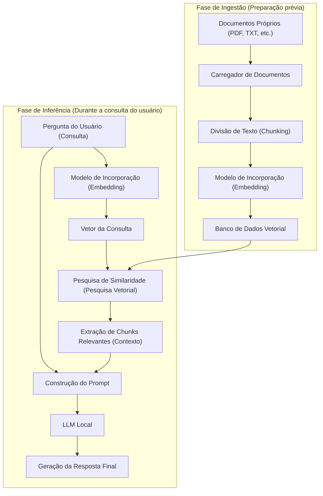
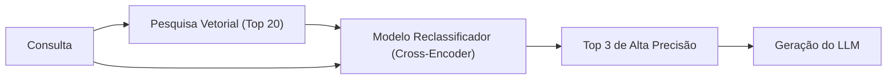

# Introdução

Nos últimos anos, a evolução dos Grandes Modelos de Linguagem (LLM) tem sido notável, com muitas IAs, lideradas pelo ChatGPT e Claude, permeando nossas vidas e trabalhos. No entanto, os LLMs em geral têm uma fraqueza clara. É o fato de que eles conhecem apenas "informações públicas no momento do treinamento". Eles naturalmente não podem responder a perguntas sobre "documentos privados", como regulamentos internos, notas pessoais ou materiais de projetos não publicados. Tentar forçá-los a responder aumenta o risco de gerar mentiras plausíveis que diferem dos fatos (alucinações).

Portanto, a arquitetura de tecnologia que está se espalhando explosivamente pelo mundo agora é a **RAG (Retrieval-Augmented Generation: Geração Aumentada por Recuperação)**. Ao usar a RAG, é possível fornecer dinamicamente conhecimento próprio ao LLM a partir de um banco de dados externo e fazer com que ele gere respostas precisas e fundamentadas com base nisso.

Além disso, ao lidar com informações confidenciais na área corporativa ou pessoal, o envio de dados para APIs baseadas em nuvem, como a da OpenAI, muitas vezes não é permitido pelas políticas de segurança. Portanto, o que se exige é a construção de uma "RAG local" combinada com **IA local** (LLMs que funcionam e se completam no seu próprio PC ou servidor on-premise).

Neste artigo, explicaremos detalhadamente, desde a teoria básica da RAG até o método específico de implementação da RAG local usando Python, o contexto matemático (o mecanismo da pesquisa vetorial) e técnicas avançadas para colocar o sistema em produção.

---

# 1. Arquitetura Geral da RAG

A RAG não é um modelo de IA único, mas uma arquitetura de sistema na qual vários componentes trabalham juntos. Ela é dividida basicamente em duas partes: a "Fase de Ingestão (captura de dados)" e a "Fase de Recuperação e Geração (pesquisa e geração)".

O diagrama Mermaid abaixo mostra a visão geral do sistema RAG.



## Fase de Ingestão (Preparação prévia)
1. **Leitura de documentos**: Carrega dados não estruturados, como arquivos PDF, Word e texto.
2. **Chunking (Divisão de texto)**: Divide textos longos em blocos significativos (chunks) para caber no limite de entrada do LLM (janela de contexto) e para aumentar a precisão da pesquisa.
3. **Embedding (Vetorização)**: Insere os chunks divididos em um Modelo de Incorporação (Embedding Model) e os converte em matrizes numéricas (vetores) de centenas a milhares de dimensões.
4. **Armazenamento no banco de dados**: Salva os vetores convertidos associados aos dados de texto originais em um banco de dados vetorial (Vector DB).

## Fase de Inferência (Em tempo de execução)
1. **Vetorização da consulta**: Vetoriza a frase da pergunta do usuário usando o mesmo modelo de incorporação da preparação prévia.
2. **Pesquisa de similaridade**: Calcula a similaridade entre o vetor da consulta e os vetores de documentos no banco de dados, recuperando os principais chunks de texto semanticamente próximos (altamente relevantes).
3. **Construção do prompt**: Combina os textos relevantes obtidos como "contexto (conhecimento prévio)" com a frase da pergunta do usuário para criar o prompt de entrada para o LLM.
4. **Geração da resposta**: O LLM recebe o prompt estendido e gera uma resposta com base nas informações de contexto fornecidas.

---

# 2. Entendimento Profundo da Pesquisa Vetorial e Incorporações (Embeddings)

O núcleo da RAG é a "pesquisa vetorial (pesquisa semântica)". Enquanto a pesquisa tradicional por palavras-chave (como o BM25) é baseada na correspondência exata e frequência de palavras, a pesquisa vetorial é baseada na "similaridade de significado". Por exemplo, como "cão" e "filhote" ou "PC" e "computador", mesmo palavras diferentes aparecerão na pesquisa se seus significados forem próximos.

## O que é um Modelo de Incorporação (Embedding Model)?

Um modelo de incorporação é uma rede neural que recebe texto em linguagem natural como entrada e gera um vetor denso (Dense Vector) de comprimento fixo como saída. Modelos comuns (como `text-embedding-3-small` ou o código aberto `multilingual-e5-large`) mapeiam o texto para vetores de números reais de 384 ou 1024 dimensões.

Neste espaço multidimensional (espaço latente), eles são treinados de forma que frases com significados semelhantes fiquem mais próximas na distância dentro do espaço de coordenadas.

## Contexto Matemático do Cálculo de Similaridade: Similaridade de Cosseno

Quando um banco de dados vetorial pesquisa documentos relevantes, a métrica de distância mais comumente usada é a **Similaridade de Cosseno (Cosine Similarity)**. Diferente da distância euclidiana (distância espacial absoluta), a similaridade de cosseno foca no "ângulo formado entre dois vetores". Como é menos afetada pelo comprimento da frase (norma do vetor), é muito adequada para calcular a similaridade de textos.

Expresso matematicamente, a similaridade de cosseno entre os vetores $\mathbf{A}$ e $\mathbf{B}$ é a seguinte:

$$ \text{Cosine Similarity}(\mathbf{A}, \mathbf{B}) = \cos(\theta) = \frac{\mathbf{A} \cdot \mathbf{B}}{\|\mathbf{A}\| \|\mathbf{B}\|} = \frac{\sum_{i=1}^{n} A_i B_i}{\sqrt{\sum_{i=1}^{n} A_i^2} \sqrt{\sum_{i=1}^{n} B_i^2}} $$

- $\mathbf{A} \cdot \mathbf{B}$ representa o produto escalar (Dot Product).
- $\|\mathbf{A}\|$ representa a norma L2 (comprimento) do vetor $\mathbf{A}$.
- $n$ é o número de dimensões dos vetores.

A similaridade de cosseno varia de -1 a 1.
- **Próximo a 1**: A direção dos dois vetores é quase a mesma (os significados são muito semelhantes).
- **Próximo a 0**: Os dois vetores são ortogonais (não relacionados).
- **Próximo a -1**: Os dois vetores apontam em direções opostas (significados opostos).

Os bancos de dados vetoriais recentes (Chroma, FAISS, Qdrant, etc.) adotam um algoritmo de Pesquisa Aproximada de Vizinhos Mais Próximos (ANN) chamado HNSW (Hierarchical Navigable Small World), sendo otimizados para pesquisar documentos com alta similaridade de cosseno em milissegundos, mesmo entre milhões de dados vetoriais.

---

# 3. Pilha de Tecnologia para Construir a RAG Local

Para construir uma RAG totalmente local, sem depender da nuvem, utilizamos o ecossistema de código aberto. A pilha de tecnologia recomendada é apresentada abaixo.

1. **Modelo de Linguagem (LLM)**
   - Ferramenta: `Ollama` ou `Llama.cpp`
   - Modelo: Modelos abertos leves e de alto desempenho, como `Llama-3-8B-Instruct`, `Gemma-2-9B-It`, `Qwen2-7B-Instruct`. Para tarefas em japonês, modelos ajustados como o `Llama-3-ELYZA-JP-8B` são adequados.
2. **Modelo de Incorporação (Embedding)**
   - Modelo: `intfloat/multilingual-e5-large` ou `BAAI/bge-m3`. Ao executar localmente, geralmente é feito o download pelo Hugging Face e a execução usando o Sentence-Transformers.
3. **Banco de Dados Vetorial (Vector DB)**
   - `ChromaDB`: Baseado em Python e extremamente fácil de configurar. Ideal para desenvolvimento local.
   - `FAISS`: Uma biblioteca rápida de pesquisa vetorial desenvolvida pela Meta.
   - `Qdrant` / `Milvus`: Mais adequados para ambientes de produção e maior escala.
4. **Estrutura de Orquestração**
   - `LangChain`: O padrão de fato para conectar componentes (Chains).
   - `LlamaIndex`: Um framework de conexão de dados voltado especificamente para a RAG.

Desta vez, implementaremos usando a combinação mais fácil de introduzir: **LangChain + ChromaDB + Ollama + HuggingFaceEmbeddings**.

---

# 4. Tutorial de Implementação: Construção Completa da RAG Local com Python

A partir daqui, vamos construir a RAG local escrevendo código Python real. Antes de começar, instale o Ollama no seu PC e inicie-o em segundo plano. Além disso, baixe o modelo no Ollama (ex: `ollama run llama3`).

## Passo 1: Instalação das Bibliotecas Necessárias

```bash
pip install langchain langchain-community langchain-huggingface
pip install chromadb sentence-transformers pypdf
```

## Passo 2: Visão Geral do Código de Implementação

Abaixo está o script Python completo para ler um arquivo PDF, vetorizá-lo e permitir perguntas e respostas usando o LLM local.

```python
import os
from langchain_community.document_loaders import PyPDFLoader
from langchain_text_splitters import RecursiveCharacterTextSplitter
from langchain_huggingface import HuggingFaceEmbeddings
from langchain_community.vectorstores import Chroma
from langchain_community.llms import Ollama
from langchain_core.prompts import PromptTemplate
from langchain.chains import RetrievalQA

def main():
    # 1. Leitura do documento
    print("Carregando documento...")
    # Especifique o caminho do PDF que deseja ler
    file_path = "sample_company_policy.pdf" 
    loader = PyPDFLoader(file_path)
    documents = loader.load()

    # 2. Divisão de chunks (Text Splitting)
    # Dividimos em tamanhos moderados para não quebrar o significado do texto
    text_splitter = RecursiveCharacterTextSplitter(
        chunk_size=500,     # Número máximo de caracteres por chunk
        chunk_overlap=50,   # Número de caracteres sobrepostos entre os chunks (evita a desconexão do contexto)
        separators=["\n\n", "\n", ".", ",", " ", ""]
    )
    chunks = text_splitter.split_documents(documents)
    print(f"Dividido em {len(chunks)} chunks.")

    # 3. Inicialização do modelo de incorporação (Local HuggingFace Model)
    # Usando um modelo multilíngue forte
    print("Carregando o modelo de incorporação...")
    embeddings = HuggingFaceEmbeddings(
        model_name="intfloat/multilingual-e5-large",
        model_kwargs={'device': 'cpu'} # Use 'cuda' ou 'mps' se tiver uma GPU
    )

    # 4. Construção do banco de dados vetorial (Chroma)
    print("Construindo o banco de dados vetorial...")
    persist_directory = "./chroma_db"
    vectorstore = Chroma.from_documents(
        documents=chunks,
        embedding=embeddings,
        persist_directory=persist_directory
    )
    # Criação do recuperador (Retriever). Configurado para buscar os 3 principais documentos relevantes
    retriever = vectorstore.as_retriever(search_kwargs={"k": 3})

    # 5. Inicialização do LLM Local (Ollama)
    print("Conectando ao LLM local...")
    # Certifique-se de obter o modelo antecipadamente usando 'ollama pull llama3' etc.
    llm = Ollama(model="llama3")

    # 6. Definição do template de prompt
    prompt_template = """Você é um excelente assistente com amplo conhecimento das regras e informações internas da empresa.
Responda à pergunta do usuário em detalhes usando APENAS o seguinte contexto (informação prévia).
Se a resposta não puder ser encontrada no contexto, não tente adivinhar e responda honestamente "Não consigo encontrar a resposta nas informações fornecidas".

【Contexto】
{context}

【Pergunta】
{question}

【Resposta】:
"""
    PROMPT = PromptTemplate(
        template=prompt_template, 
        input_variables=["context", "question"]
    )

    # 7. Construção da Chain da RAG
    qa_chain = RetrievalQA.from_chain_type(
        llm=llm,
        chain_type="stuff",
        retriever=retriever,
        return_source_documents=True, # Configuração para retornar os documentos fonte
        chain_type_kwargs={"prompt": PROMPT}
    )

    # 8. Execução da pergunta
    query = "Por favor, explique as condições para o pagamento das despesas de transporte no trabalho remoto."
    print(f"\nPergunta: {query}\n")
    
    result = qa_chain.invoke({"query": query})
    
    print("【Resposta】")
    print(result['result'])
    print("\n---")
    print("【Fontes de informação consultadas】")
    for doc in result['source_documents']:
        print(f"- Página {doc.metadata.get('page', 'Desconhecida')}: {doc.page_content[:50]}...")

if __name__ == "__main__":
    main()
```

## Explicação dos Pontos-Chave do Código

1. **RecursiveCharacterTextSplitter**:
   É o divisor mais recomendado para o processamento de linguagem natural. Ele tenta dividir o texto na ordem de parágrafos (`\n\n`), quebras de linha (`\n`) e pontos finais (`.`), visando manter a coerência do significado tanto quanto possível e garantir que caiba no `chunk_size` especificado. Ao definir um `chunk_overlap`, previne-se que os limites de contexto sejam cortados e que informações se percam.
2. **HuggingFaceEmbeddings**:
   `intfloat/multilingual-e5-large` é um modelo de incorporação de código aberto multilíngue muito poderoso. Ele permite vetorizar textos offline na memória local, sem o uso de APIs na nuvem (como o `text-embedding-ada-002` da OpenAI).
3. **ChromaDB**:
   Como roda em memória ou no armazenamento local (baseado em SQLite), não é necessário iniciar servidores de banco de dados complexos. Ao especificar o `persist_directory`, você pode pular o processo de vetorização em execuções subsequentes e carregar o BD direto do disco.

---

# 5. Técnicas Avançadas da RAG (Advanced RAG Techniques)

O sistema RAG básico (Naive RAG) construído no tutorial acima já funciona, mas se for exigida alta precisão nas respostas em um ambiente de produção, será necessário implementar técnicas avançadas como as descritas a seguir.

## 5.1 Pesquisa Híbrida (Hybrid Search)
A pesquisa vetorial é excelente para captar o "significado", mas pode não lidar bem com pesquisas rigorosas por palavras-chave, como "nomes próprios específicos", "números de modelo de produto" e "IDs de funcionários".
Portanto, a realização da **pesquisa semântica** baseada em vetores em paralelo com a **pesquisa por palavras-chave** (usando algoritmos como o BM25) e a integração de ambos os resultados (usando técnicas como o Reciprocal Rank Fusion, RRF) podem reduzir drasticamente o número de omissões de pesquisa.

## 5.2 Reclassificação (Re-ranking)
A pesquisa vetorial é rápida, mas nem sempre avalia a relevância exata de um contexto no seu sentido literal. O pipeline geral para melhorar a precisão da pesquisa é o seguinte:
1. **Recuperação Inicial (First-stage Retrieval)**: Recupera entre 20 a 30 chunks relevantes do banco de dados vetorial, com alcance mais amplo e superficial.
2. **Reavaliação (Re-ranking)**: Utiliza-se um modelo de machine learning diferente e mais pesado chamado Cross-Encoder (por exemplo: `bge-reranker`) para introduzir pares compostos da consulta do usuário e dos chunks recuperados, recalculando a pontuação de relevância semântica.
3. **Seleção**: Somente os 3 a 5 principais resultados com as maiores pontuações são repassados ao prompt do LLM como o contexto final.

Esse método impede que informações de ruído não relacionadas passem para o LLM, o que pode melhorar significativamente a precisão (Precision) da resposta.



## 5.3 Chunking Semântico e Pesquisa do Documento Pai
Em vez de dividir o texto mecanicamente por um número fixo de caracteres, existe uma técnica chamada "Semantic Chunking", onde a IA detecta as mudanças de significado do texto para dividi-lo.
Além disso, com a técnica de "Pesquisa do Documento Pai (Parent Document Retriever)", a vetorização é feita em unidades muito pequenas (como frases isoladas) para a pesquisa, buscando alta precisão. Mas ao passar para o LLM, o parágrafo original inteiro ("documento pai") que contém essa frase é fornecido, dando ao LLM um contexto suficiente para compreensão.

---

# 6. Desafios e Soluções na Operação da RAG Local

Existem obstáculos específicos ao construir e operar uma RAG em um ambiente local.

- **Esgotamento da VRAM (Memória de Vídeo)**:
  Para executar LLMs locais a velocidades práticas (dezenas de tokens por segundo), é necessário carregar o modelo na VRAM da GPU. Um modelo de classe 8B requer aproximadamente 16GB de VRAM para rodar em fp16 (ponto flutuante de 16 bits), mas ao usar tecnologias de **Quantização (Quantization)** (formatos GGUF ou AWQ, que comprimem os modelos para 4 ou 8 bits), é possível executá-los com rapidez satisfatória com apenas 8GB de VRAM (como em um PC gamer comum). O Llama.cpp e o Ollama já suportam nativamente esses formatos de quantização.
- **Limite da Janela de Contexto**:
  Se a quantidade de contexto recuperado for muito grande, o LLM pode exceder seu limite máximo de entrada (limite de tokens) ou o modelo pode "esquecer" informações do meio (o fenômeno "Lost in the middle"). O ajuste do número de chunks extraídos e a seleção cuidadosa usando as tecnologias de reclassificação mencionadas acima são fundamentais.
- **Gestão da Atualidade dos Dados**:
  Se o documento fonte for atualizado, o vetor do documento correspondente no banco de dados vetorial também precisará ser atualizado ou excluído (operações CRUD). Como o ChromaDB suporta atualizações baseadas em IDs de documentos, a gestão dos valores hash de arquivos para sincronizar as diferenças através de processamento em lote é a melhor prática.

---

# Conclusão

A RAG (Geração Aumentada por Recuperação) é um poderoso paradigma que evolui a IA de um simples assistente geral para um "especialista dedicado" ou um "especialista em operações internas".

Mesmo com requisitos de alta confidencialidade, nos quais serviços em nuvem não podem ser usados, foi possível perceber que um ambiente RAG totalmente local pode ser construído com relativa facilidade, combinando o ecossistema de código aberto, como o Ollama, o LangChain e o ChromaDB.

Com base no entendimento matemático do espaço vetorial, do chunking de texto e das abordagens avançadas, como a reclassificação, explicadas neste artigo, não deixe de tentar desenvolver o seu próprio sistema original de IA usando seus dados. A velocidade de evolução da IA local é espantosa; os sistemas construídos hoje podem ter seu desempenho atualizado instantaneamente apenas trocando os modelos por modelos menores e mais inteligentes lançados amanhã.

---
*Neste blog, continuaremos postando artigos aprofundados sobre tecnologias de IA e RAG no futuro. Se você tiver dúvidas ou feedback, sinta-se à vontade para compartilhá-los na seção de comentários.*
