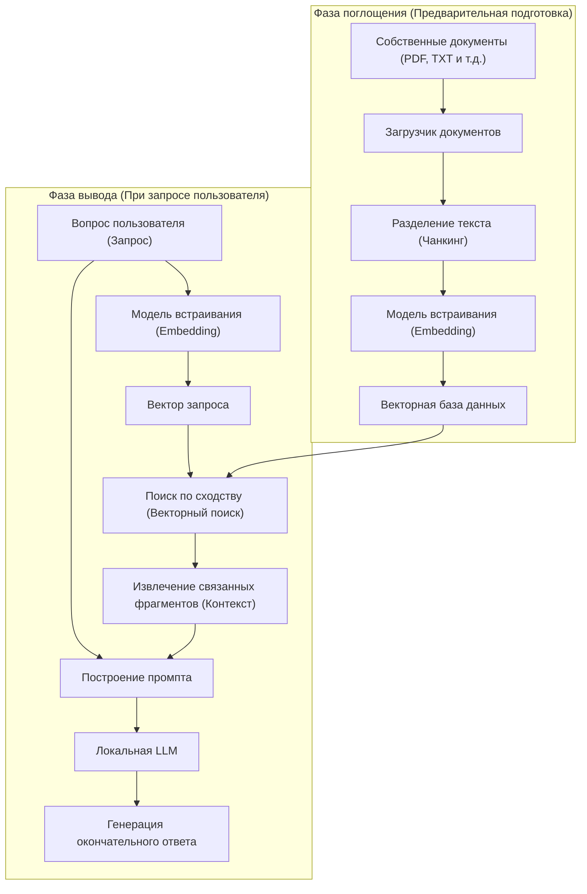
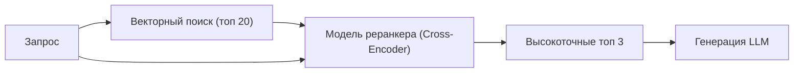

# Введение

В последние годы развитие больших языковых моделей (LLM) поражает воображение: множество ИИ, во главе с ChatGPT и Claude, проникают в нашу жизнь и работу. Однако у обычных LLM есть очевидная слабость: они знают только "публичную информацию на момент обучения". Естественно, они не могут ответить на вопросы, касающиеся "приватных документов", таких как внутренние правила компании, личные заметки или неопубликованные проектные материалы. Если попытаться заставить их ответить, возрастает риск генерации правдоподобной лжи, не соответствующей действительности (галлюцинаций).

В связи с этим сегодня в мире взрывными темпами распространяется технологическая архитектура **RAG (Retrieval-Augmented Generation: генерация с дополненной выборкой)**. Использование RAG позволяет динамически предоставлять LLM собственные знания из внешней базы данных, на основе которых можно генерировать точные и обоснованные ответы.

Кроме того, при работе с корпоративными данными или личной конфиденциальной информацией передача данных в облачные API, такие как OpenAI, часто недопустима с точки зрения политики безопасности. Именно здесь возникает потребность в создании "Локального RAG" в сочетании с **локальным ИИ** (LLM, полностью работающей на вашем ПК или локальном сервере).

В этой статье мы подробно рассмотрим все: от базовой теории RAG до конкретных методов реализации локального RAG с использованием Python, математической основы (механизм векторного поиска) и продвинутых методов запуска системы в рабочую среду.

---

# 1. Общая архитектура RAG

RAG — это не единая модель ИИ, а системная архитектура, в которой взаимодействуют несколько компонентов. Она условно делится на две фазы: "фаза поглощения (загрузка данных)" и "фаза поиска и генерации".

Следующая диаграмма Mermaid показывает общую картину системы RAG.



## Фаза поглощения (Предварительная подготовка)
1. **Загрузка документов**: Загрузка неструктурированных данных, таких как PDF, Word, текстовые файлы и т.д.
2. **Чанкинг (разделение текста)**: Разделение длинных текстов на осмысленные фрагменты (чанки) для того, чтобы они поместились в ограничение на ввод LLM (контекстное окно) и для повышения точности поиска.
3. **Эмбеддинг (векторизация)**: Передача разделенных чанков в модель встраивания (Embedding Model) и преобразование их в массивы чисел (векторы) размерностью от сотен до тысяч.
4. **Сохранение в базу данных**: Сохранение преобразованных векторов и связывание их с исходными текстовыми данными в векторной базе данных (Vector DB).

## Фаза вывода (Во время выполнения)
1. **Векторизация запроса**: Векторизация вопроса пользователя с использованием той же модели встраивания, что и при предварительной подготовке.
2. **Поиск по сходству**: Расчет сходства между вектором запроса и векторами документов в базе данных для получения нескольких наиболее семантически близких (релевантных) фрагментов текста.
3. **Построение промпта**: Объединение полученных связанных текстов в качестве "контекста (фоновых знаний)" с вопросом пользователя для создания промпта ввода в LLM.
4. **Генерация ответа**: Получив расширенный промпт, LLM генерирует ответ на основе предоставленной контекстной информации.

---

# 2. Глубокое понимание векторного поиска и встраиваний (Embeddings)

В основе RAG лежит "векторный поиск (семантический поиск)". В отличие от традиционного поиска по ключевым словам (например, BM25), который основан на точном совпадении и частоте слов, векторный поиск основан на "смысловом сходстве". Например, даже если используются разные слова, такие как "собака" и "щенок", "ПК" и "компьютер", они будут найдены, если их значения близки.

## Что такое модель встраивания (Embedding Model)?

Модель встраивания — это нейронная сеть, которая принимает на вход текст на естественном языке и выводит плотный вектор (Dense Vector) фиксированной длины. Обычные модели (например, `text-embedding-3-small` или модель с открытым исходным кодом `multilingual-e5-large`) отображают текст в векторы вещественных чисел размерностью 384 или 1024.

В этом многомерном пространстве (скрытом пространстве) они обучены так, что чем ближе по смыслу предложения, тем меньше расстояние между ними в координатном пространстве.

## Математическая основа расчета сходства: Косинусное сходство

Когда векторная база данных ищет связанные документы, наиболее часто используемой метрикой расстояния является **косинусное сходство (Cosine Similarity)**. В отличие от евклидова расстояния (абсолютного расстояния в пространстве), косинусное сходство фокусируется на "угле между двумя векторами". Поскольку оно менее подвержено влиянию длины предложения (нормы вектора), оно очень хорошо подходит для расчета сходства текстов.

В виде формулы косинусное сходство между векторами $\mathbf{A}$ и $\mathbf{B}$ выглядит следующим образом:

$$ \text{Cosine Similarity}(\mathbf{A}, \mathbf{B}) = \cos(\theta) = \frac{\mathbf{A} \cdot \mathbf{B}}{\|\mathbf{A}\| \|\mathbf{B}\|} = \frac{\sum_{i=1}^{n} A_i B_i}{\sqrt{\sum_{i=1}^{n} A_i^2} \sqrt{\sum_{i=1}^{n} B_i^2}} $$

- $\mathbf{A} \cdot \mathbf{B}$ обозначает скалярное произведение (Dot Product).
- $\|\mathbf{A}\|$ обозначает L2-норму (длину) вектора $\mathbf{A}$.
- $n$ — это размерность вектора.

Косинусное сходство принимает значения от -1 до 1.
- **Ближе к 1**: направления двух векторов почти совпадают (очень схожи по смыслу)
- **Ближе к 0**: два вектора перпендикулярны (не связаны)
- **Ближе к -1**: два вектора указывают в противоположные стороны (противоположные по смыслу)

Современные векторные БД (Chroma, FAISS, Qdrant и т.д.) используют алгоритм приближенного поиска ближайших соседей (ANN), называемый HNSW (Hierarchical Navigable Small World), который оптимизирован для поиска документов с высоким косинусным сходством среди миллионов векторных данных за миллисекунды.

---

# 3. Технологический стек для создания локального RAG

Для создания полностью локального RAG, не зависящего от облака, мы будем использовать экосистему с открытым исходным кодом. Ниже представлен рекомендуемый технологический стек.

1. **Языковая модель (LLM)**
   - Инструмент: `Ollama` или `Llama.cpp`
   - Модель: легкие и высокопроизводительные открытые модели, такие как `Llama-3-8B-Instruct`, `Gemma-2-9B-It`, `Qwen2-7B-Instruct`. Для задач на японском языке подходят модели, настроенные на японский язык, такие как `Llama-3-ELYZA-JP-8B`.
2. **Модель встраивания (Embedding)**
   - Модель: `intfloat/multilingual-e5-large` или `BAAI/bge-m3`. При локальном запуске обычно их скачивают с Hugging Face и запускают с помощью Sentence-Transformers.
3. **Векторная база данных (Vector DB)**
   - `ChromaDB`: основана на Python, очень проста в настройке. Идеально подходит для локальной разработки.
   - `FAISS`: высокоскоростная библиотека векторного поиска, разработанная Meta.
   - `Qdrant` / `Milvus`: для более масштабных проектов и рабочих сред.
4. **Фреймворк оркестрации**
   - `LangChain`: фактический стандарт для связывания (Chain) компонентов.
   - `LlamaIndex`: фреймворк для подключения данных, специально ориентированный на RAG.

В этот раз мы реализуем систему, используя самую простую в освоении комбинацию: **LangChain + ChromaDB + Ollama + HuggingFaceEmbeddings**.

---

# 4. Учебное руководство по реализации: Создание полного локального RAG на Python

Начиная с этого момента, мы будем создавать локальный RAG, написав фактический код на Python. Пожалуйста, предварительно установите Ollama на свой ПК и запустите его в фоновом режиме. Также загрузите модель в Ollama (например: `ollama run llama3`).

## Шаг 1: Установка необходимых библиотек

```bash
pip install langchain langchain-community langchain-huggingface
pip install chromadb sentence-transformers pypdf
```

## Шаг 2: Обзор кода реализации

Ниже представлен полный Python-скрипт для загрузки PDF-файла, его векторизации и ответов на вопросы с помощью локальной LLM.

```python
import os
from langchain_community.document_loaders import PyPDFLoader
from langchain_text_splitters import RecursiveCharacterTextSplitter
from langchain_huggingface import HuggingFaceEmbeddings
from langchain_community.vectorstores import Chroma
from langchain_community.llms import Ollama
from langchain_core.prompts import PromptTemplate
from langchain.chains import RetrievalQA

def main():
    # 1. Загрузка документов
    print("Загрузка документов...")
    # Укажите путь к PDF, который нужно загрузить
    file_path = "sample_company_policy.pdf" 
    loader = PyPDFLoader(file_path)
    documents = loader.load()

    # 2. Разделение на чанки (Text Splitting)
    # Разделение на фрагменты подходящего размера, не нарушая смысла текста
    text_splitter = RecursiveCharacterTextSplitter(
        chunk_size=500,     # Максимальное количество символов в одном чанке
        chunk_overlap=50,   # Количество перекрывающихся символов между чанками (предотвращает потерю контекста)
        separators=["\n\n", "\n", "。", "、", " ", ""]
    )
    chunks = text_splitter.split_documents(documents)
    print(f"Разделено на {len(chunks)} чанков.")

    # 3. Инициализация модели встраивания (Local HuggingFace Model)
    # Использование мультиязычной модели
    print("Загрузка модели встраивания...")
    embeddings = HuggingFaceEmbeddings(
        model_name="intfloat/multilingual-e5-large",
        model_kwargs={'device': 'cpu'} # Используйте 'cuda' или 'mps', если есть GPU
    )

    # 4. Создание векторной базы данных (Chroma)
    print("Создание векторной базы данных...")
    persist_directory = "./chroma_db"
    vectorstore = Chroma.from_documents(
        documents=chunks,
        embedding=embeddings,
        persist_directory=persist_directory
    )
    # Создание ретривера (поисковика). Настройка на получение топ-3 связанных документов
    retriever = vectorstore.as_retriever(search_kwargs={"k": 3})

    # 5. Инициализация локальной LLM (Ollama)
    print("Подключение к локальной LLM...")
    # Предварительно загрузите модель, например, с помощью 'ollama pull llama3'
    llm = Ollama(model="llama3")

    # 6. Определение шаблона промпта
    prompt_template = """Вы - превосходный ассистент, хорошо разбирающийся в правилах и внутренней информации компании.
Используя ТОЛЬКО следующий контекст (фоновую информацию), подробно ответьте на вопрос пользователя.
Если ответ не может быть найден в контексте, не стройте догадок и честно ответьте «Я не могу найти ответ в предоставленной информации».

【Контекст】
{context}

【Вопрос】
{question}

【Ответ】:
"""
    PROMPT = PromptTemplate(
        template=prompt_template, 
        input_variables=["context", "question"]
    )

    # 7. Создание цепочки RAG
    qa_chain = RetrievalQA.from_chain_type(
        llm=llm,
        chain_type="stuff",
        retriever=retriever,
        return_source_documents=True, # Настройка возврата источников информации
        chain_type_kwargs={"prompt": PROMPT}
    )

    # 8. Выполнение вопроса
    query = "Расскажите об условиях оплаты транспортных расходов при удаленной работе."
    print(f"\nВопрос: {query}\n")
    
    result = qa_chain.invoke({"query": query})
    
    print("【Ответ】")
    print(result['result'])
    print("\n---")
    print("【Использованные источники】")
    for doc in result['source_documents']:
        print(f"- Страница {doc.metadata.get('page', 'неизвестно')}: {doc.page_content[:50]}...")

if __name__ == "__main__":
    main()
```

## Объяснение ключевых моментов кода

1. **RecursiveCharacterTextSplitter**:
   Это наиболее рекомендуемый разделитель для естественного языка. Он пытается разделить текст в порядке: абзац (`\n\n`), строка (`\n`), точка (`。`), чтобы разделить текст таким образом, чтобы он уместился в заданный `chunk_size`, сохраняя при этом смысловые блоки насколько это возможно. Установив `chunk_overlap`, вы предотвращаете потерю информации на границах контекста.
2. **HuggingFaceEmbeddings**:
   `intfloat/multilingual-e5-large` — это очень мощная многоязычная модель встраивания с открытым исходным кодом. Вы можете векторизовать текст оффлайн в локальной памяти, не используя облачные API (например, `text-embedding-ada-002` от OpenAI).
3. **ChromaDB**:
   Она работает в оперативной памяти или локальном хранилище (на базе SQLite), поэтому вам не нужно настраивать сложный сервер базы данных. Указав `persist_directory`, вы можете пропустить процесс векторизации при повторном выполнении и загрузить базу данных с диска.

---

# 5. Продвинутые методы RAG (Advanced RAG Techniques)

Базовая система RAG (Naive RAG), созданная в приведенном выше руководстве, также будет работать, но если в рабочей среде требуется высокая точность ответов, необходимо внедрить следующие продвинутые методы.

## 5.1 Гибридный поиск (Hybrid Search)
Векторный поиск хорошо справляется с пониманием "смысла", но он может плохо справляться со строгим поиском по ключевым словам, таким как "определенные имена собственные", "номера моделей продуктов" и "идентификаторы сотрудников".
Следовательно, параллельно выполняя **семантический поиск** (с помощью векторного поиска) и **поиск по ключевым словам** (с использованием алгоритмов типа BM25), а затем оценивая и объединяя результаты обоих подходов (используя методы типа Reciprocal Rank Fusion, RRF), можно радикально сократить количество пропусков в поиске.

## 5.2 Повторное ранжирование (Re-ranking)
Векторный поиск работает быстро, но он не обязательно оценивает точную контекстную релевантность. Общий конвейер для повышения точности поиска выглядит следующим образом:
1. **Начальный поиск (First-stage Retrieval)**: Широкий и поверхностный поиск из векторной БД, извлечение примерно 20–30 связанных чанков.
2. **Повторная оценка (Re-ranking)**: Использование другой, более "тяжелой" модели машинного обучения, называемой Cross-Encoder (например, `bge-reranker`), для подачи пар запроса пользователя и извлеченного чанка и пересчета баллов семантической релевантности.
3. **Отбор**: Только верхние 3–5 с наивысшими баллами передаются в промпт LLM в качестве окончательного контекста.

Этот метод предотвращает передачу нерелевантной шумовой информации в LLM и может значительно повысить точность (Precision) ответов.



## 5.3 Семантический чанкинг и поиск родительского документа
Существует метод под названием "Semantic Chunking" (Семантический чанкинг), который использует ИИ для обнаружения изменений в смысле предложений и разделяет текст на их основе, а не механически разбивает текст на фиксированное количество символов.
Кроме того, существует метод "Parent Document Retriever" (Поиск родительского документа), в котором векторизация выполняется на очень маленьких единицах (например, предложениях) для высокоточного поиска, но при передаче в LLM передается "исходный большой абзац (родительский документ)", содержащий это предложение, что обеспечивает LLM достаточным контекстом.

---

# 6. Проблемы и решения при эксплуатации локального RAG

При создании и эксплуатации RAG в локальной среде существуют специфические препятствия.

- **Нехватка VRAM (видеопамяти)**:
  Чтобы запустить локальную LLM с практичной скоростью (десятки токенов в секунду), вам необходимо загрузить модель в VRAM вашего GPU. Для работы модели класса 8B в формате fp16 (16-битная плавающая запятая) требуется около 16 ГБ VRAM, но с использованием технологии **квантования (Quantization)** (сжатие до 4 или 8 бит, например, в форматах GGUF или AWQ), ее можно заставить работать достаточно быстро даже на 8 ГБ VRAM (например, на стандартном игровом ПК). Llama.cpp и Ollama поддерживают эти форматы квантования из коробки.
- **Ограничение контекстного окна**:
  Если объем полученного контекста слишком велик, он может превысить лимит ввода LLM (лимит токенов) или модель может "забыть" среднюю часть информации (феномен Lost in the middle). Важно настраивать количество извлекаемых чанков и тщательно отбирать их с помощью вышеупомянутых технологий реранжирования.
- **Управление свежестью данных**:
  Если исходные документы обновляются, соответствующие векторы документов в векторной базе данных также должны быть обновлены или удалены (операции CRUD). Поскольку ChromaDB поддерживает обновление на основе идентификаторов документов, практично управлять хеш-значениями файлов и настраивать пакетную обработку для синхронизации только изменений.

---

# Заключение

RAG (Retrieval-Augmented Generation) — это мощная парадигма, которая превращает ИИ из обычного универсального ассистента в вашего «персонального эксперта» или «эксперта, специализирующегося на ваших внутренних задачах».

Мы увидели, что даже с высокими требованиями к конфиденциальности, не позволяющими использовать облачные сервисы, можно относительно легко создать полноценную среду «локального RAG», комбинируя элементы экосистемы с открытым исходным кодом, такие как Ollama, LangChain и ChromaDB.

Основываясь на математическом понимании векторных пространств и продвинутых подходах, таких как разделение текста и реранжирование, рассмотренных в этой статье, попробуйте разработать собственную оригинальную систему ИИ, используя свои данные. Скорость эволюции локального ИИ поразительна, и система, которую вы построили сегодня, может быть мгновенно обновлена по производительности завтра, просто заменив ее на еще более умную легкую модель.

---
*В этом блоге мы продолжим публиковать подробные статьи о технологиях ИИ и RAG. Если у вас есть какие-либо вопросы или отзывы, пожалуйста, оставьте их в разделе комментариев.*
