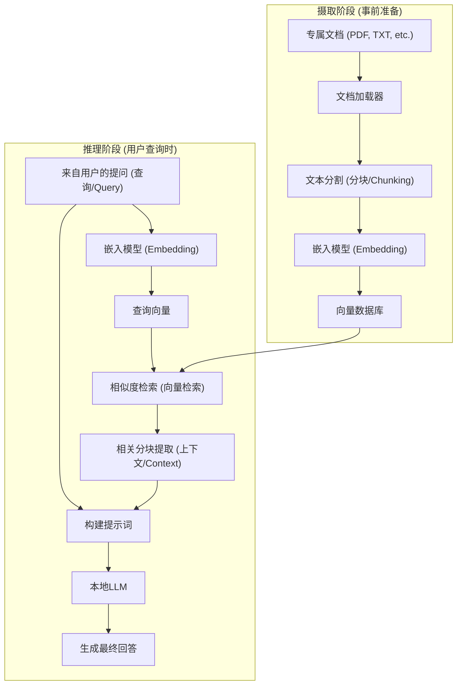
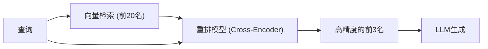

# 前言

近年来，大型语言模型（LLM）的进化引人瞩目，以ChatGPT和Claude等为首的众多AI已经渗透到我们的生活和工作中。然而，通用的LLM存在一个明显的弱点。那就是它们只知道“训练时的公开信息”。对于公司内部规定、个人笔记、未公开的项目资料等“私密文档”相关的问题，它们理所当然地无法回答。如果强行让它们回答，产生听起来很有道理但与事实不符的谎言（幻觉/Hallucination）的风险就会增加。

因此，目前在全世界爆发性普及的是**RAG（Retrieval-Augmented Generation：检索增强生成）**这一技术架构。通过使用RAG，可以动态地从外部数据库向LLM提供专有知识，并让其基于这些知识生成准确且有根据的回答。

此外，在处理企业领域或个人机密信息时，将数据发送到OpenAI等基于云的API在安全策略上往往是不被允许的。因此，我们需要构建结合了**本地AI**（在自己的PC或本地服务器上完全运行的LLM）的“本地RAG”。

本文将从RAG的基础理论开始，彻底解说使用Python构建本地RAG的具体实现方法、数学背景（向量检索的原理），以及使系统在生产环境中运行的高级技巧。

---

# 1. RAG的整体架构

RAG不是单一的AI模型，而是一个由多个组件协同工作的系统架构。它大致分为“摄取（数据导入）阶段”和“检索与生成（Retrieval & Generation）阶段”两部分。

以下Mermaid图展示了RAG系统的全貌。



## 摄取阶段（事前准备）
1. **加载文档**：读取PDF、Word、文本文件等非结构化数据。
2. **分块（文本分割）**：为了适应LLM的输入限制（上下文窗口），并提高检索精度，将长文章分割成有意义的块（Chunk）。
3. **嵌入（向量化）**：将分割好的块输入到嵌入模型（Embedding Model）中，并将其转换为数百到数千维的数值数组（向量）。
4. **保存到数据库**：将转换后的向量与原始文本数据关联，并保存到向量数据库（Vector DB）中。

## 推理阶段（运行时）
1. **查询的向量化**：使用与事前准备相同的嵌入模型，将用户的提问文本向量化。
2. **相似度检索**：在查询向量和数据库中的文档向量之间进行相似度计算，获取几条语义上最接近（相关性最高）的文本块。
3. **构建提示词**：将获取的相关文本作为“上下文（背景知识）”与用户的提问文本结合，创建输入给LLM的提示词（Prompt）。
4. **生成回答**：接收到增强提示词的LLM，基于附加的上下文信息生成回答。

---

# 2. 深入理解向量检索与嵌入（Embeddings）

构成RAG核心的是“向量检索（语义检索）”。与传统的基于单词完全匹配或频率的关键字检索（如BM25）不同，向量检索基于“语义的相似性”。例如，“狗”和“小狗”、“PC”和“电脑”，即使是不同的单词，只要意思相近就会被检索到。

## 什么是嵌入模型（Embedding Model）？

嵌入模型是一种神经网络，它接收自然语言文本作为输入，并输出固定长度的稠密向量（Dense Vector）。一般的模型（例如 `text-embedding-3-small` 或开源的 `multilingual-e5-large`）会将文本映射为384维或1024维的实数向量。

在这个多维空间（潜在空间）中，模型被训练为：意思越相似的文章，在坐标空间上的距离越近。

## 相似度计算的数学背景：余弦相似度

当向量数据库检索相关文档时，最常用的距离指标是**余弦相似度（Cosine Similarity）**。与欧几里得距离（空间上的绝对距离）不同，余弦相似度关注“两个向量之间的夹角”。因为它不容易受文章长度（向量的范数）影响，所以非常适合计算文本的相似度。

用数学公式表示，向量 $\mathbf{A}$ 和 $\mathbf{B}$ 的余弦相似度如下所示：

$$ \text{Cosine Similarity}(\mathbf{A}, \mathbf{B}) = \cos(\theta) = \frac{\mathbf{A} \cdot \mathbf{B}}{\|\mathbf{A}\| \|\mathbf{B}\|} = \frac{\sum_{i=1}^{n} A_i B_i}{\sqrt{\sum_{i=1}^{n} A_i^2} \sqrt{\sum_{i=1}^{n} B_i^2}} $$

- $\mathbf{A} \cdot \mathbf{B}$ 表示内积（Dot Product）。
- $\|\mathbf{A}\|$ 表示向量 $\mathbf{A}$ 的L2范数（长度）。
- $n$ 是向量的维数。

余弦相似度的取值范围是 -1 到 1。
- **接近 1**：两个向量的方向几乎相同（意思非常相似）
- **接近 0**：两个向量正交（无关）
- **接近 -1**：两个向量方向完全相反（意思相反）

最近的向量数据库（Chroma, FAISS, Qdrant等）采用了被称为HNSW（Hierarchical Navigable Small World）的近似最近邻搜索（ANN）算法，经过优化，即使在数百万条向量数据中，也能在毫秒级内检索出余弦相似度高的文档。

---

# 3. 构建本地RAG的技术栈

为了构建完全不依赖云端的本地RAG，我们将利用开源生态系统。以下是推荐的技术栈。

1. **语言模型 (LLM)**
   - 工具：`Ollama` 或 `Llama.cpp`
   - 模型：`Llama-3-8B-Instruct`、`Gemma-2-9B-It`、`Qwen2-7B-Instruct` 等轻量且高性能的开源模型。对于日语任务，经过日语微调的 `Llama-3-ELYZA-JP-8B` 等较为合适。
2. **嵌入模型 (Embedding)**
   - 模型：`intfloat/multilingual-e5-large` 或 `BAAI/bge-m3`。在本地运行时，通常从Hugging Face下载并使用Sentence-Transformers来执行。
3. **向量数据库 (Vector DB)**
   - `ChromaDB`：基于Python，设置极其简单。非常适合本地开发。
   - `FAISS`：Meta开发的高速向量检索库。
   - `Qdrant` / `Milvus`：规模更大，面向生产环境。
4. **编排框架**
   - `LangChain`：用于连接（Chain）各组件的事实标准。
   - `LlamaIndex`：特别专注于RAG的数据连接框架。

这次我们将使用最容易导入的 **LangChain + ChromaDB + Ollama + HuggingFaceEmbeddings** 组合来进行实现。

---

# 4. 实现教程：使用Python构建完整的本地RAG

接下来，我们将实际编写Python代码来构建本地RAG。请预先在PC上安装Ollama并在后台启动它。另外，在Ollama上拉取模型（例如：`ollama run llama3`）。

## Step 1: 安装必要的库

```bash
pip install langchain langchain-community langchain-huggingface
pip install chromadb sentence-transformers pypdf
```

## Step 2: 实现代码全貌

以下是一个完整的Python脚本，用于读取PDF文件，将其向量化，并让本地LLM进行问答。

```python
import os
from langchain_community.document_loaders import PyPDFLoader
from langchain_text_splitters import RecursiveCharacterTextSplitter
from langchain_huggingface import HuggingFaceEmbeddings
from langchain_community.vectorstores import Chroma
from langchain_community.llms import Ollama
from langchain_core.prompts import PromptTemplate
from langchain.chains import RetrievalQA

def main():
    # 1. 加载文档
    print("正在加载文档...")
    # 指定要读取的PDF的路径
    file_path = "sample_company_policy.pdf" 
    loader = PyPDFLoader(file_path)
    documents = loader.load()

    # 2. 文本分块（Text Splitting）
    # 在不破坏文章含义的前提下，分割成适当的大小
    text_splitter = RecursiveCharacterTextSplitter(
        chunk_size=500,     # 每个分块的最大字符数
        chunk_overlap=50,   # 前后分块的重叠字符数（防止上下文断裂）
        separators=["\n\n", "\n", "。", "、", " ", ""]
    )
    chunks = text_splitter.split_documents(documents)
    print(f"已分割成 {len(chunks)} 个块。")

    # 3. 初始化嵌入模型 (Local HuggingFace Model)
    # 使用支持多语言的强大模型
    print("正在加载嵌入模型...")
    embeddings = HuggingFaceEmbeddings(
        model_name="intfloat/multilingual-e5-large",
        model_kwargs={'device': 'cpu'} # 如果有GPU，使用 'cuda' 或 'mps'
    )

    # 4. 构建向量数据库 (Chroma)
    print("正在构建向量数据库...")
    persist_directory = "./chroma_db"
    vectorstore = Chroma.from_documents(
        documents=chunks,
        embedding=embeddings,
        persist_directory=persist_directory
    )
    # 创建检索器（Retriever）。设置为获取排名前3的相关文档
    retriever = vectorstore.as_retriever(search_kwargs={"k": 3})

    # 5. 初始化本地LLM (Ollama)
    print("正在连接本地LLM...")
    # 必须事先通过 'ollama pull llama3' 等命令获取模型
    llm = Ollama(model="llama3")

    # 6. 定义提示词模板
    prompt_template = """你是一位熟悉公司规定和内部信息的优秀助手。
请仅使用以下提供的上下文（背景信息），用中文详细回答用户的问题。
如果你在上下文中找不到答案，请不要随意猜测，而是诚实地回答“根据提供的信息无法得知”。

【上下文】
{context}

【问题】
{question}

【回答】:
"""
    PROMPT = PromptTemplate(
        template=prompt_template, 
        input_variables=["context", "question"]
    )

    # 7. 构建RAG链
    qa_chain = RetrievalQA.from_chain_type(
        llm=llm,
        chain_type="stuff",
        retriever=retriever,
        return_source_documents=True, # 设置是否返回信息源
        chain_type_kwargs={"prompt": PROMPT}
    )

    # 8. 执行提问
    query = "请告诉我关于远程办公的交通费报销条件。"
    print(f"\n问题: {query}\n")
    
    result = qa_chain.invoke({"query": query})
    
    print("【回答】")
    print(result['result'])
    print("\n---")
    print("【参考的信息源】")
    for doc in result['source_documents']:
        print(f"- 第 {doc.metadata.get('page', '未知')} 页: {doc.page_content[:50]}...")

if __name__ == "__main__":
    main()
```

## 代码要点解说

1. **RecursiveCharacterTextSplitter**:
   这是在自然语言分割中最被推荐的分割器。它会尝试按照段落(`\n\n`)、行(`\n`)、句号(`。`)的顺序进行分割，在尽可能保持语义完整性的同时，使其适应指定的 `chunk_size`。通过设置 `chunk_overlap`，可以防止由于上下文边界被切断而导致的信息丢失。
2. **HuggingFaceEmbeddings**:
   `intfloat/multilingual-e5-large` 是一款非常强大的支持多语言的开源嵌入模型。你可以不使用云端API（如OpenAI的 `text-embedding-ada-002` 等），在本地内存中离线地将文本向量化。
3. **ChromaDB**:
   因为它在内存中或作为本地存储（基于SQLite）运行，所以不需要建立复杂的数据库服务器。通过指定 `persist_directory`，可以在重新运行时跳过向量化过程，直接从磁盘读取数据库。

---

# 5. 高级RAG技术（Advanced RAG Techniques）

虽然使用上述教程构建的基础RAG系统（Naive RAG）也能运行，但在生产环境中如果要求很高的回答精度，就需要引入以下高级技术。

## 5.1 混合检索 (Hybrid Search)
向量检索擅长捕捉“语义”，但有时不擅长精确的关键字检索，比如“特定的专有名词”、“产品型号”、“员工ID”等。
因此，将基于向量检索的**语义检索**和基于BM25算法等的**关键字检索**并行执行，然后对两者的结果进行打分并合并（使用倒数排名融合；RRF等方法），可以大幅减少检索遗漏。

## 5.2 重排 (Re-ranking)
向量检索速度很快，但它并不一定能准确评估上下文的语义契合度。为了提高检索精度，一般的管道流程如下：
1. **初次检索 (First-stage Retrieval)**: 从向量数据库中，广泛而浅层地获取约20~30个相关分块。
2. **重新评估 (Re-ranking)**: 使用被称为Cross-Encoder的另一种参数量更大的机器学习模型（例如：`bge-reranker` 等），输入用户查询和获取到的分块的配对，重新计算语义契合度分数。
3. **筛选**: 仅挑选出分数最高的3~5个作为最终的上下文，传递给LLM的提示词中。

通过这种方法，可以防止无关的噪声信息传递给LLM，从而大幅提高回答的精度（Precision）。



## 5.3 语义分块与父文档检索
有一种名为“Semantic Chunking”的方法，它不是按照固定字符数机械地分割文本，而是使用AI检测文章语义的转折点来进行分割。
此外，“Parent Document Retriever（父文档检索）”这种方法，在检索时以非常小的单位（如句子等）进行向量化以实现高精度的检索，而在传递给LLM时，则传递包含该句子的“原始大段落（父文档）”，从而为LLM提供充足的上下文（Context）。

---

# 6. 本地RAG运行时的挑战与对策

在本地环境中构建和运行RAG时，存在一些特有的障碍。

- **VRAM（显存）枯竭**:
  为了让本地LLM以实用的速度（每秒数十个Token）运行，必须将模型加载到GPU的VRAM中。以fp16（16位浮点数）运行8B级别的模型大约需要16GB的VRAM。但是，通过使用**量化（Quantization）**技术（如GGUF、AWQ格式等，将其压缩为4bit或8bit的技术），即使是8GB的VRAM（如一般的游戏PC等）也能足够高速地运行。Llama.cpp和Ollama原生支持这些量化格式。
- **上下文窗口的限制**:
  如果检索获取到的上下文数量过多，可能会超出LLM的输入上限（Token限制），或者导致模型忘记中间部分的信息（Lost in the middle现象）。调整提取的分块数量，以及通过上述重排技术进行严格筛选是不可或缺的。
- **数据的时效性管理**:
  当源文档被更新时，向量数据库中对应文档的向量也必须进行更新或删除（CRUD操作）。因为ChromaDB支持基于文档ID的更新，所以通过管理文件的哈希值，并编写仅同步差异的批处理程序是非常实用的做法。

---

# 总结

RAG（检索增强生成）是一种强大的范式，它将AI从通用的助手进化为“你的专属专家”或“专注于公司内部业务的专家”。

我们了解到，即使在无法使用云服务、保密性要求极高的情况下，通过组合Ollama、LangChain、ChromaDB等开源生态系统，也能相对容易地构建出完全的“本地RAG”环境。

基于本文解说的向量空间的数学原理，以及文本分块、重排等高级方法，请务必尝试使用您自己的数据来开发原创的AI系统。本地AI的进化速度非常惊人，今天构建的系统，明天只需替换为更聪明的轻量级模型，就能在瞬间完成性能的升级。

---
*本博客今后将继续发布关于AI技术和RAG的深度文章。如果您有任何问题或反馈，请务必在评论区留言。*
