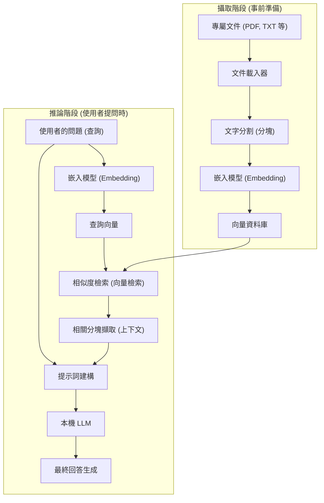
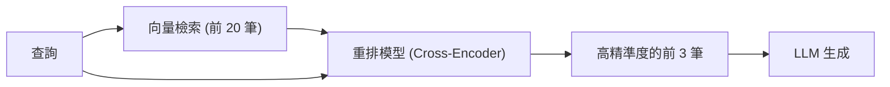

# 前言

近年來，大型語言模型（LLM）的進化令人矚目，以 ChatGPT 和 Claude 為首的許多 AI 已經滲透到我們的生活和業務中。然而，一般的 LLM 存在著明顯的弱點。那就是它們只知道「訓練時的公開資訊」。對於公司內部規定、個人筆記、未公開的專案資料等「私有文件」相關的提問，它們自然無法回答。如果硬要它們回答，就會增加產生與事實不符、似是而非的謊言（幻覺，Hallucination）的風險。

因此，目前在世界各地爆發性普及的技術架構就是 **RAG（Retrieval-Augmented Generation，檢索增強生成）**。透過使用 RAG，可以從外部資料庫動態地提供專有知識給 LLM，讓它能基於這些知識產生準確且有根據的回答。

此外，在處理企業領域或個人機密資訊時，將資料傳送到 OpenAI 等雲端 API 在資安政策上通常是不被允許的。這時就需要結合**本機 AI**（在自己的電腦或地端伺服器上獨立運作的 LLM）來建構「本機 RAG（Local RAG）」。

本文將從 RAG 的基礎理論開始，徹底解說使用 Python 實作本機 RAG 的具體方法、數學背景（向量檢索的原理），以及讓系統上線運作的進階技巧。

---

# 1. RAG 的整體架構

RAG 並非單一的 AI 模型，而是多個元件協同運作的系統架構。大致可分為「攝取（資料匯入）階段」與「檢索與生成階段」兩個部分。

以下的 Mermaid 圖表展示了 RAG 系統的整體樣貌。



## 攝取階段（事前準備）
1. **讀取文件**：讀取 PDF、Word、純文字檔等非結構化資料。
2. **分塊（文字分割）**：為了符合 LLM 的輸入限制（上下文視窗大小）並提高檢索精準度，將長篇文章分割成有意義的區塊（Chunk）。
3. **嵌入（向量化）**：將分割後的區塊輸入至嵌入模型（Embedding Model），轉換成數百到數千維的數值陣列（向量）。
4. **儲存至資料庫**：將轉換後的向量與原始文字資料關聯起來，儲存到向量資料庫（Vector DB）中。

## 推論階段（執行時）
1. **查詢向量化**：使用與事前準備相同的嵌入模型，將使用者提出的問題進行向量化。
2. **相似度檢索**：在查詢向量與資料庫中的文件向量之間進行相似度計算，取得在語意上最接近（關聯性最高）的前幾筆文字區塊。
3. **建構提示詞**：將取得的相關文字作為「上下文（背景知識）」與使用者的問題結合，建立提供給 LLM 的輸入提示詞。
4. **生成回答**：接收到擴充提示詞的 LLM，根據附加的上下文資訊生成回答。

---

# 2. 深入理解向量檢索與嵌入（Embeddings）

RAG 的核心在於「向量檢索（語意檢索）」。傳統的關鍵字檢索（如 BM25）是基於單詞的完全比對或出現頻率，而向量檢索則是基於「語意的相似性」。例如，「狗」與「小狗」、「PC」與「個人電腦」，即使單字不同，只要語意相近就能被檢索出來。

## 什麼是嵌入模型（Embedding Model）？

嵌入模型是一種神經網路，它接收自然語言的文字作為輸入，並輸出固定長度的密集向量（Dense Vector）。常見的模型（例如 `text-embedding-3-small` 或開源的 `multilingual-e5-large`）會將文字對映到 384 維或 1024 維的實數向量。

在這個多維空間（潛在空間）中，語意越相似的句子，在座標空間上的距離就越近。

## 相似度計算的數學背景：餘弦相似度

當向量資料庫在檢索相關文件時，最常使用的距離指標是**餘弦相似度（Cosine Similarity）**。與歐幾里得距離（空間上的絕對距離）不同，餘弦相似度關注的是「兩個向量之間的夾角」。因為它較不易受文章長度（向量的範數）影響，所以非常適合用於文字的相似度計算。

用數學公式表示的話，向量 $\mathbf{A}$ 和 $\mathbf{B}$ 的餘弦相似度如下：

$$ \text{Cosine Similarity}(\mathbf{A}, \mathbf{B}) = \cos(\theta) = \frac{\mathbf{A} \cdot \mathbf{B}}{\|\mathbf{A}\| \|\mathbf{B}\|} = \frac{\sum_{i=1}^{n} A_i B_i}{\sqrt{\sum_{i=1}^{n} A_i^2} \sqrt{\sum_{i=1}^{n} B_i^2}} $$

- $\mathbf{A} \cdot \mathbf{B}$ 代表內積（Dot Product）。
- $\|\mathbf{A}\|$ 代表向量 $\mathbf{A}$ 的 L2 範數（長度）。
- $n$ 是向量的維度數。

餘弦相似度的值介於 -1 到 1 之間。
- **接近 1**：兩個向量的方向幾乎相同（語意非常相似）。
- **接近 0**：兩個向量互相垂直（毫無關聯）。
- **接近 -1**：兩個向量的方向完全相反（語意相反）。

最近的向量資料庫（Chroma、FAISS、Qdrant 等）採用了被稱為 HNSW（Hierarchical Navigable Small World）的近似最近鄰搜尋（ANN）演算法，經過最佳化後，即使從數百萬筆向量資料中，也能在毫秒級別內檢索出餘弦相似度高的文件。

---

# 3. 建構本機 RAG 的技術堆疊

為了建構完全不依賴雲端的本機 RAG，我們將活用開源生態系統。以下介紹推薦的技術堆疊。

1. **語言模型 (LLM)**
   - 工具：`Ollama` 或 `Llama.cpp`
   - 模型：`Llama-3-8B-Instruct`、`Gemma-2-9B-It`、`Qwen2-7B-Instruct` 等輕量且高效能的開源模型。針對日文任務，適合使用經過日文微調的 `Llama-3-ELYZA-JP-8B` 等。
2. **嵌入模型 (Embedding)**
   - 模型：`intfloat/multilingual-e5-large` 或 `BAAI/bge-m3`。若要在本機執行，通常會從 Hugging Face 下載並透過 Sentence-Transformers 執行。
3. **向量資料庫 (Vector DB)**
   - `ChromaDB`：基於 Python，設定極為簡單。最適合用於本機開發。
   - `FAISS`：Meta 開發的高速向量檢索函式庫。
   - `Qdrant` / `Milvus`：適用於更大規模且正式的生產環境。
4. **編排框架 (Orchestration Framework)**
   - `LangChain`：用於串聯各個元件（Chain）的業界標準。
   - `LlamaIndex`：特別專注於 RAG 的資料連接框架。

這次我們將使用最容易導入的組合：**LangChain + ChromaDB + Ollama + HuggingFaceEmbeddings** 來進行實作。

---

# 4. 實作教學：使用 Python 建構完整的本機 RAG

接下來，我們將實際撰寫 Python 程式碼來建構本機 RAG。請先在電腦上安裝 Ollama 並讓它在背景執行。同時，請先在 Ollama 上拉取（pull）好模型（例如：`ollama run llama3`）。

## Step 1: 安裝必要的函式庫

```bash
pip install langchain langchain-community langchain-huggingface
pip install chromadb sentence-transformers pypdf
```

## Step 2: 實作程式碼全貌

以下是讀取 PDF 檔案、將其向量化並讓本機 LLM 進行問答的完整 Python 腳本。

```python
import os
from langchain_community.document_loaders import PyPDFLoader
from langchain_text_splitters import RecursiveCharacterTextSplitter
from langchain_huggingface import HuggingFaceEmbeddings
from langchain_community.vectorstores import Chroma
from langchain_community.llms import Ollama
from langchain_core.prompts import PromptTemplate
from langchain.chains import RetrievalQA

def main():
    # 1. 讀取文件
    print("正在讀取文件...")
    # 指定要讀取的 PDF 路徑
    file_path = "sample_company_policy.pdf" 
    loader = PyPDFLoader(file_path)
    documents = loader.load()

    # 2. 文字分割（Text Splitting）
    # 為了不破壞文章語意，分割成適當的大小
    text_splitter = RecursiveCharacterTextSplitter(
        chunk_size=500,     # 每個分塊的最大字元數
        chunk_overlap=50,   # 前後分塊的重疊字元數（防止上下文斷層）
        separators=["\n\n", "\n", "。", "、", " ", ""]
    )
    chunks = text_splitter.split_documents(documents)
    print(f"已分割成 {len(chunks)} 個分塊。")

    # 3. 初始化嵌入模型 (Local HuggingFace Model)
    # 使用對日文等支援度高的多語系模型
    print("正在載入嵌入模型...")
    embeddings = HuggingFaceEmbeddings(
        model_name="intfloat/multilingual-e5-large",
        model_kwargs={'device': 'cpu'} # 若有 GPU 可改為 'cuda' 或 'mps'
    )

    # 4. 建構向量資料庫 (Chroma)
    print("正在建構向量資料庫...")
    persist_directory = "./chroma_db"
    vectorstore = Chroma.from_documents(
        documents=chunks,
        embedding=embeddings,
        persist_directory=persist_directory
    )
    # 建立檢索器（Retriever）。設定為取得前 3 筆關聯文件
    retriever = vectorstore.as_retriever(search_kwargs={"k": 3})

    # 5. 初始化本機 LLM (Ollama)
    print("正在連接至本機 LLM...")
    # 請先透過 'ollama pull llama3' 等指令取得模型
    llm = Ollama(model="llama3")

    # 6. 定義提示詞模板
    prompt_template = """你是一位精通公司規定與內部資訊的優秀助理。
請「僅」使用以下的上下文（背景資訊），詳細回答使用者的問題。
如果從上下文中找不到答案，請誠實地回答「從提供的資訊中無法得知」，不要隨意猜測。

【上下文】
{context}

【問題】
{question}

【回答】:
"""
    PROMPT = PromptTemplate(
        template=prompt_template, 
        input_variables=["context", "question"]
    )

    # 7. 建構 RAG Chain
    qa_chain = RetrievalQA.from_chain_type(
        llm=llm,
        chain_type="stuff",
        retriever=retriever,
        return_source_documents=True, # 設定是否回傳資訊來源
        chain_type_kwargs={"prompt": PROMPT}
    )

    # 8. 執行提問
    query = "請告訴我關於遠端工作時的交通費補助條件。"
    print(f"\n問題: {query}\n")
    
    result = qa_chain.invoke({"query": query})
    
    print("【回答】")
    print(result['result'])
    print("\n---")
    print("【參考的資訊來源】")
    for doc in result['source_documents']:
        print(f"- 第 {doc.metadata.get('page', '未知')} 頁: {doc.page_content[:50]}...")

if __name__ == "__main__":
    main()
```

## 程式碼重點解說

1. **RecursiveCharacterTextSplitter**:
   這是處理自然語言分割時最被推薦的分割器。它會依序嘗試段落 (`\n\n`)、換行 (`\n`)、句號 (`。`) 進行分割，盡可能在維持語意完整性的情況下，將文字分割至指定的 `chunk_size` 內。透過設定 `chunk_overlap`，可以防止上下文的交界處被截斷而流失資訊。
2. **HuggingFaceEmbeddings**:
   `intfloat/multilingual-e5-large` 是一個支援多國語言、非常強大的開源嵌入模型。不需要使用雲端 API（如 OpenAI 的 `text-embedding-ada-002` 等），即可在離線狀態下於本機記憶體中將文字向量化。
3. **ChromaDB**:
   因為它是在記憶體內或本機儲存空間（基於 SQLite）中運作，所以不需要架設複雜的資料庫伺服器。透過指定 `persist_directory`，可以在下次執行時跳過向量化的過程，直接從磁碟讀取資料庫。

---

# 5. 進階 RAG 技巧（Advanced RAG Techniques）

雖然上述教學中建構的基礎 RAG 系統（Naive RAG）也能運作，但若在生產環境中要求較高的回答準確度，就需要導入以下進階技巧。

## 5.1 混合檢索 (Hybrid Search)
向量檢索雖然擅長捕捉「語意」，但有時卻不擅長處理「特定的專有名詞」、「產品型號」、「員工 ID」等精確的關鍵字檢索。
因此，可以將基於向量檢索的**語意檢索**與使用 BM25 演算法的**關鍵字檢索**平行執行，再將兩者的結果進行評分與整合（例如使用 Reciprocal Rank Fusion; RRF 等技術），如此一來能大幅減少漏檢的情況。

## 5.2 重新排序 (Re-ranking)
向量檢索速度很快，但它並不一定能準確評估上下文的語意適合度。為了提升檢索準確度，一般的流程如下：
1. **初步檢索 (First-stage Retrieval)**：從向量資料庫中，廣泛且初步地取得約 20 到 30 筆相關分塊。
2. **重新評估 (Re-ranking)**：使用另一個較為笨重、被稱為 Cross-Encoder 的機器學習模型（例如：`bge-reranker` 等），輸入使用者查詢與取得的分塊配對，重新計算語意適合度的分數。
3. **篩選**：僅挑選分數最高的前 3 到 5 筆作為最終的上下文，傳遞給 LLM 的提示詞。

透過這種方法，可以防止無關的雜訊資訊傳入 LLM，大幅提升回答的精準度（Precision）。



## 5.3 語意分塊與父文件檢索
還有一種被稱為「語意分塊 (Semantic Chunking)」的技術，不是根據固定的字元數死板地分割文字，而是由 AI 偵測文章語意的轉折點來進行分割。
此外，「父文件檢索 (Parent Document Retriever)」技術則是為了檢索而將文字切割成非常小的單位（如句子等）以實現高精準度的檢索，但在提供給 LLM 時，則是將包含該句子的「原始大段落（父文件）」交給 LLM，藉此提供充足的上下文背景。

---

# 6. 運作本機 RAG 時的挑戰與對策

在本地環境建構並維運 RAG 時，會面臨一些特有的挑戰。

- **VRAM（顯示卡記憶體）耗盡**：
  若要讓本機 LLM 以實用的速度（每秒數十個 Token）運作，必須將模型載入 GPU 的 VRAM 中。要以 fp16（16 位元浮點數）執行 8B 等級的模型大約需要 16GB 的 VRAM。但透過**量化（Quantization）**技術（例如 GGUF 或 AWQ 格式，將其壓縮至 4bit 或 8bit 等），即使是 8GB 的 VRAM（如一般的電競電腦等）也能以足夠快的速度運作。Llama.cpp 或 Ollama 預設都有支援這些量化格式。
- **上下文視窗的限制**：
  如果檢索後取得的上下文數量過多，可能會超過 LLM 的輸入上限（Token 限制），或者模型會忘記資訊中間部分的內容（Lost in the middle 現象）。因此，調整提取的分塊數量，以及導入前述的重新排序（Re-ranking）技術進行嚴格篩選是不可或缺的。
- **資料的新鮮度管理**：
  當來源文件被更新時，必須同步更新或刪除（CRUD 操作）向量資料庫中相對應的向量資料。因為 ChromaDB 支援基於文件 ID 的更新操作，所以管理檔案的雜湊值（Hash），並撰寫批次處理程式來僅同步差異部分是比較實用的做法。

---

# 總結

RAG（檢索增強生成）是一個強大的典範轉移，它能將 AI 從一般的通用助理進化為「你的專屬專家」或「專精於公司內部業務的達人」。

我們了解到，即使在無法使用雲端服務、具有高度機密性要求的情況下，透過組合 Ollama、LangChain、ChromaDB 等開源生態系統，也能相對容易地建構出完整的「本機 RAG」環境。

請務必以上述解說的向量空間數學基礎，以及文字分割、重新排序等進階方法為基礎，嘗試使用您擁有的資料來開發專屬的 AI 系統。本機 AI 的進化速度非常驚人，您今天所建構的系統，只需在明天換上更聰明的輕量級模型，就能在瞬間提升效能。

---
*本部落格未來也會繼續發布關於 AI 技術與 RAG 的深入探討文章。如果您有任何問題或回饋，歡迎在留言區告訴我們。*
